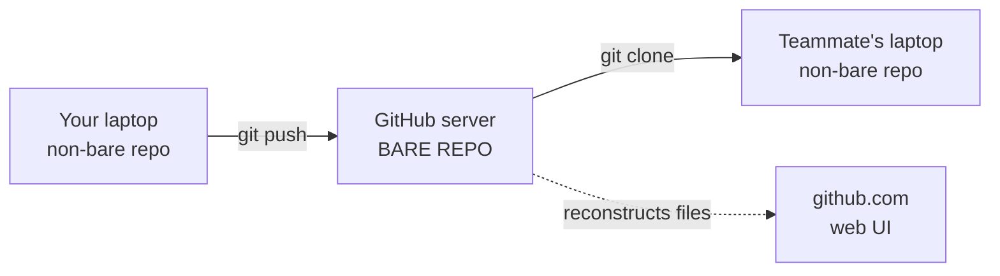
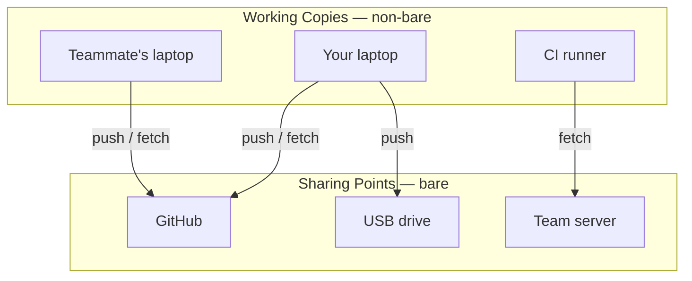

# Bare Repositories — Pure Git Database, No Working Directory

A **bare repository** is a Git repo that contains only Git's internal data (commits, refs, objects) — **no working directory, no files you can edit**. Conventionally named with a `.git` suffix, e.g. `my-project.git`. Bare repos exist for one job: to be **pushed to and cloned from**, never edited directly.

> [!info] The big reveal
> Every repo on GitHub is a bare repo. The file tree you see on github.com is dynamically reconstructed from the bare repo's object database — there are no files sitting in folders on GitHub's servers, only Git data.

---

## Bare vs Non-Bare — The Two Flavors

| Aspect                    | **Non-bare**                                | **Bare**                                       |
| ------------------------- | ------------------------------------------- | ---------------------------------------------- |
| **Working directory**     | Yes — files you edit live alongside `.git/` | No — only Git internals                        |
| **Naming convention**     | `my-project/`                               | `my-project.git/`                              |
| **What's at the top**     | Project files + hidden `.git/`              | Contents of `.git/` exposed directly           |
| **Designed for**          | Day-to-day editing & committing             | Receiving pushes, serving clones               |
| **Safe to push to?**      | ❌ working dir would desync                 | ✅ no working dir to corrupt                   |
| **Created with**          | `git init` / `git clone <url>`              | `git init --bare` / `git clone --bare <url>`   |

---

## Side-by-Side Layouts

**Non-bare** — what you've been working with:

```
my-project/
├── .git/              ← all the Git data (hidden)
│   ├── HEAD
│   ├── objects/
│   └── refs/
├── README.md          ← actual files you edit
├── src/
│   └── main.py
└── package.json
```

**Bare** — pure Git database, no working files:

```
my-project.git/
├── HEAD
├── config
├── description
├── hooks/
├── info/
├── objects/           ← all commits and content
├── refs/              ← all branches
└── packed-refs
```

> [!tip] Bare = `.git/` lifted to the top
> A bare repo's contents are *exactly* what lives inside the `.git/` folder of a non-bare repo — just exposed at the top level instead of hidden inside.

---

## Why Bare Repos Exist

> [!warning] Pushing to a non-bare repo can corrupt its working directory
> If you push commits onto a branch that's currently checked out, the working files on disk no longer match the new HEAD — files and history desync silently. Git's design rule: **anything that receives pushes shouldn't have a working directory.** A bare repo is the "no working directory" version, designed to be safely pushed to.

The bare/non-bare split maps onto two clean roles:

| Role               | Repo type | Purpose                                           |
| ------------------ | --------- | ------------------------------------------------- |
| **Working copy**   | Non-bare  | Where you edit, commit, and develop               |
| **Sharing point**  | Bare      | Where pushes land safely; where clones come from  |

Working copies push to sharing points. Sharing points serve clones to working copies.

---

## What GitHub Actually Is



When you visit a repo on github.com and see a directory tree, GitHub is **reading the latest commit and reconstructing the files on demand** from the object database. The files don't exist as files anywhere on disk — they're rebuilt from Git data each time the UI asks for them.

> [!tip] GitHub isn't magic — it's a hosted bare repo
> GitHub, GitLab, Bitbucket, your team's self-hosted server, a bare repo on a USB drive — all play the same role: a bare repo that receives pushes and serves clones. The web UI, pull requests, and issue tracker are convenience features **layered on top** of an underlying bare repo.

---

## Three Reasons to Have a Local Bare Repo

### 1. Private remote without a hosting service

```bash
# Create a bare repo on a USB drive
git init --bare /media/usb/my-project.git

# Use it as a remote from your working repo
git remote add backup /media/usb/my-project.git
git push backup main
```

No GitHub account, no internet. Functionally identical to a tiny private GitHub on your USB stick.

### 2. Team server without a hosted platform

The standard self-hosting pattern: drop a bare repo on a shared server, give the team SSH access, everyone clones and pushes to it. This is exactly how GitHub operates internally — just without the polished UI on top.

### 3. Understanding Git's true nature

A bare repo strips away the working-directory abstraction and exposes Git for what it actually is: a **content-addressable database** of commits, trees, and blobs, with refs pointing into it.

---

## End-to-End Example — USB-Drive Backup

```bash
# 1. Create the bare repo on the USB drive
cd /media/usb
git init --bare website.git

# 2. In your working project, add it as a remote
cd ~/projects/website
git remote add usb /media/usb/website.git

# 3. Push to it
git push usb main
```

Inspect what's in the bare repo:

```bash
ls /media/usb/website.git
# HEAD  branches  config  description  hooks  info  objects  refs
```

No `index.html`, no `style.css` — those exist **inside** `objects/` but not as files. Later, recovering on a fresh machine:

```bash
git clone /media/usb/website.git
cd website
ls
# index.html  style.css   ← files reappear because clone unpacks the latest commit
```

The bare repo is the source; the clone is the working copy.

---

## "Remote" ≠ "Server"

> [!info] A remote is just another Git repository this one knows about
> It doesn't have to be on a different machine. It can be a folder right next to your working repo. Git treats local paths and URLs identically.

```bash
git remote add backup /media/usb/website.git              # local filesystem path
git remote add origin https://github.com/me/repo.git      # URL
```

Both are remotes. Both are typically bare repos on the other end. The push/fetch mechanism is the same.

---

## Mental Model



- **Non-bare** is for **working** — files you edit, commits you create, where Git is actively used.
- **Bare** is for **sharing** — a passive destination that receives pushes and serves clones.

---

## Common Misconception — Bare Repos Aren't Branches

A bare repo is a **whole repository** without a working directory — not a branch, not a special configuration of a branch. Branches live *inside* repos (bare or non-bare). The bare/non-bare distinction is about the repo as a whole.

| If you wanted to... | Then you need... |
|---|---|
| Track an alternate line of development | A **branch** (inside any repo) |
| Have a destination people can push to | A **bare repo** (whole repository, no working dir) |
| Sync between two of your own machines | A **bare repo** as the shared sync point |

---

## Key Takeaways

1. **Two flavors only** — non-bare (with working dir) vs bare (without).
2. **GitHub repos ARE bare** — the file tree on github.com is rendered on demand from Git's object database.
3. **Bare repos exist to be pushed to** — no working directory means no risk of desyncing files from commits.
4. **Local bare repos work identically to GitHub** for `push`, `clone`, `fetch` — only the address differs (URL vs filesystem path).
5. **`git init --bare`** is the one command. That's all there is to creating one.

---

## See Also

- [[What is Git and GitHub]] — the Git-vs-GitHub conceptual split
- [[Syncing (Main)]] — `push`, `fetch`, `pull` mechanics that bare repos enable
- [[git remote]] — managing remotes (bare or not, local path or URL)
- [[Collaboration on GitHub/GitHub Fork Request]] — your fork on GitHub is a bare repo under your account
- [[Branching (Main)]] — branches live *inside* repos; bare/non-bare is the repo-level distinction
- [[Git Essential Commands]] — `git init` and `git clone` (and their `--bare` flags)

---

### Sources

| Source | Type |
|---|---|
| [Git Documentation — git-init](https://git-scm.com/docs/git-init) | Official docs (primary) |
| [Pro Git Book — Getting Git on a Server](https://git-scm.com/book/en/v2/Git-on-the-Server-Getting-Git-on-a-Server) | Official reference |
| [Atlassian — Setting up a repository (`git init`)](https://www.atlassian.com/git/tutorials/setting-up-a-repository/git-init) | Industry guide |
| [GitHub Docs — About repositories](https://docs.github.com/en/repositories/creating-and-managing-repositories/about-repositories) | Official docs |
