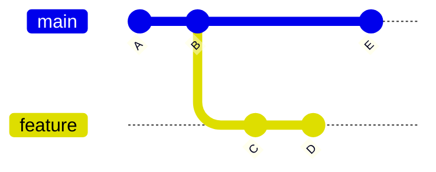
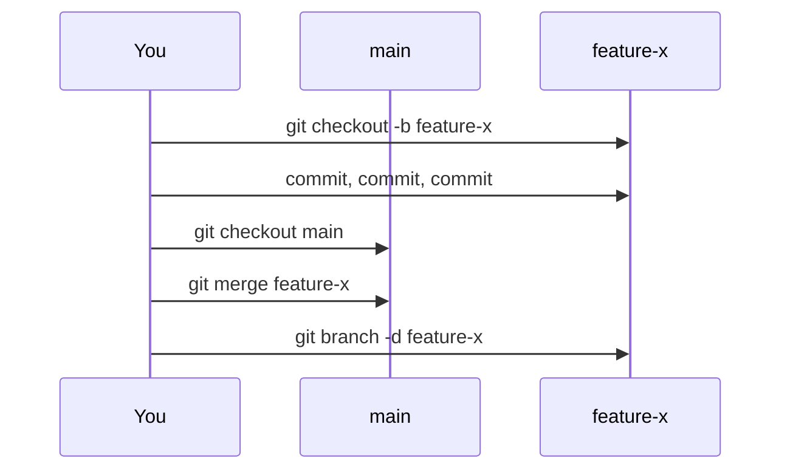

# Branching — Independent Lines of Development

A **branch** in Git is a lightweight pointer to a specific commit. Branches let you work on features, experiments, or bug fixes in isolation from the main codebase, then merge the results back when they're ready.

> [!info] Branches are pointers, not copies
> Unlike older version-control systems that duplicate files or folders, Git branches are just a reference stored in `.git/refs/heads/<branch-name>` — a single file containing a commit hash. Creating a branch is nearly instant and costs almost no disk space.

---

## The Three Core Commands

| Command                        | Purpose                                    |
| ------------------------------ | ------------------------------------------ |
| `git branch` *(covered below)* | Create, list, rename, delete branches      |
| [[git checkout]]               | Switch between branches (or restore files) |
| [[git merge]]                  | Integrate one branch into another          |

Conflicts that arise during merging are covered separately in [[Merge Conflicts]].

---

## How a Branch Works



- `main` points at commit `E`
- `feature` points at commit `D`
- Both branches share history up to commit `B`
- Switching branches moves `HEAD` — the "you are here" marker — between these pointers

---

## `git branch` — Managing Branches

```bash
git branch                       # list local branches (current marked with *)
git branch -a                    # list local + remote-tracking branches
git branch feature-x             # create a new branch from current HEAD (doesn't switch)
git branch -d feature-x          # delete a merged branch
git branch -D feature-x          # force-delete an unmerged branch
git branch -m old-name new-name  # rename
```

> [!tip] `-d` refuses to delete unmerged work
> Use `-D` (capital) only when you're intentionally discarding commits. Lowercase `-d` is the safety-checked version.

---

## Typical Branching Workflow



1. Branch off main — `git checkout -b feature-x`
2. Work in isolation, committing freely
3. Switch back to main — `git checkout main`
4. Integrate — `git merge feature-x` (see [[git merge]])
5. Delete the branch — `git branch -d feature-x`

---

## Local vs Remote Branches

| Type | Where it lives | Who updates it |
|---|---|---|
| **Local branch** | `.git/refs/heads/` | Your local commits |
| **Remote-tracking branch** | `.git/refs/remotes/origin/` | `git fetch` / `git pull` |

A local branch can *track* a remote one so `git push` / `git pull` work without arguments. Set tracking with `-u`:

```bash
git push -u origin feature-x
```

See [[Syncing (Main)]] for the full remote-sync story.

---

## Related Notes

- [[git checkout]] — switch branches, restore files
- [[git merge]] — combine branches
- [[Merge Conflicts]] — what to do when Git can't auto-combine
- [[Syncing (Main)]] — pushing branches to remotes
- [[Git Essential Commands]] — local-side basics
