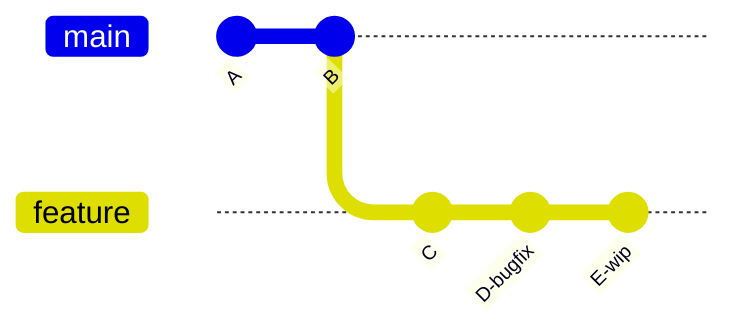
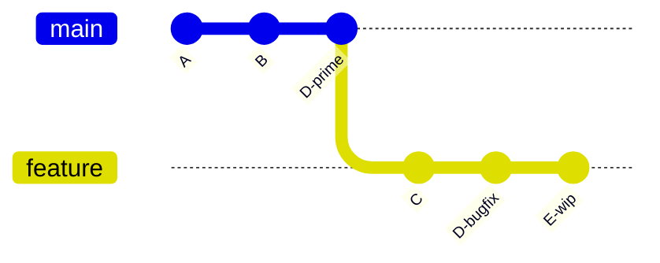
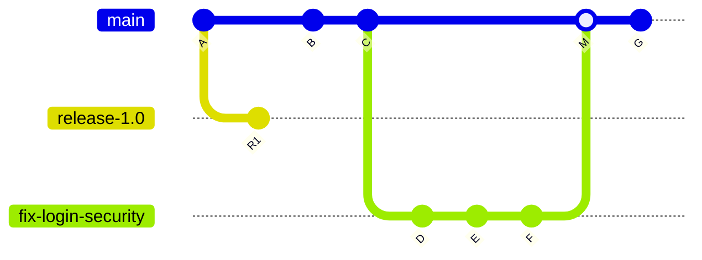

# `git cherry-pick` — Apply Specific Commits Anywhere

`git cherry-pick` takes one or more existing commits by their SHA and **replays them onto your current branch** as new commits. Unlike [[git merge]] or [[git rebase]] — which move whole branches of history — cherry-pick surgically copies *individual* commits wherever you want them.

> [!info] A surgical commit transplant
> Merge and rebase deal in branches. Cherry-pick deals in single commits. You pick a commit by its hash, stay on your current branch, and Git produces a **new commit with a new hash** that applies the same diff.

---

## The Idea in One Picture

### Before — a bug fix sits on `feature` but production needs it now



### After `git cherry-pick D` (from `main`)



Only commit `D`'s changes landed on `main` — as a new commit `D'` with a different SHA. The rest of `feature` is untouched.

> [!tip] Same diff, new hash
> Every cherry-picked commit is a fresh object. Two commits with identical changes on different branches are **not** the same commit — Git only compares by hash.

---

## Basic Syntax

```bash
git cherry-pick <commit-sha>
```

Find the commit you want with `git log` (or `git log <branch>` for another branch), then run the command from the branch you want to apply it to.

### Multiple commits and ranges

```bash
git cherry-pick <sha1> <sha2> <sha3>     # apply three specific commits in order
git cherry-pick <sha1>..<sha5>           # range: sha1 (exclusive) → sha5 (inclusive)
git cherry-pick <sha1>^..<sha5>          # range: sha1 (inclusive) → sha5 (inclusive)
git cherry-pick ^<sha> <branch>          # all ancestors of <branch> except <sha>
```

Order matters — commits apply in the order given.

---

## Common Use Cases

### 1. Hotfix a bug on `main` from inside a feature branch

You spotted a production bug mid-feature. Fix it as its own commit, pop it over to `main`, and ship:

```bash
# on feature-login — fix and commit the bug in isolation
git commit -m "Fix XSS in login form"
git log -1 --format=%H           # capture the SHA

# copy just that commit to main
git checkout main
git cherry-pick <sha>
git push origin main
```

The feature branch keeps going without interruption, and the fix ships immediately.

### 2. Share a single commit between developers

A teammate built a utility function on their branch. You need only that commit, not the rest of their work:

```bash
git fetch
git cherry-pick origin/colleague-branch~3   # grab the commit 3 behind their tip
```

### 3. Rescue a commit from the wrong branch

You accidentally committed to `main` when you meant `feature-x`:

```bash
git checkout feature-x
git cherry-pick main                        # copy the latest main commit here
git checkout main
git reset --hard HEAD~1                     # remove it from main (local only — don't do this if pushed)
```

### 4. Backport a fix to a long-lived release branch

Ship a fix to maintenance while preserving a trail back to the original:

```bash
git checkout release-2.x
git cherry-pick -x <sha-on-main>
```

The `-x` flag appends *"(cherry picked from commit …)"* to the message. Use it whenever the two branches are both public so collaborators can trace the origin.

---

## Options Reference

| Flag                         | Purpose                                                                                                              |
| ---------------------------- | -------------------------------------------------------------------------------------------------------------------- |
| `-e`, `--edit`               | Open the editor to edit the commit message before committing                                                         |
| `-x`                         | Append *"(cherry picked from commit …)"* to the message — recommended when backporting between public branches       |
| `-n`, `--no-commit`          | Apply the changes to the working tree + index but **don't create a commit** — useful for combining several picks     |
| `-s`, `--signoff`            | Add a `Signed-off-by` trailer                                                                                        |
| `-m <n>`, `--mainline <n>`   | Cherry-pick a merge commit — tell Git which parent (1 or 2) is the mainline                                          |
| `-S`, `--gpg-sign`           | GPG-sign the resulting commit                                                                                        |
| `--ff`                       | If HEAD is the parent of the picked commit, fast-forward instead of creating a new commit                            |
| `--allow-empty`              | Preserve an empty (no-diff) cherry-picked commit instead of erroring                                                 |
| `--empty=drop\|keep\|stop`   | Handle commits whose changes are already in your branch — default is `drop`                                          |
| `--strategy=<s>` / `-X<opt>` | Pick a merge strategy (`recursive`, `ours`, `patience`…) or pass a strategy option                                   |

### Mid-sequence control

When a range of cherry-picks hits a conflict, Git pauses between commits. Use these to steer the rest of the sequence:

| Flag         | Purpose                                                          |
| ------------ | ---------------------------------------------------------------- |
| `--continue` | After resolving conflicts, resume the cherry-pick sequence       |
| `--skip`     | Abandon the current commit and continue with the rest            |
| `--abort`    | Cancel the whole operation and return to the pre-pick state      |
| `--quit`     | Forget the in-progress sequencer state without rolling back      |

---

## Cherry-Picking a Merge Commit

A regular cherry-pick fails on a merge commit — Git can't tell which parent's changes you want. Use `-m <n>` to declare the **mainline parent**:

```bash
git cherry-pick -m 1 <merge-sha>     # diff is "merge commit vs. first parent"
git cherry-pick -m 2 <merge-sha>     # diff is "merge commit vs. second parent"
```

Parent numbering follows `git show <sha>` — the first `Merge:` parent is `1`, the second is `2`. Almost always `-m 1` is what you want: parent 1 is the branch that *received* the merge (usually `main`), and the diff you're replaying is "everything the merged-in branch added."

---

### Realistic scenario — backporting to a deleted feature branch

Your team has three long-lived branches: `main`, `release-1.0`, and `release-2.0`. A customer is still on `release-1.0` and needs a security fix.

**Monday:** a developer opens `fix-login-security`, lands three commits (`D`, `E`, `F`), merges into `main` as merge commit `M`, and deletes the feature branch.

**Tuesday:** the fix needs to land on `release-1.0`. What now?



After Monday, `fix-login-security` is gone — only `M` remains on `main` as evidence the work happened. Three options exist for getting the fix onto `release-1.0`:

| Option                              | Command                                    | Works?            | Cost                                                                       |
| ----------------------------------- | ------------------------------------------ | ----------------- | -------------------------------------------------------------------------- |
| **1. Cherry-pick D, E, F**          | `git cherry-pick D E F`                    | ✅ cleanest        | Requires knowing the three SHAs — easy on Monday, harder months later      |
| **2. Re-merge the feature branch**  | `git merge fix-login-security`             | ❌ branch deleted  | Impossible — the ref is gone (though commits linger in `reflog` briefly)   |
| **3. Cherry-pick the merge commit** | `git cherry-pick -m 1 M`                   | ✅ works           | Lumps D+E+F into **one big commit** — loses granular messages & diffs      |

Option 3 is the one `-m 1` was built for. The diff it produces is *M minus parent 1* — i.e., everything the feature branch added to `main`. That's exactly the fix, re-applied as a single commit on `release-1.0`:

```bash
git checkout release-1.0
git cherry-pick -m 1 <M-sha>
# resolve any conflicts if release-1.0 has drifted
git push origin release-1.0
```

### When `-m 1` is actually the right tool

- **Deleted feature branch, no SHA list handy** — option 1 needs the individual SHAs; if they're lost, option 3 is the only path.
- **Messy WIP commits inside the feature branch** — if `D`, `E`, `F` are "wip", "more wip", "oops" then picking them individually pollutes `release-1.0`. The lumped diff from `-m 1` is cleaner.
- **Single-commit release policy** — some teams require every change on a release branch to arrive as one commit. `-m 1` gives you that by construction.
- **Incident response at 2 AM** — you know the merge commit hash because it's at the top of `main`'s log. One command, done.

### What you give up

- **Granular commit messages.** Three focused "what and why" messages collapse into one.
- **`git bisect` resolution.** Bisect on `release-1.0` can only narrow to the whole fix, not the individual piece that caused a regression.
- **Three focused diffs become one fat diff** in review — harder to eyeball.

> [!warning] Cherry-picking merges is usually a smell
> If you need a merge's contents elsewhere, it's almost always cleaner to cherry-pick the individual commits that fed into that merge, or to re-merge the source branch. `-m <n>` exists for the cases where those options are gone — deleted branches, lost SHAs, or a release policy that demands a single commit.

> [!tip] Niche but irreplaceable
> In day-to-day work you'll rarely need `-m`. It earns its keep on teams juggling multiple long-lived release branches — see [[Branching (Main)#Release Branches and Backporting]] for the surrounding workflow.

---

## Handling Conflicts

Cherry-pick uses the same 3-way merge machinery as [[git merge]], so conflicts look identical:

```bash
git cherry-pick <sha>
# CONFLICT (content): Merge conflict in path/to/file

git status                       # list conflicted files
# ...edit files, resolve <<<<<<< / ======= / >>>>>>> markers...
git add <resolved-files>
git cherry-pick --continue       # finish the pick and create the commit

# Or bail out:
git cherry-pick --abort          # undo, back to clean pre-pick state
```

See [[Merge Conflicts]] — the conflict markers and resolution flow are exactly the same as in a merge or rebase.

---

## ⚠ Pitfalls and When NOT to Cherry-Pick

> [!danger] Cherry-pick is a scalpel, not a workflow
> It creates **duplicate commits with different hashes**. If you later merge or rebase the source branch into the same target, Git often can't tell the two are the same — it either applies them twice or forces you through phantom conflicts.

### Specific traps

- **Overuse fragments history.** If the same change ends up on multiple branches via cherry-pick, `git log` becomes hard to read and `git bisect` can blame the wrong commit.
- **Hidden dependencies.** Commit `D` might compile fine because commit `C` introduced a helper. Cherry-picking `D` alone can silently break the target branch.
- **Testing equivalence is an illusion.** A fix that passed tests on `feature` may interact differently with `main`'s code. Cherry-picking skips the integration test that a real merge would force.
- **Multi-environment promotion (dev → staging → prod) by cherry-pick is an anti-pattern.** It means "the code that was tested is not the code that shipped," and the same conflicts have to be resolved in every environment. Prefer promoting whole branches with [[git merge]].

### Rule of thumb

> Use cherry-pick for **one-off, isolated commits** — hotfixes, backports, and rescue operations. For ongoing integration between branches, use [[git merge]] or [[git rebase]] instead.

---

## Cherry-Pick vs Merge vs Rebase — Choosing

| Situation                                         | Prefer                 |
| ------------------------------------------------- | ---------------------- |
| Ship a single fix to `main` mid-feature           | **Cherry-pick**        |
| Backport a fix to a long-lived release branch     | **Cherry-pick** (`-x`) |
| Rescue commits landed on the wrong branch         | **Cherry-pick**        |
| Integrate a completed feature into `main`         | [[git merge]]          |
| Catch a feature branch up with the latest `main`  | [[git rebase]]         |
| Promote a branch through dev → stage → prod       | [[git merge]]          |
| Collapse a noisy feature into one commit          | [[Squashing Commits]]  |

---

## Recovering from a Bad Cherry-Pick

`git reflog` still has your pre-pick HEAD:

```bash
git reflog                       # find the HEAD@{n} before the cherry-pick
git reset --hard HEAD@{n}        # jump back to that state
```

Already committed the pick and want to back it out cleanly?

- **If not pushed:** `git reset --hard HEAD~1` removes the pick.
- **If pushed:** `git revert <sha>` creates an inverse commit, preserving history.

---

## End-to-End Example — Hotfix Workflow

```bash
# You're deep into a feature branch and spot a bug
git checkout feature-payments
# ...fix the bug in its own isolated commit...
git commit -m "Fix currency rounding in order total"

# Capture the SHA
git log -1 --format=%H
# a1b2c3d4...

# Ship it to main without merging the whole feature
git checkout main
git pull --rebase
git cherry-pick -x a1b2c3d4
git push origin main

# Resume feature work — your branch is unaffected
git checkout feature-payments
```

When the feature eventually merges, Git's `--empty=drop` default handles the already-applied commit cleanly — but see the pitfall section for cases where it doesn't.

---

## See Also

- [[Branching (Main)]] — overview of branches and core commands
- [[git merge]] — integrate whole branches instead of single commits
- [[git rebase]] — replay many commits in sequence (`-i` lets you pick/reorder/squash)
- [[Merge Conflicts]] — same conflict markers, same resolution flow
- [[Squashing Commits]] — when you want to combine commits rather than transplant them
- [[git checkout]] — switch to the branch that will receive the pick
- [[Git Essential Commands]] — everyday-command quick-reference
