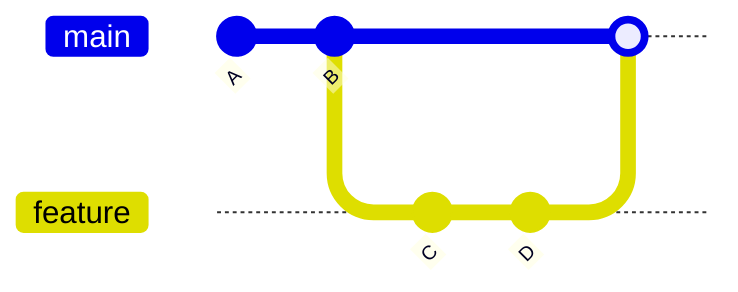
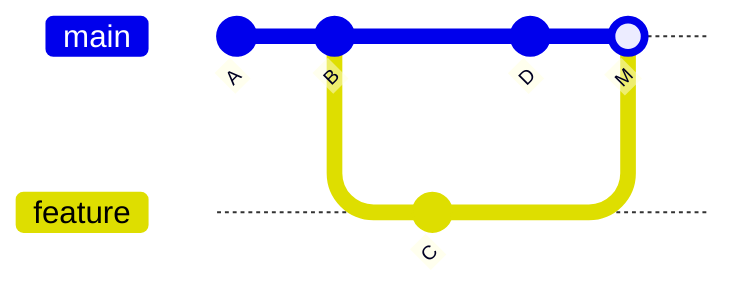

# `git merge` — Combine Branches

`git merge` integrates changes from one branch into another, producing a unified history. It's the standard way to pull completed feature work into `main`.

> [!info] Merge always targets the current branch
> `git merge feature-x` means: "take the commits from `feature-x` and combine them into whichever branch I'm currently on." Check with `git status` or `git branch` before running it.

---

## Basic Syntax

```bash
git checkout main              # switch to the branch that will receive the changes
git merge feature-x            # merge feature-x into main
```

---

## Fast-Forward vs Three-Way Merge

### Fast-forward merge

If the current branch hasn't diverged — i.e., all its commits are ancestors of the target — Git just slides the pointer forward. No merge commit is created.



After `git merge feature` from `main`: main now points at `D`. History stays linear.

### Three-way merge

If both branches have new commits since they diverged, Git uses the two tips plus their common ancestor to build a new **merge commit** with two parents.



`M` is the merge commit — its two parents are `D` and `C`.

---

## Common Flags

| Flag         | Purpose                                                                                              |
| ------------ | ---------------------------------------------------------------------------------------------------- |
| `--no-ff`    | Force a merge commit even if a fast-forward is possible (preserves branch history)                   |
| `--ff-only`  | Refuse the merge unless it can be a fast-forward (rejects diverging branches)                        |
| `--squash`   | Combine all branch commits into a single new commit on the current branch (no merge commit, no link) |
| `--abort`    | Cancel a merge in progress and return to pre-merge state                                             |
| `--continue` | Finish a merge after resolving conflicts                                                             |

---

## Examples

### Preserve feature-branch history with `--no-ff`

```bash
git checkout main
git merge --no-ff feature-x
```

Even if `main` hasn't moved, this creates a merge commit so the branch's existence is visible in the log.

### Collapse a feature into one commit

```bash
git checkout main
git merge --squash feature-x
git commit -m "Add login feature"
```

Useful when the feature branch has noisy intermediate commits you don't want in `main`'s history.

### Abort a merge gone wrong

```bash
git merge feature-x
# ...conflicts appear, you decide it's not worth it...
git merge --abort
```

---

## When Merge Fails

If the same lines changed on both sides, Git halts and marks conflicts in the affected files. Resolution is a separate topic — see [[Merge Conflicts]].

---

## Typical Workflow

```bash
git checkout main
git fetch origin
git merge origin/main        # catch up with remote first
git merge feature-x          # then integrate the feature
git push origin main         # publish
git branch -d feature-x      # delete the now-merged branch
```

---

## See Also

- [[Branching (Main)]] — what you're combining
- [[git checkout]] — switch to the receiving branch first
- [[git rebase]] — the history-rewriting alternative to merge
- [[git cherry-pick]] — copy a single commit instead of merging the whole branch
- [[Merge Conflicts]] — resolving overlapping changes
- [[git pull]] — pull is `fetch` + `merge`
