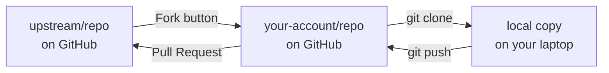
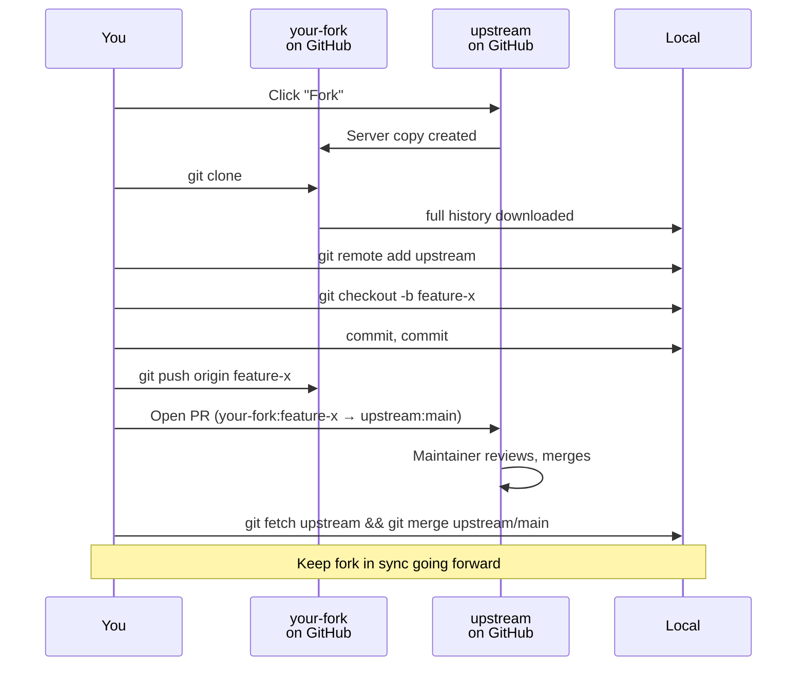

# GitHub Forks — Your Own Copy of Someone Else's Repo

A **fork** is a server-side copy of a repository, created under your GitHub account from someone else's original. Forks let you modify code you don't have write access to — and, optionally, propose those changes back via a pull request. They're the bridge that lets strangers contribute to open source without the maintainer ever having to add them as a collaborator.

> [!info] Fork happens on GitHub. Clone happens on your laptop.
> Forking copies the repo from `upstream/repo` to `your-account/repo` **on GitHub's servers**. Cloning copies a repo (forked or not) from GitHub **down to your machine**. You need both to actually work on code — fork to own the remote copy, clone to edit it locally.

---

## Fork vs Clone — The Big Distinction

The two commands are often confused. They do completely different things:

| Aspect                    | **Fork**                                            | **Clone**                                              |
| ------------------------- | --------------------------------------------------- | ------------------------------------------------------ |
| **Where it happens**      | Server-side (on GitHub)                             | Local (on your machine)                                |
| **Produces**              | A new repo under your GitHub account                | A `.git/` folder in a directory on disk                |
| **Triggered by**          | Clicking "Fork" on github.com                       | `git clone <url>` in a terminal                        |
| **Link to source**        | GitHub tracks it as a fork (fork network)           | `origin` remote points at whatever you cloned from     |
| **Allows pushing back**   | No (unless you're a collaborator upstream)          | Only if you have write access to the remote you cloned |
| **Enables PRs**           | Yes — PR from fork → upstream                       | No direct mechanism                                    |
| **Cost of creating**      | One click, a few seconds                            | Network download of full history                       |

> [!tip] You usually do both
> To contribute to an open-source project you don't own: **fork first** (to get a writable remote), then **clone your fork** (to edit locally). The typical order is fork → clone → branch → push → PR.

---

## What a Fork Actually Gives You

1. **A writable remote repo.** You can `git push` to your fork freely — you own it.
2. **A permanent link back to the upstream.** GitHub tracks the parent in the "fork network," so your "Compare & pull request" button knows where to propose changes.
3. **Independent visibility.** Public upstream → your fork is public. You can also add collaborators to your fork without touching upstream.
4. **A base for divergence.** Many major projects started as forks — LibreOffice (from OpenOffice), MariaDB (from MySQL), Ubuntu (from Debian), Jenkins (from Hudson). A fork that never PRs back just becomes its own project.

---

## How Forking Fits Together



Four places exist for code: **upstream on GitHub**, **your fork on GitHub**, **your local clone**, and the **branches** inside each. The pull request is the only arrow that goes from your fork back to upstream.

---

## Why Fork? Three Real Reasons

| Reason                                                     | When                                                           |
| ---------------------------------------------------------- | -------------------------------------------------------------- |
| **Contribute to a project you don't own**                  | Open-source fix, feature, doc update                           |
| **Experiment without affecting the original**              | Try a radical refactor safely — the fork is your sandbox       |
| **Diverge into a new project**                             | Upstream is abandoned or moving in a direction you disagree with |

If you already have write access to the repo (you work on the team), **you don't need a fork** — just push a branch directly. See the feature-branch workflow in [[GitHub pull request]].

---

## The Upstream Remote — How Forks Track the Original

After cloning your fork, your local copy has **one** remote: `origin`, which points at your fork. But you also need a reference to the **original** repo so you can pull in new changes as it evolves. Convention: call it `upstream`.

```bash
git remote -v
# origin    https://github.com/you/repo.git   (fetch/push)

git remote add upstream https://github.com/original-owner/repo.git

git remote -v
# origin    https://github.com/you/repo.git              (fetch/push)
# upstream  https://github.com/original-owner/repo.git   (fetch/push)
```

Now you can `git fetch upstream` to pull in the original's updates. See [[git remote]] for the full set of subcommands.

> [!tip] The naming convention
> - **`origin`** — **your** fork (where you push)
> - **`upstream`** — the **original** repo (where you fetch from, but don't push)

---

## Keeping Your Fork in Sync

Long-running forks drift. Every week, upstream gets commits that your fork doesn't have. Before starting new work, sync up:

```bash
git fetch upstream                    # download upstream's latest commits
git checkout main                     # switch to your fork's main
git merge upstream/main               # bring upstream's changes into your fork's main
git push origin main                  # push the synced main up to your fork on GitHub
```

Some teams prefer rebase for linearity:

```bash
git fetch upstream
git checkout main
git rebase upstream/main
git push --force-with-lease origin main
```

GitHub also has a **"Sync fork"** button on the fork's page that does the merge for you (no command-line needed for simple cases).

> [!warning] Never commit directly to your fork's `main`
> Keep `main` as a pristine mirror of upstream. Do all your work on feature branches. This makes syncing trivial and prevents your fork's `main` from diverging into an unmaintainable hybrid.

---

## The Fork → PR Lifecycle End-to-End



---

## GitHub-Specific Gotchas

> [!warning] Private-repo forks disappear with the parent
> If someone deletes a private repo, **all its forks are deleted too**. Public forks survive — they get detached into their own fork network. If you're forking a private repo for work you care about, don't assume the fork is your backup.

> [!warning] Public → private turns forks into orphans
> When a public repo is flipped to private, its existing public forks get **detached from the fork network**. They keep existing publicly, but lose the "this is a fork of X" metadata and the compare-PR shortcut.

### Other traps

- **Fork-of-fork defaults to original.** When you click Fork on an already-forked repo, GitHub by default associates your new fork with the **original root**, not the intermediate fork. PRs go to root upstream.
- **Stale forks confuse PRs.** A PR opened from a fork that's 500 commits behind upstream looks like "your PR removes 500 commits" in the diff view. Always sync before PRing.
- **Force-pushing to `main` on a fork** can corrupt any open PRs others have based on your fork's main.

---

## When NOT to Fork

| Situation                                          | Do this instead                    |
| -------------------------------------------------- | ---------------------------------- |
| You're on the team with write access               | `git checkout -b branch && push`   |
| You just want to read the code locally             | Just `git clone`                   |
| You want a personal backup of a public repo        | Clone, or use GitHub's mirror API  |
| You want one-time access to a snapshot             | Download ZIP from GitHub UI        |

Forking adds a permanent server-side artifact. Use it when you need to push back — not as a browsing tool.

---

## End-to-End Example — Contributing to an Open-Source Project

```bash
# 1. On github.com: click "Fork" on original-owner/project
#    → creates you/project

# 2. Clone your fork to your laptop
git clone https://github.com/you/project.git
cd project

# 3. Add upstream as a second remote
git remote add upstream https://github.com/original-owner/project.git

# 4. Create a feature branch (NOT on main!)
git checkout -b fix-typo-in-readme

# 5. Edit, commit, push to your fork
# ...edit README.md...
git add README.md
git commit -m "docs: fix typo in setup section"
git push -u origin fix-typo-in-readme

# 6. On github.com: open a PR from you:fix-typo-in-readme → original-owner:main
#    (see [[GitHub pull request]] for the full PR flow)

# 7. Maintainer merges. Sync your fork afterwards:
git checkout main
git fetch upstream
git merge upstream/main
git push origin main

# 8. Delete the feature branch — both local and fork
git branch -d fix-typo-in-readme
git push origin --delete fix-typo-in-readme
```

---

## See Also

- [[GitHub pull request]] — the review+merge workflow a fork PR goes through
- [[What is Git and GitHub]] — the Git-vs-GitHub conceptual split
- [[git remote]] — managing `origin` and `upstream`
- [[Syncing (Main)]] — fetch / pull / push mechanics a fork relies on
- [[Git Essential Commands]] — `git clone` lives here (fork's sibling, not its substitute)
- [[Branching (Main)]] — branching is how you work inside a fork

---

### Sources

| Source | Type |
|---|---|
| [GitHub Community Discussion #35849 — Fork vs clone](https://github.com/orgs/community/discussions/35849) | Official community (primary) |
| [TheServerSide — Git fork vs clone: What's the difference?](https://www.theserverside.com/answer/Git-fork-vs-clone-Whats-the-difference) | Industry guide (primary) |
| [GitHub Docs — Fork a repository](https://docs.github.com/articles/fork-a-repo) | Official docs |
| [GitHub Docs — Syncing a fork](https://docs.github.com/articles/syncing-a-fork) | Official docs |
| [Graphite — Understanding the git fork and PR workflow](https://graphite.com/guides/understanding-git-fork-pull-request-workflow) | Practitioner guide |
| [Chaser324 — Standard Fork & PR Workflow gist](https://gist.github.com/Chaser324/ce0505fbed06b947d962) | Community reference |
