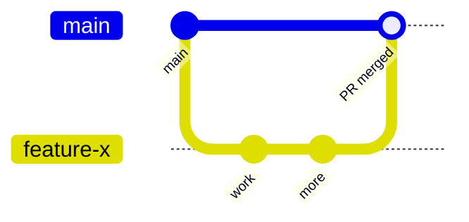
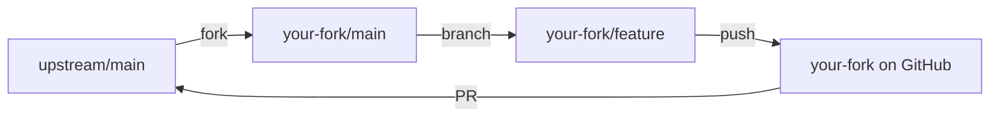
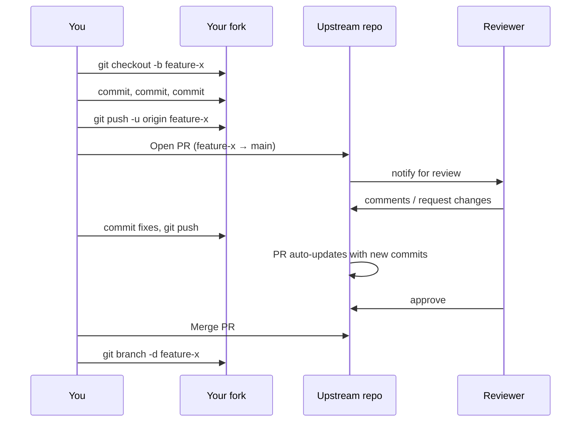

# GitHub Pull Requests — Propose, Review, Merge

A **pull request** (PR) is a proposal to merge one branch into another, wrapped in a web interface for discussion. It's how code review, testing, and approval get bolted onto Git — because Git itself has no opinion about who can merge what. A PR is where a feature branch goes to defend itself before it joins `main`.

> [!info] Git is the tool, PR is the social layer
> Git will happily let you merge anything into anything. The pull request is GitHub's/Bitbucket's mechanism for pausing a merge until humans — and CI — have weighed in. See [[What is Git and GitHub]] for the Git-vs-GitHub distinction.

---

## Why Pull Requests Exist

Without a PR system, code review relied on emailing patches or trusting developers to merge whatever they wanted. That scales badly — especially on open source where the maintainer has never met the contributor. Pull requests consolidate four things in one URL:

- **A diff** — what the branch actually changes
- **A discussion** — inline and overall comments
- **A CI report** — do tests pass on this branch?
- **An approval record** — who signed off, and when

Close the PR and you have a permanent audit trail of why that code is on `main`.

---

## Anatomy of a Pull Request

Every PR, regardless of platform, points **from** one branch **to** another:

| Piece                      | What it means                                                |
| -------------------------- | ------------------------------------------------------------ |
| **Source repository**      | Where the changes live (your fork, or the main repo)         |
| **Source branch**          | The branch with your new commits                             |
| **Destination repository** | Where the changes should land                                |
| **Destination branch**     | Usually `main` — the branch to merge into                    |

When source and destination repos are **the same**, you're using a **feature-branch workflow**. When they differ, you're using a **forking workflow** (common on open source — you don't have write access to the upstream repo).

---

## The Two Workflow Models

### Feature-branch workflow (internal teams)

One shared repo. Everyone pushes branches to it. PRs flow branch → `main`.



### Forking workflow (open source / external contributors)

Contributors fork the upstream repo, push branches to **their own** fork, then open a PR pointing from `their-fork:feature` to `upstream:main`.



The second model is why PRs are called *pull* requests — you're requesting the maintainer pull your changes across repository boundaries.

---

## The PR Lifecycle — End to End



The key property: **pushing new commits to the source branch updates the open PR in place.** No new PR is needed per round of review.

---

## The Six Steps of GitHub Flow

GitHub's canonical workflow, distilled:

1. **Create a branch** — `git checkout -b descriptive-name`
2. **Make changes** — commit in logical chunks
3. **Open a PR** — from your branch into `main`, with a description explaining *why*
4. **Address review comments** — push more commits to the same branch
5. **Merge the PR** — once approved and CI passes
6. **Delete the branch** — both locally (`git branch -d`) and on the remote

---

## Draft Pull Requests

Draft PRs let you open the PR early — while the work is still in progress — without triggering formal review.

- Cannot be merged until marked "Ready for review"
- Do **not** auto-request review from `CODEOWNERS`
- Useful for early CI feedback, sharing WIP work, or stacked-PR chains where a later PR needs the earlier one merged first

Mark as draft when opening, or convert an existing PR to draft via the PR page.

---

## Merge Strategies

When the PR is approved, GitHub gives you three ways to integrate it. Each produces a different shape in `git log`:

| Strategy              | Commits on `main` afterward                        | Best for                                            |
| --------------------- | -------------------------------------------------- | --------------------------------------------------- |
| **Merge commit**      | All PR commits **plus** a new merge commit         | Preserving full branch history                      |
| **Squash and merge**  | **One** new commit on `main` — the whole PR flattened | Noisy WIP commits you don't want on `main`          |
| **Rebase and merge**  | PR commits replayed linearly onto `main`, no merge commit | Keeping history linear without squashing           |

Repositories can enforce one strategy in settings. Common policy in 2026: **squash-only on `main`**, merge commits on release branches.

- See [[git merge]] for merge-commit semantics
- See [[git rebase]] for how rebase replays commits
- See [[Squashing Commits]] for the three equivalent ways to squash

> [!tip] The commit message you write at merge-time matters
> Especially with squash merge — whatever you type in the merge-time commit box **is** the only message on `main`. Rewrite it properly: don't leave the default "feat: thing (#123)\n\n* wip\n* more wip".

---

## Code Reviews

A review is one of three verdicts:

| Verdict             | Effect                                                              |
| ------------------- | ------------------------------------------------------------------- |
| **Approve**         | Counts toward required-review threshold                             |
| **Request changes** | **Blocks** the merge button until resolved — use for real blockers  |
| **Comment**         | Neither blocks nor approves — general feedback                      |

**Inline comments** attach to specific lines; **overall comments** apply to the PR as a whole.

Pushing new commits after a review dismisses old approvals on many configurations — re-request review explicitly.

---

## Branch Protection — Enforcing the Rules

Branch protection rules on `main` (or any branch) can require:

- **A minimum number of approving reviews** (typically 1–2)
- **Review from `CODEOWNERS`** — the `.github/CODEOWNERS` file auto-assigns reviewers based on which files the PR touches
- **Status checks pass** — CI, linters, type-checks must all be green
- **Conversations resolved** — every review comment marked resolved
- **Linear history** — disallow merge commits, forcing squash or rebase
- **Signed commits** — require GPG signatures

Without these, the PR is a suggestion. With them, it's a gate.

---

## CI and Automated Checks

Every PR push triggers CI. Typical checks:

- Unit tests
- Linting / formatting
- Type checking
- Security scans
- AI code review (GitHub Copilot Code Review, etc. — matured through 2025-26)

Failing checks don't block the PR from existing, but — paired with branch protection — they block the merge.

---

## Best Practices

### Size and scope

> [!tip] Small PRs get reviewed well. Large PRs get rubber-stamped.
> Studies consistently show review quality drops off sharply past **~400 changed lines**. Aim for one logical change per PR.

- **Split refactors from features** — mixing them hides the actual behavior change
- **Stack PRs for big work** — PR 2 targets PR 1's branch; reviewable in chunks
- **Use `.github/PULL_REQUEST_TEMPLATE.md`** — so every PR has the same sections: what, why, how-to-test, screenshots

### Titles and descriptions

- Title: *specific and actionable*. Not "Fix bug" — rather "Fix race condition in session cleanup causing 502s under load"
- Description answers three questions: **What changed? Why? How should reviewers approach it?**
- Link issues: `Closes #247` (GitHub auto-closes the issue on merge)
- Include screenshots for UI changes, migration notes for DB changes, feature-flag names for rollouts

### Commit hygiene

- Conventional Commits: `type(scope): description` — e.g., `feat(auth): add zero-downtime session handling`
- If squash-merging, individual commit messages matter less — but use them to stage the *review*, not the history
- If merge-committing, clean up with [[git rebase]] `-i` **before** opening the PR

### Self-review before opening

- Read your own diff on the PR page — catch obvious issues before a human does
- Make sure CI passes *before* requesting reviews
- If the PR is over ~500 lines, reconsider splitting

### Responding to review

- Address every comment — either fix it or reply explaining why not
- Push fixes as new commits (the PR auto-updates)
- Re-request review after significant changes
- Don't force-push over approved commits without coordination — reviewers lose their place

---

## End-to-End Example

```bash
# Start work
git checkout main
git pull
git checkout -b fix-login-race

# Make changes, commit
git add .
git commit -m "fix(auth): serialize session cleanup"

# Push and open the PR
git push -u origin fix-login-race
# ... open PR on github.com, fill in description, link to issue ...

# Reviewer requests changes, you push fixes
git add .
git commit -m "fix(auth): add test for concurrent cleanup"
git push

# CI goes green, reviewer approves, you hit "Squash and merge"
# GitHub merges, branch auto-deleted

# Clean up locally
git checkout main
git pull
git branch -d fix-login-race
```

---

## Common Pitfalls

| Anti-pattern            | Why it hurts                                                  | Fix                                              |
| ----------------------- | ------------------------------------------------------------- | ------------------------------------------------ |
| **2000-line mega-PR**   | Reviewers can't hold it all in their head — defects slip      | Stack PRs or split by layer                      |
| **"LGTM" in 2 minutes** | Performative approval. Worse than no review                   | Team SLA: reviewer must leave ≥1 specific comment |
| **40 nitpick comments** | Style debates drown the real feedback                         | Automate style with linters; reserve humans for logic |
| **Ghost PR**            | Open 3 weeks, unresolved comments, branch diverging from main | Merge within a week or close and reassess        |
| **Mixed concerns**      | Refactor + feature in one PR → hard to revert if one breaks   | Two separate PRs                                 |

---

## See Also

- [[What is Git and GitHub]] — the Git-is-the-tool distinction
- [[Branching (Main)]] — PRs merge *branches*, so the branching model matters
- [[git push]] — how your branch gets to GitHub in the first place
- [[git merge]] — the "merge commit" strategy's underlying mechanic
- [[git rebase]] — the "rebase and merge" strategy's underlying mechanic
- [[Squashing Commits]] — the "squash and merge" strategy's underlying mechanic
- [[Syncing (Main)]] — the push/pull/fetch trio PRs sit on top of
- [[Git Essential Commands]] — everyday command reference

---

### Sources

| Source | Type |
|---|---|
| [Atlassian — Making a Pull Request](https://www.atlassian.com/git/tutorials/making-a-pull-request) | Tutorial (primary) |
| [GitHub Docs — About pull requests](https://docs.github.com/en/pull-requests/collaborating-with-pull-requests/proposing-changes-to-your-work-with-pull-requests/about-pull-requests) | Official docs |
| [GitHub Docs — GitHub flow](https://docs.github.com/en/get-started/using-github/github-flow) | Official docs |
| [DeployHQ — Pull Request Best Practices (2026)](https://www.deployhq.com/blog/the-perfect-pull-request-best-practices-for-collaborative-development) | Industry guide |
| [DevToolbox — GitHub Pull Requests Complete Guide](https://devtoolbox.dedyn.io/blog/github-pull-requests-complete-guide) | Practitioner guide |
