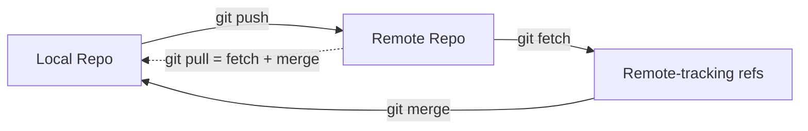
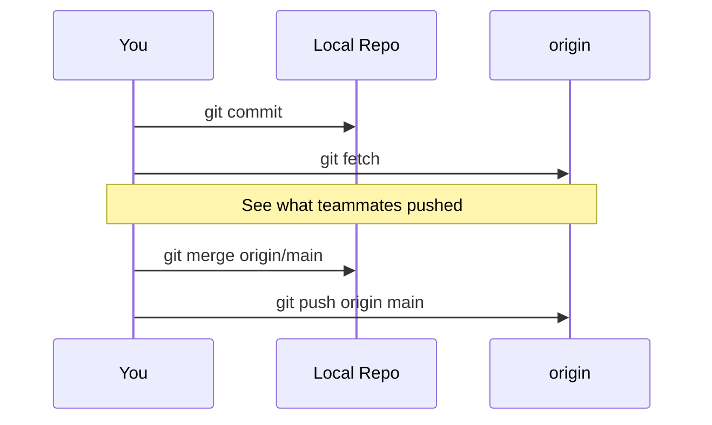

# Syncing — Git Remote Controls

Syncing is how Git repositories communicate. Unlike centralized VCS tools (SVN, Perforce), Git is **distributed** — every developer has a full copy of the history on their machine. The four syncing commands (`git remote`, `git fetch`, `git push`, `git pull`) are the bridge between your local repo and anyone else's.

> [!info] The Mental Model
> Think of syncing as managing **two histories**: the one in your `.git/` folder and the one on a remote server. These histories drift apart as people commit, and syncing is the act of reconciling them.

---

## The Four Commands at a Glance

| Command        | Direction          | What It Does                                                     |
| -------------- | ------------------ | ---------------------------------------------------------------- |
| [[git remote]] | —                  | Manages the list of remote repositories (bookmarks)              |
| [[git fetch]]  | ⬇ Download         | Downloads remote commits without touching your working directory |
| [[git pull]]   | ⬇ Download + merge | Fetches **and** merges into your current branch                  |
| [[git push]]   | ⬆ Upload           | Uploads your local commits to a remote branch                    |

---

## The Syncing Flow



> [!tip] Key insight
> `git pull` is just `git fetch` followed by `git merge` — nothing more. Use `git fetch` when you want to inspect changes before merging; use `git pull` when you trust the remote and want the update in one step.

---

## Remotes: The Bookmarks

A **remote** is a named URL pointing at another repository. When you `git clone`, Git automatically adds one called `origin` pointing back at the source. You can register as many as you like — e.g., `origin` for the team repo and `john` for a teammate's fork.

```bash
git remote -v                     # list remotes with URLs
git remote add upstream <url>     # add a second remote
```

See [[git remote]] for the full set of subcommands.

---

## HTTPS vs SSH URLs

| Protocol | URL Form | Auth | Typical use |
|---|---|---|---|
| **HTTPS** | `https://github.com/user/repo.git` | Token / password prompt | Read-only, or when SSH isn't configured |
| **SSH** | `git@github.com:user/repo.git` | SSH key | Read-write on machines with keys set up |

(Same table appears in [[Git Essential Commands]] under `git clone` — the two notes are linked.)

---

## Typical Collaboration Workflow



1. Work locally, `git add` + `git commit`
2. `git fetch` to see what others pushed
3. Merge or rebase onto the updated remote ref
4. `git push` your commits back up

---

## Safety Hierarchy

> [!warning] Safe → Dangerous
> - **`git fetch`** — always safe, never modifies your working directory
> - **`git pull`** — safe when your working tree is clean
> - **`git push`** — safe for fast-forward updates; refuses non-fast-forward by default
> - **`git push --force`** — can overwrite teammates' work; coordinate before use

---

## Related Notes

- [[What is Git and GitHub]] — the conceptual split between Git (tool) and GitHub (host)
- [[Git Essential Commands]] — local-side commands (`init`, `add`, `commit`, `clone`, etc.)
- [[Index and Object Store]] — where the syncing changes ultimately live
- [[gitignore]] — controlling what *never* gets pushed
- [[GitHub pull request]] — the review-and-merge flow that wraps `git push` on GitHub
