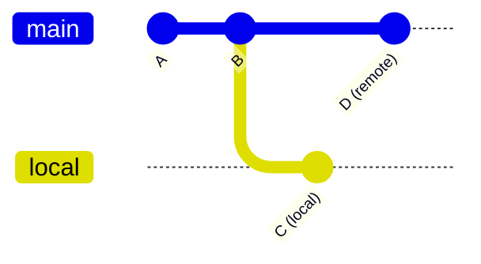

# `git pull` — Fetch + Merge in One Step

`git pull` is a convenience command that runs `git fetch` followed by `git merge` (or `git rebase`, with a flag). It's the fastest way to bring your current branch up to date with its remote counterpart.

> [!info] Pull = fetch + merge
> ```bash
> git pull origin main
> # is exactly equivalent to:
> git fetch origin
> git merge origin/main
> ```

---

## Syntax

```bash
git pull                        # pull current branch from its upstream
git pull <remote>               # pull current branch from <remote>
git pull <remote> <branch>      # pull <branch> from <remote> into current branch
```

---

## Common Flags

| Flag | Purpose |
|---|---|
| `--rebase` | Rebase local commits on top of the fetched ones instead of merging |
| `--no-commit` | Run the merge but don't auto-create the merge commit — lets you inspect first |
| `--ff-only` | Refuse the pull unless it can be a fast-forward (no merge commit) |
| `--verbose` | Show detailed fetch and merge output |

---

## Merge vs Rebase on Pull



After pulling, there are two ways to integrate:

### Merge (default)
Creates a merge commit `M` combining the branches.
```
A - B - D - M
         \ /
          C
```

### Rebase (`--rebase`)
Rewrites `C` to sit on top of `D`, giving a linear history.
```
A - B - D - C'
```

> [!tip] When to prefer rebase
> On a shared main branch, `git pull --rebase` keeps history linear and avoids "merge commit spam." On a long-lived feature branch, plain `git pull` preserves the true collaborative history.

### Make rebase the default globally

```bash
git config --global pull.rebase true
```

Or for all new branches:
```bash
git config --global branch.autosetuprebase always
```

---

## Typical Workflows

### Sync current branch
```bash
git pull
```

### Pull a feature branch from a specific remote
```bash
git checkout feature-x
git pull origin feature-x
```

### Safe sync on `main`
```bash
git checkout main
git pull --rebase origin main
```

---

## Safety

`git pull` modifies your working directory. If you have uncommitted changes:

- A clean merge will proceed, combining your changes with the pulled ones
- A conflicting pull will abort and leave you to resolve manually
- `git stash` first if you want to pull onto a clean tree, then `git stash pop`

> [!warning] Pull is "unsafe" relative to fetch
> `git fetch` never touches your working directory. `git pull` does. If you want to inspect remote changes before integration, fetch first.

---

## See Also

- [[Syncing (Main)]] — the big picture
- [[git fetch]] — the non-merging version
- [[git push]] — the upload counterpart
- [[git remote]] — managing remote connections
- [[Git Essential Commands]] — local-side commands like `git commit` and `git stash`
