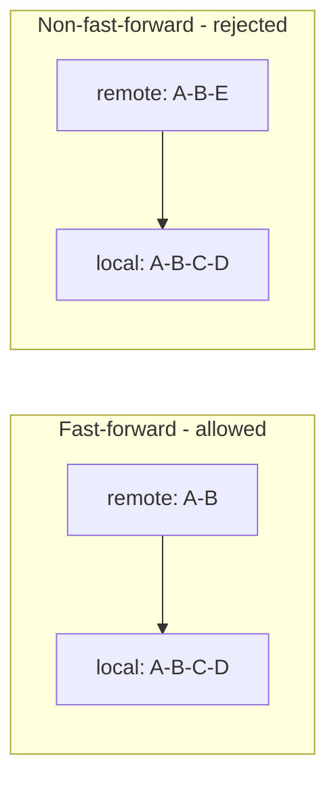

# `git push` — Upload Commits to a Remote

`git push` is the upload counterpart to [[git fetch]]. It sends commits from a local branch to a branch on a remote, along with all the objects those commits reference.

> [!info] Push only moves commits that already exist locally
> You push what you've already committed. Anything uncommitted (unstaged or in the index) stays behind. Commit first, push second.

---

## Syntax

```bash
git push <remote> <branch>            # push a specific branch
git push -u origin main               # push and set upstream (first-time push)
git push                              # push the current branch to its upstream
```

---

## Common Flags

| Flag | Purpose |
|---|---|
| `-u` / `--set-upstream` | Tell Git which remote branch this local branch tracks. After this, plain `git push` / `git pull` work without arguments. |
| `--all` | Push every local branch to the remote |
| `--tags` | Push all local tags (tags are not pushed by default) |
| `--force` / `-f` | Overwrite the remote branch even if it's not a fast-forward. **See warning below.** |
| `--force-with-lease` | Safer `--force` — refuses to push if someone else has pushed since your last fetch |
| `--dry-run` | Show what would be pushed without actually pushing |

---

## Fast-Forward vs Non-Fast-Forward

Git refuses a push if your local branch isn't a direct descendant of the remote branch. This is the protection mechanism against overwriting other people's commits.



If the push is rejected, the standard fix is:

```bash
git fetch origin
git rebase origin/main       # or: git merge origin/main
git push
```

---

## Force Push — Use with Care

```bash
git push --force origin main
```

> [!warning] Force pushing rewrites remote history
> Any commits on the remote that aren't in your local branch will be **deleted**. If a teammate has pulled those commits, their history will diverge from yours.

### Safe use cases

- After `git commit --amend` on a branch **you alone** use
- After an interactive rebase (`git rebase -i`) on a personal feature branch
- Cleanup on a branch before opening a PR, if you're sure no one else fetched it

### Prefer `--force-with-lease`

```bash
git push --force-with-lease origin main
```

Aborts the push if the remote ref has moved since your last fetch. Safer than `--force` — it catches the exact scenario (someone pushed while you weren't looking) that makes force push dangerous.

---

## Example — Standard Publish Flow

```bash
git checkout main
git fetch origin main
git rebase origin/main        # clean history on top of remote
git push origin main
```

## Example — Delete a Remote Branch

```bash
git branch -D feature-x                    # delete locally
git push origin --delete feature-x         # delete on remote
# Older equivalent:
git push origin :feature-x
```

## Example — First-Time Push of a New Branch

```bash
git checkout -b feature-x
git commit -m "initial feature work"
git push -u origin feature-x               # -u sets upstream
```

After `-u`, subsequent `git push` / `git pull` on that branch need no arguments.

---

## Pushing to Bare vs Non-Bare Repositories

Central repositories are conventionally created with `git init --bare`. A **bare** repo has no working directory — it exists only to store history, which makes pushing safe. Pushing to a **non-bare** repo (one with a working directory) can leave that repo's working tree in an inconsistent state, so it's avoided in practice.

---

## See Also

- [[Syncing (Main)]] — the big picture
- [[git fetch]] — the download counterpart
- [[git pull]] — fetch + merge in one step
- [[git remote]] — where you're pushing to
- [[Git Essential Commands]] — local-side commands
