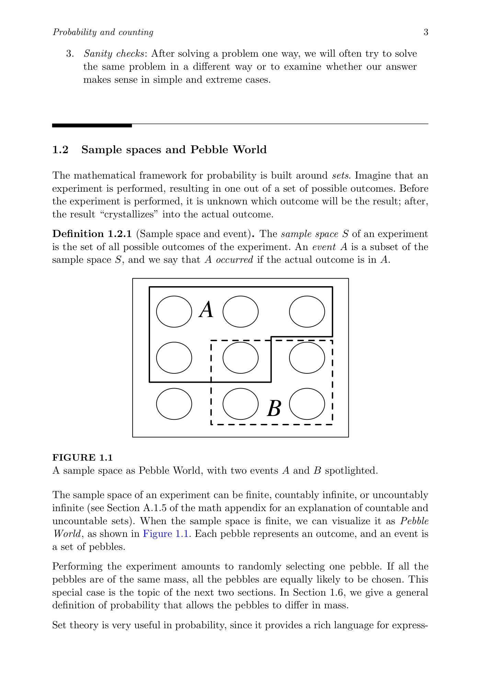
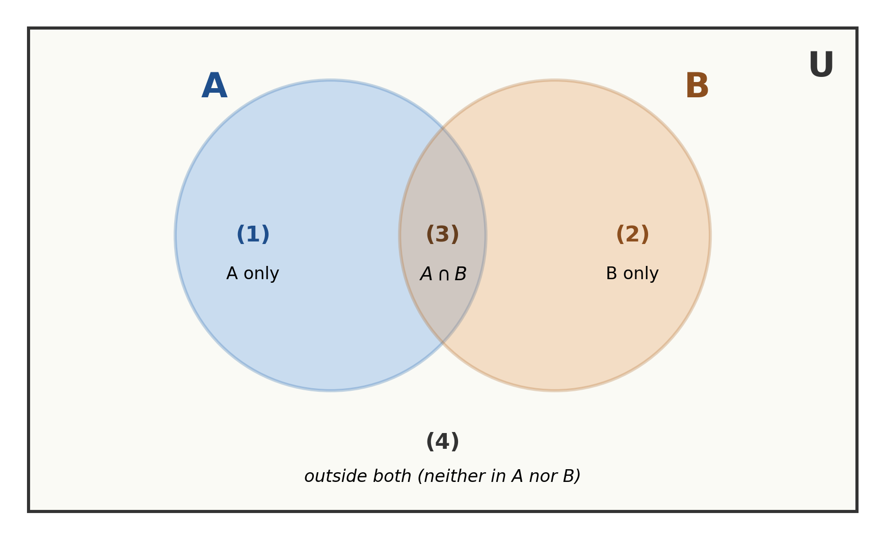
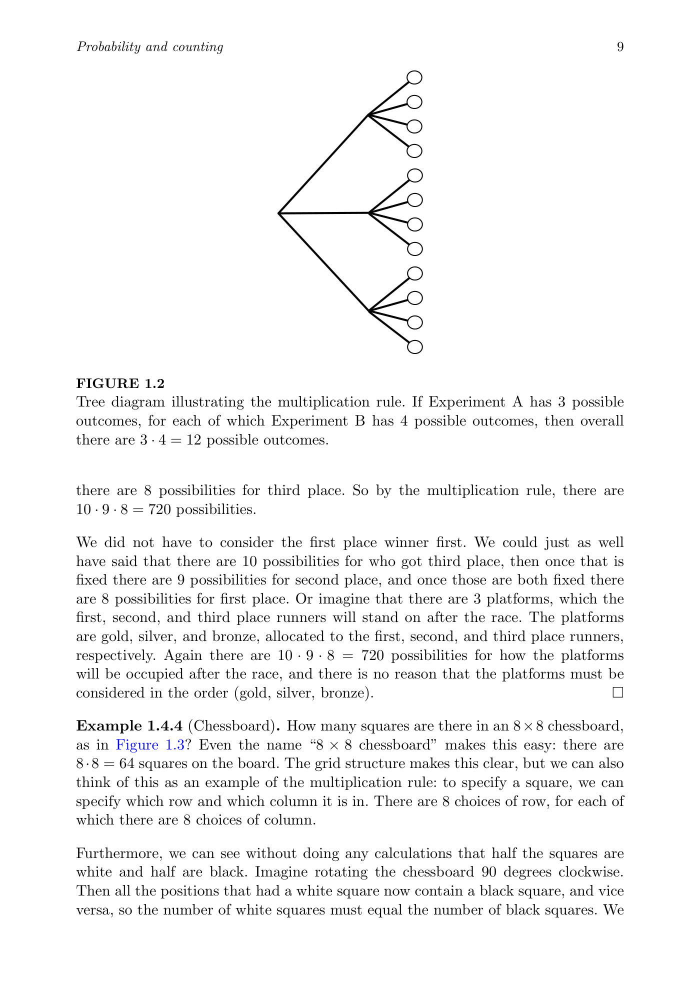
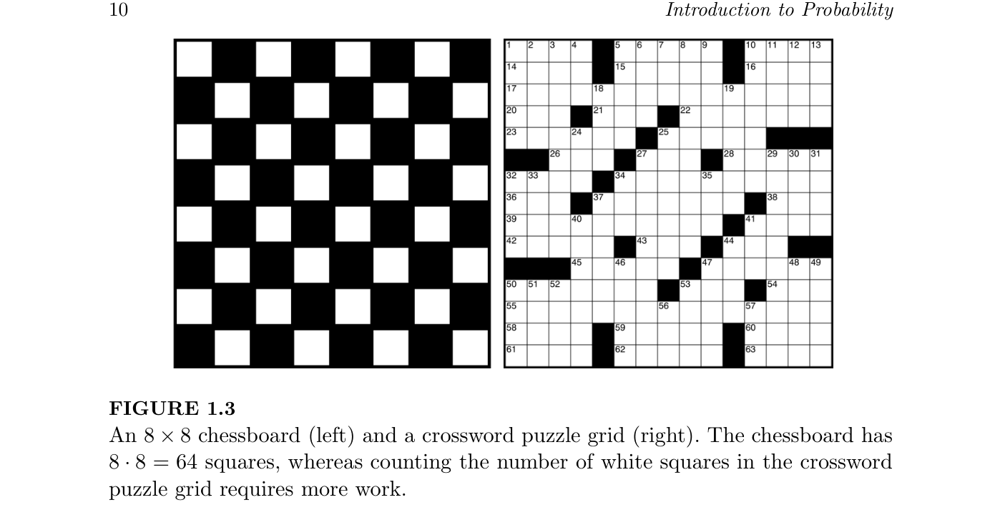
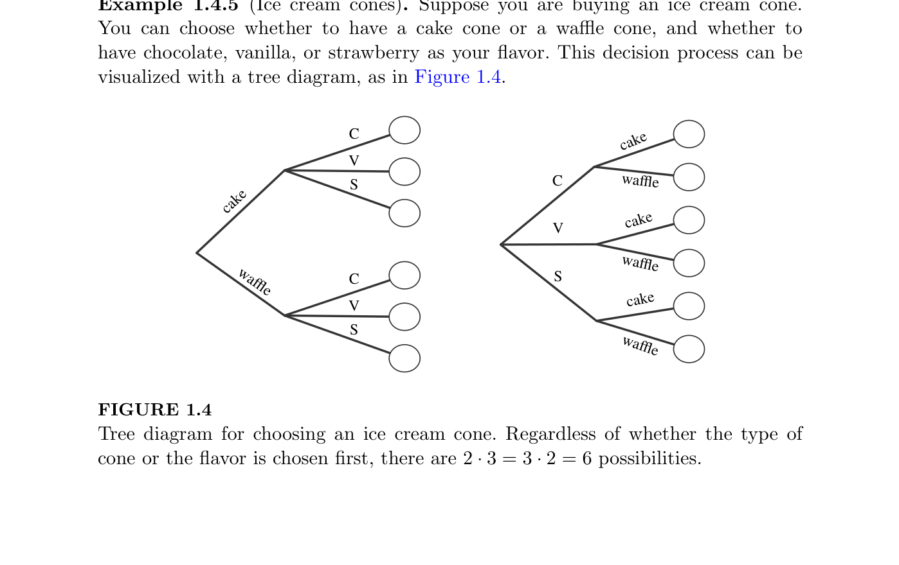
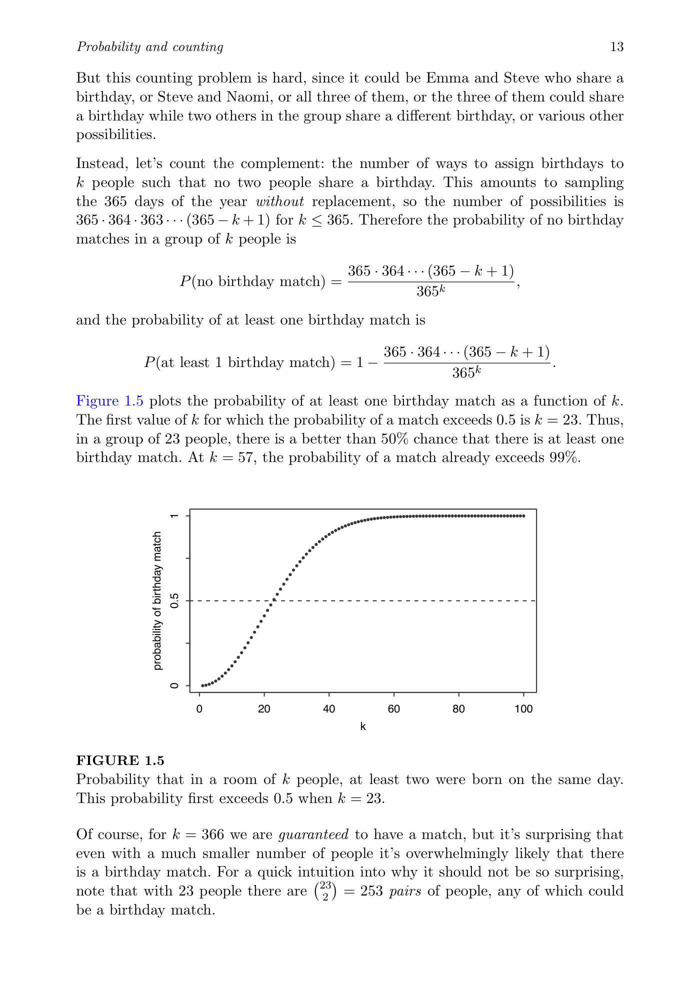
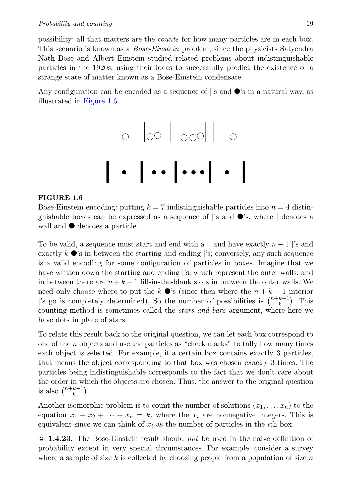

# Chapter 1 — Probability and Counting

*Companion document to [Introduction to Probability (Main)](<../Introduction to Probability (Main).md>)*

_Research compiled 2026-04-19 — Blitzstein & Hwang, *Introduction to Probability*, Ch. 1, with NotebookLM-assisted summaries and full main-agent verification of all 62 exercises._

---


---

> [!info] Chapter Essence
> Chapter 1 establishes probability as a rigorous mathematical framework for quantifying uncertainty — moving beyond unreliable human intuition. When outcomes are strictly symmetric, probabilities follow from careful **counting**. When they aren't, probability must be defined by **formal axioms** that behave like mass distributed across events. The chapter's recurring warning: precisely define your sample space, label distinct objects, and verify equal-likelihood before assuming it.

---

## 1.1 Why Study Probability?

Probability is the **logic of uncertainty**, the natural counterpart to mathematics's logic of certainty. The chapter opens with ten domains where probabilistic thinking is indispensable:

| Domain | Why probability matters |
|---|---|
| **Statistics** | Foundation for all data analysis |
| **Physics** | Quantum mechanics, statistical mechanics |
| **Biology** | Genetics, evolution, epidemiology |
| **Computer Science** | Randomized algorithms, machine learning |
| **Meteorology** | Weather forecasting |
| **Gambling** | Probability's historical birthplace |
| **Finance** | Modeling stock prices, derivatives, risk |
| **Political Science** | Surveys, election forecasting |
| **Medicine** | Randomized clinical trials |
| **Everyday Life** | Avoiding fallacies, making predictions |

Even Leibniz and Newton made elementary probabilistic errors — a reminder that intuition is unreliable. The chapter offers three defenses against this:

> [!tip] Three Anti-Fallacy Strategies
> - **Simulation** — run the experiment many times and observe what actually happens
> - **Biohazards** — study common mistakes (the textbook flags them with a ☣ symbol) so you recognize invalid reasoning
> - **Sanity checks** — solve the same problem multiple ways, or check simple/extreme cases

---

## 1.2 Sample Spaces and Pebble World

Probability lives on top of **set theory**. When an experiment runs, the unknown crystallizes into a single outcome — and the structure of all possible outcomes is what we reason about.

> [!definition] Definition 1.2.1 — Sample Space and Event
> The **sample space** $S$ of an experiment is the set of all possible outcomes. An **event** $A$ is a subset of $S$. We say $A$ *occurred* if the actual outcome lies in $A$.

For finite sample spaces, the textbook introduces **Pebble World** — a visualization where each outcome is a single pebble, and an event is a collection of pebbles. Performing the experiment amounts to randomly picking up one pebble.



Set theory gives us the language for combining events: union $A \cup B$ ("at least one occurs"), intersection $A \cap B$ ("both occur"), complement $A^c$ ("does not occur").

> [!example] Example 1.2.2 — Coin Flips
> **Problem.** A coin is flipped 10 times. Writing Heads as $H$ and Tails as $T$, a possible outcome (pebble) is $HHHTHHTTHT$, and the sample space is the set of all possible strings of length 10 of $H$'s and $T$'s. Define and express the following events in set notation: $A_1$ — the first flip is Heads; $B$ — at least one flip was Heads; $C$ — all the flips were Heads; $D$ — there were at least two consecutive Heads.
> **Setup.** Encode $H$ as $1$ and $T$ as $0$, so the sample space is $S = \{(s_1, s_2, \dots, s_{10}) : s_j \in \{0,1\}\}$. For $j = 1, 2, \dots, 10$, define base events $A_j$ = "the $j$th flip is Heads" $= \{(s_1, \dots, s_{10}) \in S : s_j = 1\}$. The compound events $B, C, D$ will be built from these $A_j$.
> **Solution.** Translate each English description into set operations over $S$. For $A_1$, fix $s_1 = 1$ and let the other coordinates range freely over $\{0,1\}$. "At least one flip is Heads" means the outcome lies in *some* $A_j$, so it belongs to the **union** $\bigcup_j A_j$. "All flips are Heads" means the outcome lies in *every* $A_j$ simultaneously, so it belongs to the **intersection** $\bigcap_j A_j$. "At least two consecutive Heads" means there exists some index $j$ where flips $j$ and $j+1$ are *both* Heads — this is the intersection $A_j \cap A_{j+1}$ — and since this can occur at any valid position $j = 1, \dots, 9$, we take the union over all such positions.
> **Answer.**
> - $A_1 = \{(1, s_2, \dots, s_{10}) : s_j \in \{0,1\} \text{ for } 2 \le j \le 10\}$
> - $B = \bigcup_{j=1}^{10} A_j$
> - $C = \bigcap_{j=1}^{10} A_j$
> - $D = \bigcup_{j=1}^{9} (A_j \cap A_{j+1})$
>
> **Insight.** Compound English phrases like *"at least one"*, *"all"*, and *"consecutive"* translate mechanically into unions, intersections, and unions-of-intersections over base events.

> [!tip] Aside — De Morgan's Laws
> The coin-flip example relies on two identities that will return throughout the book. In set notation:
> $$(A \cup B)^c = A^c \cap B^c \qquad\text{and}\qquad (A \cap B)^c = A^c \cup B^c$$
> In English:
> - **"Not (A or B)"** = **"not A AND not B"**
> - **"Not (A and B)"** = **"not A OR not B"**
>
> The rule in one phrase: **distribute the complement, and flip the operator.** Union becomes intersection; intersection becomes union.

#### Venn diagram — the 4-region view

Every 2-set Venn diagram has exactly four regions. Labeling them lets us verify each law by checking which regions get shaded on each side.



| Region | Description | In $A$? | In $B$? |
|---|---|---|---|
| (1) | Only $A$ | ✓ | ✗ |
| (2) | Only $B$ | ✗ | ✓ |
| (3) | $A \cap B$ (overlap) | ✓ | ✓ |
| (4) | Neither (outside both) | ✗ | ✗ |

**Law 1 — $(A \cup B)^c = A^c \cap B^c$:** both sides shade only region (4).

| Region | $A \cup B$ | $(A \cup B)^c$ | $A^c$ | $B^c$ | $A^c \cap B^c$ |
|---|:---:|:---:|:---:|:---:|:---:|
| (1) Only $A$ | shaded | — | — | shaded | — |
| (2) Only $B$ | shaded | — | shaded | — | — |
| (3) $A \cap B$ | shaded | — | — | — | — |
| (4) Neither | — | **shaded** | shaded | shaded | **shaded** |

**Law 2 — $(A \cap B)^c = A^c \cup B^c$:** both sides shade regions (1), (2), and (4).

| Region | $A \cap B$ | $(A \cap B)^c$ | $A^c$ | $B^c$ | $A^c \cup B^c$ |
|---|:---:|:---:|:---:|:---:|:---:|
| (1) Only $A$ | — | **shaded** | — | shaded | **shaded** |
| (2) Only $B$ | — | **shaded** | shaded | — | **shaded** |
| (3) $A \cap B$ | shaded | — | — | — | — |
| (4) Neither | — | **shaded** | shaded | shaded | **shaded** |

> [!tip] Reading Venn diagrams without getting confused
> Don't try to "see" the whole picture at once. Treat the four regions as four separate boxes, and for each box ask: *is this box shaded on the left side? What about the right side?* If every box matches on both sides, the two expressions are equal. The table is literally doing this box-by-box.

#### Tie-back to the coin flips

From Example 1.2.2, recall $B = \bigcup_{j=1}^{10} A_j$ = "at least one Heads" and $C = \bigcap_{j=1}^{10} A_j$ = "all Heads." Taking complements flips each quantifier:
- $B^c = \left(\bigcup_j A_j\right)^c = \bigcap_j A_j^c$ = **"every flip is Tails"** — a single outcome, the all-Tails string
- $C^c = \left(\bigcap_j A_j\right)^c = \bigcup_j A_j^c$ = **"at least one flip is Tails"** — everything except the all-Heads string

So "not (at least one H)" = "all T", and "not (all H)" = "at least one T." Both are De Morgan's laws extended to 10 sets.

#### Parallel example — traffic lights (ternary analog)

Suppose you observe 4 traffic lights in sequence, each Green, Yellow, or Red. Let $R_j$ = "light $j$ is Red", $G_j$ = "light $j$ is Green", $Y_j$ = "light $j$ is Yellow". Then:

$$E_1 = \bigcup_{j=1}^{4} R_j \;=\; \text{``at least one Red''}$$

Its complement — "no Red anywhere" — admits two equivalent forms by De Morgan:

$$E_1^c = \bigcap_{j=1}^{4} R_j^c = \bigcap_{j=1}^{4} (G_j \cup Y_j)$$

Each light independently avoids Red. Sanity check: $|E_1^c| = 2^4 = 16$ (two non-Red choices per light), and $|S| = 3^4 = 81$, so $|E_1| = 81 - 16 = 65$. The complement is far easier to count than the union directly — a recurring theme from §1.3.

> [!tip] The English ↔ set-operation dictionary
> | English phrase | Set operation |
> |---|---|
> | "at least one" | $\cup$ (union) |
> | "all" / "every" / "simultaneously" | $\cap$ (intersection) |
> | "none" / "no" | complement of a union = $\bigcap$ of complements |
> | "A and B" | $\cap$ |
> | "A or B" | $\cup$ |
>
> De Morgan's laws are what let you switch between these forms freely — for instance, "none" can be written either as $(\bigcup \text{something})^c$ or as $\bigcap (\text{not something})$, and computing the complement is often the easier route.

> [!example] Example 1.2.3 — Pick a Card, Any Card
> **Problem.** Pick a card from a standard deck of 52 cards. The sample space $S$ is the set of all 52 cards (so there are 52 pebbles, one for each card). Consider the four events $A$: card is an ace; $B$: card has a black suit; $D$: card is a diamond; $H$: card is a heart. Express the following events in terms of $A$, $B$, $D$, $H$: the **Ace of Hearts**; the set $\{$Ace of Spades, Ace of Clubs$\}$; **red or an ace**; **red non-ace**.
> **Setup.** Sample space $S$ = the 52 cards of a standard deck. Base events: $A$ (card is an ace, $|A| = 4$), $B$ (card is black — spade or club, $|B| = 26$), $D$ (card is a diamond, $|D| = 13$), $H$ (card is a heart, $|H| = 13$). Note that $D$ and $H$ together comprise the red cards, and $B^c = D \cup H$.
> **Solution.** Combine the base events using unions, intersections, and complements. The **Ace of Hearts** must be both an ace *and* a heart, so it lies in $A \cap H$. The set $\{$Ace of Spades, Ace of Clubs$\}$ consists of cards that are aces *and* black, so it is $A \cap B$. **Red or an ace** means the card satisfies "ace, *or* diamond, *or* heart" — a union $A \cup D \cup H$. **Red non-ace** means the card is *not* black *and* *not* an ace, i.e., $A^c \cap B^c$; by **De Morgan's laws** this is equivalent to $(A \cup B)^c$ — the complement of "ace or black."
> **Answer.**
> - Ace of Hearts: $A \cap H$
> - $\{$Ace of Spades, Ace of Clubs$\}$: $A \cap B$
> - Red or an ace: $A \cup D \cup H$
> - Red non-ace: $(A \cup B)^c = A^c \cap B^c$
>
> **Insight.** Set logic — unions, intersections, complements, and De Morgan's laws — is a precise vocabulary for assembling complex events out of a few simple base events.

The English ↔ set-notation translation goes both ways: "something must happen" ↔ $S$; "not $A$" ↔ $A^c$; "$A$ and $B$ are mutually exclusive" ↔ $A \cap B = \emptyset$.

---

## 1.3 Naive Definition of Probability

The historical starting point for probability was simple counting.

> [!definition] Definition — Naive Probability
> For an event $A$ with finite sample space $S$ where every outcome is equally likely:
> $$P_{\text{naive}}(A) = \frac{|A|}{|S|}$$

In Pebble World, this is just the fraction of pebbles inside $A$. A useful immediate corollary:
$$P_{\text{naive}}(A^c) = \frac{|S| - |A|}{|S|} = 1 - P_{\text{naive}}(A)$$
**Computing the complement is often easier** than computing $A$ directly — a recurring problem-solving move throughout the book.

> [!warning] When the Naive Definition Fails
> It requires *both* a finite sample space *and* equal likelihood of every outcome. The classic abuse: "the probability of life on Mars is $1/2$ because either there is or there isn't." That's a sample space of size 2, but the outcomes are not equally likely.

The naive definition is valid in three settings:

| Justification | Example |
|---|---|
| **Physical symmetry** | Fair coin, well-shuffled deck, balanced die |
| **Equal-likelihood by design** | Simple random sample of $n$ from $N$ |
| **Null model** | Baseline for comparing observed data |

---

## 1.4 How to Count

Since most naive probabilities reduce to ratios of counts, the chapter spends serious time on combinatorics.

### 1.4.1 Multiplication Rule

> [!definition] Theorem — Multiplication Rule
> If a compound experiment has two stages — the first with $a$ outcomes, the second with $b$ outcomes (for each outcome of the first) — then the compound has $a \cdot b$ outcomes. This generalizes to any number of stages.



> [!example] Example 1.4.3-6 — Runners, Chessboard, and Subsets (Multiplication Rule)
> **(i) Runners.**
> **Problem.** Suppose 10 people are running a race. Assume ties are not possible and that all 10 will complete the race, so there will be well-defined first, second, and third place winners. How many possibilities are there for the first, second, and third place winners?
> **Setup.** A compound experiment with three sub-experiments: choose 1st, then 2nd, then 3rd. Sampling is without replacement (a runner cannot win twice).
> **Solution.** Once 1st place is fixed, exactly 9 runners remain eligible for 2nd, and then exactly 8 remain for 3rd. Crucially, the *number* of choices at each stage (9, then 8) is the same regardless of *which* runner won the prior stage, so the multiplication rule applies cleanly.
> **Answer.** $10 \cdot 9 \cdot 8 = 720$ possibilities.
> **Insight.** The multiplication rule needs only that the *count* of options at each stage be fixed — not that the *identities* of those options be the same.
>
> **(ii) Chessboard.**
> **Problem.** How many squares are there in an $8 \times 8$ chessboard?
> **Setup.** Specify a square by a (row, column) coordinate. Two sub-experiments: pick a row, then pick a column.
> **Solution.** There are 8 choices for the row. For *every* row chosen, there are exactly 8 choices for the column — the column count does not depend on the row. The multiplication rule then traverses the entire grid.
> **Answer.** $8 \cdot 8 = 64$ squares.
> **Insight.** Any rectangular grid is the prototypical multiplication-rule structure: rows $\times$ columns.
>
> **(iii) Subsets.**
> **Problem.** A set with $n$ elements has $2^n$ subsets, including the empty set $\emptyset$ and the set itself.
> **Setup.** Build a subset by walking through the $n$ elements one at a time and deciding *include* or *exclude*. Each element gives one independent sub-experiment with 2 outcomes.
> **Solution.** The decision for one element places no constraint on any other, so the number of choices is exactly 2 at every step. Multiplying $n$ factors of 2 enumerates every possible inclusion pattern, and each pattern corresponds to a unique subset.
> **Answer.** $\underbrace{2 \cdot 2 \cdots 2}_{n} = 2^n$ subsets.
> **Insight.** Encoding objects as binary include/exclude strings is one of the most powerful counting moves in combinatorics.



> [!example] Example 1.4.5 — Ice Cream Cones
> **Problem.** You are buying an ice cream cone: choose a cake or waffle cone, and chocolate, vanilla, or strawberry flavor. Now suppose you buy two cones on a certain day, one in the afternoon and one in the evening, written e.g. $(\text{cakeC}, \text{waffleV})$. If you only care *which kinds* you had that day and not the order, are there $36/2 = 18$ possibilities?
> **Setup.** A single cone has 2 cone-types $\times$ 3 flavors $= 6$ possibilities by the multiplication rule. Two cones in order give $6 \times 6 = 36$ ordered outcomes. We must then ask whether dividing by 2 correctly removes order.
> **Solution.** Naive division by 2 fails because not every ordered pair has a distinct mirror image: pairs like $(\text{cakeC}, \text{cakeC})$ are their own reverses, so dividing them by 2 *undercounts* them. Of the 36 ordered pairs, 6 are "same-cone-twice" (afternoon = evening) and the other 30 split into 15 distinct unordered pairs. Adding gives $15 + 6 = 21$ unordered outcomes — *not* 18.
> **Answer.** 36 ordered possibilities; 21 unordered possibilities.
> **Insight.** Dividing by an overcounting factor only works when the factor applies *uniformly* to every outcome — symmetric (repeated) cases are their own warning sign.



Two specializations follow immediately:

| Sampling method | Count | When used |
|---|---|---|
| **With replacement** | $n^k$ | Each draw is independent; values can repeat |
| **Without replacement** | $n(n-1)(n-2)\cdots(n-k+1) = \dfrac{n!}{(n-k)!}$ | Each draw removes the item; order matters |

> [!tip] Aside — Unpacking the algebra: $n(n-1)(n-2)\cdots(n-k+1) = \dfrac{n!}{(n-k)!}$
> The two expressions are the same number, just packaged differently. The left side counts the draws directly; the right side is an algebraic repackaging via factorials.

#### The factorial rewrite — multiply top and bottom by $(n-k)!$

Recall $n! = n(n-1)(n-2)\cdots 2 \cdot 1$ (a full countdown from $n$ to $1$). Expand the ratio in full and look for the "tail":

$$\frac{n!}{(n-k)!} \;=\; \frac{\overbrace{n(n-1)\cdots(n-k+1)}^{\text{first } k \text{ factors}} \;\cdot\; \overbrace{(n-k)(n-k-1)\cdots 2 \cdot 1}^{(n-k)!}}{(n-k)(n-k-1)\cdots 2 \cdot 1}$$

The denominator is **identical** to the tail of the numerator's factorial, so it cancels:

$$\frac{n!}{(n-k)!} \;=\; \frac{n(n-1)\cdots(n-k+1) \cdot \cancel{(n-k)!}}{\cancel{(n-k)!}} \;=\; n(n-1)\cdots(n-k+1)$$

That is the whole algebraic trick: multiplying top and bottom by $(n-k)!$ turns a truncated product into a clean ratio of two complete factorials, and the tail cancels.

#### Concrete check ($n=5$, $k=3$)

- **Draw-by-draw:** $5 \cdot 4 \cdot 3 = 60$  (three factors; last is $n-k+1 = 5-3+1 = 3$)
- **Factorial form:** $\dfrac{5!}{(5-3)!} = \dfrac{5!}{2!} = \dfrac{5 \cdot 4 \cdot 3 \cdot \cancel{2 \cdot 1}}{\cancel{2 \cdot 1}} = 60$  ✓

#### Why keep both forms around?

| Reason | Benefit |
|---|---|
| **Compactness** | $\frac{n!}{(n-k)!}$ is one clean expression — no trailing "..." whose length depends on $k$ |
| **Plays well with $\binom{n}{k}$** | $\binom{n}{k} = \dfrac{n!}{k!\,(n-k)!}$ — the ordered count is literally the first step of that derivation (§1.4.3) |
| **Edge cases are automatic** | $k=0$: $\dfrac{n!}{n!}=1$ (one way to pick nothing); $k=n$: $\dfrac{n!}{0!}=n!$ (full permutations of the whole set) |

Arranging all $n$ distinct objects in order: $n!$ permutations.

> [!example] Example 1.4.10 — Birthday Problem
> **Problem.** There are $k$ people in a room. Assume each person's birthday is equally likely to be any of the 365 days of the year (excluding February 29) and that birthdays are independent. What is the probability that at least one pair of people share a birthday?
> **Setup.** Sample space: each person independently has 365 possible birthdays, so $|S| = 365^k$ (sampling with replacement). Let $A$ = "at least one shared birthday." It is easier to count $A^c$ = "all birthdays distinct."
> **Solution.** For $A^c$, assign birthdays one person at a time *without* repeating any used day. Person 1 has 365 choices; person 2 has 364 (any day except person 1's); person 3 has 363; and so on down to person $k$, who has $365 - k + 1$ choices. Because the count at each step is fixed (decreasing by exactly one) regardless of which prior days were used, the multiplication rule gives $|A^c| = 365 \cdot 364 \cdots (365 - k + 1)$. Then take the complement.
> **Answer.** $$P(A) \;=\; 1 \;-\; \frac{365 \cdot 364 \cdots (365 - k + 1)}{365^k}.$$ At $k = 23$ this already exceeds $1/2$.
> **Insight.** Counting "no match" via the complement is dramatically easier than counting matches directly — and the threshold $k=23$ is famously much smaller than people's intuition suggests.



> [!example] Example 1.4.12 — Leibniz's Mistake
> **Problem.** If we roll two fair dice, which is more likely: a sum of 11 or a sum of 12?
> **Setup.** Label the dice as Die A and Die B. Each die has 6 outcomes; by the multiplication rule the sample space has $6 \cdot 6 = 36$ equally likely ordered pairs.
> **Solution.** Leibniz reasoned that since 11 = 5+6 and 12 = 6+6 are each "one combination," the two sums are equally likely. The error is treating the dice as indistinguishable. With labeled dice, sum 11 arises from the *two* ordered pairs $(5,6)$ and $(6,5)$, while sum 12 arises from only the single ordered pair $(6,6)$. The multiplication rule's labeling automatically respects this asymmetry.
> **Answer.** $P(\text{sum}=11) = 2/36 = 1/18$, while $P(\text{sum}=12) = 1/36$. Sum 11 is twice as likely.
> **Insight.** When outcomes are equally likely, you must enumerate the *labeled* sample space; merging physically distinct outcomes into one "combination" silently distorts the probabilities.

### 1.4.2 Adjusting for Overcounting

When each possibility is counted exactly $c$ times, divide by $c$.

> [!example] Example 1.4.14 — Committees and Teams
> **Problem.** Consider a group of four people. (a) How many ways are there to choose a two-person committee? (b) How many ways are there to break the people into two teams of two?
> **Setup.** Naive multiplication-rule counts will overcount because a *committee* and a *team-split* are unordered structures. We must identify and divide by the appropriate overcounting factor in each case.
> **Solution.** *(a)* By the multiplication rule there are $4 \cdot 3 = 12$ ordered ways to pick the first then second committee member. But $\{P_1, P_2\}$ chosen in either order is the same committee, so each committee is counted $2! = 2$ times. Divide by 2: $12/2 = 6$. *(b)* Use part (a): 6 ways to pick the first team, which automatically determines the second. But the two teams are unlabeled — choosing $\{1,2\}$ first (leaving $\{3,4\}$) yields the same split as choosing $\{3,4\}$ first (leaving $\{1,2\}$). Each split is counted twice, so divide by 2: $6/2 = 3$.
> **Answer.** (a) $\dbinom{4}{2} = 6$ committees. (b) $3$ team-splits.
> **Insight.** The overcounting factor is exactly the size of the symmetry group acting on the structure: $2!$ for the order *within* a committee, $2$ for swapping the *labels of two indistinguishable teams*.

> [!tip] Why $\binom{4}{2} = 6$ makes sense — pick in order, then collapse
> The formula comes from **two questions asked in sequence**: *"how many ordered ways can I pick $k$ items from $n$?"* → *"how many of those are really the same unordered selection in disguise?"*
>
> **Step 1 — Pick in order (pretend order matters).** For 2 picks from $\{A,B,C,D\}$: 1st pick has $4$ options, 2nd has $3$, giving $4 \cdot 3 = 12$ ordered picks:
>
> | AB | AC | AD |
> | -- | -- | -- |
> | BA | BC | BD |
> | CA | CB | CD |
> | DA | DB | DC |
>
> In factorial form: $\dfrac{n!}{(n-k)!} = \dfrac{4!}{2!} = 12$.
>
> **Step 2 — Collapse the duplicates.** Each unordered pair shows up exactly $k! = 2! = 2$ times (AB and BA are the same committee):
>
> | Unordered pair | Ordered versions of it |
> | -------------- | ---------------------- |
> | $\{A,B\}$      | AB, BA                 |
> | $\{A,C\}$      | AC, CA                 |
> | $\{A,D\}$      | AD, DA                 |
> | $\{B,C\}$      | BC, CB                 |
> | $\{B,D\}$      | BD, DB                 |
> | $\{C,D\}$      | CD, DC                 |
>
> So the 12 ordered picks encode only $12 / 2 = 6$ distinct committees. ✓
>
> **Assembling the formula.** Step 1 gives the numerator, Step 2 gives the $k!$ in the denominator:
>
> $$\binom{n}{k} = \underbrace{\frac{n!}{(n-k)!}}_{\text{ordered picks}} \cdot \underbrace{\frac{1}{k!}}_{\text{cancel the order}} = \frac{n!}{k!(n-k)!}$$
>
> Reading each factor for $\binom{4}{2}$:
>
> | Factor        | What it cancels                                             | Value |
> | ------------- | ----------------------------------------------------------- | ----- |
> | $n! = 4!$     | Line up **all** 4 people in a row — every arrangement       | $24$  |
> | $(n-k)! = 2!$ | Order of the **2 *not* chosen** (doesn't matter) — divide   | $2$   |
> | $k! = 2!$     | Order of the **2 chosen** (doesn't matter) — divide         | $2$   |
>
> Result: $\dfrac{24}{2 \cdot 2} = 6$. ✓
>
> **One-line intuition.** "Multiply down from $n$ for $k$ steps. Divide by $k!$." Or in story-proof language: "Line them up, then divide out whichever orderings don't matter."

> [!tip] Bonus — Reading $\binom{4}{2}$ off Pascal's triangle
> The answer $\binom{4}{2} = 6$ can also be found **visually**, without computing a quotient at all. Pascal's triangle collects every binomial coefficient into a single grid: **row $n$, position $k$** (both starting from $0$) *is* $\binom{n}{k}$.
>
> ```
> Row 0:            1
> Row 1:           1  1
> Row 2:          1  2  1
> Row 3:         1  3  3  1
> Row 4:        1  4  6  4  1        ← row 4, position 2 = 6 = C(4,2)
> Row 5:       1  5 10 10  5  1
> Row 6:      1  6 15 20 15  6  1
> ```
>
> Decoding row 4 entry-by-entry:
>
> | Position $k$ | $\binom{4}{k}$ | Meaning                           |
> | ------------ | -------------- | --------------------------------- |
> | 0            | 1              | The empty committee               |
> | 1            | 4              | Pick 1 person                     |
> | 2            | **6**          | **Pick 2 (this example)**         |
> | 3            | 4              | Pick 3 people                     |
> | 4            | 1              | Pick all 4                        |
>
> **Two structural facts on display.**
> - The **edges are always 1** because $\binom{n}{0} = 1$ (the empty subset) and $\binom{n}{n} = 1$ (the full subset).
> - Every interior entry equals the sum of the two directly above it — the **recurrence** $\binom{n}{k} = \binom{n-1}{k-1} + \binom{n-1}{k}$. The whole triangle regenerates from nothing but addition.

> [!definition] Definition — Binomial Coefficient
> $\binom{n}{k}$ ("$n$ choose $k$") is the number of size-$k$ subsets of an $n$-element set. The closed form:
> $$\binom{n}{k} = \frac{n(n-1)\cdots(n-k+1)}{k!} = \frac{n!}{(n-k)!\,k!}$$
> (with $\binom{n}{k} = 0$ when $k > n$).

The denominator $k!$ corrects for overcounting: each unordered subset corresponds to $k!$ ordered ones.

> [!example] Example 1.4.20 — Permutations of a Word
> **Problem.** How many ways are there to permute the letters in the word LALALAAA? How many ways are there to permute the letters in the word STATISTICS?
> **Setup.** When letters repeat, treating positions as distinguishable overcounts each visible arrangement by the number of internal swaps among identical letters. We must divide by the product of factorials of the repeated-letter counts.
> **Solution.** *LALALAAA* has 8 positions with 5 A's and 3 L's. Picking which 3 of the 8 positions hold the L's (the rest are A's) determines the word, giving $\binom{8}{3} = \binom{8}{5} = 56$. Equivalently, $8!$ permutations of distinct labels divided by $5!$ (rearrangements among the A's) and $3!$ (rearrangements among the L's). *STATISTICS* has 10 letters with three S's, three T's, two I's, one A, one C. Pretending all 10 are distinct gives $10!$. Each visible word is then counted $3!$ times for the S-swaps, $3!$ times for the T-swaps, and $2!$ times for the I-swaps, so divide by $3! \cdot 3! \cdot 2!$.
> **Answer.** LALALAAA: $\dbinom{8}{5} = 56$. STATISTICS: $\dfrac{10!}{3!\,3!\,2!} = 50{,}400$.
> **Insight.** The general "permutations with repetitions" formula $\frac{n!}{n_1!\,n_2!\,\cdots\,n_k!}$ is just the multiplication rule (treating items as distinct) followed by quotienting out each indistinguishable swap-group.

> [!tip] Aside — Unpacking Example 1.4.20: *visible* vs *labeled* arrangements
> The entire idea hinges on a distinction the example skips past. When you arrange the letters of LALALAAA, "how many arrangements are there?" depends on whether you can **tell the A's apart**.
>
> - **Labeled arrangement.** Every letter has a secret tag ($A_1, A_2, A_3, A_4, A_5, L_1, L_2, L_3$). Two arrangements differ if any tag is in a different slot. There are $8!$ of these.
> - **Visible arrangement.** The tags are invisible. Two arrangements are "the same word" if they look identical once the tags are stripped off. Many of the $8!$ labeled arrangements collapse onto the same visible word — and the question is asking for *visible* words only.
>
> The task is to figure out how many labeled arrangements collapse onto each visible word, then divide.

#### Tiny worked example — the word **AAB**

Imagine the A's carry secret tags $A_1, A_2$. The $3! = 6$ labeled arrangements strip down as follows:

| Labeled | Visible (tags stripped) |
|---|---|
| $A_1\,A_2\,B$ | **AAB** |
| $A_2\,A_1\,B$ | **AAB** |
| $A_1\,B\,A_2$ | **ABA** |
| $A_2\,B\,A_1$ | **ABA** |
| $B\,A_1\,A_2$ | **BAA** |
| $B\,A_2\,A_1$ | **BAA** |

Only **3 distinct visible words**. Each visible word appears **exactly twice** — once per way to secretly order the two A's. That $2$ is $2!$, so:

$$\text{visible} \;=\; \frac{\text{labeled}}{\text{swaps that leave the word unchanged}} \;=\; \frac{3!}{2!} \;=\; 3 \;\checkmark$$

#### Two repeated groups — **AABB**

Label everything: $A_1, A_2, B_1, B_2$. Labeled count: $4! = 24$. For any visible word like "AABB", how many labeled arrangements look identical to it?

- The two A's can be in either secret order → $2$ ways
- The two B's can *independently* be in either secret order → $2$ ways
- Total: $2 \times 2 \;=\; 2! \times 2! \;=\; 4$ labeled versions per visible word

Visible count: $\dfrac{4!}{2!\,2!} = \dfrac{24}{4} = 6$. Enumerating verifies it:

> **AABB, ABAB, ABBA, BAAB, BABA, BBAA** — six ✓

#### The critical subtlety — why **multiply** the divisors, not add

For LALALAAA we divide by $5! \cdot 3!$, not $5! + 3!$. Why? Because the two swap-groups are **independent**:

- *Whatever* order the A's are labeled in, the L's can still be shuffled $3! = 6$ ways without changing the visible word.
- *Whatever* order the L's are labeled in, the A's can still be shuffled $5! = 120$ ways without changing the visible word.

Both shuffles happen simultaneously and independently — so by the multiplication rule, each visible word is counted $5! \cdot 3! = 720$ times in the labeled $8!$. This is the same multiplication rule we use everywhere in counting; it just happens to apply to the overcount itself.

$$\text{visible words of LALALAAA} \;=\; \frac{8!}{5! \cdot 3!} \;=\; \frac{40{,}320}{720} \;=\; 56$$

#### Two viewpoints — same formula

The example offers two solutions; they look different but are literally the same equation:

| Approach | Reasoning | Calculation |
|---|---|---|
| **Positions (top-down)** | Choose 3 of the 8 slots to hold L's; A's fill the rest automatically | $\binom{8}{3} = 56$ |
| **Overcount (bottom-up)** | Arrange 8 labeled letters → $8!$; divide by each type's internal swaps | $\dfrac{8!}{5!\,3!} = 56$ |

These are the same formula because the binomial coefficient is *defined* as
$$\binom{8}{3} = \frac{8!}{3!\,(8-3)!} = \frac{8!}{3!\,5!}.$$
The "positions" story and the "overcount" story are two English readings of the same algebra.

#### Applying the recipe to STATISTICS

Letters: 3 S's, 3 T's, 2 I's, 1 A, 1 C (total 10).

| Letter | Count | Invisible-swap factor |
|---|---|---|
| S | 3 | $3! = 6$ |
| T | 3 | $3! = 6$ |
| I | 2 | $2! = 2$ |
| A | 1 | $1! = 1$ (trivial) |
| C | 1 | $1! = 1$ (trivial) |

Each visible word is counted $3! \cdot 3! \cdot 2! \cdot 1! \cdot 1! \;=\; 6 \cdot 6 \cdot 2 \;=\; 72$ times inside the labeled $10!$. So:

$$\text{visible words} \;=\; \frac{10!}{3!\,3!\,2!\,1!\,1!} \;=\; \frac{3{,}628{,}800}{72} \;=\; 50{,}400$$

The $1!$ terms are harmless — writing them keeps the pattern uniform (every letter type contributes its factorial) without changing the value.

#### The general formula — *multinomial coefficient*

If you have $n$ total items split into $k$ groups of sizes $n_1, n_2, \ldots, n_k$ (with $n_1 + n_2 + \cdots + n_k = n$):

$$\binom{n}{n_1,\,n_2,\,\ldots,\,n_k} \;=\; \frac{n!}{n_1!\,n_2!\,\cdots\,n_k!}$$

This is the direct generalization of $\binom{n}{k}$ from 2 groups to any number.

> [!tip] The essence, one sentence
> Treat all items as distinct ($n!$ labeled arrangements), then divide by the product of factorials of each identical group. Swaps **within** a group don't make new visible words (→ divide). Swaps **across** different groups happen independently (→ multiply the divisors, by the multiplication rule). The rest is arithmetic.

> [!example] Example 1.4.22 — Full House in Poker
> **Problem.** A 5-card hand is dealt from a standard, well-shuffled 52-card deck. The hand is a *full house* if it consists of three cards of some rank and two cards of another rank (e.g., three 7's and two 10's, in any order). What is the probability of a full house?
> **Setup.** Order in a hand is irrelevant, so by symmetry every 5-card hand is equally likely. Sample space: $\binom{52}{5}$ unordered hands. Count full houses by sequentially choosing the triple's rank, the triple's suits, the pair's rank, then the pair's suits.
> **Solution.** *Triple's rank:* 13 choices. *Which 3 of the 4 suits hold that rank:* $\binom{4}{3} = 4$ — this divides $4 \cdot 3 \cdot 2$ ordered suit-picks by $3!$ since the three triple-cards are unordered within the hand. *Pair's rank:* 12 remaining choices (must differ from the triple's rank). *Which 2 of the 4 suits for the pair:* $\binom{4}{2} = 6$ — dividing $4 \cdot 3$ by $2!$ for the unordered pair-cards. By the multiplication rule, the count of full houses is $13 \cdot \binom{4}{3} \cdot 12 \cdot \binom{4}{2}$.
> **Answer.** $$P(\text{full house}) \;=\; \frac{13 \cdot \binom{4}{3} \cdot 12 \cdot \binom{4}{2}}{\binom{52}{5}} \;=\; \frac{3744}{2{,}598{,}960} \;\approx\; 0.00144.$$
> **Insight.** Order-of-operations matters: choose ranks *before* suits, and treat the triple and pair as distinguishable (one is "the threes," the other is "the pair") so you don't accidentally divide by an extra 2.

> [!example] Example 1.4.23 — Newton-Pepys Problem
> **Problem.** Isaac Newton was consulted by Samuel Pepys (for gambling purposes) on which event has the highest probability. $A$: at least one 6 appears when 6 fair dice are rolled. $B$: at least two 6's appear when 12 fair dice are rolled. $C$: at least three 6's appear when 18 fair dice are rolled.
> **Setup.** Each die shows one of 6 equally likely faces independently, so the sample spaces have sizes $6^6$, $6^{12}$, and $6^{18}$. "At least $j$ sixes in $n$ dice" covers many cases ($j, j+1, \ldots, n$), so use the **complement** — "fewer than $j$ sixes" — which has only $j$ cases ($0, 1, \ldots, j-1$) — then subtract from $1$. The core building block is counting outcomes with **exactly $k$ sixes in $n$ dice**, done in two independent choices: *(1)* pick which $k$ of the $n$ labeled dice show a 6 — this is a subset of size $k$ from $n$ dice, so $\binom{n}{k}$ ways; *(2)* for each of the remaining $n-k$ dice, pick one of the 5 non-6 faces — so $5^{n-k}$ ways. By the multiplication rule, $\binom{n}{k} \cdot 5^{n-k}$ outcomes have exactly $k$ sixes, giving probability $\binom{n}{k} \cdot 5^{n-k} / 6^n$.
> **Solution.** Pepys (and intuition) suggested these probabilities should grow with the number of dice; in fact they decrease.
> $$P(A) = 1 - \frac{5^6}{6^6} \approx 0.665.$$
> $$P(B) = 1 - \frac{5^{12} + \binom{12}{1}\,5^{11}}{6^{12}} \approx 0.619.$$
> $$P(C) = 1 - \frac{5^{18} + \binom{18}{1}\,5^{17} + \binom{18}{2}\,5^{16}}{6^{18}} \approx 0.597.$$
> **Answer.** $A$ has the highest probability. (Newton got it right; Pepys did not.)
> **Insight.** Increasing the number of trials *and* the success threshold proportionally does not preserve the probability — the threshold scales linearly while typical fluctuations scale only as $\sqrt{n}$, so demanding "three sixes in 18" is strictly harder than "one six in 6."

> [!example] Example 1.4.24 — Bose-Einstein
> **Problem.** How many ways are there to choose $k$ times from a set of $n$ objects with replacement, if order doesn't matter (we only care how many times each object was chosen, not the order)? Equivalently: how many ways to place $k$ indistinguishable particles into $n$ distinguishable boxes?
> **Setup.** Encode an arrangement as a *stars-and-bars* sequence: $k$ stars (particles) and $n-1$ bars (interior walls between adjacent boxes). For example, $\star\star\,|\,\star\,|\,|\,\star$ represents 2 particles in box 1, 1 in box 2, 0 in box 3, and 1 in box 4. The total length of the sequence is $n + k - 1$ symbols.
> **Solution.** Each valid sequence of $n+k-1$ symbols, with exactly $k$ of them stars and $n-1$ bars, corresponds bijectively to one arrangement. So we just choose which $k$ of the $n+k-1$ positions are stars, giving $\binom{n+k-1}{k}$. From the formula $\frac{(n+k-1)!}{k!\,(n-1)!}$, the $k!$ divides out the indistinguishable star-permutations and the $(n-1)!$ divides out the indistinguishable bar-permutations.
> **Answer.** $\dbinom{n+k-1}{k}$ ways.
> **Insight.** "Stars and bars" turns an unordered-sample-with-replacement problem into a single binomial coefficient by re-encoding it as a sequence; the two factorials in the denominator track the two flavors of indistinguishability (identical particles, identical walls).



> [!note] Binomial Theorem
> $$(x+y)^n = \sum_{k=0}^{n} \binom{n}{k} x^k y^{n-k}$$
> because there are $\binom{n}{k}$ ways to pick $x$ from $k$ of the $n$ factors and $y$ from the rest.

---

## 1.5 Story Proofs

A **story proof** proves an identity by *interpretation* — typically by counting the same thing two different ways. Often easier and more illuminating than algebra.

> [!example] Example 1.5.1 — Choosing the Complement
> **Identity.** $$\binom{n}{k} = \binom{n}{n-k}$$
> **Problem.** Show that the number of ways to choose a $k$-person committee from $n$ people equals the number of ways to choose an $(n-k)$-person group from those same $n$ people.
> **Setup.** A pool of $n$ distinguishable people. The left side counts size-$k$ subsets; the right side counts size-$(n-k)$ subsets.
> **Story (Solution).** **Left side counts** the number of ways to pick exactly $k$ people *to include* on the committee. **Right side counts the same committees** by instead picking the $n-k$ people *to exclude*. Every choice of who is in uniquely determines who is out, and vice versa — the two acts are a perfect bijection between size-$k$ subsets and size-$(n-k)$ subsets. **Therefore the counts are equal.**
> **Answer.** $\binom{n}{k} = \binom{n}{n-k}$.
> **Insight.** The algebraic proof cancels factorials mechanically; the story reveals *why* — choosing a subset is the same act as choosing its complement.

> [!example] Example 1.5.2 — Team Captain
> **Identity.** $$n\binom{n-1}{k-1} = k\binom{n}{k}$$
> **Problem.** Show that the number of ways to form a $k$-person team with a designated captain, drawn from a pool of $n$ people, can be counted in two equivalent ways.
> **Setup.** We are counting ordered structures of the form (team of $k$, one captain $\in$ team) drawn from $n$ people.
> **Story (Solution).** Each side is a product of **two factors** — one picks the captain, one fills the rest of the team. The sides just differ in *which step comes first*.
> - **Left (captain first):** $n$ ways to pick the captain, then $\binom{n-1}{k-1}$ ways to fill the remaining $k-1$ seats from the $n-1$ non-captains.
> - **Right (team first):** $\binom{n}{k}$ ways to pick the full $k$-person team (nobody is captain yet), then $k$ ways to promote one of the $k$ team members to captain. ⚠ The factor $k$ on the right is **captain-within-team**, not a team-choice — the team is chosen by $\binom{n}{k}$.
>
> **Sanity check ($n=3$, $k=2$, people {A,B,C}):** Left = $3 \cdot \binom{2}{1} = 6$. Right = $\binom{3}{2} \cdot 2 = 6$. Both enumerate the same 6 captained teams — grouped by captain on the left, by team on the right. Identical end-objects ⇒ identical counts. **Therefore equal.**
> **Answer.** $n\binom{n-1}{k-1} = k\binom{n}{k}$.
> **Insight.** Switching the *order* in which we make choices (captain-first vs team-first) gives two different formulas for the same count, exposing a structural identity that algebra alone hides.

> [!example] Example 1.5.3 — Vandermonde's Identity
> **Identity.** $$\binom{m+n}{k} = \sum_{j=0}^{k}\binom{m}{j}\binom{n}{k-j}$$
> **Problem.** Show that choosing a $k$-person committee from a combined group of $m$ juniors and $n$ seniors can be counted directly *or* by partitioning over how many juniors are chosen.
> **Setup.** An organization with $m$ juniors and $n$ seniors, totalling $m+n$ people. We form a committee of size $k$.
> **Story (Solution).** **Left side counts** size-$k$ committees drawn from the full pool of $m+n$ people, ignoring the junior/senior distinction. **Right side counts the same committees** by *conditioning on the number of juniors* $j$. For each fixed $j$ (where $0 \le j \le k$), choose $j$ juniors from $m$ in $\binom{m}{j}$ ways and the remaining $k-j$ seniors from $n$ in $\binom{n}{k-j}$ ways; multiply, then sum over all possible $j$. Every committee falls into exactly one such case (it has a definite junior count), so the cases form a partition of all size-$k$ committees. **Therefore equal.**
> **Answer.** $\binom{m+n}{k} = \displaystyle\sum_{j=0}^{k}\binom{m}{j}\binom{n}{k-j}$.
> **Insight.** Vandermonde is the combinatorial law of total counting: split the universe by a natural attribute (junior count), tally each case, and the pieces reconstruct the whole — far more transparent than expanding $(1+x)^{m+n} = (1+x)^m(1+x)^n$.

> [!example] Example 1.5.4 — Partnerships
> **Identity.** $$\frac{(2n)!}{2^n \cdot n!} = (2n-1)(2n-3)\cdots 3 \cdot 1$$
> **Problem.** Show that the number of ways to partition $2n$ people into $n$ unordered pairs can be counted both by *line-up-and-divide* and by *sequential pairing*.
> **Setup.** A set of $2n$ distinguishable people; we want to count perfect matchings — partitions into $n$ pairs where neither the order of the pairs nor the order within each pair matters.
> **Story (Solution).** **Left side counts** matchings by *lining everyone up*: arrange all $2n$ people in a row in $(2n)!$ ways and declare positions $(1,2), (3,4), \ldots, (2n-1, 2n)$ to be the pairs. This overcounts: the $n$ pairs could be listed in any of $n!$ orders (divide by $n!$), and within each pair the two members could be swapped in $2$ ways for a total of $2^n$ swaps (divide by $2^n$), giving $\frac{(2n)!}{2^n n!}$. **Right side counts the same matchings** by *sequential pairing*: take person 1 — they have $2n-1$ possible partners; take the next unpaired person — they have $2n-3$ remaining choices; continue until the last two are forced together with $1$ choice. Multiplying gives $(2n-1)(2n-3)\cdots 3\cdot 1$. Both algorithms enumerate the exact same set of perfect matchings. **Therefore equal.**
> **Answer.** $\dfrac{(2n)!}{2^n \cdot n!} = (2n-1)(2n-3)\cdots 3 \cdot 1$.
> **Insight.** A messy quotient of factorials and a clean product of odd numbers turn out to be the *same count* viewed from two algorithms — story proof shows the equality is structural, not a coincidence of cancellation.

> [!tip] Why the $2^n$? — unpacking the pair-internal overcount
> Each of the $n$ pairs has **2 internal orderings** — pair $\{A,B\}$ can be written as $(A,B)$ or $(B,A)$ and both describe the same pair. With $n$ pairs independently swappable, the total overcount from internal orderings is $2 \cdot 2 \cdots 2 = 2^n$.
>
> **Concrete check at $n=2$ (four people $\{A,B,C,D\}$).** The $(2n)! = 24$ line-ups group into exactly **3 distinct partnerships**, each appearing $2^n \cdot n! = 4 \cdot 2 = 8$ times (reading positions 1–2 as pair 1 and positions 3–4 as pair 2):
>
> | Partnership         | Line-ups producing it                                                       | Count |
> | ------------------- | --------------------------------------------------------------------------- | ----- |
> | $\{A,B\}, \{C,D\}$  | ABCD, ABDC, BACD, BADC, CDAB, CDBA, DCAB, DCBA                              | 8     |
> | $\{A,C\}, \{B,D\}$  | ACBD, ACDB, CABD, CADB, BDAC, BDCA, DBAC, DBCA                              | 8     |
> | $\{A,D\}, \{B,C\}$  | ADBC, ADCB, DABC, DACB, BCAD, BCDA, CBAD, CBDA                              | 8     |
>
> The $8$ splits cleanly: **$n! = 2$** ways to swap the **pair order** (pair 1 first vs pair 2 first) times **$2^n = 4$** ways to swap **within each pair** ($2$ for $\{A,B\}$ × $2$ for $\{C,D\}$). Dividing $24$ by $2^n \cdot n! = 8$ gives $3$ partnerships — matching $(2n-1)(2n-3)\cdots = 3 \cdot 1 = 3$. ✓

---

## 1.6 Non-Naive Definition of Probability

To handle non-symmetric or infinite sample spaces, probability is defined axiomatically.

> [!definition] Definition — Probability Space
> A **probability space** is a sample space $S$ paired with a **probability function** $P$ that takes any event $A \subseteq S$ to a real number $P(A) \in [0, 1]$, satisfying:
> 1. $P(\emptyset) = 0$ and $P(S) = 1$
> 2. **Countable additivity:** for disjoint events $A_1, A_2, \ldots$,
> $$P\!\left(\bigcup_{j=1}^{\infty} A_j\right) = \sum_{j=1}^{\infty} P(A_j)$$

This accommodates unequal weights and infinite sample spaces. It's compatible with both the **frequentist** view (long-run frequency) and the **Bayesian** view (degree of belief) — any valid probability function must satisfy these axioms regardless of interpretation.

> [!definition] Theorem — Properties of Probability
> 1. **Complement rule:** $P(A^c) = 1 - P(A)$
> 2. **Monotonicity:** if $A \subseteq B$, then $P(A) \leq P(B)$
> 3. **Inclusion-exclusion (two events):** $P(A \cup B) = P(A) + P(B) - P(A \cap B)$

The inclusion-exclusion formula generalizes to $n$ events:

$$P\!\left(\bigcup_{i=1}^{n} A_i\right) = \sum_{i} P(A_i) - \sum_{i<j} P(A_i \cap A_j) + \cdots + (-1)^{n+1} P(A_1 \cap \cdots \cap A_n)$$

> [!example] Example 1.6.4 — de Montmort's Matching Problem (1708)
> **Problem.** Consider a well-shuffled deck of $n$ cards, labeled $1$ through $n$. You flip over the cards one by one, saying the numbers $1, 2, \ldots, n$ aloud as you do so. You **win** if, at some point, the number you say aloud equals the number written on the card being flipped (e.g., the 7th card flipped is the card labeled $7$). What is the probability of winning?
>
> **Setup.** The sample space is the set of all $n!$ equally likely orderings of the deck. Let $A_i$ be the event that the $i$th card flipped is the card numbered $i$ (a *match* in position $i$). We want
> $$P(\text{win}) = P\!\left(\bigcup_{i=1}^{n} A_i\right).$$
> Since the $A_i$ are *not* disjoint (multiple matches can occur simultaneously), the naive sum $\sum P(A_i)$ overcounts and we must use **inclusion-exclusion**.
>
> **Solution.**
> - **Single event $P(A_i)$.** Fixing card $i$ in position $i$ leaves $(n-1)!$ ways to arrange the remaining $n-1$ cards, so
>   $$P(A_i) = \frac{(n-1)!}{n!} = \frac{1}{n}.$$
>   (Equivalently, by symmetry card $i$ is equally likely to land in any of the $n$ positions.)
> - **Pairwise intersection $P(A_i \cap A_j)$.** Fixing two cards in their matching positions leaves $(n-2)!$ arrangements:
>   $$P(A_i \cap A_j) = \frac{(n-2)!}{n!} = \frac{1}{n(n-1)}.$$
> - **General $k$-fold intersection.** For any specific $k$ indices $i_1 < \cdots < i_k$, fixing those $k$ cards in place leaves $(n-k)!$ arrangements:
>   $$P(A_{i_1} \cap \cdots \cap A_{i_k}) = \frac{(n-k)!}{n!}.$$
> - **Apply inclusion-exclusion.** With $\binom{n}{k}$ choices of $k$ indices, and each $k$-fold intersection having the *same* probability by symmetry:
>   $$P\!\left(\bigcup_{i=1}^{n} A_i\right) = \sum_{k=1}^{n} (-1)^{k+1} \binom{n}{k} \cdot \frac{(n-k)!}{n!}.$$
> - **Symmetry collapse.** Each term simplifies beautifully:
>   $$\binom{n}{k} \cdot \frac{(n-k)!}{n!} = \frac{n!}{k!\,(n-k)!} \cdot \frac{(n-k)!}{n!} = \frac{1}{k!}.$$
>   The $n!$ and $(n-k)!$ factors cancel completely, leaving only $1/k!$.
> - **Final series.** Substituting back:
>   $$P(\text{win}) = 1 - \frac{1}{2!} + \frac{1}{3!} - \cdots + (-1)^{n+1}\frac{1}{n!}.$$
> - **Connect to $e^{-1}$.** The Taylor series gives $e^{-1} = 1 - \frac{1}{1!} + \frac{1}{2!} - \frac{1}{3!} + \cdots$, so
>   $$1 - e^{-1} = 1 - \left(1 - 1 + \tfrac{1}{2!} - \tfrac{1}{3!} + \cdots\right) = 1 - \tfrac{1}{2!} + \tfrac{1}{3!} - \cdots,$$
>   which matches our partial sum exactly as $n \to \infty$.
>
> **Answer.**
> $$P(\text{win}) = 1 - \frac{1}{2!} + \frac{1}{3!} - \cdots + (-1)^{n+1}\frac{1}{n!} \;\longrightarrow\; 1 - \frac{1}{e} \approx 0.632 \quad \text{as } n \to \infty.$$
>
> **Insight.** The convergence is *astonishingly* fast — by $n = 7$ the answer already matches $1 - 1/e$ to three decimals, so the win probability is essentially independent of deck size. This is the signature payoff of inclusion-exclusion: messy overlaps among $n$ symmetric events collapse, via $\binom{n}{k} \cdot (n-k)!/n! = 1/k!$, into a clean alternating series whose terms know nothing about $n$.

---

## Key Takeaways

> [!success] The Big Three
> 1. **Probability is built on set theory.** Master unions, intersections, and complements first — every later concept assumes them.
> 2. **The naive definition is a special case, not the definition.** It works only when outcomes are genuinely equally likely (physical symmetry, designed sampling, or null models). Beware "binary outcomes therefore 50/50."
> 3. **Counting is the engine.** The multiplication rule, binomial coefficients, and adjusting for overcounting solve most naive probability problems. The complement rule and inclusion-exclusion are the two most powerful shortcuts.

> [!warning] The Recurring Warning
> Human intuition about probability is famously bad. Even Leibniz and Newton stumbled. The defenses are simulation, awareness of common pitfalls (the textbook's "biohazards"), and solving problems multiple ways as a sanity check.

---

## Exercises

> [!example] 1.9 Exercises — All 62 Solved & Verified
> The complete chapter-end exercise set, with NotebookLM-generated solutions independently verified by the main agent (zero discrepancies found).
>
> See the companion: **[Chapter 1 — Exercises (1.9)](chapter1_exercises.md)**

---

### Sources

| Source | Date | Type |
| --- | --- | --- |
| Blitzstein & Hwang, *Introduction to Probability* (Chapter 1) | 2019 | Textbook (PDF, NotebookLM-ingested) |
| NotebookLM (per-section sub-agent summaries + exercise solutions, with example-completeness contract enforced) | 2026-04-19 | AI synthesis (verified) |
| Main-agent independent verification of all 62 exercises | 2026-04-19 | Manual cross-check |
