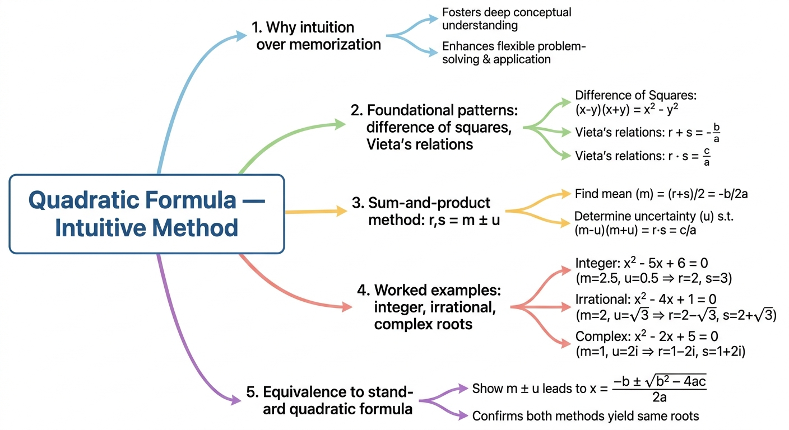
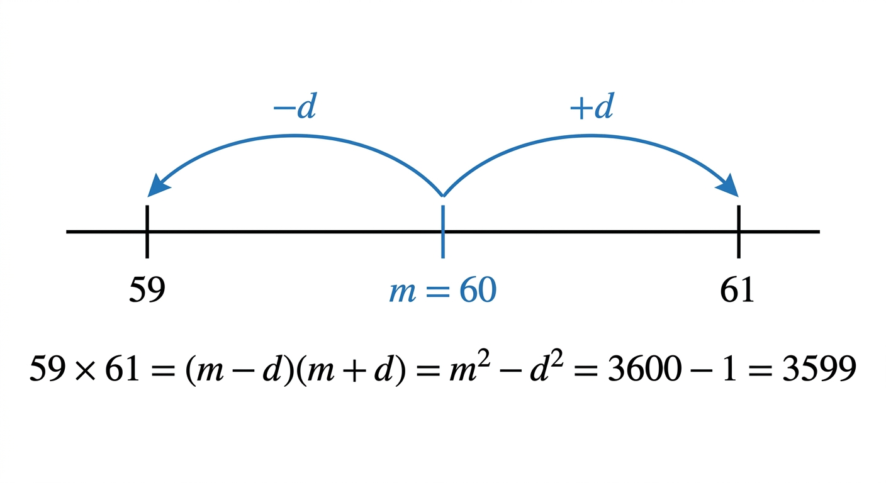
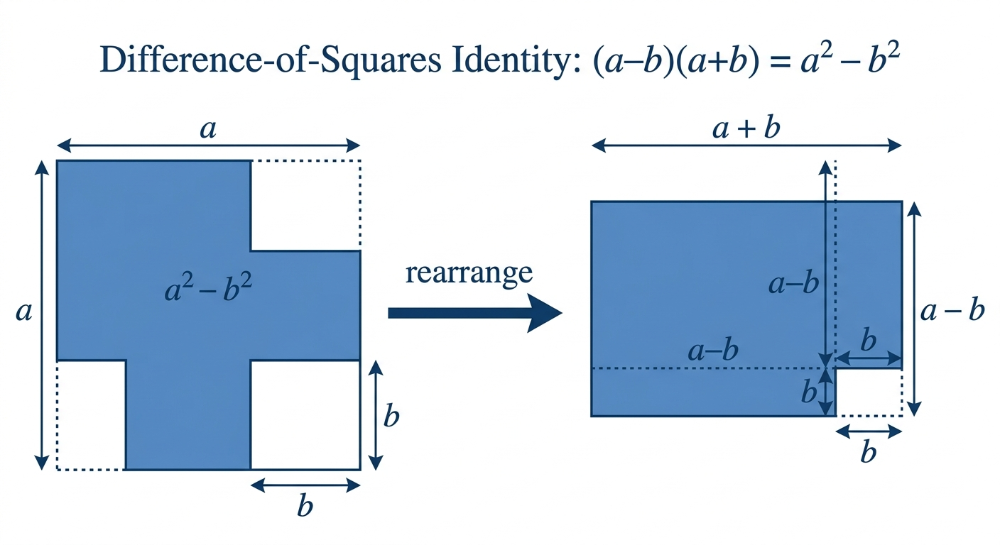
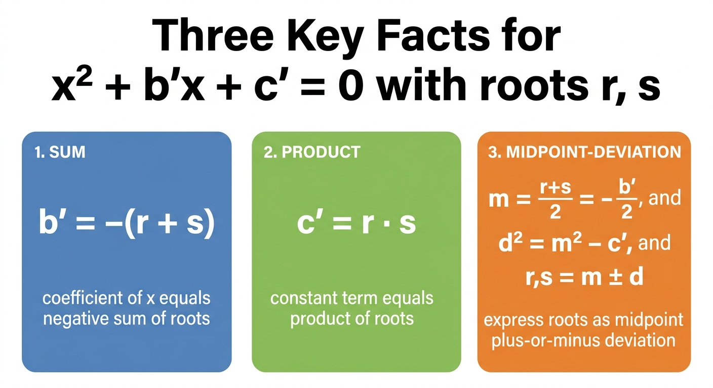
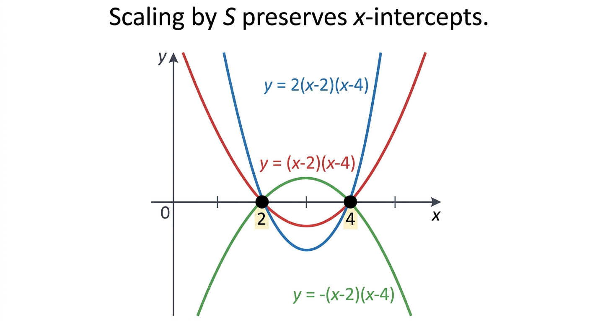
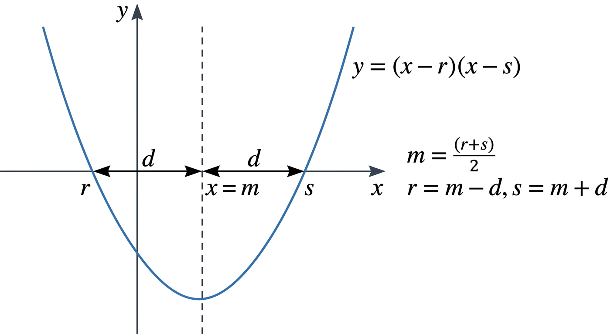

# Quadratic Formula — Intuitive Understanding

*Path C single-source note — extracted from one YouTube video by Po-Shen Loh × 3Blue1Brown via Gemini frame-by-frame analysis. Topics regrouped textbook-style; every timestamp is a clickable deep-link.*

| Field | Value |
|---|---|
| **Source** | [Simpler quadratic formula](https://www.youtube.com/watch?v=MHXO86wKeDY) |
| **Speaker** | Po-Shen Loh (collaboration with 3Blue1Brown) |
| **Length** | 46:11 |
| **Topic** | Quadratic formula — intuitive understanding (not memorization) |
| **Captured** | 2026-04-30 |

> [!info] One method, expressed cleanly
> Po-Shen Loh's "simpler quadratic formula" is **not a different formula** from the standard one — it's the same formula expressed in a way that has *meaning*. Every piece of $x = m \pm \sqrt{m^2 - p}$ is a thing you can point to: $m$ is literally the midpoint between the roots; $p$ is literally their product. By contrast, the textbook formula $x = \frac{-b \pm \sqrt{b^2 - 4ac}}{2a}$ obscures all that meaning behind division-by-$a$ algebra.

---

## 1. Why intuition, not memorization

> "Traditionally, the quadratic formula is one of the most famously memorized things in high school. We almost all kind of have this song that sings in our head related to it." *(at [[00:09]](https://www.youtube.com/watch?v=MHXO86wKeDY&t=9s))*

Loh's pitch in the opening minutes: rather than teach the quadratic formula as a song, **connect it to other patterns in math** that aid general problem-solving.

> "The main thing I want to focus on is connecting it to other common patterns in math that are useful for general problem solving." *(at [[00:34]](https://www.youtube.com/watch?v=MHXO86wKeDY&t=34s))*

> "The upshot I want you guys to come away with is the fact that you should connect this to other common patterns in math so as to make yourself a better problem solver." *(at [[01:21]](https://www.youtube.com/watch?v=MHXO86wKeDY&t=81s))*

### 1.1 Mental math foreshadows the method

Before deriving anything, Loh spends ~8 minutes on **mental-math tricks for factoring numbers near a perfect square**. This isn't a digression — it's the *exact* arithmetic that powers the quadratic formula derivation.

> [!example] Compute $59 \times 61$ in your head *(at [[09:07]](https://www.youtube.com/watch?v=MHXO86wKeDY&t=547s))*
> **Problem.** Compute $59 \cdot 61$ mentally — no pencil, no calculator.
> **Setup.** Both numbers cluster around 60. Write them as midpoint $\pm$ deviation: $59 = 60 - 1$, $61 = 60 + 1$.
> **Solution.**
> 1. Apply the **difference-of-squares** identity: $(60 - 1)(60 + 1) = 60^2 - 1^2$ *(at [[09:15]](https://www.youtube.com/watch?v=MHXO86wKeDY&t=555s))*
> 2. $60^2 = 3600$, $1^2 = 1$
> 3. $3600 - 1 = 3599$
>
> **Answer.** $59 \cdot 61 = 3599$.
> **Insight.** The trick is to **express two numbers as average ± deviation** so their product collapses via $m^2 - d^2$. This is the *exact* parameterization Loh will use to solve quadratics — same arithmetic, different framing.

*Visual aid generated by Nano Banana Pro — the midpoint-deviation parameterization on a number line, showing $59 \cdot 61 = m^2 - d^2$.*

> [!tip] The point of the mental math digression
> > "If you are thinking about arithmetic, something very basic, and you think about it deeply enough, some of the patterns that you observe become relevant to stuff that you're doing later on." *(at [[05:50]](https://www.youtube.com/watch?v=MHXO86wKeDY&t=350s))*
>
> The quadratic formula will turn out to be a direct application of this pattern. So learning the pattern in arithmetic is learning the formula.

---

## 2. The two foundational patterns

Two algebraic facts power the entire derivation. Master these and the quadratic formula derives itself.

### 2.1 Difference of squares *(introduced at [[10:00]](https://www.youtube.com/watch?v=MHXO86wKeDY&t=600s))*

> [!definition] Difference of squares
> $$(x - y)(x + y) = x^2 - y^2$$
> Equivalently, $(m - d)(m + d) = m^2 - d^2$ when you call the average $m$ and the deviation $d$.

**Geometric proof (Loh's approach at [[10:00–10:41]](https://www.youtube.com/watch?v=MHXO86wKeDY&t=600s))**: a square of side $x$ with a square of side $y$ removed from one corner has area $x^2 - y^2$. Slicing and rearranging the remaining L-shape produces a rectangle of dimensions $(x + y) \times (x - y)$. Same area, two factorizations.

*Visual aid generated by Nano Banana Pro — the L-shape rearrangement into a rectangle.*

**Algebraic derivation (full chain)**:
1. $(m - d)(m + d)$ *(at [[11:51]](https://www.youtube.com/watch?v=MHXO86wKeDY&t=711s))*
2. $= m^2 + md - dm - d^2$ *(distribute)*
3. $= m^2 - d^2$ *(middle terms cancel — this is the magic)* *(at [[12:15]](https://www.youtube.com/watch?v=MHXO86wKeDY&t=735s))*

> "Thinking about products is always the same as thinking about a difference of squares, which is weird, because products can be very chaotic." *(at [[12:41]](https://www.youtube.com/watch?v=MHXO86wKeDY&t=761s))*

### 2.2 Vieta's relations — the "Three Key Facts" *(introduced at [[16:03]](https://www.youtube.com/watch?v=MHXO86wKeDY&t=963s))*

> [!definition] Three Key Facts about a monic quadratic
> For $x^2 + b'x + c' = 0$ with roots $r$ and $s$:
> 1. **Factored form:** $x^2 + b'x + c' = (x - r)(x - s)$
> 2. **Sum:** $b' = -(r + s)$ — the coefficient of $x$, with sign flipped, is the sum of roots *(at [[17:21]](https://www.youtube.com/watch?v=MHXO86wKeDY&t=1041s))*
> 3. **Product:** $c' = r s$ — the constant term is the product of roots *(at [[17:32]](https://www.youtube.com/watch?v=MHXO86wKeDY&t=1052s))*

**Why (full algebraic derivation at [[16:42–16:46]](https://www.youtube.com/watch?v=MHXO86wKeDY&t=1002s))**:
1. Start with the factored form: $(x - r)(x - s)$
2. Distribute: $x \cdot x = x^2$, $x \cdot (-s) = -sx$, $(-r) \cdot x = -rx$, $(-r) \cdot (-s) = +rs$
3. Combine like terms: $x^2 - sx - rx + rs = x^2 - (r + s)x + rs$
4. Match coefficients with $x^2 + b'x + c' = 0$:
   - $b' = -(r + s)$
   - $c' = rs$

*Visual aid generated by Nano Banana Pro — the Three Key Facts as a reference card.*

> [!tip] Why this generalizes
> > "This is not just for the quadratic formula, but a very good relationship to have with polynomials, is to know how the roots correspond to the coefficients." *(at [[16:28]](https://www.youtube.com/watch?v=MHXO86wKeDY&t=988s))*
>
> Vieta's relations exist for *every* polynomial degree. Cubics, quartics — all have analogous identities relating roots to coefficients. Investing in this for quadratics gives you a foothold for the rest of polynomial theory.

### 2.3 Why we can normalize to monic *(at [[14:43]](https://www.youtube.com/watch?v=MHXO86wKeDY&t=883s))*

A general quadratic $ax^2 + bx + c = 0$ can always be reduced to monic form ($x^2 + b'x + c' = 0$) by dividing by $a$:

$$\frac{ax^2 + bx + c}{a} = \frac{0}{a} \;\Longrightarrow\; x^2 + \frac{b}{a}x + \frac{c}{a} = 0$$

The roots don't change because **scaling a quadratic by a non-zero constant doesn't change its x-intercepts** — geometrically, you can stretch or flip the parabola, but the points where it crosses the x-axis stay put.

> "S times 0 is always going to be 0. So it doesn't matter how much we scale it." *(at [[15:37]](https://www.youtube.com/watch?v=MHXO86wKeDY&t=937s))*

*Visual aid generated by Nano Banana Pro — three differently-scaled parabolas all sharing the same x-intercepts at $x=2$ and $x=4$.*

So WLOG we can assume monic form $x^2 + b'x + c' = 0$ for the rest of the derivation, then divide-by-$a$ at the end if we started with a non-monic.

---

## 3. The sum-and-product method (the heart of the video)

This is the single idea the whole video builds toward. Goal: solve $x^2 + b'x + c' = 0$ for $r, s$ **without trial-and-error guessing**.

> "Classes will have a unit in factoring quadratics where they basically tell you to just guess and check. Find two numbers that add up to be seven and that multiply to be 12." *(at [[17:40]](https://www.youtube.com/watch?v=MHXO86wKeDY&t=1060s))*

### 3.1 The trick — parameterize roots as midpoint ± deviation

> [!tip] The whole game in one line
> Let the midpoint of the two roots be $m$ and the deviation be $d$. Write:
> $$r = m - d \qquad s = m + d$$
> Their **sum is automatically $2m$** for any value of $d$. So if we pick $m = -b'/2$, the sum constraint $r + s = -b'$ is satisfied **by design** — leaving us only the product constraint to solve for $d$.

This is the same parameterization used to compute $59 \times 61$ mentally — **the mental math trick from §1.1 *is* the quadratic formula**.

### 3.2 The 6-step derivation *(at [[18:18–22:36]](https://www.youtube.com/watch?v=MHXO86wKeDY&t=1098s))*

> [!example] Deriving the simpler quadratic formula
> **Setup.** Monic quadratic $x^2 + b'x + c' = 0$ with unknown roots $r, s$. By Vieta (§2.2), $r + s = -b'$ and $rs = c'$.
>
> **Solution.**
> 1. **Set the midpoint** *(at [[20:09]](https://www.youtube.com/watch?v=MHXO86wKeDY&t=1209s))*: $m = \dfrac{r+s}{2}$. By Vieta, $m = \dfrac{-b'}{2}$.
> 2. **Parameterize the roots** as $r = m - d$ and $s = m + d$. The sum is $r + s = 2m = -b'$ ✓ — automatically satisfied for any $d$.
> 3. **Apply the product constraint** *(at [[19:12]](https://www.youtube.com/watch?v=MHXO86wKeDY&t=1152s))*:
>    $$c' = rs = (m - d)(m + d)$$
> 4. **Use difference of squares** *(at [[19:25]](https://www.youtube.com/watch?v=MHXO86wKeDY&t=1165s))*:
>    $$c' = m^2 - d^2$$
> 5. **Solve for $d^2$** *(at [[20:51]](https://www.youtube.com/watch?v=MHXO86wKeDY&t=1251s))*:
>    $$d^2 = m^2 - c'$$
> 6. **Take the square root and read off the roots** *(at [[21:23]](https://www.youtube.com/watch?v=MHXO86wKeDY&t=1283s))*:
>    $$r, s = m \pm d = m \pm \sqrt{m^2 - c'}$$
>
> **Answer.** $\boxed{\;x = m \pm \sqrt{m^2 - p}\;}$ where $m = -b'/2$ and $p = c'$ *(at [[22:28]](https://www.youtube.com/watch?v=MHXO86wKeDY&t=1348s))*.
>
> **Insight.** > "This to me is way simpler than the traditional quadratic formula. $m$ plus or minus square root of $m$ squared minus $p$. That's it. No song, no song to be had." *(at [[23:01]](https://www.youtube.com/watch?v=MHXO86wKeDY&t=1381s))*

### 3.3 Geometric picture *(at [[18:18]](https://www.youtube.com/watch?v=MHXO86wKeDY&t=1098s))*

The two roots $r$ and $s$ on the x-axis are equidistant from the midpoint $m$. The distance $d$ is what we solve for. **Knowing $m$ tells you where to look; computing $d$ tells you how far apart the roots are.**

*Visual aid generated by Nano Banana Pro — parabola $y = (x-r)(x-s)$ with roots equidistant from midpoint $m$, distance $d$ to either side.*

---

## 4. Worked examples

### 4.1 Easy integer roots — sum 7, product 12 *(at [[18:01]](https://www.youtube.com/watch?v=MHXO86wKeDY&t=1081s))*

> [!example] Solve $x^2 - 7x + 12 = 0$
> **Setup.** From Vieta: $r + s = 7$, $rs = 12$.
> **Old way:** trial-and-error among integer factor pairs of 12 ($1\!\times\!12$, $2\!\times\!6$, $3\!\times\!4$) until one sums to 7. Tedious for non-integer answers.
> **New way (the method):**
> 1. Midpoint: $m = 7/2 = 3.5$. So write $r = 3.5 - d$, $s = 3.5 + d$.
> 2. Product: $(3.5 - d)(3.5 + d) = 12.25 - d^2 = 12$
> 3. Solve: $d^2 = 0.25 \Rightarrow d = 0.5$.
> 4. Read off roots: $r, s = 3.5 \mp 0.5 = \{3, 4\}$.
>
> **Answer.** $x = 3$ or $x = 4$.
> **Insight.** Even when integers happen to work (so trial-and-error would succeed), the method gives a **deterministic procedure** instead of a search. No guessing.

### 4.2 Irrational roots — when no integers work *(at [[20:00–21:32]](https://www.youtube.com/watch?v=MHXO86wKeDY&t=1200s))*

> [!example] Solve $x^2 + 6x + 7 = 0$
> **Setup.** $r + s = -6$, $rs = 7$. No two integers have these properties.
> **Solution.**
> 1. Midpoint: $m = -6/2 = -3$ *(at [[20:25]](https://www.youtube.com/watch?v=MHXO86wKeDY&t=1225s))*.
> 2. Write $r = -3 - d$, $s = -3 + d$.
> 3. Product: $(-3 - d)(-3 + d) = 9 - d^2 = 7$
> 4. Solve: $d^2 = 9 - 7 = 2 \Rightarrow d = \sqrt{2}$ *(at [[21:21]](https://www.youtube.com/watch?v=MHXO86wKeDY&t=1281s))*.
> 5. Read off: $r, s = -3 \pm \sqrt{2}$ *(at [[21:32]](https://www.youtube.com/watch?v=MHXO86wKeDY&t=1292s))*.
>
> **Answer.** $x = -3 \pm \sqrt{2}$.
> **Insight.** The same procedure handles irrational answers without modification. Trial-and-error would fail here; the method just works.

### 4.3 Complex roots — when $d^2$ is negative *(at [[21:44–24:45]](https://www.youtube.com/watch?v=MHXO86wKeDY&t=1304s))*

When $m^2 - c' < 0$, the deviation $d$ is **imaginary** — and the roots are a complex conjugate pair. The procedure doesn't break; you just need $i = \sqrt{-1}$.

> "If you can take square roots of negative numbers — that's why complex numbers were useful." (paraphrased from §1.4 of Path C run on the companion video)

The general formula form is: **$x = m \pm \sqrt{m^2 - p}$** — works for real or complex roots depending on the sign of the discriminant $m^2 - p$. No special-casing needed.

---

## 5. Equivalence to the standard quadratic formula

The "simpler" formula $x = m \pm \sqrt{m^2 - p}$ **is** the standard formula — just expressed in a form that exposes meaning.

### 5.1 Bridging the two forms

Starting from a general $ax^2 + bx + c = 0$:

1. Divide by $a$ to make monic: $x^2 + \frac{b}{a}x + \frac{c}{a} = 0$, so $b' = b/a$ and $c' = c/a$.
2. Apply the simpler formula: $x = -\frac{b'}{2} \pm \sqrt{\left(\frac{b'}{2}\right)^2 - c'}$
3. Substitute $b' = b/a, c' = c/a$:
   $$x = -\frac{b}{2a} \pm \sqrt{\frac{b^2}{4a^2} - \frac{c}{a}}$$
4. Combine the fraction under the radical:
   $$x = -\frac{b}{2a} \pm \sqrt{\frac{b^2 - 4ac}{4a^2}}$$
5. Pull out the $\sqrt{4a^2} = 2a$:
   $$x = -\frac{b}{2a} \pm \frac{\sqrt{b^2 - 4ac}}{2a}$$
6. Combine over the common denominator:
   $$\boxed{\;x = \frac{-b \pm \sqrt{b^2 - 4ac}}{2a}\;}$$

The textbook formula is a **corollary**, not something to memorize separately.

> [!tip] Which to remember
> If you're going to memorize anything, memorize $x = m \pm \sqrt{m^2 - p}$ — it's shorter, has meaning ($m$ = midpoint, $p$ = product), and the standard form falls out by division-by-$a$. The textbook form $\frac{-b \pm \sqrt{b^2 - 4ac}}{2a}$ obscures the geometry.

---

## Key takeaways

- **Memorization fails because it strips meaning.** The textbook formula is a string of letters; the simpler formula $m \pm \sqrt{m^2 - p}$ has parts that *mean* things.
- **The "trick" is parameterization.** Writing two unknowns with sum $-b'$ as $-b'/2 \pm d$ collapses one of two Vieta constraints into a parameter choice, leaving a single square root to evaluate.
- **The mental math trick *is* the quadratic formula.** $59 \cdot 61 = 60^2 - 1$ and $r \cdot s = m^2 - d^2$ are the same computation.
- **Vieta's relations generalize.** The "Three Key Facts" idea (sum-and-product determine roots) extends to all polynomial degrees — quadratics are the warm-up.
- **Standard formula is a corollary.** $\frac{-b \pm \sqrt{b^2 - 4ac}}{2a}$ falls out of $m \pm \sqrt{m^2 - p}$ by division-by-$a$.

---

## Sources

| Source | URL |
|---|---|
| Video (Po-Shen Loh × 3Blue1Brown) | [Simpler quadratic formula](https://www.youtube.com/watch?v=MHXO86wKeDY) |

---

*Note: video section [24:45–46:11] (audience poll results / live Q&A) was not captured — it's a non-mathematical audience-interaction segment that doesn't contribute to the topic.*
