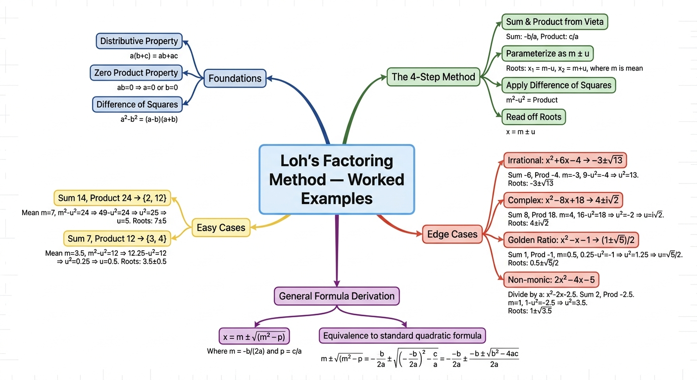
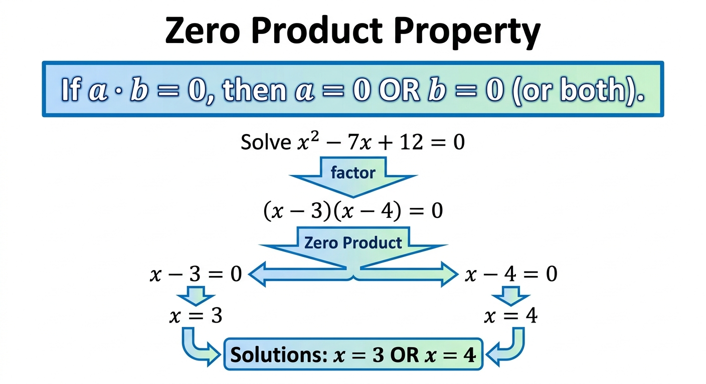
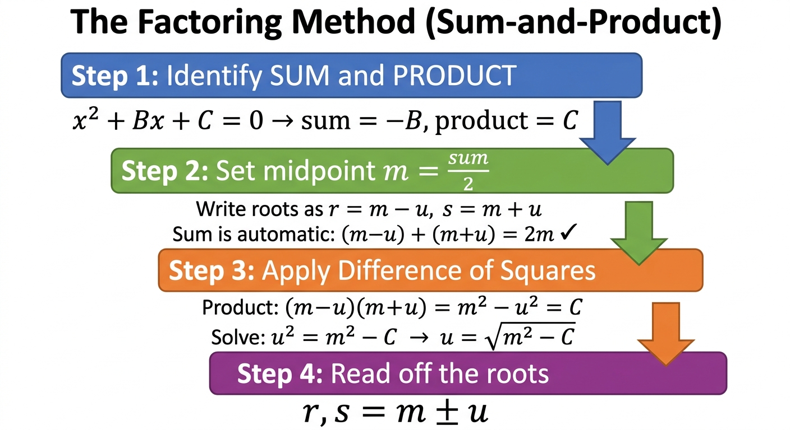
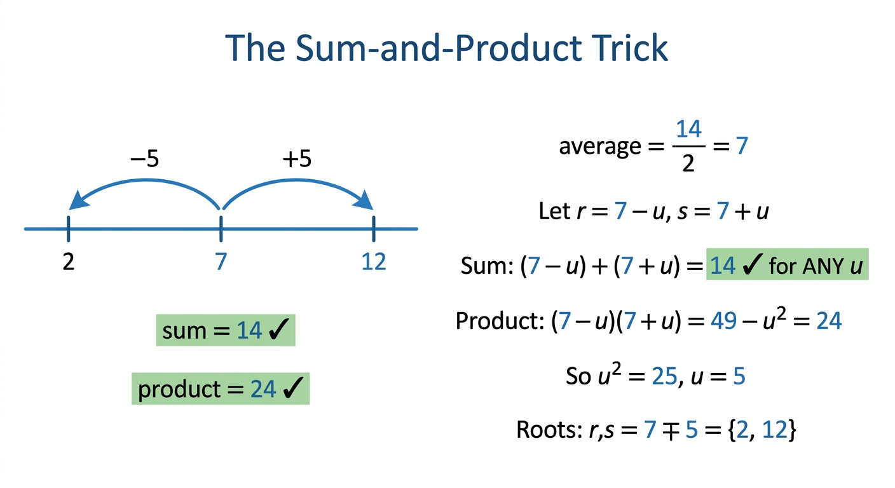
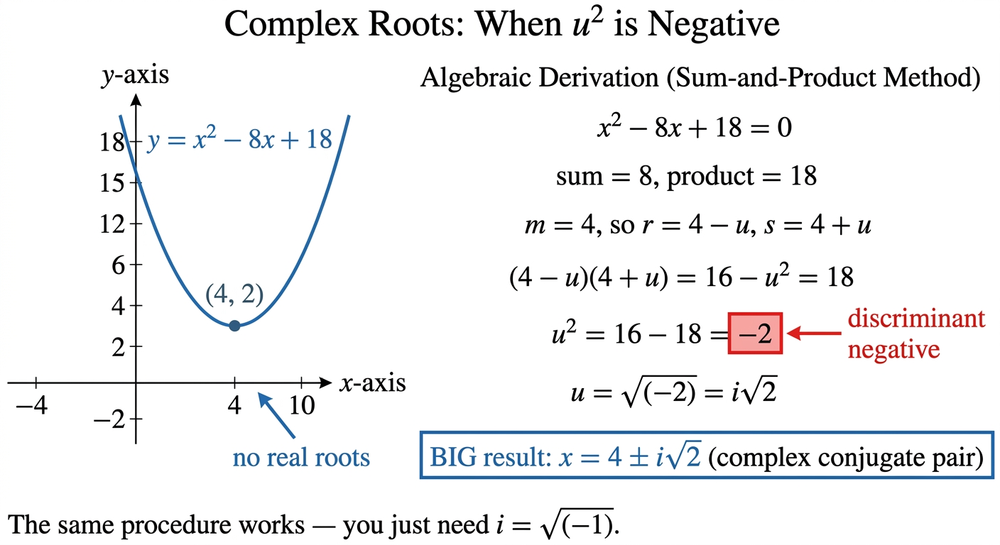
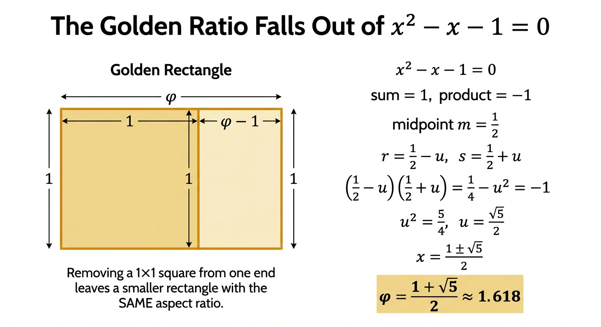

# Quadratic Formula — Worked Examples (Loh's Factoring Method)

*Companion document to [Quadratic Formula Intuition (Main)](<Quadratic Formula Intuition (Main).md>)*

*Path C single-source note — 7 worked exercises with collapsible solutions, extracted via Gemini frame-by-frame analysis.*

| Field | Value |
|---|---|
| **Source** | [Alternative Method of Solving Quadratics](https://www.youtube.com/watch?v=XKBX0r3J-9Y) |
| **Speaker** | Po-Shen Loh (Daily Challenge series, expii) |
| **Length** | 30:05 |
| **Topic** | Quadratic equations — exercise-focused walkthrough |
| **Captured** | 2026-04-30 |

> [!info] How this note differs from the main note
> The [main note](<Quadratic Formula Intuition (Main).md>) explains *why* Loh's "simpler quadratic formula" works, deriving $x = m \pm \sqrt{m^2 - p}$ from first principles. This companion focuses on **applying it** through 7 worked exercises spanning the full difficulty range — integer roots, irrational, complex, fractional midpoint (golden ratio), and non-monic. Use the main note for theory, this one for practice. **All exercise solutions are hidden by default — try each problem first, then click to reveal.**

---

## 1. Foundations (a quick recap before the exercises)

### 1.1 Distributive property *(introduced at [[00:54]](https://www.youtube.com/watch?v=XKBX0r3J-9Y&t=54s))*

Expanding factored forms is just careful bookkeeping:
$$(x - 3)(x - 4) = x \cdot x + x \cdot (-4) + (-3) \cdot x + (-3) \cdot (-4) = x^2 - 7x + 12$$

The key pattern *(at [[02:38]](https://www.youtube.com/watch?v=XKBX0r3J-9Y&t=158s))*: when the form is symmetric like $(3 - u)(3 + u)$, the middle terms cancel:
$$(3 - u)(3 + u) = 9 + 3u - 3u - u^2 = 9 - u^2$$

This **difference-of-squares cancellation** is the entire engine of Loh's method.

### 1.2 Zero Product Property *(introduced at [[04:15]](https://www.youtube.com/watch?v=XKBX0r3J-9Y&t=255s))*

> [!definition] Zero Product Property
> If $a \cdot b = 0$, then $a = 0$ or $b = 0$ (or both).

This is *how* factored forms become solutions. Once you have $(x - r)(x - s) = 0$, the only way the product is zero is if one of the factors is zero, giving $x = r$ or $x = s$ directly.

*Visual aid generated by Nano Banana Pro — the Zero Product Property applied to $x^2 - 7x + 12 = 0$.*

> "If I'm trying to solve a quadratic equation, if only I could find this magical factoring, then I can read off the answers." *(at [[06:17]](https://www.youtube.com/watch?v=XKBX0r3J-9Y&t=377s))*

The whole game becomes: how do we **find** the factorization without trial and error?

---

## 2. The 4-Step Sum-and-Product Method

Loh's central technique — the same procedure handles every case below.

*Visual aid generated by Nano Banana Pro — the four-step procedure as a flowchart.*

> [!tip] The whole game in one line
> For $x^2 + Bx + C = 0$, write the two roots as **midpoint ± deviation**:
> $$r = m - u, \qquad s = m + u, \qquad \text{where } m = -B/2$$
> The sum constraint $r + s = -B$ is satisfied **automatically** for any $u$. Only the product constraint $rs = C$ remains, and difference of squares makes it trivial.

The sum-and-product trick visualization *(introduced at [[10:09]](https://www.youtube.com/watch?v=XKBX0r3J-9Y&t=609s))*:

*Visual aid generated by Nano Banana Pro — for the equation $x^2 - 14x + 24 = 0$, the roots 2 and 12 sit equidistant from midpoint 7.*

The 4 steps:
1. **Identify sum and product** from $x^2 + Bx + C = 0$: sum $= -B$, product $= C$.
2. **Set midpoint** $m = -B/2$, parameterize $r = m - u, s = m + u$.
3. **Apply difference of squares** to the product constraint: $(m-u)(m+u) = m^2 - u^2 = C$. Solve $u^2 = m^2 - C$.
4. **Read off the roots**: $r, s = m \pm u$.

> "And this is a technique that lets you do this without any guessing." *(at [[13:56]](https://www.youtube.com/watch?v=XKBX0r3J-9Y&t=836s))*

---

## 3. Worked Exercises (7 problems, collapsible solutions)

> [!warning] Try before you reveal
> Every exercise's solution is **hidden by default** so you can attempt the problem first. Click `Click to reveal solution` to expand each one.

### 3.1 Warmup: solve by classical factoring

> [!example] Exercise 1 — Solve $x^2 - 7x + 12 = 0$ by classical factoring *(at [[04:15]](https://www.youtube.com/watch?v=XKBX0r3J-9Y&t=255s))*
> **Problem.** Find both roots of the equation $x^2 - 7x + 12 = 0$. Use classical factoring (find two integers that sum to 7 and multiply to 12), then apply the Zero Product Property.
>
> > [!success]- Click to reveal solution
> > **Solution.**
> > 1. Find two integers with sum 7 and product 12 by inspection: 3 and 4 (since $3 + 4 = 7$ and $3 \times 4 = 12$).
> > 2. Factored form: $x^2 - 7x + 12 = (x - 3)(x - 4)$.
> > 3. Set the product to zero: $(x - 3)(x - 4) = 0$.
> > 4. Apply Zero Product Property: $x - 3 = 0$ or $x - 4 = 0$.
> > 5. Solve each: $x = 3$ or $x = 4$.
> >
> > **Answer.** $x = 3$ or $x = 4$. ✓
> > **Insight.** This works because finding $\{3, 4\}$ by inspection is easy. The next exercise shows what happens when inspection fails.

### 3.2 The new method introduced

> [!example] Exercise 2 — Solve $x^2 - 14x + 24 = 0$ using the sum-and-product method *(at [[06:51]](https://www.youtube.com/watch?v=XKBX0r3J-9Y&t=411s))*
> **Problem.** Find both roots. Don't use trial-and-error on factor pairs of 24 — use Loh's sum-and-product method instead.
>
> > [!success]- Click to reveal solution
> > **Solution.**
> > 1. From Vieta: sum $= 14$, product $= 24$.
> > 2. Midpoint: $m = 14 / 2 = 7$. Write $r = 7 - u$, $s = 7 + u$.
> > 3. Sum check: $(7 - u) + (7 + u) = 14$ ✓ (automatic for any $u$).
> > 4. Product constraint: $(7 - u)(7 + u) = 49 - u^2 = 24$.
> > 5. Solve for $u^2$: $u^2 = 49 - 24 = 25$, so $u = 5$.
> > 6. Read off roots: $r = 7 - 5 = 2$, $s = 7 + 5 = 12$.
> >
> > **Answer.** $x = 2$ or $x = 12$. ✓
> > **Insight.** The integer answers 2 and 12 satisfy sum 14 and product 24, but trial-and-error among the four factor pairs $\{1\cdot24, 2\cdot12, 3\cdot8, 4\cdot6\}$ would have been slow. The midpoint-deviation parameterization gives a **deterministic procedure** instead of a search.

### 3.3 Irrational roots

> [!example] Exercise 3 — Solve $x^2 - 8x + 13 = 0$ *(at [[14:13]](https://www.youtube.com/watch?v=XKBX0r3J-9Y&t=853s))*
> **Problem.** Find both roots. No two integers have sum 8 and product 13, so classical factoring fails. Use the method.
>
> > [!success]- Click to reveal solution
> > **Solution.**
> > 1. Sum $= 8$, product $= 13$.
> > 2. Midpoint: $m = 4$. Write $r = 4 - u$, $s = 4 + u$.
> > 3. Product: $(4 - u)(4 + u) = 16 - u^2 = 13$.
> > 4. Solve: $u^2 = 16 - 13 = 3$, so $u = \sqrt{3}$.
> > 5. Roots: $r, s = 4 \pm \sqrt{3}$.
> >
> > **Answer.** $x = 4 \pm \sqrt{3}$. ✓
> > **Insight.** The same procedure that solved the integer case **just works** when the answer is irrational. No new technique needed — irrational answers don't break the method.

### 3.4 Complex roots

> [!example] Exercise 4 — Solve $x^2 - 8x + 18 = 0$ *(at [[20:00]](https://www.youtube.com/watch?v=XKBX0r3J-9Y&t=1200s))*
> **Problem.** Find both roots. The parabola doesn't cross the x-axis (the discriminant is negative). What does the method give?
>
> > [!success]- Click to reveal solution
> > **Solution.**
> > 1. Sum $= 8$, product $= 18$.
> > 2. Midpoint: $m = 4$. Write $r = 4 - u$, $s = 4 + u$.
> > 3. Product: $(4 - u)(4 + u) = 16 - u^2 = 18$.
> > 4. Solve: $u^2 = 16 - 18 = -2$ ← **negative!**
> > 5. Define $i = \sqrt{-1}$, so $u = \sqrt{-2} = i\sqrt{2}$.
> > 6. Roots: $r, s = 4 \pm i\sqrt{2}$ (a complex conjugate pair).
> >
> > **Answer.** $x = 4 \pm i\sqrt{2}$. ✓
> > **Insight.** > "When you see this, you actually realize that you don't need the quadratic formula even. This technique can be used to solve any equation." *(at [[21:10]](https://www.youtube.com/watch?v=XKBX0r3J-9Y&t=1270s))* — the procedure doesn't break when $u^2$ is negative; you just take a square root of a negative number, which is exactly when complex numbers earn their keep.

*Visual aid generated by Nano Banana Pro — parabola $y = x^2 - 8x + 18$ never crosses the x-axis, but the method still produces $x = 4 \pm i\sqrt{2}$.*

### 3.5 Negative product (different signs)

> [!example] Exercise 5 — Solve $x^2 + 6x - 4 = 0$ *(at [[23:30]](https://www.youtube.com/watch?v=XKBX0r3J-9Y&t=1410s))*
> **Problem.** Find both roots. The middle coefficient is positive and the constant is negative — sign tracking matters here.
>
> > [!success]- Click to reveal solution
> > **Solution.**
> > 1. Sum $= -6$ (note: the coefficient of $x$ is $+6$, so sum is $-6$), product $= -4$.
> > 2. Midpoint: $m = -3$. Write $r = -3 - u$, $s = -3 + u$.
> > 3. Product: $(-3 - u)(-3 + u) = 9 - u^2 = -4$.
> > 4. Solve: $u^2 = 9 - (-4) = 13$, so $u = \sqrt{13}$.
> > 5. Roots: $r, s = -3 \pm \sqrt{13}$.
> >
> > **Answer.** $x = -3 \pm \sqrt{13}$. ✓
> > **Insight.** Sign tracking is the only wrinkle. Once you correctly identify sum $= -6$ (negative) and product $= -4$ (negative), the procedure runs identically.

### 3.6 Fractional midpoint — the Golden Ratio!

> [!example] Exercise 6 — Solve $x^2 - x - 1 = 0$ *(at [[25:08]](https://www.youtube.com/watch?v=XKBX0r3J-9Y&t=1508s))*
> **Problem.** Find both roots. The sum is 1 (odd), so the midpoint will be a fraction. Watch for a famous mathematical constant.
>
> > [!success]- Click to reveal solution
> > **Solution.**
> > 1. Sum $= 1$, product $= -1$.
> > 2. Midpoint: $m = 1/2$. Write $r = \tfrac{1}{2} - u$, $s = \tfrac{1}{2} + u$.
> > 3. Product: $(\tfrac{1}{2} - u)(\tfrac{1}{2} + u) = \tfrac{1}{4} - u^2 = -1$.
> > 4. Solve: $u^2 = \tfrac{1}{4} + 1 = \tfrac{5}{4}$, so $u = \tfrac{\sqrt{5}}{2}$.
> > 5. Roots: $r, s = \tfrac{1}{2} \pm \tfrac{\sqrt{5}}{2} = \tfrac{1 \pm \sqrt{5}}{2}$.
> >
> > **Answer.** $x = \dfrac{1 \pm \sqrt{5}}{2}$. The positive root is the **Golden Ratio** $\varphi \approx 1.618$. ✓
> > **Insight.** > "One of these solutions is what's called the golden ratio, which is the ratio of the length to the width of the most beautiful rectangle in the world." *(at [[27:10]](https://www.youtube.com/watch?v=XKBX0r3J-9Y&t=1630s))* — fractions in the midpoint don't break anything; the algebra just produces fractional answers, and a famous constant falls out.

*Visual aid generated by Nano Banana Pro — the golden rectangle and the algebraic derivation that produces $\varphi = (1 + \sqrt{5})/2$.*

### 3.7 Non-monic — leading coefficient not 1

> [!example] Exercise 7 — Solve $2x^2 - 4x - 5 = 0$ *(at [[27:26]](https://www.youtube.com/watch?v=XKBX0r3J-9Y&t=1646s))*
> **Problem.** The leading coefficient is 2, not 1. How does the method adapt?
>
> > [!success]- Click to reveal solution
> > **Solution.**
> > 1. **Pre-step**: divide every term by 2 to make the equation monic: $x^2 - 2x - \tfrac{5}{2} = 0$.
> > 2. Sum $= 2$ (since coefficient of $x$ is $-2$), product $= -\tfrac{5}{2}$.
> > 3. Midpoint: $m = 1$. Write $r = 1 - u$, $s = 1 + u$.
> > 4. Product: $(1 - u)(1 + u) = 1 - u^2 = -\tfrac{5}{2}$.
> > 5. Solve: $u^2 = 1 + \tfrac{5}{2} = \tfrac{7}{2}$, so $u = \sqrt{\tfrac{7}{2}} = \tfrac{\sqrt{7}}{\sqrt{2}}$.
> > 6. Roots: $r, s = 1 \pm \tfrac{\sqrt{7}}{\sqrt{2}}$.
> >
> > **Answer.** $x = 1 \pm \dfrac{\sqrt{7}}{\sqrt{2}}$. ✓
> > **Insight.** Pre-dividing by the leading coefficient (the "normalize-to-monic" step) is the only extra wrinkle for general $ax^2 + bx + c$. Everything else is identical.

---

## 4. Deriving the Standard Quadratic Formula *(at [[27:26]](https://www.youtube.com/watch?v=XKBX0r3J-9Y&t=1646s))*

Loh's method *is* the quadratic formula — just expressed in a way that has meaning. Bridging the two forms:

> [!example] Derivation — from $m \pm \sqrt{m^2 - p}$ to $\dfrac{-b \pm \sqrt{b^2 - 4ac}}{2a}$
> **Setup.** Start with general $ax^2 + bx + c = 0$ (non-monic). Show the simpler form is equivalent to the textbook form.
> **Solution.**
> 1. Divide by $a$ to make monic: $x^2 + \tfrac{b}{a}x + \tfrac{c}{a} = 0$. So $B = b/a$ and $C = c/a$.
> 2. Apply Loh's formula: $x = -\tfrac{B}{2} \pm \sqrt{\left(\tfrac{B}{2}\right)^2 - C}$.
> 3. Substitute $B = b/a, C = c/a$:
>    $$x = -\tfrac{b}{2a} \pm \sqrt{\tfrac{b^2}{4a^2} - \tfrac{c}{a}}$$
> 4. Combine the fraction under the radical:
>    $$x = -\tfrac{b}{2a} \pm \sqrt{\tfrac{b^2 - 4ac}{4a^2}}$$
> 5. Pull out $\sqrt{4a^2} = 2a$:
>    $$x = -\tfrac{b}{2a} \pm \tfrac{\sqrt{b^2 - 4ac}}{2a}$$
> 6. Combine over the common denominator:
>    $$\boxed{\;x = \dfrac{-b \pm \sqrt{b^2 - 4ac}}{2a}\;}$$
>
> **Insight.** The textbook formula falls out as a **corollary** of Loh's simpler form — not as something to memorize separately. If you remember $m \pm \sqrt{m^2 - p}$, you can re-derive the textbook formula in 6 lines.

---

## Key takeaways

- **The procedure is identical across all 7 difficulty cases.** Integer roots, irrational, complex, fractional midpoint, non-monic — same 4 steps. The "search" of trial-and-error factoring is replaced by a **deterministic computation**.
- **Sign tracking is the only failure mode.** Mistakes happen at step 1 ("identify sum and product"), where you must remember sum is $-B$ (with the minus sign), not just $B$.
- **Negative $u^2$ doesn't break anything** — it just signals that the roots are complex. You take $\sqrt{-2} = i\sqrt{2}$ and the answer is a complex conjugate pair.
- **Non-monic equations need a pre-step** — divide everything by the leading coefficient $a$ to make the equation monic before applying the method.
- **The textbook formula derives from this in 6 lines.** You don't need to memorize $\frac{-b \pm \sqrt{b^2 - 4ac}}{2a}$ separately if you understand the simpler form.

---

## Related notes

- **[Quadratic Formula Intuition (Main)](<Quadratic Formula Intuition (Main).md>)** — the theory note covering *why* the method works (difference of squares, Vieta's relations, Three Key Facts). Pair this with the worked exercises here for a full understanding.

---

## Sources

| Source | URL |
|---|---|
| Video (Po-Shen Loh — Daily Challenge / expii) | [Alternative Method of Solving Quadratics](https://www.youtube.com/watch?v=XKBX0r3J-9Y) |
