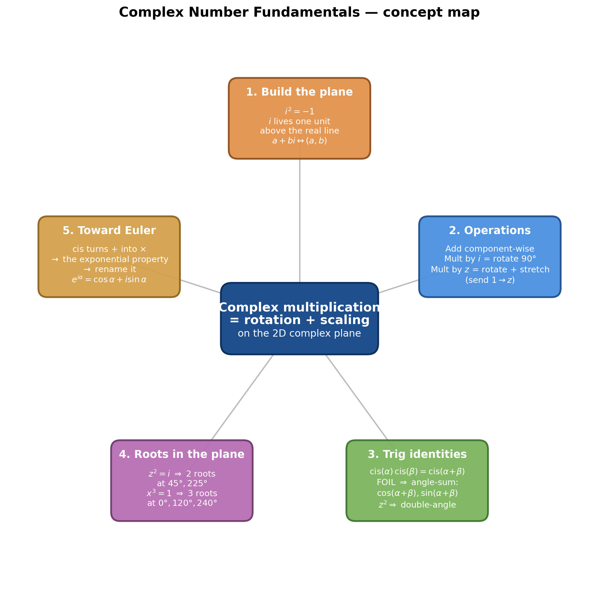
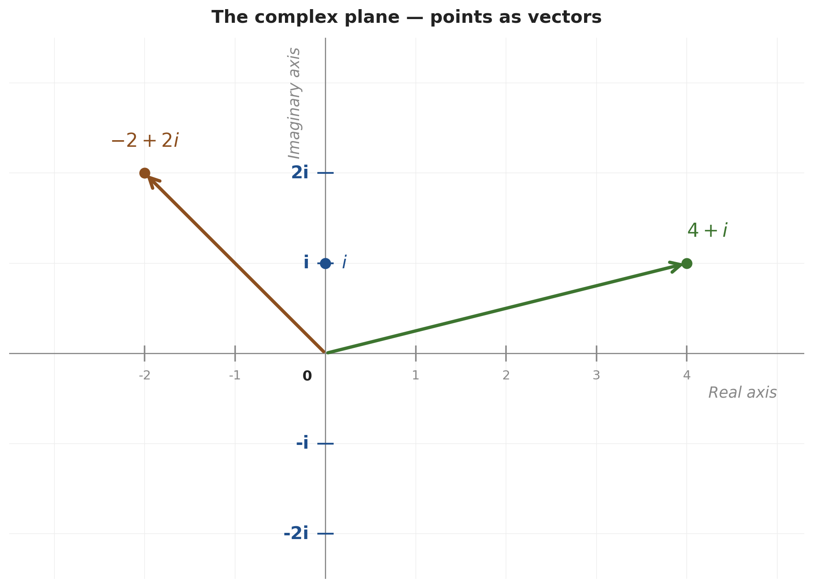
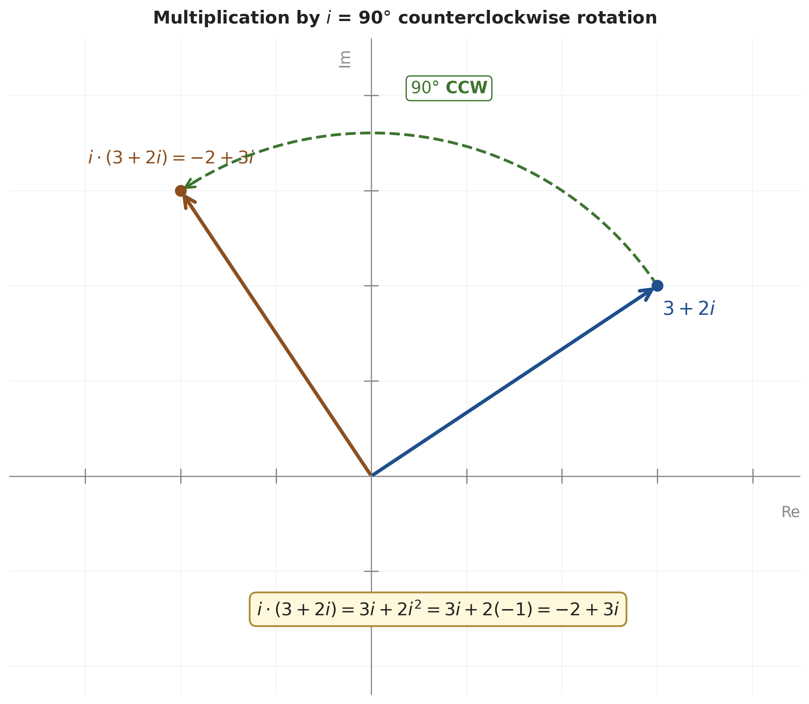
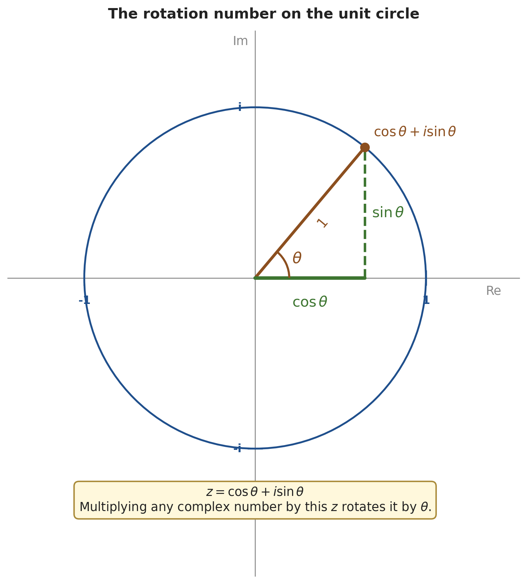
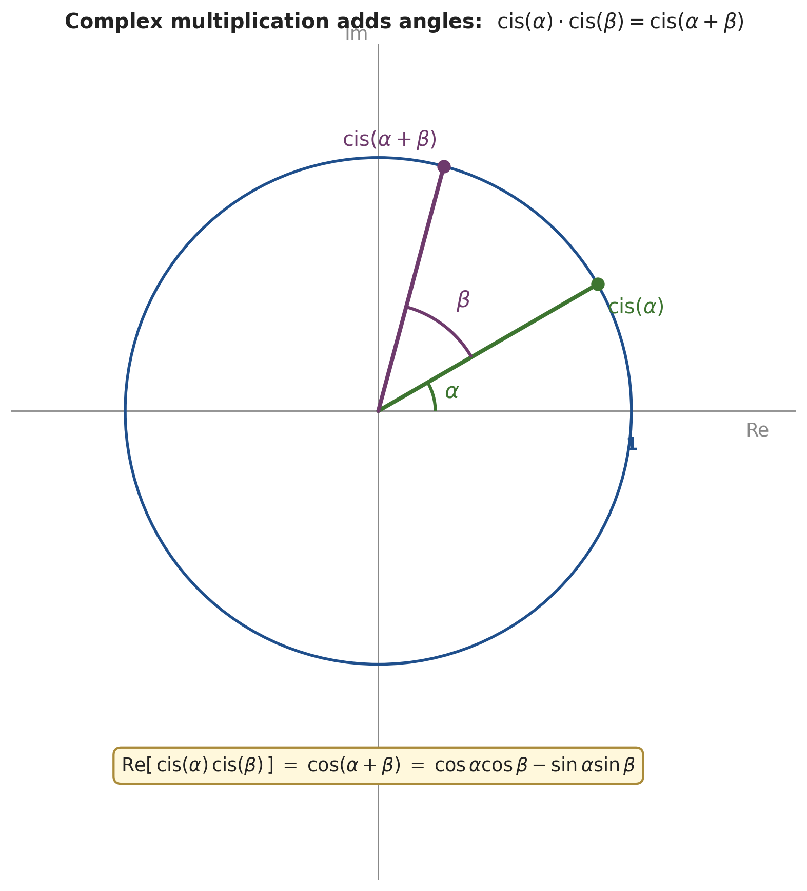
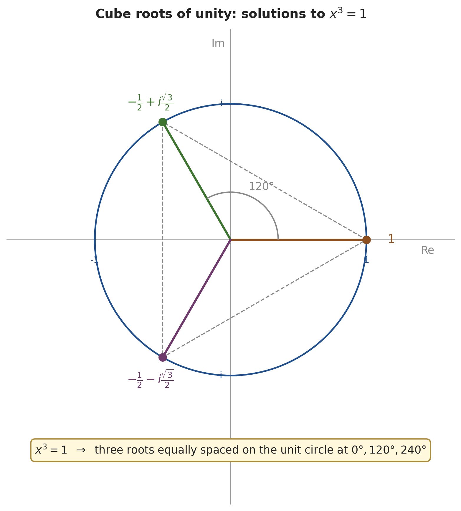

# Complex Number Fundamentals — From `i² = −1` to Trig Identities

*Path C single-source note — extracted from 3Blue1Brown's "Lockdown math" complex-numbers episode via Gemini frame-by-frame analysis (5:09–1:19:00, philosophy/polls trimmed). Topics regrouped textbook-style; every timestamp is a clickable deep-link.*

| Field | Value |
|---|---|
| **Source** | [Lockdown math — Complex Numbers](https://www.youtube.com/watch?v=5PcpBw5Hbwo) |
| **Speaker** | Grant Sanderson (3Blue1Brown) |
| **Length** | 1:19:42 (only ≈ 70 min of math content; intro / polls / Q&A skipped) |
| **Topic** | Complex numbers as 2D rotations, and how that gives elegant proofs of the angle-sum and double-angle trig identities |
| **Captured** | 2026-05-14 |

> [!info] The whole punchline in one line
> Complex multiplication **rotates and stretches** the plane. Once you see that, multiplying $(\cos\alpha + i\sin\alpha)$ by $(\cos\beta + i\sin\beta)$ has to land on $\cos(\alpha+\beta) + i\sin(\alpha+\beta)$ — because both products add the same angle. Equating real and imaginary parts of the algebra gives the two trig angle-sum identities for free. That's the entire video.

---

## 1. The Two "Weird Assumptions" — Building the Complex Plane

### 1.1 The goal — make the angle-sum identities fall out *(stated at [[5:09]](https://www.youtube.com/watch?v=5PcpBw5Hbwo&t=309s))*

The video sets a concrete target. By the end, both of these famously hard-to-memorize identities should follow from a single piece of complex-number machinery:

$$\cos(\alpha+\beta) = \cos\alpha\cos\beta - \sin\alpha\sin\beta$$
$$\sin(\alpha+\beta) = \sin\alpha\cos\beta + \cos\alpha\sin\beta$$

> "You can have a fact that has nothing to do with complex numbers — it's just trigonometry — and you can have facts that are pretty hard to remember. However, if you come at it with complex numbers, this is not only much less error-prone, it has a very beautiful meaning, and it just falls right out." *(at [[6:04]](https://www.youtube.com/watch?v=5PcpBw5Hbwo&t=364s))*

### 1.2 Weird Assumption 1: $i^2 = -1$ *(at [[6:45]](https://www.youtube.com/watch?v=5PcpBw5Hbwo&t=405s))*

> [!definition] The imaginary unit
> Postulate a number $i$ such that $i^2 = -1$.

Why this *looks* impossible inside the reals: every real number squared is non-negative — $5^2 = 25$ and $(-5)^2 = 25$, so the operation $x \mapsto x^2$ never returns a negative answer. Calling $i$ a "real number" with $i^2 = -1$ is incoherent. The escape is to enlarge what "number" means.

### 1.3 Weird Assumption 2: $i$ lives off the number line *(at [[8:07]](https://www.youtube.com/watch?v=5PcpBw5Hbwo&t=487s))*

> [!definition] The complex plane
> The number line is one-dimensional. Add a second axis perpendicular to it — the **imaginary axis** — and place $i$ one unit above the origin. The resulting 2D plane is the **complex plane**. A general complex number $a + bi$ sits at the point $(a, b)$.

> "Essentially, it's proposing that numbers be two-dimensional." *(at [[8:36]](https://www.youtube.com/watch?v=5PcpBw5Hbwo&t=516s))*

*Generated by matplotlib via `_gen_cnf_fig1_complex_plane.py` — the complex plane with $i$, $-i$, $-2i$ marked on the imaginary axis, and two example complex numbers $4+i$ and $-2+2i$ drawn as vectors from the origin.*

### 1.4 Complex numbers as vectors *(at [[9:30]](https://www.youtube.com/watch?v=5PcpBw5Hbwo&t=570s))*

A complex number $a + bi$ can be represented as a **vector** from the origin to $(a, b)$. Two examples (used as running examples throughout the video):

- $4 + i$ → arrow to $(4, 1)$
- $-2 + 2i$ → arrow to $(-2, 2)$

The vector picture is what makes the geometric interpretation of multiplication later possible.

---

## 2. Operations on Complex Numbers

### 2.1 Addition is component-wise *(at [[12:22]](https://www.youtube.com/watch?v=5PcpBw5Hbwo&t=742s))*

> [!definition] Addition
> $$(a + bi) + (c + di) = (a + c) + (b + d)i$$
> Real parts add to real parts; imaginary parts add to imaginary parts. Geometrically this is **vector addition** (tip-to-tail).

> [!example] Add $4 + i$ and $-2 + 2i$ *(at [[12:35]](https://www.youtube.com/watch?v=5PcpBw5Hbwo&t=755s))*
> **Problem.** Compute $(4 + i) + (-2 + 2i)$.
> **Solution.** Real: $4 + (-2) = 2$. Imaginary: $(1 + 2)i = 3i$.
> **Answer.** $2 + 3i$.

### 2.2 Multiplication by $i$ = 90° counterclockwise rotation *(at [[16:22]](https://www.youtube.com/watch?v=5PcpBw5Hbwo&t=982s))*

This is the **central observation** of the video. We can verify it two ways:

**(a) Algebraic verification** *(at [[20:00]](https://www.youtube.com/watch?v=5PcpBw5Hbwo&t=1200s))*: take an arbitrary $a + bi$, multiply by $i$, and use $i^2 = -1$:

> [!example] Compute $i \cdot (3 + 2i)$
> **Problem.** What is $i \cdot (3 + 2i)$?
> **Setup.** Pretend $i$ behaves like an ordinary number (distributive property, etc.), and apply $i^2 = -1$.
> **Solution.**
> 1. $i \cdot (3 + 2i) = 3i + 2i^2$ *(distribute)*
> 2. $= 3i + 2(-1)$ *(substitute $i^2 = -1$)*
> 3. $= -2 + 3i$
>
> **Answer.** $-2 + 3i$.

**(b) Geometric verification** *(at [[14:45]](https://www.youtube.com/watch?v=5PcpBw5Hbwo&t=885s))*: rotating the point $(3, 2)$ by 90° counterclockwise around the origin sends it to $(-2, 3)$. The general rule for 90° CCW rotation is $(a, b) \mapsto (-b, a)$.

The two answers match: $(-2, 3) \leftrightarrow -2 + 3i$. So multiplication by $i$ **is** 90° rotation.

*Generated by matplotlib via `_gen_cnf_fig2_mult_by_i.py` — multiplying $3 + 2i$ by $i$ rotates the vector 90° counterclockwise to $-2 + 3i$.*

**Gut check — two rotations should equal a 180° flip** *(at [[15:21]](https://www.youtube.com/watch?v=5PcpBw5Hbwo&t=921s))*. Apply the rotation rule twice to a generic $(a, b)$:
$$(a, b) \xrightarrow{i} (-b, a) \xrightarrow{i} (-a, -b)$$
Yes — two 90° rotations = one 180° rotation. Equivalently, $i \cdot i = i^2 = -1$, which corresponds to a 180° rotation around the origin. Self-consistent. ✓

### 2.3 Multiplication by any $z$ = rotation + scaling *(at [[21:17]](https://www.youtube.com/watch?v=5PcpBw5Hbwo&t=1277s))*

The general rule (the **single most important fact in the video**):

> [!tip] Multiplication-as-transformation
> Multiplying every complex number in the plane by a fixed $z$ has the effect of **rotating the plane** by the angle of $z$ and **stretching** by the length of $z$ — in exactly the way that sends $1$ to $z$.

> "Multiplying by $z$ has the action of rotating and stretching things. And how it rotates and stretches things is in the way that's necessary to get the number one to sit on the number $z$." *(at [[30:35]](https://www.youtube.com/watch?v=5PcpBw5Hbwo&t=1835s))*

### 2.4 The three properties that pin down complex multiplication *(at [[22:42]](https://www.youtube.com/watch?v=5PcpBw5Hbwo&t=1362s))*

| # | Property | Geometric meaning |
|---|---|---|
| 1 | $z \cdot 1 = z$ | $1$ doesn't move under "multiply by $z$" — only relative to it. Actually $1$ lands on $z$. |
| 2 | $z \cdot i = \text{Rot}_{90}(z)$ | Multiplying $z$ by $i$ rotates $z$ by 90°. |
| 3 | $z \cdot (c + di) = c \cdot z + d \cdot (zi)$ | Distributivity — multiplying by $c + di$ is "$c$ copies of $z$" plus "$d$ copies of $zi$". |

These three together determine where any point goes under "multiply by $z$".

### 2.5 Worked: $(2 + i)(2 - i)$ *(at [[28:57]](https://www.youtube.com/watch?v=5PcpBw5Hbwo&t=1737s))*

> [!example] Compute $(2 + i)(2 - i)$
> **Problem.** Multiply $(2 + i)$ by $(2 - i)$ algebraically and verify geometrically.
> **Solution (algebraic, FOIL).**
> 1. $(2 + i)(2 - i) = 4 - 2i + 2i - i^2$
> 2. $= 4 - i^2$ *(middle terms cancel)*
> 3. $= 4 - (-1)$ *(apply $i^2 = -1$)*
> 4. $= 5$
>
> **Answer.** $5 + 0i = 5$.
> **Insight.** $-i^2 = -(-1) = +1$ — a sign-flip students frequently fumble. Two complex numbers symmetric across the real axis (called **conjugates**) multiply to a positive real.

**Geometric verification** *(at [[31:21]](https://www.youtube.com/watch?v=5PcpBw5Hbwo&t=1881s))*: in the GeoGebra "complex slide rule" demo, dragging $1$ onto $z = 2 + i$ rotates and stretches the plane so that $w = 2 - i$ lands on $5$ on the real axis. The two answers agree. ✓

---

## 3. Complex Multiplication → Trig Identities

### 3.1 The rotation number: $\cos\theta + i\sin\theta$ *(at [[34:26]](https://www.youtube.com/watch?v=5PcpBw5Hbwo&t=2066s))*

To rotate the plane by exactly $\theta$, we need the complex number that sends $1$ to the point on the unit circle at angle $\theta$. Reading off the unit-circle coordinates (cosine = $x$, sine = $y$):

> [!definition] The rotation number for angle $\theta$
> $$z = \cos\theta + i\sin\theta$$
> Multiplying by this $z$ rotates the plane CCW by angle $\theta$ (no stretching, since $|z| = 1$).

*Generated by matplotlib via `_gen_cnf_fig3_rotation_number.py` — the unit circle on the complex plane. The point at angle $\theta$ has coordinates $(\cos\theta, \sin\theta)$, i.e. the complex number $\cos\theta + i\sin\theta$.*

> [!tip] One-liner: 3D rotation aside *(at [[40:46]](https://www.youtube.com/watch?v=5PcpBw5Hbwo&t=2446s))*
> Complex numbers only handle 2D rotations. For 3D rotation in graphics code, the analog is **quaternions** — "the complex numbers on steroids" — which avoid gimbal lock that matrix-based 3D rotation can hit.

### 3.2 Worked: $\cos 75°$ via $45° + 30°$ *(at [[42:18]](https://www.youtube.com/watch?v=5PcpBw5Hbwo&t=2538s))*

> [!example] Compute $\cos 75°$ using complex multiplication
> **Problem.** Find $\cos 75°$ exactly, without a calculator.
> **Setup.** Recognize that $75° = 45° + 30°$ and that complex multiplication adds angles. So multiplying the rotation-numbers for 45° and 30° produces the rotation-number for 75° — its real part is $\cos 75°$.
> **Solution.**
> 1. Write the product of rotation-numbers:
>    $$(\cos 45° + i\sin 45°)(\cos 30° + i\sin 30°)$$
> 2. Substitute known values from a 45-45-90 triangle ($\cos 45° = \sin 45° = \frac{\sqrt{2}}{2}$) and a 30-60-90 triangle ($\cos 30° = \frac{\sqrt{3}}{2}$, $\sin 30° = \frac{1}{2}$):
>    $$\left(\tfrac{\sqrt{2}}{2} + i\tfrac{\sqrt{2}}{2}\right)\left(\tfrac{\sqrt{3}}{2} + i\tfrac{1}{2}\right)$$
> 3. Expand by FOIL. The **real part** comes from (real × real) and (imag × imag, but with the $i^2 = -1$ sign flip):
>    $$\text{Re} = \tfrac{\sqrt{2}}{2} \cdot \tfrac{\sqrt{3}}{2} - \tfrac{\sqrt{2}}{2} \cdot \tfrac{1}{2}$$
> 4. Simplify:
>    $$= \tfrac{\sqrt{6}}{4} - \tfrac{\sqrt{2}}{4} = \tfrac{\sqrt{6} - \sqrt{2}}{4}$$
>
> **Answer.** $\cos 75° = \dfrac{\sqrt{6} - \sqrt{2}}{4}$.
> **Insight.** No memorized identity, no calculator — just "rotate by 45° then by 30°, what does the real part of the product land on?" The negative sign on the $\sin\sin$ term comes from $i^2 = -1$, not from a hard-to-remember identity rule.

### 3.3 The angle-sum identities — the general payoff *(at [[52:31]](https://www.youtube.com/watch?v=5PcpBw5Hbwo&t=3151s))*

The same procedure with general angles $\alpha$ and $\beta$ produces the identities the video promised.

**Geometric side.** Multiplying $\text{cis}(\alpha)$ by $\text{cis}(\beta)$ rotates by $\alpha$ then by $\beta$ — total rotation $\alpha + \beta$:
$$(\cos\alpha + i\sin\alpha)(\cos\beta + i\sin\beta) = \cos(\alpha+\beta) + i\sin(\alpha+\beta)$$

**Algebraic side.** Expand by FOIL:
$$= \underbrace{\cos\alpha\cos\beta - \sin\alpha\sin\beta}_{\text{real part}} + i\underbrace{\bigl[\sin\alpha\cos\beta + \cos\alpha\sin\beta\bigr]}_{\text{imag part}}$$

Equating real and imaginary parts of the two sides gives both identities at once:

> [!definition] Angle-sum identities (the payoff)
> $$\boxed{\cos(\alpha + \beta) = \cos\alpha\cos\beta - \sin\alpha\sin\beta}$$
> $$\boxed{\sin(\alpha + \beta) = \sin\alpha\cos\beta + \cos\alpha\sin\beta}$$

*Generated by matplotlib via `_gen_cnf_fig4_angle_sum.py` — multiplying $\text{cis}(\alpha)$ by $\text{cis}(\beta)$ on the unit circle = rotating by $\alpha$ then by $\beta$ = landing at angle $\alpha + \beta$, with real part $\cos(\alpha+\beta)$.*

### 3.4 The cis shorthand *(at [[56:24]](https://www.youtube.com/watch?v=5PcpBw5Hbwo&t=3384s))*

> [!definition] cis notation
> $$\text{cis}(\alpha) := \cos\alpha + i\sin\alpha$$
> The multiplication rule becomes
> $$\text{cis}(\alpha) \cdot \text{cis}(\beta) = \text{cis}(\alpha + \beta)$$

This compact form — **multiplying turns into adding the inputs** — is the same property the exponential function $b^x$ has (since $b^a \cdot b^b = b^{a+b}$). That's the bridge to the next section.

### 3.5 Double-angle identities from $z^2$ *(at [[72:36]](https://www.youtube.com/watch?v=5PcpBw5Hbwo&t=4356s))*

Same idea applied to $z = \text{cis}(\theta)$, squared:

**Geometric side.** $z^2$ is a rotation by $2\theta$:
$$\text{cis}(\theta)^2 = \text{cis}(2\theta) = \cos(2\theta) + i\sin(2\theta)$$

**Algebraic side.** Expand $(\cos\theta + i\sin\theta)^2$ by FOIL:
$$= \underbrace{\cos^2\theta - \sin^2\theta}_{\text{real}} + i\underbrace{(2\cos\theta\sin\theta)}_{\text{imag}}$$

Equating parts:

> [!definition] Double-angle identities
> $$\boxed{\cos(2\theta) = \cos^2\theta - \sin^2\theta}$$
> $$\boxed{\sin(2\theta) = 2\cos\theta\sin\theta}$$
>
> Using the Pythagorean identity $\sin^2\theta = 1 - \cos^2\theta$ to eliminate sine:
> $$\cos(2\theta) = \cos^2\theta - (1 - \cos^2\theta) = 2\cos^2\theta - 1$$
>
> Equivalent rearrangement (matches the Desmos coincidence Grant flagged at [[72:24]](https://www.youtube.com/watch?v=5PcpBw5Hbwo&t=4344s)):
> $$\cos^2\theta = \frac{1 + \cos(2\theta)}{2}$$

### 3.6 Why "cis" gets renamed $e^{i\alpha}$ *(at [[76:30]](https://www.youtube.com/watch?v=5PcpBw5Hbwo&t=4590s))*

The cis function turns *addition* in the inputs into *multiplication* in the outputs: $\text{cis}(\alpha + \beta) = \text{cis}(\alpha)\text{cis}(\beta)$. The function family with that property is the **exponential**: $b^{a+b} = b^a \cdot b^b$.

So $\text{cis}(\alpha)$ is *some* exponential. Specifically, Euler's formula identifies it as:

> [!definition] Euler's formula
> $$\boxed{e^{i\alpha} = \cos\alpha + i\sin\alpha}$$

The "$cis$" notation is non-standard precisely because the exponential form is more powerful and connects complex numbers to calculus and analysis.

> "$\text{cis}(\alpha)$ is not really standard notation when we're talking about rotating alpha around the unit circle." *(at [[76:30]](https://www.youtube.com/watch?v=5PcpBw5Hbwo&t=4590s))*

---

## 4. Roots in the Complex Plane (Bonus Applications)

### 4.1 The square root of $i$ *(at [[60:27]](https://www.youtube.com/watch?v=5PcpBw5Hbwo&t=3627s))*

**Algebraic verification** *(at [[61:08]](https://www.youtube.com/watch?v=5PcpBw5Hbwo&t=3668s))*: square $\frac{\sqrt{2}}{2} + i\frac{\sqrt{2}}{2}$ via FOIL.

> [!example] Verify $\left(\tfrac{\sqrt{2}}{2} + i\tfrac{\sqrt{2}}{2}\right)^2 = i$
> **Problem.** Show this complex number is a square root of $i$.
> **Solution.**
> 1. $\left(\tfrac{\sqrt{2}}{2} + i\tfrac{\sqrt{2}}{2}\right)^2$ expanded by FOIL:
>    $$\tfrac{2}{4} + i\tfrac{2}{4} + i\tfrac{2}{4} + i^2\tfrac{2}{4}$$
> 2. Group real and imaginary: real $= \tfrac{2}{4} - \tfrac{2}{4} = 0$; imaginary $= i\tfrac{4}{4} = i$.
>
> **Answer.** $= 0 + i = i$. ✓

**Geometric reasoning** *(at [[63:08]](https://www.youtube.com/watch?v=5PcpBw5Hbwo&t=3788s))*: $z^2 = i$ means doubling $z$'s angle lands at $i$ (angle $90°$). So $z$ is at angle $45°$ on the unit circle — coordinates $(\cos 45°, \sin 45°) = (\tfrac{\sqrt{2}}{2}, \tfrac{\sqrt{2}}{2})$, agreeing with the algebra. The other root sits diametrically opposite at angle $225°$ — i.e., $-\tfrac{\sqrt{2}}{2} - i\tfrac{\sqrt{2}}{2}$. Both square to $i$.

### 4.2 Cube roots of unity: $x^3 = 1$ *(at [[70:03]](https://www.youtube.com/watch?v=5PcpBw5Hbwo&t=4203s))*

What complex number, when multiplied by itself three times, lands on $1$ (i.e. angle $0°$)? Tripling its angle must give a multiple of $360°$ — so its angle must be $0°$, $120°$, or $240°$.

*Generated by matplotlib via `_gen_cnf_fig5_roots_unity.py` — the three cube roots of unity on the unit circle at angles $0°$, $120°$, $240°$.*

Reading off unit-circle coordinates:

> [!definition] The three cube roots of unity
> $$x^3 = 1 \;\Longrightarrow\; x \in \left\{1,\;\; -\tfrac{1}{2} + i\tfrac{\sqrt{3}}{2},\;\; -\tfrac{1}{2} - i\tfrac{\sqrt{3}}{2}\right\}$$

> "That's how you can read this equation, which I think is very nice and elegant, rather than just trying to plug in numbers and see what comes out." *(at [[71:04]](https://www.youtube.com/watch?v=5PcpBw5Hbwo&t=4264s))*

---

## Key Takeaways

- **Complex numbers are just 2D points** with two postulates: $i^2 = -1$ and $i$ lives one unit above $0$ on a new perpendicular axis.
- **Addition is component-wise** (= vector addition). **Multiplication by $z$ is rotation + scaling** in the way that sends $1$ to $z$. Multiplying by $i$ specifically = 90° CCW rotation.
- **Complex multiplication adds angles** on the unit circle. That single fact gives the angle-sum identities ($\cos(\alpha+\beta) = \cos\alpha\cos\beta - \sin\alpha\sin\beta$ and partner) by equating real and imaginary parts of $\text{cis}(\alpha)\text{cis}(\beta) = \text{cis}(\alpha+\beta)$.
- **Squaring on the unit circle doubles the angle** — produces the double-angle identities and the half-angle / power-reduction identity $\cos^2\theta = (1 + \cos 2\theta)/2$.
- **Roots in the complex plane are equally-spaced**. $z^2 = i$ has 2 roots at angles $45°$ and $225°$; $x^3 = 1$ has 3 roots at $0°$, $120°$, $240°$.
- **$\text{cis}(\alpha)$ turns addition into multiplication**, the defining property of an exponential — so it gets renamed $e^{i\alpha}$ in Euler's formula.

---

### Sources

| Source | Section | Type |
|---|---|---|
| [Lockdown math — Complex Numbers (3Blue1Brown)](https://www.youtube.com/watch?v=5PcpBw5Hbwo) | 5:09 → 79:37 (philosophy / polls / Q&A skipped) | YouTube |
