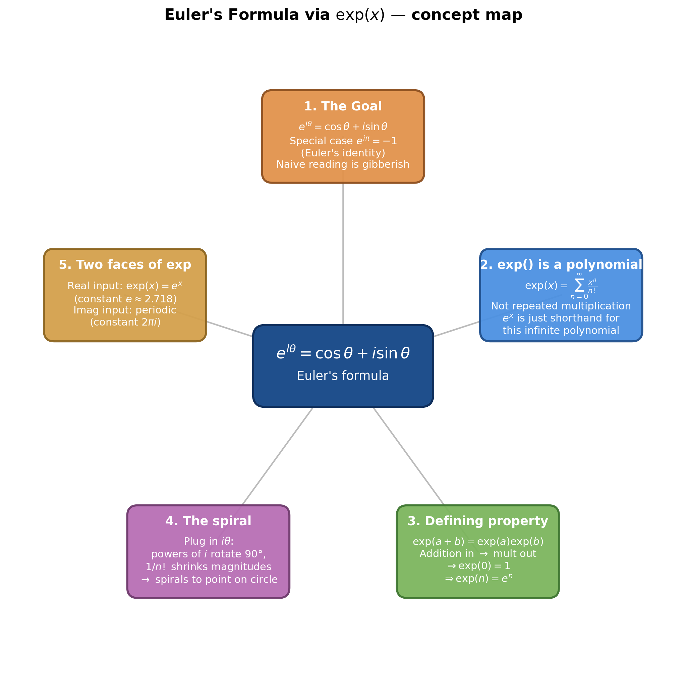
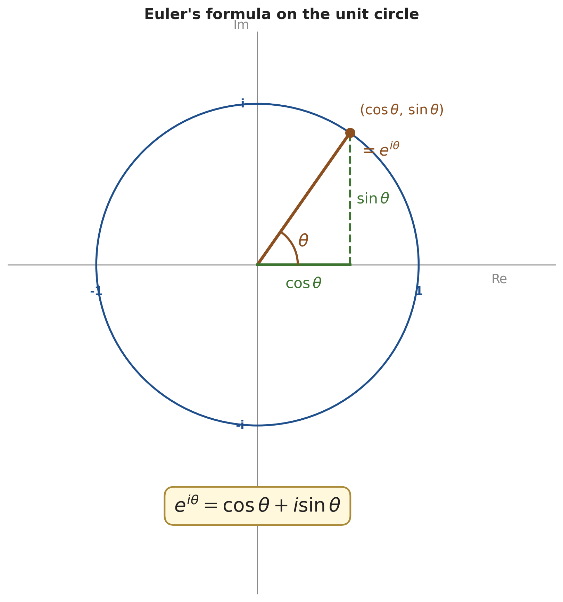
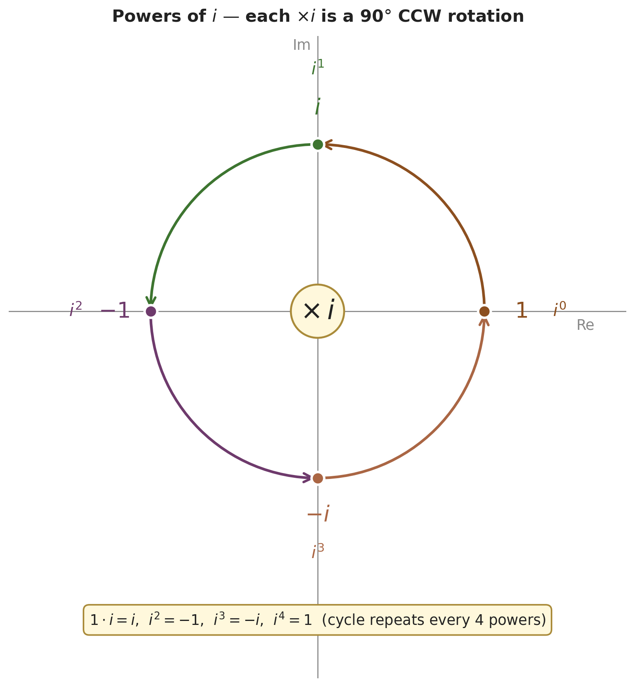
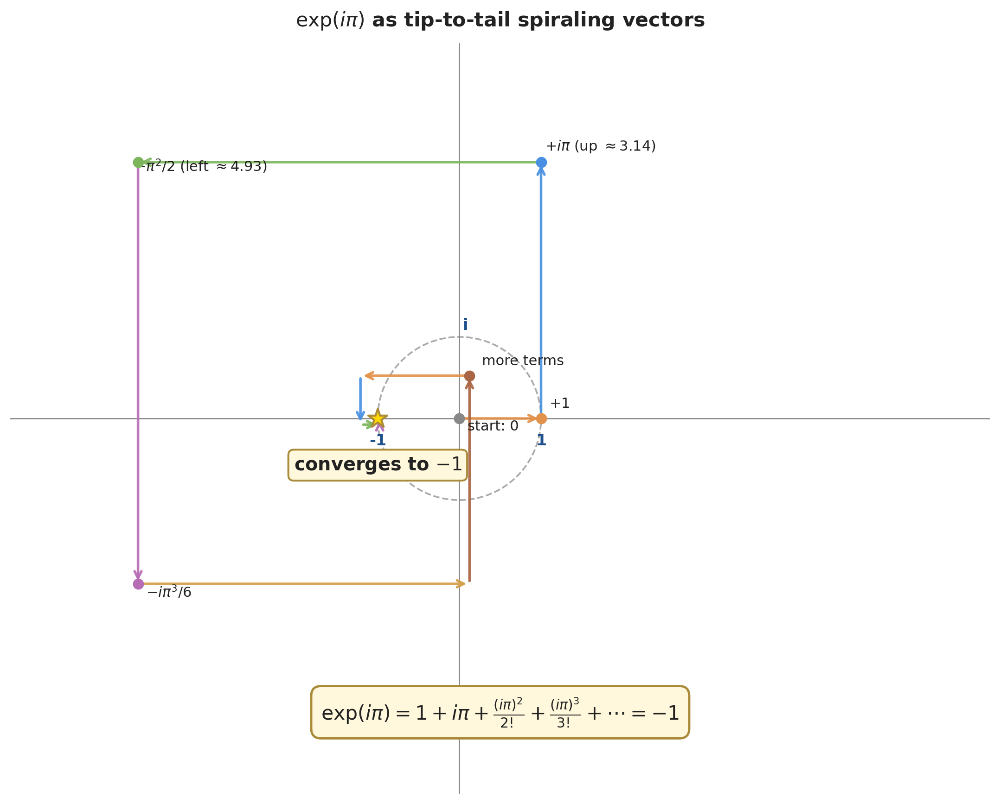
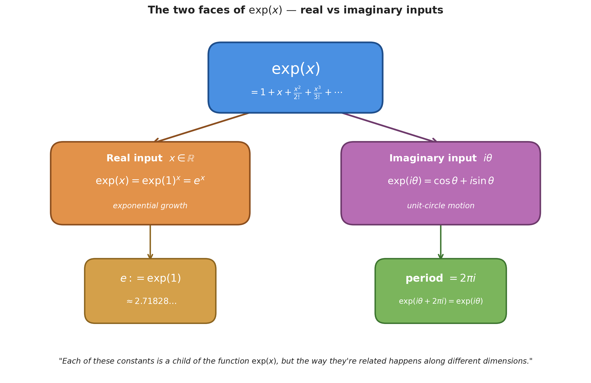

# Euler's Formula via $\exp(x)$ — Why $e^{i\theta} = \cos\theta + i\sin\theta$

*Path C single-source note — extracted from 3Blue1Brown's "Lockdown math" Euler-formula episode via Gemini frame-by-frame analysis (gemini-3-pro-preview, full 51:15 video). Topics regrouped textbook-style; every timestamp is a clickable deep-link.*

| Field | Value |
|---|---|
| **Source** | [Lockdown math — Euler's formula via exp](https://www.youtube.com/watch?v=ZxYOEwM6Wbk) |
| **Speaker** | Grant Sanderson (3Blue1Brown) |
| **Length** | 51:15 |
| **Topic** | Why $e^{i\theta} = \cos\theta + i\sin\theta$ — rethinking $e^x$ as the polynomial $\exp(x) = \sum x^n/n!$, then watching the polynomial spiral around the unit circle when the input is imaginary |
| **Captured** | 2026-05-14 |

> [!info] The whole punchline in one paragraph
> $e^{i\theta}$ is **not** "$e$ raised to the imaginary power $i\theta$" — that phrase is gibberish. Instead, $e^x$ is shorthand for a specific function: $\exp(x) = 1 + x + \tfrac{x^2}{2!} + \tfrac{x^3}{3!} + \cdots$. This function is *defined* by the infinite polynomial, and one of its properties is $\exp(a+b) = \exp(a)\exp(b)$ — which makes the exponent notation "$e^x$" reasonable. When you plug in $i\theta$, the polynomial's terms become tip-to-tail vectors that **spiral** (because powers of $i$ rotate by 90°) and **shrink** (because of the $1/n!$ factors), conspiring to land exactly on $\cos\theta + i\sin\theta$ on the unit circle. Euler's identity $e^{i\pi} = -1$ is just the $\theta = \pi$ case where the spiral lands at $-1$.

---

## 1. The Goal — Euler's Formula and Identity

### 1.1 The formula *(stated at [[2:18]](https://www.youtube.com/watch?v=ZxYOEwM6Wbk&t=138s))*

> [!definition] Euler's formula
> $$e^{i\theta} = \cos\theta + i\sin\theta$$

This says: the complex number $e^{i\theta}$ is exactly the point on the unit circle at angle $\theta$ (measured CCW from the positive real axis). The geometric setup carries over directly from the previous episode — multiplying by a unit-magnitude complex number at angle $\theta$ rotates the plane by $\theta$.

> "When you have a number who's sitting one unit away from the origin at some angle $\theta$, multiplying by this number has the effect of rotating things by that angle." *(at [[1:21]](https://www.youtube.com/watch?v=ZxYOEwM6Wbk&t=81s))*

### 1.2 Euler's identity: $e^{i\pi} = -1$ *(derived at [[4:31]](https://www.youtube.com/watch?v=ZxYOEwM6Wbk&t=271s))*

The most famous instance — plug $\theta = \pi$ into Euler's formula:

$$e^{i\pi} = \cos(\pi) + i\sin(\pi)$$

Walking a half-circle ($\pi$ radians) from the positive real axis lands at the point $(-1, 0)$:
- Real part: $\cos(\pi) = -1$
- Imaginary part: $\sin(\pi) = 0$

So $e^{i\pi} = -1 + 0i$, i.e.

$$\boxed{e^{i\pi} = -1}$$

### 1.3 Why this looks baffling read naively *(at [[5:17]](https://www.youtube.com/watch?v=ZxYOEwM6Wbk&t=317s))*

> "But it's baffling... because you've got this idea of raising a constant... to an imaginary power." *(at [[5:17]](https://www.youtube.com/watch?v=ZxYOEwM6Wbk&t=317s))*

What does it even *mean* to multiply $e$ by itself $i\pi$ times? Nothing — read as repeated multiplication, the formula is incoherent. The rest of the note explains the fix: $e^x$ is shorthand for a polynomial, and the polynomial does make sense at imaginary inputs.

*Generated by matplotlib via `_gen_efm_fig1_unit_circle.py` — the unit circle on the complex plane, with the point at angle $\theta$ labeled $(\cos\theta, \sin\theta) = e^{i\theta}$.*

---

## 2. The Real Meaning of $e^x$ — the $\exp(x)$ Function

### 2.1 The infinite polynomial definition *(at [[8:33]](https://www.youtube.com/watch?v=ZxYOEwM6Wbk&t=513s))*

Grant introduces a new function defined by an infinite polynomial:

> [!definition] The exp function
> $$\exp(x) := 1 + x + \frac{x^2}{2!} + \frac{x^3}{3!} + \frac{x^4}{4!} + \cdots = \sum_{n=0}^{\infty} \frac{x^n}{n!}$$
>
> The denominator $n! = 1 \cdot 2 \cdot 3 \cdots n$ is the factorial. So $2! = 2$, $3! = 6$, $4! = 24$, etc.

> "It's not a polynomial, it's an infinite polynomial. We add infinitely many terms, each of which look like $x^n$ divided by $n!$." *(at [[8:46]](https://www.youtube.com/watch?v=ZxYOEwM6Wbk&t=526s))*

### 2.2 $e^x$ is shorthand — NOT literal repeated multiplication *(at [[8:12]](https://www.youtube.com/watch?v=ZxYOEwM6Wbk&t=492s))*

The naive reading "$e^x = e \cdot e \cdots e$ ($x$ times)" is **crossed out** with a red X on Grant's notepad.

> "This is not what $e^x$ means... Instead, what has emerged in math is that we use $e^x$ to be a shorthand for another function... $\exp(x)$." *(at [[8:12]](https://www.youtube.com/watch?v=ZxYOEwM6Wbk&t=492s))*

> "I would make the claim that this formula actually has nothing to do with the number $e$... the number $e$ doesn't actually play a role in what this formula is computationally saying." *(at [[6:34]](https://www.youtube.com/watch?v=ZxYOEwM6Wbk&t=394s))*

### 2.3 Computing values — sanity check *(at [[10:00]](https://www.youtube.com/watch?v=ZxYOEwM6Wbk&t=600s))*

> [!example] $\exp(1) = e$
> **Problem.** Evaluate $\exp(1)$ from the series definition.
> **Setup.** Plug $x = 1$ into $\sum x^n/n!$.
> **Solution.**
> $$\exp(1) = 1 + 1 + \frac{1}{2} + \frac{1}{6} + \frac{1}{24} + \cdots + \frac{1}{n!} + \cdots$$
> Add the terms. They get small fast (because $n!$ outgrows $1$), so the partial sums converge to a specific value.
> **Answer.** $\exp(1) \approx 2.71828\ldots = e$.
> **Insight.** This is how $e$ enters the picture — *as the value of the function $\exp$ at $x = 1$*, not as a primitive constant we then raise to powers.

Numerical check via Python `sum([1**n / math.factorial(n) for n in range(100)])`:
- $\exp(1) \approx 2.7182818284590455$
- $\exp(2) \approx 7.389056098930649$
- $\exp(3) \approx 20.08553692318766$
- $\exp(4) \approx 54.598150033144265$

### 2.4 The defining property: $\exp(a+b) = \exp(a)\exp(b)$ *(formalized at [[14:46]](https://www.youtube.com/watch?v=ZxYOEwM6Wbk&t=886s))*

Discovered numerically — Grant computes $\exp(3 + 4)$ and $\exp(3) \cdot \exp(4)$ separately in Python and gets the same answer (modulo float rounding):

| Computation | Value |
|---|---|
| $\exp(3 + 4) = \exp(7)$ | $\approx 1096.6331584284578$ |
| $\exp(3) \cdot \exp(4)$ | $\approx 1096.6331584284587$ |
| $\exp(3.2 + 5.5) = \exp(8.7)$ | $\approx 6002.912217261021$ |
| $\exp(3.2) \cdot \exp(5.5)$ | $\approx 6002.912217261018$ |

> [!definition] The defining property of $\exp$
> $$\boxed{\exp(a + b) = \exp(a) \cdot \exp(b)}$$
> **Addition in the input becomes multiplication in the output.** This is the property that justifies the "$e^x$" notation.

> "Now if you just look at the polynomial... This is not clear. Okay, this is not something that, like, you look at it and say, oh, yes, of course, it couldn't have been any other way." *(at [[14:58]](https://www.youtube.com/watch?v=ZxYOEwM6Wbk&t=898s))*

(Proving it from the polynomial is the homework — left below in §5.)

### 2.5 Why $\exp(0) = 1$ *(at [[27:44]](https://www.youtube.com/watch?v=ZxYOEwM6Wbk&t=1664s))*

> [!example] $\exp(0) = 1$
> **Problem.** Show $\exp(0) = 1$.
> **Solution (from the series).** Plug $x = 0$ into $1 + x + x^2/2 + \cdots$ — every term except the leading $1$ vanishes.
> $$\exp(0) = 1 + 0 + 0 + \cdots = 1$$
>
> **Solution (from the property).** Use $\exp(x + 0) = \exp(x) = \exp(x) \cdot \exp(0)$. As long as $\exp$ isn't identically zero (and the series shows $\exp(1) \neq 0$), divide both sides by $\exp(x)$ to get $1 = \exp(0)$.
> **Answer.** $\boxed{\exp(0) = 1}$
> **Insight.** Either route works. The property route ($\exp(a+b) = \exp(a)\exp(b)$) is the cleaner proof.

### 2.6 Worked: deriving $\exp(5) = e^5$, $\exp(-1) = 1/e$, $\exp(1/2) = \sqrt{e}$ *(at [[20:34]](https://www.youtube.com/watch?v=ZxYOEwM6Wbk&t=1234s))*

The property $\exp(a+b) = \exp(a)\exp(b)$ + the identity $\exp(0) = 1$ are enough to nail down $\exp$ at every rational input.

> [!example] $\exp(5) = e^5$
> **Solution.**
> 1. Write $5$ as a sum of ones: $\exp(5) = \exp(1 + 1 + 1 + 1 + 1)$.
> 2. Apply the property four times: $= \exp(1) \cdot \exp(1) \cdot \exp(1) \cdot \exp(1) \cdot \exp(1)$.
> 3. Rewrite as a power: $= \exp(1)^5$.
> 4. Substitute the shorthand $e := \exp(1)$: $= e^5$.
>
> **Answer.** $\boxed{\exp(5) = e^5}$. This generalizes to any positive integer: $\exp(n) = e^n$.

> [!example] $\exp(1/2) = \sqrt{e}$
> **Solution.**
> 1. $\exp(1/2) \cdot \exp(1/2) = \exp(1/2 + 1/2)$ (property in reverse).
> 2. $= \exp(1) = e$.
> 3. So $\exp(1/2)^2 = e$, i.e. $\exp(1/2) = \sqrt{e}$.
>
> **Answer.** $\boxed{\exp(1/2) = \sqrt{e}}$. Same idea works for any rational $1/n$: $\exp(1/n) = e^{1/n}$.

> [!example] $\exp(-1) = 1/e$
> **Solution.**
> 1. $\exp(-1) \cdot \exp(1) = \exp(-1 + 1) = \exp(0) = 1$.
> 2. Substitute $\exp(1) = e$: $\exp(-1) \cdot e = 1$.
> 3. So $\exp(-1) = 1/e$.
>
> **Answer.** $\boxed{\exp(-1) = 1/e}$.

So for **any real $x$**, $\exp(x) = e^x$ — the notation is justified.

> "The reason that I'm saying this is to emphasize why it's reasonable that we use the shorthand... that when we say $\exp(x)$ for real numbers $x$, why it would be very reasonable to write this as $e$ to the power $x$." *(at [[24:45]](https://www.youtube.com/watch?v=ZxYOEwM6Wbk&t=1485s))*

> "That only makes sense for real numbers — because as soon as we start introducing things like complex numbers you can't just add one to itself or subtract and divide and get the number $i$." *(at [[25:51]](https://www.youtube.com/watch?v=ZxYOEwM6Wbk&t=1551s))*

For complex inputs the trick of "decompose into a sum of ones" doesn't reach them. We need the series itself.

---

## 3. The Spiral — How $\exp(i\theta)$ Walks Around the Unit Circle

### 3.1 Powers of $i$ are 90° rotations *(at [[30:56]](https://www.youtube.com/watch?v=ZxYOEwM6Wbk&t=1856s))*

The same 90°-rotation fact from the previous episode shows up in the powers of $i$:

| Power | Value | Direction (from positive real axis) |
|---|---|---|
| $i^0$ | $1$ | right (0°) |
| $i^1$ | $i$ | up (90°) |
| $i^2$ | $-1$ | left (180°) |
| $i^3$ | $-i$ | down (270°) |
| $i^4$ | $1$ | right again (360°) — pattern repeats |

> "Multiplying by $i$ has the effect of rotating 90 degrees." *(at [[31:08]](https://www.youtube.com/watch?v=ZxYOEwM6Wbk&t=1868s))*

Also: $i^{-1} = 1/i = -i$ (because $i \cdot (-i) = -i^2 = 1$).

*Generated by matplotlib via `_gen_efm_fig2_powers_of_i.py` — the cyclic pattern $1, i, -1, -i$ under repeated multiplication by $i$, each step a 90° CCW rotation.*

### 3.2 Plugging $i\theta$ into the series produces spiraling vectors *(at [[33:00]](https://www.youtube.com/watch?v=ZxYOEwM6Wbk&t=1980s))*

Substitute $x = i\theta$ into the series:

$$\exp(i\theta) = 1 + i\theta + \frac{(i\theta)^2}{2!} + \frac{(i\theta)^3}{3!} + \frac{(i\theta)^4}{4!} + \cdots$$

Each term has a **direction** (a power of $i$, so rotated by a multiple of 90°) and a **magnitude** (a power of $\theta$ divided by a factorial).

**Term-by-term breakdown at $\theta = 1$** *(at [[33:22]](https://www.youtube.com/watch?v=ZxYOEwM6Wbk&t=2002s))*:

| $n$ | Term | Magnitude | Direction |
|---|---|---|---|
| 0 | $1$ | $1$ | right |
| 1 | $i$ | $1$ | up |
| 2 | $i^2/2 = -1/2$ | $0.5$ | left |
| 3 | $i^3/6 = -i/6$ | $\approx 0.167$ | down |
| 4 | $i^4/24 = 1/24$ | $\approx 0.042$ | right (tiny) |
| ⋮ | ⋮ | ⋮ | ⋮ |

Adding these vectors tip-to-tail traces an inward spiral that converges to a point on the unit circle.

**Numerical check** *(at [[34:53]](https://www.youtube.com/watch?v=ZxYOEwM6Wbk&t=2093s))*: Python `exp(complex(0, 1))` returns `(0.5403... + 0.8415...j)`. Compare: $\cos(1) \approx 0.5403$, $\sin(1) \approx 0.8415$. ✓ Euler's formula holds at $\theta = 1$.

*Generated by matplotlib via `_gen_efm_fig3_spiral.py` — the first ~10 terms of $\exp(i\pi)$ drawn tip-to-tail. Vectors rotate 90° per step and shrink by $1/n!$, spiraling inward to land at $-1$ on the real axis.*

### 3.3 At $\theta = \pi$, the spiral lands exactly at $-1$ *(at [[36:51]](https://www.youtube.com/watch?v=ZxYOEwM6Wbk&t=2211s))*

The same construction with $\theta = \pi$:

| $n$ | Term | Magnitude | Direction |
|---|---|---|---|
| 0 | $1$ | $1$ | right |
| 1 | $i\pi$ | $\pi \approx 3.14$ | up |
| 2 | $-\pi^2/2$ | $\approx 4.93$ | left |
| 3 | $-i\pi^3/6$ | $\approx 5.16$ | down |
| 4 | $\pi^4/24$ | $\approx 4.06$ | right (still big) |
| ⋮ | ⋮ | (eventually $n!$ overtakes $\pi^n$ and lengths shrink) | ⋮ |

Early terms are large because $\pi^n$ is winning against $n!$. After about $n \approx 6$, $n!$ takes over and the terms shrink. The cumulative tip-to-tail sum still spirals inward and lands at exactly $-1$.

> "When the vectors are rotating according to powers of $i$, and when their lengths are changing according to powers of $\pi$ divided by $n!$, they all conspire in just the right way that they land at the point negative one." *(at [[38:29]](https://www.youtube.com/watch?v=ZxYOEwM6Wbk&t=2309s))*

> "Nowhere in that function did we include the value 2.718... In fact, nowhere in the computer's memory during the execution of this computation would it encounter the value $e$." *(at [[43:24]](https://www.youtube.com/watch?v=ZxYOEwM6Wbk&t=2604s))*

That's the punchline of the whole video: Euler's identity has nothing to do with $e \approx 2.718$. The constant $e$ is just the *real-input* face of the function $\exp$; the unit-circle behavior is the *imaginary-input* face.

### 3.4 General $\theta$: the spiral converges to $\cos\theta + i\sin\theta$ *(at [[35:43]](https://www.youtube.com/watch?v=ZxYOEwM6Wbk&t=2143s))*

The same construction at any $\theta$ produces a spiral landing on the unit circle at angle $\theta$ — exactly the point $(\cos\theta, \sin\theta)$. So:

$$\exp(i\theta) = \cos\theta + i\sin\theta$$

which is Euler's formula, *now justified from the series definition*.

> "What this is saying is if I plug in $i$ times theta, evidently that's the same as walking around a unit circle." *(at [[36:01]](https://www.youtube.com/watch?v=ZxYOEwM6Wbk&t=2161s))*

---

## 4. The Two Faces of $\exp$

The function $\exp$ has dramatically different behavior depending on whether the input is real or imaginary. Grant draws a branching diagram *(at [[43:55]](https://www.youtube.com/watch?v=ZxYOEwM6Wbk&t=2635s))*:

| Input type | Behavior | Characteristic constant |
|---|---|---|
| **Real** $x$ | $\exp(x) = \exp(1)^x = e^x$ (exponential growth) | $e \approx 2.718$ |
| **Imaginary** $i\theta$ | $\exp(i\theta) = $ point on unit circle at angle $\theta$; **periodic** with period $2\pi i$ | $2\pi i$ |

*Generated by matplotlib via `_gen_efm_fig4_two_faces.py` — the branching diagram. Real branch: $\exp(x) = e^x$ with the constant $e$ defined as $\exp(1)$. Imaginary branch: $\exp(i\theta)$ periodic on the unit circle, with the constant $2\pi i$ as the period.*

> "Each of these constants is a child of the function $\exp(x)$... but the way that they're related happens along different dimensions." *(at [[45:07]](https://www.youtube.com/watch?v=ZxYOEwM6Wbk&t=2707s))*

So $e$ and $2\pi i$ are both "constants of nature" associated with the same function $\exp$ — but each parametrizes the function along a different direction. Real-axis growth picks out $e$; imaginary-axis rotation picks out $2\pi i$.

---

## 5. Homework — Proving the Defining Property from the Polynomial *(stated at [[15:10]](https://www.youtube.com/watch?v=ZxYOEwM6Wbk&t=910s))*

Grant leaves the proof of $\exp(a+b) = \exp(a)\exp(b)$ as homework. The plan:

> [!example] Homework — three problems
> **Problem 1.** Show that when you fully expand $\exp(x)\exp(y) = \left(\sum_{k=0}^\infty \tfrac{x^k}{k!}\right)\left(\sum_{m=0}^\infty \tfrac{y^m}{m!}\right)$, each term has the form $\dfrac{x^k y^m}{k!\,m!}$.
>
> **Problem 2.** Show that when you expand $\exp(x+y) = \sum_{n=0}^\infty \tfrac{(x+y)^n}{n!}$, each term has the form $\dfrac{1}{n!}\binom{n}{k} x^k y^{n-k}$ (hint: binomial theorem).
>
> **Problem 3.** Compare the two results to conclude $\exp(x+y) = \exp(x)\exp(y)$.
>
> **Problem 4 (extension).** Does the result still hold if $x, y$ are complex numbers? What about matrices?

> [!success]- Sketch of the answer for Problems 1–3
> Problem 1 — distribute $\exp(x)\exp(y)$:
> $$\left(\sum_{k=0}^\infty \frac{x^k}{k!}\right)\left(\sum_{m=0}^\infty \frac{y^m}{m!}\right) = \sum_{k=0}^\infty \sum_{m=0}^\infty \frac{x^k y^m}{k!\,m!}$$
>
> Problem 2 — binomial expand $(x+y)^n$:
> $$\exp(x+y) = \sum_{n=0}^\infty \frac{(x+y)^n}{n!} = \sum_{n=0}^\infty \frac{1}{n!} \sum_{k=0}^n \binom{n}{k} x^k y^{n-k}$$
>
> Problem 3 — regroup $\exp(x)\exp(y)$ by $n = k + m$:
> $$\sum_{k,m} \frac{x^k y^m}{k!\,m!} = \sum_{n=0}^\infty \sum_{k=0}^n \frac{x^k y^{n-k}}{k!(n-k)!} = \sum_{n=0}^\infty \frac{1}{n!}\sum_{k=0}^n \binom{n}{k} x^k y^{n-k}$$
> since $\binom{n}{k} = \tfrac{n!}{k!(n-k)!}$. The two sums are now visually identical, completing the proof.
>
> Problem 4 — yes for complex numbers (the manipulation never depended on $x, y$ being real, only on absolute convergence). **No** for general matrices unless $XY = YX$ (matrix multiplication isn't commutative; the cross-term regrouping fails). This is why the matrix-exponential identity $e^{X+Y} = e^X e^Y$ only holds when $X$ and $Y$ commute — the Baker–Campbell–Hausdorff formula handles the non-commuting case.

> "The core property that related this strange polynomial with factorials to the number $e$ was that addition in the input is the same as multiplication in the output." *(at [[45:40]](https://www.youtube.com/watch?v=ZxYOEwM6Wbk&t=2740s))*

---

## Key Takeaways

- **$e^{i\theta}$ does NOT mean "$e$ multiplied by itself $i\theta$ times"** — that phrase is incoherent. $e^x$ is **shorthand** for the function $\exp(x) = 1 + x + x^2/2! + x^3/3! + \cdots$.
- **The defining property of $\exp$ is $\exp(a+b) = \exp(a)\exp(b)$** — addition in becomes multiplication out. This property is what makes the exponent notation reasonable.
- **For real $x$, $\exp(x) = e^x$** (where $e := \exp(1) \approx 2.718$). This follows from the addition property + $\exp(0) = 1$.
- **For imaginary $i\theta$, $\exp(i\theta)$ is the point on the unit circle at angle $\theta$**. Geometrically: the polynomial's terms become tip-to-tail vectors that rotate (powers of $i$) and shrink (factorials), spiraling to a point on the unit circle.
- **Euler's identity $e^{i\pi} = -1$ is just the $\theta = \pi$ case** — the spiral converges to $-1$. Notably, computing it never touches the value $2.718$; the constant $e$ doesn't appear.
- **$e$ and $2\pi i$ are sibling constants** parametrizing the same function $\exp$ — one along the real axis (exponential growth), one along the imaginary axis (period of the circular motion).

---

### Sources

| Source | Section | Type |
|---|---|---|
| [Lockdown math — Euler's formula via exp (3Blue1Brown)](https://www.youtube.com/watch?v=ZxYOEwM6Wbk) | 0:00 → 51:15 | YouTube |
