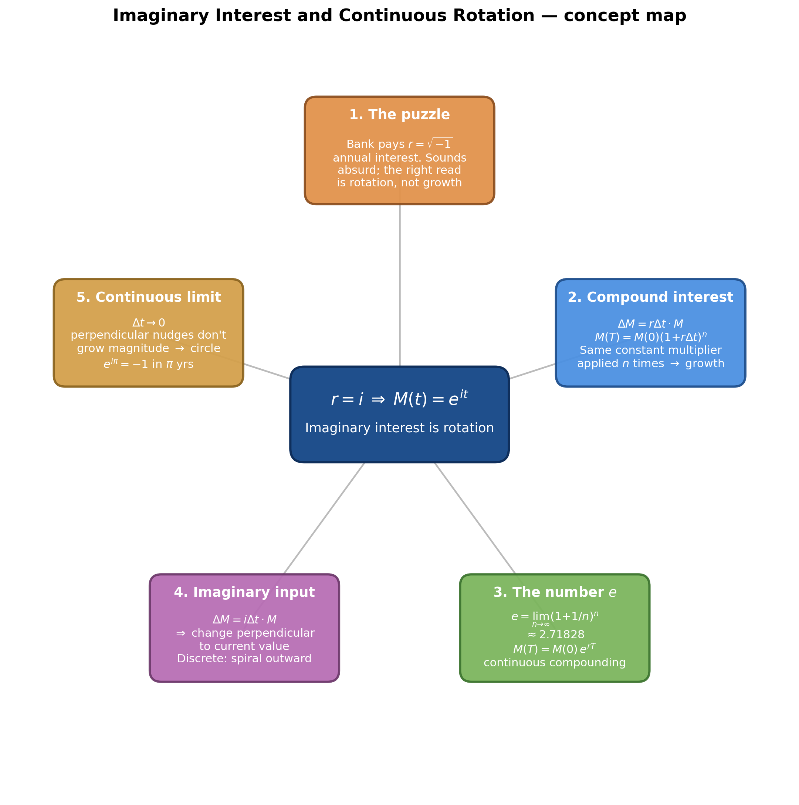
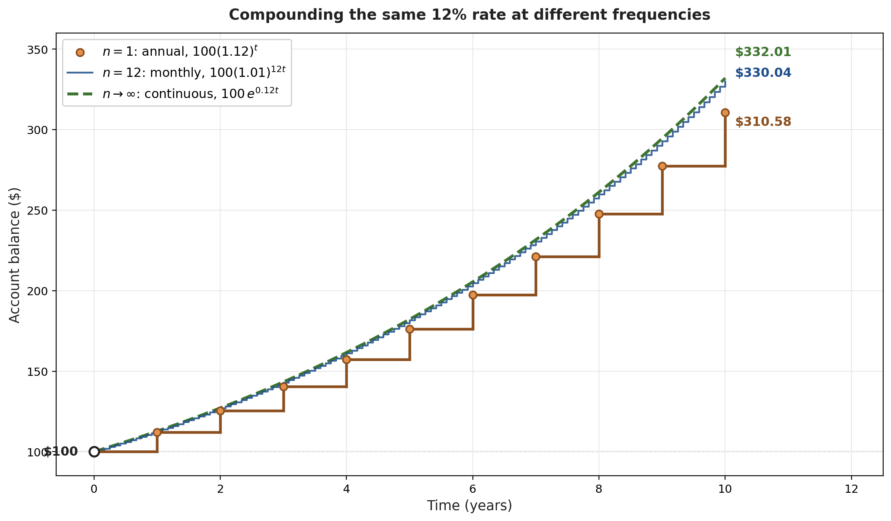
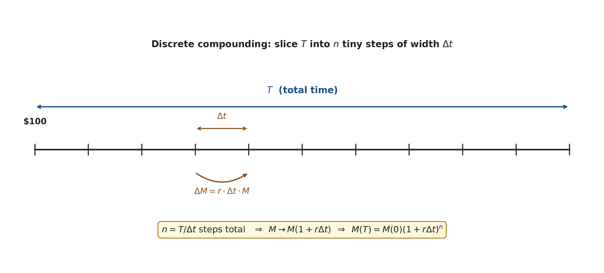
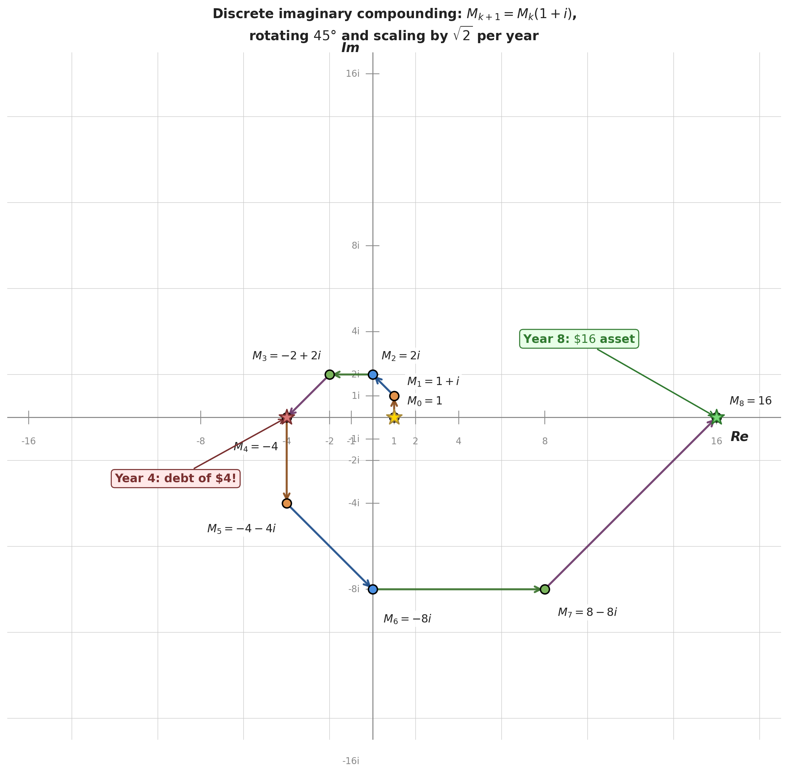
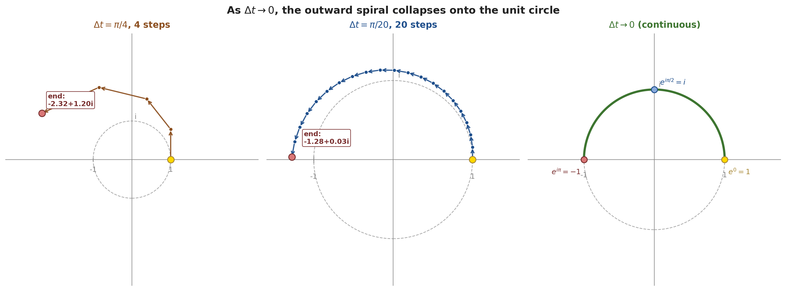
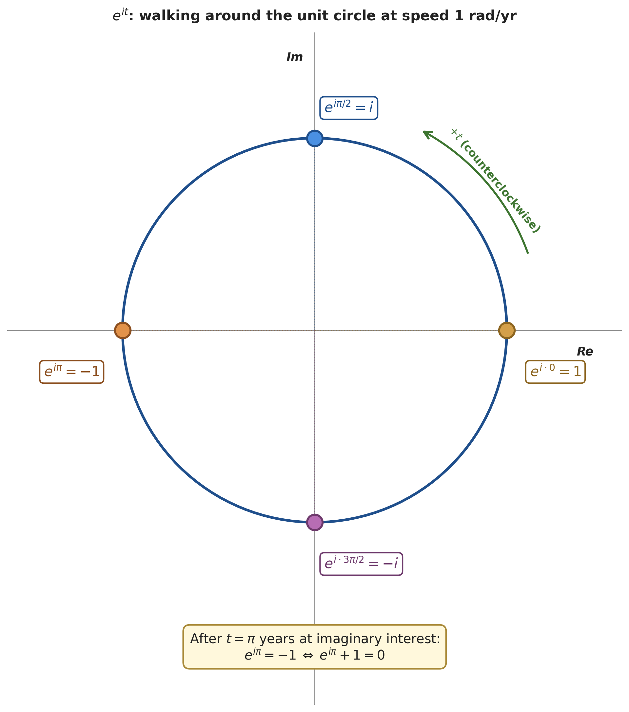
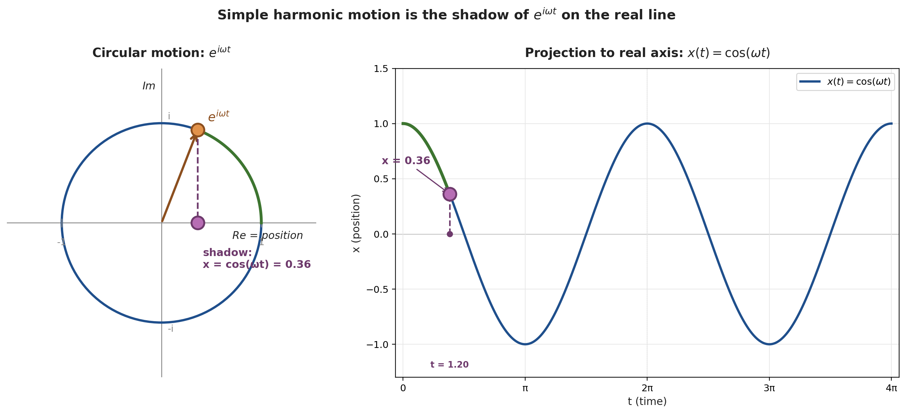
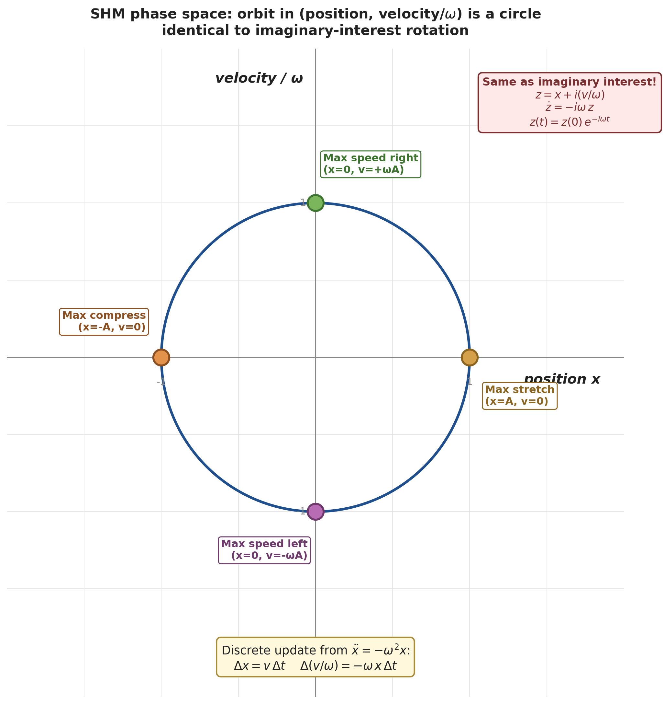

# Imaginary Interest and Continuous Rotation

*Companion note to [Euler's Formula via exp(x) (Main)](<Euler's Formula via exp(x) (Main).md>)*

*Source: [Lockdown Math — Interest Rates and $\sqrt{-1}$](https://www.youtube.com/watch?v=IAEASE5GjdI) by Grant Sanderson / 3Blue1Brown (45 min). Sections 1–6 captured; the Q&A epilogue (38:53+) is skipped as filler.*

---

> [!abstract] What this note is for
> Pose the absurd-sounding question — *"what if a bank offered an imaginary interest rate?"* — and answer it honestly. The path runs through ordinary compound interest, the number $e$, and ends at $e^{it}$ as a point walking around the unit circle. By the end, "imaginary interest" is not a paradox but a model for rotation, and Euler's formula is something you can *feel*, not just memorize.

*Generated by matplotlib via `_gen_iir_mindmap.py` — five-topic concept map for this note.*

---

## 1. The Provocative Question: $r = \sqrt{-1}$

### 1.1 Setup *(introduced at [[00:10]](https://www.youtube.com/watch?v=IAEASE5GjdI&t=10s))*

The video opens with a sketch of a bank labeled with **"Interest Rate $\sqrt{-1}$"** and an audience poll: *"A bank offers you an annual interest rate of $r = -\sqrt{-1}$. Do you take it?"* The question is engineered to feel nonsensical — you can't multiply something by itself $\sqrt{-1}$ times — but the punchline of the whole episode is that **the right interpretation of this rate is rotation, not growth**.

### 1.2 Why this matters *(at [[01:31]](https://www.youtube.com/watch?v=IAEASE5GjdI&t=91s))*

> *"Thinking through the details of this question, it's shockingly relevant to physics … and to understanding simple harmonic motion."*

The same math that turns imaginary interest into circular motion in the complex plane describes a mass oscillating on a spring. The link surfaces at the very end of the video (a literal metal spring placed on the notepad [[37:42]](https://www.youtube.com/watch?v=IAEASE5GjdI&t=2262s)) but the entire chain of reasoning is the bridge.

---

## 2. Compound Interest: Foundations

### 2.1 The 12%-annual vs 1%-monthly puzzle *(at [[03:27]](https://www.youtube.com/watch?v=IAEASE5GjdI&t=207s))*

> [!example] Worked example — Bank A vs Bank B
> **Problem.** Bank A increases your savings by 12% once per year. Bank B increases your savings by 1% every month. With \$100 in each, which has more after one year?
> **Setup.** $P = \$100$, $t = 1$ yr. Bank A: one 12% bump. Bank B: twelve 1% bumps.
> **Solution.** Bank A: $100(1.12) = 112$. Bank B: $100(1.01)^{12} \approx 112.68$. The 1% bumps each get applied to a slightly-larger base than the bump before, so they accumulate to *more* than a flat 12%.
> **Answer.** Bank B wins by about \$0.68 — option D in the poll.
> **Insight.** The frequency of compounding matters because each tiny bump operates on an already-grown principal.

### 2.2 Annual compounding visualized *(at [[07:03]](https://www.youtube.com/watch?v=IAEASE5GjdI&t=423s))*

A Desmos step function shows the \$100 → \$112 → \$125.44 → … staircase. The key algebraic move is factoring:

$$100 + 0.12 \cdot 100 \;=\; 100(1 + 0.12) \;=\; 112$$

Each year is multiplication by the same constant $1.12$. Quote *(at [[07:48]](https://www.youtube.com/watch?v=IAEASE5GjdI&t=468s))*:

> *"The fact that the rate of change is proportional to the thing that's changing means we can factor out this 100."*

> [!tip] The lever
> Whenever the *change* is proportional to the *current value*, compounding becomes a single constant multiplier applied repeatedly. This idea reappears everywhere downstream — it is the entire reason $e$ exists.

### 2.3 Sub-annual compounding *(at [[10:53]](https://www.youtube.com/watch?v=IAEASE5GjdI&t=653s))*

> [!example] Two 6-month compounding periods at 6%
> **Problem.** A bank offers 6% every 6 months. After 1 year, how much do you have on \$100?
> **Setup.** $P = \$100$, rate per period $= 0.06$, two periods per year.
> **Solution.**
> - After 6 months: $100(1 + 0.06) = 106$.
> - After 12 months: $106(1 + 0.06) = 100(1 + 0.06)^2$.
> **Answer.** $100(1.06)^2 = 112.36$.
> **Insight.** The "factor and multiply" trick generalizes — $n$ periods of rate $r/n$ gives factor $(1 + r/n)^n$.

Extending to monthly *(at [[12:26]](https://www.youtube.com/watch?v=IAEASE5GjdI&t=746s))*:

$$100(1 + 0.01)^{12} \approx 112.68$$

And over 10 years *(at [[13:45]](https://www.youtube.com/watch?v=IAEASE5GjdI&t=825s))*:

| Compounding | Formula | Result |
|---|---|---|
| Annual, 10 yrs | $100(1.12)^{10}$ | $\approx \$310.58$ |
| Monthly, 10 yrs | $100(1.01)^{120}$ | $\approx \$330.03$ |
| Continuous, 10 yrs | $100\, e^{0.12 \cdot 10}$ | $\approx \$332.01$ |

*Generated by matplotlib via `_gen_iir_fig1_staircase.py` — annual step function (orange), monthly (blue), continuous limit (green dashed). Final values at year 10 shown on the right.*

### 2.4 The general discrete formula *(at [[14:42]](https://www.youtube.com/watch?v=IAEASE5GjdI&t=882s))*

*Generated by matplotlib via `_gen_iir_fig2_timeline.py` — total time $T$ sliced into $n$ steps of width $\Delta t$. Each step adds $\Delta M = r \Delta t \cdot M$.*

Setup on a timeline of total length $T$, sliced into $n$ tiny steps of width $\Delta t$:

$$n = \frac{T}{\Delta t}, \qquad \Delta M = r \cdot \Delta t \cdot M$$

That is, *each tiny step adds an amount proportional to* $r$ (the rate), $\Delta t$ (how long the step is), and $M$ (how much you have). Quote *(at [[15:35]](https://www.youtube.com/watch?v=IAEASE5GjdI&t=935s))*:

> *"What interest rates do is they say that the amount your money changes is gonna equal that interest rate $r$ … multiply it by the size of your time step … and then … it's also proportional to the amount of money you had."*

Factoring as before:

$$M \;\to\; M + r\Delta t \cdot M \;=\; M(1 + r\Delta t)$$

Applying this $n$ times to the initial principal $M(0)$:

$$\boxed{\; M(T) \;=\; M(0)\bigl(1 + r\Delta t\bigr)^n \;=\; M(0)\!\left(1 + \frac{rT}{n}\right)^n \;}$$

---

## 3. Continuous Compounding and the Number $e$

### 3.1 Taking the limit *(at [[18:32]](https://www.youtube.com/watch?v=IAEASE5GjdI&t=1112s))*

What happens if you compound infinitely often — $n \to \infty$ with each step infinitesimally short? Drop the principal and combine the rate-time product into a single variable $x = rT$:

$$f(x) \;=\; \lim_{n \to \infty} \left(1 + \frac{x}{n}\right)^n$$

### 3.2 Empirical check *(at [[23:40]](https://www.youtube.com/watch?v=IAEASE5GjdI&t=1420s))*

> [!example] Does it blow up?
> **Problem.** What does $100\left(1 + \frac{0.12}{n}\right)^n$ approach as $n \to \infty$?
> **Setup.** Type the expression into Desmos with $n = 10^8$.
> **Solution.** The base $(1 + 0.12/n)^n$ stabilizes at $\approx 1.12749685078$. Multiplying by 100 gives $\approx 112.749684804$.
> **Answer.** It converges — does **not** blow up.
> **Insight.** *"It's not at all obvious that this thing would remain bounded"* [[23:07]](https://www.youtube.com/watch?v=IAEASE5GjdI&t=1387s). Compounding more frequently helps, but with diminishing returns — there's a ceiling.

### 3.3 Isolating $e$ *(at [[24:48]](https://www.youtube.com/watch?v=IAEASE5GjdI&t=1488s))*

Algebraic substitution: let $m = n/x$, so $x/n = 1/m$ and $n = mx$:

$$\lim_{n\to\infty}\left(1 + \frac{x}{n}\right)^n
\;=\; \lim_{m\to\infty}\left(1 + \frac{1}{m}\right)^{mx}
\;=\; \left[\lim_{m\to\infty}\left(1 + \frac{1}{m}\right)^m\right]^{x}$$

The bracketed inner limit is a *constant*. Numerically *(at [[26:05]](https://www.youtube.com/watch?v=IAEASE5GjdI&t=1565s))*:

$$\left(1 + \frac{1}{n}\right)^n \;\xrightarrow{n\to\infty}\; 2.71828181503\ldots$$

> [!definition] Definition — Euler's number
> $$e \;:=\; \lim_{n \to \infty}\left(1 + \frac{1}{n}\right)^{n} \approx 2.71828$$

Therefore:

$$f(x) \;=\; e^{x}$$

And the continuous compound interest formula collapses to *(at [[27:08]](https://www.youtube.com/watch?v=IAEASE5GjdI&t=1628s))*:

$$\boxed{\; M(T) \;=\; M(0)\, e^{rT} \;}$$

### 3.4 $e^x$ as a polynomial *(at [[27:56]](https://www.youtube.com/watch?v=IAEASE5GjdI&t=1676s))*

Modern math treats $e^x$ as shorthand for an infinite polynomial *(at [[27:53]](https://www.youtube.com/watch?v=IAEASE5GjdI&t=1673s))*:

$$e^x \;=\; 1 + x + \frac{x^2}{2!} + \frac{x^3}{3!} + \frac{x^4}{4!} + \dots \;=\; \sum_{k=0}^{\infty} \frac{x^k}{k!}$$

This is derived by binomial-expanding $(1 + x/n)^n$ and letting $n \to \infty$. The polynomial form matters because *(at [[28:15]](https://www.youtube.com/watch?v=IAEASE5GjdI&t=1695s))*:

> *"This is how you think about it, especially when there's weird inputs, things like an imaginary interest rate."*

> [!tip] Two equivalent definitions
> The same $e^x$ can be defined as:
> - **A limit** — $\lim_{n\to\infty}(1 + x/n)^n$ — captures the *compounding* picture
> - **A series** — $\sum_{k} x^k/k!$ — better for *computation* and *complex inputs*
>
> Both are needed below: the limit gives the geometric intuition for $e^{it}$, the series later (in [[Euler's Formula via exp(x) (Main)]]) lets us derive $e^{i\theta} = \cos\theta + i\sin\theta$.

---

## 4. Plugging in an Imaginary Rate

### 4.1 Why naive interpretation fails *(at [[30:58]](https://www.youtube.com/watch?v=IAEASE5GjdI&t=1858s))*

If $r = i = \sqrt{-1}$, then $e^{i}$ as "$e$ multiplied by itself $i$ times" is meaningless. Quote:

> *"You cannot multiply a constant by itself the square root of negative one times. So that doesn't make sense."*

But the *limit* definition — $\lim_{n\to\infty}(1 + i/n)^n$ — only multiplies by ordinary complex numbers $(1 + i/n)$, so it's perfectly well-defined for $r = i$.

### 4.2 Discrete imaginary compounding *(at [[31:46]](https://www.youtube.com/watch?v=IAEASE5GjdI&t=1906s))*

Set $r = i$ and $\Delta t = 1$ year:

$$\Delta M \;=\; i \cdot \Delta t \cdot M \;=\; i \cdot M$$

Geometrically, **multiplying by $i$ rotates by 90°** *(at [[32:16]](https://www.youtube.com/watch?v=IAEASE5GjdI&t=1936s))*. So the change vector $\Delta M$ is always perpendicular to the current position vector $M$.

> [!example] Year-by-year imaginary compounding on \$1
> **Problem.** Bank pays $r = i$ annually, compounded once a year. Track \$1 through several years.
> **Setup.** Each year, multiply the balance by $(1 + i)$. Start at $M_0 = 1$ on the real axis.
> **Solution.**
> - Year 1: $M_1 = 1 \cdot (1 + i) = 1 + i$
> - Year 2: $M_2 = (1+i)(1+i) = 2i$
> - Year 3: $M_3 = 2i(1+i) = -2 + 2i$
> - Year 4: $M_4 = (-2+2i)(1+i) = -4$
> - Year 8: $M_8 = M_4 \cdot (1+i)^4 = -4 \cdot (-4) = 16$
> **Answer.** After 4 years: $-\$4$ (i.e. $\$1$ grew into a debt of $-\$4$). After 8 years: $+\$16$. The magnitudes follow $|1 + i|^k = (\sqrt{2})^k$, so $k=4$ gives magnitude $4$; $k=8$ gives magnitude $16$.
> **Insight** *(at [[34:36]](https://www.youtube.com/watch?v=IAEASE5GjdI&t=2076s))*. *"Good news sir, there's twice as much of it. Bad news, it's all imaginary."* The discrete process spirals outward in the complex plane, rotating 45° per year and scaling by $\sqrt{2}$.

*Generated by matplotlib via `_gen_iir_fig3_imag_spiral.py` — starting at $M_0 = 1$ and multiplying by $(1+i)$ each year. Year 4 lands on $-\$4$ (debt!); year 8 lands on $\$16$.*

### 4.3 Why does it spiral? *(at [[36:43]](https://www.youtube.com/watch?v=IAEASE5GjdI&t=2203s))*

Each step rotates by 90° (multiplication by $i$ applied to $\Delta t \cdot M$) and *adds* it on. Because the step is added (not multiplied), the new position vector is the hypotenuse of a right triangle whose legs are $M$ and $i\Delta t M$. The hypotenuse is *longer* than $M$ alone — hence the outward spiral.

The size of the step matters: with $\Delta t = 1$, you scale by $\sqrt{2}$ per step. As $\Delta t \to 0$, the scaling collapses to $1$ — pure rotation. That is the key insight for the continuous case.

*Generated by matplotlib via `_gen_iir_fig4_spiral_to_circle.py` — for a fixed total "time" of $\pi$: coarse steps ($\Delta t = \pi/4$) spiral wildly outward; finer steps ($\Delta t = \pi/20$) trace a near-circle ending near $-1$; the continuous limit ($\Delta t \to 0$) lands exactly on $-1$.*

> [!tip] Interactive demo — [open `iir_demo.html`](iir_demo.html) in a browser
> Drag the **n** slider from 2 up to 400 with $T = \pi$ and watch the endpoint slide inward to $-1$. The **gap** value shows the Euclidean distance between the discrete endpoint $(1+i\Delta t)^n$ and the true continuous value $e^{iT}$ — it shrinks roughly like $T^2 / (2n)$ for large $n$. The demo lets you toggle the unit circle, the $e^{it}$ target arc, and the per-step endpoints; pressing **Sweep** ramps $n$ up automatically so you can feel the convergence.

---

## 5. $e^{it}$ as Motion Around the Unit Circle

### 5.1 The continuous limit *(at [[36:59]](https://www.youtube.com/watch?v=IAEASE5GjdI&t=2219s))*

> *"As that time step gets smaller and smaller … to the point where it's genuinely continuously compounding interest, what it means is that you're simply walking around a circle."*

With $r = i$ and $\Delta t \to 0$, the change $\Delta M = i \Delta t M$ is perpendicular to $M$ but also vanishingly small in magnitude. Perpendicular infinitesimal nudges never grow the radius — they only change direction. The trajectory traces a perfect circle of radius $|M(0)|$.

Plugging $r = i$ into the continuous formula:

$$M(t) \;=\; M(0)\, e^{it}$$

For $M(0) = 1$, the path is the unit circle, parameterized so that $t$ years corresponds to $t$ radians of arc.

### 5.2 Reading off special values *(at [[38:05]](https://www.youtube.com/watch?v=IAEASE5GjdI&t=2285s))*

> [!example] Continuous imaginary compounding on \$1
> **Problem.** \$1 in a continuous bank with $r = i$. What's the balance at various times?
> **Setup.** $M(t) = e^{it}$, traveling counterclockwise on the unit circle at angular speed 1 rad/yr.
> **Solution.**
> - $t = \pi/2 \approx 1.571$ yrs → top of circle → \$1$i$
> - $t = \pi \approx 3.142$ yrs → far left → $-\$1$
> - $t = 2\pi \approx 6.283$ yrs → back to start → \$1
> **Answer.** $e^{i\pi/2} = i$, $e^{i\pi} = -1$, $e^{2\pi i} = 1$.
> **Insight.** Euler's identity $e^{i\pi} + 1 = 0$ is just *"how much money do you have after $\pi$ years at imaginary interest?"* — the answer is $-1$, so $e^{i\pi} + 1 = 0$.

*Generated by matplotlib via `_gen_iir_fig5_eit_circle.py` — $e^{it}$ traces the unit circle counterclockwise at angular speed 1 rad/yr; key values $e^0=1$, $e^{i\pi/2}=i$, $e^{i\pi}=-1$, $e^{i\cdot 3\pi/2}=-i$ marked at their corresponding times.*

---

## 6. Simple Harmonic Motion: Same Math, Different Story

The last seven minutes of the video pivot from finance to physics. The bridge: in both *imaginary interest* and *spring motion*, the rule of change is "perpendicular nudges." So the same rotation that produces $e^{it}$ also produces oscillation.

### 6.1 The spring demonstration *(at [[40:34]](https://www.youtube.com/watch?v=IAEASE5GjdI&t=2434s))*

Grant extracts a tiny metal spring from his pen and pulls/pushes it horizontally to demonstrate restoring force. Quotes:

> *"If I pull the spring, it's pushing me back in the other direction against how I pull it. And similarly, if I push on it, then it's pushing me in the other direction. It's trying to get back to that equilibrium point."* — [[40:38–40:48]](https://www.youtube.com/watch?v=IAEASE5GjdI&t=2438s)

He then draws the same setup on the notepad: a coiled spring attached to a mass $M$, with the equilibrium position marked. Stretching the spring by displacement $x$ produces a restoring force pulling back toward equilibrium.

### 6.2 Hooke's Law: $F = -kx$ *(at [[41:37]](https://www.youtube.com/watch?v=IAEASE5GjdI&t=2497s))*

> [!definition] Definition — Hooke's Law (approximation)
> For a spring displaced a distance $x$ from equilibrium, the restoring force is
> $$F \;\approx\; -k\, x$$
> where $k > 0$ is the spring constant. The minus sign means the force points *opposite* to the displacement — toward equilibrium.

Quote at [[41:38]](https://www.youtube.com/watch?v=IAEASE5GjdI&t=2498s): *"Hooke's Law suggests it's a force proportional to that size of x. And we use $k$ as a proportionality constant and negative to emphasize that it's pointed in the opposite direction."*

The approximation breaks for large displacements, but for small oscillations near equilibrium it's accurate for almost every spring.

### 6.3 Newton's second law: $a = -(k/m)\, x$ *(at [[42:43]](https://www.youtube.com/watch?v=IAEASE5GjdI&t=2563s))*

For the mass $m$, Newton's second law says $F = ma$. Equating to Hooke's law:

$$ma \;=\; -kx \qquad\Longrightarrow\qquad a \;=\; -\frac{k}{m}\, x$$

Letting $\omega^2 = k/m$, this is the **equation of simple harmonic motion**:

$$\boxed{\;\ddot x \;=\; -\omega^2\, x \;}$$

Quote at [[42:46]](https://www.youtube.com/watch?v=IAEASE5GjdI&t=2566s): *"Acceleration, which is influencing the displacement … in a second-order way via how it influences velocity, is itself influenced by the value of $x$."* — a closed feedback loop.

### 6.4 The discrete update rule *(at [[43:11]](https://www.youtube.com/watch?v=IAEASE5GjdI&t=2591s))*

The video poses (but does not solve) a multiple-choice quiz: starting from displacement $x_0$ and velocity $v_0$, what are $\Delta x$ and $\Delta v$ over a small time step $\Delta t$? The four options offer different combinations of signs and proportionalities. The answer:

$$\Delta x \;=\; v_0\, \Delta t, \qquad \Delta v \;=\; -\frac{k}{m}\, x_0\, \Delta t \;=\; -\omega^2\, x_0\, \Delta t$$

The reasoning:
- $\Delta x$: displacement changes at a rate equal to the current velocity. So $\Delta x = v\,\Delta t$.
- $\Delta v$: velocity changes at a rate equal to the current acceleration, which is $-\omega^2 x$. So $\Delta v = -\omega^2 x\,\Delta t$.

This is **exactly the structure of imaginary-interest compounding**, but in 2D phase space $(x, v)$ instead of in the complex plane.

### 6.5 The bridge: phase space = the complex plane

> [!tip] The unifying picture
> Define the complex state $z = x + i\,(v/\omega)$. Then the discrete updates
> $$\Delta x = v\,\Delta t, \qquad \Delta(v/\omega) = -\omega\, x\,\Delta t$$
> are exactly the real and imaginary parts of
> $$\Delta z \;=\; -i\,\omega\, z\, \Delta t$$
> — i.e. **$z$ changes perpendicular to itself**, the same rule as imaginary interest with $r = -i\omega$. Taking $\Delta t \to 0$:
> $$\dot z \;=\; -i\omega\, z \qquad\Longrightarrow\qquad z(t) \;=\; z(0)\, e^{-i\omega t}$$
>
> Taking the real part recovers the oscillation we see:
> $$x(t) \;=\; \mathrm{Re}\!\left[z(0)\, e^{-i\omega t}\right] \;=\; A\cos(\omega t + \phi)$$

*Generated by matplotlib via `_gen_iir_fig6_shm_projection.py` — The rotating point $e^{i\omega t}$ on the unit circle (left) and its vertical shadow on the real axis traces $\cos(\omega t)$ (right). At any time $t$, the position $x(t)$ equals the horizontal coordinate of the rotating point.*

*Generated by matplotlib via `_gen_iir_fig7_shm_phase_space.py` — In the $(x,\, v/\omega)$ plane, the mass-on-spring traces a closed circular orbit. The state cycles through max stretch → max leftward speed → max compression → max rightward speed → max stretch. Same rotation as imaginary interest; just relabel the axes.*

> [!tip] Where do $A$ and $\phi$ come from?
> Those two letters seem to magically appear at the end of the derivation. They have two origins — mathematical and physical — and both say the same thing.
>
> **Mathematical origin.** The general solution $z(t) = z(0)\, e^{-i\omega t}$ has $z(0)$ as the **initial complex state**. Any complex number can be written in polar form as a radius times an angle:
> $$z(0) \;=\; A\, e^{-i\phi}$$
> Here $A$ is the magnitude (distance from the origin in the complex plane) and $\phi$ is the angle. Plug this back in:
> $$z(t) \;=\; A\, e^{-i(\omega t + \phi)} \;\Longrightarrow\; x(t) \;=\; \mathrm{Re}\bigl[z(t)\bigr] \;=\; A\cos(\omega t + \phi).$$
> So $A$ is the radius of the circle the rotating point traces, and $\phi$ is just where on that circle the point sits at $t = 0$.
>
> **Physical origin.** The differential equation $\ddot x = -\omega^2 x$ describes how the spring behaves once it's moving — not how it started moving. To pin down the actual motion you need two pieces of information at $t = 0$:
> 1. **Initial position** $x_0$ — how far did you pull the block from equilibrium?
> 2. **Initial velocity** $v_0$ — did you let go from rest, or kick it?
>
> Plug $z(0) = x_0 + i(v_0/\omega)$ into the polar form and you get
> $$A \;=\; \sqrt{\, x_0^2 + (v_0/\omega)^2\,}, \qquad \phi \;=\; -\,\mathrm{atan2}\bigl(v_0/\omega,\; x_0\bigr).$$
>
> Two intuitive special cases worth holding onto:
> - **Drop the block from rest at $x_0$:** $v_0 = 0$ gives $A = |x_0|$ and $\phi = 0$. The motion is a pure cosine starting at its peak — the maximum stretch equals where you let go.
> - **Kick from the origin with velocity $v_0> 0$:** $x_0 = 0$ gives $A = v_0/\omega$ and $\phi = -\pi/2$. Then $x(t) = A\cos(\omega t - \pi/2) = A\sin(\omega t)$ — a pure sine starting at zero and moving outward, since the kick provides all the energy.
>
> **Intuition.** $A$ encodes the **total energy** of the motion (sum of "stretch energy" from $x_0$ and "kinetic energy" from $v_0$). $\phi$ is the **phase shift** — a knob that slides the cosine left or right so the math syncs with your stopwatch. A standard cosine starts at its absolute peak ($x = A$); if you start your stopwatch when the block is passing through the middle, $\phi$ is the offset that aligns the wave with reality.

> [!example] 📂 Interactive walkthrough — Spinning dot ↦ cosine wave
> Set the physical initial conditions ($x_0$ and $v_0$) and watch the math compute the amplitude $A$ and phase $\phi$ — or set $A$ and $\phi$ directly and see the physical motion they produce. The rotating point on the complex plane (left) and its real-axis "shadow" tracing the cosine wave (right) animate side-by-side. Play/Pause and a time scrubber let you freeze any instant to inspect the exact correspondence between the spinning dot and the wave:
>
> 👉 **[Open: Spinning Dot → Cosine Wave Interactive](iir_shm_spinning_dot_interactive.html)**
>
> Hosted as a self-contained HTML file in this folder. Clicking opens it in your default browser.

> [!warning] Computing $\phi$ — the arctan calculator blind spot
> When $z(0)$ lands in the **left half-plane** ($x_0 < 0$), the naive formula $\phi = \arctan\bigl((v_0/\omega)/x_0\bigr)$ gives the wrong answer. Calculators' `atan` returns values only in $(-\pi/2,\, +\pi/2)$ — it can't tell a triangle pointing right ($+3,+4$) from one pointing left ($-3,+4$), because both share the same opposite-over-adjacent ratio.
>
> **Example.** Suppose $z(0) = -3 + 4i$, which lives in Quadrant II (top-left). The triangle has opposite $= 4$, adjacent $= 3$, so a calculator returns $\arctan(4/3) \approx 53.1°$. But $53.1°$ points top-*right*; our actual point is top-*left*. The fix:
> $$\arg(z(0)) \;=\; 180° - 53.1° \;\approx\; 126.9°.$$
> Geometrically: start pointing right ($0°$), turn $180°$ to face left, then tilt back up by the triangle's inner angle ($53.1°$) to hit the point.
>
> **The clean rule.** Use `atan2(y, x)` (two-argument arctan), which handles all four quadrants automatically:
> $$\arg(z(0)) \;=\; \mathrm{atan2}\bigl(v_0/\omega,\; x_0\bigr).$$
> In this note's convention $z(0) = A\,e^{-i\phi}$, the phase is the *negative* of the polar angle: $\phi = -\arg(z(0))$. Always check the sign of $x_0$ before reading the calculator's output.

> [!example] Worked example — Speaker driver excursion
> A speaker cone behaves exactly like a mass on a spring: the rubber surround provides the restoring force, and the cone is the mass. Given the physical specs:
>
> | Quantity | Value |
> |---|---|
> | Cone mass $m$ | $0.05$ kg |
> | Suspension stiffness $k$ | $500$ N/m |
> | Initial position $x_0$ | $-3$ mm (sucked inward) |
> | Initial velocity $v_0$ | $+400$ mm/s (kicked outward) |
>
> We can read off the cone's full motion from the complex-plane picture.
>
> **Step 1 — Natural frequency.** From Newton's law,
> $$\omega \;=\; \sqrt{\frac{k}{m}} \;=\; \sqrt{\frac{500}{0.05}} \;=\; \sqrt{10\,000} \;=\; 100 \text{ rad/s}.$$
>
> **Step 2 — Complex initial state.** Plug into $z = x + i(v/\omega)$:
> $$z(0) \;=\; -3 \;+\; i \cdot \frac{400}{100} \;=\; -3 + 4i.$$
> Notice how the $v/\omega$ scaling turned the massive velocity number ($400$) into a clean $4$ on the imaginary axis — same scale as the position. The complex state lands in **Quadrant II** (top-left).
>
> **Step 3 — Amplitude.** The amplitude is the distance from the origin to $z(0)$:
> $$A \;=\; |z(0)| \;=\; \sqrt{(-3)^2 + 4^2} \;=\; \sqrt{25} \;=\; 5 \text{ mm}.$$
> The cone started at only $3$ mm of stretch, but the outward kick adds enough kinetic energy to send it out to a maximum excursion of $5$ mm. (The numbers are deliberately a 3-4-5 right triangle for clean arithmetic.)
>
> **Step 4 — Phase.** Apply the `atan2` rule from the warning above — Quadrant II:
> $$\arg(z(0)) \;=\; \mathrm{atan2}(4, -3) \;=\; 180° - \arctan(4/3) \;\approx\; 126.9° \;\approx\; 2.21 \text{ rad}.$$
> In this note's convention $z(0) = A\,e^{-i\phi}$, so $\phi = -\arg(z(0)) \approx -2.21$ rad.
>
> **Step 5 — Final equation of motion.**
> $$z(t) \;=\; 5\,e^{-i(100t - 2.21)}, \qquad x(t) \;=\; \mathrm{Re}[z(t)] \;=\; 5\cos(100t - 2.21) \text{ mm}.$$
>
> **Sanity check.**
> - $x(0) = 5\cos(-2.21) = 5\cos(2.21) \approx -3$ mm ✓ (matches the initial position)
> - $\dot x(0) = -500\sin(-2.21) = 500\sin(2.21) \approx +400$ mm/s ✓ (matches the initial velocity)
>
> Translating the physical kick into a single complex number ($-3 + 4i$) let the geometry of the complex plane automatically deliver the maximum excursion ($5$ mm) and timing ($-2.21$ rad phase). One snapshot of the state vector encodes everything the cone will do.

### 6.6 Why this matters

> [!quote] The deep payoff
> *"The framework that explains compound interest also explains every oscillator in physics — from springs to LC circuits to quantum waves."*

The Schrödinger equation has the same shape: $i\hbar\, \dot\psi = H\psi$. The state rotates in a complex vector space. The "imaginary interest rate" is the literal interpretation of what $-iH/\hbar$ does to a quantum state. Once you've seen this perpendicular-nudge → rotation pattern, you see it everywhere.

---

## Key Takeaways

1. **Compound interest at rate $r$ over time $T$, in the limit of infinitely many compoundings, is** $M(0) e^{rT}$ — and this is *the* definition of $e^x$ as a limit.
2. **The number $e$ pops out** as the constant $\lim_{n\to\infty}(1 + 1/n)^n \approx 2.71828$, because the rate variable $r$ and time variable $T$ can be factored cleanly out of the limit.
3. **Imaginary interest doesn't grow money — it rotates it.** Each multiplication by $(1 + i\Delta t)$ pushes the balance perpendicular to itself.
4. **In the continuous limit, the perpendicular nudges never increase magnitude**, so $e^{it}$ traces the unit circle at angular speed 1. This is the origin of Euler's formula.
5. **The math of imaginary interest and the math of simple harmonic motion are the same.** Define $z = x + i(v/\omega)$; then $\dot z = -i\omega z$, so $z(t) = z(0)\, e^{-i\omega t}$. Taking real parts: $x(t) = A\cos(\omega t + \phi)$. SHM *is* rotation in $(x, v/\omega)$ phase space.
6. **The discrete update rule for SHM is** $\Delta x = v\,\Delta t$, $\Delta v = -\omega^2 x\,\Delta t$ — perpendicular nudges in phase space, exactly analogous to $\Delta M = i\,\Delta t\,M$ in the complex plane.

---

## Related Documents

- **[Euler's Formula via exp(x) (Main)](<Euler's Formula via exp(x) (Main).md>)** — The same author's later derivation: $e^{i\theta} = \cos\theta + i\sin\theta$ via the polynomial series definition of $e^x$. This note motivates *why* you would ever plug imaginary inputs into $e^x$ in the first place; the Euler's-Formula note shows *what comes out*.
- **[Euler's Formula Consequences](eulers_formula_consequences.md)** — Companion deep-dive on identities that follow from $e^{i\theta} = \cos\theta + i\sin\theta$ (Tom Crawford / Numberphile angle).

---

### Source

| Source | Date | Type |
|---|---|---|
| [Lockdown Math: Interest Rates and $\sqrt{-1}$](https://www.youtube.com/watch?v=IAEASE5GjdI) | 2020 (3Blue1Brown live series) | YouTube lecture |
