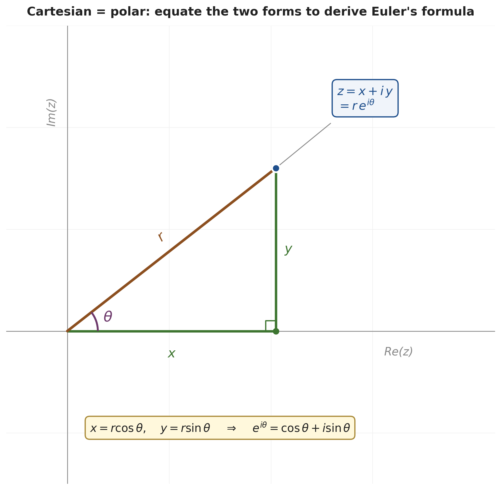
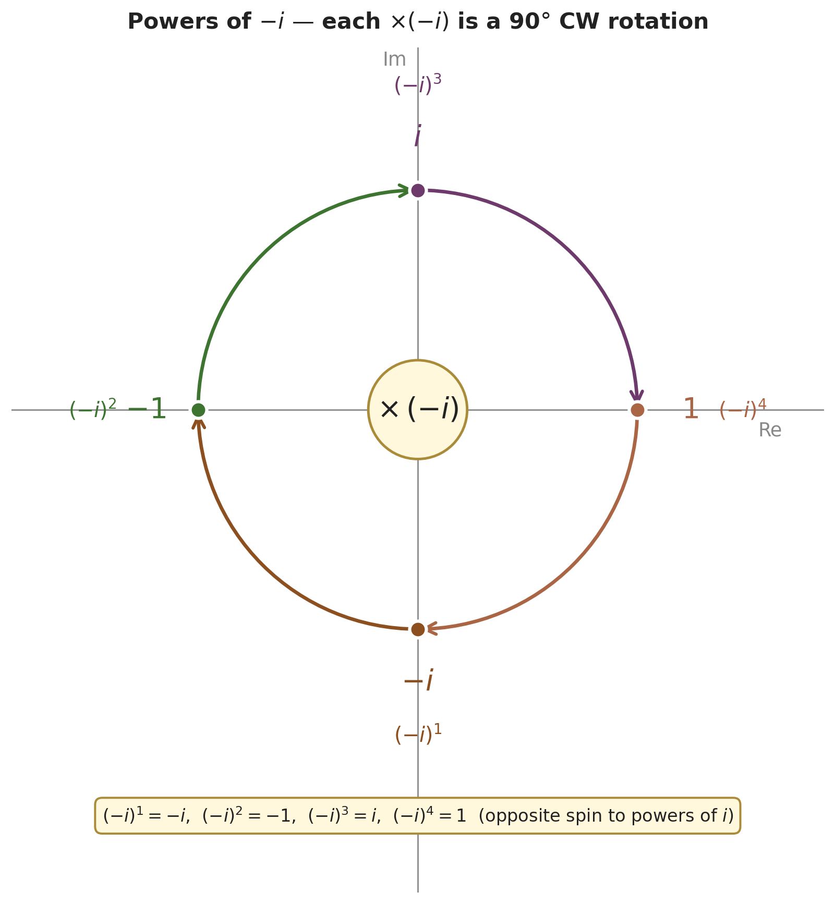
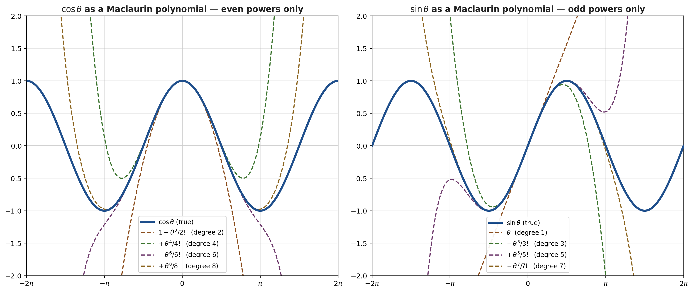
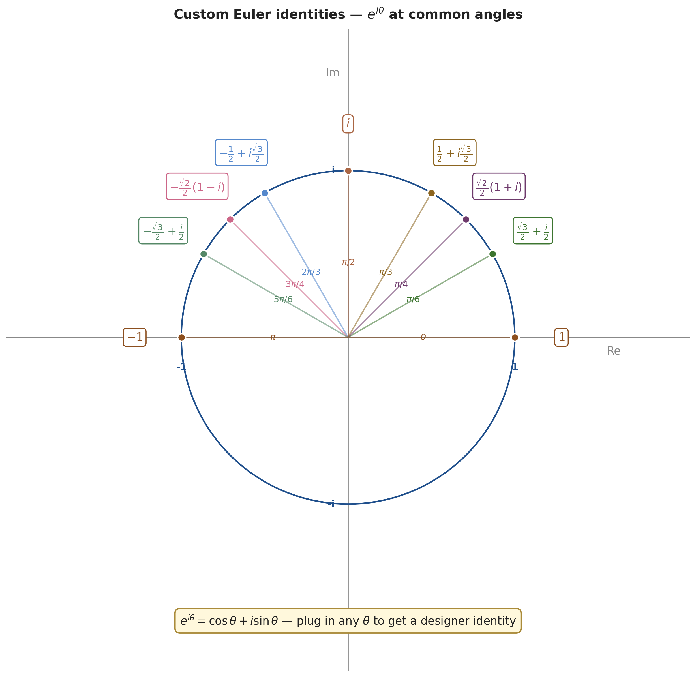

# Consequences of Euler's Formula — Exponential Forms of sin/cos, Maclaurin Series, and Custom Identities

*Companion document to [Euler's Formula via exp(x) (Main)](<Euler's Formula via exp(x) (Main).md>)*

*Path C single-source note — extracted from Numberphile's "Euler's Formula" video (Tom Crawford) via Gemini frame-by-frame analysis with `gemini-3-pro-preview`. Only material **not already covered** in the hub note is included here; the hub already covers $e^x$ as a polynomial, the powers-of-$i$ spiral, and Euler's identity itself.*

| Field | Value |
|---|---|
| **Source** | [Euler's Formula — Numberphile](https://www.youtube.com/watch?v=CRj-sbi2i2I) |
| **Speaker** | Tom Crawford |
| **Length** | 21:24 |
| **New material from this video** | Cartesian↔polar derivation route • exponential forms of sin/cos • Maclaurin series for sin/cos derived via $e^{\pm i\theta}$ • powers-of-$-i$ cycle • generating custom Euler-style identities at any angle |
| **Captured** | 2026-05-26 |

---

## Overview

The hub note derives Euler's formula by building $\exp(x)$ as an infinite polynomial and watching it spiral around the unit circle when fed an imaginary input. This companion adds **what you can do once you have Euler's formula in hand**: re-derive a different (slicker) proof of it, get clean closed-form expressions for $\sin$ and $\cos$ in terms of complex exponentials, derive the Maclaurin series for $\sin$ and $\cos$ as a side effect of the $e^{i\theta}$ expansion, and generate brand-new Euler-style identities by plugging in any angle.

---

## 1. An Alternative Derivation of Euler's Formula — Cartesian = Polar

The hub note proves $e^{i\theta} = \cos\theta + i\sin\theta$ by expanding the polynomial. This video takes a different (and quicker, though less foundational) route: **start with the polar form $z = re^{i\theta}$ as given**, write the same number in Cartesian form, and equate them. The polar form is itself motivated geometrically, but the rest is just trigonometry on a right triangle.

### 1.1 Setup — same complex number, two representations *(at [[3:07]](https://www.youtube.com/watch?v=CRj-sbi2i2I&t=187s))*

A complex number $z$ sitting in the first quadrant of the complex plane can be described two ways:

- **Cartesian:** $z = x + iy$ where $x = \operatorname{Re}(z)$ and $y = \operatorname{Im}(z)$.
- **Polar:** $z = re^{i\theta}$ where $r$ is the distance from the origin and $\theta$ the angle from the positive real axis.

These describe the same point, so they must be equal. The trick is to relate $(x, y)$ to $(r, \theta)$ via the right triangle formed by dropping a perpendicular from $z$ to the real axis.

### 1.2 The right-triangle relations *(at [[3:29]](https://www.youtube.com/watch?v=CRj-sbi2i2I&t=209s))*

In the right triangle with horizontal leg $x$, vertical leg $y$, and hypotenuse $r$:

| Identity | Reason |
|---|---|
| $r = \sqrt{x^2 + y^2}$ | Pythagoras |
| $\cos\theta = x/r$ | SOH-CAH-TOA: adjacent over hypotenuse |
| $\sin\theta = y/r$ | SOH-CAH-TOA: opposite over hypotenuse |
| $x = r\cos\theta$ | rearrange |
| $y = r\sin\theta$ | rearrange |

### 1.3 The slick conclusion *(at [[4:57]](https://www.youtube.com/watch?v=CRj-sbi2i2I&t=297s))*

Set the polar and Cartesian forms equal and substitute:

> [!example] Worked: deriving Euler's formula from Cartesian = polar
> **Problem.** Given $z = x + iy$ (Cartesian) and $z = re^{i\theta}$ (polar) describe the same point, derive Euler's formula.
> **Solution.**
> 1. Equate the two forms: $re^{i\theta} = x + iy$.
> 2. Substitute $x = r\cos\theta$ and $y = r\sin\theta$:
>    $$re^{i\theta} = r\cos\theta + i(r\sin\theta)$$
> 3. Factor $r$ on the right:
>    $$re^{i\theta} = r(\cos\theta + i\sin\theta)$$
> 4. Divide both sides by $r$ (assuming $r \neq 0$):
>    $$\boxed{e^{i\theta} = \cos\theta + i\sin\theta}$$
>
> **Insight.** This is *much* shorter than the polynomial route — but it presupposes that polar form $re^{i\theta}$ already makes sense, which is what the hub note's spiral picture establishes from scratch. The two routes complement each other: polynomial proof builds Euler's formula from $\exp$'s definition; this proof leverages Euler's formula by treating polar form as a primitive.

> "Euler's formula is really the foundations behind Euler's identity. Euler's identity is like the pretty facade of the building that everyone loves, but the heavy lifting is being done by Euler's formula." *(at [[16:49]](https://www.youtube.com/watch?v=CRj-sbi2i2I&t=1009s))*

*Generated by matplotlib via `_gen_efc_fig1_cart_polar.py` — the complex plane with a point $z$ in the first quadrant. Right triangle with legs $x, y$ and hypotenuse $r$ is drawn; the angle $\theta$ at the origin and the two equivalent labels $z = x + iy$ (Cartesian) and $z = re^{i\theta}$ (polar) are both shown.*

---

## 2. Exponential Forms of $\sin$ and $\cos$

A direct payoff of Euler's formula: rearrange it to get closed-form expressions for $\sin\theta$ and $\cos\theta$ in terms of complex exponentials. This is foundational for Fourier analysis, differential equations, and signal processing.

### 2.1 The companion identity: $e^{-i\theta}$ *(at [[6:26]](https://www.youtube.com/watch?v=CRj-sbi2i2I&t=386s))*

Substitute $\theta \to -\theta$ into Euler's formula:

$$e^{-i\theta} = \cos(-\theta) + i\sin(-\theta)$$

Use the **even / odd properties** of cosine and sine *(at [[5:51]](https://www.youtube.com/watch?v=CRj-sbi2i2I&t=351s))*:

- $\cos$ is **even**: $\cos(-\theta) = \cos\theta$ (graph is symmetric across the y-axis)
- $\sin$ is **odd**: $\sin(-\theta) = -\sin\theta$ (graph has rotational symmetry through the origin)

Substituting:

$$\boxed{e^{-i\theta} = \cos\theta - i\sin\theta}$$

We now have a *system of two equations* — $e^{i\theta} = \cos\theta + i\sin\theta$ and $e^{-i\theta} = \cos\theta - i\sin\theta$ — in two unknowns ($\cos\theta$ and $\sin\theta$). Solve.

### 2.2 Closed-form for $\cos\theta$ *(at [[7:34]](https://www.youtube.com/watch?v=CRj-sbi2i2I&t=454s))*

> [!example] Isolating $\cos\theta$ from the two Euler equations
> **Problem.** Solve for $\cos\theta$ in terms of $e^{i\theta}$ and $e^{-i\theta}$.
> **Solution.**
> 1. Add the two equations:
>    $$e^{i\theta} + e^{-i\theta} = (\cos\theta + i\sin\theta) + (\cos\theta - i\sin\theta)$$
> 2. The $i\sin\theta$ terms cancel:
>    $$e^{i\theta} + e^{-i\theta} = 2\cos\theta$$
> 3. Divide by 2:
>    $$\boxed{\cos\theta = \frac{e^{i\theta} + e^{-i\theta}}{2}}$$

### 2.3 Closed-form for $\sin\theta$ *(at [[8:35]](https://www.youtube.com/watch?v=CRj-sbi2i2I&t=515s))*

> [!example] Isolating $\sin\theta$ from the two Euler equations
> **Problem.** Solve for $\sin\theta$ in terms of $e^{i\theta}$ and $e^{-i\theta}$.
> **Solution.**
> 1. Subtract the second equation from the first:
>    $$e^{i\theta} - e^{-i\theta} = (\cos\theta + i\sin\theta) - (\cos\theta - i\sin\theta)$$
> 2. The $\cos\theta$ terms cancel:
>    $$e^{i\theta} - e^{-i\theta} = 2i\sin\theta$$
> 3. Divide by $2i$:
>    $$\boxed{\sin\theta = \frac{e^{i\theta} - e^{-i\theta}}{2i}}$$

> [!definition] Exponential forms of sin and cos
> $$\cos\theta = \frac{e^{i\theta} + e^{-i\theta}}{2} \qquad \sin\theta = \frac{e^{i\theta} - e^{-i\theta}}{2i}$$
> The cosine is the **real average** of $e^{i\theta}$ and $e^{-i\theta}$; the sine is the **imaginary half-difference**.

These identities are why complex exponentials are the natural language for oscillations: anything you can do with $\sin$ and $\cos$ (differentiate, integrate, multiply, convolve), you can do more cleanly with $e^{\pm i\theta}$.

---

## 3. Maclaurin Series for $\sin$ and $\cos$ via Euler's Formula

The hub note shows the Maclaurin series for $e^x = 1 + x + x^2/2! + \cdots$ but leaves the corresponding series for $\sin\theta$ and $\sin\theta$ as a footnote. This video derives them directly by leveraging the exponential forms from §2.

### 3.1 Powers of $\pm i$ — both cycles needed *(at [[10:24]](https://www.youtube.com/watch?v=CRj-sbi2i2I&t=624s))*

For $i$ (already in the hub):
$$i^0 = 1,\quad i^1 = i,\quad i^2 = -1,\quad i^3 = -i,\quad i^4 = 1,\;\ldots$$

For $-i$ (new — needed for the $e^{-i\theta}$ expansion below):

$$(-i)^0 = 1,\quad (-i)^1 = -i,\quad (-i)^2 = -1,\quad (-i)^3 = i,\quad (-i)^4 = 1,\;\ldots$$

Same cycle, but rotated 180° — $-i$ traverses the unit circle clockwise instead of counterclockwise.

*Generated by matplotlib via `_gen_efc_fig2_minus_i_cycle.py` — $-i, -1, i, 1$ cycle, with curved arrows showing the clockwise rotation (counterpart to the CCW $i$-cycle in the hub note's `efm_fig2`).*

### 3.2 The series for $e^{i\theta}$ and $e^{-i\theta}$ *(at [[11:21]](https://www.youtube.com/watch?v=CRj-sbi2i2I&t=681s))*

Substitute $x = i\theta$ into $e^x = 1 + x + x^2/2! + \cdots$ and evaluate the powers of $i$:

$$e^{i\theta} = 1 + i\theta + \frac{(i\theta)^2}{2!} + \frac{(i\theta)^3}{3!} + \frac{(i\theta)^4}{4!} + \cdots$$

$$= 1 + i\theta - \frac{\theta^2}{2!} - \frac{i\theta^3}{3!} + \frac{\theta^4}{4!} + \frac{i\theta^5}{5!} - \cdots$$

(Signs alternate as $i^n$ cycles through $1, i, -1, -i$.)

Substitute $x = -i\theta$ and use the $(-i)^n$ cycle:

$$e^{-i\theta} = 1 - i\theta - \frac{\theta^2}{2!} + \frac{i\theta^3}{3!} + \frac{\theta^4}{4!} - \frac{i\theta^5}{5!} - \cdots$$

The two series are identical on the **even-power terms** and **opposite-signed on the odd-power terms** — exactly what we need for the additions/subtractions in §2 to isolate them.

### 3.3 Maclaurin series for $\cos\theta$ *(at [[13:30]](https://www.youtube.com/watch?v=CRj-sbi2i2I&t=810s))*

Apply $\cos\theta = (e^{i\theta} + e^{-i\theta})/2$ term by term:

| Power of $\theta$ | $e^{i\theta}$ coefficient | $e^{-i\theta}$ coefficient | Sum / 2 |
|---|---|---|---|
| $\theta^0$ | $1$ | $1$ | $1$ |
| $\theta^1$ | $i$ | $-i$ | $0$ |
| $\theta^2$ | $-1/2!$ | $-1/2!$ | $-\theta^2/2!$ |
| $\theta^3$ | $-i/3!$ | $+i/3!$ | $0$ |
| $\theta^4$ | $1/4!$ | $1/4!$ | $\theta^4/4!$ |
| $\theta^5$ | $i/5!$ | $-i/5!$ | $0$ |
| $\theta^6$ | $-1/6!$ | $-1/6!$ | $-\theta^6/6!$ |

Every odd-power term **vanishes**; even-power terms survive with alternating signs:

$$\boxed{\cos\theta = 1 - \frac{\theta^2}{2!} + \frac{\theta^4}{4!} - \frac{\theta^6}{6!} + \frac{\theta^8}{8!} - \cdots = \sum_{n=0}^{\infty} \frac{(-1)^n \theta^{2n}}{(2n)!}}$$

> "The cos term has all of the even powers of theta." *(at [[14:13]](https://www.youtube.com/watch?v=CRj-sbi2i2I&t=853s))*

### 3.4 Maclaurin series for $\sin\theta$ *(at [[14:39]](https://www.youtube.com/watch?v=CRj-sbi2i2I&t=879s))*

Apply $\sin\theta = (e^{i\theta} - e^{-i\theta})/(2i)$ term by term:

| Power of $\theta$ | $e^{i\theta}$ coefficient | $e^{-i\theta}$ coefficient | Diff / $2i$ |
|---|---|---|---|
| $\theta^0$ | $1$ | $1$ | $0$ |
| $\theta^1$ | $i$ | $-i$ | $\theta$ |
| $\theta^2$ | $-1/2!$ | $-1/2!$ | $0$ |
| $\theta^3$ | $-i/3!$ | $+i/3!$ | $-\theta^3/3!$ |
| $\theta^4$ | $1/4!$ | $1/4!$ | $0$ |
| $\theta^5$ | $i/5!$ | $-i/5!$ | $\theta^5/5!$ |

Now the **even-power terms vanish**; odd-power terms survive:

$$\boxed{\sin\theta = \theta - \frac{\theta^3}{3!} + \frac{\theta^5}{5!} - \frac{\theta^7}{7!} + \cdots = \sum_{n=0}^{\infty} \frac{(-1)^n \theta^{2n+1}}{(2n+1)!}}$$

> "We get all the odd powers for our sine series." *(at [[15:10]](https://www.youtube.com/watch?v=CRj-sbi2i2I&t=910s))*

*Generated by matplotlib via `_gen_efc_fig3_maclaurin.py` — partial sums of the $\cos\theta$ and $\sin\theta$ Maclaurin series (degree 2, 4, 6, 8 for cos; 1, 3, 5, 7 for sin) plotted against the true curves to show convergence.*

> [!tip] The even/odd connection
> The reason $\cos$ ends up with only even powers and $\sin$ ends up with only odd powers comes straight from their symmetry: $\cos(-\theta) = \cos\theta$ (even function $\Leftrightarrow$ even-only series) and $\sin(-\theta) = -\sin\theta$ (odd function $\Leftrightarrow$ odd-only series). The complex-exponential derivation *manifests* this symmetry rather than imposing it.

---

## 4. Custom Identities — Plug in Any Angle

Euler's identity $e^{i\pi} = -1$ is famous because it threads $e$, $i$, $\pi$, $1$, and $0$ together. But it's just *one instance* of Euler's formula. You can generate similarly elegant identities by substituting any other angle.

### 4.1 $\theta = \pi/2$: $e^{i\pi/2} = i$ *(at [[18:03]](https://www.youtube.com/watch?v=CRj-sbi2i2I&t=1083s))*

$$e^{i\pi/2} = \cos(\pi/2) + i\sin(\pi/2) = 0 + i(1) = \boxed{i}$$

A clean expression: raising $e$ to $i\pi/2$ gives you $i$ itself.

### 4.2 $\theta = \pi/4$: a closed form for $\sqrt{i}$ *(at [[18:25]](https://www.youtube.com/watch?v=CRj-sbi2i2I&t=1105s))*

$$e^{i\pi/4} = \cos(\pi/4) + i\sin(\pi/4) = \frac{\sqrt{2}}{2} + i\frac{\sqrt{2}}{2}$$

Since $\pi/4 = (\pi/2)/2$, we also have $e^{i\pi/4} = (e^{i\pi/2})^{1/2} = i^{1/2} = \sqrt{i}$. Equating:

$$\boxed{\sqrt{i} = \frac{\sqrt{2}}{2}(1 + i)}$$

This gives a clean, exact answer to a question that looks intimidating at first — *what is the square root of an imaginary number?*

### 4.3 $\theta = \pi/3$: $e^{i\pi/3}$ *(at [[19:02]](https://www.youtube.com/watch?v=CRj-sbi2i2I&t=1142s))*

$$e^{i\pi/3} = \cos(60°) + i\sin(60°) = \boxed{\frac{1}{2} + i\frac{\sqrt{3}}{2}}$$

### 4.4 $\theta = \pi/6$: $e^{i\pi/6}$ *(at [[19:22]](https://www.youtube.com/watch?v=CRj-sbi2i2I&t=1162s))*

$$e^{i\pi/6} = \cos(30°) + i\sin(30°) = \boxed{\frac{\sqrt{3}}{2} + \frac{i}{2}}$$

### 4.5 The general principle

For any angle $\theta$, the value $e^{i\theta}$ is the point on the unit circle at that angle — so any famous (or named) angle gives a "designer identity":

*Generated by matplotlib via `_gen_efc_fig4_custom_identities.py` — the unit circle with labeled points at $\theta = 0, \pi/6, \pi/4, \pi/3, \pi/2, \pi$, each annotated with the exact closed form of $e^{i\theta}$.*

> "You can plug in any value of theta and create your own identity." *(at [[17:54]](https://www.youtube.com/watch?v=CRj-sbi2i2I&t=1074s))*

---

## Key Insights (companion-only)

- **Two routes to Euler's formula exist** — the hub note builds it from the $\exp$ polynomial (rigorous, foundational); this note re-derives it by *assuming* polar form and equating with Cartesian (quick, leveraged). Knowing both gives you redundancy.
- **$\cos$ and $\sin$ are linear combinations of $e^{\pm i\theta}$** — this is the foundational identity for Fourier analysis, signal processing, AC circuit theory, and quantum mechanics. Everything that "lives" on the real line as oscillating $\sin/\cos$ has a cleaner complex-exponential representation.
- **The Maclaurin series for $\cos$ and $\sin$ "fall out for free"** once you have the exponential forms and the $e^x$ series. The even/odd parity of the resulting series is a direct manifestation of the even/odd symmetry of $\cos$ and $\sin$.
- **Powers of $-i$ go clockwise** while powers of $i$ go counterclockwise on the unit circle — same cycle, opposite direction. This is what makes the $\cos$ and $\sin$ series clean (some terms cancel, some double).
- **Euler's identity has infinite siblings.** $e^{i\pi/2} = i$, $\sqrt{i} = (\sqrt{2}/2)(1+i)$, $e^{i\pi/3} = 1/2 + i\sqrt{3}/2$, etc. The famous $e^{i\pi} = -1$ is just one elegant instance; others are equally clean.

---

## Related Documents

- **[Euler's Formula via exp(x) (Main)](<Euler's Formula via exp(x) (Main).md>)** — Hub note. Builds Euler's formula from the polynomial definition of $\exp(x)$ and shows the spiral picture. This companion picks up *after* Euler's formula is established.
- **[Complex Number Fundamentals (Main)](<Complex Number Fundamentals (Main).md>)** — Defines the complex plane, Cartesian and polar forms, and the rotation-by-$z$ interpretation of complex multiplication.
