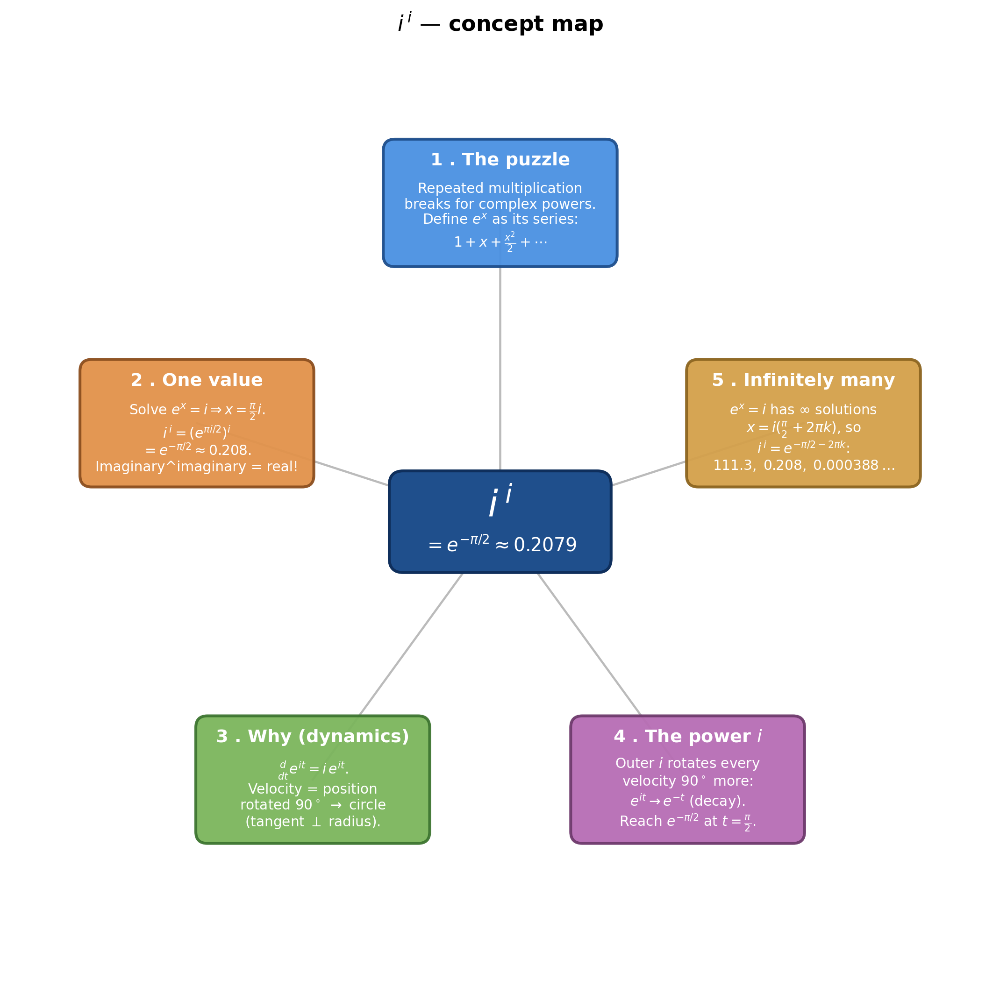
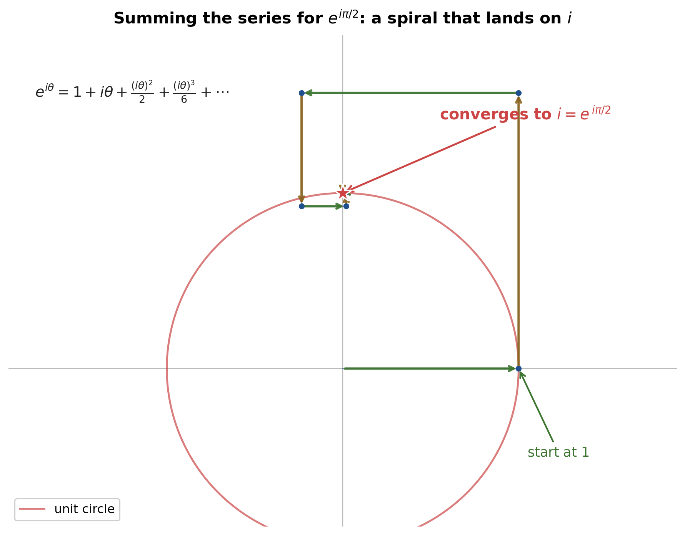
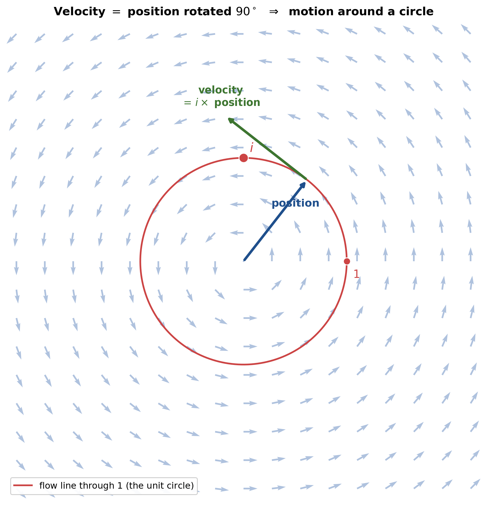
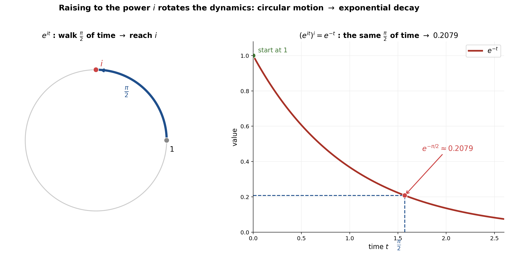
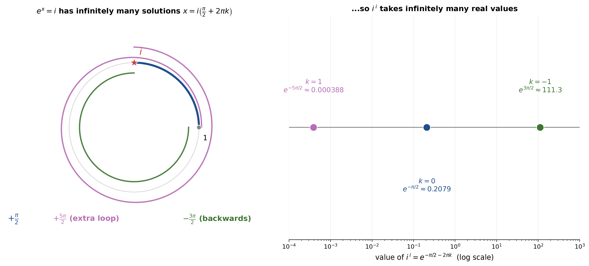
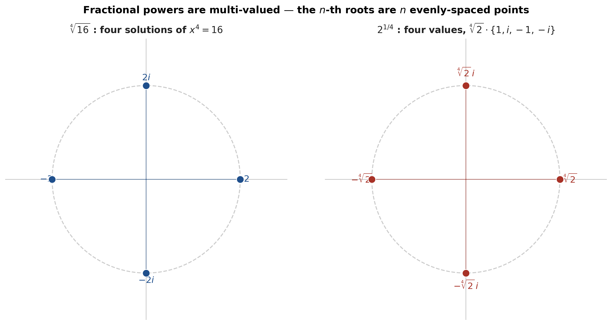
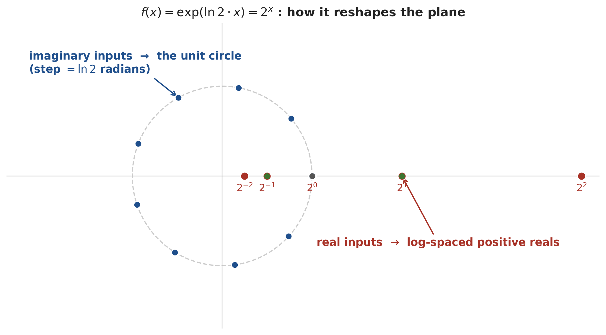
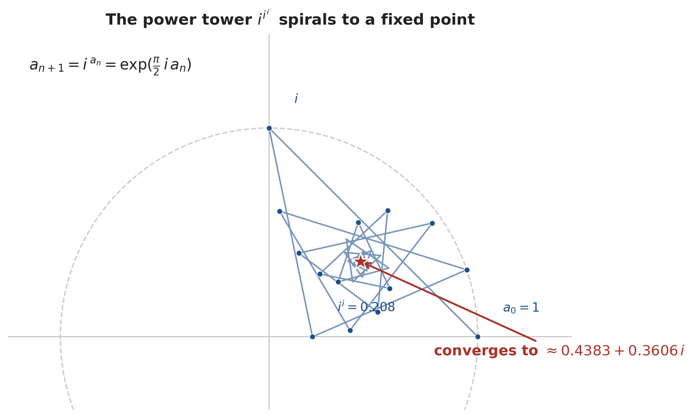
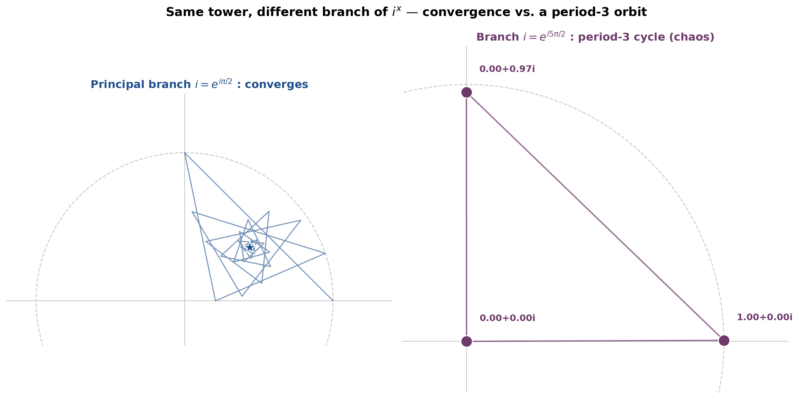

# i to the power i

_Path C note compiled 2026-06-20 — distilled from 3Blue1Brown's **"Intuition for i to the power i"** ([Lockdown Math, Ep. 9](https://www.youtube.com/watch?v=pq9LcwC7CoY), 1:13:38) by Grant Sanderson. Covers the full lecture: §1–5 build to $i^{\,i}=e^{-\pi/2}$, and §6–9 extend it to roots, the true meaning of exponentials, and complex power towers. Every timestamp is a clickable deep-link into the video._

> [!abstract] The one-line answer
> $i^{\,i}$ — an imaginary number raised to an imaginary power — is a **real number**, $e^{-\pi/2}\approx 0.2079$. And once you look closely, it is in fact **infinitely many** real numbers: $e^{-\pi/2-2\pi k}$ for every integer $k$.

---

## 1. The Puzzle: What Could $i^i$ Even Mean?

### 1.1 Repeated multiplication breaks down *(at [[00:43]](https://www.youtube.com/watch?v=pq9LcwC7CoY&t=43s))*

We first learn powers as **repeated multiplication**: $i^4 = i\cdot i\cdot i\cdot i$. That picture is fine for whole-number exponents, but it tells you *nothing* about $i^{\,i}$ — you cannot multiply $i$ "by itself, $i$ times."

> [!quote] Grant Sanderson *(at [[00:43]](https://www.youtube.com/watch?v=pq9LcwC7CoY&t=43s))*
> "As soon as $x$ becomes a complex number, we should realize that it's really nothing like the above."

So we need a definition of exponentiation that survives the jump to complex numbers.

### 1.2 The real definition of $e^x$: an infinite series *(at [[01:54]](https://www.youtube.com/watch?v=pq9LcwC7CoY&t=114s))*

> [!definition] The exponential function
> The "healthiest" way to think of $e^x$ is **not** as a number $e$ multiplied repeatedly, but as the polynomial
>
> $$
> e^{x} \;=\; \sum_{k=0}^{\infty}\frac{x^{k}}{k!}\;=\;1 + x + \frac{x^{2}}{2} + \frac{x^{3}}{6} + \frac{x^{4}}{24} + \cdots
> $$
>
> This series accepts *any* input — real, complex, even a matrix — which is exactly what we need.

> [!quote] *(at [[01:57]](https://www.youtube.com/watch?v=pq9LcwC7CoY&t=117s))*
> "$e^x$ is a shorthand for this polynomial… it's sort of the main exponential function. All other exponential functions derive from this."

### 1.3 Feeding an imaginary input to the series — the spiral *(at [[02:32]](https://www.youtube.com/watch?v=pq9LcwC7CoY&t=152s))*

Plug $i\theta$ into the series. Each factor of $i$ is a **90° rotation**, so successive terms point up, left, down, right… The terms, added tip-to-tail, form a rectangular spiral that **converges to a single point on the unit circle**.

*Generated by matplotlib via `_gen_ii_fig1_spiral.py` — the partial sums of $e^{i\theta}$ at $\theta=\pi/2$ spiral inward to the point $i$.*

### 1.4 The circular trap: "$x=\ln i$" gets us nowhere *(at [[03:38]](https://www.youtube.com/watch?v=pq9LcwC7CoY&t=218s))*

To compute $i^{\,i}$, the plan is to rewrite the base as $i = e^{x}$ and solve $e^{x}=i$. The most popular audience answer was $x=\ln i$ — *technically* correct, since $\ln$ is by definition the inverse of $\exp$. But it is **useless**: substituting it back gives

$$
i^{\,i} = \left(e^{\ln i}\right)^{i} = i^{\,i},
$$

a perfect circle that computes nothing. We need an *actual* value of $x$.

---

## 2. Computing One Value: $i^i = e^{-\pi/2}$

### 2.1 Solving $e^x = i$ with Euler's formula *(at [[04:31]](https://www.youtube.com/watch?v=pq9LcwC7CoY&t=271s))*

Euler's formula reads $e^{i\theta}$ geometrically: **start at $1$ and walk an angle $\theta$ (in radians) around the unit circle.** The number $i$ sits at the top of the circle — a quarter turn, i.e. $\theta = \tfrac{\pi}{2}$. Therefore

$$
e^{\,i\pi/2} = i .
$$

### 2.2 The substitution and the exponent rule *(at [[06:22]](https://www.youtube.com/watch?v=pq9LcwC7CoY&t=382s))*

> [!example] Worked example — evaluate $i^{\,i}$ *(at [[06:31]](https://www.youtube.com/watch?v=pq9LcwC7CoY&t=391s))*
> **Problem.** Find a real value for $i^{\,i}$.
> **Setup.** Write the base $i$ as $e^{i\pi/2}$ (from §2.1).
> **Solution.** Substitute, then use the power-of-a-power rule (multiply exponents) and $i^{2}=-1$:
>
> $$
> i^{\,i} \;=\; \left(e^{\,i\pi/2}\right)^{i} \;=\; e^{\,i\cdot i\,\pi/2} \;=\; e^{\,i^{2}\pi/2} \;=\; e^{-\pi/2}.
> $$
>
> **Answer.** $\;i^{\,i} = e^{-\pi/2} \approx 0.2079.$ ✓
> **Insight.** An imaginary number to an imaginary power is a plain real number — the two imaginary "rotations" cancel into a real exponent.

> [!quote] *(at [[06:56]](https://www.youtube.com/watch?v=pq9LcwC7CoY&t=416s))*
> "Which is weird — that you take an imaginary number and raise it to an imaginary power, and that gets you a real number."

---

## 3. The Intuition: Why Does Euler's Formula Work? (Dynamics)

The algebra above is correct but unsatisfying. The video's real payoff is a **physics picture** of $e^{it}$.

### 3.1 Position and velocity: $\frac{d}{dt}e^{it} = i\,e^{it}$ *(at [[09:50]](https://www.youtube.com/watch?v=pq9LcwC7CoY&t=590s))*

Think of $e^{it}$ as a moving **position** in the plane, with time $t$. Since $e^{x}$ is its own derivative, the chain rule gives the **velocity**:

$$
\frac{d}{dt}\,e^{it} \;=\; i\,e^{it},\qquad\text{with start } e^{0}=1 .
$$

### 3.2 Velocity is the position rotated 90° → circular motion *(at [[10:12]](https://www.youtube.com/watch?v=pq9LcwC7CoY&t=612s))*

Multiplying by $i$ *is* a 90° counter-clockwise rotation. So the rule says: **your velocity is always your position vector, turned 90°.** Across the whole plane this is a counter-clockwise whirlpool.

*Generated by matplotlib via `_gen_ii_fig2_field.py` — the field $z\mapsto i z$; the flow line through $1$ is the unit circle.*

> [!tip] Why this forces a circle *(at [[13:48]](https://www.youtube.com/watch?v=pq9LcwC7CoY&t=828s))*
> If your velocity is always perpendicular to your position vector (and the same length), you can only be moving **around a circle** — because the tangent to a circle is always perpendicular to its radius. Starting at $1$ with unit speed, after $\theta$ units of time you are at angle $\theta$. *That* is Euler's formula.

### 3.3 The walking quiz *(at [[11:26]](https://www.youtube.com/watch?v=pq9LcwC7CoY&t=686s))*

> [!example] Quiz — where are you after $\tfrac{\pi}{2}$ of time? *(at [[11:26]](https://www.youtube.com/watch?v=pq9LcwC7CoY&t=686s))*
> **Problem.** You start at $(1,0)$. At every instant your velocity is the 90° counter-clockwise rotation of the vector from the origin to your current position. Where are you after $\tfrac{\pi}{2}$ units of time? Options: $(0,1),\ (-1,0),\ (0,-1),\ (1,1)$.
> **Solution.** The rule traces the unit circle at unit speed; $\tfrac{\pi}{2}$ of time is a quarter-circle from $(1,0)$.
> **Answer.** $(0,1)$ — i.e. the point $i$. ✓
> **Insight.** This is exactly $e^{i\pi/2}=i$, now *felt* as "walk a quarter of the way around the lake."

### 3.4 Reading $i$ as "where you are after $\tfrac{\pi}{2}$ of time" *(at [[14:48]](https://www.youtube.com/watch?v=pq9LcwC7CoY&t=888s))*

> [!quote] *(at [[14:48]](https://www.youtube.com/watch?v=pq9LcwC7CoY&t=888s))*
> "$i$, as a point on the plane, is where you get after travelling for $\pi/2$ units of time according to the dynamics of this expression."

This re-reading of $i$ — not as a static number but as the *endpoint of a journey* — is the key that unlocks the next section.

---

## 4. The Dynamic Meaning of Raising to the Power $i$

### 4.1 The three roles of $i$ in $i^i$ *(at [[15:08]](https://www.youtube.com/watch?v=pq9LcwC7CoY&t=908s))*

In the single expression $i^{\,i}$ the symbol $i$ plays **three different roles**:

| Where | Role |
|---|---|
| the **base** $i$ | the position reached after walking $\tfrac{\pi}{2}$ around the circle |
| the $i$ inside $e^{it}$ | the 90° rotation that turns position into velocity |
| the **outer exponent** $i$ | a new action that *changes the dynamics* (next) |

### 4.2 Raising to $i$ turns rotation into decay: $e^{it} \to e^{-t}$ *(at [[15:30]](https://www.youtube.com/watch?v=pq9LcwC7CoY&t=930s))*

Apply the outer exponent to the parametrisation. Multiplying the exponent by $i$ rotates **every** velocity vector another 90° — so the arrows that used to point *around* the circle now point *inward*, toward the origin:

$$
\left(e^{it}\right)^{i} \;=\; e^{\,i^{2}t} \;=\; e^{-t}.
$$

Circular motion becomes **exponential decay** along the real line. The same $\tfrac{\pi}{2}$ of "time" now lands you at $e^{-\pi/2}$.

*Generated by matplotlib via `_gen_ii_fig3_decay.py` — left: walk $\tfrac{\pi}{2}$ around the circle to reach $i$; right: under $e^{-t}$ the same $\tfrac{\pi}{2}$ of time reaches $0.2079$.*

> [!tip] Interactive — watch it happen
> 👉 **[Open: From Rotation to Decay — Interactive](ii_rotation_to_decay_interactive.html)**
> Drag the time slider (or hit **Jump to t = π/2**) and watch the blue dot rotate up to $i$ while the red dot decays straight back to $i^{\,i}=e^{-\pi/2}\approx 0.2079$. The two pictures move in lockstep: the same $\tfrac{\pi}{2}$ of "time" that lifts $e^{it}$ to $i$ collapses $e^{-t}$ onto the real value $i^{\,i}$.

### 4.3 So $i^i$ is "decay for $\tfrac{\pi}{2}$ of time" *(at [[18:15]](https://www.youtube.com/watch?v=pq9LcwC7CoY&t=1095s))*

Putting the roles together: the base $i$ says *travel for $\tfrac{\pi}{2}$ units of time*; the outer $i$ says *do it under decay dynamics instead of rotation*. The endpoint of that decay is $e^{-\pi/2}\approx 0.2079$ — the very same answer the algebra gave, now with a reason.

> [!quote] *(at [[18:27]](https://www.youtube.com/watch?v=pq9LcwC7CoY&t=1107s))*
> "The effect of raising to the $i$ changes our dynamics in such a way that instead of walking around a circle, we're doing this kind of exponential decay."

---

## 5. Infinitely Many Values & What Exponentiation Really Means

### 5.1 What exponentiation actually is: $f(a+b)=f(a)\,f(b)$ *(at [[21:56]](https://www.youtube.com/watch?v=pq9LcwC7CoY&t=1316s))*

A viewer suggested $i^{\,i}$ means "multiply by $i$, $i$ times." Grant's answer: honestly, **no** — that is simply not what exponentiation means once we leave the counting numbers.

> [!definition] The defining property of an exponential
> An exponential function is one that converts **adding inputs** into **multiplying outputs**:
>
> $$
> f(a+b) = f(a)\cdot f(b),\qquad f(1)=i .
> $$
>
> This property — not "repeated multiplication" — is what carries over to complex numbers and even matrices.

> [!quote] *(at [[22:01]](https://www.youtube.com/watch?v=pq9LcwC7CoY&t=1321s))*
> "That to me is kind of what exponentiation is, more so than trying to stretch the idea of repeated multiplication."

### 5.2 Other solutions to $e^x=i$: winding around again *(at [[19:28]](https://www.youtube.com/watch?v=pq9LcwC7CoY&t=1168s))*

Here is the catch. Walking to the top of the circle takes $\tfrac{\pi}{2}$ of time — but you could also loop a full lap further ($\tfrac{\pi}{2}+2\pi=\tfrac{5\pi}{2}$), or walk backwards ($-\tfrac{3\pi}{2}$). All of them land on $i$. So $e^{x}=i$ has **infinitely many** solutions:

$$
x = i\left(\tfrac{\pi}{2} + 2\pi k\right),\qquad k\in\mathbb{Z}.
$$

*Generated by matplotlib via `_gen_ii_fig4_values.py` — every winding angle that reaches $i$ gives another real value $e^{-\pi/2-2\pi k}$.*

### 5.3 The infinite ladder of values *(at [[24:13]](https://www.youtube.com/watch?v=pq9LcwC7CoY&t=1453s))*

Feeding each solution through $i^{\,i}=e^{xi}$ gives a different real number:

> [!example] Worked examples — the other values *(at [[24:23]](https://www.youtube.com/watch?v=pq9LcwC7CoY&t=1463s))*
> **Using $x=\tfrac{5\pi}{2}i$ (one extra loop, $k=1$):**
>
> $$
> i^{\,i} = \left(e^{\,5\pi i/2}\right)^{i} = e^{-5\pi/2} \approx 0.000388 .
> $$
>
> **Using $x=-\tfrac{3\pi}{2}i$ (walk backwards, $k=-1$):**
>
> $$
> i^{\,i} = \left(e^{-3\pi i/2}\right)^{i} = e^{\,3\pi/2} \approx 111.3 .
> $$
>
> **General form.** $\;i^{\,i} = e^{-\pi/2 - 2\pi k}\;$ for every integer $k$. **Answer:** infinitely many real values. ✓
> **Insight (the decay picture).** A bigger winding angle ($\tfrac{5\pi}{2}$) means decaying for *longer* → a much smaller number; a *negative* angle means running decay *backwards in time* → "what large number decays down to 1?" → $\approx 111.3$.

### 5.4 The deeper lesson: $i^i$ is not a single number *(at [[28:10]](https://www.youtube.com/watch?v=pq9LcwC7CoY&t=1690s))*

> [!quote] *(at [[27:46]](https://www.youtube.com/watch?v=pq9LcwC7CoY&t=1666s))*
> "There's actually infinitely many different values that we could plug in for $x$ if we're thinking of $e^{x}$ as being $i$."

$i^{\,i}$ *looks* like it should be one definite computation, yet it represents a whole family of values, one per choice of branch $k$. (The "principal" choice $k=0$ gives the familiar $e^{-\pi/2}$.) From here the lecture pivots to $\sqrt{\;}$ — another innocent-looking symbol hiding the *same* multi-valued subtlety, the thread §6 picks up.

---

## 6. Roots and Powers Are Multi-Valued Too *(at [[28:39]](https://www.youtube.com/watch?v=pq9LcwC7CoY&t=1719s))*

The multi-valuedness of $i^{\,i}$ is not exotic — it is the *same* phenomenon hiding inside the ordinary square-root symbol.

### 6.1 Every root already has several values

> [!example] Roots are multi-valued
> **$\sqrt{25}$** answers "what solves $x^2=25$?" — and that is **$5$ *or* $-5$**.
> **$\sqrt[4]{16}$** answers $x^4=16$ — four solutions: **$2,\ 2i,\ -2,\ -2i$**.
> **$\sqrt{i}$** halves the angle of $i$: a $90^\circ$ rotation halves to $45^\circ$, giving $\tfrac{\sqrt2}{2}+\tfrac{\sqrt2}{2}i$; but $i$ is *also* a $-270^\circ$ rotation, which halves to $-135^\circ$, giving $-\tfrac{\sqrt2}{2}-\tfrac{\sqrt2}{2}i$. So $\sqrt{i}=\pm\tfrac{\sqrt2}{2}(1+i)=\pm e^{\,i\pi/4}$.

> [!tip] Why halving the angle works *(at [[30:39]](https://www.youtube.com/watch?v=pq9LcwC7CoY&t=1839s))*
> A square root undoes squaring, and squaring **doubles** a complex number's angle. So a square root **halves** it — but an angle has many names ($90^\circ = -270^\circ = 450^\circ\dots$), and halving each name lands on a *different* point. That is exactly where the extra roots come from.

### 6.2 Branches: choosing one value to be "the" answer *(at [[29:59]](https://www.youtube.com/watch?v=pq9LcwC7CoY&t=1799s))*

To treat a multi-valued operation as an ordinary function (one input, one output), mathematicians **adopt a convention** — they pick one of the values. That choice is called selecting a **branch**.

> [!quote] *(at [[30:14]](https://www.youtube.com/watch?v=pq9LcwC7CoY&t=1814s))*
> "There's no notion of which complex numbers are like the positive complex numbers when we want to take square roots."
>
> For real numbers we conventionally take the *positive* root, but in the complex plane there is no "positive" direction to prefer — so the choice of branch is genuinely arbitrary.

### 6.3 Fractional powers, the complex way *(at [[32:01]](https://www.youtube.com/watch?v=pq9LcwC7CoY&t=1921s))*

Evaluate a fractional power by routing the base through $e$: write $b = e^{\ln b}$, then use the *other* legal names $e^{\ln b + 2\pi i k}$.

> [!example] $2^{1/2}$ — both square roots fall out
> **Principal:** $2^{1/2}=(e^{\ln 2})^{1/2}=e^{\ln 2/2}\approx 1.414=\sqrt2$.
> **Other branch:** $2^{1/2}=(e^{\ln 2+2\pi i})^{1/2}=e^{\ln 2/2+\pi i}=\sqrt2\cdot e^{\pi i}=-\sqrt2$.

> [!example] $2^{1/4}$ — four values *(at [[38:03]](https://www.youtube.com/watch?v=pq9LcwC7CoY&t=2283s))*
> Using $2=e^{\ln2+2\pi i k}$ and distributing the $\tfrac14$:
> $$2^{1/4}=e^{\ln2/4}\cdot e^{\,k\pi i/2}=\sqrt[4]{2}\cdot\{\,1,\ i,\ -1,\ -i\,\}.$$
> e.g. $k=2$ gives $\sqrt[4]{2}\cdot e^{\pi i}=-\sqrt[4]{2}$; $k=1$ gives $\sqrt[4]{2}\cdot e^{\pi i/2}=\sqrt[4]{2}\,i$.

*Generated by matplotlib via `_gen_ii_fig6_roots.py` — taking an $n$-th root produces $n$ values, equally spaced by $2\pi/n$ around a circle.*

### 6.4 The same phenomenon as $i^i$ *(at [[39:55]](https://www.youtube.com/watch?v=pq9LcwC7CoY&t=2395s))*

> [!quote] Grant Sanderson *(at [[32:01]](https://www.youtube.com/watch?v=pq9LcwC7CoY&t=1921s))*
> "This phenomenon here where we're taking roots is actually the same as the phenomenon we were just looking at when we were talking about multiple values for $i$ raised to the power of $i$."

Both come from one fact: a base $b$ has **infinitely many names** $e^{\ln b + 2\pi i k}$, because $e^{2\pi i}=1$. Asking for $x^4=2$ (four roots) and asking for $i^{\,i}$ (infinitely many values) are the same question wearing different clothes.

---

## 7. What Is an Exponential, Really? *(at [[40:20]](https://www.youtube.com/watch?v=pq9LcwC7CoY&t=2420s))*

### 7.1 Write $\exp(r\,x)$, not $b^x$ *(at [[40:40]](https://www.youtube.com/watch?v=pq9LcwC7CoY&t=2440s))*

The cleanest object is the **series** $\exp(x)=\sum_{k\ge0}x^k/k!$. Any exponential $b^x$ can be rewritten $\exp(r\,x)$ with $r=\ln b$ (so that $\exp(r)=b$). In the **real** world this is a perfect one-to-one match: each positive base $b$ gives exactly one $r=\ln b$.

### 7.2 In the complex world, $b^x$ is "overloaded" *(at [[43:09]](https://www.youtube.com/watch?v=pq9LcwC7CoY&t=2589s))*

> [!definition] The overloading of $b^x$
> Because shifting $r$ by any multiple of $2\pi i$ leaves $\exp(r)$ unchanged ($\exp(r+2\pi i k)=\exp(r)$ since $e^{2\pi i}=1$), an **infinite family of distinct functions**
> $$\dots,\ \exp((r-2\pi i)x),\ \ \exp(r\,x),\ \ \exp((r+2\pi i)x),\ \dots$$
> all map to the *same* symbol $b^x$ — yet they disagree at fractional and complex inputs. The notation $b^x$ is therefore **ambiguous** in the complex plane; $\exp(r\,x)$ is not.

> [!quote] *(at [[1:13:26]](https://www.youtube.com/watch?v=pq9LcwC7CoY&t=4406s))*
> "It's not just more natural to represent them as $e^{rx}$. Once you get to complex numbers, you kind of *have* to represent them that way."

### 7.3 What actually pins down an exponential *(at [[45:53]](https://www.youtube.com/watch?v=pq9LcwC7CoY&t=2753s))*

Forget "repeated multiplication." We *define* $2^x$ as the function $f$ that turns sums into products:

> [!definition] The functional equation
> $$f(a+b)=f(a)\,f(b),\qquad f(1)=2.$$
> Everything else is forced. Setting $b=0$: $f(1)=f(1)f(0)\Rightarrow f(0)=1$. Repeated use: $f(5)=f(1)^5=2^5$. And $f(-5)f(5)=f(0)=1\Rightarrow f(-5)=2^{-5}$. The two rules together *make you want to write* $f(x)=2^x$.

> [!example] Quiz — what must be true? *(at [[46:21]](https://www.youtube.com/watch?v=pq9LcwC7CoY&t=2781s))*
> **Problem.** If $f(a+b)=f(a)f(b)$ for all $a,b$ and $f(1)=2$, which holds: (a) $f(5)=2^5$, (b) $f(-5)=2^{-5}$, (c) both, (d) none?
> **Answer.** **(c) Both** — by the derivation above. *(Caveat Grant flags from a past lecture: you also need $f$ to be **nonzero somewhere**, otherwise the constant function $f\equiv0$ sneaks in.)*

### 7.4 The characterization theorem *(at [[52:13]](https://www.youtube.com/watch?v=pq9LcwC7CoY&t=3133s))*

> [!definition] Theorem — exponentials, characterized
> If a complex function $f$ is **differentiable**, is **nonzero for some $x$**, and satisfies $f(a+b)=f(a)f(b)$ for all $a,b$, then there is a **unique** complex number $r$ with
> $$f(x)=\exp(r\,x),\qquad r=f'(0).$$

> [!tip] Why — the one-line derivative argument *(at [[53:33]](https://www.youtube.com/watch?v=pq9LcwC7CoY&t=3213s))*
> Differentiate from first principles and use the functional equation:
> $$f'(x)=\lim_{h\to0}\frac{f(x+h)-f(x)}{h}=\lim_{h\to0}\frac{f(x)f(h)-f(x)}{h}=f(x)\lim_{h\to0}\frac{f(h)-f(0)}{h}=f(x)\,f'(0).$$
> So $f'=f\cdot f'(0)$: **the derivative at $0$ alone determines the derivative everywhere** (and hence $f$, via its Taylor series, is $\exp(f'(0)\,x)$).

---

## 8. Seeing Complex Exponentials *(at [[57:08]](https://www.youtube.com/watch?v=pq9LcwC7CoY&t=3428s))*

What does $\exp(r\,x)$ *do* to the plane? Track where the input axes land.

*Generated by matplotlib via `_gen_ii_fig7_exp_map.py` — for $r=\ln2$: real inputs $k$ map to $2^{k}$ (a log-spaced ray); imaginary inputs $ik$ wrap around the unit circle in steps of $\ln2$ radians.*

- **Real inputs → a log-spaced ray.** With $r=\ln2$, $f(1)=2$, $f(-1)=\tfrac12$, $f(2)=4$; negative reals get squeezed into $(0,1)$ since $e^{(\text{neg})}<1$.
- **Imaginary inputs → the unit circle.** $f(i)$ is a rotation of $r$ radians; the whole imaginary axis wraps around the circle.

> [!tip] Interactive exercise — aim the exponential map
> 👉 **[Open: The Exponential Map — aim the output](complex_exponential_map_exercise.html)**
> Drag the `r`, `a`, and `b` sliders and watch where $w = \exp(r\,z)$ lands: the real part $a$ sets the magnitude $e^{ra}$ (the orange radius), the imaginary part $b$ sets the rotation angle $rb$ (the green arc). Three challenge targets — reach $2$ on the log-spaced ray, reach $i$ on the unit circle, and reproduce Euler's $-1$ — check your aim automatically.

> [!quote] *(at [[48:54]](https://www.youtube.com/watch?v=pq9LcwC7CoY&t=2934s))*
> "It's turning the x-axis into a logarithmic scale and then wrapping the imaginary axis along a circle… and as soon as that value of $r$ becomes imaginary, it swaps the role of those."
>
> When $r$ is real you get growth along the reals; when $r$ is imaginary ($r=i\theta$) the roles **swap** — the reals wrap onto the circle (that's Euler's formula) and the imaginaries become the growth direction.

---

## 9. Power Towers of $i$ — Tetration Returns *(at [[1:04:00]](https://www.youtube.com/watch?v=pq9LcwC7CoY&t=3840s))*

### 9.1 How many values does a power *want* to be? *(at [[1:06:30]](https://www.youtube.com/watch?v=pq9LcwC7CoY&t=3990s))*

Run $b=e^{\ln b+2\pi i k}$ through $b^{p/q}$: the phase becomes $e^{2\pi i k\,p/q}$, which takes **$q$ distinct values** (one per residue mod $q$). So $2^{1/3}$ wants **3** values, $2^{3/10}$ wants **10**, and an *irrational* exponent like $2^{\pi}$ wants **infinitely many** — the same open-endedness as $i^{\,i}$.

### 9.2 Negative bases are secretly complex *(at [[1:04:13]](https://www.youtube.com/watch?v=pq9LcwC7CoY&t=3853s))*

$(-2)^x$ looks real but isn't: $(-2)^{1/2}=\sqrt{-2}=i\sqrt2$. As $\exp(r\,x)$ with $r=\ln2+\pi i$ (so $f(1)=2\cdot e^{\pi i}=-2$), the real line maps to a **spiral**, and $f(\tfrac12)=\sqrt2\,e^{\pi i/2}=i\sqrt2$ — matching the hand computation.

### 9.3 The tower $i^{i^{i^{\cdots}}}$ and a brush with chaos *(at [[1:08:50]](https://www.youtube.com/watch?v=pq9LcwC7CoY&t=4130s))*

Answering a viewer's question, Grant iterates the **power tower** $a_{n+1}=i^{\,a_n}$ in Python (`a = (1j)**a`, repeated):

> [!example] The infinite power tower of $i$ *(at [[1:09:12]](https://www.youtube.com/watch?v=pq9LcwC7CoY&t=4152s))*
> **Principal branch** ($i=e^{i\pi/2}$, i.e. $a_{n+1}=\exp(\tfrac{\pi}{2}i\,a_n)$): the sequence $1\to i\to e^{-\pi/2}\to\dots$ **converges** to the fixed point
> $$z\approx 0.4383+0.3606\,i,\qquad z=i^{\,z}.$$
> **A different branch** ($i=e^{i5\pi/2}$): the *same* tower instead locks into a **period-3 cycle**, bouncing forever between three values. *"Period 3 implies chaos."*

*Generated by matplotlib via `_gen_ii_fig8_power_tower.py` — the orbit of $a_{n+1}=i^{a_n}$ on the principal branch spirals into $z=i^{z}\approx0.4383+0.3606i$.*

*Generated by matplotlib via `_gen_ii_fig9_period3.py` — choosing a different branch of $i^x$ turns convergence into a period-3 orbit (a signature of chaos).*

> [!tip] This is tetration
> A "power tower" $i^{i^{i^{\cdots}}}$ is exactly **tetration** — iterated exponentiation — now over the complex numbers. Whether it converges, cycles, or runs to chaos depends on the branch you pick for $i^x$. See **[[Tetration (Main)|Tetration]]** for the real-base version (where $\sqrt2$ converges but $2$ escapes, with the cutoff $e^{1/e}$).

> [!quote] The lesson of the whole lecture *(at [[1:08:04]](https://www.youtube.com/watch?v=pq9LcwC7CoY&t=4084s))*
> "Starting from those abstract properties you get locked into the idea of $\exp(r\cdot x)$… but it doesn't lock you in as far as having an unambiguous notion of what $2^x$ should be, much less something like $i^x$."

---

## Key Takeaways

- **The headline:** $i^{\,i}=e^{-\pi/2}\approx 0.2079$ — imaginary-to-the-imaginary is real.
- **The right definition of $\boldsymbol{e^x}$** is its power series $\sum x^k/k!$, not "repeated multiplication"; this is what lets complex exponents make sense at all.
- **Euler's formula is dynamics:** $\frac{d}{dt}e^{it}=ie^{it}$ says velocity is position rotated 90°, which forces motion around the unit circle.
- **Raising to $i$ rotates the dynamics** from circular motion $e^{it}$ into decay $e^{-t}$, so $i^{\,i}$ is "decay for $\tfrac{\pi}{2}$ of time."
- **$i^{\,i}$ is multi-valued:** because $e^x=i$ has solutions $i(\tfrac{\pi}{2}+2\pi k)$, the value is $e^{-\pi/2-2\pi k}$ for every integer $k$ — e.g. $111.3,\ 0.2079,\ 0.000388,\dots$
- **Exponentiation's true signature** is $f(a+b)=f(a)f(b)$ with $f(1)=i$ — and there is more than one such function, which is exactly why the answer is ambiguous.
- **Roots are multi-valued too** — $\sqrt[4]{16}=\{2,2i,-2,-2i\}$ and $2^{1/4}=\sqrt[4]{2}\{1,i,-1,-i\}$; a reduced power $b^{p/q}$ "wants" $q$ values. Same root cause as $i^{\,i}$: a base has names $e^{\ln b+2\pi i k}$.
- **An exponential is *defined* by $f(a+b)=f(a)f(b)$** (plus differentiable and nonzero), which forces $f(x)=\exp(rx)$ with $r=f'(0)$. In the complex world $b^x$ is ambiguous; $\exp(rx)$ is not.
- **Power towers of $i$ are complex tetration** — the principal tower converges to $\approx0.4383+0.3606i$, but another branch of $i^x$ gives a period-3 (chaotic) cycle. See [[Tetration (Main)|Tetration]].

---

## Related Documents

- **[[Euler's Formula via exp(x) (Main)|Euler's Formula via exp(x)]]** — the $e^{i\theta}=\cos\theta+i\sin\theta$ identity that §2 leans on, derived from the same power-series viewpoint.
- **[[Imaginary Interest and Continuous Rotation (Main)|Imaginary Interest and Continuous Rotation]]** — the companion Lockdown Math lecture where $e^{it}$ as position/velocity is developed; §3 here is its direct sequel.
- **[[Complex Number Fundamentals (Main)|Complex Number Fundamentals]]** — multiplication-by-$i$ as a 90° rotation, the primitive used throughout.
- **[[Tetration (Main)|Tetration]]** — power towers over the *real* numbers (where $\sqrt2$ converges but $2$ escapes, cutoff $e^{1/e}$); §9 here is its complex-base cousin.

---

### Sources

| Source | Detail | Type |
|---|---|---|
| 3Blue1Brown — "i to the power i" (Lockdown Math) | [youtube.com/watch?v=pq9LcwC7CoY](https://www.youtube.com/watch?v=pq9LcwC7CoY) · 1:13:38 · Grant Sanderson | Video lecture |
