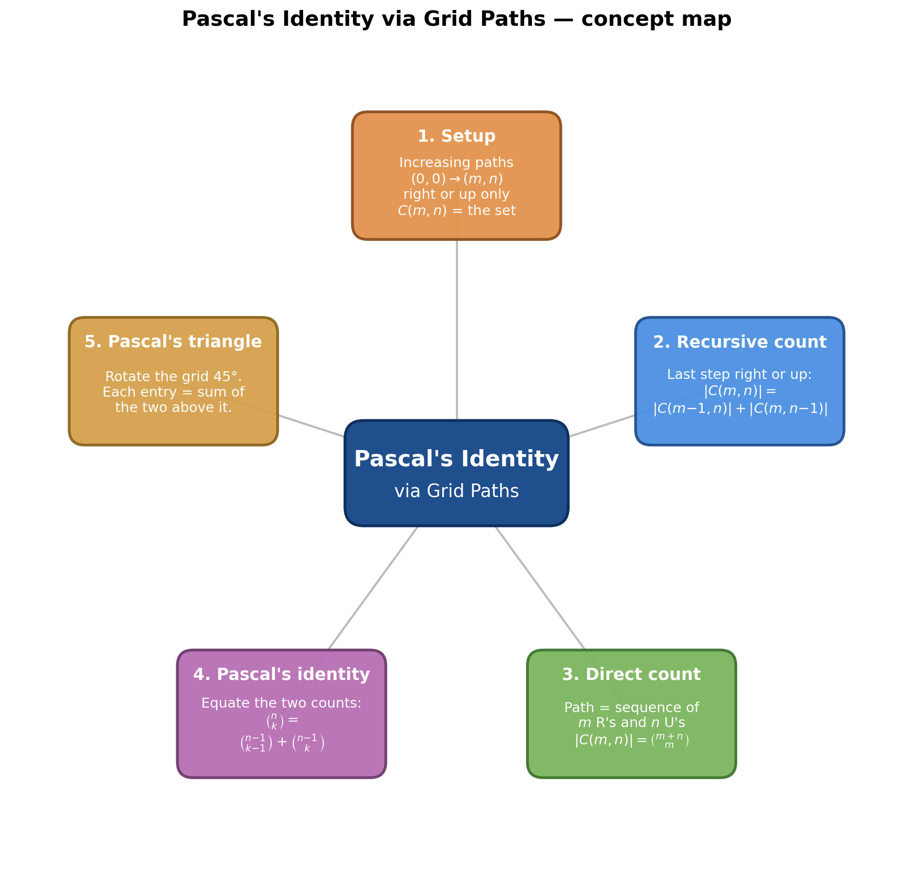
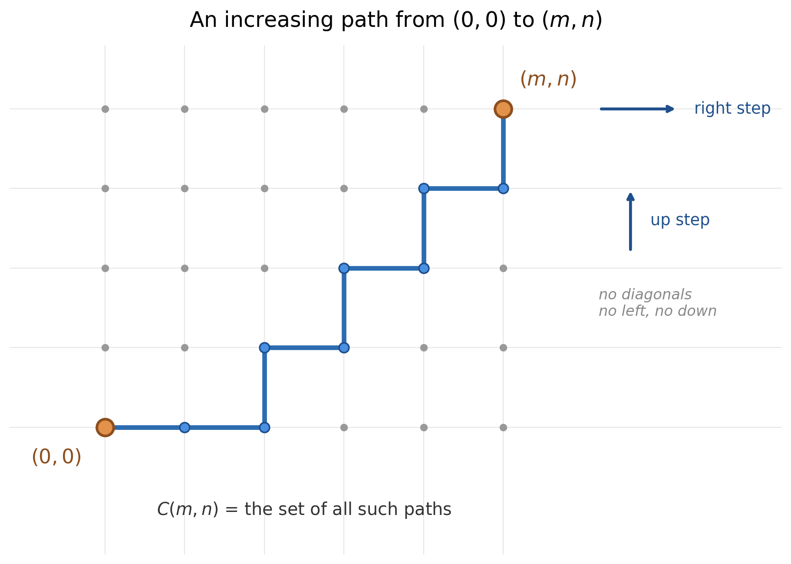
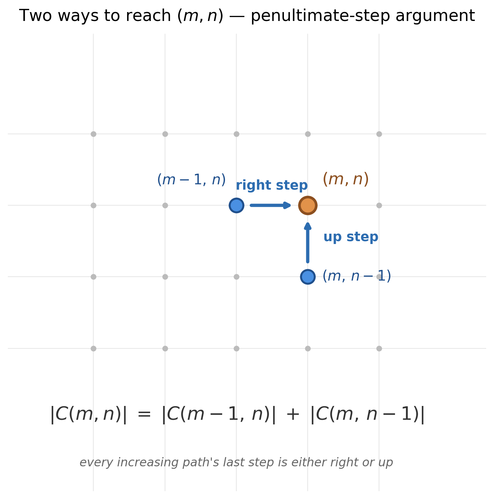
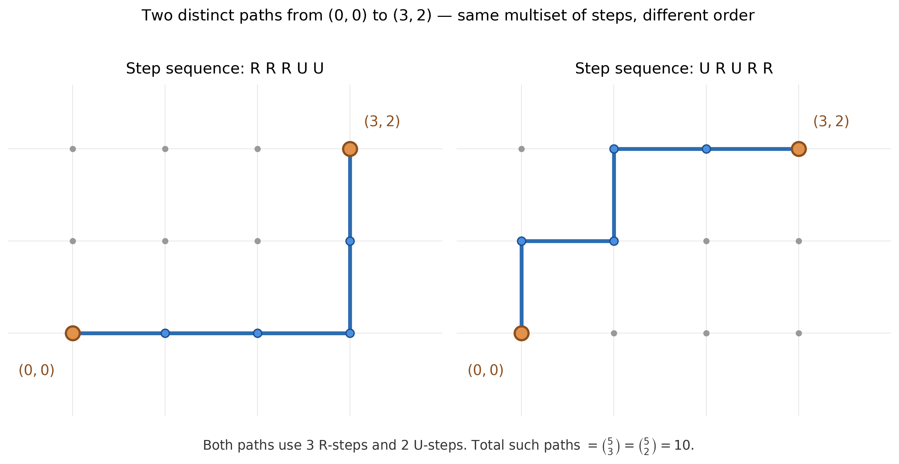
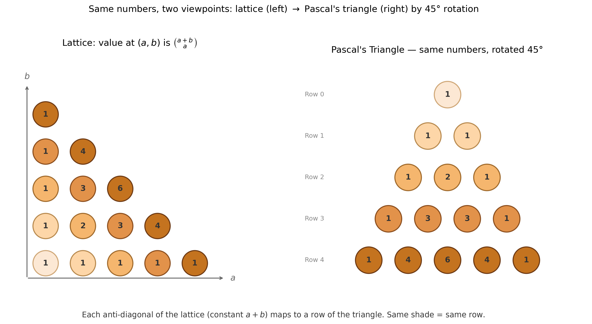
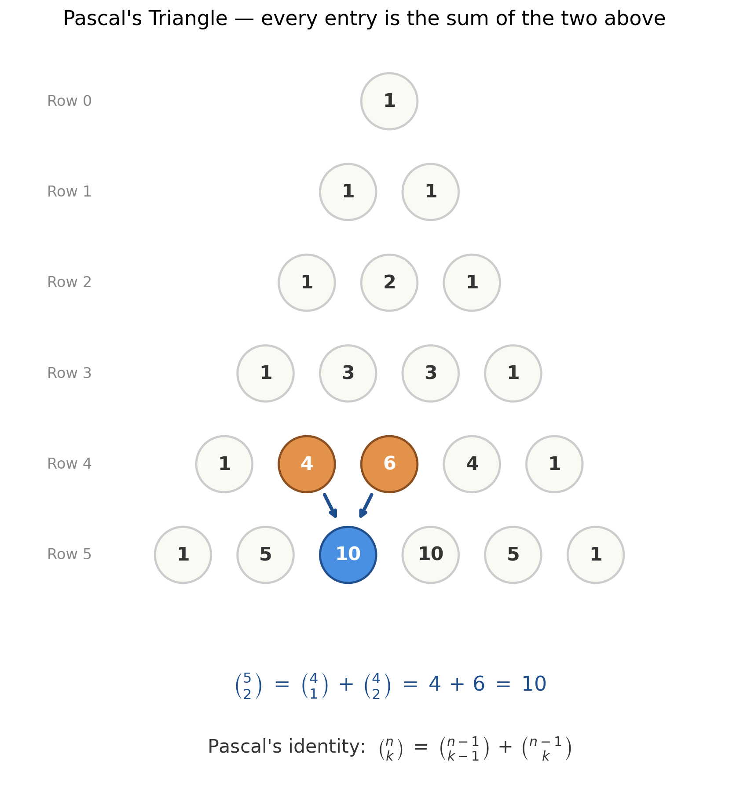

# Pascal's Identity via Grid Paths

*Path C single-source note — extracted from one YouTube video by **EXISTS FOR ALL Academy** via Gemini frame-by-frame analysis. Topics regrouped textbook-style; every timestamp is a clickable deep-link.*

| Field | Value |
|---|---|
| **Source** | [Pascal's Triangle and Pascal's Identity](https://www.youtube.com/watch?v=Cwo2ua3H1pE) |
| **Channel** | EXISTS FOR ALL Academy |
| **Length** | 7:39 |
| **Topic** | Deriving Pascal's identity by counting increasing paths on the integer grid |
| **Captured** | 2026-05-04 |



> [!info] What this note is, and why it complements [Exercise 16](chapter1_exercises.md)
> [Exercise 16 in your notes](chapter1_exercises.md) proves Pascal's identity $\binom{n}{k} + \binom{n}{k-1} = \binom{n+1}{k}$ via the **"Alice on/off the committee"** story. This video proves the same identity through a completely different story — **counting increasing paths on an integer grid**. Same identity, two stories. Together they reveal that Pascal's identity isn't an isolated algebraic curiosity — it's a *structural fact about combinatorial counting* that surfaces wherever you partition a count into two cases.

---

## 1. The setup — increasing paths on the integer grid

The video opens with a clean combinatorial question *(at [[00:32]](https://www.youtube.com/watch?v=Cwo2ua3H1pE&t=32s))*:

> [!definition] Increasing path on a grid
> An **increasing path** from $(0,0)$ to $(m,n)$ is a sequence of moves on the integer lattice where every step is either **one unit right** ($\to$) or **one unit up** ($\uparrow$) — no left, no down, no diagonal *(at [[00:37]](https://www.youtube.com/watch?v=Cwo2ua3H1pE&t=37s))*. Let
> $$C(m,n) \;=\; \{\text{all increasing paths from } (0,0) \text{ to } (m,n)\}$$
> *(at [[01:10]](https://www.youtube.com/watch?v=Cwo2ua3H1pE&t=70s))*. The question: what is $|C(m,n)|$?


*Generated by matplotlib via `_gen_sp_grid_path.py` — a staircase path from $(0,0)$ to $(m,n)$ using right and up steps only.*

The whole rest of the video is **two ways of computing $|C(m,n)|$**, and Pascal's identity is the equation forced by setting them equal.

---

## 2. First count — recursion via the penultimate step

The video derives a recurrence by asking: *what was the second-to-last point on the path?* *(at [[01:53]](https://www.youtube.com/watch?v=Cwo2ua3H1pE&t=113s))*

> [!example] Recursive count of $|C(m,n)|$ *(at [[01:50]](https://www.youtube.com/watch?v=Cwo2ua3H1pE&t=110s))*
> **Setup.** Take any increasing path from $(0,0)$ to $(m,n)$. Look at its very last step.
> **Solution.**
> 1. The final step lands at $(m,n)$ and was either a "right" or an "up." There's no other option in an increasing path.
> 2. If the last step was a **right**, the penultimate point was $(m-1, n)$. The first part of the path (everything before the last step) is an increasing path from $(0,0)$ to $(m-1, n)$.
> 3. If the last step was an **up**, the penultimate point was $(m, n-1)$. The first part is an increasing path from $(0,0)$ to $(m, n-1)$.
> 4. These two cases are mutually exclusive (the last step can't be both) and exhaustive (those are the only options). By the rule of sum:
>    $$|C(m,n)| \;=\; |C(m-1, n)| \;+\; |C(m, n-1)|$$
>    *(at [[02:22]](https://www.youtube.com/watch?v=Cwo2ua3H1pE&t=142s))*
>
> **Insight.** The recursion depends *only* on the structural fact that an increasing path's last step has 2 mutually exclusive possibilities — same logical pattern as the "Alice on/off the committee" partition in Exercise 16.


*Generated by matplotlib via `_gen_sp_penultimate.py` — the two ways to enter $(m,n)$, with the recurrence written in correct cardinality notation.*

---

## 3. Second count — direct enumeration via combinations

A different way of counting paths leads to a closed-form formula *(at [[02:57]](https://www.youtube.com/watch?v=Cwo2ua3H1pE&t=177s))*:

> [!tip] Reframe the geometry as a sequence
> Every increasing path from $(0,0)$ to $(m,n)$ — no matter how it zigs and zags — uses **exactly $m$ right-steps and exactly $n$ up-steps**. Why? Each right-step adds 1 to the $x$-coordinate, each up-step adds 1 to the $y$-coordinate, and we need to go from $x=0$ to $x=m$ (so exactly $m$ rights) and from $y=0$ to $y=n$ (so exactly $n$ ups) *(at [[03:25]](https://www.youtube.com/watch?v=Cwo2ua3H1pE&t=205s))*.

So **a path is uniquely determined by the order** in which the $m$ rights and $n$ ups appear among the $m+n$ total steps.


*Generated by matplotlib via `_gen_sp_two_paths.py` — two distinct paths from $(0,0)$ to $(3,2)$, both with 3 R's and 2 U's but in different orders.*

> [!example] Direct count of $|C(m,n)|$ *(at [[03:51]](https://www.youtube.com/watch?v=Cwo2ua3H1pE&t=231s))*
> **Setup.** Count the number of distinct sequences of $m+n$ steps where exactly $m$ are R's and exactly $n$ are U's.
> **Solution.**
> 1. Total positions in the sequence: $m + n$.
> 2. Choose which $m$ of those positions hold the R's; the remaining $n$ positions automatically hold U's.
> 3. Number of ways to choose: $\binom{m+n}{m}$.
> 4. Equivalently $\binom{m+n}{n}$ by the symmetry $\binom{a}{b} = \binom{a}{a-b}$ *(at [[04:03]](https://www.youtube.com/watch?v=Cwo2ua3H1pE&t=243s))*.
>
> **Answer.**
> $$|C(m,n)| \;=\; \frac{(m+n)!}{m!\,n!} \;=\; \binom{m+n}{m} \;=\; \binom{m+n}{n}$$

---

## 4. Pascal's identity — the equation that connects the two counts

We now have **two formulas for the same quantity** $|C(m,n)|$:

| Method | Formula |
|---|---|
| Recursive (§2) | $|C(m,n)| = |C(m-1,n)| + |C(m,n-1)|$ |
| Direct (§3) | $|C(m,n)| = \binom{m+n}{m}$ |

Substitute the closed form into both sides of the recurrence *(at [[04:24]](https://www.youtube.com/watch?v=Cwo2ua3H1pE&t=264s))*:

| Term | Substituted form |
|---|---|
| $\|C(m,n)\|$ | $\binom{m+n}{m}$ |
| $\|C(m-1, n)\|$ | $\binom{(m-1)+n}{m-1} = \binom{m+n-1}{m-1}$ |
| $\|C(m, n-1)\|$ | $\binom{m+(n-1)}{m} = \binom{m+n-1}{m}$ |

The recurrence becomes:
$$\binom{m+n}{m} \;=\; \binom{m+n-1}{m-1} \;+\; \binom{m+n-1}{m}$$
*(at [[04:35]](https://www.youtube.com/watch?v=Cwo2ua3H1pE&t=275s))*.

**Generalize the variables** *(at [[05:06]](https://www.youtube.com/watch?v=Cwo2ua3H1pE&t=306s))*: rename $m+n \to n$ and $m \to k$ (so $n \ge 2$, $k \ge 1$, $n > k$). The identity takes its standard form:

$$\boxed{\;\binom{n}{k} \;=\; \binom{n-1}{k-1} \;+\; \binom{n-1}{k}\;}$$

*(at [[05:18]](https://www.youtube.com/watch?v=Cwo2ua3H1pE&t=318s))* — **Pascal's identity** *(at [[05:32]](https://www.youtube.com/watch?v=Cwo2ua3H1pE&t=332s))*.

> [!tip] The big idea
> > "We have two ways of counting the same set, so the two answers must agree." — that single principle, applied to grid paths, gives Pascal's identity for free. This pattern (count one set two ways → derive an identity) is the engine behind every story proof in Chapter 1.

---

## 5. Pascal's triangle — the same numbers, drawn differently

The final move is geometric: **rotate the grid 45° counterclockwise** and you get Pascal's triangle *(at [[06:35]](https://www.youtube.com/watch?v=Cwo2ua3H1pE&t=395s))*.


*Generated by matplotlib via `_gen_sp_grid_to_triangle.py` — the path-count lattice on the left rotates 45° into Pascal's triangle on the right; matching shades = matching anti-diagonal / row.*

The recursive construction of the triangle *(at [[06:47]](https://www.youtube.com/watch?v=Cwo2ua3H1pE&t=407s))* — every entry = sum of the two above it — **is exactly Pascal's identity reading off the triangle row by row**:

```
Row 0:           1
Row 1:         1   1
Row 2:       1   2   1          ← 2 = 1 + 1
Row 3:     1   3   3   1        ← 3 = 1 + 2,  3 = 2 + 1
Row 4:   1   4   6   4   1      ← 6 = 3 + 3
Row 5: 1   5   10  10  5   1    ← 10 = 4 + 6
```


*Generated by matplotlib via `_gen_sp_pascal_triangle.py` — the entry $\binom{5}{2} = 10$ as the sum of $\binom{4}{1} = 4$ and $\binom{4}{2} = 6$ directly above.*

| Triangle entry | Binomial form | Pascal's identity reading |
|---|---|---|
| $10$ at row 5, position 2 | $\binom{5}{2}$ | $= \binom{4}{1} + \binom{4}{2} = 4 + 6$ ✓ |
| $5$ at row 5, position 1 | $\binom{5}{1}$ | $= \binom{4}{0} + \binom{4}{1} = 1 + 4$ ✓ |
| $3$ at row 3, position 1 | $\binom{3}{1}$ | $= \binom{2}{0} + \binom{2}{1} = 1 + 2$ ✓ |

The triangle is the *visual embodiment* of Pascal's identity — every entry is computed by exactly the rule the identity provides.

---

## Key takeaways

- **Counting one quantity two ways is the engine of story proofs.** Recursive count + direct count for $|C(m,n)|$ gives Pascal's identity *for free* — no algebra needed.
- **Pascal's identity is a structural rule, not a coincidence.** It surfaces whenever you partition a count into two mutually exclusive cases (left vs right step here, Alice in vs out in [Exercise 16](chapter1_exercises.md)).
- **The grid and the triangle are the same object.** Rotate the path-count grid 45° and entries align exactly with Pascal's triangle. The recursion that generates the grid (penultimate-step argument) IS the rule that generates the triangle (sum-of-two-above).
- **Two stories, one identity.** This grid-path proof and Exercise 16's "Alice on/off committee" proof both derive $\binom{n}{k} = \binom{n-1}{k-1} + \binom{n-1}{k}$. Each gives a different intuition; together they triangulate the same truth.

---

## Related notes

- **[Exercise 16 — Pascal's Identity](chapter1_exercises.md)** — the "Alice on/off the committee" story proof + full algebraic derivation. Pair this note (grid-paths) with that one (committees) for two complementary intuitions.
- **[Chapter 1 (Main)](<Chapter 1 (Main).md>)** — Section 1.4 covers binomial coefficients and the broader story-proof apparatus this video sits within.

---

## Sources

| Source | URL |
|---|---|
| Video (EXISTS FOR ALL Academy) | [Pascal's Triangle and Pascal's Identity](https://www.youtube.com/watch?v=Cwo2ua3H1pE) |
