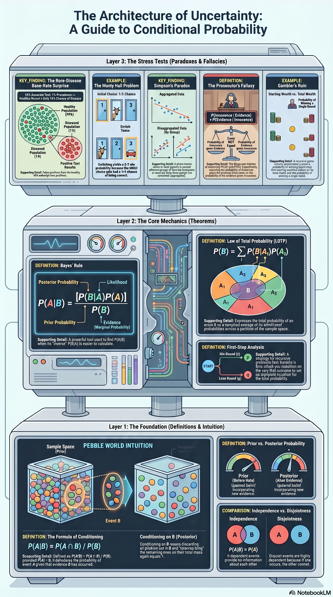
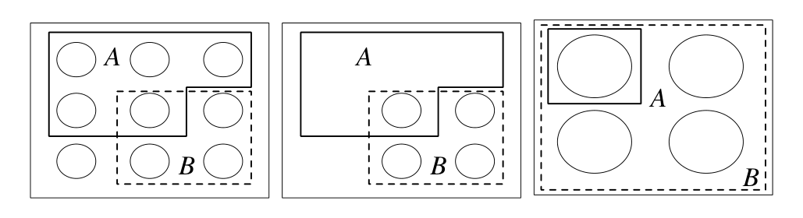
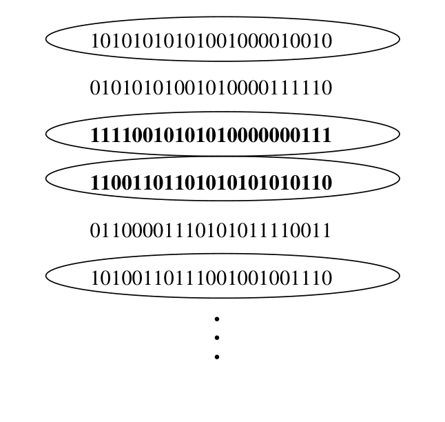
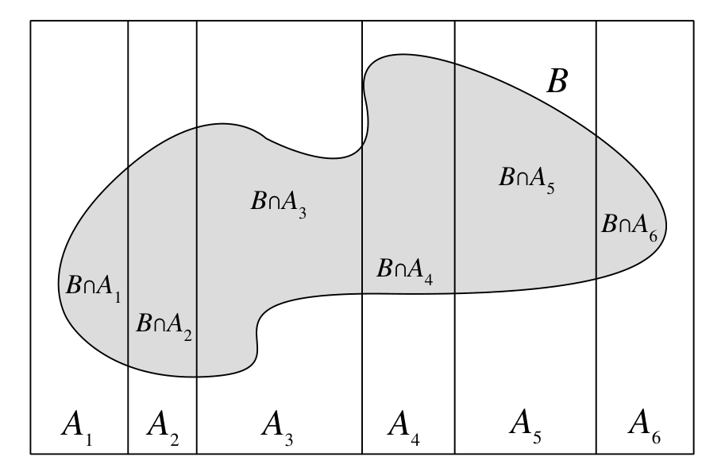
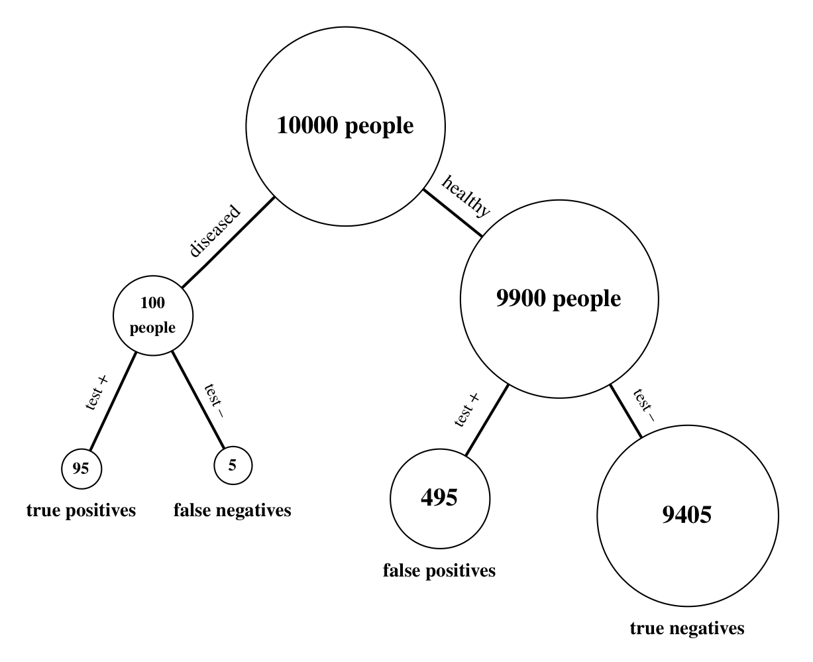
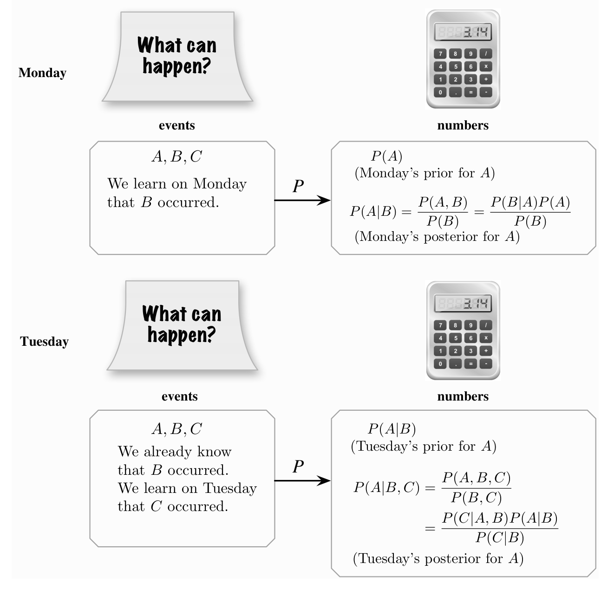
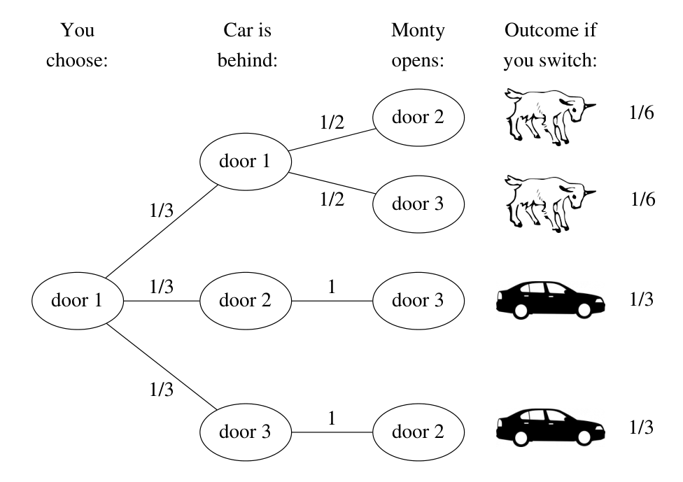
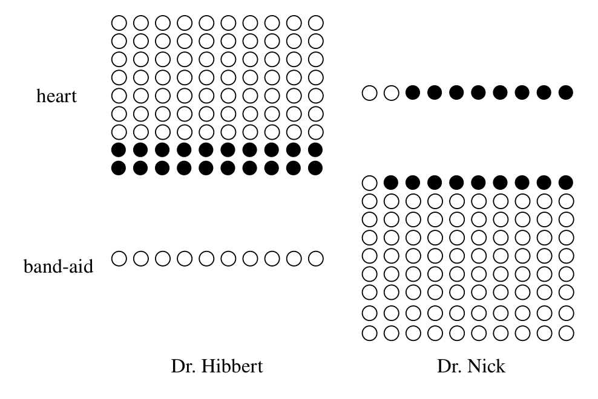

# Chapter 2 — Conditional Probability

*Companion document to [[Introduction to Probability (Main)|Introduction to Probability (Main)]]*

_Research compiled 2026-06-20 — Blitzstein & Hwang, *Introduction to Probability*, Ch. 2, with NotebookLM-assisted summaries and full main-agent verification of all 74 exercises._

---

---

> [!info] Chapter Essence
> Conditional probability is **the soul of statistics** — the machinery for *updating beliefs* as evidence arrives. The single definition $P(A\mid B)=P(A\cap B)/P(B)$ generates everything: **Bayes' rule** (which reverses the direction of conditioning), the **law of total probability** (which solves a hard problem by splitting it into cases), the notion of **independence** (evidence that tells you nothing), and a general-purpose problem-solving strategy — *condition on what you wish you knew*. The chapter's recurring warning: $P(A\mid B)$ and $P(B\mid A)$ are different, priors matter as much as evidence, and an association can reverse when you aggregate across a hidden variable.

---

## 2.1 The Importance of Thinking Conditionally

Conditional probability answers the fundamental question: **how should we update our beliefs once we observe evidence?** Three ideas recur throughout the chapter:

- **All probabilities are conditional.** Every probability carries implicit background knowledge; conditioning just makes that knowledge explicit.
- **Conditioning decomposes hard problems.** A complicated probability can be broken into a collection of simpler, case-by-case pieces.
- **Evidence is not causation.** $P(A\mid B)$ measures what $B$ *tells us* about $A$, not whether $B$ *causes* $A$.

> [!quote] Blitzstein & Hwang
> Conditioning is "the soul of statistics."

---

## 2.2 Definition and Intuition

> [!definition] Definition 2.2.1 — Conditional probability
> If $A$ and $B$ are events with $P(B) > 0$, then the **conditional probability of $A$ given $B$** is
> $$P(A\mid B) = \frac{P(A \cap B)}{P(B)}.$$
> Here $B$ is the **evidence** we condition on. $P(A)$ is the **prior** (before evidence); $P(A\mid B)$ is the **posterior** (after evidence).

Two intuitions make the definition feel inevitable.

> [!tip] Intuition 1 — Pebble World (restrict, then renormalize)
> Picture the sample space as pebbles whose masses sum to 1. Learning that $B$ occurred means: **(1)** discard every pebble in $B^c$ (they contradict the evidence), then **(2)** renormalize the survivors by dividing by $P(B)$ so the masses sum to 1 again. The updated mass on $A$ is exactly $P(A\cap B)/P(B)$.

> [!tip] Intuition 2 — Frequentist (long-run relative frequency)
> Repeat the experiment $n$ times. Look only at the trials where $B$ happened; among *those*, the fraction where $A$ also happened approaches $P(A\mid B)$:
> $$P(A\mid B) \approx \frac{n_{AB}}{n_B} = \frac{n_{AB}/n}{n_B/n} = \frac{P(A\cap B)}{P(B)}.$$

> [!example] Example 2.2.2 — Two cards (and why $P(A\mid B)\ne P(B\mid A)$)
> **Problem.** A standard deck is shuffled and two cards are drawn one at a time without replacement. Let $A$ = "first card is a heart" and $B$ = "second card is red." Find $P(A\mid B)$ and $P(B\mid A)$.
> **Setup.** 52 cards: 13 hearts, 26 red. $P(A)=\tfrac14$, and by symmetry $P(B)=\tfrac12$.
> **Solution.** By the naive definition and the multiplication rule, $P(A\cap B)=\dfrac{13\cdot 25}{52\cdot 51}=\dfrac{25}{204}$. Then
> $$P(A\mid B)=\frac{P(A\cap B)}{P(B)}=\frac{25/204}{1/2},\qquad P(B\mid A)=\frac{P(A\cap B)}{P(A)}=\frac{25/204}{1/4}.$$
> **Answer.** $P(A\mid B)=\dfrac{25}{102}$ and $P(B\mid A)=\dfrac{25}{51}$.
> **Insight.** The two are **not** equal — confusing them is the *prosecutor's fallacy* (§2.8). Note also that chronology is irrelevant: we can condition the *earlier* card on the *later* one, because conditioning is about information, not time.

> [!example] Example 2.2.5 — Two children (the classic puzzle)
> **Problem.** Mr. Jones has two children; the *elder* is a girl. Mr. Smith has two children; *at least one* is a boy. For each, what is the probability that both children are the same stated gender (both girls for Jones; both boys for Smith)? Assume each child is independently a girl or boy with probability $\tfrac12$.
> **Setup.** Sample space $\{GG, GB, BG, BB\}$, each with probability $\tfrac14$.
> **Solution.** Jones: $P(\text{both girls}\mid \text{elder is girl})=\dfrac{1/4}{1/2}$. Smith (in girl-terms for comparison): $P(\text{both girls}\mid\text{at least one girl})=\dfrac{1/4}{3/4}$.
> **Answer.** Jones $=\tfrac12$; Smith $=\tfrac13$.
> **Insight.** "The elder is a girl" pins down a *specific* child, knocking out two outcomes. "At least one is a girl" only removes $BB$ — leaving three equally likely cases, one favourable.

> [!example] Example 2.2.6 — A random child is a girl
> **Problem.** A family has two children. You happen to meet one of them (equally likely either child, independent of gender) and she is a girl. What is the probability both are girls?
> **Setup.** $G_1,G_2,G_3$ = elder, younger, and the *met* child is a girl; each has prior $\tfrac12$, and $P(G_1\cap G_2)=\tfrac14$.
> **Solution.** If both are girls the met child is certainly a girl, so $G_1\cap G_2\cap G_3 = G_1\cap G_2$. Thus $P(G_1\cap G_2\mid G_3)=\dfrac{1/4}{1/2}$.
> **Answer.** $\tfrac12$.
> **Insight.** *How the evidence was gathered matters.* Meeting a random child (which designates a specific child) gives $\tfrac12$; being told "at least one is a girl" gives $\tfrac13$. Same fact, different sampling, different answer.

> [!example] Example 2.2.7 — A girl born in winter
> **Problem.** Find $P(\text{both girls})$ given that at least one child is *a girl born in winter*. Seasons are equally likely and independent of gender.
> **Solution.** A specific child is a winter-girl with probability $\tfrac18$. Denominator $P(\text{at least one winter-girl}) = 1-(\tfrac78)^2=\tfrac{15}{64}$. Numerator $=P(\text{both girls})\cdot P(\text{at least one winter child}) = \tfrac14\big(1-(\tfrac34)^2\big)=\tfrac{7}{64}$.
> **Answer.** $\dfrac{7/64}{15/64}=\dfrac{7}{15}$.
> **Insight.** Adding "born in winter" nudges "at least one girl" toward designating a *specific* child, interpolating between $\tfrac13$ and $\tfrac12$.

---

## 2.3 Bayes' Rule and the Law of Total Probability

> [!definition] Theorem 2.3.1 — The multiplication form
> For events with positive probability,
> $$P(A\cap B) = P(B)\,P(A\mid B) = P(A)\,P(B\mid A).$$

> [!definition] Theorem 2.3.3 — Bayes' rule
> Dividing the multiplication form by $P(B)$ reverses the conditioning:
> $$P(A\mid B) = \frac{P(B\mid A)\,P(A)}{P(B)}.$$
> Bayes' rule converts the likelihood $P(B\mid A)$ (often easy to state) into the posterior $P(A\mid B)$ (what we want).

> [!definition] Theorem 2.3.6 — Law of Total Probability (LOTP)
> Let $A_1,\dots,A_n$ **partition** the sample space (disjoint, union is $S$), each with $P(A_i)>0$. For any event $B$,
> $$P(B) = \sum_{i=1}^{n} P(B\mid A_i)\,P(A_i).$$
> Substituting LOTP into the denominator of Bayes' rule gives the **combined form**, the workhorse of the chapter:
> $$P(A_i\mid B) = \frac{P(B\mid A_i)P(A_i)}{\sum_{j=1}^{n} P(B\mid A_j)P(A_j)}.$$

> [!example] Example 2.3.7 — Random coin
> **Problem.** One fair coin and one biased coin (Heads with probability $\tfrac34$). You pick one at random and flip it three times, getting three Heads. What is the probability you picked the *fair* coin?
> **Setup.** $F$ = picked fair; $A$ = three Heads. $P(F)=P(F^c)=\tfrac12$, $P(A\mid F)=(\tfrac12)^3$, $P(A\mid F^c)=(\tfrac34)^3$.
> **Solution.**
> $$P(F\mid A)=\frac{P(A\mid F)P(F)}{P(A\mid F)P(F)+P(A\mid F^c)P(F^c)}=\frac{(1/2)^3(1/2)}{(1/2)^3(1/2)+(3/4)^3(1/2)}.$$
> **Answer.** $\dfrac{8}{35}\approx 0.23$.
> **Insight.** Three Heads is evidence *for* the biased coin, pulling the posterior for "fair" below its prior of $\tfrac12$.

> [!example] Example 2.3.9 — Testing for a rare disease (the base-rate surprise)
> **Problem.** A disease afflicts 1% of the population. A test is "95% accurate" — sensitivity $P(T\mid D)=0.95$ and specificity $P(T^c\mid D^c)=0.95$. Fred tests positive. Find $P(D\mid T)$.
> **Setup.** $P(D)=0.01$, $P(D^c)=0.99$, false-positive rate $P(T\mid D^c)=0.05$.
> **Solution.**
> $$P(D\mid T)=\frac{P(T\mid D)P(D)}{P(T\mid D)P(D)+P(T\mid D^c)P(D^c)}=\frac{0.95\cdot 0.01}{0.95\cdot 0.01+0.05\cdot 0.99}.$$
> **Answer.** $\approx 0.16$.
> **Insight.** Counterintuitively low: among 10,000 people, the test flags ~95 true positives but ~495 false positives — the false positives from the huge healthy majority swamp the true positives.

> [!example] Example 2.3.10 — The six-fingered man
> **Problem.** The culprit is one of $n$ equally likely men. An eyewitness says the criminal has six fingers on his right hand. An innocent man has six fingers with probability $p_0$; the true perpetrator with probability $p_1$ ($p_0<p_1$). Let $a=p_0/p_1$ and $b=(1-p_1)/(1-p_0)$. Rugen has six fingers. (a) Find the probability he is guilty. (b) Now suppose *everyone's* hands are checked and Rugen is the only six-fingered man — find the probability he is guilty.
> **Solution.** With $R$ = "Rugen guilty," $P(R)=\tfrac1n$, $M$ = "six fingers," $P(M\mid R)=p_1$, $P(M\mid R^c)=p_0$.
> **(a)** Bayes + LOTP, then *divide top and bottom by the numerator* to expose the likelihood ratio:
> $$P(R\mid M)=\frac{p_1\cdot\frac1n}{p_1\cdot\frac1n + p_0\cdot\frac{n-1}{n}}\;\xrightarrow{\times n}\;\frac{p_1}{p_1+p_0(n-1)}\;\xrightarrow{\div p_1}\;\frac{1}{1+\frac{p_0}{p_1}(n-1)}=\frac{1}{1+a(n-1)}.$$
> The $a$ is just $\frac{p_0}{p_1}$ appearing when the denominator's $p_0(n-1)$ is divided by $p_1$.
> **(b)** Stronger evidence $M_1$ = "Rugen six-fingered *and* the other $n-1$ men not." The likelihoods become products: $P(M_1\mid R)=p_1(1-p_0)^{n-1}$ (guilty Rugen shows the hand; all $n-1$ innocents don't), while $P(M_1\mid R^c)=p_0(1-p_1)(1-p_0)^{n-2}$ (innocent Rugen shows it anyway; the *true culprit* among the others must not, giving $1-p_1$; the $n-2$ remaining innocents don't). Bayes, then the same divide-by-the-numerator move:
> $$P(R\mid M_1)=\frac{p_1(1-p_0)^{n-1}\cdot\frac1n}{p_1(1-p_0)^{n-1}\cdot\frac1n+p_0(1-p_1)(1-p_0)^{n-2}\cdot\frac{n-1}{n}}=\frac{1}{1+\underbrace{\tfrac{p_0}{p_1}}_{a}\underbrace{\tfrac{1-p_1}{1-p_0}}_{b}(n-1)}.$$
> The $ab$ is the combined likelihood ratio: $a$ from Rugen's own hand, $b$ from checking everyone else's ($(1-p_0)^{n-2}/(1-p_0)^{n-1}$ leaves the lone $\tfrac{1}{1-p_0}$ that pairs with $1-p_1$ to form $b$).
> **Answer.** (a) $\dfrac{1}{1+a(n-1)}$.  (b) $\dfrac{1}{1+ab(n-1)}$.
> **Insight.** Checking everyone else multiplies the odds by the factor $b<1$, dramatically strengthening the case against Rugen — highly specific evidence can swing a tiny prior to near-certainty.

---

## 2.4 Conditional Probabilities Are Probabilities

Conditioning on a fixed event $E$ (with $P(E)>0$) yields a *new, fully valid* probability function. Define $\tilde P(A)=P(A\mid E)$; it satisfies every axiom:

- **Non-negativity:** $\tilde P(A)\ge 0$.
- **Normalization:** $\tilde P(S)=P(S\mid E)=\dfrac{P(S\cap E)}{P(E)}=1$ (and $\tilde P(\varnothing)=0$).
- **Countable additivity:** for disjoint $A_1,A_2,\dots$, $\ \tilde P\!\big(\bigcup_j A_j\big)=\sum_j \tilde P(A_j)$.

> [!abstract] Proof (book, §2.4, pp. 39–40) — $\tilde P$ satisfies the axioms
> Fix an event $E$ with $P(E)>0$ and define $\tilde P(A)=P(A\mid E)$ — the tilde emphasizes that $E$ is *fixed* and $P(\cdot\mid E)$ is our new probability function. The book's Definition 1.6.1 has exactly **two axioms** to check (non-negativity is automatic since $\tilde P(A)$ is a ratio of probabilities with $P(E)>0$).
> **Axiom 1** ($P(\varnothing)=0$, $P(S)=1$): direct from the definition,
> $$\tilde P(\varnothing)=P(\varnothing\mid E)=\frac{P(\varnothing\cap E)}{P(E)}=\frac{P(\varnothing)}{P(E)}=0,\qquad
> \tilde P(S)=P(S\mid E)=\frac{P(S\cap E)}{P(E)}=\frac{P(E)}{P(E)}=1.$$
> **Axiom 2** (countable additivity): let $A_1,A_2,\dots$ be disjoint. Distribute the intersection over the union, $\big(\bigcup_j A_j\big)\cap E=\bigcup_j (A_j\cap E)$, and note the sets $A_j\cap E$ are *still disjoint* (each sits inside its own $A_j$). So ordinary countable additivity of $P$ applies to them:
> $$\tilde P(A_1\cup A_2\cup\cdots)=\frac{P\big((A_1\cap E)\cup(A_2\cap E)\cup\cdots\big)}{P(E)}=\frac{\sum_{j=1}^{\infty}P(A_j\cap E)}{P(E)}=\sum_{j=1}^{\infty}\tilde P(A_j).\ \square$$
> Every step is just the definition of conditional probability plus set algebra — the axioms of $P$ pass straight through the division by the constant $P(E)$.

> [!warning] $A\mid E$ is not an event (book's ⚠ 2.4.1)
> $P(A\mid E)$ does **not** mean "the probability of the event $A\mid E$" — there is no such event. Rather, $P(\cdot\mid E)$ and $P(\cdot)$ are two *different probability functions*: plugging the same event $A$ into each gives two different numbers, one incorporating the knowledge that $E$ occurred, one not. Conversely, the book notes *all* probabilities are secretly conditional — $P(A)$ is shorthand for $P(A\mid K)$ where $K$ is unstated background knowledge.

> [!tip] The payoff — "extra conditioning"
> Because $P(\cdot\mid E)$ is a genuine probability function, **every theorem stays true if you add "$,E$" to every conditioning bar.** Two we use constantly:
> $$P(A\mid B,E)=\frac{P(B\mid A,E)\,P(A\mid E)}{P(B\mid E)}\quad\text{(Bayes with extra conditioning)},$$
> $$P(B\mid E)=\sum_{i=1}^{n} P(B\mid A_i,E)\,P(A_i\mid E)\quad\text{(LOTP with extra conditioning)}.$$

> [!example] Example 2.4.4 — Random coin, continued
> **Problem.** After seeing the chosen coin land Heads three times (Example 2.3.7), what is the probability the *fourth* toss is Heads?
> **Setup.** Posterior after three Heads: $P(F\mid A)\approx 0.23$, $P(F^c\mid A)\approx 0.77$.
> **Solution.** LOTP with extra conditioning on $A$:
> $$P(H\mid A)=P(H\mid F,A)P(F\mid A)+P(H\mid F^c,A)P(F^c\mid A)=\tfrac12(0.23)+\tfrac34(0.77).$$
> **Answer.** $\approx 0.69$.
> **Insight.** We predict the future toss using the *updated* coin probabilities — conditional probabilities behave exactly like ordinary ones.

> [!example] Example 2.4.5 — Unanimous agreement (why unanimity can be suspicious)
> **Problem.** $n$ judges each vote convict/acquit. The suspect is guilty with prior $p$. With probability $s$ a *systemic error* occurs, forcing a unanimous "convict" regardless of guilt (independent of guilt). Absent a systemic error, each judge independently votes convict with probability $c$ if guilty, $w$ if innocent ($0<w<\tfrac12<c<1$). (a) If exactly $k<n$ judges convict, find $P(\text{guilty})$. (b) If *all* $n$ convict, find $P(\text{guilty})$. (c) Is (b) increasing in $n$?
> **Solution.** (a) $k<n$ rules out a systemic error, so condition on $B^c$ and use the Binomial likelihoods: $P(G\mid X=k)=\dfrac{p\,c^k(1-c)^{n-k}}{p\,c^k(1-c)^{n-k}+(1-p)\,w^k(1-w)^{n-k}}$. (b) For unanimity $U$, extra-conditioning LOTP gives $P(U\mid G)=s+(1-s)c^n$ and $P(U\mid G^c)=s+(1-s)w^n$, so $P(G\mid U)=\dfrac{p\,(s+(1-s)c^n)}{p\,(s+(1-s)c^n)+(1-p)\,(s+(1-s)w^n)}$.
> **Answer.** (a) and (b) as above. (c) **No** — as $n\to\infty$ the systemic-error term $s$ dominates, so unanimity becomes *uninformative* and $P(G\mid U)\to p$, the prior.
> **Insight.** Beyond some point, *more* unanimous votes signal a shared systemic flaw rather than stronger evidence of guilt — the ancient law that acquitted on unanimous conviction had a point.

---

## 2.5 Independence of Events

> [!definition] Definition 2.5.1 — Independence of two events
> $A$ and $B$ are **independent** if
> $$P(A\cap B)=P(A)P(B).$$
> Equivalently (for positive probabilities) $P(A\mid B)=P(A)$ and $P(B\mid A)=P(B)$: each event carries *no information* about the other.

> [!warning] Independence is NOT disjointness
> Disjoint events with positive probability are **maximally dependent**: if $A\cap B=\varnothing$, then knowing $A$ occurred tells you $B$ definitely did *not*. Disjointness means $P(A\cap B)=0$; independence means $P(A\cap B)=P(A)P(B)$.

For three events $A,B,C$, **mutual independence** requires all four equations
$$P(A\cap B)=P(A)P(B),\ P(A\cap C)=P(A)P(C),\ P(B\cap C)=P(B)P(C),\ P(A\cap B\cap C)=P(A)P(B)P(C).$$
The first three alone give only **pairwise independence**. For $n$ events, *every* sub-collection's intersection must factor. And **conditional independence given $E$** means $P(A\cap B\mid E)=P(A\mid E)P(B\mid E)$ — a separate condition that neither implies nor is implied by unconditional independence.

> [!example] Example 2.5.5 — Pairwise ≠ mutual
> **Problem.** Two fair independent tosses. $A$ = first Heads, $B$ = second Heads, $C$ = "same result." Show $A,B,C$ are pairwise but not mutually independent.
> **Solution.** Each has probability $\tfrac12$; each pairwise intersection has probability $\tfrac14=\tfrac12\cdot\tfrac12$ ✓. But $A\cap B$ forces $C$, so $P(A\cap B\cap C)=\tfrac14\ne \tfrac18=P(A)P(B)P(C)$.
> **Insight.** Knowing one of $A,B$ says nothing about $C$, but knowing *both* determines $C$ — pairwise independence misses this.

> [!example] Example 2.5.10 / 2.5.11 — Conditional vs. unconditional independence (both directions fail)
> **Conditional ⇏ unconditional.** With the random coin (fair vs. biased), tosses $A_1,A_2$ are independent *given the coin*, but **not** unconditionally: the first toss is evidence about *which coin* you hold, which shifts your prediction for the second.
> **Unconditional ⇏ conditional.** Alice and Bob call independently. Given "exactly one call arrived," the events "Alice called" and "Bob called" become perfectly *dependent* (one happened iff the other didn't). Conditioning on a shared total can *create* dependence.

> [!example] Example 2.5.12 — Why is the baby crying?
> **Problem.** A baby cries iff hungry or tired (or both): $C=H\cup T$, with $H,T$ independent, $P(H)=h$, $P(T)=t$. (a) Find $P(C)=c$. (b) Find $P(H\mid C),P(T\mid C),P(H,T\mid C)$. (c) Are $H,T$ conditionally independent given $C$?
> **Solution.** (a) Inclusion–exclusion: $c=h+t-ht$. (b) Since crying is certain when hungry or tired, $P(C\mid H)=P(C\mid T)=1$, so by Bayes $P(H\mid C)=\tfrac{h}{c},\ P(T\mid C)=\tfrac{t}{c},\ P(H,T\mid C)=\tfrac{ht}{c}$. (c) Compare $P(H,T\mid C)=\tfrac{ht}{c}$ with $P(H\mid C)P(T\mid C)=\tfrac{ht}{c^2}$. Since $c<1$, these differ.
> **Answer.** (a) $c=h+t-ht$.  (b) as above.  (c) **No.**
> **Insight.** Within "crying," learning the baby is *not* hungry forces "tired" — so $H$ and $T$ become dependent. Conditioning can destroy independence.

---

## 2.6 Coherency of Bayes' Rule

> [!tip] Bayesian updating is order-independent
> Whether you fold in evidence **all at once** or **one piece at a time** (each posterior becoming the next prior), you reach the **same** final posterior. This is cleanest in **odds form**:
> $$\underbrace{\frac{P(D\mid E)}{P(D^c\mid E)}}_{\text{posterior odds}} = \underbrace{\frac{P(D)}{P(D^c)}}_{\text{prior odds}}\times \underbrace{\frac{P(E\mid D)}{P(E\mid D^c)}}_{\text{likelihood ratio}}.$$

> [!example] Example 2.6.1 — A second positive test
> **Problem.** Fred (Example 2.3.9) tests positive a *second* time, on an independent test with the same 95% sensitivity/specificity. Find $P(D\mid T_1\cap T_2)$ in one step and in two steps.
> **Solution.** Prior odds $\tfrac{P(D)}{P(D^c)}=\tfrac{1}{99}$; each positive multiplies the odds by $\tfrac{0.95}{0.05}=19$.
> $$\text{One step: } \frac{1}{99}\cdot 19^2=\frac{361}{99}\approx 3.646.\qquad \text{Two steps: } \Big(\frac{1}{99}\cdot 19\Big)\cdot 19=\frac{361}{99}.$$
> **Answer.** Posterior odds $\tfrac{361}{99}$, i.e. $P(D\mid T_1\cap T_2)\approx 0.78$.
> **Insight.** Both routes agree (coherency). A *second* opinion vaults the probability from $0.16$ to $0.78$.

---

## 2.7 Conditioning as a Problem-Solving Tool

> [!tip] Wishful thinking, made rigorous
> When a problem *would* be easy if only you knew whether $E$ happened, **condition on $E$ and $E^c$**, solve each easy sub-problem, and recombine with LOTP. When a problem refers to itself after one step, **first-step analysis** turns that self-similarity into a solvable recurrence.

> [!example] Example 2.7.1 — Monty Hall
> **Problem.** Three doors: one car, two goats. You pick door 1. Monty (who knows the layout, and picks at random when he has a choice) opens a different door, always revealing a goat, then offers a switch. Should you switch?
> **Solution.** Condition on the car's location and use LOTP for the switching strategy: $P(\text{win}\mid C_1)=0$ (you started on the car), but $P(\text{win}\mid C_2)=P(\text{win}\mid C_3)=1$ (Monty is forced, so the remaining door hides the car). Thus $P(\text{win})=0\cdot\tfrac13+1\cdot\tfrac13+1\cdot\tfrac13=\tfrac23$. Equivalently, Bayes gives $P(C_1\mid M_2)=\dfrac{(1/2)(1/3)}{1/2}=\tfrac13$, so the other door carries the complementary $\tfrac23$.
> **Answer.** **Yes — switch.** Switching wins with probability $\tfrac23$.
> **Insight.** "Two doors left, so 50–50" ignores that Monty's choice is *constrained* by the car's location, which is exactly the information his action leaks.

> [!example] Example 2.7.2 — Branching process (first-step analysis)
> **Problem.** An amoeba each minute dies, stays, or splits in two — each with probability $\tfrac13$, all amoebas independent. What is the probability $P(D)$ the lineage eventually dies out?
> **Solution.** Condition on the first minute. If it dies, extinction is certain ($P(D\mid B_0)=1$); if it stays, we are back to the start ($P(D\mid B_1)=P(D)$); if it splits, *both* independent lineages must die out ($P(D\mid B_2)=P(D)^2$). LOTP gives
> $$P(D)=\tfrac13\cdot 1+\tfrac13 P(D)+\tfrac13 P(D)^2 \ \Longrightarrow\ P(D)^2-2P(D)+1=0\ \Longrightarrow\ (P(D)-1)^2=0.$$
> **Answer.** $P(D)=1$ — extinction is certain.
> **Insight.** Self-similarity ("after one step we face the same problem") becomes an equation you can solve.

> [!example] Example 2.7.3 — Gambler's ruin
> **Problem.** Gamblers A and B make a sequence of &#36;1 bets; A wins each with probability $p$ (and B with $q=1-p$). A starts with $i$ dollars, B with $N-i$; play continues until someone is ruined. This is a random walk on $\{0,1,\dots,N\}$. Find $p_i=P(\text{A wins}\mid \text{A starts at } i)$.
> **Solution.** First-step analysis conditions on the first bet:
> $$p_i = p\,p_{i+1} + q\,p_{i-1},\qquad p_0=0,\ p_N=1.$$
> The characteristic equation $px^2-x+q=0$ has roots $1$ and $q/p$. For $p\ne\tfrac12$ the general solution $p_i=a+b(q/p)^i$ with the boundary conditions yields the formula below; for $p=\tfrac12$ the repeated root gives a linear solution.
> **Answer.** $$p_i=\frac{1-(q/p)^i}{1-(q/p)^N}\ \ (p\ne\tfrac12),\qquad p_i=\frac{i}{N}\ \ (p=\tfrac12).$$
> **Insight.** In a fair game your win probability is just your share $i/N$ of the money. Tilt $p$ even slightly against a player and the $(q/p)^i$ terms make their ruin nearly certain over a long game — the mathematics of the house edge.

---

## 2.8 Pitfalls and Paradoxes

> [!warning] Two courtroom fallacies
> - **Prosecutor's fallacy:** confusing $P(\text{evidence}\mid \text{innocent})$ with $P(\text{innocent}\mid \text{evidence})$ — and ignoring the prior.
> - **Defense attorney's fallacy:** quoting a statistic without conditioning on *all* the evidence actually available.

> [!example] Example 2.8.1 — Prosecutor's fallacy (Sally Clark)
> **Problem.** Two of a mother's infants died of SIDS. An expert testified $P(\text{two SIDS deaths})\approx(1/8500)^2\approx 1/73{,}000{,}000$ and concluded the probability of innocence was one in 73 million.
> **Solution.** Two errors. First, the deaths were treated as independent, ignoring shared genetic/environmental risk. Second — the fallacy — the expert reported $P(E\mid I)$ as though it were $P(I\mid E)$. By Bayes, $P(I\mid E)=\dfrac{P(E\mid I)P(I)}{P(E\mid I)P(I)+P(E\mid I^c)P(I^c)}$; since double infanticide ($I^c$) is *also* extraordinarily rare, the second term is tiny and the prior for innocence is high.
> **Answer.** $P(I\mid E)$ is in fact close to **1** — innocence is highly likely.
> **Insight.** A small $P(E\mid I)$ does not make $P(I\mid E)$ small; the prior dominates. (Clark's conviction was later quashed.)

> [!example] Example 2.8.2 — Defense attorney's fallacy
> **Problem.** A man is tried for murdering his wife; evidence shows he abused her. The defense argues abuse is irrelevant since only 1 in 10,000 abusers go on to murder their partner. Should the evidence be barred?
> **Setup.** The wife *was* murdered, so the relevant quantity is $P(G\mid A, M)$, not $P(G\mid A)$. Take $P(G\mid M)=0.2$, $P(A\mid G,M)=0.5$, $P(A\mid G^c,M)=0.1$.
> **Solution.** Bayes with extra conditioning on $M$:
> $$P(G\mid A,M)=\frac{P(A\mid G,M)P(G\mid M)}{P(A\mid G,M)P(G\mid M)+P(A\mid G^c,M)P(G^c\mid M)}=\frac{0.5\cdot 0.2}{0.5\cdot 0.2+0.1\cdot 0.8}.$$
> **Answer.** $\dfrac{5}{9}\approx 0.56$ — the abuse history raises guilt from $0.2$ to over $0.56$.
> **Insight.** The defense ignored the decisive fact that a murder occurred. Conditioning on *all* the evidence is mandatory.

> [!example] Example 2.8.3 — Simpson's paradox
> **Problem.** Two doctors each do heart surgery and Band-Aid removal. Dr. Hibbert beats Dr. Nick at *each* surgery type, yet Dr. Nick has the higher *overall* success rate. How?
>
> | Surgeon | Heart (succ/total) | Band-Aid (succ/total) | Overall |
> |---|---|---|---|
> | Dr. Hibbert | 70/90 (78%) | 10/10 (100%) | 80/100 (80%) |
> | Dr. Nick | 2/10 (20%) | 81/90 (90%) | 83/100 (83%) |
>
> **Solution.** Overall rates are LOTP weighted averages: $P(A\mid \text{Nick}) = \tfrac{2}{10}(0.1)+\tfrac{81}{90}(0.9)=0.83$ versus $P(A\mid\text{Hibbert})=\tfrac{70}{90}(0.9)+\tfrac{10}{10}(0.1)=0.80$.
> **Answer.** Nick's $0.83 > $ Hibbert's $0.80$, even though Hibbert wins within *each* category.
> **Insight.** The **confounder is surgery type**: Hibbert does mostly the hard (heart) cases, Nick mostly the easy ones. When a lurking variable is unevenly distributed, you must **disaggregate** — aggregate rates can reverse the truth.

---

## Key Takeaways

- **One definition runs the chapter:** $P(A\mid B)=P(A\cap B)/P(B)$ — restrict to $B$, then renormalize.
- **Bayes' rule reverses conditioning:** $P(A\mid B)=\dfrac{P(B\mid A)P(A)}{P(B)}$; the **LOTP** expands $P(B)=\sum_i P(B\mid A_i)P(A_i)$ by splitting into cases. Together they update a prior into a posterior.
- **Priors matter as much as evidence:** for a rare disease, a 95%-accurate positive test still leaves only a ~16% chance of disease — the base rate dominates.
- **$P(A\mid B)\ne P(B\mid A)$:** confusing them is the prosecutor's fallacy; ignoring available evidence is the defense attorney's fallacy.
- **Independence means "no information"** ($P(A\cap B)=P(A)P(B)$) — *not* disjointness; pairwise independence is weaker than mutual, and conditioning can both create and destroy independence.
- **Conditioning is a strategy:** condition on what you wish you knew (Monty Hall), or on the first step to get a recurrence (branching process, gambler's ruin).
- **Beware aggregation:** Simpson's paradox shows an association can reverse across a hidden confounder — disaggregate.

---

## Related Documents

- **[Chapter 2 — Exercises (2.11)](<chapter2_exercises.md>)** — all 74 chapter-end exercises with NotebookLM solutions and full main-agent verification.
- **[[Chapter 1 (Main)|Chapter 1 — Probability and Counting]]** — the counting techniques (naive definition, multiplication rule, binomial coefficients) that every conditional-probability calculation in this chapter relies on.
- **[[Introduction to Probability (Main)|Introduction to Probability (hub)]]** — the book hub.

---

### Sources

| Source | Detail | Type |
|---|---|---|
| Blitzstein & Hwang, *Introduction to Probability* (2nd ed.) | Chapter 2 — Conditional Probability (§2.1–2.8) | Textbook |
| NotebookLM | Per-section summaries + exercise solutions (extracted from the Ch. 2 PDF) | LLM tool |
| Main-agent verification | Independent re-derivation of every example and all 74 exercises | — |
