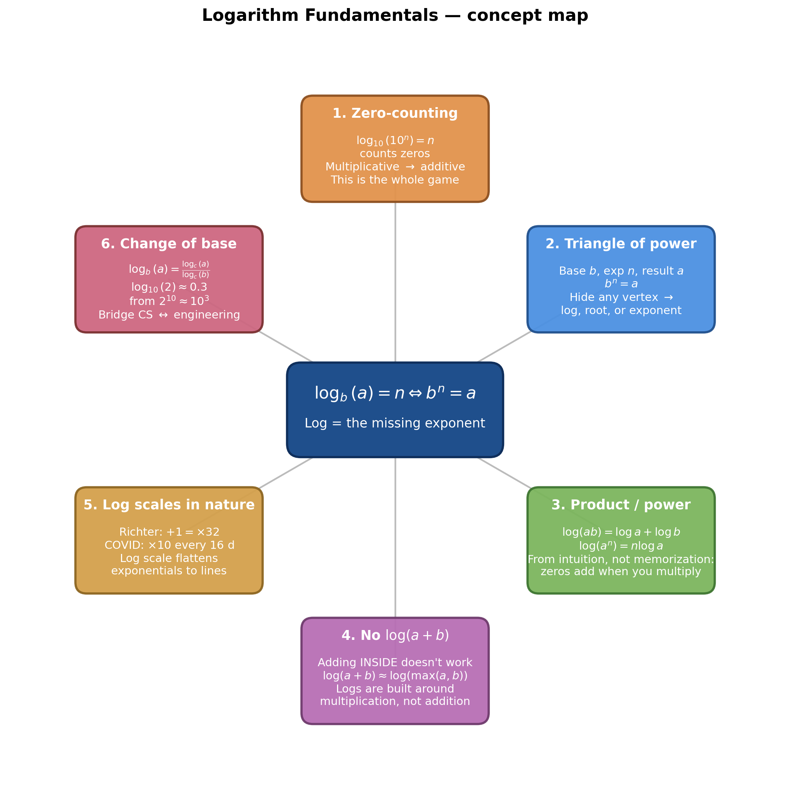
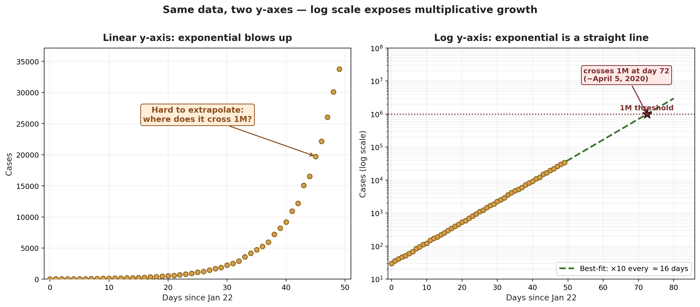
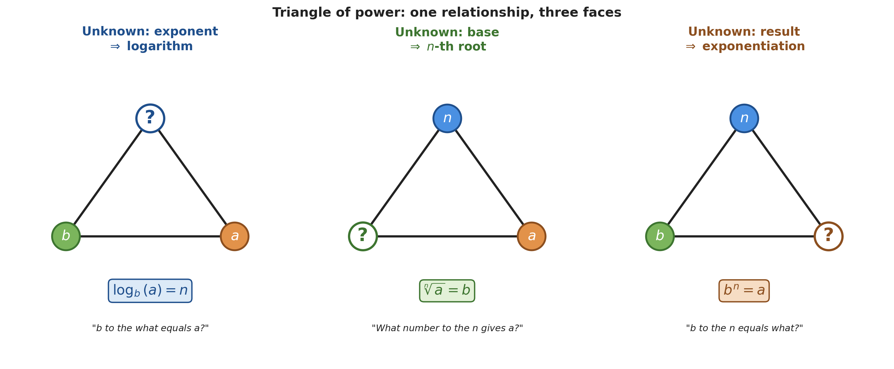
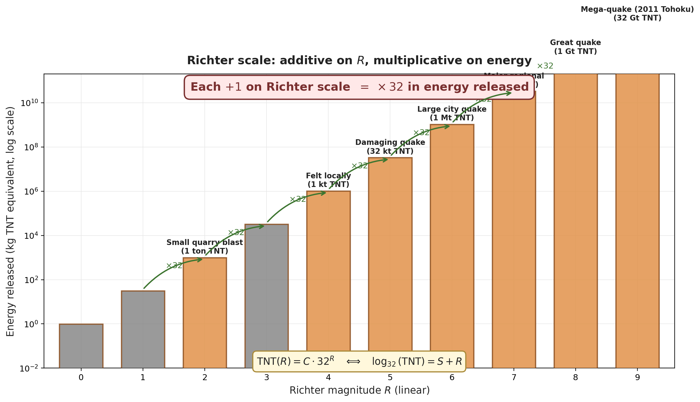
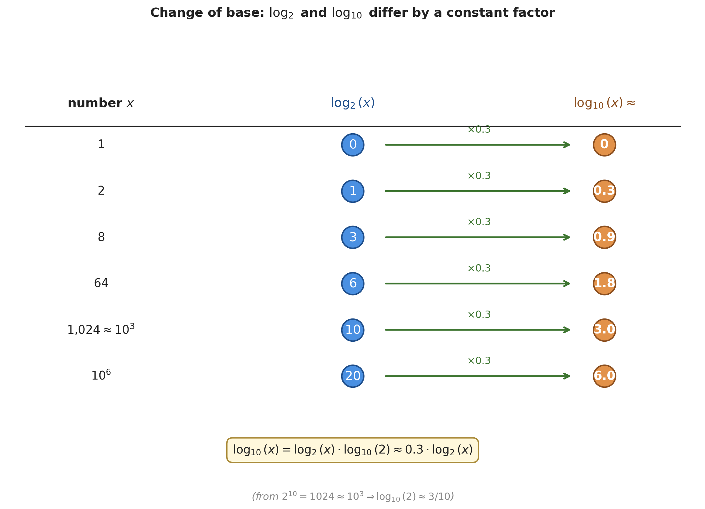

# Logarithm Fundamentals

*Source: [Lockdown Math — Ep. 6: Logarithm Fundamentals](https://www.youtube.com/watch?v=cEvgcoyZvB4) by Grant Sanderson / 3Blue1Brown (1:29:22). Lesson begins at [[5:36]](https://www.youtube.com/watch?v=cEvgcoyZvB4&t=336s) after the pre-show poll.*

---

> [!abstract] What this note is for
> Strip logarithms back to one tiny intuition: **a base-10 log just counts zeros in a power of 10**. Every "log rule" you've ever had to memorize falls out of that. By the end, the messy list — $\log(a\cdot b) = \log a + \log b$, $\log(a^n) = n\log a$, the change-of-base formula — feels obvious. The note also captures the Richter-scale and COVID-curve case studies that make logs feel useful, and the closing tangent on **complex logarithms** as multi-valued functions.

*Generated by matplotlib via `_gen_lf_mindmap.py` — six-topic concept map for this note.*

---

## 1. Why Logarithms Feel Hard *(at [[7:24]](https://www.youtube.com/watch?v=cEvgcoyZvB4&t=444s))*

The standard high-school treatment dumps five algebraic rules on a card and asks you to memorize them:

$$\log(a\cdot b) = \log a + \log b \qquad \log(a^n) = n\log a \qquad \log_b(a) = \tfrac{1}{\log_a(b)}$$
$$\log_c(b)\log_b(a) = \log_c(a) \qquad \log_b(a) = \tfrac{\log_c(a)}{\log_c(b)}$$

Quote: *"You end up having to learn… all these piles of rules that just look like a bunch of algebra that can be hard to remember and easy to mix things up in your head."* *(at [[7:24]](https://www.youtube.com/watch?v=cEvgcoyZvB4&t=444s))*

The trick is that all five fall out of one intuition.

---

## 2. The Core Intuition: Zero-Counting *(at [[9:12]](https://www.youtube.com/watch?v=cEvgcoyZvB4&t=552s))*

### 2.1 Logs as zero-counters

> [!definition] Definition — base-10 log as a zero-counter
> For a power of 10 expressed as $10^n$, $\log_{10}(10^n) = n$ — i.e., **log just counts the zeros**:
> $$\log(1) = 0,\quad \log(10) = 1,\quad \log(100) = 2,\quad \log(1{,}000) = 3,\quad \ldots,\quad \log(10^{12}) = 12$$
> Equivalently: *"$10$ to the what equals $x$?"*

Quote *(at [[9:15]](https://www.youtube.com/watch?v=cEvgcoyZvB4&t=555s))*: *"Logarithms are something that can take in a power of 10 and it just spits out the number of zeros at the end of the number… as we walk from 1 to 10 to 100 to 1000 to 10000, each step we're multiplying by 10, the output of the log just steps up in increments of 1."*

> [!tip] The lever
> Multiplicative steps in the *input* become additive steps in the *output*. That single fact is what every log rule below ultimately encodes.

### 2.2 Why this lights up everywhere *(at [[10:22]](https://www.youtube.com/watch?v=cEvgcoyZvB4&t=622s))*

In March 2020, Google Trends for "logarithmic scale" spiked because every news outlet was suddenly plotting COVID cases that way. The reason:

*Generated by matplotlib via `_gen_lf_fig1_linear_vs_log.py` — left panel: COVID cases outside mainland China on linear y-axis form a steep exponential curve. Right panel: same data on a log y-axis become roughly a straight line. The line's slope reveals the doubling/tenfold-time at a glance.*

> [!example] COVID-19 prediction from a log plot *(at [[12:54]](https://www.youtube.com/watch?v=cEvgcoyZvB4&t=774s))*
> **Problem.** Using cases data ending March 6, 2020, predict when global cases (outside mainland China) would cross 1 million.
> **Setup.** Plot the data on a log y-axis where each tick is ×10.
> **Solution.** On the log scale the curve is nearly linear. The best-fit slope: cases ×10 every 16 days. Extrapolate forward until the line hits the 1 M tick.
> **Answer.** ~30 days past March 6 → ~April 5.
> **Insight.** The actual 1 M case mark was hit right around April 5. The "naive" log-extrapolation got the prediction almost exactly right — because exponential growth becomes obvious on a log scale.

Quote *(at [[14:04]](https://www.youtube.com/watch?v=cEvgcoyZvB4&t=844s))*: *"Anytime that you're coming across something in nature where what's natural to think about are multiplicative increases, logarithms come in to help you."*

---

## 3. The Triangle of Power: One Relationship, Three Faces *(at [[14:20]](https://www.youtube.com/watch?v=cEvgcoyZvB4&t=860s))*

The three operations — exponentiation, root, logarithm — are three faces of the same triangle. With base $b$, exponent $n$, and result $a$ satisfying $b^n = a$:

*Generated by matplotlib via `_gen_lf_fig2_triangle_of_power.py` — three small triangles each missing a different vertex: knowing two of the trio determines the third, and which vertex is missing tells you which operation to use.*

| Unknown vertex | Operation | Notation |
|---|---|---|
| Top (exponent) | logarithm | $n = \log_b(a)$ |
| Bottom-left (base) | $n$-th root | $b = \sqrt[n]{a} = a^{1/n}$ |
| Bottom-right (result) | exponentiation | $a = b^n$ |

> [!tip] Mental shortcut *(at [[18:25]](https://www.youtube.com/watch?v=cEvgcoyZvB4&t=1105s))*
> *"Every time you see log of some value, you should think in your mind: 'whatever this number is, it really wants to be an exponent.'"*

### 3.1 Which base when none is written? *(at [[18:50]](https://www.youtube.com/watch?v=cEvgcoyZvB4&t=1130s))*

| Field | Default base |
|---|---|
| Math / pure mathematics | $\log \equiv \log_e = \ln$ |
| Engineering | $\log \equiv \log_{10}$ |
| Computer science | $\log \equiv \log_2$ |

This lecture uses $\log$ to mean $\log_{10}$ unless otherwise stated.

---

## 4. Log Rules Derived from Intuition

### 4.1 $\log(a\cdot b) = \log(a) + \log(b)$ *(at [[20:20]](https://www.youtube.com/watch?v=cEvgcoyZvB4&t=1220s))*

> [!example] Where the product rule comes from
> **Problem.** Why is $\log(1{,}000 \cdot x) = 3 + \log(x)$?
> **Setup.** Plug in $x = 100$ to get a concrete instance.
> **Solution.**
> - $\log(1{,}000 \cdot 100) = \log(100{,}000) = 5$
> - And $5 = 3 + 2 = \log(1{,}000) + \log(100)$
> **Answer.** $\log(1{,}000\cdot x) = 3 + \log(x)$ — the "+3" comes from $\log(1{,}000)$.
> **Insight** *(at [[23:26]](https://www.youtube.com/watch?v=cEvgcoyZvB4&t=1406s))*. *"When you take two powers of 10 and multiply them, you just take all of their zeros and cram them onto each other."* Multiplying inputs = adding zero-counts = adding logs.

### 4.2 $\log(a^n) = n\,\log(a)$ *(at [[24:55]](https://www.youtube.com/watch?v=cEvgcoyZvB4&t=1495s))*

> [!example] Where the power rule comes from
> **Problem.** Why does the exponent "hop down" in front?
> **Setup.** Consider $\log(100^3)$.
> **Solution.**
> - $\log(100^3) = \log(100\cdot 100\cdot 100) = \log(1{,}000{,}000) = 6$
> - Reading the answer differently: $6 = 3 \cdot 2$, i.e. *3 copies of 2 zeros*.
> - The 3 is the exponent ($n$); the 2 is $\log(100)$.
> **Answer.** $\log(100^3) = 3\cdot \log(100)$ — and generally $\log(x^n) = n\log(x)$.
> **Insight** *(at [[28:52]](https://www.youtube.com/watch?v=cEvgcoyZvB4&t=1732s))*. *"The little power hops down in front, and you just have log of what was on the inside."*

### 4.3 Logs as exponents turned inside out *(at [[30:33]](https://www.youtube.com/watch?v=cEvgcoyZvB4&t=1833s))*

The log rules are the exponent rules read inside-out:

| Exponent rule | $\xleftrightarrow{\;\text{inside-out}\;}$ | Log rule |
|---|:---:|---|
| $10^x \cdot 10^y = 10^{x+y}$ | | $\log(a \cdot b) = \log(a) + \log(b)$ |
| $(10^x)^n = 10^{nx}$ | | $\log(a^n) = n\log(a)$ |
| $b^x = a \iff b = a^{1/x}$ | | $\log_b(a) = 1/\log_a(b)$ |

Quote *(at [[30:33]](https://www.youtube.com/watch?v=cEvgcoyZvB4&t=1833s))*: *"They're like exponentiation turned inside out. The thing sitting on the inside of the log — you should think of that as the whole outer expression for something exponential."*

### 4.4 Swapping base and argument: $\log_b(a) = 1/\log_a(b)$ *(at [[33:36]](https://www.youtube.com/watch?v=cEvgcoyZvB4&t=2016s))*

> [!example] Why swapping gives the reciprocal
> **Problem.** Given $\log_{10}(1{,}000) = 3$, what is $\log_{1{,}000}(10)$?
> **Setup.** Ask "$1{,}000$ to what power gives $10$?"
> **Solution.** Start from $10^3 = 1{,}000$. Take the cube root of both sides: $10 = 1{,}000^{1/3}$. So the power that turns $1{,}000$ into $10$ is $1/3$.
> **Answer.** $\log_{1{,}000}(10) = 1/3 = 1/\log_{10}(1{,}000)$.
> **Insight.** Swapping base and argument always gives the reciprocal — it's just the algebraic mirror of $b^x = a \iff b = a^{1/x}$.

### 4.5 $\log(a+b)$ has no nice form *(at [[37:43]](https://www.youtube.com/watch?v=cEvgcoyZvB4&t=2263s))*

A quiz tried to trick the audience: which of these is true?

$$\log(a+b) \stackrel{?}{=} \log(a)+\log(b),\quad \log(a)\log(b),\quad \tfrac{1}{\log(a)+\log(b)},\quad \tfrac{1}{\log(a)\log(b)}$$

None of them. Plug in $a=10{,}000$, $b=100$: $\log(10{,}100)$ is just slightly more than $\log(10{,}000) = 4$ — there is no way to make $4$ and $2$ combine cleanly into it. The best you can say:

$$\log(a+b) \;\approx\; \log(\max(a,b)) \qquad (\text{when one term dominates})$$

> [!warning] No formula for $\log(a+b)$
> *(at [[43:35]](https://www.youtube.com/watch?v=cEvgcoyZvB4&t=2615s))* *"Sometimes you get something that looks like it's going to be a nice property, but it doesn't end up being a nice property."* Adding *inside* a log doesn't simplify because logs are built around multiplication, not addition.

### 4.6 Why $\log_0$ doesn't exist *(at [[44:14]](https://www.youtube.com/watch?v=cEvgcoyZvB4&t=2654s))*

Reading the triangle: $\log_0(y) = x$ would mean $0^x = y$. But $0^x = 0$ for any $x > 0$ — the map collapses everything to zero. There's no inverse, so no log base 0.

Quote *(at [[45:43]](https://www.youtube.com/watch?v=cEvgcoyZvB4&t=2743s))*: *"The exponential function with base zero is entirely zero. It doesn't map numbers in a nice one-to-one fashion."*

---

## 5. Real-World Logarithmic Scales

### 5.1 The Richter scale: every +1 means ×32 *(at [[46:05]](https://www.youtube.com/watch?v=cEvgcoyZvB4&t=2765s))*

*Generated by matplotlib via `_gen_lf_fig3_richter.py` — additive Richter magnitude on the x-axis vs energy released (TNT equivalent, log scale) on the y-axis. Each +1 step on the scale corresponds to ×32 in energy.*

> [!example] Decoding the Richter scale
> **Problem.** What does each +1 increment on the Richter scale physically mean?
> **Setup.** Reference table: magnitude 2 ≈ 1 ton TNT; magnitude 4 ≈ 1 kiloton; magnitude 5 ≈ 32 kilotons; magnitude 6 ≈ 1 megaton; magnitude 7 ≈ 32 megatons.
> **Solution.**
> - Magnitude $2 \to 4$ is +2 on the scale, and $1{,}000 / 1 = 1{,}000$ in energy.
> - Magnitude $4 \to 5$ is +1, and $32 / 1 = 32$ in energy.
> - Check: $32 \times 32 = 1{,}024 \approx 1{,}000$ ✓ (a +2 step should be a +1 step applied twice).
> **Answer.** Each +1 on Richter = ×32 in energy released.
> **Insight.** Formalizing: $\log_{32}(\text{TNT}) = S + R$, where $R$ is the Richter number and $S$ is a calibration offset. Exponentiating: $\text{TNT} = C \cdot 32^R$ for some constant $C = 32^S$.

Quote *(at [[51:55]](https://www.youtube.com/watch?v=cEvgcoyZvB4&t=3115s))*: *"When humans want to create a scale for something that accounts for a hugely wide variance in how big things can be, it's nice to take logarithms and then just put that on a single scale that basically squishes those numbers between 0 and 10."*

### 5.2 Halfway is multiplicative *(at [[39:51]](https://www.youtube.com/watch?v=cEvgcoyZvB4&t=2391s))*

> [!tip] What's halfway between 1 and 9?
> Ask a child: their gut answer is often **3**, not 5 — because their intuition is multiplicative ($1 \to 3 \to 9$, each step ×3) before schooling drills the additive average into them. Powers of 3 walk: $1, 3, 9, 27, 81 = 3^0, 3^1, 3^2, 3^3, 3^4$. The "logarithmic midpoint" of $a$ and $b$ is $\sqrt{ab}$, not $\tfrac{a+b}{2}$.

---

## 6. Translating Between Bases

### 6.1 The 0.3 magic: $\log_{10}(2) \approx 0.3$ *(at [[56:40]](https://www.youtube.com/watch?v=cEvgcoyZvB4&t=3400s))*

The single most useful approximation in this entire video.

> [!example] Deriving $\log_{10}(2) \approx 0.3$ from $2^{10} \approx 10^3$
> **Problem.** Approximate $\log_{10}(2)$ using the convenient fact $2^{10} = 1024 \approx 1000 = 10^3$.
> **Setup.** Let $\log_2(10) = x$, i.e. $2^x = 10$.
> **Solution.**
> - Substitute $10 = 2^x$ into $10^3 \approx 2^{10}$: $(2^x)^3 \approx 2^{10}$
> - Apply exponent rules: $2^{3x} \approx 2^{10}$
> - Equate exponents (exponentiation is one-to-one): $3x \approx 10$, so $x \approx 10/3$
> - Therefore $\log_2(10) \approx 10/3$, and **$\log_{10}(2) = 1/\log_2(10) \approx 3/10 = 0.3$**.
> **Answer.** $\log_{10}(2) \approx 0.3$.
> **Insight.** Why this is so useful: combined with the swap rule, this lets you convert between base-2 and base-10 thinking effortlessly. CS uses base 2; engineering uses base 10; the 0.3 multiplier is the bridge.

| $n$ | $2^n$ | $\log_{10}(2^n) = n\log_{10}(2) \approx 0.3 n$ |
|---|---|---|
| 10 | $1024 \approx 10^3$ | $\approx 3$ ✓ |
| 20 | $\approx 10^6$ (1 million) | $\approx 6$ ✓ |
| 30 | $\approx 10^9$ (1 billion) | $\approx 9$ ✓ |

### 6.2 The change-of-base formula *(at [[72:22]](https://www.youtube.com/watch?v=cEvgcoyZvB4&t=4342s))*

> [!definition] Definition — change of base
> For any positive base $c$,
> $$\log_b(a) \;=\; \frac{\log_c(a)}{\log_c(b)}$$

**Derivation** *(at [[71:10]](https://www.youtube.com/watch?v=cEvgcoyZvB4&t=4270s))*:

1. Set $b^x = a$, equivalent to $x = \log_b(a)$.
2. Set $c^y = b$, equivalent to $y = \log_c(b)$.
3. Substitute the second into the first: $(c^y)^x = a$, i.e. $c^{xy} = a$. So $\log_c(a) = xy$.
4. Therefore $\log_c(a) = \log_b(a) \cdot \log_c(b)$, which rearranges to the change-of-base formula.

### 6.3 Worked examples

> [!example] Computing $\log_{100}(1{,}000{,}000)$ via change of base *(at [[68:50]](https://www.youtube.com/watch?v=cEvgcoyZvB4&t=4130s))*
> **Problem.** Evaluate $\log_{100}(1{,}000{,}000)$ without a "log base 100" calculator button.
> **Setup.** Use base $c = 10$ as the intermediate.
> **Solution.** $\log_{100}(1{,}000{,}000) = \dfrac{\log_{10}(1{,}000{,}000)}{\log_{10}(100)} = \dfrac{6}{2} = 3$.
> **Answer.** $3$ (which makes sense — $100^3 = 1{,}000{,}000$).
> **Insight.** $\log_c(b) \cdot \log_b(a) = \log_c(a)$ says "additive steps via $b$" times "additive steps from $b$ via $c$" = "additive steps via $c$." Dividing instead of multiplying reverses one of those legs.

*Generated by matplotlib via `_gen_lf_fig4_change_of_base.py` — parallel tables showing $\log_2$ and $\log_{10}$ values for the same numbers; the $\log_{10}$ row is exactly $0.3\times$ the $\log_2$ row, because $\log_{10}(x) = \log_2(x)\cdot\log_{10}(2) \approx \log_2(x)\cdot 0.3$.*

### 6.4 The natural log *(at [[74:31]](https://www.youtube.com/watch?v=cEvgcoyZvB4&t=4471s))*

$\ln \equiv \log_e$ is the default in pure math and the only $\log$ most software calculators expose. To compute any base-10 log from $\ln$:

$$\log_{10}(x) \;=\; \frac{\ln(x)}{\ln(10)}$$

> [!example] Computing $\log_{10}(57)$ via $\ln$ *(at [[75:20]](https://www.youtube.com/watch?v=cEvgcoyZvB4&t=4520s))*
> **Problem.** Compute $\log_{10}(57)$.
> **Setup.** $57$ lies between $10^1 = 10$ and $10^2 = 100$, so the answer is between $1$ and $2$.
> **Solution.** $\log_{10}(57) = \frac{\ln(57)}{\ln(10)} \approx 1.75587$.
> **Answer.** $\approx 1.756$.
> **Insight.** Plug $\ln$ values into change-of-base and you can build any base-10 log out of a single function.

---

## 7. Complex Logarithms: Multi-Valued Functions *(at [[77:17]](https://www.youtube.com/watch?v=cEvgcoyZvB4&t=4637s))*

In the Q&A, the audience asks whether logs of negative or complex numbers make sense. The answer touches a deep idea — **logarithms are multi-valued**.

### 7.1 Square roots as multi-valued

> [!example] $\sqrt{25}$ has two answers
> **Problem.** Solve $x^2 = 25$.
> **Setup.** Both $5$ and $-5$ square to $25$.
> **Answer.** $\sqrt{25} = \pm 5$.
> **Insight** *(at [[78:44]](https://www.youtube.com/watch?v=cEvgcoyZvB4&t=4724s))*. *"The square root function isn't a function — it's a multi-valued function. It always has two different outputs."* We usually take the principal (positive) branch by convention.

For $\sqrt{i}$: $\sqrt{i} = \pm\left(\tfrac{\sqrt{2}}{2} + \tfrac{\sqrt{2}}{2}\,i\right)$ — two values on the unit circle.

### 7.2 Complex logs are infinitely-many-valued *(at [[79:20]](https://www.youtube.com/watch?v=cEvgcoyZvB4&t=4760s))*

From the Imaginary Interest note, $e^{2\pi i} = 1$ — so $e$ raised to *any* integer multiple of $2\pi i$ gives $1$. Therefore:

$$\log_e(1) \in \{0,\; 2\pi i,\; 4\pi i,\; \ldots,\; 2\pi n\, i,\; \ldots\}$$

Quote *(at [[80:19]](https://www.youtube.com/watch?v=cEvgcoyZvB4&t=4819s))*: *"If we're letting complex numbers into the mix, you would have to honestly say, well, $2\pi i$ is another pretty good answer to this question, because $e^{2\pi i}$ also equals 1."*

This proliferation of values is captured by a **Riemann surface** — a spiraling 3D structure where each "sheet" represents one branch of the log. The complex log is single-valued only after you cut the plane along some branch.

> [!info] Cross-reference
> The continuous $e^{it}$ machinery driving this multi-valued behavior comes from *[Imaginary Interest and Continuous Rotation (Main)](<Imaginary Interest and Continuous Rotation (Main).md>)* §5 — $e^{it}$ traces the unit circle with period $2\pi$, so the inverse (log) must be defined modulo $2\pi i$.

---

## 8. Challenge Problem: The Factorial Sum *(at [[84:05]](https://www.youtube.com/watch?v=cEvgcoyZvB4&t=5045s))*

The video ends with a challenge problem (cut off mid-solution):

$$\frac{1}{\log_2(100!)} + \frac{1}{\log_3(100!)} + \dots + \frac{1}{\log_{100}(100!)} \;=\; \;?$$

**Setup hint** *(at [[88:46]](https://www.youtube.com/watch?v=cEvgcoyZvB4&t=5326s))*: apply the product rule $\log(a\cdot b) = \log(a)+\log(b)$ and change-of-base.

**Solution** (derivable from the rules above):
1. By change-of-base: $\log_n(100!) = \dfrac{\log(100!)}{\log(n)}$, so $\dfrac{1}{\log_n(100!)} = \dfrac{\log(n)}{\log(100!)}$.
2. Sum from $n = 2$ to $n = 100$: $\sum_{n=2}^{100} \dfrac{\log(n)}{\log(100!)} = \dfrac{1}{\log(100!)} \sum_{n=2}^{100} \log(n)$.
3. By the product rule: $\sum_{n=2}^{100} \log(n) = \log(2\cdot 3\cdot 4 \cdots 100) = \log(100!)$.
4. So the sum equals $\dfrac{\log(100!)}{\log(100!)} = 1$.

**Answer.** $\boxed{1}$ — independent of which logarithm base you use.

---

## Key Takeaways

1. **One intuition replaces five rules**: a base-10 log counts zeros, i.e. converts multiplication on the input into addition on the output. The product rule, power rule, swap rule, and change-of-base all follow.
2. **Triangle of power**: $b^n = a$ has three "missing-vertex" views — exponent ($b^n$), root ($\sqrt[n]{a}$), and log ($\log_b a$).
3. **Logs and exponents are inside-out**: the rule $\log(a\cdot b) = \log(a)+\log(b)$ is the mirror of $10^x\cdot 10^y = 10^{x+y}$.
4. **$\log_{10}(2) \approx 0.3$**, derived from $2^{10} \approx 10^3$, lets you translate between base-2 (CS) and base-10 (engineering) on the fly.
5. **Change of base**: $\log_b(a) = \log_c(a)/\log_c(b)$ for any helper base $c$. Combined with $\ln$, you can compute any log from any calculator.
6. **No nice form for $\log(a+b)$** — logs are built around multiplication, not addition. Best you get: $\log(a+b) \approx \log(\max(a,b))$.
7. **Real-world log scales** (Richter, COVID, sound, Google Trends) are everywhere because reality is multiplicative; a log scale flattens that into linear visual intuition.
8. **Complex log is multi-valued**: $\log_e(1) \in \{2\pi n\, i : n \in \mathbb{Z}\}$ — captured by Riemann surfaces.

---

## Related Documents

- **[Imaginary Interest and Continuous Rotation (Main)](<Imaginary Interest and Continuous Rotation (Main).md>)** — Same 3B1B Lockdown Math series; derives $e^{it}$ and the period-$2\pi$ behavior that makes complex $\log$ multi-valued.
- **[Euler's Formula via exp(x) (Main)](<Euler's Formula via exp(x) (Main).md>)** — The polynomial definition of $\exp(x)$ that ties together everything in §7.

---

### Source

| Source | Date | Type |
|---|---|---|
| [Lockdown Math — Ep. 6: Logarithm Fundamentals](https://www.youtube.com/watch?v=cEvgcoyZvB4) | 2020 (3Blue1Brown live series) | YouTube lecture, 1:29:22 |
