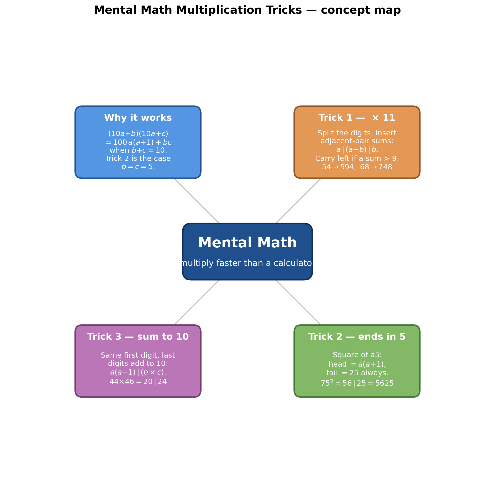
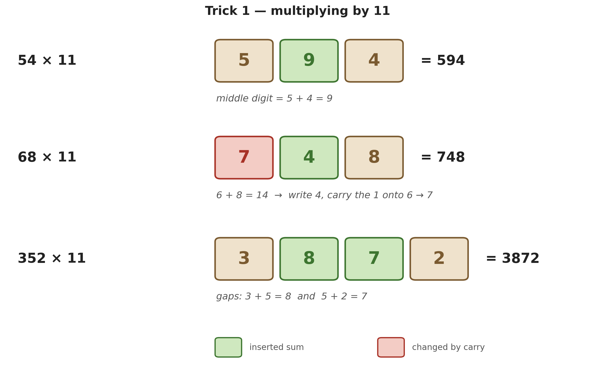
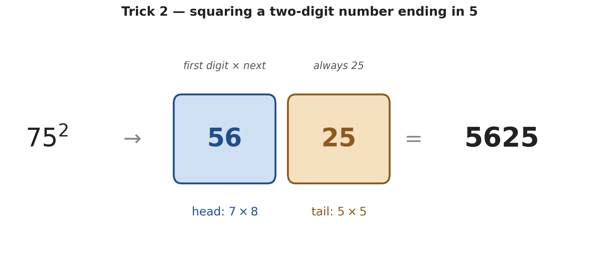
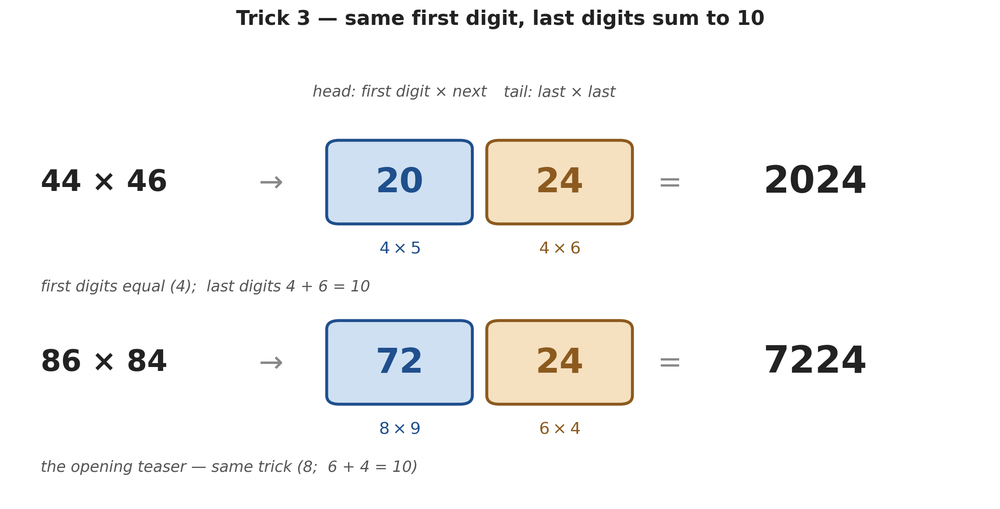

# Mental Math — Multiplication Tricks (Part 1)

*Path C single-source note — extracted from a mental-math video (owl-logo channel) via Gemini frame-by-frame analysis (00:00–05:05). Topics regrouped textbook-style; every timestamp is a clickable deep-link. The "why it works" section (§4) is added — the video only shows the method.*

| Field | Value |
|---|---|
| **Source** | [Mental Math Multiplication Tricks](https://www.youtube.com/watch?v=1wAr2Kbe-GM) |
| **Length** | 05:05 |
| **Topic** | Three multiplication shortcuts done faster than a calculator: ×11, squaring numbers ending in 5, and "same first digit / last digits sum to 10" |
| **Captured** | 2026-06-04 |
| **Series** | Part 1 of 2 — see [[mental_math_tricks_part_2\|Part 2: ÷5, adding by rounding, the percentage swap, the 7·8·9 tables, and 2-digit ×]] |

> [!info] The hook
> The video opens with **86 × 84** and reveals **7224** in five seconds *(at [[0:04]](https://www.youtube.com/watch?v=1wAr2Kbe-GM&t=4s))* — *"faster than the snap of Thanos."* That teaser is secretly **Trick 3** below. All three tricks are pattern-recognition shortcuts for specific shapes of multiplication; §4 shows the one-line algebra that makes each one work (and reveals that Trick 2 is just a special case of Trick 3).

---

## 1. Trick 1 — Multiplying by 11 *(at [[0:41]](https://www.youtube.com/watch?v=1wAr2Kbe-GM&t=41s))*

### 1.1 Two-digit × 11: split and insert the sum

> [!tip] The rule
> Pull the two digits apart and drop their **sum** into the gap: $\overline{ab} \times 11 = a\,|\,(a+b)\,|\,b$.

> [!example] $54 \times 11$ *(at [[1:15]](https://www.youtube.com/watch?v=1wAr2Kbe-GM&t=75s))*
> **Method.** Split $5\;\_\;4$; middle $= 5+4 = 9$.
> **Answer.** $5\,|\,9\,|\,4 = \mathbf{594}$.

(Also shown: $43 \times 11 = 4\,|\,7\,|\,3 = 473$ *(at [[1:01]](https://www.youtube.com/watch?v=1wAr2Kbe-GM&t=61s))*.)

### 1.2 When the middle sum is 10 or more — carry *(at [[1:24]](https://www.youtube.com/watch?v=1wAr2Kbe-GM&t=84s))*

> [!example] $68 \times 11$ (the carry case)
> **Method.** Middle $= 6+8 = 14$ → write the tentative $6\,|\,14\,|\,8$, then **carry the 1** from 14 onto the left digit: $6+1 = 7$.
> **Answer.** $7\,|\,4\,|\,8 = \mathbf{748}$.

### 1.3 Three-digit × 11: add each adjacent pair *(at [[2:00]](https://www.youtube.com/watch?v=1wAr2Kbe-GM&t=120s))*

> [!tip] The rule
> Keep the outer digits; fill the two gaps with the **adjacent-pair sums**: $\overline{abc}\times 11 = a\,|\,(a{+}b)\,|\,(b{+}c)\,|\,c$, carrying left whenever a sum exceeds 9.

> [!example] $352 \times 11$ *(at [[2:05]](https://www.youtube.com/watch?v=1wAr2Kbe-GM&t=125s))*
> **Method.** $3\;\_\;\_\;2$; first gap $3+5=8$, second gap $5+2=7$.
> **Answer.** $3\,|\,8\,|\,7\,|\,2 = \mathbf{3872}$.

> [!example] $574 \times 11$ (with carrying) *(at [[2:26]](https://www.youtube.com/watch?v=1wAr2Kbe-GM&t=146s))*
> **Method.** Gaps: $5+7 = 12$, $7+4 = 11$ → tentative $5\,|\,12\,|\,11\,|\,4$.
> Carry right-to-left: the $1$ of $11$ goes onto the $2$ → $3$ (leaving $1$); the $1$ of $12$ goes onto the $5$ → $6$ (leaving $2$).
> **Answer.** $6\,|\,3\,|\,1\,|\,4 = \mathbf{6314}$.

*Generated by matplotlib via `_gen_mm_fig1_eleven.py` — the ×11 digit choreography: split the number, drop adjacent-digit sums into the gaps, and carry left when a gap exceeds 9. Shows $54{\to}594$, the carry case $68{\to}748$, and the 3-digit $352{\to}3872$.*

---

## 2. Trick 2 — Squaring a two-digit number ending in 5 *(at [[2:51]](https://www.youtube.com/watch?v=1wAr2Kbe-GM&t=171s))*

> [!tip] The rule
> For $\overline{a5}^{\,2}$: multiply the first digit by the **next** integer, $a(a+1)$, then tack **25** on the end.

> [!example] $75 \times 75$ *(at [[3:00]](https://www.youtube.com/watch?v=1wAr2Kbe-GM&t=180s))*
> **Method.** First digit $7$; $7 \times 8 = 56$; append $25$.
> **Answer.** $56\,|\,25 = \mathbf{5625}$.

> [!example] $35 \times 35$ *(at [[3:20]](https://www.youtube.com/watch?v=1wAr2Kbe-GM&t=200s))*
> **Method.** $3 \times 4 = 12$; append $25$.
> **Answer.** $\mathbf{1225}$.

*Generated by matplotlib via `_gen_mm_fig2_square5.py` — $75^2$: the head is $7\times 8 = 56$, the tail is always $25$, giving $5625$.*

> [!question] Practice *(at [[3:32]](https://www.youtube.com/watch?v=1wAr2Kbe-GM&t=212s))*
> The video leaves $95 \times 95$ for the viewer. *(Answer: $9\times 10 = 90$, append $25$ → $\mathbf{9025}$.)*

---

## 3. Trick 3 — Same first digit, last digits sum to 10 *(at [[3:38]](https://www.youtube.com/watch?v=1wAr2Kbe-GM&t=218s))*

> [!tip] The rule
> When both numbers share the first digit $a$ **and** their last digits $b, c$ satisfy $b+c = 10$:
> write $a(a+1)$ followed by the product $b\times c$ (as a two-digit block).

> [!example] $44 \times 46$ *(at [[4:02]](https://www.youtube.com/watch?v=1wAr2Kbe-GM&t=242s))*
> **Check.** Same first digit $4$; last digits $4+6 = 10$. ✓
> **Method.** Head: $4 \times 5 = 20$. Tail: $4 \times 6 = 24$.
> **Answer.** $20\,|\,24 = \mathbf{2024}$.

> [!example] $67 \times 63$ *(at [[4:15]](https://www.youtube.com/watch?v=1wAr2Kbe-GM&t=255s))*
> **Check.** First digit $6$; $7+3 = 10$. ✓
> **Method.** Head: $6 \times 7 = 42$. Tail: $7 \times 3 = 21$.
> **Answer.** $42\,|\,21 = \mathbf{4221}$.

*Generated by matplotlib via `_gen_mm_fig3_sum10.py` — $44\times 46$: head $4\times 5 = 20$, tail $4\times 6 = 24$, giving $2024$. The opening teaser $86\times 84 = 7224$ is the same trick.*

> [!warning] The tail must be two digits
> If $b \times c < 10$, pad it with a leading zero. The practice problem $89 \times 81$ *(at [[4:35]](https://www.youtube.com/watch?v=1wAr2Kbe-GM&t=275s))* gives head $8\times 9 = 72$ and tail $9\times 1 = 9 \to \mathbf{09}$, so the answer is $72\,|\,09 = \mathbf{7209}$, **not** 729.

---

## 4. Why the tricks work (the one-line algebra)

The video teaches the *how*; here is the *why*. Write a two-digit number as $10a+b$.

> [!definition] Trick 1 (×11)
> $$(10a+b)\times 11 = (10a+b)\cdot 10 + (10a+b) = 100a + 10(a+b) + b.$$
> Reading off the place values gives digits $a \mid (a+b) \mid b$ — and a sum $a+b \ge 10$ spills a carry into the hundreds, exactly the "carry the 1" rule. For three digits the same expansion gives $a \mid (a{+}b) \mid (b{+}c) \mid c$.

> [!definition] Trick 3 (same first digit $a$, last digits $b+c = 10$)
> $$(10a+b)(10a+c) = 100a^2 + 10a(b+c) + bc = 100a^2 + 100a + bc = 100\,\underbrace{a(a+1)}_{\text{head}} + \underbrace{bc}_{\text{tail}}.$$
> The $100\,a(a+1)$ places the head two slots up; $bc$ occupies the last two slots (hence the leading-zero rule when $bc<10$).

> [!tip] Trick 2 is a special case of Trick 3
> Squaring $\overline{a5}$ means $b = c = 5$, so $b+c = 10$ and $bc = 25$. Substituting into the identity above:
> $$(10a+5)^2 = 100\,a(a+1) + 25.$$
> That's why the tail is *always* $25$ — it's just $5\times 5$.

---

## Key takeaways

- **×11:** split the digits and insert adjacent-pair sums ($a\,|\,a{+}b\,|\,b$), carrying left when a sum is $\ge 10$. Works for 3-digit numbers too.
- **Square ending in 5:** $\overline{a5}^2 = a(a{+}1)\,|\,25$.
- **Same first digit, last digits sum to 10:** $a(a{+}1)\,|\,(b\times c)$, padding the tail to two digits.
- **One identity rules two of them:** $(10a+b)(10a+c) = 100\,a(a{+}1) + bc$ whenever $b+c=10$; squaring-ending-in-5 is the case $b=c=5$.
- Every trick is just choosing a *shape* of multiplication where the long-form arithmetic collapses to one multiply-and-place step.

---

### Sources

| Source | Section | Type |
|---|---|---|
| [Mental Math Multiplication Tricks](https://www.youtube.com/watch?v=1wAr2Kbe-GM) | 00:00 → 05:05 | YouTube |
| [[mental_math_tricks_part_2\|Mental Math — Five More Tricks (Part 2)]] | companion note | Vault |
