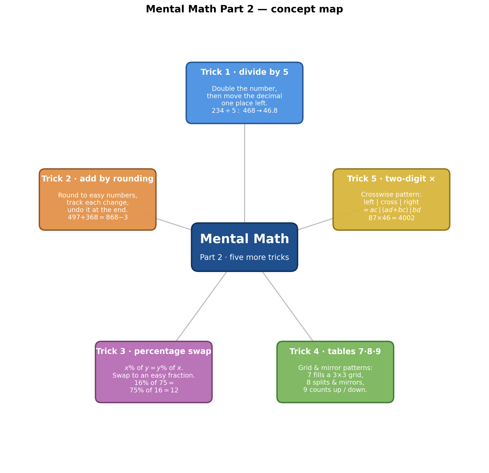
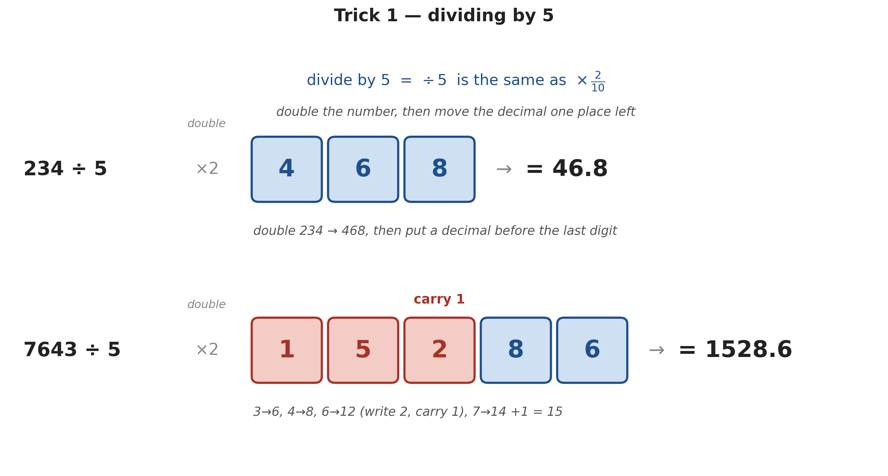
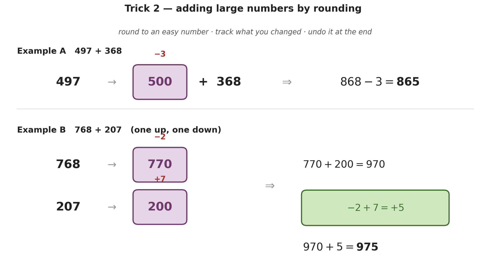
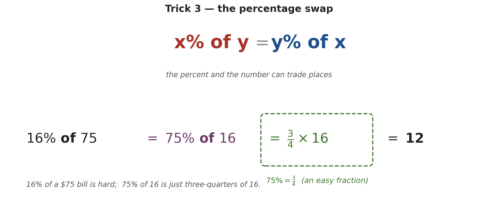
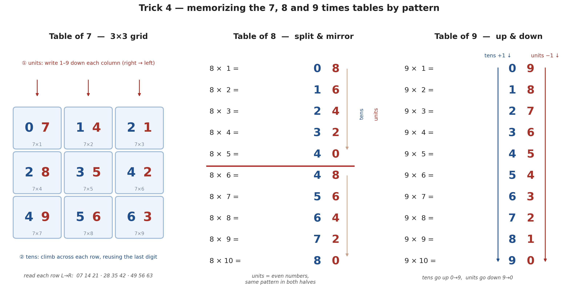
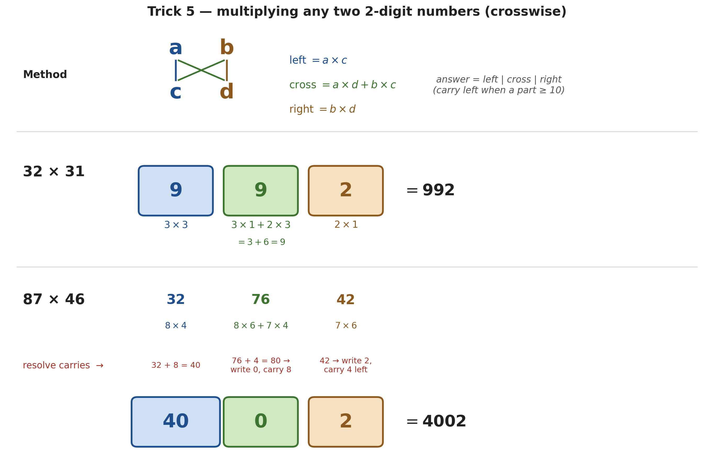

# Mental Math — Five More Tricks (Part 2)

*Path C single-source note — extracted from the mental-math video (owl-logo channel, **Part 2** of [[Mental Math Multiplication Tricks (Main)|Part 1]]) via Gemini frame-by-frame analysis (00:00–10:29). Topics regrouped textbook-style; every timestamp is a clickable deep-link. The "why it works" section (§6) is added — the video only shows the methods.*

| Field | Value |
|---|---|
| **Source** | [5 Mental Math Tricks (Part 2)](https://www.youtube.com/watch?v=YllkyKiQMS8) |
| **Length** | 10:29 |
| **Topic** | Five more calculator-beating shortcuts: dividing by 5, adding by rounding, the percentage swap, the 7·8·9 times tables, and multiplying any two 2-digit numbers |
| **Captured** | 2026-06-04 |
| **Series** | Part 2 of 2 — see [[Mental Math Multiplication Tricks (Main)|Part 1: ×11, squaring-in-5, sum-to-10]] |

> [!info] The hook
> The video opens by daring you to compute **46 × 68** in 7 seconds *(at [[0:19]](https://www.youtube.com/watch?v=YllkyKiQMS8&t=19s))* — the answer **3128** falls out of **Trick 5** below. Where [[Mental Math Multiplication Tricks (Main)|Part 1]] collapsed three *special shapes* of multiplication, Part 2 widens the net: a division shortcut, an addition shortcut, a percentage shortcut, a memory pattern for the hardest times-tables, and the **general** 2-digit multiplication that contains Part 1's tricks as special cases (§6).

---

## 1. Trick 1 — Dividing by 5 *(at [[0:50]](https://www.youtube.com/watch?v=YllkyKiQMS8&t=50s))*

> [!tip] The rule
> To divide by 5: **double the number, then move the decimal one place left.** *(at [[1:03]](https://www.youtube.com/watch?v=YllkyKiQMS8&t=63s))* Double digit-by-digit from the right, carrying as usual.

> [!example] $234 \div 5$ *(at [[1:13]](https://www.youtube.com/watch?v=YllkyKiQMS8&t=73s))*
> **Method.** Double $234 \to 468$; put the decimal before the last digit.
> **Answer.** $\mathbf{46.8}$.

> [!example] $7643 \div 5$ — the carry case *(at [[1:35]](https://www.youtube.com/watch?v=YllkyKiQMS8&t=95s))*
> **Method.** Double right-to-left: $3{\to}6$, $4{\to}8$, $6{\to}12$ (write $2$, carry $1$), $7{\to}14{+}1 = 15$. That gives $15286$; decimal before the last digit.
> **Answer.** $\mathbf{1528.6}$.

*Generated by matplotlib via `_gen_mm2_fig1_div5.py` — double each digit (carrying when a double exceeds 9), then shift the decimal one place left. Shows the clean case $234\div5 = 46.8$ and the carry case $7643\div5 = 1528.6$.*

> [!question] Practice *(at [[2:06]](https://www.youtube.com/watch?v=YllkyKiQMS8&t=126s))*
> The video leaves $9723 \div 5$ for the viewer. *(Answer: double $\to 19446$, shift $\to \mathbf{1944.6}$.)*

---

## 2. Trick 2 — Adding large numbers by rounding *(at [[2:13]](https://www.youtube.com/watch?v=YllkyKiQMS8&t=133s))*

> [!tip] The rule
> **Round** each awkward number to a clean one, **track** how much you added or removed, add the clean numbers, then **undo** the adjustment at the end. Rounding *up* means subtract it back; rounding *down* means add it back.

> [!example] $497 + 368$ — round one number *(at [[2:18]](https://www.youtube.com/watch?v=YllkyKiQMS8&t=138s))*
> **Method.** $497 \to 500$ (added $3$). Then $500 + 368 = 868$, and undo: $868 - 3$.
> **Answer.** $\mathbf{865}$.

> [!example] $643 + 189$ — round both *(at [[2:48]](https://www.youtube.com/watch?v=YllkyKiQMS8&t=168s))*
> **Method.** $643 \to 650$ (correction $-7$), $189 \to 200$ (correction $-11$). Then $650 + 200 = 850$, and undo both: $850 - 11 - 7$.
> **Answer.** $\mathbf{832}$.

> [!example] $768 + 207$ — opposite directions *(at [[3:23]](https://www.youtube.com/watch?v=YllkyKiQMS8&t=203s))*
> **Method.** $768 \to 770$ (correction $-2$, rounded up), $207 \to 200$ (correction $+7$, rounded down). Then $770 + 200 = 970$. **Combine** the corrections first: $-2 + 7 = +5$, so $970 + 5$.
> **Answer.** $\mathbf{975}$.

*Generated by matplotlib via `_gen_mm2_fig2_rounding.py` — round to a clean number (purple), tag the correction in red, then apply the **net** correction at the end. The opposite-direction case nets $-2 + 7 = +5$.*

> [!question] Practice *(at [[3:55]](https://www.youtube.com/watch?v=YllkyKiQMS8&t=235s))*
> The video leaves $396 + 697$. *(Round to $400$ and $700$: corrections $-4$ and $-3$; $1100 - 7 = \mathbf{1093}$.)*

---

## 3. Trick 3 — The percentage swap *(at [[4:03]](https://www.youtube.com/watch?v=YllkyKiQMS8&t=243s))*

> [!tip] The rule
> $x\%$ **of** $y \;=\; y\%$ **of** $x$ *(at [[4:21]](https://www.youtube.com/watch?v=YllkyKiQMS8&t=261s))*. Swap the percent and the number; if the new percent is a familiar fraction ($75\% = \tfrac34$, $50\% = \tfrac12$), the arithmetic becomes trivial. The speaker stresses this *"always holds true, no matter what"* — no exceptions.

> [!example] A $16\%$ tip on a &#36;75 bill *(at [[4:32]](https://www.youtube.com/watch?v=YllkyKiQMS8&t=272s))*
> **Method.** $16\%$ of $75 = 75\%$ of $16 = \tfrac34 \times 16$.
> **Answer.** **&#36;12**.

*Generated by matplotlib via `_gen_mm2_fig3_pct.py` — $16\%$ of $75$ is hard, but the swapped $75\%$ of $16$ is just three-quarters of $16 = 12$.*

> [!question] Challenges *(at [[5:02]](https://www.youtube.com/watch?v=YllkyKiQMS8&t=302s))*
> The video leaves two: $4\%$ of $75$ *(swap → $75\%$ of $4 = \mathbf{3}$)* and $148\%$ of $25$ *(swap → $25\%$ of $148 = \tfrac14 \times 148 = \mathbf{37}$)*.

---

## 4. Trick 4 — The 7, 8 and 9 times tables *(at [[5:09]](https://www.youtube.com/watch?v=YllkyKiQMS8&t=309s))*

These three "hard" tables each have a visual pattern. The unifying idea (§6): $7, 8, 9 = 10 - 3, 10 - 2, 10 - 1$, so every step drops the units digit by $3, 2, 1$ and lifts the tens digit by $1$.

*Generated by matplotlib via `_gen_mm2_fig4_tables789.py` — the three layouts side by side: the 7-table fills a 3×3 grid, the 8-table splits down the middle and mirrors, the 9-table runs tens up while units run down. Tens are blue, units red.*

> [!example] Table of 7 — a 3×3 grid *(at [[5:27]](https://www.youtube.com/watch?v=YllkyKiQMS8&t=327s))*
> **Units:** write $1$–$9$ down each column, filling columns **right → left**. **Tens:** fill row by row left→right, each row *starting with the digit that ended the previous row* ($0,1,2$ / $2,3,4$ / $4,5,6$).
> **Result.** Reading rows L→R: $07\;14\;21 \,/\, 28\;35\;42 \,/\, 49\;56\;63$ — i.e. $7{\times}1$ through $7{\times}9$.

> [!example] Table of 8 — split and mirror *(at [[6:04]](https://www.youtube.com/watch?v=YllkyKiQMS8&t=364s))*
> **Tens:** down the list $0,1,2,3,4$, then **repeat $4$** past the midpoint, then $4,5,6,7,8$. **Units:** even numbers $8,6,4,2,0$ — the *same* pattern in each half.
> **Result.** $08,16,24,32,40 \,/\, 48,56,64,72,80$.

> [!example] Table of 9 — up and down *(at [[6:48]](https://www.youtube.com/watch?v=YllkyKiQMS8&t=408s))*
> **Units** count **down** $9,8,7,\dots,0$; **tens** count **up** $0,1,2,\dots,9$. *(The digits of every multiple of 9 sum to 9.)*
> **Result.** $09,18,27,36,45,54,63,72,81,90$.

---

## 5. Trick 5 — Multiplying any two 2-digit numbers *(at [[7:34]](https://www.youtube.com/watch?v=YllkyKiQMS8&t=454s))*

> [!tip] The rule (vertically and crosswise)
> For $\overline{ab} \times \overline{cd}$, build the answer in three blocks:
> **left** $= a \times c$ · **cross** $= a{\times}d + b{\times}c$ · **right** $= b \times d$.
> Write **left | cross | right**, carrying left whenever a block reaches two digits.

> [!example] $32 \times 31$ — no carries *(at [[7:41]](https://www.youtube.com/watch?v=YllkyKiQMS8&t=461s))*
> **Method.** left $= 3{\times}3 = 9$; right $= 2{\times}1 = 2$; cross $= 3{\times}1 + 2{\times}3 = 9$.
> **Answer.** $9\,|\,9\,|\,2 = \mathbf{992}$.

> [!example] $54 \times 42$ — one carry *(at [[8:20]](https://www.youtube.com/watch?v=YllkyKiQMS8&t=500s))*
> **Method.** left $= 5{\times}4 = 20$; right $= 4{\times}2 = 8$; cross $= 5{\times}2 + 4{\times}4 = 26$ → write $6$, carry $2$ onto $20 \to 22$.
> **Answer.** $22\,|\,6\,|\,8 = \mathbf{2268}$.

> [!example] $87 \times 46$ — two carries *(at [[9:05]](https://www.youtube.com/watch?v=YllkyKiQMS8&t=545s))*
> **Method.** left $= 8{\times}4 = 32$; right $= 7{\times}6 = 42$ → write $2$, carry $4$; cross $= 8{\times}6 + 7{\times}4 = 76$, add the carried $4 \to 80$ → write $0$, carry $8$ onto $32 \to 40$.
> **Answer.** $40\,|\,0\,|\,2 = \mathbf{4002}$.

*Generated by matplotlib via `_gen_mm2_fig5_crossmult.py` — the crosswise schematic (left, cross, right) with the clean case $32{\times}31 = 992$ and the double-carry case $87{\times}46 = 4002$.*

> [!question] The opening challenge *(at [[9:51]](https://www.youtube.com/watch?v=YllkyKiQMS8&t=591s))*
> $46 \times 68$: left $= 4{\times}6 = 24$; right $= 6{\times}8 = 48$ → write $8$, carry $4$; cross $= 4{\times}8 + 6{\times}6 = 68$, $+4 = 72$ → write $2$, carry $7$ onto $24 \to 31$. **Answer: $\mathbf{3128}$.**

---

## 6. Why the tricks work (the one-line algebra)

The video teaches the *how*; here is the *why*.

> [!definition] Trick 1 — dividing by 5
> $$\frac{n}{5} = \frac{2n}{10} = (2n) \div 10.$$
> Doubling, then dividing by ten, *is* "double and shift the decimal one place left."

> [!definition] Trick 2 — adding by rounding
> If you replace $a, b$ with clean values $a', b'$, then
> $$a + b = a' + b' - \big[(a'-a) + (b'-b)\big].$$
> The bracket is the **net correction** — exactly the $-2+7 = +5$ you undo at the end. It is just regrouping the sum.

> [!definition] Trick 3 — the percentage swap
> $$x\% \text{ of } y = \frac{x}{100}\,y = \frac{y}{100}\,x = y\% \text{ of } x.$$
> Pure commutativity of multiplication — which is why it "always holds, no exceptions."

> [!definition] Trick 4 — why $7, 8, 9$ have patterns
> Write $7 = 10-3,\; 8 = 10-2,\; 9 = 10-1$. Adding the table value each step is "add $10$, take away $k$" for $k = 3, 2, 1$:
> $$\text{tens } +1, \qquad \text{units } -k \pmod{10}.$$
> That single rule produces all three layouts — the down-by-$1$ units of the $9$s, the even (down-by-$2$) units of the $8$s, and the down-by-$3$ cycle the $7$-grid arranges.

> [!definition] Trick 5 — the general crosswise identity
> $$(10a+b)(10c+d) = 100\,\underbrace{ac}_{\text{left}} + 10\,\underbrace{(ad+bc)}_{\text{cross}} + \underbrace{bd}_{\text{right}}.$$
> The three place-value groups are exactly the three blocks; carries move a full ten leftward between blocks.

> [!tip] Part 1 lives inside Trick 5
> Part 1's tricks are this identity with the digits chosen so the cross collapses. Same first digit ($a = c$) with last digits summing to ten ($b + d = 10$):
> $$(10a+b)(10a+d) = 100a^2 + 10a(b+d) + bd = 100\,a(a+1) + bd,$$
> which is precisely [[Mental Math Multiplication Tricks (Main)|Part 1's "sum-to-10" rule]] — and squaring a number ending in 5 is the sub-case $b = d = 5$.

---

## Key takeaways

- **÷ 5:** double, then move the decimal one place left ($234 \to 468 \to 46.8$).
- **Add by rounding:** round to clean numbers, track each change, undo the **net** correction at the end.
- **Percentage swap:** $x\%$ of $y = y\%$ of $x$ — swap to reach an easy fraction.
- **Tables 7·8·9:** because they are $10-3,\,10-2,\,10-1$, each step lifts the tens by 1 and drops the units by $3, 2, 1$ — giving the grid, the mirror, and the up/down patterns.
- **Any 2-digit ×:** crosswise $\;ac \mid (ad{+}bc) \mid bd$, carrying left — the general rule that **contains Part 1's shortcuts** as special cases.

---

### Sources

| Source | Section | Type |
|---|---|---|
| [5 Mental Math Tricks (Part 2)](https://www.youtube.com/watch?v=YllkyKiQMS8) | 00:00 → 10:29 | YouTube |
| [[Mental Math Multiplication Tricks (Main)\|Mental Math — Multiplication Tricks (Part 1)]] | companion note | Vault |
