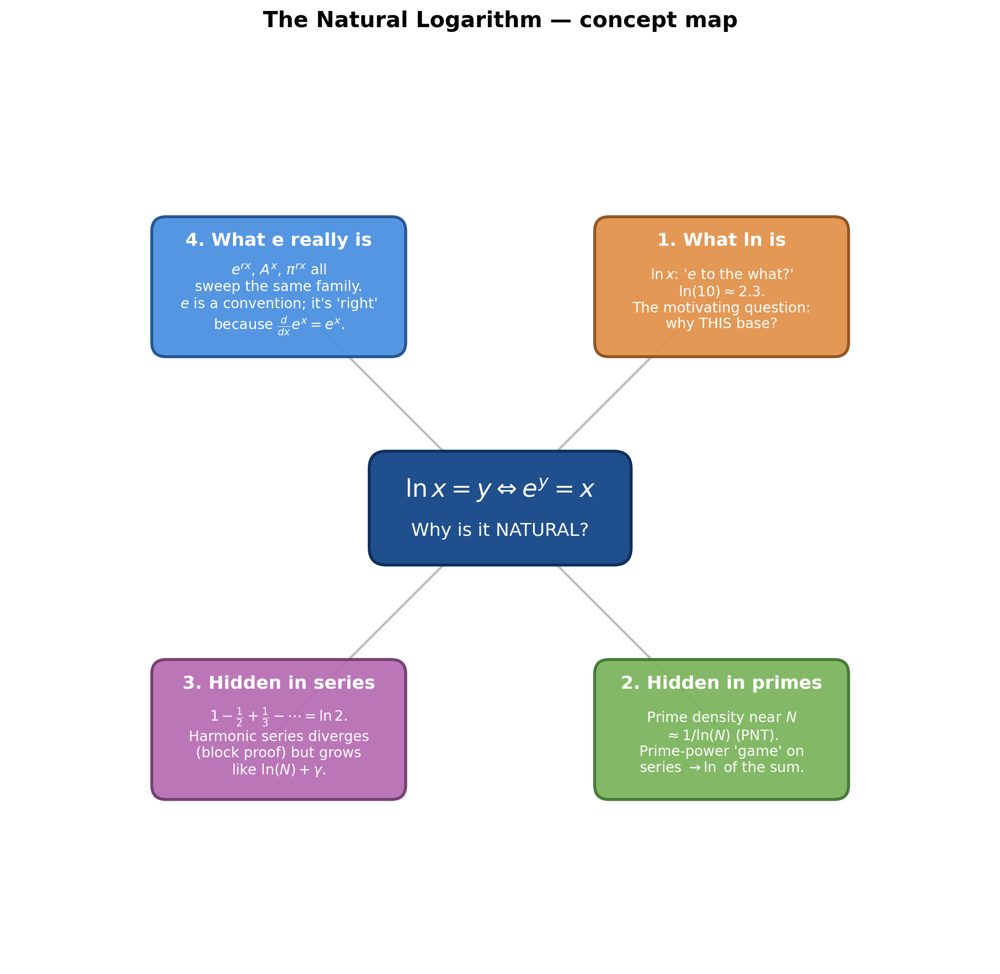
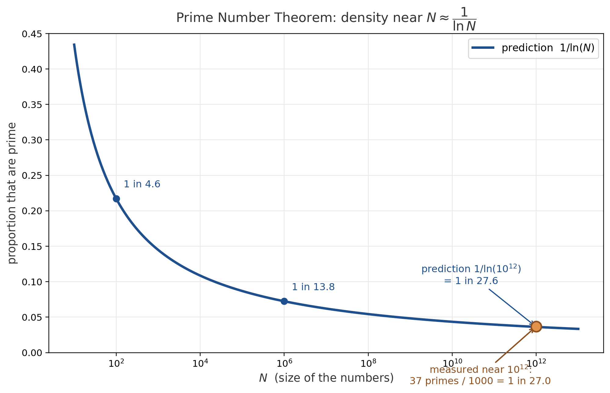
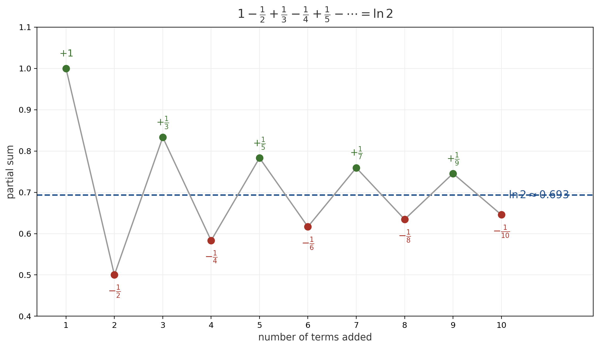
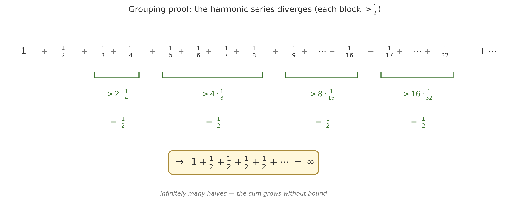
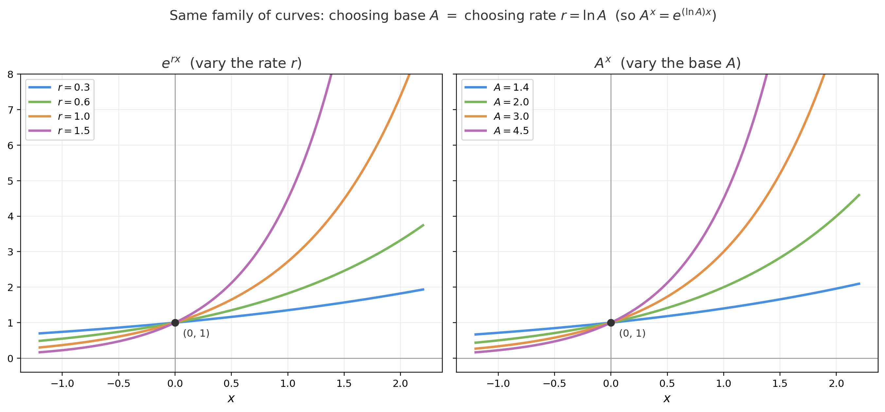

# The Natural Logarithm — Why Is It "Natural"?

*Path C single-source note — extracted from 3Blue1Brown's "Lockdown math ep. 6: The natural logarithm" via Gemini frame-by-frame analysis (00:00–24:54). Topics regrouped textbook-style; every timestamp is a clickable deep-link.*

| Field | Value |
|---|---|
| **Source** | [Lockdown math ep. 6: The natural logarithm](https://www.youtube.com/watch?v=4PDoT7jtxmw) |
| **Speaker** | Grant Sanderson (3Blue1Brown) |
| **Length** | 24:54 |
| **Topic** | Why $\ln$ is called *natural* — its surprise appearances in prime density, infinite series, and harmonic growth, and what $e$ really is |
| **Captured** | 2026-06-04 |

> [!info] The thesis
> The logarithm base $e$ seems like an arbitrary choice — why not base 10? Grant's answer: $\ln$ keeps showing up **unbidden** in places that have nothing to do with $e$ on the surface — the density of primes, strange manipulations of famous series, and the growth rate of the harmonic series. The punchline is that $e$ itself is a *convention*, not magic; what makes it the "right" choice (and $\ln$ "natural") is its rate-of-change property.

---

## 1. What the natural logarithm is

### 1.1 The definition *(at [[4:47]](https://www.youtube.com/watch?v=4PDoT7jtxmw&t=287s))*

> [!definition] $\ln$ as "$e$ to the what?"
> $$y = \ln(x) \quad\Longleftrightarrow\quad e^{y} = x$$
> $\ln(x)$ asks *"$e$ to the what power equals $x$?"* — exactly the base-10 log's "10 to the what?", but with base $e \approx 2.718$. Handy anchor: $\ln(10) \approx 2.3$, i.e. $e^{2.3} \approx 10$.

The whole video is built around one question *(at [[6:11]](https://www.youtube.com/watch?v=4PDoT7jtxmw&t=371s))*:

> "Why is it that we call this thing the natural logarithm? ... What makes this one more natural?"

---

## 2. The natural log hidden in the primes

### 2.1 The quiz: how dense are primes near a trillion? *(at [[0:14]](https://www.youtube.com/watch?v=4PDoT7jtxmw&t=14s))*

> [!example] Audience quiz
> **Problem.** Among the 1,000 integers from $10^{12}$ to $10^{12}+1000$, what proportion are prime — closest to $\tfrac1{10}, \tfrac1{25}, \tfrac1{100}, \tfrac1{250},$ or $\tfrac1{1000}$?
> **Setup.** A live Python prime-counter (`get_primes`) is run on the range *(at [[0:58]](https://www.youtube.com/watch?v=4PDoT7jtxmw&t=58s))*.
> **Solution.** It finds **37 primes** in the 1,000 numbers → proportion $0.037$, i.e. $1$ in $27.0$ *(at [[3:54]](https://www.youtube.com/watch?v=4PDoT7jtxmw&t=234s))*.
> **Answer.** Closest to $\tfrac{1}{25}$ *(at [[2:32]](https://www.youtube.com/watch?v=4PDoT7jtxmw&t=152s))* — only the audience's 3rd-most-popular guess.
> **Insight.** Primes thin out as numbers grow because each has "more options for what it could factor into."

### 2.2 The Prime Number Theorem: density $\approx 1/\ln(N)$ *(at [[4:18]](https://www.youtube.com/watch?v=4PDoT7jtxmw&t=258s))*

> "The density of prime numbers near a given value, like a trillion, is around [one over] the natural log of that number."

$$\text{(density of primes near } N) \;\approx\; \frac{1}{\ln(N)}$$

The check is uncanny — $\ln(10^{12}) \approx 27.63$ *(at [[4:25]](https://www.youtube.com/watch?v=4PDoT7jtxmw&t=265s))* versus the measured $1000/37 \approx 27.03$:

*Generated by matplotlib via `_gen_nl_fig1_prime_density.py` — the proportion of primes near $N$ (measured by sampling) tracks the curve $1/\ln(N)$. At $N=10^{12}$ the gap "1 in 27.6" vs the actual "1 in 27.0" is marked.*

> "[I find it amazing] that the log with base $e$ has anything to do with prime numbers." *(at [[5:58]](https://www.youtube.com/watch?v=4PDoT7jtxmw&t=358s))*

### 2.3 A stranger appearance: the "prime-power game" *(at [[7:14]](https://www.youtube.com/watch?v=4PDoT7jtxmw&t=434s))*

Grant plays a "weird game" on a convergent series: **keep only the prime-power terms** ($2,3,4,5,7,8,9,11,\dots$ — i.e. $p^k$), **drop everything else** (and the $1$), and **scale each surviving $p^k$ term by $\tfrac1k$** (its exponent).

> [!example] The game on the Basel sum *(at [[7:26]](https://www.youtube.com/watch?v=4PDoT7jtxmw&t=446s))*
> **Start.** $\displaystyle\sum_{n=1}^\infty \frac{1}{n^2} = \frac{\pi^2}{6}$ (Euler's Basel problem).
> **Apply the rule** term by term: keep $\tfrac1{2^2}, \tfrac1{3^2}$; for $4=2^2$ scale by $\tfrac12$ → $\tfrac12\cdot\tfrac1{4^2}$; keep $\tfrac1{5^2}$; drop $6$; keep $\tfrac1{7^2}$; for $8=2^3$ scale by $\tfrac13$; for $9=3^2$ scale by $\tfrac12$; … General surviving term: $\dfrac{1}{k}\cdot\dfrac{1}{(p^k)^2}$ *(at [[8:43]](https://www.youtube.com/watch?v=4PDoT7jtxmw&t=523s))*.
> **Answer.** The mutilated series sums to $\boxed{\ln\!\left(\tfrac{\pi^2}{6}\right)}$ *(at [[9:22]](https://www.youtube.com/watch?v=4PDoT7jtxmw&t=562s))* — the **natural log of the original total**.

The same game on the **Leibniz series** $1 - \tfrac13 + \tfrac15 - \tfrac17 + \dots = \tfrac{\pi}{4}$ yields $\ln\!\left(\tfrac{\pi}{4}\right)$ *(at [[11:05]](https://www.youtube.com/watch?v=4PDoT7jtxmw&t=665s))*, even though the surviving signs look chaotic.

> [!note] Why it works (beyond the video)
> This is the **logarithm of an Euler product**. Since $\zeta(2)=\prod_p (1-p^{-2})^{-1}$, taking $\ln$ and expanding $-\ln(1-x)=\sum_k x^k/k$ gives exactly $\sum_{p}\sum_{k}\tfrac1k\,\tfrac{1}{(p^k)^2}=\ln\zeta(2)=\ln\tfrac{\pi^2}{6}$. Grant's "game" *is* that prime-power expansion.

---

## 3. The natural log hidden in the harmonic series

### 3.1 The alternating harmonic series $= \ln 2$ *(at [[11:52]](https://www.youtube.com/watch?v=4PDoT7jtxmw&t=712s))*

$$1 - \frac12 + \frac13 - \frac14 + \frac15 - \frac16 + \cdots = \ln 2 \approx 0.693$$

Grant argues convergence visually: walk a number line, hopping $+1, -\tfrac12, +\tfrac13, -\tfrac14, \dots$. Because the hops **alternate direction and strictly shrink**, the partial sums "zero in" on a single value *(at [[12:44]](https://www.youtube.com/watch?v=4PDoT7jtxmw&t=764s))*.

*Generated by matplotlib via `_gen_nl_fig2_alt_harmonic.py` — partial sums as shrinking left/right hops on a number line, spiraling into $\ln 2 \approx 0.693$.*

> "Kind of strange, don't you think, that something like $e$ would show up with relation to just numbers oscillating back and forth like this." *(at [[13:07]](https://www.youtube.com/watch?v=4PDoT7jtxmw&t=787s))*

### 3.2 The plain harmonic series diverges — the grouping proof *(at [[13:46]](https://www.youtube.com/watch?v=4PDoT7jtxmw&t=826s))*

Drop the alternating signs and the sum $1+\tfrac12+\tfrac13+\cdots$ runs off to infinity, even though the terms shrink to zero. Grant's "very pretty proof" *(at [[14:19]](https://www.youtube.com/watch?v=4PDoT7jtxmw&t=859s))* groups terms in blocks whose sizes double:

> [!example] Why $\sum 1/n$ diverges
> **Group** the terms after $1+\tfrac12$ into blocks of size $2,4,8,16,\dots$ and bound each block below by replacing every term with the block's smallest:
> $$\underbrace{\tfrac13+\tfrac14}_{>\,2\cdot\frac14=\frac12} \;+\; \underbrace{\tfrac15+\cdots+\tfrac18}_{>\,4\cdot\frac18=\frac12} \;+\; \underbrace{\tfrac19+\cdots+\tfrac1{16}}_{>\,8\cdot\frac1{16}=\frac12} \;+\; \cdots$$
> **Each block exceeds $\tfrac12$** *(at [[15:41]](https://www.youtube.com/watch?v=4PDoT7jtxmw&t=941s))*, so the whole sum exceeds $1+\tfrac12+\tfrac12+\tfrac12+\cdots$, which grows without bound.
> **Answer.** $\displaystyle\sum_{n=1}^{\infty}\frac1n = \infty$ — but *slowly*: it takes a block size of $2^{17}$–$2^{18}$ just to add up to 10.

*Generated by matplotlib via `_gen_nl_fig3_grouping_proof.py` — blocks of size 2, 4, 8, 16 under the harmonic terms; each block is bounded below by (#terms)×(smallest term) = ½, so the series is bounded below by $1+\tfrac12+\tfrac12+\cdots$.*

### 3.3 ...but it grows only **logarithmically** *(at [[16:58]](https://www.youtube.com/watch?v=4PDoT7jtxmw&t=1018s))*

Because the block sizes grow by powers of two, the partial sum up to $N$ obeys

$$1+\frac12+\frac13+\cdots+\frac1N \;\approx\; \ln(N) + \gamma$$

where $\gamma \approx 0.577$ is the **Euler–Mascheroni constant** *(at [[17:07]](https://www.youtube.com/watch?v=4PDoT7jtxmw&t=1027s))*. The harmonic series "doesn't grow exponentially, it grows logarithmically."

### 3.4 How slowly? When does the sum pass 1,000,000? *(at [[17:26]](https://www.youtube.com/watch?v=4PDoT7jtxmw&t=1046s))*

> [!example] The headline quiz
> **Problem.** What is the smallest $N$ with $1+\tfrac12+\cdots+\tfrac1N > 1{,}000{,}000$?
> **Solution** *(at [[20:10]](https://www.youtube.com/watch?v=4PDoT7jtxmw&t=1210s))*:
> 1. Set $\ln(N) \approx 10^{6}$, so $N \approx e^{10^{6}}$.
> 2. Convert to base 10: write $e = 10^{x}$, so $x = \log_{10}(e) = \dfrac{1}{\ln(10)} \approx \dfrac{1}{2.3} \approx 0.434$ *(at [[20:50]](https://www.youtube.com/watch?v=4PDoT7jtxmw&t=1250s))*.
> 3. Then $N \approx \left(10^{0.434}\right)^{10^{6}} = 10^{0.434\times 10^{6}} = 10^{434{,}294}$.
>
> **Answer.** $\boxed{N \approx 10^{434{,}294}}$ *(at [[22:00]](https://www.youtube.com/watch?v=4PDoT7jtxmw&t=1320s))*.
> **Insight.** That dwarfs the $\approx 10^{80}$ atoms in the universe. Even "a universe inside every atom, inside every atom of *that*…" only reaches $\sim 10^{240}$ *(at [[19:25]](https://www.youtube.com/watch?v=4PDoT7jtxmw&t=1165s))*. The harmonic series is the slowest-diverging series you'll meet.

---

## 4. So why is $e$ "natural"? — it's a convention, not magic *(at [[22:51]](https://www.youtube.com/watch?v=4PDoT7jtxmw&t=1371s))*

In Desmos, Grant plots $e^{rx}$ and sweeps the parameter $r$, generating a whole **family of exponential curves** (all passing through $(0,1)$). The key realization:

> [!tip] $e$ isn't the source of the family
> The family $\{e^{rx}\}$ is *identical* to the family $\{A^{x}\}$: any $A^x = e^{(\ln A)x}$, so choosing base $A$ is the same as choosing rate $r=\ln A$ *(at [[23:50]](https://www.youtube.com/watch?v=4PDoT7jtxmw&t=1430s))*. You can even build the same family from $\pi^{rx}$ *(at [[24:01]](https://www.youtube.com/watch?v=4PDoT7jtxmw&t=1441s))* — $e$ is in no way special for *generating* these curves.

*Generated by matplotlib via `_gen_nl_fig4_e_family.py` — $e^{rx}$ for several rates $r$ (left) and $A^x$ for several bases $A$ (right) trace the same family of exponentials through $(0,1)$; a base swap is just a rate rescale.*

So the right question *(at [[24:25]](https://www.youtube.com/watch?v=4PDoT7jtxmw&t=1465s))*:

> "The right question to ask isn't *what does $e$ have to do with such a family*, but *why is it the right choice?*"

The answer (set up here, and the reason $\ln$ is "natural"): $e$ is the unique base whose exponential is **its own derivative**, $\tfrac{d}{dx}e^{x}=e^{x}$. That makes the rate $r$ in $e^{rx}$ *literally* the growth rate — and its inverse, $\ln$, the function that reads a growth process's natural rate back out. Grant closes on the bell curve $e^{-x^2}$ *(at [[24:45]](https://www.youtube.com/watch?v=4PDoT7jtxmw&t=1485s))* as a teaser for where this leads.

---

## Key takeaways

- **"Natural" means it shows up unbidden.** $\ln$ appears in prime density ($\approx 1/\ln N$), in the log-of-an-Euler-product "prime-power game," in the alternating harmonic series ($=\ln 2$), and in harmonic growth ($\approx \ln N + \gamma$) — none of which mention $e$ up front.
- **The Prime Number Theorem in one line:** primes near $N$ have density about $1/\ln(N)$; near a trillion that's about 1 in 27.6.
- **The harmonic series diverges, but logarithmically.** The doubling-block proof bounds it below by $1+\tfrac12+\tfrac12+\cdots$; reaching a sum of one million needs $N\approx 10^{434{,}294}$.
- **$e$ is a convention.** Every exponential family $A^x$ or $\pi^{rx}$ equals some $e^{rx}$; $e$ is "right" only because $\tfrac{d}{dx}e^x=e^x$ makes the rate parameter meaningful — which is exactly why $\ln$ is the *natural* logarithm.

---

## Related Documents

- **[Logarithm Fundamentals (Main)](<../Logarithms/Logarithm Fundamentals (Main).md>)** — the companion lecture from the same 3B1B Lockdown Math Ep. 6: the zero-counting intuition, all the log *rules*, change-of-base, and where $\ln$ sits among bases. Start there for the mechanics of logs; this note is the "why $\ln$ specifically" follow-up.

---

### Sources

| Source | Section | Type |
|---|---|---|
| [Lockdown math ep. 6: The natural logarithm](https://www.youtube.com/watch?v=4PDoT7jtxmw) | 00:00 → 24:54 | YouTube — 3Blue1Brown |
