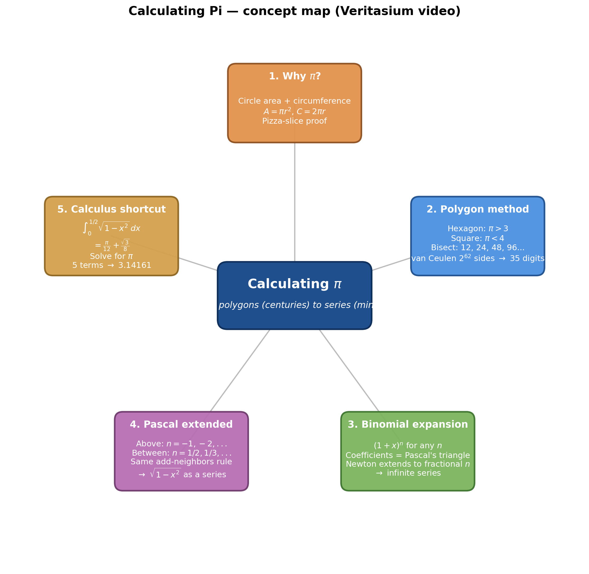
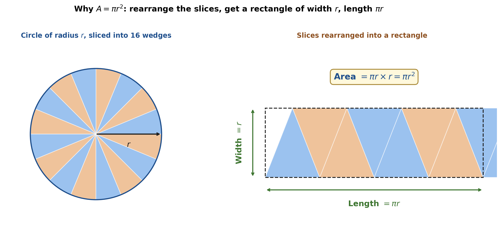
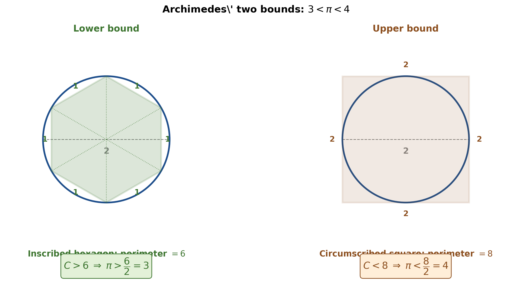
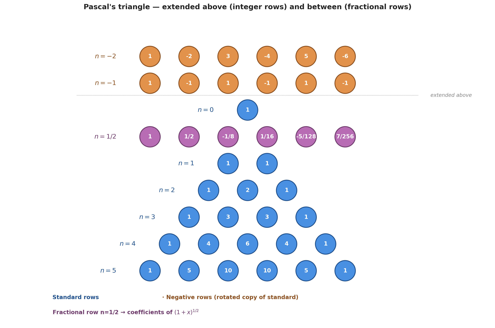
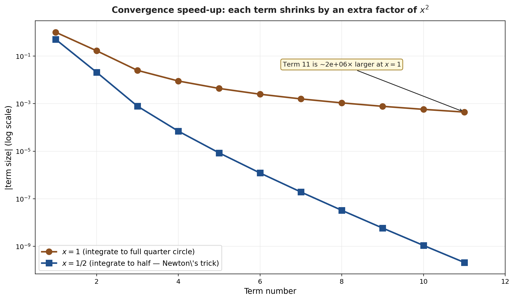
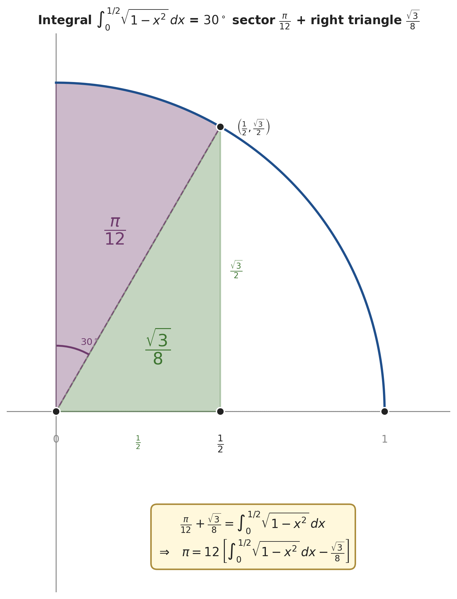

# Calculating Pi: From Polygons to Newton's Series

*Source: [The Ridiculous Way We Used To Calculate Pi](https://www.youtube.com/watch?v=gMlf1ELvRzc) — Derek Muller / Veritasium (18:41). Captured via direct Gemini API per Path C.*

---

---

> [!info] Story essence
> For nineteen centuries, calculating π was a tedious computational arms race: inscribe and circumscribe polygons around a circle, bisect the sides repeatedly, and watch the bounds tighten. Ludolph van Ceulen spent much of his life on a $2^{62}$-sided polygon to pin π to 35 digits. Then Isaac Newton turned the problem inside out — extending the binomial theorem to fractional exponents, plugging the result into the equation of a circle, and integrating. The first **five** terms of his series match the precision of Archimedes' 96-gon. **Fifty** terms equal van Ceulen's life work. A small algebraic insight crushed centuries of brute force.

---

## 1. Why π Sits at the Center of Circle Geometry *(intro at [[00:00]](https://www.youtube.com/watch?v=gMlf1ELvRzc&t=0s))*

The constant $\pi$ enters two everyday facts about circles: the circumference is $C = 2\pi r$ and the area is $A = \pi r^2$. Both come from one number, and both motivate the entire calculation effort that follows.

### The pizza-slice derivation of $A = \pi r^2$ *(at [[00:55]](https://www.youtube.com/watch?v=gMlf1ELvRzc&t=55s))*

Cut a disk into thin wedges and lay them side-by-side, alternating tip-up and tip-down. The arrangement approaches a rectangle as the slices get thinner. Half of the circumference lines the top edge, half lines the bottom edge — so the rectangle's length is $\pi r$. The rectangle's height is just one slice tall, which is the radius $r$. Hence $A = \pi r \cdot r = \pi r^2$.

*Generated by matplotlib via `_gen_pi_fig2_pizza_area.py` — slices rearranged into a rectangle of width $r$ and length $\pi r$.*

A useful corollary: on a circle of **unit** radius, the area is simply $\pi$. This is the connection the calculus shortcut in §5 will exploit.

---

## 2. The Polygon Method: Archimedes' Approach

For nineteen centuries, calculating $\pi$ meant trapping it between the perimeters of regular polygons inscribed in and circumscribed around a unit-diameter circle.

### 2.1 The first bound: $3 < \pi < 4$ *(at [[01:34]](https://www.youtube.com/watch?v=gMlf1ELvRzc&t=94s))*

The cleanest starting point uses a hexagon inside and a square outside.

*Generated by matplotlib via `_gen_pi_fig1_polygon_bounds.py` — left: inscribed hexagon of perimeter 6; right: circumscribed square of perimeter 8; both on a circle of diameter 2.*

> [!example] Bounding π with two polygons *(at [[01:34–02:17]](https://www.youtube.com/watch?v=gMlf1ELvRzc&t=94s))*
> **Problem.** Given a circle of diameter $D = 2$, find a lower and upper bound for $\pi = C/D$.
> **Setup — lower bound.** Inscribe a regular hexagon. Split it into six equilateral triangles meeting at the centre; each triangle's edges are all the radius, so the hexagon's side equals $1$, giving perimeter $6$.
> **Setup — upper bound.** Circumscribe a square. Each side equals the diameter, $2$, giving perimeter $8$.
> **Solution.** The hexagon's six edges lie inside the circle, so $C > 6$; the square's four edges enclose it, so $C < 8$. Dividing by the diameter $D = 2$ gives the bounds.
> **Answer.** $\pi > 6/2 = 3 \;$ and $\;\pi < 8/2 = 4$.
> **Insight.** Both bounds come from elementary geometry — no calculus, no algebra harder than dividing — yet they already box $\pi$ into a one-unit interval. The rest is sharpening.

### 2.2 Bisection: 96-gon to 4.6 quintillion sides *(at [[02:30]](https://www.youtube.com/watch?v=gMlf1ELvRzc&t=150s))*

Archimedes' insight was to **bisect** repeatedly. Each side of the inscribed hexagon splits into two sides of a regular 12-gon; the 12-gon splits into a 24-gon; then 48, then 96. The bounds tighten with every doubling:

| Polygon sides | Lower bound | Upper bound |
|---:|---:|---:|
| 6 / 4 | $\pi > 3$ | $\pi < 4$ |
| 12 | $\pi > 3.106$ | $\pi < 3.215$ |
| 24 | $\pi > 3.1105$ | $\pi < 3.2056$ |
| 48 | $\pi > 3.1326$ | $\pi < 3.1597$ |
| 96 (Archimedes) | $\pi > 3.1408$ | $\pi < 3.1429$ |

The 12-gon's exact bounds, by way of illustration, are $6\sqrt{2-\sqrt{3}} < \pi < 12(2-\sqrt{3})$ — already heavy on nested square roots. Each bisection roughly halves the gap *and* roughly doubles the arithmetic.

> [!quote] Why mathematicians kept doing this — quote *(at [[03:22]](https://www.youtube.com/watch?v=gMlf1ELvRzc&t=202s))*
> *"This is now a matter of flexing your muscles… showing off just how much mathematical power you have that you can work out a constant like π to very high precision."*

The endpoint of this approach is **Ludolph van Ceulen** (1540–1610), who used a polygon with $2^{62} = 4{,}611{,}686{,}018{,}427{,}387{,}904$ sides — about 4.6 quintillion — to compute $\pi$ to 35 decimal places. The digits were carved onto his tombstone in Leiden. For two thousand years this was the only way to compute $\pi$, and it scaled like sweat.

---

## 3. Newton's Binomial Insight *(starts at [[05:04]](https://www.youtube.com/watch?v=gMlf1ELvRzc&t=304s))*

Isaac Newton would have been around twenty-three when he found the move that broke the polygon paradigm. It starts from a pattern in algebra textbooks of his time: the coefficients of $(1+x)^n$.

### 3.1 Pascal's triangle, recognised algebraically *(at [[05:16]](https://www.youtube.com/watch?v=gMlf1ELvRzc&t=316s))*

Expanding $(1+x)^n$ for small $n$:

$$
\begin{aligned}
(1+x)^2 &= 1 + 2x + x^2 \\
(1+x)^3 &= 1 + 3x + 3x^2 + x^3 \\
(1+x)^4 &= 1 + 4x + 6x^2 + 4x^3 + x^4 \\
(1+x)^5 &= 1 + 5x + 10x^2 + 10x^3 + 5x^4 + x^5 \\
(1+x)^6 &= 1 + 6x + 15x^2 + 20x^3 + 15x^4 + 6x^5 + x^6
\end{aligned}
$$

Stripping out only the coefficients gives the rows of **Pascal's triangle** — which was already known to Chinese (Yang Hui, 1303) and Indian (Meru Prastaara, 755 CE) mathematicians centuries earlier. The construction rule is just *add the two neighbours above* *(at [[06:12]](https://www.youtube.com/watch?v=gMlf1ELvRzc&t=372s))*.

### 3.2 The binomial theorem as a formula *(at [[07:11]](https://www.youtube.com/watch?v=gMlf1ELvRzc&t=431s))*

> [!definition] Binomial theorem (positive integer $n$)
> For $n \in \mathbb{Z}^+$,
> $$(1+x)^n = 1 + nx + \frac{n(n-1)}{2!}x^2 + \frac{n(n-1)(n-2)}{3!}x^3 + \frac{n(n-1)(n-2)(n-3)}{4!}x^4 + \dots$$
> The series **terminates** at the $(n+1)$-th term because some factor $(n - k)$ eventually equals zero and kills everything that follows.

For instance, $n = 6$ gives the row $1, 6, 15, 20, 15, 6, 1$ as expected. The factor $(n - 6) = 0$ at the seventh term and the expansion stops.

### 3.3 What if $n$ is *not* a positive integer? *(at [[08:14]](https://www.youtube.com/watch?v=gMlf1ELvRzc&t=494s))*

> [!quote] Newton's habit of mind
> *"Math is about finding patterns and then extending them, and trying to find out where they break."*

Take the formula seriously even when its stated assumption ($n$ a positive integer) is violated. Plug in $n = -1$:

$$(1+x)^{-1} = 1 + (-1)x + \frac{(-1)(-2)}{2!}x^2 + \frac{(-1)(-2)(-3)}{3!}x^3 + \dots$$

The factor $(n - k)$ never hits zero — the numerators just keep marching $-1, -2, -3, \dots$. The expansion **doesn't terminate**; it becomes an infinite series:

$$\frac{1}{1+x} = 1 - x + x^2 - x^3 + x^4 - x^5 + \cdots$$

> [!example] Verify the negative-$n$ expansion is right *(at [[09:55]](https://www.youtube.com/watch?v=gMlf1ELvRzc&t=595s))*
> **Problem.** Confirm $\dfrac{1}{1+x} = 1 - x + x^2 - x^3 + x^4 - \cdots$.
> **Setup.** Multiply both sides by $(1 + x)$. If the series is correct, the right side should collapse to $1$.
> **Solution.** Distribute:
> $$(1 - x + x^2 - x^3 + \cdots)(1+x) = (1 - x + x^2 - x^3 + \cdots) + (x - x^2 + x^3 - x^4 + \cdots).$$
> Every term except the leading $1$ cancels in pairs ($-x$ with $+x$, $+x^2$ with $-x^2$, and so on).
> **Answer.** The product equals $1$, so the series equals $\dfrac{1}{1+x}$ as claimed.
> **Insight.** The same algorithm Newton used to extend the binomial theorem keeps working for non-integer exponents — the catch is that the result is no longer a *polynomial* but an infinite series. That infinity is the price of generality.

### 3.4 Pascal's triangle, extended *(at [[10:18]](https://www.youtube.com/watch?v=gMlf1ELvRzc&t=618s))*

The same coefficient pattern can be drawn *above* the standard rows and *between* them.

*Generated by matplotlib via `_gen_pi_fig3_pascal_extended.py` — standard rows in blue, negative-$n$ rows in orange, fractional row $n = 1/2$ in purple. The "add two neighbours above" rule still produces every entry.*

Row $n = -1$ is $1, -1, 1, -1, \dots$ — the coefficients of $(1+x)^{-1}$. Row $n = -2$ is $1, -2, 3, -4, 5, -6, \dots$. If you ignore the signs, the absolute values are the same numbers as the standard triangle, just *rotated by 120°*. The mechanical pattern that originally only worked for non-negative integers extends in both directions once you allow infinite rows.

> [!tip] Deep dive — the algebra and meaning behind these rows
> Why does row $n=-1$ come out $1,-1,1,\dots$, and what does a "negative choose" even mean? The companion **[Negative & Fractional Binomial Coefficients](negative_and_fractional_binomial_coefficients.md)** derives the identity $\binom{-n}{k} = (-1)^k\binom{n+k-1}{k}$, proves the equivalence, and gives its stars-and-bars (combinations-with-replacement) interpretation — plus the top-down computation of the $n=\tfrac12$ row used in §3.5.

### 3.5 Worked example — $\sqrt{3}$ from the $n = 1/2$ row *(at [[12:35]](https://www.youtube.com/watch?v=gMlf1ELvRzc&t=755s))*

With $n = 1/2$ allowed, the binomial expansion becomes a calculator for square roots:

$$(1+x)^{1/2} = 1 + \tfrac{1}{2}x - \tfrac{1}{8}x^2 + \tfrac{1}{16}x^3 - \tfrac{5}{128}x^4 + \tfrac{7}{256}x^5 - \cdots$$

> [!example] Computing $\sqrt{3}$ rapidly *(at [[12:35]](https://www.youtube.com/watch?v=gMlf1ELvRzc&t=755s))*
> **Problem.** Approximate $\sqrt{3}$ using the $n = 1/2$ binomial expansion.
> **Setup.** Rewrite $\sqrt{3}$ to match the form $(1 + x)^{1/2}$:
> $$\sqrt{3} = \sqrt{4 - 1} = \sqrt{4\cdot(1 - 1/4)} = 2\,(1 + (-1/4))^{1/2}.$$
> **Solution.** Substitute $x = -1/4$ into the $n = 1/2$ series:
> $$\sqrt{3} = 2 \bigl(1 + \tfrac12(-\tfrac14) - \tfrac18(-\tfrac14)^2 + \tfrac1{16}(-\tfrac14)^3 - \tfrac{5}{128}(-\tfrac14)^4 + \cdots\bigr).$$
> **Answer.** Because $|x| = 1/4$, each successive term shrinks by an extra factor of about $1/16$, so the series converges very fast. Four terms already give $\sqrt{3} \approx 1.7320$.
> **Insight.** The trick is choosing the rewrite that puts $x$ as small as possible. Smaller $|x|$ means each $x^k$ term shrinks faster, which means fewer terms are needed for a given precision. The same convergence trick is what makes the π formula in §5 practical.

---

## 4. From Algebra to the Circle *(at [[13:03]](https://www.youtube.com/watch?v=gMlf1ELvRzc&t=783s))*

The equation of a unit circle is

$$x^2 + y^2 = 1.$$

Solving for $y$ on the upper half gives

$$y = (1 - x^2)^{1/2}.$$

That's the $n = 1/2$ binomial expansion with $-x^2$ in place of $x$. Substituting:

$$\sqrt{1 - x^2} = 1 - \tfrac12 x^2 - \tfrac18 x^4 - \tfrac1{16}x^6 - \tfrac{5}{128}x^8 - \cdots$$

> [!quote] Newton's "magic about to happen" moment *(at [[13:32]](https://www.youtube.com/watch?v=gMlf1ELvRzc&t=812s))*
> *"Now we have two different ways of representing the same thing. And whenever you have something like that, magic is about to happen."*

The same curve is **both** a circle (a geometric object) **and** an infinite polynomial in $x$ (an algebraic object). Each representation enables operations the other doesn't.

---

## 5. The Calculus Shortcut

### 5.1 Integrating the binomial series → π/4 *(at [[13:48]](https://www.youtube.com/watch?v=gMlf1ELvRzc&t=828s))*

The area under the curve $y = \sqrt{1 - x^2}$ from $x = 0$ to $x = 1$ is exactly one quarter of the unit circle, i.e. $\pi/4$. Term-by-term integration of the right side using the power rule ($\int x^k\,dx = x^{k+1}/(k+1)$):

$$\frac{\pi}{4} \;=\; \int_0^1 \sqrt{1-x^2}\,dx \;=\; \left[x - \tfrac{1}{2}\tfrac{x^3}{3} - \tfrac{1}{8}\tfrac{x^5}{5} - \tfrac{1}{16}\tfrac{x^7}{7} - \tfrac{5}{128}\tfrac{x^9}{9} - \cdots\right]_0^1.$$

Multiplying by 4 and evaluating at $x = 1$:

$$\pi = 4\left[1 - \tfrac{1}{6} - \tfrac{1}{40} - \tfrac{1}{112} - \tfrac{5}{1152} - \cdots\right].$$

This works — but at $x = 1$ each $x^k$ is still $1$, so the only thing shrinking the terms is the coefficient. Convergence is slow.

### 5.2 Speed-up: shrink $x$, decompose the area *(at [[14:58]](https://www.youtube.com/watch?v=gMlf1ELvRzc&t=898s))*

> [!quote] The series-engineering insight *(at [[14:58]](https://www.youtube.com/watch?v=gMlf1ELvRzc&t=898s))*
> *"When you have an infinite series you want the terms to decrease in size as fast as possible. That way you don't have to calculate as many of them to get a pretty good answer."*

Integrate only from $x = 0$ to $x = 1/2$ instead. Every odd power $x^{2k+1}$ at $x = 1/2$ contributes a factor of $(1/2)^{2k+1}$, so each subsequent term is roughly $1/4$ the size of the previous one *on top of* the coefficient shrinkage.

*Generated by matplotlib via `_gen_pi_fig5_convergence.py` — at $x = 1$ (orange) terms shrink slowly; at $x = 1/2$ (blue) they collapse exponentially. By term 11, the $x = 1/2$ series is millions of times more accurate per term.*

But now the integral no longer gives $\pi/4$ — it gives the area under the upper semicircle from $0$ to $1/2$. What *is* that area, geometrically?

### 5.3 Decomposing the area: $30^\circ$ sector + right triangle *(at [[15:30]](https://www.youtube.com/watch?v=gMlf1ELvRzc&t=930s))*

*Generated by matplotlib via `_gen_pi_fig4_quarter_circle.py` — the region under $y = \sqrt{1-x^2}$ from $x=0$ to $x=1/2$ splits into a $30°$ sector ($\pi/12$) and a right triangle ($\sqrt{3}/8$).*

The point on the unit circle directly above $x = 1/2$ is $\bigl(\tfrac12, \tfrac{\sqrt{3}}{2}\bigr)$, because $\sin 60° = \sqrt{3}/2$. The line from the origin to that point splits the shaded area cleanly into two pieces:

- A **$30°$ circular sector** (from angle $60°$ to angle $90°$), with area $\dfrac{30°}{360°} \cdot \pi(1)^2 = \dfrac{\pi}{12}$.
- A **right triangle** with base $\tfrac12$ and height $\tfrac{\sqrt{3}}{2}$, with area $\tfrac{1}{2} \cdot \tfrac{1}{2} \cdot \tfrac{\sqrt{3}}{2} = \dfrac{\sqrt{3}}{8}$.

### 5.4 Solve for π *(at [[15:48]](https://www.youtube.com/watch?v=gMlf1ELvRzc&t=948s))*

Setting the geometric and series representations equal:

$$\frac{\pi}{12} + \frac{\sqrt{3}}{8} \;=\; \int_0^{1/2}\sqrt{1-x^2}\,dx \;=\; \left[\tfrac{1}{2} - \tfrac{1}{2}\tfrac{1}{3}\bigl(\tfrac{1}{2}\bigr)^3 - \tfrac{1}{8}\tfrac{1}{5}\bigl(\tfrac{1}{2}\bigr)^5 - \tfrac{1}{16}\tfrac{1}{7}\bigl(\tfrac{1}{2}\bigr)^7 - \tfrac{5}{128}\tfrac{1}{9}\bigl(\tfrac{1}{2}\bigr)^9 - \cdots\right].$$

Subtract $\sqrt{3}/8$, multiply by 12, and you get a formula for $\pi$ in which every fresh term shrinks by an extra factor of about $1/4$.

> [!example] Newton's payoff — first 5 terms give π to 5 decimals *(at [[16:01]](https://www.youtube.com/watch?v=gMlf1ELvRzc&t=961s))*
> **Problem.** Use only five terms of Newton's accelerated series to approximate $\pi$.
> **Setup.** Take the integrated series at $x = 1/2$, subtract the triangle area, and multiply by 12.
> **Solution.** The first five integrated terms evaluate (with the triangle correction) to:
> $$\pi \approx 12\left[\tfrac{1}{2} - \tfrac{1}{48} - \tfrac{1}{1280} - \tfrac{1}{14336} - \tfrac{5}{589824} - \tfrac{\sqrt{3}}{8}\right].$$
> Adding it up gives **$\pi \approx 3.14161$**.
> **Answer.** $\pi \approx 3.14161$ — off by about 2 parts in $10^5$.
> **Insight.** Even using just five terms, the result is sharper than Archimedes' 96-gon. To match van Ceulen's $2^{62}$-side polygon (35-digit accuracy), Newton's series needs only **about 50 terms** *(at [[16:07]](https://www.youtube.com/watch?v=gMlf1ELvRzc&t=967s))* — minutes of arithmetic against a lifetime of geometric labour.

---

## 6. The Paradigm Shift *(at [[16:22]](https://www.youtube.com/watch?v=gMlf1ELvRzc&t=982s))*

> [!quote] After Newton, polygons were obsolete
> *"So no one was bisecting polygons to find π ever again."*

The deeper point isn't really about $\pi$ — it's about what made the leap possible. Newton didn't out-compute van Ceulen with brute force; he changed *what was being computed*. Three independent ideas — Pascal's triangle, fractional exponents, integration — combined into a single line of reasoning that obsoleted nineteen centuries of effort.

> [!quote] The closing thought *(at [[17:16]](https://www.youtube.com/watch?v=gMlf1ELvRzc&t=1036s))*
> *"A little bit of insight in mathematics can go a very long way."*

---

## Key Takeaways

1. **For 1900 years, computing π meant bisecting polygons.** Archimedes (96 sides, 3 digits), Viète (~$10^5$ sides), van Ceulen ($2^{62}$ sides, 35 digits) — each step squeezing the bounds by sheer arithmetic.
2. **Newton's first move was algebraic.** He recognised that the binomial-theorem formula $(1+x)^n = \sum \tfrac{n(n-1)\cdots(n-k+1)}{k!}x^k$ doesn't care whether $n$ is a positive integer. The case $n = -1$ produces a non-terminating series for $1/(1+x)$, and the case $n = 1/2$ produces one for $\sqrt{1+x}$.
3. **Pascal's triangle extends.** Above the standard rows are negative-$n$ rows (whose absolute values are a rotated copy of the standard rows); between them are fractional-$n$ rows. The "add neighbours above" construction rule still works.
4. **The integral $\int_0^1 \sqrt{1-x^2}\,dx = \pi/4$ ties algebra to geometry.** Substituting $-x^2$ into the $n=1/2$ binomial expansion and integrating term-by-term produces an infinite series whose 4× scaling equals $\pi$.
5. **Engineering the series for fast convergence is what makes it useful.** Integrating only to $x = 1/2$ shrinks each successive term by an extra factor of $1/4$, but it costs $\pi/12 + \sqrt{3}/8$ instead of $\pi/4$ on the geometric side. Five terms of the accelerated form match Archimedes' 96-gon; fifty terms match van Ceulen.
6. **The lesson generalises.** Multiple algebraic representations of the same geometric object let you import operations across disciplines. Once $\sqrt{1-x^2}$ becomes a power series, calculus *to* it; once a circle becomes a polynomial, integrate *it* — and π drops out.

---

## Related Documents

- **[Negative & Fractional Binomial Coefficients](negative_and_fractional_binomial_coefficients.md)** — the coefficient algebra behind §3: how to compute $\binom{n}{k}$ when $n$ is negative or fractional, the identity $\binom{-n}{k} = (-1)^k\binom{n+k-1}{k}$ with proof, and its combinations-with-replacement (stars-and-bars) meaning.
- **[Logarithm Fundamentals (Main)](<../Logarithms/Logarithm Fundamentals (Main).md>)** — Another Path-C note where a small algebraic insight (the zero-counting intuition for $\log_{10}$) replaces years of brute-force computation. Same "small move, huge consequence" structure.
- **[Imaginary Interest and Continuous Rotation (Main)](<../Complex Numbers/Imaginary Interest and Continuous Rotation (Main).md>)** — Connects to §3.3 (extending operations past their stated domain): plugging an imaginary value into compound interest, just as Newton plugged a fraction into the binomial theorem.
- **[Euler's Formula via exp(x) (Main)](<../Euler 's equation/Euler's Formula via exp(x) (Main).md>)** — Another instance where an infinite series (the polynomial definition of $\exp$) is the bridge between algebra and geometry.
- **[Tetration (Main)](<../Tetration/Tetration (Main).md>)** — The same "a tiny insight tames a wild object" structure: a single tangency condition turns a runaway power tower into the exact constant $e^{1/e}$, just as Newton's series turns the circle into π.

---

### Source

| Source | Speaker | Length | Type |
|---|---|---|---|
| [The Ridiculous Way We Used To Calculate Pi](https://www.youtube.com/watch?v=gMlf1ELvRzc) | Derek Muller (Veritasium) | 18:41 | YouTube video |
