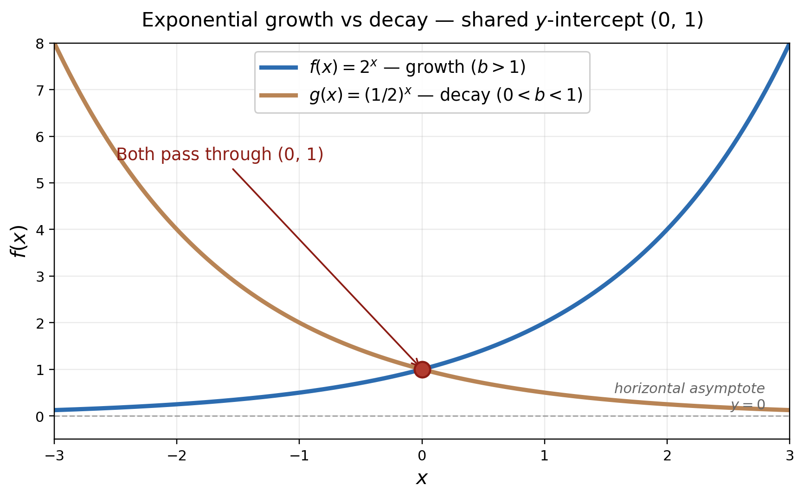
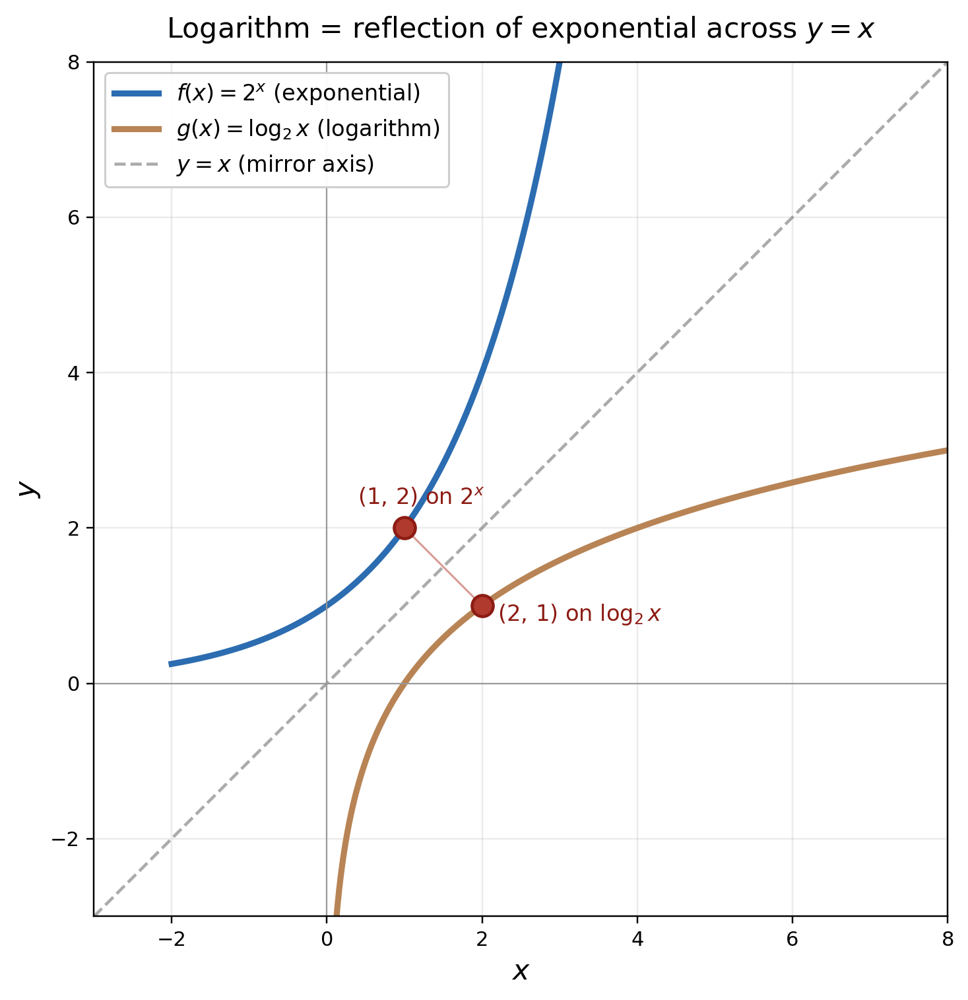
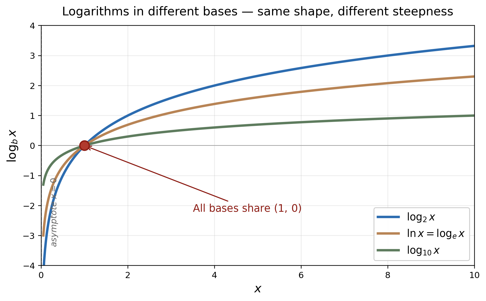
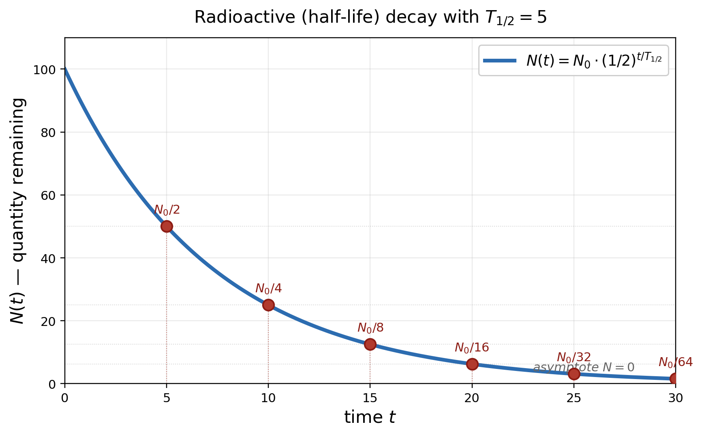
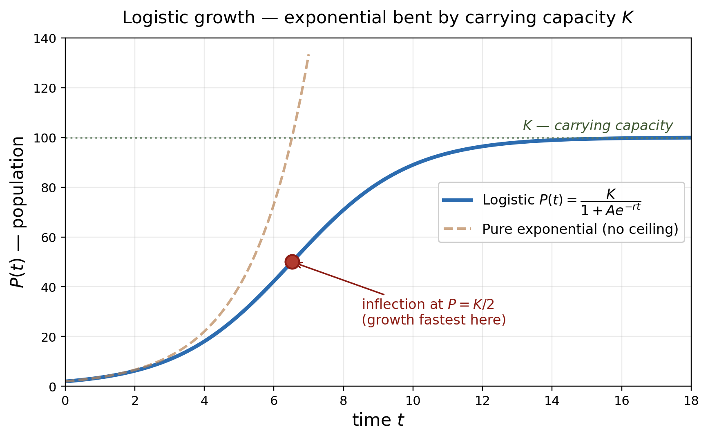

# Chapter 4 — Exponential and Logarithmic Functions

*Companion note to OpenStax Precalculus 2e, Chapter 4. Paraphrased summary built through NotebookLM; figures generated by matplotlib. Excludes the chapter's exercise problem set.*

| Field | Value |
|---|---|
| **Source** | [OpenStax Precalculus 2e](https://openstax.org/details/books/precalculus-2e) |
| **Pages covered** | 407–534 (sections 4.1 through Chapter Review; exercises 535–544 excluded) |
| **Chapter scope** | Exponential functions, logarithms, their graphs, properties, equations, models, curve-fitting |
| **License** | CC-BY 4.0 (this note is a paraphrased derivative work with attribution) |

---

## At a glance

Chapter 4 covers the two complementary function families that show up nearly everywhere non-linear: **exponential functions** (where the variable is the exponent — modeling compound growth and decay) and **logarithmic functions** (their inverse — extracting an exponent given the result). The chapter builds from concrete arithmetic (compound interest, half-life) through algebraic manipulation (log properties, equation solving) to applied modeling (curve-fitting to real data).

The central narrative thread: anywhere a quantity changes by a constant **percentage** per unit time (rather than a constant amount), an exponential function fits, and its inverse logarithm gives you back the time. Half-life, doubling time, pH, decibels, Richter, compound interest, drug dosing, population growth — all the same machinery applied to different domains.

---
## 4.1 Exponential Functions

This section introduces exponential functions, which describe quantities that 
change by a constant multiplicative rate (a percentage) rather than a constant 
additive amount. It explores how to distinguish these functions from 
linear ones, evaluate them at specific values, construct their equations from 
data points or graphs, and apply them to real-world scenarios like financial 
interest and population dynamics. Understanding these concepts is 
foundational for the rest of the chapter, as they provide the mathematical 
mechanics necessary for analyzing rapid growth or decay, utilizing the 
continuous constant $e$, and eventually understanding logarithms.

*Generated by matplotlib via `_gen_pc4_fig1_exp_growth_decay.py` — Two parent exponential curves on shared axes, both passing through $(0,\,1)$. The blue curve $f(x) = 2^x$ ($b > 1$) grows without bound; the copper curve $g(x) = (1/2)^x$ ($0 < b < 1$) decays toward the horizontal asymptote $y = 0$.*

> [!definition] Exponential Growth
> A mathematical pattern where a starting amount increases by a consistent percentage or multiplicative factor over uniform increments of time.

> [!definition] Exponential Decay
> A mathematical pattern where a starting amount decreases by a consistent percentage or multiplicative factor over uniform increments of time.

> [!definition] Exponential Function
> A mathematical relationship modeled by the form $f(x) = ab^x$, where the base is a strictly positive constant other than 1, the exponent is an independent variable, and the graph features a horizontal asymptote.

> [!definition] Compound Interest
> A financial calculation where interest is generated not just on the initial principal deposit, but also on any previously accumulated interest over periodic intervals.

> [!definition] The Number e
> An irrational mathematical constant approximately equal to 2.718282 that serves as the essential base for continuous growth or decay models in finance and science.

> [!definition] Continuous Growth or Decay
> Exponential phenomena that change continuously at every instant, modeled using the natural base $e$ rather than discrete periodic intervals.

> [!example] Example 1 — Distinguishing Exponential Functions
> **Problem.** Determine which of the provided mathematical equations correctly represent exponential functions.
>
> **Setup.** You are analyzing the functions $f(x)=4^{3(x-2)}$, $g(x)=x^3$, $h(x)=\frac{1}{3}e^x$, and $j(x)=(-2)^x$.
>
> **Solution.** Evaluate each expression against the rule that the base must be a positive constant (not 1) and the exponent must contain the independent variable. The function $g(x)$ fails because the base is a variable, making it a power function. The function $j(x)$ fails because the base is a negative number. The remaining two fit all mathematical criteria.
>
> **Answer.** The equations $g(x)$ and $j(x)$ are not exponential functions.
>
> **Insight.** The base of an exponential function must be strictly positive to guarantee that the resulting outputs are valid real numbers.

> [!example] Example 2 — Calculating an Exponential Output
> **Problem.** Compute the value of the given exponential function without utilizing a calculator.
>
> **Setup.** The function is $f(x)=5(3)^{x+1}$, and it must be evaluated at $x=2$.
>
> **Solution.** Substitute 2 into the exponent's variable. Combine the terms in the exponent first to get 3, then evaluate the power $3^3 = 27$. Finally, multiply that result by the leading coefficient 5.
>
> **Answer.** The final result is 135.
>
> **Insight.** Adhering strictly to the order of operations prevents the common error of multiplying the coefficient and base together prematurely.

> [!example] Example 3 — Using an Exponential Formula for Populations
> **Problem.** Predict India's population for the year 2031 based on a provided 2013 population figure and an established annual growth rate.
>
> **Setup.** The population formula is $P(t) = 1.252(1.012)^t$, where the variable $t$ represents the number of years after 2013.
>
> **Solution.** Determine the elapsed time by subtracting 2013 from 2031, which yields 18 years. Substitute 18 into the exponent of the model and compute the value using a calculator.
>
> **Answer.** There will be approximately 1.549 billion people.
>
> **Insight.** Real-world exponential formulas easily yield future projections simply by determining the correct elapsed time for the input variable.

> [!example] Example 4 — Creating a Model from a Known Starting Value
> **Problem.** Formulate an exponential equation to represent a deer population that grows from an initial count to a specific later count over a timeframe.
>
> **Setup.** Starting in 2006, there were 80 deer, and 6 years later the count increased to 180 deer.
>
> **Solution.** Assign the starting amount as the initial coefficient $a=80$. Plug the second data point (6, 180) into the standard form $y=ab^x$ to produce $180 = 80b^6$. Isolate the base by dividing both sides by 80, and then take the sixth root to solve for $b$.
>
> **Answer.** The population model is $f(x) = 80(1.1447)^x$.
>
> **Insight.** Designating the initial measurement year as time zero instantly provides the $a$ parameter in the general exponential format.

> [!example] Example 5 — Building a Model Without a Starting Value
> **Problem.** Construct the exponential equation that connects two arbitrary coordinate points when the initial value is unknown.
>
> **Setup.** The two given points are (-2, 6) and (2, 1).
>
> **Solution.** Substitute both coordinate pairs into $y=ab^x$ to generate a system of two algebraic equations. Isolate $a$ in the first equation and substitute it into the second to discover the value of $b$. Once the base is computed, plug it back into either original equation to resolve the initial value coefficient.
>
> **Answer.** The resulting equation is $f(x) = 2.4492(0.6389)^x$.
>
> **Insight.** A system of equations allows you to algebraically deduce both parameters even when the y-intercept is entirely hidden.

> [!example] Example 6 — Extracting a Formula from a Visual Graph
> **Problem.** Determine the specific algebraic equation of a plotted exponential curve.
>
> **Setup.** A graph displays a curve crossing the y-axis at (0, 3) and passing cleanly through another distinct point at (2, 12).
>
> **Solution.** Observe the y-intercept to instantly establish the initial value coefficient $a=3$. Take the second easily readable coordinate and insert it into the partially complete formula $y=3b^x$. Solve the remaining equation algebraically for the base.
>
> **Answer.** The function is $f(x) = 3(2)^x$.
>
> **Insight.** Spotting the y-intercept is always the fastest first step when deciphering an exponential graph's formula.

> [!example] Example 7 — Relying on Technology for Regression
> **Problem.** Determine the exponential formula linking two data points by leveraging a graphing calculator.
>
> **Setup.** The specific data coordinate pairs are (2, 24.8) and (5, 198.4).
>
> **Solution.** Clear the device's lists, then enter the input values into the first column and the output values into the second column. Run the calculator's exponential regression computing tool from the statistical menu.
>
> **Answer.** The returned formula is $y = 3.1(2)^x$.
>
> **Insight.** Modern graphing utilities possess built-in regression functions that entirely bypass the need for tedious manual algebraic systems.

> [!example] Example 8 — Figuring Out Accrued Interest
> **Problem.** Calculate the future monetary amount of an investment placed in an account with periodically compounded interest.
>
> **Setup.** The principal deposit is $3,000, the annual rate is 3%, the interest is compounded 4 times a year (quarterly), and the timeframe is 10 years.
>
> **Solution.** Plug all the parameters into the compound interest expression, ensuring the rate is in its decimal form (0.03). Multiply the compounding frequency by the years in the exponent ($4 \times 10 = 40$), and compute the value.
>
> **Answer.** The account balance will be approximately $4,045.05.
>
> **Insight.** Breaking the annual interest rate down by the compounding frequency ensures accurate mathematical modeling of periodic financial growth.

> [!example] Example 9 — Reverse-Engineering an Investment's Starting Amount
> **Problem.** Determine the required initial deposit necessary to hit a specific future financial goal utilizing semi-annual compounding.
>
> **Setup.** The financial target is $40,000 after a span of 18 years, growing at a 6% interest rate compounded twice annually.
>
> **Solution.** Use the standard compound interest framework but leave the principal as an unknown variable. Compute the multiplier portion of the formula and divide the target amount by this resulting figure.
>
> **Answer.** The necessary initial deposit is $13,801.
>
> **Insight.** The compound interest formula can be manipulated algebraically to solve for an unknown present value instead of just a future value.

> [!example] Example 10 — Computing Base e Expressions
> **Problem.** Evaluate the irrational constant $e$ raised to a specific decimal power using technology.
>
> **Setup.** The mathematical expression to evaluate is $e^{3.14}$.
>
> **Solution.** Utilize a calculator's specific button designated for the natural exponential, input the decimal exponent, and execute the calculation.
>
> **Answer.** The result is approximately 23.10387.
>
> **Insight.** Scientific calculators have dedicated button functions for base $e$ because the constant is extraordinarily common in advanced mathematical modeling.

> [!example] Example 11 — Assessing Continual Compounding
> **Problem.** Find the resulting balance of a financial deposit that grows constantly at every instant rather than at discrete, periodic intervals.
>
> **Setup.** A $1,000 deposit grows continuously at a 10% nominal interest rate over a single year.
>
> **Solution.** Apply the continuous compounding equation by substituting the rate as 0.10, the time as 1, and the principal amount as 1,000. Calculate the product of the principal and $e$ raised to the rate.
>
> **Answer.** The final amount is $1,105.17.
>
> **Insight.** Continuous financial growth relies on base $e$ to model constant change, rather than utilizing the standard discrete compounding structure.

> [!example] Example 12 — Evaluating Constant Decay
> **Problem.** Calculate how much of a radioactive isotope remains after it decays at a continuous rate over several days.
>
> **Setup.** You start with 100 mg of Radon-222, which decreases continuously by 17.3% daily, and you want to know the remainder after 3 days.
>
> **Solution.** Use the continuous format, but ensure the rate is entered as a negative decimal (-0.173) to represent physical loss. Multiply the rate by 3 days in the exponent, then apply the base $e$ and multiply by the starting 100 mg.
>
> **Answer.** There will be roughly 59.5115 mg of the substance left.
>
> **Insight.** Decay requires substituting a negative rate into the continuous formula to properly shrink the output mathematically over time.

*   $f(x) = ab^x$
    This represents the generic shape of an exponential function, where $a$ 
serves as the starting value or y-intercept, and $b$ acts as the multiplicative
growth or decay factor.
*   $A(t) = P(1 + \frac{r}{n})^{nt}$
    This equation calculates compound interest, demonstrating how an initial 
principal amount $P$ grows based on an annual rate $r$ divided into $n$ 
distinct compounding periods per year over the course of $t$ years.
*   $A(t) = ae^{rt}$
    This is the generalized continuous growth or decay framework utilizing the 
natural base $e$, where a positive rate $r$ dictates growth and a negative rate
$r$ mathematically forces decay.
*   $A(t) = Pe^{rt}$
    This is the specialized continuous compounding formula utilized 
specifically for financial scenarios to deduce an accumulated amount from a 
continuous interest rate over time.

*   **Figure 1**: A graph demonstrating a classic exponential curve plotted 
from a table of values, located on approximately book page 409.
*   **Figure 2**: A visual comparison graph plotting two lines to show 
exponential growth vastly overtaking linear growth over a 5-year period, 
located on approximately book page 412.
*   **Figure 3**: A graph plotting the specifically calculated exponential 
model for a growing deer population over time, located on approximately book 
page 414.
*   **Figure 4**: A chart illustrating exponential decay traversing steadily 
downward through two initial coordinate reference points, located on 
approximately book page 415.
*   **Figure 5**: An unlabelled exponential curve acting as a visual prompt to 
identify its underlying algebraic function, located on approximately book page 
416.
*   **Figure 6**: A secondary unlabelled exponential curve acting as an 
exercise prompt for students to derive the mathematical formula, located on 
approximately book page 417.

*   When evaluating an expression formatted like $a(b)^x$, be extremely 
cautious to adhere to the standard order of operations; you must evaluate the 
exponent first and absolutely **do not** multiply $a$ and $b$ together prior to
applying the power.
*   The base of an exponential function must be strictly positive and cannot 
equal 1; otherwise, the calculations could result in undefined non-real numbers
or merely form a flat, constant horizontal line.
*   When conducting step-by-step calculations, do not round intermediate 
decimal values; you must save any rounding entirely for the final result to 
prevent compounding mathematical inaccuracies.
*   Two mathematical data points will definitively yield one exclusive 
exponential curve, but this is only true if both points sit on the exact same 
side of the x-axis and possess unique x-values.
*   On standard scientific calculators, completely refrain from pressing the 
"Exp" button when you intend to compute a power of $e$, as that specific button
is actually designated for scientific notation powers of 10.

Section 4.1 establishes the foundational principles of exponential functions, 
granting us the mathematical tools to analyze situations that multiply rapidly 
over time, ranging from bacteria cultures to compound financial interest. By mastering the core equation format, recognizing the strict mathematical
conditions of the base, and leveraging continuous growth formulas involving the
natural base $e$, we can effortlessly translate two arbitrary data points or a 
simple visual graph into a robust predictive model. This framework 
directly enables the practical real-world analysis necessary for both long-term
financial projections and complex scientific observations.

Conversation: 811de852-23c7-481e-8a2c-fe733a626d9c (turn 1)
## 4.2 Graphs of Exponential Functions

This section focuses on translating the algebraic formulas of exponential 
growth and decay into visual coordinate graphs. By establishing the basic shape
of a parent exponential curve, you learn how to track geometric 
transformations—such as horizontal and vertical shifts, scaling stretches, and 
mirror reflections—without losing the underlying mathematical pattern. 
Mastering these graphical representations is essential for the rest of the 
chapter, as it builds visual intuition for identifying asymptotes and 
intercepts, visually approximating solutions to complex equations, and 
verifying real-world predictive models.

> [!definition] Constant Ratio
> The base number of an exponential formula that determines the consistent multiplier applied to the previous output to generate the next consecutive output value.

> [!definition] Parent Exponential Function
> The simplest, un-transformed baseline curve of an exponential relationship, notable for crossing the y-axis at 1, never touching the x-axis, and having a domain of all real numbers with a strictly positive range.

> [!example] Example 1 — Sketching the Graph of an Exponential Function
> **Problem.** Create a visual graph of a basic fractional exponential function and identify its core properties.
>
> **Setup.** The mathematical function to be graphed is $f(x) = 0.25^x$.
>
> **Solution.** Recognize that because the base is a fraction between 0 and 1, the curve represents decay and will slope downward from left to right. Calculate a few coordinate pairs (like an input of 0 yielding 1, and an input of -1 yielding 4) and connect them with a smooth line that approaches but never crosses the horizontal axis.
>
> **Answer.** The graph is a downward-sloping curve in the upper quadrants; the domain is all real numbers, the range is strictly positive numbers, and the horizontal asymptote rests at $y=0$.
>
> **Insight.** Plotting a few easy integer points, particularly the y-intercept, quickly establishes the exact steepness of a basic exponential decay curve.

> [!example] Example 2 — Graphing a Shift of an Exponential Function
> **Problem.** Graph an exponential equation that has been translated away from the origin, noting its new properties.
>
> **Setup.** The function provided is $f(x) = 2^{x+1} - 3$.
>
> **Solution.** Start with the parent curve of base 2. Identify the translation parameters: the $+1$ in the exponent shifts the entire graph left by 1 unit, while the $-3$ at the end shifts everything downward by 3 units. Move the horizontal asymptote down to match the vertical shift.
>
> **Answer.** The resulting graph is shifted left 1 and down 3, yielding a domain of all real numbers, a new range of strictly numbers greater than $-3$, and an asymptote at $y=-3$.
>
> **Insight.** Always sketch the new horizontal asymptote first when shifting vertically, as it serves as a strict boundary for your hand-drawn curve.

> [!example] Example 3 — Approximating the Solution of an Exponential Equation
> **Problem.** Utilize graphing technology to estimate the numeric solution to a complex exponential algebraic equation.
>
> **Setup.** The equation to solve is $42 = 1.2(5)^x + 2.8$.
>
> **Solution.** Input the right side of the equation into the calculator as one function and the left side (the constant 42) as a second horizontal line function. Expand the calculator's viewing window so both lines are visible, then trigger the device's intersection calculation tool to find where the lines cross.
>
> **Answer.** The lines intersect at an x-value of approximately $2.166$.
>
> **Insight.** Graphing utilities can bypass difficult algebraic isolation techniques by simply finding the visual collision point of two independent functions.

> [!example] Example 4 — Graphing the Stretch of an Exponential Function
> **Problem.** Plot an exponential function that features a vertical compression multiplier.
>
> **Setup.** The target function is $f(x) = \frac{1}{2}(4)^x$.
>
> **Solution.** Note that the base 4 dictates standard growth, but the leading coefficient scales all typical output values by one-half. Calculate points by taking standard base 4 outputs and cutting them in half, making the new y-intercept $(0, 0.5)$.
>
> **Answer.** The graphed curve starts lower and rises less sharply than a standard base 4 curve; the domain is all real numbers, the range is greater than 0, and the asymptote is at $y=0$.
>
> **Insight.** A leading multiplier strictly alters the vertical height (and y-intercept) of every point without shifting the underlying horizontal asymptote.

> [!example] Example 5 — Writing and Graphing the Reflection of an Exponential Function
> **Problem.** Formulate the equation for an exponential decay graph flipped upside down, and sketch its shape.
>
> **Setup.** The starting parent equation is $f(x) = (\frac{1}{4})^x$, and it must be reflected across the x-axis.
>
> **Solution.** Multiply the entire parent function by $-1$ to force the reflection mathematically. Compute a table of values using this new negative formula, revealing that the y-intercept drops to $(0, -1)$ and all outputs sink into the negative quadrants.
>
> **Answer.** The reflected equation is $f(x) = -(\frac{1}{4})^x$; its domain remains all real numbers, its range is now strictly negative numbers, and the asymptote sits at $y=0$.
>
> **Insight.** Reflecting an exponential graph over the x-axis entirely inverts its range, trapping the entire curve below the horizontal axis.

> [!example] Example 6 — Writing a Function from a Description
> **Problem.** Construct a complete exponential equation based entirely on a written list of geometric transformations.
>
> **Setup.** The base function is $e^x$; it undergoes a vertical stretch by a factor of 2, a mirror reflection across the y-axis, and an upward shift of 4 units.
>
> **Solution.** Map each descriptive phrase to a variable in the general transformation formula. The stretch becomes a leading coefficient of 2, the y-axis reflection introduces a negative sign directly onto the exponent's variable, and the upward shift adds a 4 at the very end.
>
> **Answer.** The assembled formula is $f(x) = 2e^{-x} + 4$.
>
> **Insight.** Assembling a transformed equation requires carefully distinguishing between operations that affect the input exponent directly (horizontal changes) and those that affect the whole function (vertical changes).

*   $f(x) = b^x$
    The foundational un-shifted parent equation that models pure exponential 
growth or decay.
*   $f(x) = b^{x+c} + d$
    A translated exponential formula that shifts the parent curve horizontally 
by the opposite of $c$ and vertically by exactly $d$.
*   $f(x) = a b^x$
    A scaled exponential formula where the leading multiplier $a$ vertically 
stretches or compresses the graph and defines the new y-intercept.
*   $f(x) = -b^x$
    An inverted exponential equation that geometrically flips the entire parent
curve downward across the horizontal x-axis.
*   $f(x) = b^{-x}$
    An exponential equation that applies a negative sign to the input variable,
visually flipping the curve left-to-right across the vertical y-axis.
*   $f(x) = a b^{x+c} + d$
    The ultimate generalized equation format that accommodates every possible 
shift, stretch, and reflection simultaneously.

*   **Figure 1**: A graph of base-2 exponential growth demonstrating an upward 
trajectory over time, located on approximately book page 427.
*   **Figure 2**: A graph of base-0.5 exponential decay dropping toward the 
axis over time, located on approximately book page 428.
*   **Figure 3**: A direct side-by-side graphical comparison emphasizing the 
mirrored shapes of growth versus decay, located on approximately book page 428.
*   **Figure 4**: A sketched curve of a decreasing fractional base, 
establishing domain and range behaviors, located on approximately book page 
429.
*   **Figure 5**: A graph showcasing a parent curve shifted vertically upward 
and downward by separate constants, located on approximately book page 430.
*   **Figure 6**: A graph highlighting a parent curve sliding left and right 
along the x-axis, located on approximately book page 430.
*   **Figure 7**: A fully translated exponential curve exhibiting simultaneous 
leftward and downward shifts, located on approximately book page 431.
*   **Figure 8**: Two comparative graphs displaying the visual difference 
between a vertical stretch factor and a compression factor, located on 
approximately book page 432.
*   **Figure 9**: A graph of an exponential curve vertically squashed by a 
leading fractional coefficient, located on approximately book page 433.
*   **Figure 10**: Two coordinate planes illustrating how negative signs 
generate reflections across both the x-axis and the y-axis, located on 
approximately book page 434.
*   **Figure 11**: A completed sketch showing an x-axis reflected curve sitting
entirely beneath the origin line, located on approximately book page 435.
*   **Figure 12**: A grid of unlabelled exponential graph variations used as a 
visual matching exercise, located on approximately book page 437.
*   **Figure 13**: A collection of curves sharing the same axes designed to 
test comprehension of base magnitudes, located on approximately book page 438.

*   When manually constructing complex transformed equations, you must process 
the translations strictly following the standard mathematical order of 
operations to avoid shifting the graph into the wrong quadrant.
*   A major conceptual pitfall is forgetting that horizontal shifts operate 
inversely to their written algebraic signs; a $+c$ moves the curve to the left,
whereas a $-c$ moves it to the right.
*   When using a graphing calculator's intersection tool, you will frequently 
encounter errors if you forget to manually adjust your window dimensions to 
explicitly encompass the coordinates where the lines cross. 

Section 4.2 bridges algebraic formulas and visual geometry by demonstrating how
every exponential function is merely a stretched, shifted, or flipped variation
of a simple parent curve. By systematically applying transformation 
rules—knowing that a leading coefficient alters height, a trailing constant 
shifts the horizontal asymptote, and negatives create mirror images—you can 
accurately map complex equations onto a coordinate plane without calculating 
endless tables of values. This visual literacy is a vital shortcut, allowing 
you to instantly assess the boundaries, end behaviors, and feasible solutions 
of real-world exponential models.

Conversation: 811de852-23c7-481e-8a2c-fe733a626d9c (turn 1)
## 4.3 Logarithmic Functions

This section introduces logarithmic functions as the fundamental mathematical 
inverses to exponential functions. While exponential formulas are excellent
for determining the final output of a continuous growth or decay process, 
logarithms allow us to reverse-engineer these scenarios to isolate and solve 
for an unknown exponent. This inverse relationship is essential for 
comparing values that differ by extreme magnitudes, such as utilizing the 
base-ten Richter scale to quantify and contrast the destructive energy of 
various earthquakes. Ultimately, understanding logarithms equips us with 
the algebraic tools required to solve complex real-world models where the 
variable of interest is trapped in an exponent.

*Generated by matplotlib via `_gen_pc4_fig2_log_inverse_of_exp.py` — The logarithm $\log_2 x$ is the reflection of $2^x$ across the diagonal $y = x$. A point $(a,\,b)$ on the exponential corresponds to the point $(b,\,a)$ on the logarithm.*

> [!definition] Logarithmic Function
> A mathematical function that reverses an exponential operation, defined as the exponent to which a specific strictly positive base (that is not equal to 1) must be raised to yield a given positive value. The domain is strictly all positive real numbers, while the range spans all real numbers.

> [!definition] Common Logarithm
> A specific type of logarithm that utilizes a base of 10, frequently written simply without a base, which indicates the power 10 must be raised to in order to produce the target number.

> [!definition] Natural Logarithm
> A specialized logarithm utilizing the irrational constant $e$ as its base, denoted by a unique symbol ($\ln$), which represents the exponent $e$ must be raised to in order to reach a specific value.

> [!example] Example 1 — Converting from Logarithmic Form to Exponential Form
> **Problem.** Translate given logarithmic equations into their corresponding exponential formats.
>
> **Setup.** The equations provided are $\log_6(\sqrt{6}) = \frac{1}{2}$ and $\log_3(9) = 2$.
>
> **Solution.** Identify the base, the exponent (the isolated answer of the log), and the resulting argument. Rearrange these pieces so that the base is raised to the exponent to equal the argument.
>
> **Answer.** The converted equations are $6^{1/2} = \sqrt{6}$ and $3^2 = 9$.
>
> **Insight.** The output of any logarithmic expression seamlessly becomes the exponent in its corresponding exponential equation.

> [!example] Example 2 — Converting from Exponential Form to Logarithmic Form
> **Problem.** Rewrite standard exponential equations into their logarithmic counterparts.
>
> **Setup.** The three equations are $2^3 = 8$, $5^2 = 25$, and $10^{-4} = \frac{1}{10000}$.
>
> **Solution.** Extract the base of the power, the exponent, and the final evaluated result. Construct the log expression by setting the log of the final result (using the original base) equal to the original exponent.
>
> **Answer.** The translations are $\log_2(8) = 3$, $\log_5(25) = 2$, and $\log_{10}(\frac{1}{10000}) = -4$.
>
> **Insight.** Converting to logarithmic form perfectly isolates the original exponent on one side of the equals sign.

> [!example] Example 3 — Solving Logarithms Mentally
> **Problem.** Compute the value of a specific logarithmic expression without utilizing electronic calculation tools.
>
> **Setup.** The expression to evaluate is $\log_4(64)$.
>
> **Solution.** Reframe the expression as a mental question: what power must the base 4 be raised to in order to generate the number 64? Recognizing that 4 multiplied by itself three times equals 64 reveals the answer.
>
> **Answer.** The evaluated result is 3.
>
> **Insight.** Basic logarithms can be rapidly solved by relying on your memorized knowledge of perfect squares and cubes.

> [!example] Example 4 — Evaluating the Logarithm of a Reciprocal
> **Problem.** Find the numeric value of a logarithm where the argument is a fraction.
>
> **Setup.** You must calculate $\log_3(\frac{1}{27})$ entirely in your head.
>
> **Solution.** First, determine the power needed for the base 3 to reach the whole number 27, which is 3. Next, recall the rule of exponents stating that negative powers create reciprocals, meaning a $-3$ exponent will turn 27 into $\frac{1}{27}$.
>
> **Answer.** The final answer is $-3$.
>
> **Insight.** A negative logarithmic output indicates that the positive base was transformed into a fractional reciprocal.

> [!example] Example 5 — Finding the Value of a Common Logarithm Mentally
> **Problem.** Determine the output of a base-10 logarithm without a calculator.
>
> **Setup.** The given mathematical expression is $\log(1000)$.
>
> **Solution.** Acknowledge that the missing base defaults to 10, then formulate the equivalent exponential question: 10 raised to what power equals 1000? Because $10^3 = 1000$, the exponent must be 3.
>
> **Answer.** The solution is 3.
>
> **Insight.** Common logarithms of powers of ten simply map to the number of zeros present in the argument.

> [!example] Example 6 — Finding the Value of a Common Logarithm Using a Calculator
> **Problem.** Utilize graphing or scientific technology to compute a common log that does not yield a clean integer.
>
> **Setup.** You need to evaluate $\log(321)$ rounded to four decimal spots.
>
> **Solution.** Since 321 falls between $10^2$ and $10^3$, expect a decimal answer between 2 and 3. Press the dedicated "LOG" button on the device, input the number 321, ensure the parentheses are closed, and execute the calculation.
>
> **Answer.** The approximate value is 2.5065.
>
> **Insight.** Calculators are mandatory when the argument of a logarithm is not a perfect mathematical power of the base.

> [!example] Example 7 — Rewriting and Solving a Real-World Exponential Model
> **Problem.** Find the exact difference in Richter scale magnitudes between two earthquakes given their energy ratio.
>
> **Setup.** An exponential equation $10^x = 500$ models the scenario, with $x$ representing the magnitude difference.
>
> **Solution.** Transform the exponential setup into a logarithmic equation, which yields $x = \log_{10}(500)$. Use a calculator's common log function to estimate the value of $x$ to three decimal places.
>
> **Answer.** The magnitude difference is approximately 2.699.
>
> **Insight.** Converting a real-world exponential model into a logarithmic format immediately isolates the unknown variable for easy electronic calculation.

> [!example] Example 8 — Evaluating a Natural Logarithm Using a Calculator
> **Problem.** Compute a base $e$ logarithmic expression out to four decimal places using a digital tool.
>
> **Setup.** The expression to approximate is $\ln(500)$.
>
> **Solution.** Locate the specific "LN" button on the calculator, which denotes the natural logarithm. Input the argument 500, close the protective parentheses, and press enter to generate the irrational decimal.
>
> **Answer.** The result is approximately 6.2146.
>
> **Insight.** Natural logarithms require their own specific calculator button since they rely on the irrational constant $e$ rather than the standard base 10.

*   $y = \log_b(x) \iff b^y = x$
    This property demonstrates the fundamental equivalence between logarithmic 
and exponential statements, proving they are just different ways of expressing 
the same mathematical relationship.
*   $y = \log(x) \iff 10^y = x$
    This formula defines the common logarithm, highlighting that an absent base
in a logarithmic expression universally implies a base of 10.
*   $y = \ln(x) \iff e^y = x$
    This equation establishes the natural logarithm, utilizing a special 
notation ($\ln$) to denote that the underlying base is the continuous growth 
constant $e$.

*   **Figure 1**: A photograph showing the severe physical destruction caused 
by the 2011 earthquake in Honshu, Japan, located on approximately book page 440.
*   **Figure 2**: A visual graph plotting the curve $y = 10^x$ intersecting 
with a horizontal line at $y=500$ to estimate the algebraic solution to an 
earthquake magnitude problem, located on approximately book page 441.

*   You can never evaluate the logarithm of a negative number or zero; 
attempting to do so will not yield a real number because no valid positive base
raised to any power can result in a zero or negative output.
*   When reading older mathematical texts or working across different 
disciplines (like computer science), an unwritten base might imply base $e$ or 
base 2, but in standard mathematics, an unspecified base universally means base
10.
*   When using digital calculators to evaluate logs, failing to place closing 
parentheses around the specific target argument can cause the calculator to 
unintentionally include subsequent mathematical operations inside the 
logarithm, resulting in wildly incorrect answers.

Section 4.3 bridges the gap between exponential growth and logarithmic 
tracking, effectively demonstrating that logarithms are simply exponents 
written in an alternative, isolated format. By learning how to seamlessly 
translate between these two forms, you can algebraically free variables trapped
in exponents, bypassing tedious visual graphing estimates. Recognizing 
the specific notation for common (base 10) and natural (base $e$) logarithms 
further prepares you to handle standardized real-world models, whether you are 
calculating the acidic pH of a chemical solution or measuring the catastrophic 
energy release of a seismic event.

Conversation: 811de852-23c7-481e-8a2c-fe733a626d9c (turn 1)
## 4.4 Graphs of Logarithmic Functions

This section explores how to visually represent logarithmic functions on a 
coordinate plane, emphasizing their role as the exact mathematical inverses of 
exponential functions. Because exponential graphs model the final result of
a growth or decay process over time, their logarithmic counterparts allow us to
graphically reverse this process, taking a known final amount and visualizing 
the time or conditions required to reach it. By mastering the domain 
restrictions, vertical asymptotes, and geometric transformations of basic 
logarithmic curves, you will develop the tools to map and interpret complex, 
real-world logarithmic models accurately.

*Generated by matplotlib via `_gen_pc4_fig3_log_bases.py` — Logarithm curves for base 2, base $e$ (natural), and base 10 (common). All share the universal anchor $(1,\,0)$ and the vertical asymptote $x = 0$. Smaller bases produce steeper curves.*

> [!definition] Logarithmic Domain
> The set of all acceptable input values for a logarithmic function, which must be strictly restricted to positive real numbers because you cannot mathematically evaluate the logarithm of zero or a negative number.

> [!definition] Parent Logarithmic Function
> The simplest baseline logarithmic curve, written as $f(x) = \log_b(x)$, which represents the mirror image of an exponential function reflected across the diagonal line $y=x$. Its graph is characterized by an x-intercept at $(1, 0)$, a vertical asymptote sitting directly on the y-axis, and a range that spans all real numbers.

> [!example] Example 1 — Identifying the Domain of a Logarithmic Shift
> **Problem.** Determine the valid set of inputs for a logarithm that has been shifted horizontally.
>
> **Setup.** The given function is $f(x) = \log_2(x+3)$.
>
> **Solution.** Since logarithms can only process positive arguments, set the inner expression $x+3$ to be strictly greater than zero. Subtract 3 from both sides to isolate the variable, revealing that $x$ must be larger than $-3$.
>
> **Answer.** In interval notation, the domain is $(-3, \infty)$.
>
> **Insight.** The domain of any translated logarithm is entirely dictated by the algebraic inequality requiring its inner argument to be positive.

> [!example] Example 2 — Identifying the Domain of a Logarithmic Shift and Reflection
> **Problem.** Find the mathematical domain of a logarithmic function containing a negative coefficient on its variable.
>
> **Setup.** The specific function is $f(x) = \log(5-2x)$.
>
> **Solution.** Force the entire argument inside the parentheses to be strictly positive by writing $5-2x > 0$. Move the $-5$ to the other side, then divide by $-2$, remembering to flip the inequality sign because you are dividing by a negative number.
>
> **Answer.** The domain spans from $(-\infty, 2.5)$.
>
> **Insight.** A negative sign attached to the $x$ variable inside the logarithm will flip the allowable domain interval from a "greater than" scenario to a "less than" scenario.

> [!example] Example 3 — Graphing a Logarithmic Function with the Form $f(x) = \log_b(x)$
> **Problem.** Create a basic sketch of a parent logarithmic function and list its defining traits.
>
> **Setup.** The mathematical function to graph is $f(x) = \log_5(x)$.
>
> **Solution.** Note that the base 5 is larger than 1, meaning the curve will steadily rise from left to right. The graph will hug the vertical y-axis on the left without touching it, pass directly through the standard x-intercept at $(1,0)$, and hit a key coordinate point at $(5,1)$ because the base is 5.
>
> **Answer.** The plotted curve has a domain of $(0, \infty)$, a range of $(-\infty, \infty)$, and a vertical asymptote at $x=0$.
>
> **Insight.** Establishing the x-intercept and one key point based on the base value allows for a quick, accurate sketch of any parent logarithmic curve.

> [!example] Example 4 — Graphing a Horizontal Shift of the Parent Function $y = \log_b(x)$
> **Problem.** Graph a logarithmic function that has been shifted left or right and determine its new characteristics.
>
> **Setup.** The function provided is $f(x) = \log_3(x-2)$.
>
> **Solution.** Recognize that subtracting 2 directly from the input variable shifts the entire curve 2 units to the right. Consequently, move the parent function's vertical asymptote from the y-axis over to $x=2$. Shift standard reference points like $(1,0)$ and $(3,1)$ to their new coordinates at $(3,0)$ and $(5,1)$, then draw the curve.
>
> **Answer.** The domain is shifted to $(2, \infty)$, the range stays at $(-\infty, \infty)$, and the new asymptote is $x=2$.
>
> **Insight.** A horizontal shift completely redefines the function's domain and vertical asymptote, pushing the boundary of the graph left or right.

> [!example] Example 5 — Graphing a Vertical Shift of the Parent Function $y = \log_b(x)$
> **Problem.** Visually plot a logarithm that has been moved up or down the coordinate plane.
>
> **Setup.** The function is $f(x) = \log_3(x) - 2$.
>
> **Solution.** Note that the subtraction happens outside the logarithmic argument, indicating a downward vertical shift of 2 units. The vertical asymptote remains undisturbed on the y-axis, but the key reference points drop, turning $(1,0)$ into $(1,-2)$ and $(3,1)$ into $(3,-1)$.
>
> **Answer.** The domain remains $(0, \infty)$, the range is $(-\infty, \infty)$, and the asymptote stays at $x=0$.
>
> **Insight.** Vertical shifts alter the specific coordinates of the curve but have absolutely no effect on the graph's domain or its vertical asymptote boundary.

> [!example] Example 6 — Graphing a Stretch or Compression of the Parent Function $y = \log_b(x)$
> **Problem.** Plot a logarithmic graph that has been pulled vertically by a multiplier.
>
> **Setup.** The target formula is $f(x) = 2\log_4(x)$.
>
> **Solution.** The leading coefficient of 2 signifies that every original y-value output by the parent curve $\log_4(x)$ must be doubled. While the x-intercept at $(1,0)$ remains anchored because zero times two is zero, the reference point $(4,1)$ is stretched upward to become $(4,2)$. The asymptote does not move.
>
> **Answer.** The curve's domain is $(0, \infty)$, its range is $(-\infty, \infty)$, and the asymptote is at $x=0$.
>
> **Insight.** A vertical stretch amplifies the steepness of the curve but leaves the x-intercept and the vertical boundary line perfectly intact.

> [!example] Example 7 — Combining a Shift and a Stretch
> **Problem.** Formulate a graph for a logarithm that features multiple simultaneous transformations.
>
> **Setup.** The given equation is $f(x) = 5\log(x+2)$.
>
> **Solution.** Process the horizontal shift inside the parentheses first, which moves the curve 2 units to the left, repositioning the vertical asymptote to $x=-2$. Next, apply the vertical stretch by multiplying standard outputs by 5. The new x-intercept becomes $(-1,0)$, and a useful reference point can be plotted at $(8,5)$ because the common log of 10 is 1.
>
> **Answer.** The domain becomes $(-2, \infty)$, the range is unchanged at $(-\infty, \infty)$, and the vertical asymptote is $x=-2$.
>
> **Insight.** When dealing with multiple geometric modifications, strictly processing transformations inside the parentheses before external multipliers ensures the graph is positioned correctly.

> [!example] Example 8 — Graphing a Reflection of a Logarithmic Function
> **Problem.** Sketch the graph of a logarithm that has been flipped across an axis.
>
> **Setup.** The function to interpret is $f(x) = \log(-x)$.
>
> **Solution.** A negative multiplier directly attached to the input variable creates a mirror image of the parent common log function across the vertical y-axis. This means the curve will now exist on the left side of the origin, approaching the axis from the negative direction and passing through $(-1,0)$.
>
> **Answer.** The new domain is restricted to $(-\infty, 0)$, the range remains $(-\infty, \infty)$, and the asymptote sits at $x=0$.
>
> **Insight.** Flipping a logarithm across the y-axis effectively inverts its domain to strictly accept negative input numbers.

> [!example] Example 9 — Approximating the Solution of a Logarithmic Equation
> **Problem.** Rely on technology to estimate the intersecting solution of two different logarithmic curves.
>
> **Setup.** The algebraic equation is $4\ln(x)+1 = -2\ln(x-1)$.
>
> **Solution.** Treat each side of the equals sign as its own independent function and enter them into a graphing calculator's system. Adjust the visual window to properly display the area where the curves converge, and utilize the calculator's intersection tool to pinpoint the specific crossing coordinate.
>
> **Answer.** The two graphs intersect at roughly $x \approx 1.339$.
>
> **Insight.** Graphing utilities provide an efficient way to bypass highly complex algebraic manipulation by simply finding the visual collision of two functions.

> [!example] Example 10 — Finding the Vertical Asymptote of a Logarithm Graph
> **Problem.** Deduce the vertical boundary line of a highly modified logarithmic formula.
>
> **Setup.** The equation provided is $f(x) = -2\log_3(x+4)+5$.
>
> **Solution.** Ignore the vertical stretch, the reflection, and the vertical shift, because none of these alter the position of the asymptote. Focus exclusively on the horizontal shift located inside the argument: the $+4$ means the graph slides 4 units left.
>
> **Answer.** The vertical asymptote is located precisely at $x=-4$.
>
> **Insight.** The vertical asymptote of any logarithm is exclusively determined by the horizontal shift applied to its internal argument.

> [!example] Example 11 — Finding the Equation from a Graph
> **Problem.** Construct the specific algebraic formula that matches a provided visual logarithmic curve.
>
> **Setup.** A graph of a common logarithm shows a vertical asymptote at $x=-2$, has a downward reflected trajectory, and cleanly intersects the points $(-1,1)$ and $(2,-1)$.
>
> **Solution.** Use the visible asymptote to determine the horizontal shift, giving a partial equation of $f(x) = a\log(x+2) + d$. Insert the coordinate pair $(-1,1)$ into this skeleton to deduce that $d=1$. Then, plug in the second coordinate pair $(2,-1)$ and solve for the stretch factor, revealing that $a=-2$.
>
> **Answer.** The finalized equation representing the graph is $f(x) = -2\log(x+2)+1$.
>
> **Insight.** Locating the vertical asymptote first provides the vital inner parameter needed to solve a system of equations for the remaining transformation variables.

*   $f(x) = \log_b(x)$
    This is the generic baseline equation for the parent logarithmic function, 
describing the fundamental inverse curve of an exponential formula.
*   $f(x) = a\log_b(x+c) + d$
    This is the comprehensive transformation formula that integrates all 
possible geometric modifications—stretches, horizontal shifts, and vertical 
shifts—into a single equation.

*   **Figure 1**: A graph illustrating how a logarithmic curve maps out the 
time required for an investment to reach a doubled value, located on 
approximately book page 450.
*   **Figure 2**: A visual comparison mapping the parent exponential and parent
logarithmic functions to demonstrate they are exact mirror reflections across 
the diagonal axis, located on approximately book page 452.
*   **Figure 3**: A side-by-side display of two logarithmic curves showing the 
difference in shape between a base greater than 1 and a fractional base, 
located on approximately book page 453.
*   **Figure 4**: A graph layering three separate logarithmic functions to 
demonstrate how increasing the numerical base flattens the curve downward, 
located on approximately book page 453.
*   **Figure 5**: A plotted curve for the specific base-5 parent logarithmic 
function, located on approximately book page 454.
*   **Figure 6**: A chart illustrating the parent curve shifted both left and 
right along the x-axis, located on approximately book page 455.
*   **Figure 7**: A finished graph depicting a rightward horizontal shift 
accompanied by its shifted asymptote, located on approximately book page 456.
*   **Figure 8**: A chart demonstrating the parent curve moving independently 
upward and downward, located on approximately book page 457.
*   **Figure 9**: A completed sketch showing a logarithm shifted downward while
its vertical asymptote remains stationary, located on approximately book page 
458.
*   **Figure 10**: Two comparative curves showing the physical distinction 
between vertical stretching and vertical compression, located on approximately 
book page 459.
*   **Figure 11**: A completed graph of a vertically stretched base-4 
logarithm, located on approximately book page 460.
*   **Figure 12**: A complex plotted curve showcasing both a horizontal 
translation and a significant vertical stretch, located on approximately book 
page 461.
*   **Figure 13**: Two graphs detailing how negative signs produce unique 
reflections across either the x-axis or the y-axis, located on approximately 
book page 462.
*   **Figure 14**: A completed sketch of a logarithm reflected entirely into 
the negative input quadrants, located on approximately book page 463.
*   **Figure 15**: An unlabelled logarithmic curve acting as a visual puzzle to
reverse-engineer its common log formula, located on approximately book page 465.
*   **Figure 16**: An unlabelled natural logarithm graph serving as an exercise
for students to extract the underlying equation, located on approximately book 
page 466.

*   The most critical rule of logarithmic graphing is that the function's 
internal argument must be strictly positive; accidentally allowing a zero or 
negative input mathematically breaks the function and ruins your calculated 
domain.
*   When executing algebraic transformations on a graph, it is imperative to 
handle any modifications located inside the parentheses (like horizontal 
shifts) before applying outside operations (like vertical stretches) to adhere 
to the correct order of operations.
*   Do not make the error of assuming vertical shifts, stretches, or base 
changes will move a vertical asymptote; the asymptote is uniquely tied to the 
horizontal position of the internal domain restriction.
*   You can often deduce the complete end behavior of a logarithmic curve 
simply by noting which direction it approaches the vertical asymptote and 
observing its general upward or downward trajectory on the opposite end.

Section 4.4 illustrates that graphing logarithmic functions is fundamentally an
exercise in mapping geometric transformations onto a known inverse baseline 
curve. By carefully defining the restricted domain to establish the 
vertical asymptote, you can pinpoint the absolute boundary of the graph before 
systematically applying horizontal shifts, vertical stretches, and reflections. This methodology ensures that even the most complex logarithmic 
models can be accurately sketched or reverse-engineered by tracking the 
movement of a single vertical line and a few key reference points.

Conversation: 811de852-23c7-481e-8a2c-fe733a626d9c (turn 1)
## 4.5 Logarithmic Properties

This section explores the fundamental algebraic rules that govern logarithms, 
demonstrating how they mirror the established properties of exponents. 
Because logarithms are essentially exponents written in an inverse format, 
mathematical operations inside a logarithm—like multiplication, division, or 
raising to a power—can be translated into simpler addition, subtraction, or 
multiplication outside the logarithm. Mastering these properties allows 
you to either stretch out complex expressions into simpler pieces (expanding) 
or bundle multiple terms together into a single manageable unit (condensing). Furthermore, the section introduces a formula to switch any logarithm 
into a base compatible with standard calculators, which is an essential tool 
for evaluating real-world models like the pH scale.

> [!definition] Expanding Logarithmic Expressions
> The process of utilizing logarithmic rules to break apart a single complex logarithmic argument into a longer sum or difference of several simpler logarithmic terms.

> [!definition] Condensing Logarithmic Expressions
> The algebraic process of combining multiple separate logarithmic terms that share the exact same base into one single, unified logarithmic expression.

> [!example] Example 1 — Using the Product Rule for Logarithms
> **Problem.** Stretch out the given logarithmic expression into a sum of simpler logs.
>
> **Setup.** The expression is $\log_3(30x(3x+4))$.
>
> **Solution.** First, break the numerical coefficient 30 down into its fundamental prime factors: 2, 3, and 5. Then, apply the mathematical rule that converts multiplied terms inside the argument into a series of added logarithms with the same base.
>
> **Answer.** The expanded form is $\log_3(2) + \log_3(3) + \log_3(5) + \log_3(x) + \log_3(3x+4)$.
>
> **Insight.** Factoring whole numbers into primes ensures the resulting logarithmic expression is broken down as much as mathematically possible.

> [!example] Example 2 — Using the Quotient Rule for Logarithms
> **Problem.** Break apart a complex logarithmic fraction into individual terms.
>
> **Setup.** The expression is $\log_2(\frac{15x(x-1)}{(3x+4)(2-x)})$.
>
> **Solution.** Because the internal expression is a fraction already in its simplest form, use the quotient rule to subtract the logarithm of the entire denominator from the logarithm of the entire numerator. From there, apply the product rule to split apart the multiplied factors within both the top and bottom expressions, remembering to prime factor the 15 into 3 and 5.
>
> **Answer.** The fully expanded result is $\log_2(3) + \log_2(5) + \log_2(x) + \log_2(x-1) - \log_2(3x+4) - \log_2(2-x)$.
>
> **Insight.** The quotient rule handles the overarching division by introducing a subtraction sign, while the product rule dismantles the individual pieces on top and bottom.

> [!example] Example 3 — Expanding a Logarithm with Powers
> **Problem.** Use logarithmic properties to pull an exponent out of an argument.
>
> **Setup.** You are given the expression $\log_2(x^5)$.
>
> **Solution.** Identify the internal power, which is 5, and the base of the argument, which is $x$. Move the exponent to the very front of the expression so it becomes a multiplying factor.
>
> **Answer.** The equivalent expression is $5\log_2(x)$.
>
> **Insight.** The power property acts as a mechanism to drop exponents down to the same level as the rest of the equation.

> [!example] Example 4 — Rewriting an Expression as a Power before Using the Power Rule
> **Problem.** Modify a logarithm to utilize the exponent rule even when no power is initially visible.
>
> **Setup.** The given term is $\log_3(25)$.
>
> **Solution.** Recognize that the whole number 25 can be mathematically rewritten as a perfect square, $5^2$. Once the exponent 2 is established, bring it to the front of the logarithm as a multiplier.
>
> **Answer.** The expanded version is $2\log_3(5)$.
>
> **Insight.** Converting numeric arguments into exponential format allows you to systematically shrink the size of the internal argument.

> [!example] Example 5 — Using the Power Rule in Reverse
> **Problem.** Transform a multiplied logarithm back into a single unit without a leading coefficient.
>
> **Setup.** The expression provided is $4\ln(x)$.
>
> **Solution.** Take the leading multiplier, which is 4, and shift it to the inside of the logarithm so that it acts as an exponent attached to the argument variable $x$.
>
> **Answer.** The condensed expression is $\ln(x^4)$.
>
> **Insight.** The power rule is fully reversible, allowing you to absorb outside coefficients back into the logarithmic argument.

> [!example] Example 6 — Expanding Logarithms Using Product, Quotient, and Power Rules
> **Problem.** Deconstruct a complex fraction into a sequence of added and subtracted logs.
>
> **Setup.** The mathematical expression is $\log(\frac{x^4y}{7})$.
>
> **Solution.** First, split the fraction using the quotient rule to separate the top and bottom terms. Next, separate the multiplied variables $x^4$ and $y$ using the product rule. Finally, drop the exponent 4 down to the front of its specific logarithmic term.
>
> **Answer.** The final breakdown is $4\log(x) + \log(y) - \log(7)$.
>
> **Insight.** Applying the overarching quotient rule first makes it easier to track which subsequent terms are positive and which are negative.

> [!example] Example 7 — Using the Power Rule for Logarithms to Simplify the Logarithm of a Radical Expression
> **Problem.** Apply logarithmic expansion rules to an argument containing a square root.
>
> **Setup.** The expression is $\ln(\sqrt{x})$.
>
> **Solution.** Translate the square root symbol into its equivalent fractional exponent form, which is $x^{1/2}$. Once written as a power, use the standard power rule to pull the fraction to the front.
>
> **Answer.** The result is $\frac{1}{2}\ln(x)$.
>
> **Insight.** Roots and radicals are merely fractional powers, meaning they obey the exact same logarithm rules as whole-number exponents.

> [!example] Example 8 — Expanding Complex Logarithmic Expressions
> **Problem.** Completely dismantle a heavy rational expression containing exponents and multiple factors.
>
> **Setup.** The given term is $\log_6(\frac{64x^3(4x+1)}{2x-1})$.
>
> **Solution.** Apply the quotient and product rules systematically to separate the numerator pieces from the denominator piece. Recognize that 64 is $2^6$, and bring both that exponent and the exponent on the $x$ variable out to the front of their respective terms.
>
> **Answer.** The fully stretched equation is $6\log_6(2) + 3\log_6(x) + \log_6(4x+1) - \log_6(2x-1)$. ## 4.5 Logarithmic Properties

This section explores the fundamental algebraic rules that govern logarithms, 
demonstrating how they mirror the established properties of exponents. 
Because logarithms are essentially exponents written in an inverse format, 
mathematical operations inside a logarithm—like multiplication, division, or 
raising to a power—can be translated into simpler addition, subtraction, or 
multiplication outside the logarithm. Mastering these properties allows 
you to either stretch out complex expressions into simpler pieces (expanding) 
or bundle multiple terms together into a single manageable unit (condensing). Furthermore, the section introduces a formula to switch any logarithm 
into a base compatible with standard calculators, which is an essential tool 
for evaluating real-world models like the pH scale.

> [!definition] Expanding Logarithmic Expressions
> The process of utilizing logarithmic rules to break apart a single complex logarithmic argument into a longer sum or difference of several simpler logarithmic terms.

> [!definition] Condensing Logarithmic Expressions
> The algebraic process of combining multiple separate logarithmic terms that share the exact same base into one single, unified logarithmic expression.

> [!example] Example 1 — Using the Product Rule for Logarithms
> **Problem.** Stretch out the given logarithmic expression into a sum of simpler logs.
>
> **Setup.** The expression is $\log_3(30x(3x+4))$.
>
> **Solution.** First, break the numerical coefficient 30 down into its fundamental prime factors: 2, 3, and 5. Then, apply the mathematical rule that converts multiplied terms inside the argument into a series of added logarithms with the same base.
>
> **Answer.** The expanded form is $\log_3(2) + \log_3(3) + \log_3(5) + \log_3(x) + \log_3(3x+4)$.
>
> **Insight.** Factoring whole numbers into primes ensures the resulting logarithmic expression is broken down as much as mathematically possible.

> [!example] Example 2 — Using the Quotient Rule for Logarithms
> **Problem.** Break apart a complex logarithmic fraction into individual terms.
>
> **Setup.** The expression is $\log_2(\frac{15x(x-1)}{(3x+4)(2-x)})$.
>
> **Solution.** Because the internal expression is a fraction already in its simplest form, use the quotient rule to subtract the logarithm of the entire denominator from the logarithm of the entire numerator. From there, apply the product rule to split apart the multiplied factors within both the top and bottom expressions, remembering to prime factor the 15 into 3 and 5.
>
> **Answer.** The fully expanded result is $\log_2(3) + \log_2(5) + \log_2(x) + \log_2(x-1) - \log_2(3x+4) - \log_2(2-x)$.
>
> **Insight.** The quotient rule handles the overarching division by introducing a subtraction sign, while the product rule dismantles the individual pieces on top and bottom.

> [!example] Example 3 — Expanding a Logarithm with Powers
> **Problem.** Use logarithmic properties to pull an exponent out of an argument.
>
> **Setup.** You are given the expression $\log_2(x^5)$.
>
> **Solution.** Identify the internal power, which is 5, and the base of the argument, which is $x$. Move the exponent to the very front of the expression so it becomes a multiplying factor.
>
> **Answer.** The equivalent expression is $5\log_2(x)$.
>
> **Insight.** The power property acts as a mechanism to drop exponents down to the same level as the rest of the equation.

> [!example] Example 4 — Rewriting an Expression as a Power before Using the Power Rule
> **Problem.** Modify a logarithm to utilize the exponent rule even when no power is initially visible.
>
> **Setup.** The given term is $\log_3(25)$.
>
> **Solution.** Recognize that the whole number 25 can be mathematically rewritten as a perfect square, $5^2$. Once the exponent 2 is established, bring it to the front of the logarithm as a multiplier.
>
> **Answer.** The expanded version is $2\log_3(5)$.
>
> **Insight.** Converting numeric arguments into exponential format allows you to systematically shrink the size of the internal argument.

> [!example] Example 5 — Using the Power Rule in Reverse
> **Problem.** Transform a multiplied logarithm back into a single unit without a leading coefficient.
>
> **Setup.** The expression provided is $4\ln(x)$.
>
> **Solution.** Take the leading multiplier, which is 4, and shift it to the inside of the logarithm so that it acts as an exponent attached to the argument variable $x$.
>
> **Answer.** The condensed expression is $\ln(x^4)$.
>
> **Insight.** The power rule is fully reversible, allowing you to absorb outside coefficients back into the logarithmic argument.

> [!example] Example 6 — Expanding Logarithms Using Product, Quotient, and Power Rules
> **Problem.** Deconstruct a complex fraction into a sequence of added and subtracted logs.
>
> **Setup.** The mathematical expression is $\log(\frac{x^4y}{7})$.
>
> **Solution.** First, split the fraction using the quotient rule to separate the top and bottom terms. Next, separate the multiplied variables $x^4$ and $y$ using the product rule. Finally, drop the exponent 4 down to the front of its specific logarithmic term.
>
> **Answer.** The final breakdown is $4\log(x) + \log(y) - \log(7)$.
>
> **Insight.** Applying the overarching quotient rule first makes it easier to track which subsequent terms are positive and which are negative.

> [!example] Example 7 — Using the Power Rule for Logarithms to Simplify the Logarithm of a Radical Expression
> **Problem.** Apply logarithmic expansion rules to an argument containing a square root.
>
> **Setup.** The expression is $\ln(\sqrt{x})$.
>
> **Solution.** Translate the square root symbol into its equivalent fractional exponent form, which is $x^{1/2}$. Once written as a power, use the standard power rule to pull the fraction to the front.
>
> **Answer.** The result is $\frac{1}{2}\ln(x)$.
>
> **Insight.** Roots and radicals are merely fractional powers, meaning they obey the exact same logarithm rules as whole-number exponents.

> [!example] Example 8 — Expanding Complex Logarithmic Expressions
> **Problem.** Completely dismantle a heavy rational expression containing exponents and multiple factors.
>
> **Setup.** The given term is $\log_6(\frac{64x^3(4x+1)}{2x-1})$.
>
> **Solution.** Apply the quotient and product rules systematically to separate the numerator pieces from the denominator piece. Recognize that 64 is $2^6$, and bring both that exponent and the exponent on the $x$ variable out to the front of their respective terms.
>
> **Answer.** The fully stretched equation is $6\log_6(2) + 3\log_6(x) + \log_6(4x+1) - \log_6(2x-1)$. Traceback (most recent call last): File "E:\Python\Lib\site-packages\notebooklm\cli\helpers.py", line 528, in wrapper result = run_async(coro) File "E:\Python\Lib\site-packages\notebooklm\cli\helpers.py", line 82, in run_async return asyncio.run(coro) ~~~~~~~~~~~^^^^^^ File "E:\Python\Lib\asyncio\runners.py", line 204, in run return runner.run(main) ~~~~~~~~~~^^^^^^ File "E:\Python\Lib\asyncio\runners.py", line 127, in run return self._loop.run_until_complete(task) ~~~~~~~~~~~~~~~~~~~~~~~~~~~~~^^^^^^ File "E:\Python\Lib\asyncio\base_events.py", line 719, in run_until_complete return future.result() ~~~~~~~~~~~~~^^ File "E:\Python\Lib\site-packages\notebooklm\cli\chat.py", line 174, in _run console.print(result.answer) ~~~~~~~~~~~~~^^^^^^^^^^^^^^^ File "E:\Python\Lib\site-packages\rich\console.py", line 1697, in print with self: ^^^^ File "E:\Python\Lib\site-packages\rich\console.py", line 870, in __exit__ self._exit_buffer() ~~~~~~~~~~~~~~~~~^^ File "E:\Python\Lib\site-packages\rich\console.py", line 826, in _exit_buffer self._check_buffer() ~~~~~~~~~~~~~~~~~~^^ File "E:\Python\Lib\site-packages\rich\console.py", line 2042, in _check_buffer self._write_buffer() ~~~~~~~~~~~~~~~~~~^^ File "E:\Python\Lib\site-packages\rich\console.py", line 2078, in _write_buffer legacy_windows_render(buffer, LegacyWindowsTerm(self.file)) ~~~~~~~~~~~~~~~~~~~~~^^^^^^^^^^^^^^^^^^^^^^^^^^^^^^^^^^^^^^ File "E:\Python\Lib\site-packages\rich\_windows_renderer.py", line 19, in legacy_windows_render term.write_text(text) ~~~~~~~~~~~~~~~^^^^^^ File "E:\Python\Lib\site-packages\rich\_win32_console.py", line 402, in write_text self.write(text) ~~~~~~~~~~^^^^^^ File "E:\Python\Lib\encodings\cp1252.py", line 19, in encode return codecs.charmap_encode(input,self.errors,encoding_table) ~~~~~~~~~~~~~~~~~~~~~^^^^^^^^^^^^^^^^^^^^^^^^^^^^^^^^^^ UnicodeEncodeError: 'charmap' codec can't encode characters in position 12-16: character maps to <undefined>

During handling of the above exception, another exception occurred:

Traceback (most recent call last):
  File "<frozen runpy>", line 198, in _run_module_as_main
  File "<frozen runpy>", line 88, in _run_code
  File "E:\Python\Lib\site-packages\notebooklm\__main__.py", line 6, in <module>
    main()
    ~~~~^^
  File "E:\Python\Lib\site-packages\notebooklm\notebooklm_cli.py", line 164, in main
    cli()
    ~~~^^
  File "E:\Python\Lib\site-packages\click\core.py", line 1485, in __call__
    return self.main(*args, **kwargs)
           ~~~~~~~~~^^^^^^^^^^^^^^^^^
  File "E:\Python\Lib\site-packages\click\core.py", line 1406, in main
    rv = self.invoke(ctx)
  File "E:\Python\Lib\site-packages\click\core.py", line 1873, in invoke
    return _process_result(sub_ctx.command.invoke(sub_ctx))
                           ~~~~~~~~~~~~~~~~~~~~~~^^^^^^^^^
  File "E:\Python\Lib\site-packages\click\core.py", line 1269, in invoke
    return ctx.invoke(self.callback, **ctx.params)
           ~~~~~~~~~~^^^^^^^^^^^^^^^^^^^^^^^^^^^^^
  File "E:\Python\Lib\site-packages\click\core.py", line 824, in invoke
    return callback(*args, **kwargs)
  File "E:\Python\Lib\site-packages\click\decorators.py", line 34, in new_func
    return f(get_current_context(), *args, **kwargs)
  File "E:\Python\Lib\site-packages\notebooklm\cli\helpers.py", line 536, in wrapper
    handle_error(e)
    ~~~~~~~~~~~~^^^
  File "E:\Python\Lib\site-packages\notebooklm\cli\helpers.py", line 427, in handle_error
    console.print(f"[red]Error: {e}[/red]")
    ~~~~~~~~~~~~~^^^^^^^^^^^^^^^^^^^^^^^^^^
  File "E:\Python\Lib\site-packages\rich\console.py", line 1697, in print
    with self:
         ^^^^
  File "E:\Python\Lib\site-packages\rich\console.py", line 870, in __exit__
    self._exit_buffer()
    ~~~~~~~~~~~~~~~~~^^
  File "E:\Python\Lib\site-packages\rich\console.py", line 826, in _exit_buffer
    self._check_buffer()
    ~~~~~~~~~~~~~~~~~~^^
  File "E:\Python\Lib\site-packages\rich\console.py", line 2042, in _check_buffer
    self._write_buffer()
    ~~~~~~~~~~~~~~~~~~^^
  File "E:\Python\Lib\site-packages\rich\console.py", line 2078, in _write_buffer
    legacy_windows_render(buffer, LegacyWindowsTerm(self.file))
    ~~~~~~~~~~~~~~~~~~~~~^^^^^^^^^^^^^^^^^^^^^^^^^^^^^^^^^^^^^^
  File "E:\Python\Lib\site-packages\rich\_windows_renderer.py", line 19, in legacy_windows_render
    term.write_text(text)
    ~~~~~~~~~~~~~~~^^^^^^
  File "E:\Python\Lib\site-packages\rich\_win32_console.py", line 402, in write_text
    self.write(text)
    ~~~~~~~~~~^^^^^^
  File "E:\Python\Lib\encodings\cp1252.py", line 19, in encode
    return codecs.charmap_encode(input,self.errors,encoding_table)
           ~~~~~~~~~~~~~~~~~~~~~^^^^^^^^^^^^^^^^^^^^^^^^^^^^^^^^^^
UnicodeEncodeError: 'charmap' codec can't encode characters in position 12-16: character maps to <undefined>
## 4.6 Exponential and Logarithmic Equations

This section covers the core algebraic techniques for finding unknown variables
trapped within exponential powers or logarithmic arguments. By relying on 
the one-to-one mathematical properties of these functions, or by using inverse 
operations to switch between exponential and logarithmic forms, you can 
dismantle complex equations into solvable linear or quadratic expressions. Understanding these solution strategies is crucial for the chapter, as 
it shifts the focus from simply graphing these relationships to actively using 
them to answer real-world predictive questions, such as calculating the time 
required for a radioactive isotope to decay or forecasting the timeline of an 
uncontrolled population boom.

> [!definition] Extraneous Solution
> A mathematically derived answer that emerges correctly from the algebraic steps taken, but ultimately proves impossible or invalid when substituted back into the original equation's domain constraints, such as inadvertently attempting to evaluate the logarithm of a negative number.

> [!definition] Half-Life
> The specific length of time required for fifty percent of an unstable, radioactive substance to naturally decay.

> [!example] Example 1 — Solving an Exponential Equation with a Common Base
> **Problem.** Find the value of the variable when two exponential expressions with identical bases are set equal to each other.
>
> **Setup.** The mathematical equation is $2^{x-1} = 2^{2x-4}$.
>
> **Solution.** Because the base of 2 is the exact same on both sides, rely on the one-to-one property to drop the bases entirely and set the two exponent expressions equal to one another. Solve the resulting linear equation algebraically by isolating $x$.
>
> **Answer.** The solution is $x = 3$.
>
> **Insight.** When the bases inherently match, the complex exponential equation instantly simplifies into a basic algebraic problem.

> [!example] Example 2 — Solving Equations by Rewriting Them to Have a Common Base
> **Problem.** Solve an exponential equation where the bases are different but mathematically related.
>
> **Setup.** The given equation is $8^{x+2} = 16^{x+1}$.
>
> **Solution.** Recognize that both 8 and 16 can be rewritten as powers of 2 (specifically $2^3$ and $2^4$). Substitute these new base-2 expressions into the equation and distribute the powers into the existing exponents. Finally, set the newly adjusted exponents equal to each other and solve for $x$.
>
> **Answer.** The final result is $x = 2$.
>
> **Insight.** Finding the lowest common prime base is the fastest way to bridge two seemingly unmatched exponential terms.

> [!example] Example 3 — Solving Equations by Rewriting Roots with Fractional Exponents to Have a Common Base
> **Problem.** Solve an equation where one side is an exponential expression and the other is a radical.
>
> **Setup.** The equation is $2^{5x} = \sqrt{2}$.
>
> **Solution.** Translate the square root symbol into its equivalent fractional exponent form, which is a power of $1/2$. Because both sides now explicitly share a base of 2, set the left exponent $5x$ equal to the right exponent $1/2$ and isolate the variable.
>
> **Answer.** The variable equals $1/10$.
>
> **Insight.** Radicals and roots are merely fractional exponents, meaning they can be seamlessly converted to match standard integer bases.

> [!example] Example 4 — Solving an Equation with Positive and Negative Powers
> **Problem.** Attempt to find the solution for an exponential term set equal to a negative constant.
>
> **Setup.** The equation to solve is $3^{x+1} = -2$.
>
> **Solution.** Evaluate the properties of exponential functions, recalling that any positive real number raised to any power will always yield a strictly positive result. Consequently, there is no mathematical way for base 3 to ever produce a negative output.
>
> **Answer.** This equation has no real solution.
>
> **Insight.** Recognizing the strictly positive range of an exponential function can save you from attempting impossible algebraic calculations.

> [!example] Example 5 — Solving an Equation Containing Powers of Different Bases
> **Problem.** Isolate the variable when the exponential bases on each side are entirely unrelated and cannot be rewritten to match.
>
> **Setup.** You must solve $5^{x+2} = 4^x$.
>
> **Solution.** Apply the natural logarithm to both sides of the equation. Utilize the logarithmic power rule to pull the exponent variables out to the front of the logarithms as multiplying coefficients. Distribute the terms, group the expressions containing $x$ on one side of the equals sign, factor $x$ out, and divide to isolate it completely.
>
> **Answer.** The precise algebraic solution is $x = \frac{-2\ln(5)}{\ln(5) - \ln(4)}$.
>
> **Insight.** Taking the logarithm of both sides acts as an algebraic override to pull variables down from exponents when finding a common base is impossible.

> [!example] Example 6 — Solve an Equation of the Form $y = Ae^{kt}$
> **Problem.** Determine the unknown time variable in a standard natural exponential model.
>
> **Setup.** The provided equation is $100 = 20e^{2t}$.
>
> **Solution.** First, divide both sides by the leading coefficient 20 to completely isolate the base $e$ term, yielding $5 = e^{2t}$. Apply the natural logarithm to both sides to cancel out the base $e$, leaving just the exponent $\ln(5) = 2t$. Finally, divide by 2.
>
> **Answer.** The exact mathematical value is $t = \frac{\ln(5)}{2}$.
>
> **Insight.** You must securely isolate the exponential term by clearing away any outside multipliers before you can apply a natural logarithm.

> [!example] Example 7 — Solving an Equation That Can Be Simplified to the Form $y = Ae^{kt}$
> **Problem.** Strip away multiple constants to solve a base $e$ equation.
>
> **Setup.** The starting expression is $4e^{2x} + 5 = 12$.
>
> **Solution.** Process standard reverse order of operations by subtracting the 5 first, and then dividing by the 4, resulting in an isolated exponential term $e^{2x} = 7/4$. Introduce a natural logarithm to both sides to cancel the base, and divide by 2 to finalize the isolation of $x$.
>
> **Answer.** The solution is $x = \frac{1}{2}\ln(\frac{7}{4})$.
>
> **Insight.** Complex exponential equations often require several layers of standard algebraic cleanup before the actual logarithmic inversion can occur.

> [!example] Example 8 — Solving Exponential Functions in Quadratic Form
> **Problem.** Utilize factoring techniques to solve an equation containing multiple squared exponential terms.
>
> **Setup.** The mathematical equation is $e^{2x} - e^x = 56$.
>
> **Solution.** Move all terms to one side to set the equation to zero, treating the structure identically to a quadratic equation where the variable is $e^x$. Factor the polynomial into $(e^x - 8)(e^x + 7) = 0$. Set each individual factor equal to zero, which produces $e^x = 8$ and $e^x = -7$. Discard the negative outcome because an exponential function cannot yield a negative result. Take the natural log of the remaining positive equation.
>
> **Answer.** The only valid solution is $x = \ln(8)$.
>
> **Insight.** Substituting a complex term for a simpler variable can reveal hidden quadratic structures, but you must rigorously check the final factored pieces for extraneous solutions.

> [!example] Example 9 — Using Algebra to Solve a Logarithmic Equation
> **Problem.** Apply the fundamental definition of logarithms to free a variable trapped inside an argument.
>
> **Setup.** You must solve $2\ln(x) + 3 = 7$.
>
> **Solution.** Use basic algebra to subtract the 3 and divide by the 2, leaving the simplified expression $\ln(x) = 2$. Because the base of a natural logarithm is understood to be $e$, rewrite the entire equation into its inverse exponential format to free the $x$.
>
> **Answer.** The resulting value is $x = e^2$.
>
> **Insight.** Converting a fully isolated logarithm into its equivalent exponential form is the most direct way to unlock an internal argument.

> [!example] Example 10 — Using Algebra Before and After Using the Definition of the Natural Logarithm
> **Problem.** Untangle a natural logarithm where the internal argument requires further algebraic division after conversion.
>
> **Setup.** The given problem is $2\ln(6x) = 7$.
>
> **Solution.** Divide by 2 to isolate the natural log term, giving $\ln(6x) = 7/2$. Translate the statement into base $e$ exponential form to break the log, resulting in $6x = e^{7/2}$. Finally, divide the remaining coefficient 6 away from the variable.
>
> **Answer.** The final exact answer is $x = \frac{1}{6}e^{7/2}$.
>
> **Insight.** Even after executing an exponential conversion to destroy a logarithm, standard algebraic steps are usually still required to finish isolating the variable.

> [!example] Example 11 — Using a Graph to Understand the Solution to a Logarithmic Equation
> **Problem.** Utilize a graphing calculator to visually approximate the crossing point of a complex logarithmic scenario.
>
> **Setup.** You need to solve $\ln(x) = 3$.
>
> **Solution.** Input the left side of the equation into the calculator as one distinct graph curve, and the right side (the constant 3) as a separate horizontal line. Trigger the calculator's visual intersection tool to pinpoint the precise coordinates where the two graphs collide.
>
> **Answer.** The curves cross at an approximate x-coordinate of $20.0855$.
>
> **Insight.** Digital graphing utilities offer an immediate, visual approximation technique that entirely bypasses manual algebraic manipulation.

> [!example] Example 12 — Solving an Equation Using the One-to-One Property of Logarithms
> **Problem.** Solve a scenario where natural logarithms are present on both sides of the equals sign.
>
> **Setup.** The mathematical equation is $\ln(x^2) = \ln(1)$.
>
> **Solution.** Because the natural log operates on both sides perfectly, utilize the one-to-one property to drop the logs entirely, setting the internal arguments equal to yield $x^2 = 1$. Take the square root of both sides, resulting in a positive and negative answer. Test the negative answer in the original equation to ensure it does not create a negative log argument; because the initial argument is squared, the negative input becomes positive and is mathematically valid.
>
> **Answer.** The valid solutions are $x = 1$ and $x = -1$.
>
> **Insight.** You must always verify negative algebraic answers against the original logarithmic equation to ensure they don't break the strict domain requirement of positive arguments.

> [!example] Example 13 — Using the Formula for Radioactive Decay to Find the Quantity of a Substance
> **Problem.** Calculate the exact number of years required for a percentage of a radioactive isotope mass to disappear.
>
> **Setup.** You start with 1,000 grams of Uranium-235, which has a known half-life of 703,800,000 years, and you need to find the time it takes for 10% of the sample to physically decay.
>
> **Solution.** Because 10% decays, recognize that 900 grams will remain as your final target value. Plug the starting amount, the remaining amount, and the specific half-life into the continuous exponential decay framework. Divide by the 1,000 initial grams, take the natural logarithm of both sides to cancel the exponential base $e$, and solve for the unknown time variable $t$.
>
> **Answer.** It will take roughly $106,979,777$ years.
>
> **Insight.** Real-world radioactive decay questions require carefully differentiating between the amount of material that has disappeared and the amount that actually remains to be entered into the final equation.

*   $b^S = b^T \iff S = T$
    This describes the one-to-one property of exponential functions, confirming
that if two exponential expressions sharing the exact same base are perfectly 
equal, their subsequent exponents must also be equivalent.
*   $\log_b(S) = \log_b(T) \iff S = T$
    This represents the one-to-one property of logarithmic functions, which 
dictates that if two logarithms sharing an identical base equate to one 
another, their internal arguments must absolutely match.
*   $y = \log_b(x) \iff b^y = x$
    This formula outlines the core definition of a logarithm, serving as the 
primary mechanism for switching equations between logarithmic and exponential 
formats to free trapped variables.
*   $y = A e^{(\frac{\ln(0.5)}{h})t}$
    This equation maps out the continuous mathematical decay of a radioactive 
element, calculating the remaining material $y$ over time $t$ by relying on an 
initial deposit $A$ and a known half-life constant $h$.

*   **Figure 1**: A photograph showing a large population of wild rabbits in 
Australia, used to introduce the concept of rapid, unchecked exponential 
growth, located on approximately book page 482.
*   **Figure 2**: A visual coordinate graph proving that an upward-sloping 
exponential curve and a negative horizontal line will never cross, 
demonstrating an equation with no valid mathematical solution, located on 
approximately book page 485.
*   **Figure 3**: A graph displaying the exact intersection point where a 
natural logarithm curve meets a constant horizontal line, illustrating a visual
estimation technique for equation solving, located on approximately book page 
489.

*   **You must accept that not every exponential equation has a real 
solution**; specifically, an isolated exponential term featuring a positive 
base can never be mathematically equal to a negative output number.
*   **The textbook explicitly warns to check for extraneous solutions 
continuously** when solving logarithmic formulas, because applying algebraic 
rules can easily trick you into generating negative answers that break the 
strict positive-argument domain restriction of logarithms.
*   **When you substitute a temporary variable to factor an exponential 
equation** like a quadratic, be fully prepared to mathematically reject any 
resulting factored piece that attempts to equate the exponential term to a 
negative value.

Section 4.6 cohesively merges the algebraic rules developed earlier in the 
chapter, providing you with concrete action plans to isolate variables whether 
they are floating in an exponent or barricaded inside a logarithm. By 
actively manipulating equations to force a common base, or strategically 
applying natural logarithms to override mismatched bases, almost any 
intimidating equation can be dragged down into familiar linear or quadratic 
algebra. Grasping this back-and-forth interplay is essential, as it 
grants you the specific mathematical machinery needed to reliably forecast the 
outcomes of intense real-world phenomena, ranging from the compounding 
explosion of wild animal populations to the agonizingly slow decay of dangerous
radioactive isotopes.

Conversation: 811de852-23c7-481e-8a2c-fe733a626d9c (turn 1)
## 4.7 Exponential and Logarithmic Models

This section transitions from the abstract algebraic manipulation of exponents 
and logarithms into their practical application for modeling real-world 
phenomena. Because exponential equations excel at describing quantities 
that multiply rapidly over time—such as compounding investments or bacterial 
growth—they are standard tools across biology, physics, and finance. 
Conversely, when physical growth faces environmental limitations, or when 
trying to determine the time elapsed during continuous cooling or radioactive 
decay, logarithmic and logistic models become indispensable. Mastering 
these specific models enables you to predict future outcomes based on current 
data, choose the correct algebraic curve to fit statistical observations, and 
understand the mathematical limits of real-world physical systems.

*Generated by matplotlib via `_gen_pc4_fig4_half_life_decay.py` — Radioactive decay $N(t) = N_0\,(1/2)^{t/T_{1/2}}$ with half-life $T_{1/2} = 5$. The quantity halves on every fixed interval, approaching but never reaching zero.*

*Generated by matplotlib via `_gen_pc4_fig5_logistic_growth.py` — Logistic growth bends an exponential curve into an S-shape as it approaches a carrying capacity $K$. The inflection point at $P = K/2$ is where the population is growing fastest.*

> [!definition] Exponential Growth Model
> A mathematical function modeling a quantity that increases at a proportional rate over time, resulting in a curve that starts by rising slowly but quickly accelerates upward without any boundary.

> [!definition] Exponential Decay Model
> A function representing a quantity that decreases rapidly at first and then gradually levels off, approaching zero but never mathematically reaching it.

> [!definition] Order of Magnitude
> A classification of scale based on the exponent of a number when it is written in scientific notation, useful for quickly comparing extremely large or microscopic quantities.

> [!definition] Half-Life
> The precise duration required for a decaying exponential quantity, typically a radioactive isotope, to reduce to exactly fifty percent of its initial starting mass.

> [!definition] Radiocarbon Dating
> A scientific process that estimates the age of ancient organic matter by comparing the remaining proportion of radioactive carbon-14 within the sample to the known baseline levels found in the atmosphere.

> [!definition] Doubling Time
> The specific amount of elapsed time required for a continually growing exponential quantity to reach exactly twice its starting value.

> [!definition] Newton's Law of Cooling
> A physical rule and corresponding formula describing how a hot object's temperature decays exponentially until it eventually matches the constant, ambient temperature of its surrounding environment.

> [!definition] Logistic Growth Model
> A specialized function used to model restricted growth that behaves exponentially at first but steadily slows down and flattens out as it approaches a maximum environmental limit.

> [!definition] Carrying Capacity
> The absolute maximum sustainable limit, or upper horizontal asymptote, that a logistic growth model approaches over time due to restricted resources.

> [!definition] Concavity
> The visual bend of a plotted data curve—either curving upward like a bowl (concave up) or curving downward like an inverted bowl (concave down)—which helps determine whether an exponential or logarithmic function will best fit the points.

> [!example] Example 1 — Graphing Exponential Growth
> **Problem.** Create a visual representation of a bacteria population's size as time progresses.
>
> **Setup.** The initial sample contains 10 bacteria, and the population doubles precisely every single hour.
>
> **Solution.** Identify the starting value as $a=10$. Since the population doubles over one hour, the base multiplier is 2, leading to the specific growth equation $f(t) = 10(2)^t$. Calculate coordinate points by plugging in various time values, then plot these points to sketch an upward-sweeping curve.
>
> **Answer.** The plotted curve begins at a y-intercept of 10 and quickly shoots upward into large population figures, reaching an order of magnitude of $10^7$ after 24 hours.
>
> **Insight.** Exponential growth curves rapidly leave standard chart limits, often requiring scientists to discuss results in broad orders of magnitude rather than exact whole numbers.

> [!example] Example 2 — Finding the Function that Describes Radioactive Decay
> **Problem.** Formulate the specific continuous decay equation for carbon-14 based on its known decay rate.
>
> **Setup.** The documented half-life for the carbon-14 isotope is 5,730 years.
>
> **Solution.** Use the standard half-life formula where the continuous rate $k = \frac{\ln(0.5)}{\text{half-life}}$. Substitute 5,730 for the half-life to determine the constant, then insert this negative rate into the generalized base $e$ exponential model.
>
> **Answer.** The resulting decay model is $y = A_0 e^{(\frac{\ln(0.5)}{5730})t}$.
>
> **Insight.** The negative growth rate $k$ guarantees that the mathematical output shrinks continuously as time advances, perfectly simulating physical radioactive decay.

> [!example] Example 3 — Finding the Age of a Bone
> **Problem.** Calculate the approximate historical age of an excavated organic sample.
>
> **Setup.** An old bone is tested and contains only 20% of the baseline carbon-14 expected in a living organism.
>
> **Solution.** Insert the decimal ratio $0.20$ in place of the remaining amount proportion in the isolated radiocarbon dating formula. Divide the natural log of this ratio by the known carbon-14 decay constant (approximately $-0.000121$) to find the elapsed time variable.
>
> **Answer.** The bone is approximately 13,301 years old.
>
> **Insight.** Because carbon dating tools have a tiny margin of error, final mathematical age calculations should be interpreted as strong approximations rather than exact dates.

> [!example] Example 4 — Finding a Function That Describes Exponential Growth
> **Problem.** Construct a predictive mathematical model based on a known doubling rate.
>
> **Setup.** Based on Moore's Law, the processing power of computer chips doubles every two years.
>
> **Solution.** Utilize the standard continuous growth structure $y = A_0 e^{kt}$. Substitute the doubling outcome (a ratio of 2) into the equation and solve for the rate constant $k$ by dividing the natural log of 2 by the 2-year timeframe.
>
> **Answer.** The mathematical model for this processing growth is $y = A_0 e^{(\frac{\ln(2)}{2})t}$.
>
> **Insight.** A stated doubling time instantly provides all the necessary algebraic information to compute a custom exponential growth rate for any base $e$ model.

> [!example] Example 5 — Using Newton's Law of Cooling
> **Problem.** Determine the specific amount of time required for a hot food item to reach an edible temperature in a cold environment.
>
> **Setup.** A $165^\circ\text{F}$ cheesecake is placed inside a $35^\circ\text{F}$ refrigerator. Ten minutes later, its internal temperature has dropped to $150^\circ\text{F}$. You want to know the time until it hits $70^\circ\text{F}$.
>
> **Solution.** Use Newton's Law of Cooling, making the ambient temperature $T_s = 35$ and the initial difference $A = 165 - 35 = 130$. Plug in the 10-minute data point to isolate and solve for the cooling rate $k \approx -0.0123$. Construct the final complete formula, set the target output to 70, and apply natural logarithms to solve for $t$.
>
> **Answer.** The total cooling process will take roughly 107 minutes.
>
> **Insight.** The ambient temperature of a room mathematically acts as a horizontal asymptote, meaning the cooling object will never mathematically drop below the temperature of its surroundings.

> [!example] Example 6 — Using the Logistic-Growth Model
> **Problem.** Project the spread of a contagious illness through a small, restricted population over time.
>
> **Setup.** A specific flu strain has a logistic growth rate of $b = 0.6030$. It starts with 1 infected individual in an isolated town of 1,000 residents. You need to estimate the infections after 10 days and predict the ultimate long-term outcome.
>
> **Solution.** Establish the carrying capacity $c = 1000$ since no more than the total population can be infected. Set the initial condition formula to solve for the parameter $a$, which yields $a = 999$. Plug $t = 10$ into the final logistic formula to evaluate the short-term spread, and refer to the carrying capacity for the long-term spread.
>
> **Answer.** After 10 days, approximately 294 individuals will have the illness; over a long period, the entire population of 1,000 will be infected.
>
> **Insight.** Because you cannot have a fraction of an infected person, logistic model outputs dealing with living populations must always be rounded to the nearest whole integer.

> [!example] Example 7 — Choosing a Mathematical Model
> **Problem.** Determine the best regression shape to fit a provided set of arbitrary statistical data points.
>
> **Setup.** A table lists ten distinct $(x, y)$ coordinates that rise steeply at first and then begin to visually taper off.
>
> **Solution.** Graph the scatter plot and notice the data points form a curve that bows downward, signifying a concave down shape. This visual cue eliminates exponential models (which are concave up), leaving a logarithmic model $y = d \ln(x)$ as the best candidate. Plug in the provided data points $(1, 0)$ and $(e, 2)$ to algebraically solve for the multiplier $d$.
>
> **Answer.** The logarithmic model that best fits the data is $y = 2 \ln(x)$.
>
> **Insight.** Analyzing the concavity—whether a curve would "hold water" or "spill water"—is the quickest visual method for deciding between exponential and logarithmic regression models.

> [!example] Example 8 — Changing to base e
> **Problem.** Convert an exponential equation utilizing an arbitrary decimal base into an equivalent continuous model utilizing base $e$.
>
> **Setup.** The mathematical function provided is $y = 2.5(3.1)^x$.
>
> **Solution.** Rewrite the base 3.1 as $e^{\ln(3.1)}$. Substitute this new base $e$ expression back into the original equation in place of the 3.1, and apply exponent multiplication rules to combine the powers.
>
> **Answer.** The converted base $e$ equation is $y = 2.5e^{\ln(3.1)x}$.
>
> **Insight.** Because natural logarithms and base $e$ are strictly inverse mathematical operations, you can easily force any unusual numeric base into a standard scientific continuous growth format.

*   $y = a_0 e^{kt}$
    This generalized continuous model calculates final quantity $y$ by taking 
an initial amount $a_0$ and growing or shrinking it over time $t$ dictated by 
the constant percentage rate $k$.
*   $t = \frac{\ln(2)}{k}$
    This specialized formula calculates doubling time by dividing the natural 
logarithm of 2 by the model's continuous exponential growth rate.
*   $k = \frac{\ln(0.5)}{h}$
    This algebraic manipulation computes the specific decay rate for an isotope
by taking the natural log of one-half and dividing it by the substance's known 
half-life $h$.
*   $T(t) = A e^{kt} + T_s$
    This is Newton's Law of Cooling, which determines an object's temperature 
after time $t$ by evaluating the starting temperature difference $A$, the 
cooling rate $k$, and shifting the entire graph upward by the room's ambient 
temperature $T_s$.
*   $y = \frac{c}{1 + a e^{-bx}}$
    This is the standard formula for a logistic model, demonstrating how an 
initial population grows rapidly according to rate $b$, but is mathematically 
forced to slow down as it nears the ultimate carrying capacity limit $c$.
*   $y = a b^x \Rightarrow y = a e^{\ln(b)x}$
    This logarithmic conversion property proves that any arbitrary base $b$ can
be seamlessly swapped into a standard continuous base $e$ model without 
altering the function's outputs.

*   **Figure 1**: A photograph of a nuclear research reactor inside a Georgia 
Tech facility, visually introducing the practical concept of radioactive 
half-lives. (Approx. book page 495)
*   **Figure 2**: A plotted graph demonstrating a standard upward-sweeping 
exponential growth curve. (Approx. book page 496)
*   **Figure 3**: A plotted graph displaying a standard downward-sloping 
exponential decay curve leveling out at the x-axis. (Approx. book page 496)
*   **Figure 4**: Two comparative graphs visually defining the difference in 
trajectory when the rate constant $k$ is positive versus when it is negative. (Approx. book page 497)
*   **Figure 5**: A plotted graph tracking the specific exponential doubling of
a bacteria culture over several hours. (Approx. book page 497)
*   **Figure 6**: A generic logistic growth curve illustrating how the 
mathematical rate of growth peaks and then declines as it approaches a carrying
capacity limit. (Approx. book page 503)
*   **Figure 7**: A specific logistic graph modeling the spread of a flu virus,
showing the total infections flattening out as it hits the 1,000-person 
community limit. (Approx. book page 504)
*   **Figure 8**: A scattered plot of arbitrary data points used to visually 
assess the general trend and concavity for modeling. (Approx. book page 
505)
*   **Figure 9**: A graph overlaying the derived logarithmic model $y = 2 
\ln(x)$ onto the original scatter plot to confirm its accuracy. 
(Approx. book page 506)
*   **Figure 10**: A graph of the common logarithm $y = \log_2(x)$ for visual 
comparison against natural logarithm regressions. (Approx. book page 506)
*   **Figure 11**: A plotted curve demonstrating how utilizing a squared 
variable like in $\ln(x^2)$ introduces an extraneous second branch in the 
negative domain that does not exist in standard basic logarithms. 
(Approx. book page 507)

*   While exponential models are fantastic for tracking early growth spurts in 
populations or habits, the textbook warns that they inherently break down over 
long stretches of time; no real-world environment can support infinite 
exponential growth indefinitely without eventually transitioning into a 
logistic limitation.
*   When evaluating continuous real-world phenomena like disease spread or 
wildlife populations, be extremely careful to round your final mathematical 
outputs to whole numbers, as having fractions of a living creature or person 
makes no logical sense.
*   When utilizing carbon dating formulas to guess the age of historical 
artifacts, remember that the underlying scientific ratio analysis possesses a 
built-in error margin of about 1%, so calculated ages should only be considered
highly accurate estimates.
*   The textbook notes that while converting mathematical bases to find 
matching curves can be useful, inadvertently introducing squared components 
inside logarithmic arguments can cause the graph to accidentally spawn valid 
domain branches in the negative quadrants, which may ruin your real-world model.

Section 4.7 serves as the culmination of the chapter's algebraic techniques, 
shifting the focus entirely to the application of mathematical modeling to 
predict real-world scientific and financial outcomes. By understanding 
the specific geometric curve shapes—knowing that continuous compounding mimics 
bacterial growth, that ambient temperature shifts a cooling curve's horizontal 
asymptote, and that environmental limits bend exponential explosions into 
flattened logistic charts—you can accurately assign algebraic formulas to 
chaotic real-life data sets. Ultimately, this section provides the
vital analytical skillset required to convert raw observational statistics into
robust mathematical projections.

Conversation: 811de852-23c7-481e-8a2c-fe733a626d9c (turn 1)
## 4.8 Fitting Exponential Models to Data

This section bridges the gap between theoretical mathematical curves and messy 
real-world statistics by introducing regression analysis. Instead of relying on
perfectly aligned algebraic points, you will learn how to leverage graphing 
utilities to calculate the best possible exponential, logarithmic, or logistic 
curve that maps through a scatter plot of observed data. Recognizing the
general shape of your raw data points allows you to choose the correct 
regression model, giving you the power to translate historical trends—like 
shifting life expectancies or rapid technological adoption—into precise 
algebraic equations that can forecast future events.

> [!definition] Regression Analysis
> A statistical modeling technique used to calculate an equation that best approximates a scattered set of real-world data points, acknowledging that the points will rarely fall perfectly onto the resulting mathematical curve.

> [!definition] Correlation Coefficient
> A numerical indicator, typically represented as $r$ or $r^2$ on a graphing device, that evaluates how accurately a calculated regression model fits the raw data points; a value resting closer to 1 implies a much stronger, more reliable fit.

> [!definition] Interpolation
> The generally reliable practice of using a mathematical model to estimate unknown values that fall safely within the boundary range of the originally collected data points.

> [!definition] Extrapolation
> The significantly riskier practice of using a regression model to forecast outcomes for input values that extend far outside the limits of the original data observations.

> [!example] Example 1 — Using Exponential Regression to Fit a Model to Data
> **Problem.** Utilize graphing technology to determine the exponential equation representing the correlation between alcohol consumption and vehicle accidents, then use it to estimate a specific risk.
>
> **Setup.** A statistical table links various blood alcohol content (BAC) decimal levels to the corresponding relative risk multiplier of crashing. You need to model the data and evaluate the risk for a BAC of 0.16.
>
> **Solution.** Input the BAC values as the independent variables in list 1 (L1) and the relative risk figures as the dependent variables in list 2 (L2) of your calculator. After verifying visually that the scatter plot bends sharply upward like an exponential curve, execute the calculator's "ExpReg" function to compute the optimal formula parameters. Once the equation is built, substitute 0.16 for the variable $x$ and evaluate.
>
> **Answer.** The resulting regression model is $y = 0.58304829(2.20720213 \times 10^{10})^x$. At a BAC of 0.16, a driver is approximately 26.35 times more likely to experience a crash.
>
> **Insight.** Graphing utilities effortlessly digest complex decimal statistics to build predictive exponential models, but you must confirm the underlying data actually trends exponentially before trusting the output.

> [!example] Example 2 — Using Logarithmic Regression to Fit a Model to Data
> **Problem.** Generate a logarithmic formula to model historical longevity statistics and use it to predict a future demographic milestone.
>
> **Setup.** A dataset tracks the average American life expectancy for each decade from 1900 to 2010. You must predict the expected lifespan for the year 2030 using a logarithmic fit.
>
> **Solution.** Define the input variables as the number of decades past 1900 (where 1 represents 1900) and place them alongside the lifespan data into the calculator. Graph the points to confirm a concave down shape indicative of logarithmic growth, then run the "LnReg" statistical tool. With the formula established, plug in the value $x=14$ to project the lifespan for 2030.
>
> **Answer.** The best-fit equation is $y = 42.52722583 + 13.85752327 \ln(x)$. The predicted average life expectancy for 2030 is roughly 79.1 years.
>
> **Insight.** Logarithmic regressions perfectly model scenarios where initial explosive growth naturally tapers off and slows down due to external factors over time.

> [!example] Example 3 — Using Logistic Regression to Fit a Model to Data
> **Problem.** Build a logistic equation for technology adoption rates over time, use it to evaluate a specific year, and interpret its maximum mathematical ceiling.
>
> **Setup.** Data traces the percentage of the population owning mobile phones from 1995 to 2012. You must compute the logistic model, determine the usage percentage for 2013, and assess the calculated carrying capacity.
>
> **Solution.** Let $x$ represent the years elapsed since 1995 and map the percentages into the calculator's statistical lists. Confirm the scatter plot forms an S-curve, then utilize the "Logistic" regression command to deduce the parameters. Substitute $x=18$ to predict 2013's adoption rate. Finally, look at the $c$ parameter in the numerator of the resulting formula to identify the absolute upper limit.
>
> **Answer.** The regression function is $y = \frac{105.7379526}{1 + 6.88328979 e^{-0.2595440013x}}$. In 2013, roughly 99.3% of the public had cell service. The mathematical upper limit $c$ is about 105.7%.
>
> **Insight.** Logistic regression can sometimes produce carrying capacities that defy strict logic (like a population percentage exceeding 100%), reminding us that models are just mathematical approximations of reality, not flawless physical laws.

*   $y = a b^x$
    This is the standard format returned by a calculator performing exponential
regression, where $a$ serves as the starting baseline and $b$ controls the rate
of the unrestricted growth or decay.
*   $y = a + b \ln(x)$
    This is the specific structure utilized by digital utilities for 
logarithmic regression, mapping data that grows quickly initially but 
predictably decelerates as the input increases.
*   $y = \frac{c}{1 + a e^{-bx}}$
    This is the generalized logistic regression formula generated by 
technology, calculating restricted S-curve growth that forces the output to 
level off at a predefined ceiling designated by $c$.

*   **Figure 1**: A scatter plot mapping the relationship between blood alcohol
levels and vehicular crash risk, showing a distinct upward exponential trend, 
located on approximately book page 515.
*   **Figure 2**: A visual graph overlaying the newly calculated exponential 
regression curve directly onto the crash risk scatter plot to confirm its 
accuracy, located on approximately book page 516.
*   **Figure 3**: A scatter plot representing historical life expectancy data, 
forming a curve that progressively flattens out, located on approximately book 
page 519.
*   **Figure 4**: A graph displaying the logarithmic regression equation 
cleanly threading through the life expectancy data points, located on 
approximately book page 519.
*   **Figure 5**: A plotted distribution of cellular service adoption over 
time, visibly tracing a flattened S-shape indicative of logistic limitations, 
located on approximately book page 522.
*   **Figure 6**: A finished graph showing the calculated logistic regression 
model fitting snugly over the cellular adoption scatter points, located on 
approximately book page 522.

*   The textbook heavily cautions against blindly trusting extrapolation; just 
because an exponential curve correctly models the past decade of data does not 
guarantee that unchecked growth makes physical sense fifty years into the 
future.
*   When executing logarithmic regressions on a calculator, you must ensure 
that absolutely all of your independent $x$-values are strictly greater than 
zero, or the calculation will instantly fail.
*   In logistic regression, do not be surprised if the calculator's generated 
carrying capacity slightly violates common sense boundaries (like predicting a 
maximum population infection rate of 105%); these slight deviations represent 
the inherent mathematical margin of error in regression approximations.

Section 4.8 demonstrates that the true power of mathematical modeling lies in 
letting technology extract orderly formulas from chaotic real-world statistics.
By visually inspecting a scatter plot to determine if the data accelerates 
endlessly (exponential), decelerates continuously (logarithmic), or stabilizes 
near a rigid ceiling (logistic), you can guide your calculator to output the 
most accurate algebraic regression possible. This toolkit not only allows
you to map historical trends with extreme precision, but it also equips you to 
critically estimate future outcomes, provided you remain vigilant about the 
logical boundaries of extrapolation.

Conversation: 811de852-23c7-481e-8a2c-fe733a626d9c (turn 1)
## Chapter Review

The Chapter Review section consolidates the foundational vocabulary, core 
algebraic properties, and practical modeling formulas related to exponential 
and logarithmic functions explored throughout Chapter 4. Serving as a 
comprehensive quick-reference guide, this summary synthesizes the mathematical 
mechanics of exponential growth and decay, the geometric transformations of 
inverse graphs, and the specific step-by-step techniques required to solve 
complex algebraic equations. Reviewing this material is essential for 
locking in the overarching inverse relationship between exponents and 
logarithms, ensuring you are fully prepared to select, construct, and interpret
the appropriate mathematical models for diverse real-world phenomena.

> [!definition] Annual Percentage Rate (APR) / Nominal Rate
> The stated yearly interest percentage for a financial account, which does not account for the additional accumulated gains generated by multiple compounding periods within that year.

> [!definition] Carrying Capacity
> The absolute maximum sustainable limit—represented visually as a horizontal asymptote—that a restricted logistic growth model approaches over time.

> [!definition] Change-of-Base Formula
> An algebraic conversion tool used to rewrite a logarithm of any arbitrary base into a fraction consisting of two logarithms that share a newly chosen, more practical base.

> [!definition] Common Logarithm
> A specialized logarithmic function that inherently utilizes a base of 10, typically written simply as $\log(x)$.

> [!definition] Compound Interest
> A financial growth mechanism where interest is continually calculated and added based on the total accumulated account balance, rather than just the initial deposit.

> [!definition] Doubling Time
> The specific duration required for an exponentially growing quantity to naturally reach exactly twice its starting value.

> [!definition] Exponential Growth
> A mathematical trend describing a quantity that increases at a rate that is directly proportional to its current size.

> [!definition] Extraneous Solution
> A mathematically derived answer that appears correct algebraically but ultimately fails or breaks domain restrictions (such as forcing a negative logarithmic argument) when tested in the original equation.

> [!definition] Half-Life
> The precise amount of time it takes for an exponentially decaying substance to reduce to exactly fifty percent of its original mass.

> [!definition] Logarithm
> The mathematical inverse of an exponential function, defining the exact power to which a specific base must be raised to produce a given target number.

> [!definition] Logistic Growth Model
> A predictive function that begins with rapid exponential growth but progressively slows down and flattens as it nears a restrictive carrying capacity limit.

> [!definition] Natural Logarithm
> A specialized logarithmic function that relies on the irrational constant $e$ as its base, denoted by the symbol $\ln(x)$.

> [!definition] Newton's Law of Cooling
> A scientific principle and mathematical formula that tracks how a hot object's temperature decays exponentially over time until it perfectly matches the constant ambient temperature of its surrounding environment.

> [!definition] Order of Magnitude
> A scaling classification used to compare vastly different quantities, determined by the power of ten when a number is properly written in scientific notation.

> [!definition] Power, Product, and Quotient Rules for Logarithms
> A set of three fundamental algebraic properties dictating that an exponent inside a logarithm can be pulled out as a multiplier, a multiplied argument can be split into a sum of logarithms, and a divided argument can be split into a difference of logarithms.

*(Note: The Chapter Review section acts as a summary reference and does not 
introduce or present any new worked examples of its own; rather, it provides a 
bulleted list of concepts referring back to the specific examples demonstrated 
in sections 4.1 through 4.7.)*

*   $f(x) = ab^x$
    The fundamental generic definition for an exponential function, 
establishing a starting value $a$ and a strictly positive constant base $b$.
*   $y = a_0 e^{kt}$
    The formula for continuous exponential growth or decay, which utilizes an 
initial amount, the natural base $e$, and a constant percentage rate over time.
*   $A = P(1 + \frac{r}{n})^{nt}$
    The standard compound interest equation for calculating a future financial 
balance based on an annual rate split into distinct, periodic compounding 
intervals.
*   $A = P e^{rt}$
    The specialized continuous compounding formula that relies on the natural 
base $e$ for financial investments.
*   $f(x) = ab^{x+c} + d$
    The generalized algebraic framework for tracking horizontal shifts, 
vertical shifts, and stretching transformations on an exponential parent curve.
*   $y = \log_b(x) \iff b^y = x$
    The foundational equivalence rule that seamlessly connects any logarithmic 
statement to its inverse exponential counterpart.
*   $y = \log(x) \iff 10^y = x$
    The defining baseline relationship for common logarithms, establishing 10 
as the assumed base.
*   $y = \ln(x) \iff e^y = x$
    The defining baseline relationship for natural logarithms, establishing 
Euler's constant $e$ as the required base.
*   $f(x) = a \log_b(x+c) + d$
    The comprehensive geometric transformation equation used to graph shifted 
and scaled logarithmic curves.
*   $\log_b(MN) = \log_b(M) + \log_b(N)$
    The product rule, which allows for the algebraic expansion of a multiplied 
logarithmic argument into two independently added logarithms.
*   $\log_b(\frac{M}{N}) = \log_b(M) - \log_b(N)$
    The quotient rule, enabling a fraction inside a logarithm to be split into 
a subtraction of two distinct logarithms.
*   $\log_b(M^n) = n\log_b(M)$
    The power rule, which permits an exponent attached to a logarithmic 
argument to be extracted and placed at the front as a multiplying coefficient.
*   $\log_b(M) = \frac{\log_n(M)}{\log_n(b)}$
    The change-of-base technique, which is essential for translating an obscure
logarithmic base into a fraction utilizing a calculator-friendly base.
*   $b^x = b^y \iff x = y$
    The one-to-one property of exponents, verifying that if identical bases 
equate to one another, their attached exponents must also be perfectly equal.
*   $\log_b(x) = \log_b(y) \iff x = y$
    The one-to-one property of logarithms, dictating that matching logarithmic 
bases set equal to one another mean their internal arguments must also match.
*   $h = \frac{\ln(0.5)}{k}$
    The formula used to determine the exact half-life of a decaying substance 
based on its continuous rate of decay.
*   $t = \frac{\ln(\frac{r}{a_0})}{-0.000121}$
    The algebraic formula utilized specifically in radiocarbon dating to 
isolate and approximate the historical age of organic matter.
*   $t = \frac{\ln(2)}{k}$
    The specific formula utilized to calculate the exact doubling time of a 
continuously growing population or investment.
*   $T(t) = A e^{kt} + T_s$
    Newton's Law of Cooling, which maps out the temperature decay of an object 
as it asymptotically approaches the ambient temperature of its environment.

*(Note: There are no numbered figures or visual graphs provided in the Chapter 
Review section of the text.)*

*   **Always check for extraneous solutions** when solving logarithmic 
equations; because the domain of a logarithm strictly prohibits negative 
numbers and zero, algebraically valid steps can still generate impossible final
answers that must be discarded.
*   **A logarithmic base cannot be 1 or negative**, and exponential functions 
inherently possess a purely positive range, which are vital constraints to 
remember when defining the boundaries of geometric graphs.

The Chapter Review serves as the ultimate reference manual for understanding 
exponential and logarithmic relationships, compressing dense algebraic 
properties and varying regression models into a highly structured digest. By reviewing these interconnected formulas and practicing the translation 
between exponential shapes and their logarithmic inverses, you ensure a mastery
of the mechanics required to solve variable-trapped equations. 
Ultimately, this comprehensive recap secures the analytical foundation needed 
to confidently predict and map real-world phenomena ranging from radioactive 
decay and demographic shifts to complex financial compounding.

Conversation: 811de852-23c7-481e-8a2c-fe733a626d9c (turn 1)
---

## Key takeaways

1. **Exponential functions $f(x) = ab^x$** model anything that grows or decays by a *constant percentage* per unit time — the multiplicative counterpart of linear addition. The base $b$ controls direction: $b > 1$ grows, $0 < b < 1$ decays. The initial value $a$ is the $y$-intercept.
2. **The number $e \approx 2.71828$** emerges naturally as the limit of $(1 + 1/n)^n$ — the asymptote of compound-interest yield as the compounding period shrinks to zero. Continuous models use $A(t) = A_0\,e^{rt}$.
3. **Logarithms are the inverse of exponentials.** The statement $\log_b x = y$ is equivalent to $b^y = x$. Common logarithms use base 10; natural logarithms use base $e$. The two bases that get their own notation are the two with applications all over physics, engineering, and finance.
4. **Three log properties — product, quotient, power — plus change-of-base** are the algebraic toolkit. They convert multiplications into additions, divisions into subtractions, and powers into multiplications. This is exactly why logarithm tables (and slide rules) ran much of pre-electronic computation.
5. **Solving exp/log equations** uses either the one-to-one property (equate exponents or arguments directly when the bases match) or "take log of both sides" (when they don't). Always re-check candidate solutions against the domain — logarithm arguments must stay positive, so extraneous solutions can appear.
6. **Real-world models** built from this machinery: half-life decay, Newton's law of cooling, doubling time, and the logistic S-curve (an exponential bent by a carrying capacity). Each carries the same skeleton — exponential with a context-specific rate.
7. **Fitting models to data** uses exponential or logarithmic regression on a scatter plot. The correlation coefficient $r$ reports the linearity of the transformed data; the model is good when $r$ is close to $\pm 1$.

---

## Related documents

- **[[Logarithm Fundamentals (Main)]]** — companion note (different source, more conceptual / 3Blue1Brown-style angle). Pair §4.3–4.5 of this chapter with that note for the intuitive picture beside the textbook treatment.
- **[[Imaginary Interest and Continuous Rotation (Main)]]** — same compound-interest → $e$ derivation that anchors §4.1, but extended into the complex plane where it becomes simple harmonic motion. The natural next step once you understand why $e$ is the right base.

---

## Sources & attribution

| Source | Type | Pages | License |
|---|---|---|---|
| [OpenStax Precalculus 2e — Chapter 4](https://openstax.org/details/books/precalculus-2e) | Textbook | 407–534 | CC-BY 4.0 |

This note paraphrases content from OpenStax Precalculus 2e, Chapter 4, under the [Creative Commons Attribution 4.0 International License](https://creativecommons.org/licenses/by/4.0/). All worked examples, definitions, and formulas are restated in paraphrased form; figures are generated programmatically via matplotlib rather than extracted from the source. The original book is freely available at [openstax.org](https://openstax.org/details/books/precalculus-2e).
