# Exponential and Logarithmic Functions

*Source: [OpenStax Precalculus 2e — Chapter 4: Exponential and Logarithmic Functions](https://openstax.org/details/books/precalculus-2e), pages 407–534. Eight sections (4.1–4.8) captured via NotebookLM; figures extracted directly from the source PDF. End-of-section exercise problems are not included per request.*

---

> [!abstract] What this note is for
> Chapter 4 develops two of the most useful function families in applied math — **exponentials** (multiplicative growth, compound interest, the number $e$) and their inverses, **logarithms** (the missing-exponent function). The chapter covers their algebraic definitions, graph shapes, the four core log rules (product, quotient, power, change-of-base), techniques for solving exponential and logarithmic equations, and the standard real-world models: half-life decay, doubling time, Newton's law of cooling, and logistic growth. The final section shows how to fit exponential, logarithmic, and logistic models to data.
>
> **Three core takeaways**: (1) exponential and logarithmic functions are true inverses, so converting between forms is the key technique for solving equations; (2) the four log rules — product, quotient, power, change-of-base — are simply the exponent rules read inside-out; (3) these models describe an enormous range of natural phenomena (radioactive decay, cooling, population growth, technology adoption), making them the workhorse functions of applied math.

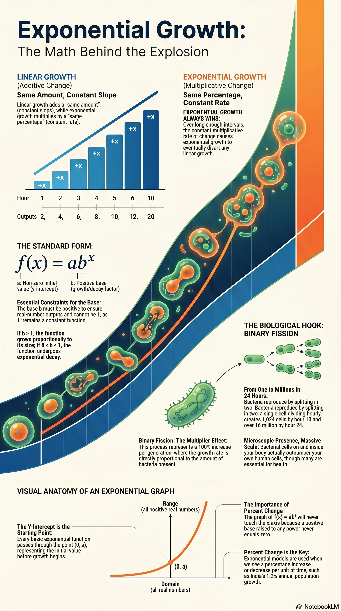
*Generated by NotebookLM — chapter overview poster: linear vs exponential growth, the standard form $f(x) = ab^x$, and the biological/real-world hooks driving why these functions matter.*

---

## 4.1 Exponential Functions

Exponential functions model rapid growth or decay with a constant 
multiplicative rate of change over equal increments of time, contrasting with 
linear functions which exhibit a constant additive rate of change.

> [!definition] Exponential Function
> For any real number $x$, an exponential function is a function with the form 
$f(x) = ab^x$, where:
> * $a$ is a non-zero real number called the initial value.
> * $b$ is any positive real number such that $b \neq 1$.
> * The domain of $f$ is all real numbers.
> * The range of $f$ is all positive real numbers if $a > 0$, and all negative 
real numbers if $a < 0$.
> * The y-intercept is $(0, a)$, and the horizontal asymptote is $y = 0$.

* **Problem.** Which of the following equations are not exponential functions? 
  * $f(x) = 4^{3(x-2)}$
  * $g(x) = x^3$
  * $h(x) = \left(\frac{1}{3}\right)^x$
  * $j(x) = (-2)^x$
* **Setup.** We must evaluate the four given functions against the mathematical
definition of an exponential function.
* **Solution.** By definition, an exponential function has a positive constant 
base and an independent variable as an exponent. For $g(x) = x^3$, the base
is an independent variable, meaning it is a power function, not an exponential 
function. For $j(x) = (-2)^x$, the base $-2$ is less than $0$, violating 
the rule that base $b$ must be a positive constant.
* **Answer.** $g(x) = x^3$ and $j(x) = (-2)^x$ are not exponential functions.
* **Insight.** This example illustrates the strict requirements for the base of
an exponential function: it must be a positive constant not equal to 1.

When evaluating an exponential function, you must carefully follow the order of
operations, especially regarding exponents.

* **Problem.** Let $f(x) = 5(3)^{x+1}$. Evaluate $f(2)$ without using a 
calculator.
* **Setup.** We need to substitute the input value $x = 2$ into the given 
equation.
* **Solution.** Substituting $x = 2$ into the function gives:
  $$f(2) = 5(3)^{2+1}$$
  Following the order of operations, simplify the exponent first:
  $$f(2) = 5(3)^3$$
  Evaluate the power:
  $$f(2) = 5(27)$$
  Multiply the result by the initial value:
  $$f(2) = 135$$
* **Answer.** $135$
* **Insight.** This example highlights the importance of computing the exponent
first before multiplying by the initial value to avoid incorrect outputs.

> [!definition] Exponential Growth
> A function that models exponential growth grows by a rate proportional to the
amount present. For any real number $x$ and any positive real numbers $a$ and 
$b$ such that $b > 1$, an exponential growth function has the form $f(x) = 
ab^x$ where $a$ is the initial or starting value of the function, and $b$ is 
the growth factor or growth multiplier per unit $x$.

We can find the specific equation of an exponential model algebraically if we 
know two data points.

> [!tip] Writing an Exponential Model Given Two Points
> 1. If one of the data points has the form $(0, a)$, then $a$ is the initial 
value. Using $a$, substitute the second point into the equation $f(x) = 
a(b)^x$, and solve for $b$.
> 2. If neither of the data points have the form $(0, a)$, substitute both 
points into two equations with the form $f(x) = a(b)^x$. Solve the resulting 
system of two equations in two unknowns to find $a$ and $b$.
> 3. Using the $a$ and $b$ found in the steps above, write the exponential 
function in the form $f(x) = a(b)^x$.

* **Problem.** In 2006, 80 deer were introduced into a wildlife refuge. By 
2012, the population had grown to 180 deer. The population was growing 
exponentially. Write an exponential function $N(t)$ representing the population
$N$ of deer over time $t$.
* **Setup.** Let the independent variable $t$ be the number of years after 
2006, giving us the points $(0, 80)$ and $(6, 180)$.
* **Solution.** Since $t=0$ gives an output of $80$, our initial value $a$ is 
$80$. Substitute the second point $(6, 180)$ into the general form $N(t) =
ab^t$ to solve for $b$:
  $$180 = 80b^6$$
  Divide by 80 and simplify:
  $$\frac{9}{4} = b^6$$
  Isolate $b$ using properties of exponents:
  $$b = \left(\frac{9}{4}\right)^{\frac{1}{6}}$$
  $$b \approx 1.1447$$
* **Answer.** $N(t) = 80(1.1447)^t$
* **Insight.** Defining the starting year as $t=0$ allows you to immediately 
identify the initial value parameter $a$, greatly simplifying the algebra.

The process of building an exponential equation from a graph is identical to 
using two coordinate pairs.

* **Problem.** Find an equation for the exponential function graphed in Figure 
5.
* **Setup.** Looking at the graph, we can identify the y-intercept at $(0, 3)$ 
and another distinct point on the curve, $(2, 12)$.
* **Solution.** The y-intercept gives us the initial value, $a = 3$. We 
substitute $a=3$ and the point $(2, 12)$ into the standard form $f(x) = ab^x$:
  $$12 = 3b^2$$
  Divide both sides by 3:
  $$4 = b^2$$
  Since we restrict the base $b$ to positive values, we take the principal 
square root:
  $$b = 2$$
* **Answer.** $f(x) = 3(2)^x$
* **Insight.** Using the y-intercept as one of your graph points prevents the 
need to solve a more complex system of equations.

> [!definition] The Compound Interest Formula
> Compound interest can be calculated using the formula $A(t) = P\left(1 + 
\frac{r}{n}\right)^{nt}$, where:
> * $A(t)$ is the account value,
> * $t$ is measured in years,
> * $P$ is the starting amount of the account, often called the principal or 
present value,
> * $r$ is the annual percentage rate (APR) expressed as a decimal,
> * $n$ is the number of compounding periods in one year.

Compound interest utilizes an exponential framework to calculate earnings that 
are repeatedly reinvested into an account.

* **Problem.** If we invest \$3,000 in an investment account paying 3% interest
compounded quarterly, how much will the account be worth in 10 years?
* **Setup.** We identify the variables: $P = 3000$, $r = 0.03$, $n = 4$ 
(quarterly compounding), and $t = 10$.
* **Solution.** Substitute the given values into the compound interest formula:
  $$A(10) = 3000\left(1 + \frac{0.03}{4}\right)^{4 \cdot 10}$$
  Simplify the expression inside the parentheses and the exponent:
  $$A(10) = 3000(1.0075)^{40}$$
  Calculate the final amount using a calculator:
  $$A(10) \approx 4045.05$$
* **Answer.** \$4,045.05
* **Insight.** This example demonstrates straightforward substitution to find 
the future value of a discrete compound interest account.

* **Problem.** A 529 Plan is a college-savings plan that allows relatives to 
invest money to pay for a child’s future college tuition; the account grows 
tax-free. Lily wants to set up a 529 account for her new granddaughter and 
wants the account to grow to \$40,000 over 18 years. She believes the account 
will earn 6% compounded semi-annually (twice a year). To the nearest dollar, 
how much will Lily need to invest in the account now?
* **Setup.** We know the target future value $A(18) = 40000$, $r = 0.06$, $n = 
2$ (semi-annually), and $t = 18$. We must find the principal $P$.
* **Solution.** Substitute the known variables into the formula:
  $$40000 = P\left(1 + \frac{0.06}{2}\right)^{2(18)}$$
  Simplify the terms:
  $$40000 = P(1.03)^{36}$$
  Isolate $P$ by dividing both sides:
  $$P = \frac{40000}{(1.03)^{36}}$$
  Evaluate with a calculator:
  $$P \approx 13801$$
* **Answer.** \$13,801
* **Insight.** The compound interest formula can be manipulated algebraically 
to determine the required present value for a desired future yield.

> [!definition] The Number $e$
> The letter $e$ represents the irrational number $\left(1 + 
\frac{1}{n}\right)^n$ as $n$ increases without bound. It is used as a base
for many real-world exponential models. Because it is an irrational number, we 
use the approximation $e \approx 2.718282$.

Evaluating the number $e$ to specific powers requires using the dedicated 
function on a scientific calculator.

* **Problem.** Calculate $e^{3.14}$. Round to five decimal places.
* **Setup.** We are asked to evaluate base $e$ raised to the power of $3.14$ 
using a calculator.
* **Solution.** On a calculator, press the button labeled $e^x$. The window 
shows $e^\wedge($. Type $3.14$ and close the parenthesis, then press [ENTER].
* **Answer.** $23.10387$
* **Insight.** This demonstrates how to compute exact numerical values for 
continuous models using calculator capabilities.

> [!definition] The Continuous Growth/Decay Formula
> For all real numbers $t$, and all positive numbers $a$ and $r$, continuous 
growth or decay is represented by the formula $A(t) = ae^{rt}$ where:
> * $a$ is the initial value,
> * $r$ is the continuous growth rate per unit time,
> * $t$ is the elapsed time.
> If $r > 0$, the formula represents continuous growth; if $r < 0$, the formula
represents continuous decay. For business applications, it takes the form $A(t)
= Pe^{rt}$, where $P$ is the principal.

Continuous growth formulas utilize $e$ to model interest that compounds 
constantly at every infinitesimal fraction of a second.

* **Problem.** A person invested \$1,000 in an account earning a nominal 10% 
per year compounded continuously. How much was in the account at the end of one
year?
* **Setup.** Because compounding is continuous, we use $A(t) = Pe^{rt}$ with $P
= 1000$, $r = 0.10$, and $t = 1$.
* **Solution.** Substitute the parameters into the continuous compounding 
formula:
  $$A(1) = 1000(e)^{0.10(1)}$$
  Using a calculator to evaluate:
  $$A(1) \approx 1105.17$$
* **Answer.** \$1,105.17
* **Insight.** Continuous compounding provides the absolute maximum possible 
yield for a specific nominal interest rate.

* **Problem.** Radon-222 decays at a continuous rate of 17.3% per day. How much
will 100 mg of Radon-222 decay to in 3 days?
* **Setup.** Because the substance is decaying, the rate must be negative ($r =
-0.173$). We also have $a = 100$ and $t = 3$.
* **Solution.** Substitute these values into the continuous growth/decay 
formula $A(t) = ae^{rt}$:
  $$A(3) = 100e^{-0.173(3)}$$
  Simplify the exponent:
  $$A(3) = 100e^{-0.519}$$
  Use a calculator to approximate:
  $$A(3) \approx 59.5115$$
* **Answer.** 59.5115 mg
* **Insight.** When working with continuous decay, it is critical to manually 
convert the given percentage rate to a negative decimal before executing the 
formula.

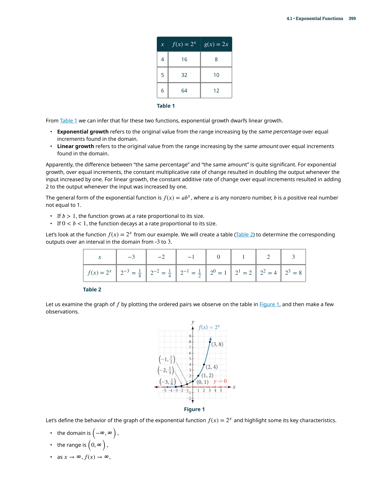
*Figure 1 — Graph of the exponential function $f(x) = 2^x$ (page 409 of the textbook).*

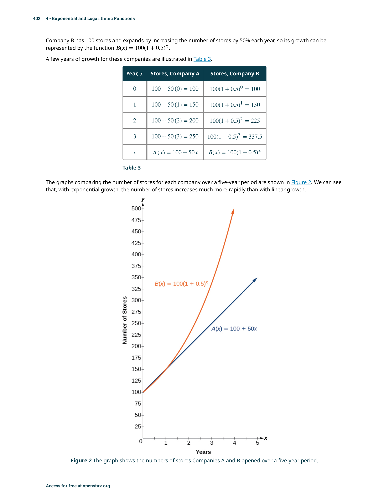
*Figure 2 — Comparison of linear (Company A) vs exponential growth (Company B) over a 5-year span (page 412).*

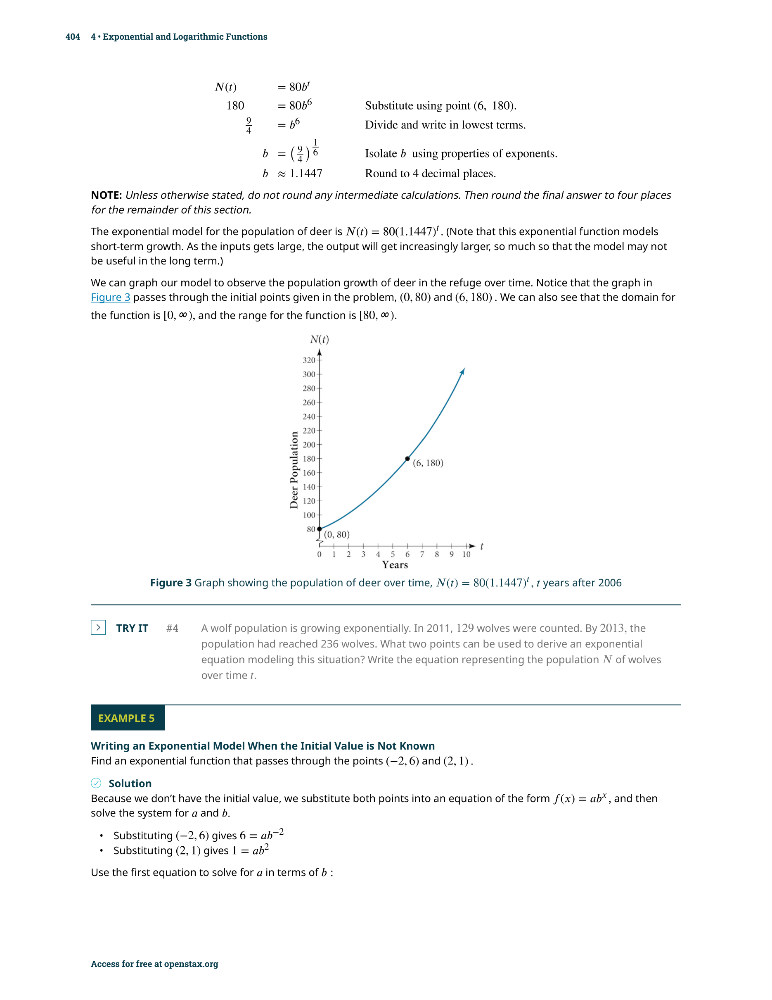
*Figure 3 — Deer population growth over time, $t$ years after 2006 (page 414, Example 4).*

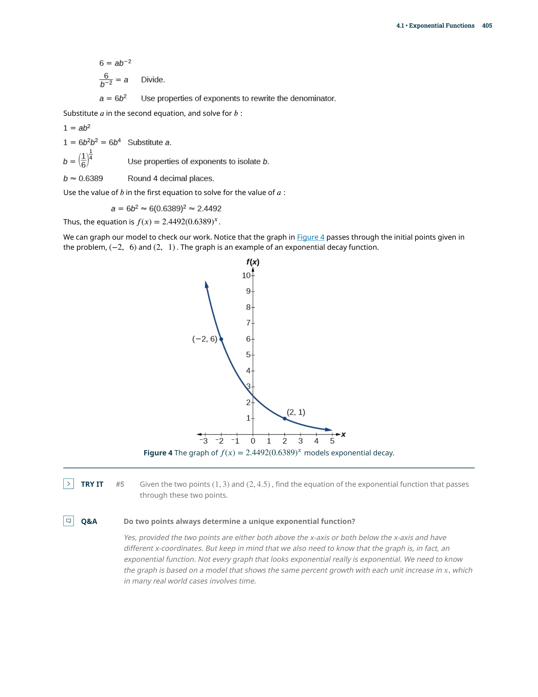
*Figure 4 — Exponential decay function passing through $(-2, 6)$ and $(2, 1)$ (page 415, Example 5).*

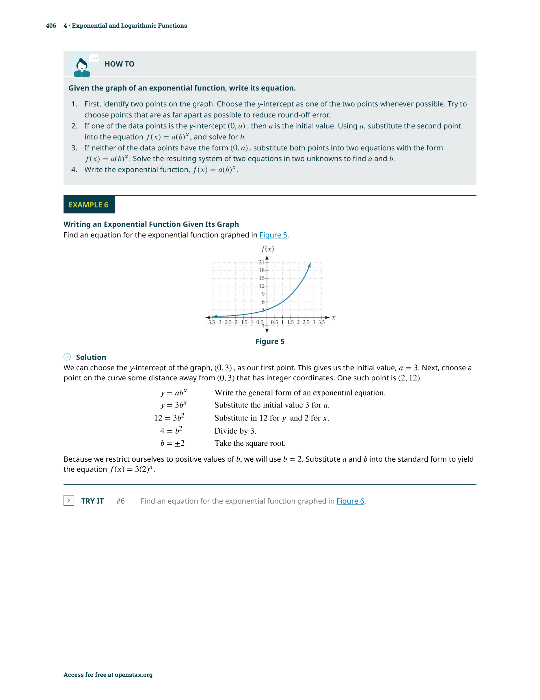
*Figure 5 — Building an exponential function from a graph showing $(0, 3)$ and $(2, 12)$ (page 416, Example 6).*

---

## 4.2 Graphs of Exponential Functions

Before we begin graphing, it is helpful to review the behavior of exponential 
growth and decay. The exponential function maintains its general shape 
regardless of the transformations applied.

> [!definition] **Characteristics of the Graph of the Parent Function $f(x) = 
b^x$**
> An exponential function with the form $f(x) = b^x$, $b > 0$, $b \neq 1$, has 
these characteristics:
> * one-to-one function
> * horizontal asymptote: $y = 0$
> * domain: $(-\infty, \infty)$
> * range: $(0, \infty)$
> * x-intercept: none
> * y-intercept: $(0, 1)$
> * increasing if $b > 1$
> * decreasing if $0 < b < 1$

**EXAMPLE 1**

**Problem.** Sketch a graph of $f(x) = 0.25^x$. State the domain, range, and 
asymptote.
**Setup.** The exponential function $f(x) = 0.25^x$ has a base $b = 0.25$.
**Solution.** Since the base is between zero and one, the function is 
decreasing. The left tail of the graph will increase without bound, and the 
right tail will approach the asymptote $y=0$. Create a table of points:
$x = -1 \implies f(-1) = 0.25^{-1} = 4$
$x = 0 \implies f(0) = 0.25^0 = 1$
$x = 1 \implies f(1) = 0.25^1 = 0.25$
Plot the y-intercept, $(0,1)$, along with the other points and draw a smooth 
curve connecting them.
**Answer.** The domain is $(-\infty, \infty)$, the range is $(0, \infty)$, and 
the horizontal asymptote is $y=0$.
**Insight.** This example illustrates the fundamental shape, domain, and range 
of a decreasing exponential parent function (exponential decay).

Transformations of exponential graphs behave similarly to those of other 
functions. We can apply shifts, reflections, stretches, and compressions 
without loss of the basic exponential shape.

> [!definition] **Shifts of the Parent Function $f(x) = b^x$**
> For any constants $c$ and $d$, the function $f(x) = b^{x+c} + d$ shifts the 
parent function $f(x) = b^x$
> * vertically $d$ units, in the same direction of the sign of $d$.
> * horizontally $c$ units, in the opposite direction of the sign of $c$.
> * The y-intercept becomes $(0, b^c + d)$.
> * The horizontal asymptote becomes $y = d$.
> * The range becomes $(d, \infty)$.
> * The domain, $(-\infty, \infty)$, remains unchanged.

**EXAMPLE 2**

**Problem.** Graph $f(x) = 2^{x+1} - 3$. State the domain, range, and 
asymptote.
**Setup.** We have an exponential equation of the form $f(x) = b^{x+c} + d$, 
with $b = 2$, $c = 1$, and $d = -3$.
**Solution.** Draw the horizontal asymptote $y = d$, which is $y = -3$. 
Identify the horizontal and vertical shifts. The shift is $(-c, d)$, which 
corresponds to $(-1, -3)$. Therefore, we shift the parent graph of $f(x) = 2^x$
left 1 unit and down 3 units.
**Answer.** The domain is $(-\infty, \infty)$, the range is $(-3, \infty)$, and
the horizontal asymptote is $y = -3$.
**Insight.** This example shows how horizontal and vertical translations adjust
the specific positioning of an exponential graph's asymptote and range without 
changing its overall domain.

**EXAMPLE 3**

**Problem.** Solve $42 = 1.2(5)^x + 2.8$ graphically. Round to the nearest 
thousandth.
**Setup.** We need to use a graphing calculator to find the intersection of 
$Y_1 = 1.2(5)^x + 2.8$ and $Y_2 = 42$.
**Solution.** Press [Y=] and enter $1.2(5)^x + 2.8$ next to Y1=. Then enter 
$42$ next to Y2=. Adjust the window to include the intersection (e.g., $x$ from
$-3$ to $3$ and $y$ from $-5$ to $55$). Use the calculator's intersect function
to compute the point of intersection. 
**Answer.** To the nearest thousandth, $x \approx 2.166$.
**Insight.** This example demonstrates how intersecting a horizontal line with 
an exponential curve yields an approximate graphical solution when algebraic 
methods might be less immediate.

While shifting involves adding constants, multiplying the parent function by a 
constant results in a stretch or compression. 

> [!definition] **Stretches and Compressions of the Parent Function $f(x) = 
b^x$**
> For any factor $a > 0$, the function $f(x) = a(b)^x$
> * is stretched vertically by a factor of $a$ if $a > 1$.
> * is compressed vertically by a factor of $a$ if $0 < a < 1$.
> * has a y-intercept of $(0, a)$.
> * has a horizontal asymptote at $y = 0$, a range of $(0, \infty)$, and a 
domain of $(-\infty, \infty)$, which are unchanged from the parent function.

**EXAMPLE 4**

**Problem.** Sketch a graph of $f(x) = 4\left(\frac{1}{2}\right)^x$. State the 
domain, range, and asymptote.
**Setup.** This is an exponential function where the base $b = 1/2$ and the 
vertical stretch factor $a = 4$.
**Solution.** Because the base is between zero and one, the left tail will 
increase without bound as $x$ decreases, and the right tail will approach the 
x-axis as $x$ increases. Since $a = 4$, the graph will be stretched vertically 
by a factor of 4. Calculate key points:
$x = -1 \implies f(-1) = 4(1/2)^{-1} = 8$
$x = 0 \implies f(0) = 4(1/2)^0 = 4$
$x = 1 \implies f(1) = 4(1/2)^1 = 2$
Plot these points and draw a smooth curve connecting them.
**Answer.** The domain is $(-\infty, \infty)$, the range is $(0, \infty)$, and 
the horizontal asymptote is $y = 0$.
**Insight.** This example illustrates how a vertical stretch scales the 
specific $y$-coordinates and y-intercept while preserving the horizontal 
asymptote and overall behavior.

In addition to shifting and scaling, exponential graphs can be reflected across
the x-axis or y-axis by introducing negative signs.

> [!definition] **Reflections of the Parent Function $f(x) = b^x$**
> The function $f(x) = -b^x$
> * reflects the parent function $f(x) = b^x$ about the x-axis.
> * has a y-intercept of $(0, -1)$.
> * has a range of $(-\infty, 0)$.
> * has a horizontal asymptote at $y = 0$ and domain of $(-\infty, \infty)$, 
which are unchanged from the parent function.
> 
> The function $f(x) = b^{-x}$
> * reflects the parent function $f(x) = b^x$ about the y-axis.
> * has a y-intercept of $(0, 1)$, a horizontal asymptote at $y = 0$, a range 
of $(0, \infty)$, and a domain of $(-\infty, \infty)$, which are unchanged from
the parent function.

**EXAMPLE 5**

**Problem.** Find and graph the equation for a function, $g(x)$, that reflects 
$f(x) = \left(\frac{1}{4}\right)^x$ about the x-axis. State its domain, range, 
and asymptote.
**Setup.** The parent function is $f(x) = \left(\frac{1}{4}\right)^x$, and we 
want to reflect it about the x-axis.
**Solution.** To reflect the parent function about the x-axis, we multiply 
$f(x)$ by $-1$ to get $g(x) = -\left(\frac{1}{4}\right)^x$. Then create a table
of points:
$x = -1 \implies g(-1) = -(1/4)^{-1} = -4$
$x = 0 \implies g(0) = -(1/4)^0 = -1$
$x = 1 \implies g(1) = -(1/4)^1 = -0.25$
Plot the y-intercept, $(0,-1)$, along with the other points and draw a smooth 
curve.
**Answer.** The equation is $g(x) = -\left(\frac{1}{4}\right)^x$. The domain is
$(-\infty, \infty)$, the range is $(-\infty, 0)$, and the horizontal asymptote 
is $y = 0$.
**Insight.** This example highlights that reflecting a graph across the x-axis 
negates all output values, consequently flipping the range of the function from
positive to negative.

All of the discussed translations (shifts, stretches/compressions, and 
reflections) can be summarized into a single general equation.

> [!definition] **Translations of Exponential Functions**
> A translation of an exponential function has the form 
> $$f(x) = ab^{x+c} + d$$
> Where the parent function, $y = b^x$, $b > 1$, is
> * shifted horizontally $c$ units to the left.
> * stretched vertically by a factor of $|a|$ if $|a| > 1$.
> * compressed vertically by a factor of $|a|$ if $0 < |a| < 1$.
> * shifted vertically $d$ units.
> * reflected about the x-axis when $a < 0$.
>
> Note the order of the shifts, transformations, and reflections follow the 
order of operations.

**EXAMPLE 6**

**Problem.** Write the equation for the function described below. Give the 
horizontal asymptote, the domain, and the range.
* $f(x) = e^x$ is vertically stretched by a factor of $2$, reflected across the
y-axis, and then shifted up $4$ units.
**Setup.** Start with the general transformation form $f(x) = ab^{x+c} + d$ and
parent function $f(x) = e^x$.
**Solution.** Use the description to determine the parameters $a$, $b$, $c$, 
and $d$:
* The parent function base is $b = e$.
* The function is stretched by a factor of 2, so $a = 2$.
* The function is reflected about the y-axis, so we replace the exponent $x$ 
with $-x$.
* The graph is shifted vertically up 4 units, so $d = 4$.
Substituting these values into the general form, the equation becomes $f(x) = 
2e^{-x} + 4$.
**Answer.** The equation is $f(x) = 2e^{-x} + 4$. The domain is $(-\infty, 
\infty)$, the range is $(4, \infty)$, and the horizontal asymptote is $y = 4$.
**Insight.** This example confirms how verbal descriptions of multiple 
successive transformations translate directly into the algebraic parameters of 
an exponential equation.

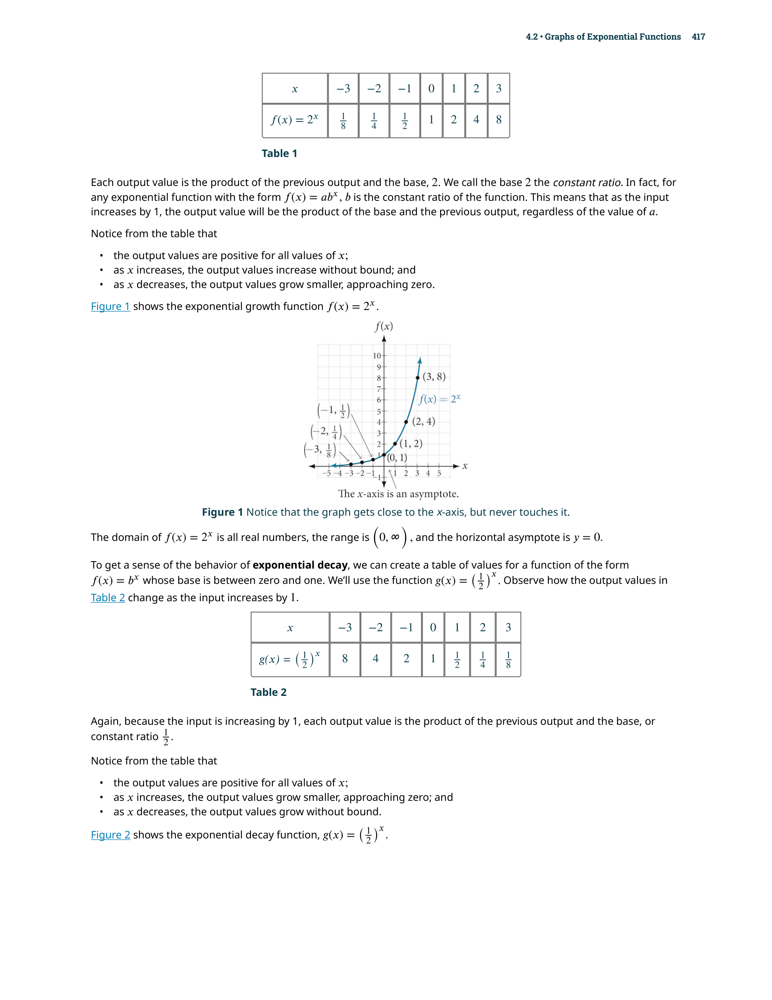
*Figure 1 — Exponential growth function $f(x) = 2^x$. Graph approaches but never touches the x-axis (page 427).*

*Figure 2 — Exponential decay function $g(x) = (1/2)^x$ (page 427).*

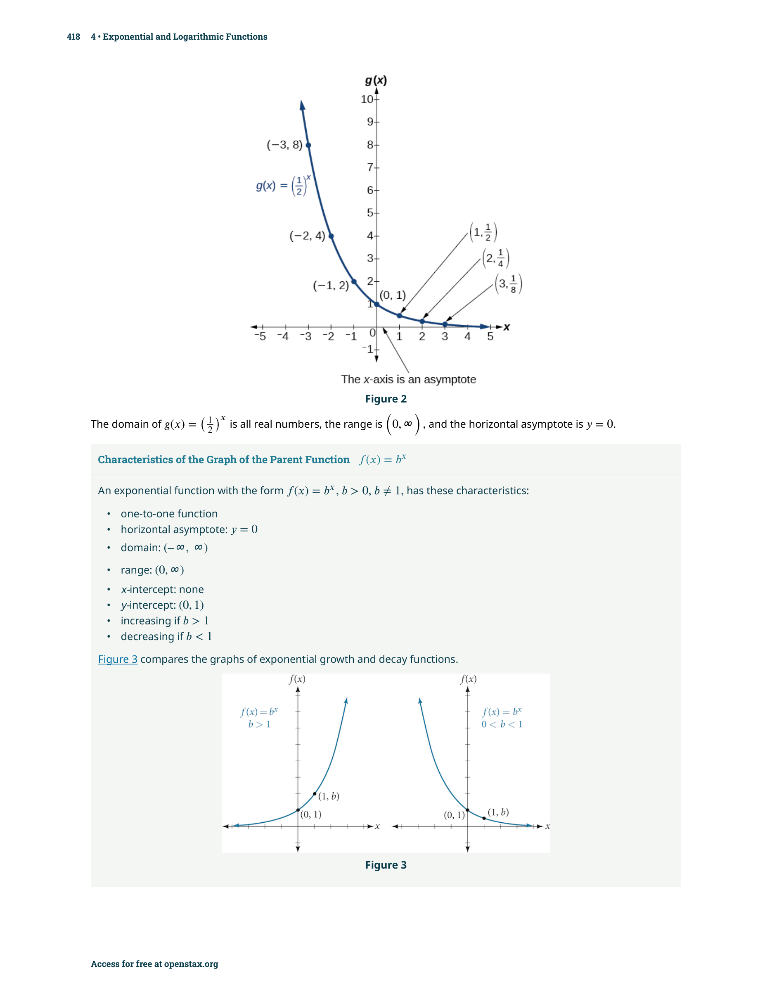
*Figure 3 — Side-by-side comparison of exponential growth and decay graphs (page 428).*

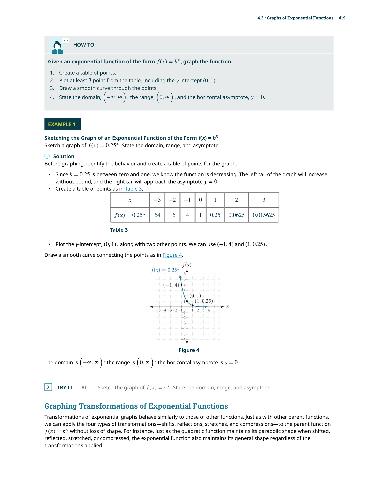
*Figure 4 — Graph of $f(x) = 0.25^x$ (page 429, Example 1).*

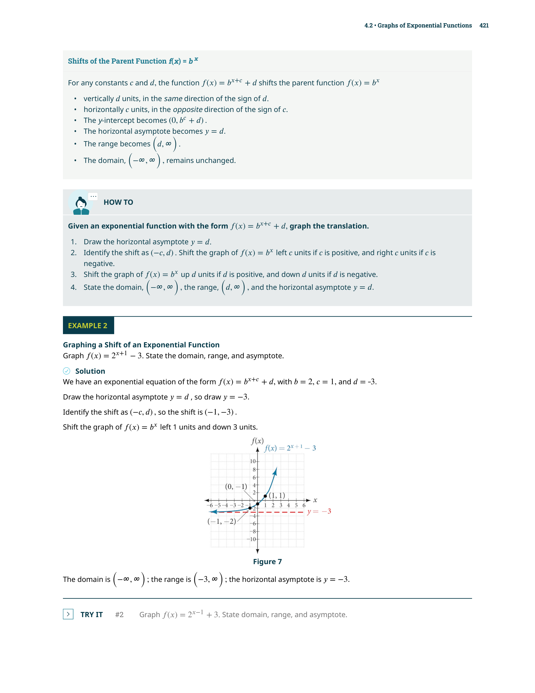
*Figure 7 — $f(x) = 2^{x+1} - 3$ shifted left 1 and down 3 from the parent $2^x$ (page 431, Example 2).*

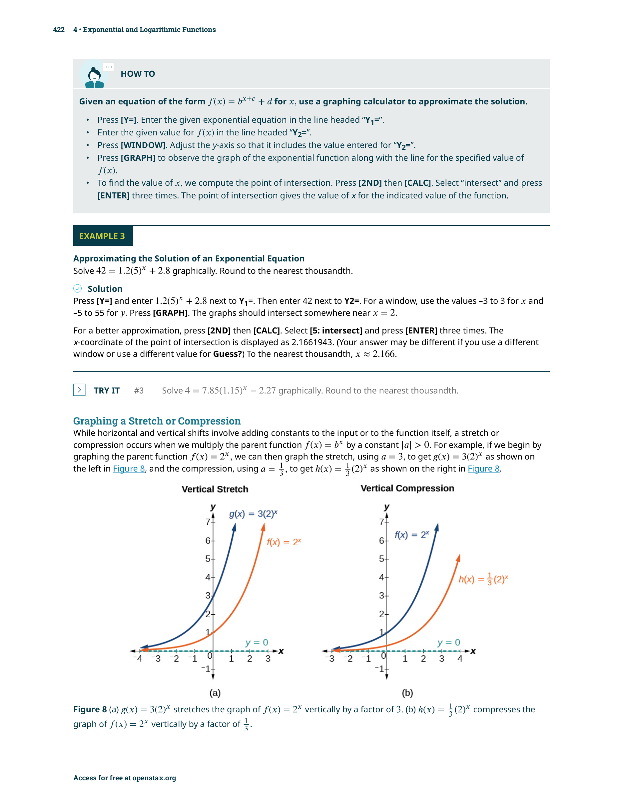
*Figure 8 — Vertical stretch (left, $\times 4$) and compression (right, $\times 1/4$) of $2^x$ (page 432).*

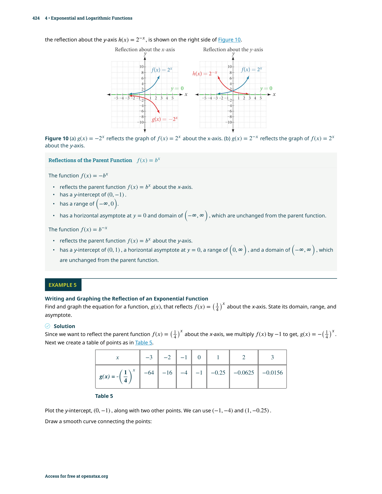
*Figure 10 — Reflections of $f(x) = 2^x$ over the x-axis ($-2^x$) and y-axis ($2^{-x}$) (page 434).*

---

## 4.3 Logarithmic Functions

Logarithmic functions serve as the inverse of exponential functions, allowing 
us to find the required exponent when the base and the result are known.

> [!definition] Definition of the Logarithmic Function
> A logarithm base $b$ of a positive number $x$ satisfies the following 
definition. For $x > 0$, $b > 0$, $b \neq 1$,
> $$y = \log_b(x) \text{ is equivalent to } b^y = x$$
> where $y$ is the exponent to which $b$ must be raised to get $x$. 
> The domain of the logarithm function with base $b$ is $(0, \infty)$ and the 
range is $(-\infty, \infty)$.

> [!tip] Logarithms of Negative Numbers and Zero
> We can never take the logarithm of a negative number or zero. Because the
base of an exponential function is always positive, no power of that base can 
ever be negative or zero.

> [!tip] Converting Between Forms
> To convert from logarithmic to exponential form, identify $b$, $y$, and $x$ 
in $y = \log_b(x)$ and rewrite it as $b^y = x$. Reverse this process to 
convert from exponential form to logarithmic form.

**Example 1**
- **Problem.** Write the following logarithmic equations in exponential form. ⓐ
$\log_6(\sqrt{6}) = \frac{1}{2}$ ⓑ $\log_3(9) = 2$
- **Setup.** We are given logarithmic equations in the form $y = \log_b(x)$.
- **Solution.** First, identify the values of $b$, $y$, and $x$. Then, write 
the equation in the form $b^y = x$. For ⓐ: $b = 6$, $y = \frac{1}{2}$, and $x =
\sqrt{6}$. For ⓑ: $b = 3$, $y = 2$, and $x = 9$.
- **Answer.** ⓐ $6^{1/2} = \sqrt{6}$ ⓑ $3^2 = 9$
- **Insight.** This illustrates how to translate logarithmic statements back 
into their equivalent exponential facts.

**Example 2**
- **Problem.** Write the following exponential equations in logarithmic form. 
a. $2^3 = 8$ b. $5^2 = 25$ c. $10^{-4} = \frac{1}{10,000}$
- **Setup.** We are given exponential equations in the form $b^y = x$.
- **Solution.** First, identify the values of $b$, $y$, and $x$. Then, write 
the equation in the form $y = \log_b(x)$. For a: $b=2$, $y=3$, $x=8$. For b: 
$b=5$, $y=2$, $x=25$. For c: $b=10$, $y=-4$, $x=\frac{1}{10,000}$.
- **Answer.** a. $\log_2(8) = 3$ b. $\log_5(25) = 2$ c. 
$\log_{10}(\frac{1}{10,000}) = -4$
- **Insight.** This demonstrates isolating the exponent by applying a logarithm
of the corresponding base.

Knowing the squares, cubes, and roots of numbers allows us to evaluate many 
logarithms mentally by identifying what exponent the base must be raised to in 
order to produce the argument.

**Example 3**
- **Problem.** Solve $\log_4(64)$ without using a calculator.
- **Setup.** We need to find the exponent to which 4 must be raised to equal 
64.
- **Solution.** First we rewrite the logarithm in exponential form: $4^y = 64$.
Next, we ask, "To what exponent must 4 be raised in order to get 64?" We know 
$4^3 = 64$.
- **Answer.** $3$
- **Insight.** This demonstrates how familiarity with common exponential powers
makes evaluating basic logarithms straightforward.

**Example 4**
- **Problem.** Evaluate $\log_3(\frac{1}{27})$ without using a calculator.
- **Setup.** We need to find the exponent to which 3 must be raised to equal 
$\frac{1}{27}$.
- **Solution.** Rewrite the logarithm in exponential form: $3^y = 
\frac{1}{27}$. We know $3^3 = 27$. Using the reciprocal rule for exponents, we 
write $3^{-3} = \frac{1}{3^3} = \frac{1}{27}$.
- **Answer.** $-3$
- **Insight.** This illustrates that taking the logarithm of a reciprocal of a 
base's power yields a negative exponent.

Sometimes logarithms are written without an explicit base. In mathematics, 
this generally means the base is 10. 

> [!definition] Definition of the Common Logarithm
> A common logarithm is a logarithm with base 10. We can write 
$\log_{10}(x)$ simply as $\log(x)$. For $x > 0$,
> $$y = \log(x) \text{ is equivalent to } 10^y = x$$
> The logarithm $y$ is the exponent to which 10 must be raised to get $x$.

**Example 5**
- **Problem.** Evaluate $\log(1000)$ without using a calculator.
- **Setup.** We need to find the common logarithm (base 10) of 1000.
- **Solution.** Rewrite the logarithm in exponential form: $10^y = 1000$. We 
know $10^3 = 1000$.
- **Answer.** $3$
- **Insight.** The common logarithm counts the number of factors of 10, often 
corresponding to the number of zeros in magnitude.

**Example 6**
- **Problem.** Evaluate $\log(321)$ to four decimal places using a calculator.
- **Setup.** We need to find the exponent for base 10 that yields 321.
- **Solution.** Press [LOG]. Enter 321, followed by [ ) ]. Press [ENTER]. Since
321 is between 100 ($10^2$) and 1000 ($10^3$), the result must be between 2 and
3.
- **Answer.** $2.5065$
- **Insight.** Calculators quickly approximate the precise decimal exponents 
required for non-perfect powers of 10.

**Example 7**
- **Problem.** The amount of energy released from one earthquake was 500 times 
greater than the amount of energy released from another. The equation $10^x = 
500$ represents this situation, where $x$ is the difference in magnitudes on 
the Richter Scale. To the nearest thousandth, what was the difference in 
magnitudes?
- **Setup.** Solve the exponential equation $10^x = 500$ for $x$.
- **Solution.** We begin by rewriting the exponential equation in logarithmic 
form: $\log(500) = x$. Next we evaluate the logarithm using a calculator: Press
[LOG], enter 500, followed by [ ) ], and press [ENTER].
- **Answer.** $2.699$
- **Insight.** This shows how converting an exponential relationship into a 
common logarithm is used to solve real-world problems with base-ten scaling.

The most frequently used base for logarithms in calculus and scientific 
applications is the irrational number $e$ ($e \approx 2.718$). Logarithms 
with this base are called natural logarithms.

> [!definition] Definition of the Natural Logarithm
> A natural logarithm is a logarithm with base $e$. We write $\log_e(x)$ 
simply as $\ln(x)$. For $x > 0$,
> $$y = \ln(x) \text{ is equivalent to } e^y = x$$
> Since the functions $y = e^x$ and $y = \ln(x)$ are inverse functions, 
$\ln(e^x) = x$ for all $x$, and $e^{\ln(x)} = x$ for $x > 0$.

**Example 8**
- **Problem.** Evaluate $\ln(500)$ to four decimal places using a calculator.
- **Setup.** We need to compute the base $e$ logarithm of 500.
- **Solution.** Press [LN]. Enter 500, followed by [ ) ]. Press [ENTER].
- **Answer.** $6.2146$
- **Insight.** Scientific calculators provide a dedicated [LN] key to easily 
compute exponents necessary for continuous growth and decay models.

*Figure 1 — March 11, 2011 Honshu, Japan earthquake — the motivation for logarithmic measurement scales (page 440).*

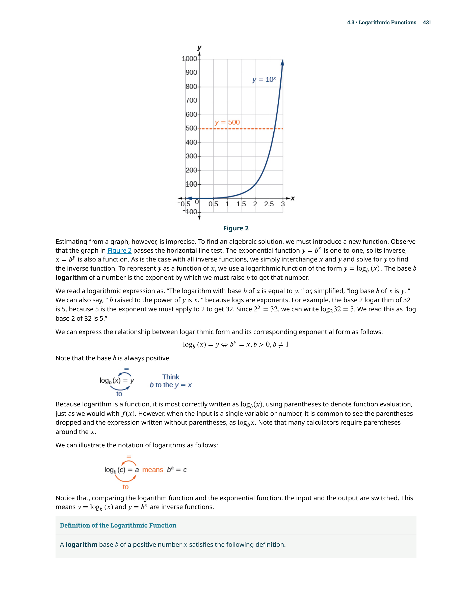
*Figure 2 — Graphical estimation of $\log_2 8$ before introducing exact algebraic methods (page 441).*

---

## 4.4 Graphs of Logarithmic Functions

We evaluate the domain and behavior of logarithmic functions by recalling that 
they are the inverse of exponential functions. Because every logarithmic 
function is the inverse of an exponential equation, we can think of every 
output on a logarithmic graph as the input for the corresponding inverse 
exponential equation. 

### Finding the Domain of a Logarithmic Function

> [!definition] Domain and Range of Logarithmic Functions
> The exponential function $y = b^x$ has domain $(-\infty, \infty)$ and range 
$(0, \infty)$. As inverse functions, the logarithmic function $y = \log_b(x)$ 
has its domain and range interchanged:
> - The domain is $(0, \infty)$.
> - The range is $(-\infty, \infty)$.
> 
> Therefore, the argument of the logarithmic function must always be greater 
than zero.

> [!tip] How To: Identify the domain of a logarithmic function
> 1. Set up an inequality showing the argument greater than zero.
> 2. Solve for $x$.
> 3. Write the domain in interval notation.

**EXAMPLE 1**
**Problem**: What is the domain of $f(x) = \log_2(2x - 3)$?
**Setup**: Set the argument of the logarithm strictly greater than zero.
**Solution**: Since the input must be positive, we set $2x - 3 > 0$. Adding 3 
to both sides gives $2x > 3$, and dividing by 2 yields $x > 1.5$.
**Answer**: The domain of $f(x)$ is $(1.5, \infty)$.
**Insight**: Applying transformations can change the domain. Here, a horizontal
shift and compression alters the valid inputs for the function.

**EXAMPLE 2**
**Problem**: What is the domain of $f(x) = \log(5 - 2x)$?
**Setup**: Set the argument strictly greater than zero.
**Solution**: Set the argument $5 - 2x > 0$. Subtracting 5 from both sides 
gives $-2x > -5$. Dividing by $-2$ requires switching the inequality symbol, 
resulting in $x < \frac{5}{2}$ or $x < 2.5$.
**Answer**: The domain of $f(x)$ is $(-\infty, 2.5)$.
**Insight**: A reflection across the y-axis, created by a negative coefficient 
inside the argument, reverses the direction of the valid domain interval.

### Graphing Logarithmic Functions

> [!definition] Characteristics of the Graph of the Parent Function $f(x) = 
\log_b(x)$
> For any real number $x$ and constant $b > 0$, $b \neq 1$, the graph of $f(x) 
= \log_b(x)$ has these characteristics:
> - one-to-one function
> - vertical asymptote: $x = 0$
> - domain: $(0, \infty)$
> - range: $(-\infty, \infty)$
> - x-intercept: $(1, 0)$ and key point $(b, 1)$
> - y-intercept: none
> - increasing if $b > 1$
> - decreasing if $0 < b < 1$

> [!tip] How To: Graph a logarithmic function with the form $f(x) = \log_b(x)$
> 1. Draw and label the vertical asymptote, $x = 0$.
> 2. Plot the x-intercept, $(1, 0)$.
> 3. Plot the key point $(b, 1)$.
> 4. Draw a smooth curve through the points.
> 5. State the domain, $(0, \infty)$, the range, $(-\infty, \infty)$, and the 
vertical asymptote, $x = 0$.

**EXAMPLE 3**
**Problem**: Graph $f(x) = \log_5(x)$. State the domain, range, and asymptote.
**Setup**: Identify the base $b = 5$ to determine the behavior and key points.
**Solution**: Because $b > 1$, the function is increasing. The left tail of the
graph approaches the vertical asymptote $x = 0$ and the right tail increases 
slowly without bound. The x-intercept is $(1, 0)$. The key point $(b, 1)$ 
becomes $(5, 1)$. We draw the asymptote, plot the points, and connect them with
a smooth curve.
**Answer**: The domain is $(0, \infty)$, the range is $(-\infty, \infty)$, and 
the vertical asymptote is $x = 0$. 
**Insight**: Observe that as the value of the base increases, the graph 
compresses vertically. 

### Graphing Transformations of Logarithmic Functions

Just as with other parent functions, we can apply horizontal shifts, vertical 
shifts, stretches, compressions, and reflections to logarithmic functions 
without losing their fundamental shape.

#### Horizontal Shifts

> [!definition] Horizontal Shifts of the Parent Function
> For any constant $c$, the function $f(x) = \log_b(x + c)$:
> - shifts the parent function $y = \log_b(x)$ left $c$ units if $c > 0$.
> - shifts the parent function $y = \log_b(x)$ right $c$ units if $c < 0$.
> - has the vertical asymptote $x = -c$.
> - has domain $(-c, \infty)$.
> - has range $(-\infty, \infty)$.

> [!tip] How To: Graph a horizontal shift
> 1. Identify the horizontal shift: if $c > 0$, shift left $c$ units; if $c < 
0$, shift right $c$ units.
> 2. Draw the vertical asymptote $x = -c$.
> 3. Identify three key points from the parent function and find new 
coordinates by subtracting $c$ from the $x$ coordinate.
> 4. Label the points.
> 5. State the domain $(-c, \infty)$, range $(-\infty, \infty)$, and vertical 
asymptote $x = -c$.

**EXAMPLE 4**
**Problem**: Sketch a graph of $f(x) = \log_3(x - 2)$ alongside its parent 
function. Include the key points and asymptotes on the graph. State the domain,
range, and asymptote.
**Setup**: Compare the function to the transformation form $y = \log_b(x + c)$.
Here, $c = -2$.
**Solution**: Because $c = -2$ ($c < 0$), the graph of the parent function $y =
\log_3(x)$ is shifted right 2 units. The vertical asymptote shifts from $x = 0$
to $x = 2$. The three key points for the parent function are $(\frac{1}{3}, 
-1)$, $(1, 0)$, and $(3, 1)$. Adding 2 to the x-coordinates yields the new 
points: $(2\frac{1}{3}, -1)$, $(3, 0)$, and $(5, 1)$.
**Answer**: The domain is $(2, \infty)$, the range is $(-\infty, \infty)$, and 
the vertical asymptote is $x = 2$.
**Insight**: A horizontal shift directly alters the domain and the vertical 
asymptote, but leaves the range unchanged.

#### Vertical Shifts

> [!definition] Vertical Shifts of the Parent Function
> For any constant $d$, the function $f(x) = \log_b(x) + d$:
> - shifts the parent function $y = \log_b(x)$ up $d$ units if $d > 0$.
> - shifts the parent function $y = \log_b(x)$ down $d$ units if $d < 0$.
> - has the vertical asymptote $x = 0$.
> - has domain $(0, \infty)$.
> - has range $(-\infty, \infty)$.

> [!tip] How To: Graph a vertical shift
> 1. Identify the vertical shift: if $d > 0$, shift up $d$ units; if $d < 0$, 
shift down $d$ units.
> 2. Draw the vertical asymptote $x = 0$.
> 3. Identify three key points from the parent function and find new 
coordinates by adding $d$ to the $y$ coordinate.
> 4. Label the points.
> 5. State the domain $(0, \infty)$, range $(-\infty, \infty)$, and vertical 
asymptote $x = 0$.

**EXAMPLE 5**
**Problem**: Sketch a graph of $f(x) = \log_3(x) - 2$ alongside its parent 
function. Include the key points and asymptote on the graph. State the domain, 
range, and asymptote.
**Setup**: Compare to the form $y = \log_b(x) + d$. Here, $d = -2$.
**Solution**: Because $d = -2$, we shift the parent function $y = \log_3(x)$ 
down 2 units. The vertical asymptote remains $x = 0$. The key points of the 
parent function $(\frac{1}{3}, -1)$, $(1, 0)$, and $(3, 1)$ are transformed by 
subtracting 2 from their y-coordinates, resulting in $(\frac{1}{3}, -3)$, $(1, 
-2)$, and $(3, -1)$.
**Answer**: The domain is $(0, \infty)$, the range is $(-\infty, \infty)$, and 
the vertical asymptote is $x = 0$.
**Insight**: Vertical shifts translate the y-intercept mapping but do not 
affect the domain boundaries or the vertical asymptote.

#### Stretches and Compressions

> [!definition] Vertical Stretches and Compressions of the Parent Function
> For any constant $a > 0$, the function $f(x) = a\log_b(x)$:
> - stretches the parent function vertically by a factor of $a$ if $a > 1$.
> - compresses the parent function vertically by a factor of $a$ if $0 < a < 
1$.
> - has the vertical asymptote $x = 0$.
> - has the x-intercept $(1, 0)$.
> - has domain $(0, \infty)$.
> - has range $(-\infty, \infty)$.

> [!tip] How To: Graph a stretch or compression
> 1. Identify the vertical stretch or compression factor $a$.
> 2. Draw the vertical asymptote $x = 0$.
> 3. Identify three key points from the parent function and multiply their $y$ 
coordinates by $a$.
> 4. Label the three points.
> 5. State the domain $(0, \infty)$, range $(-\infty, \infty)$, and vertical 
asymptote $x = 0$.

**EXAMPLE 6**
**Problem**: Sketch a graph of $f(x) = 2\log_4(x)$ alongside its parent 
function. Include the key points and asymptote on the graph. State the domain, 
range, and asymptote.
**Setup**: Compare to the form $y = a\log_b(x)$. Here, $a = 2$.
**Solution**: We stretch the parent function $y = \log_4(x)$ vertically by a 
factor of 2. The vertical asymptote is $x = 0$. Using the parent function's key
points $(\frac{1}{4}, -1)$, $(1, 0)$, and $(4, 1)$, we multiply each 
y-coordinate by 2 to find the new coordinates: $(\frac{1}{4}, -2)$, $(1, 0)$, 
and $(4, 2)$.
**Answer**: The domain is $(0, \infty)$, the range is $(-\infty, \infty)$, and 
the vertical asymptote is $x = 0$.
**Insight**: The x-intercept stays at $(1, 0)$ under vertical stretches and 
compressions because multiplying a y-value of 0 by any factor remains 0.

**EXAMPLE 7**
**Problem**: Sketch a graph of $f(x) = 5\log(x + 2)$. State the domain, range, 
and asymptote.
**Setup**: Follow the order of operations: inside the parentheses first 
(shift), then outside (stretch).
**Solution**: First, the $+2$ inside shifts the graph left 2 units, making the 
vertical asymptote $x = -2$ and the domain $(-2, \infty)$. The x-intercept 
shifts from $(1, 0)$ to $(-1, 0)$. Using the common base 10, a parent key point
is $(10, 1)$. Shifting it left 2 gives $(8, 1)$. Next, multiply the 
y-coordinates by the stretch factor of 5. The point $(8, 1)$ becomes $(8, 5)$.
**Answer**: The domain is $(-2, \infty)$, the range is $(-\infty, \infty)$, and
the vertical asymptote is $x = -2$.
**Insight**: Always apply transformations following the mathematical order of 
operations to correctly locate key coordinate points.

#### Reflections

> [!definition] Reflections of the Parent Function
> The function $f(x) = -\log_b(x)$:
> - reflects the parent function $y = \log_b(x)$ about the x-axis.
> - has domain $(0, \infty)$, range $(-\infty, \infty)$, and vertical asymptote
$x = 0$ (unchanged).
> 
> The function $f(x) = \log_b(-x)$:
> - reflects the parent function $y = \log_b(x)$ about the y-axis.
> - has domain $(-\infty, 0)$, range $(-\infty, \infty)$, and vertical 
asymptote $x = 0$.

> [!tip] How To: Graph a reflection
> - For an x-axis reflection $f(x) = -\log_b(x)$: Reflect the graph over the 
x-axis, preserving intercept $(1, 0)$ and domain $(0, \infty)$.
> - For a y-axis reflection $f(x) = \log_b(-x)$: Reflect the graph over the 
y-axis. Change intercept to $(-1, 0)$ and domain to $(-\infty, 0)$.

**EXAMPLE 8**
**Problem**: Sketch a graph of $f(x) = \log(-x)$ alongside its parent function.
Include the key points and asymptote on the graph. State the domain, range, and
asymptote.
**Setup**: The input variable $x$ is multiplied by $-1$, indicating a 
reflection about the y-axis.
**Solution**: The parent function $y = \log(x)$ increases as $x$ increases. 
Reflecting this across the y-axis means $f(x)$ will be decreasing as $x$ moves 
from $-\infty$ to $0$. The right tail approaches the asymptote $x = 0$. The 
x-intercept reflects from $(1, 0)$ to $(-1, 0)$. The key point $(10, 1)$ 
reflects to $(-10, 1)$. 
**Answer**: The domain is $(-\infty, 0)$, the range is $(-\infty, \infty)$, and
the vertical asymptote is $x = 0$.
**Insight**: Reflecting across the y-axis is the only basic logarithmic 
transformation that creates a domain bounded from the right rather than the 
left.

#### Approximating Solutions Graphically

**EXAMPLE 9**
**Problem**: Approximating the Solution of a Logarithmic Equation: Solve a logarithmic equation graphically. Round to the nearest thousandth. (Note: the precise equation text was not preserved in the source extraction; in the original OpenStax textbook the equation is $4\ln(x) + 1 = -2\ln(x - 1)$.)
**Setup**: Use a graphing calculator to find the numerical solution by graphing both sides of the equation as independent functions ($Y_1$ and $Y_2$) and finding their point of intersection.
**Solution**: Press [Y=] and enter the left side of the equation next to $Y_1=$. Then enter the right side next to $Y_2=$. For a window, use $0$ to $5$ for $x$ and $-10$ to $10$ for $y$. Press [GRAPH]. The graphs should intersect somewhere a little to the right of $x = 1$. For a better approximation, press [2ND] then [CALC]. Select [5: intersect] and press [ENTER] three times. The x-coordinate of the point of intersection is displayed as $1.3385297$.
**Answer**: To the nearest thousandth, $x \approx 1.339$.
**Insight**: The intersection tool on a graphing utility provides an effective graphical approximation for solutions to logarithmic equations that cannot be solved cleanly by algebraic manipulation alone.

#### Summarizing Translations

> [!definition] Transformations of Logarithmic Functions
> All transformations of the parent logarithmic function, $y = \log_b(x)$, have
the form:
> $$f(x) = a\log_b(x + c) + d$$
> where the parent function is:
> - shifted horizontally to the left $c$ units.
> - stretched vertically by a factor of $|a|$ if $|a| > 1$.
> - compressed vertically by a factor of $|a|$ if $0 < |a| < 1$.
> - shifted vertically up $d$ units.
> - reflected about the x-axis when $a < 0$.
> 
> For $f(x) = \log(-x)$, the graph of the parent function is reflected about 
the y-axis. Note: operations follow standard algebraic order.

**EXAMPLE 10**
**Problem**: What is the vertical asymptote of $f(x) = -2\log_3(x + 4) + 5$?
**Setup**: Identify the horizontal shift component $c$ in the argument.
**Solution**: The argument of the logarithm is $(x + 4)$. Setting $x + 4 = 0$ 
yields $x = -4$, meaning the parent curve is shifted 4 units to the left. The 
coefficient $-2$ and the upward vertical translation $+5$ do not affect the 
asymptote.
**Answer**: The vertical asymptote is $x = -4$.
**Insight**: Only modifications to the input of the logarithmic argument 
(horizontal shifts and stretches) alter the position of the vertical asymptote.

**EXAMPLE 11**
**Problem**: Find a possible equation for the common logarithmic function 
graphed with a vertical asymptote at $x = 0$, passing through $(1, 1)$ and $(4,
-2)$.
**Setup**: The vertical asymptote at $x = 0$ means there's no horizontal shift.
We look for an equation of the form $f(x) = a\log(x) + d$. 
**Solution**: Substituting the point $(1, 1)$ into the formula gives $1 = 
a\log(1) + d$. Because $\log(1) = 0$, we find $d = 1$. Our equation is now 
$f(x) = a\log(x) + 1$. Next, substitute the point $(4, -2)$ to solve for $a$: 
$-2 = a\log(4) + 1$
$-3 = a\log(4)$
$a = \frac{-3}{\log(4)}$
**Answer**: The equation is $f(x) = \frac{-3}{\log(4)}\log(x) + 1$.
**Insight**: We can verify the equation by checking other values across its 
domain to ensure they match the end behavior (going down as it goes right, 
meaning $\text{as } x \to \infty, f(x) \to -\infty$).

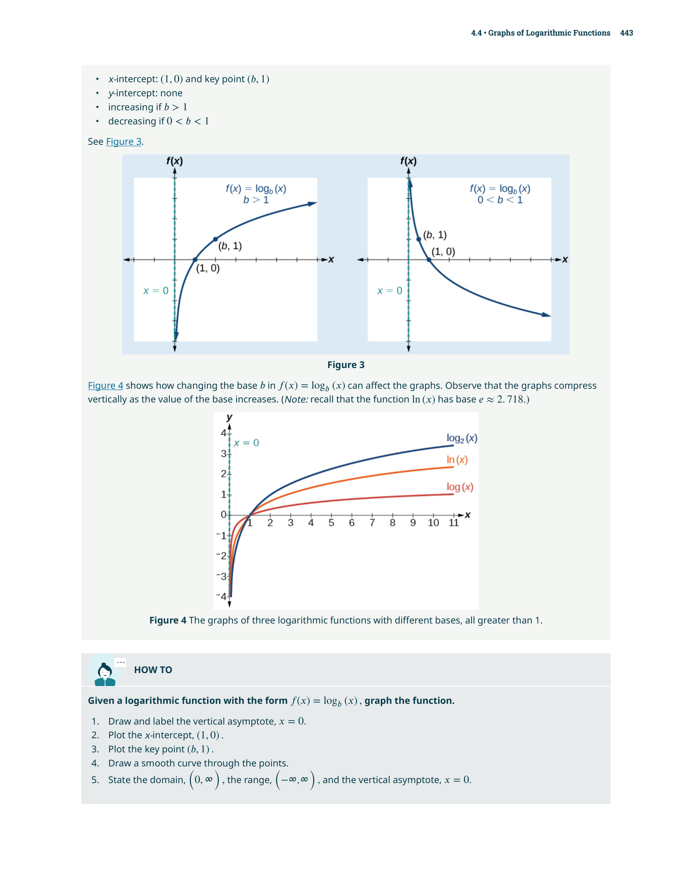
*Figure 4 — Three logarithmic functions with bases $> 1$ (page 453).*

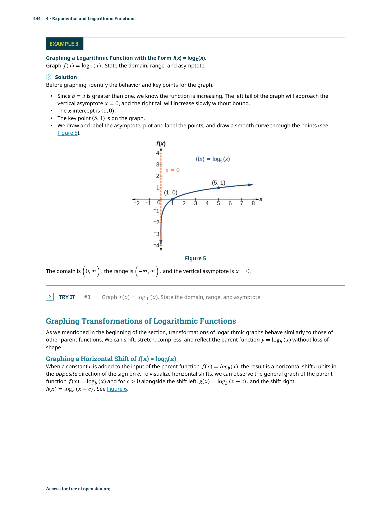
*Figure 5 — Horizontal shifts of the parent log function (page 454).*

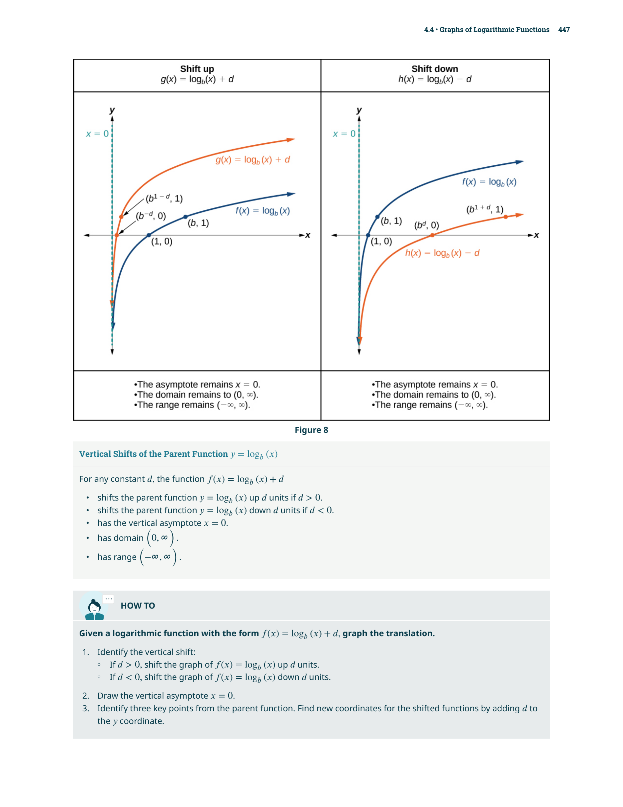
*Figure 8 — Vertical shifts of the parent log function (page 457).*

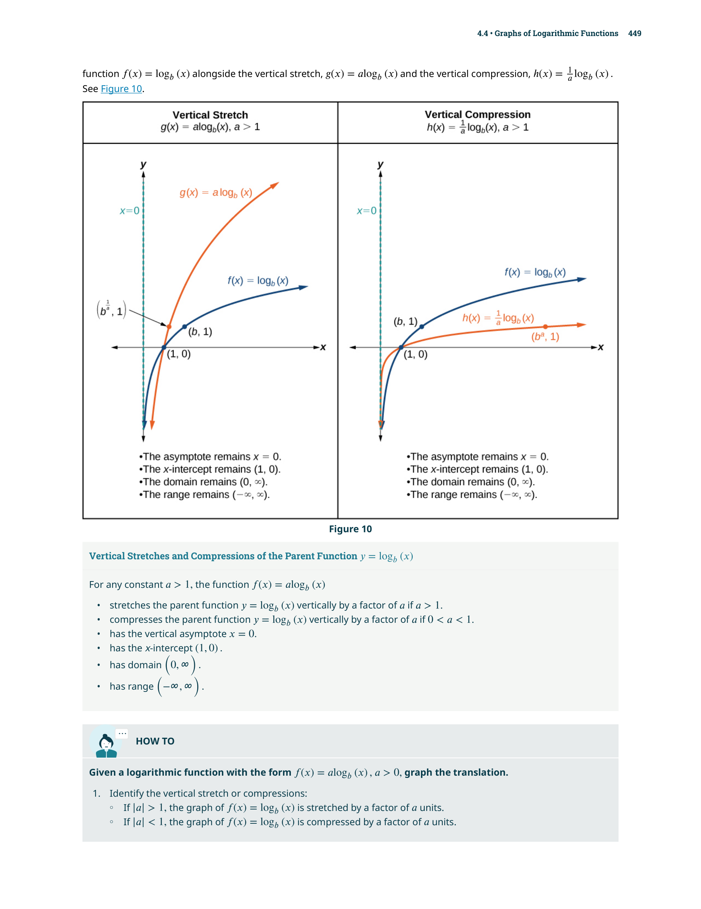
*Figure 10 — Vertical stretches and compressions of $\log$ (page 459).*

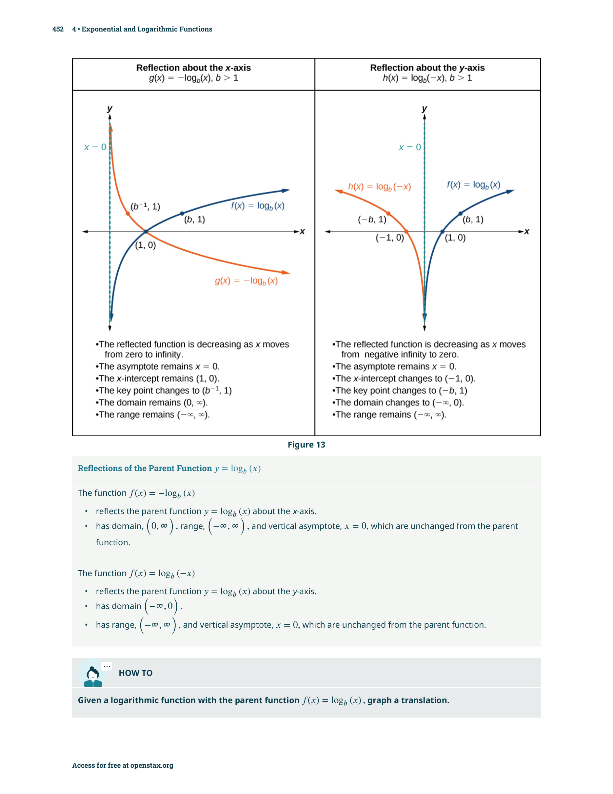
*Figure 13 — Reflections of the parent log function over x- and y-axes (page 462).*

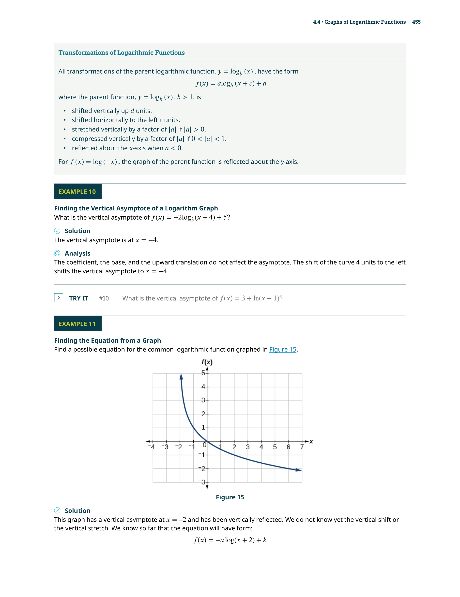
*Figure 15 — Graphical solution to a log equation by intersection (page 465, Example).*

---

## 4.5 Logarithmic Properties

Logarithms act as the inverse of exponential functions, meaning they share 
corresponding properties that allow us to manipulate and simplify expressions. To build a foundation for solving more complex equations, we first rely on
a set of fundamental rules. 

> [!definition] Basic Properties of Logarithms
> For any base $b > 0$, $b \neq 1$:
> * $\log_b(1) = 0$ since $b^0 = 1$,.
> * $\log_b(b) = 1$ since $b^1 = b$,.
> * **Inverse Property**: $\log_b(b^x) = x$ and $b^{\log_b(x)} = x$ (for $x > 
0$),.
> * **One-to-One Property**: $\log_b(M) = \log_b(N) \iff M = N$.

These foundational rules naturally extend to operations involving 
multiplication, division, and exponents, leading to the three primary "laws of 
logs".

### The Product Rule for Logarithms

Because logarithms are exponents, taking the logarithm of a product is 
equivalent to adding their respective exponents. 

> [!definition] Product Rule for Logarithms
> The logarithm of a product can be rewritten as a sum of individual logarithms: 
> $\log_b(MN) = \log_b(M) + \log_b(N)$ for $b > 0$.

**Example 1**
* **Problem**: Expand $\log_3(30x(3x+4))$.
* **Setup**: Factor the argument completely to isolate the terms of the product.
* **Solution**: Express $30$ as a product of prime numbers: $30 = 2 \cdot 3 
\cdot 5$. Apply the product rule to split the factors into a sum of 
logarithms: $\log_3(2) + \log_3(3) + \log_3(5) + \log_3(x) + \log_3(3x+4)$.
* **Answer**: $\log_3(2) + 1 + \log_3(5) + \log_3(x) + \log_3(3x+4)$.
* **Insight**: Repeated applications of the product rule allow you to split any
number of multiplied factors into separate added logarithms. 

### The Quotient Rule for Logarithms

Just as dividing exponential expressions requires subtracting exponents, taking
the logarithm of a quotient results in a difference of logarithms,.

> [!definition] Quotient Rule for Logarithms
> The logarithm of a quotient can be rewritten as the difference of individual 
logarithms:
> $\log_b\left(\frac{M}{N}\right) = \log_b(M) - \log_b(N)$.

**Example 2**
* **Problem**: Expand $\log_2\left(\frac{15x(x-1)}{(3x+4)(2-x)}\right)$.
* **Setup**: Ensure the expression is in lowest terms, then separate the 
numerator and denominator using the quotient rule,.
* **Solution**: 
  1. Apply the quotient rule: $\log_2(15x(x-1)) - \log_2((3x+4)(2-x))$.
  2. Apply the product rule to both groups (factoring $15$ as $3 \cdot 5$): 
$[\log_2(3) + \log_2(5) + \log_2(x) + \log_2(x-1)] - [\log_2(3x+4) + 
\log_2(2-x)]$.
* **Answer**: $\log_2(3) + \log_2(5) + \log_2(x) + \log_2(x-1) - \log_2(3x+4) -
\log_2(2-x)$.
* **Insight**: Be mindful to distribute the negative sign to all terms that 
originated in the denominator. 

### The Power Rule for Logarithms

We can handle exponents within a logarithm's argument by turning them into 
multipliers.

> [!definition] Power Rule for Logarithms
> The logarithm of a power can be simplified by moving the exponent to the 
front, making it a product of the exponent and the logarithm of the base:
> $\log_b(M^n) = n\log_b(M)$.

**Example 3**
* **Problem**: Expand $\log_5(x^5)$.
* **Setup**: Identify the exponent ($5$) and the base of the argument ($x$).
* **Solution**: Apply the power rule to bring the exponent $5$ to the front.
* **Answer**: $5\log_5(x)$.
* **Insight**: This rule relies directly on the product rule, turning repeated 
multiplication inside the argument into repeated addition (multiplication) 
outside the logarithm.

**Example 4**
* **Problem**: Expand $\log_3(25)$ using the power rule for logs.
* **Setup**: The argument is not written as a power, so rewrite it as a power 
first.
* **Solution**: Express $25$ as $5^2$. This gives $\log_3(5^2)$. Then, bring 
the exponent $2$ to the front.
* **Answer**: $2\log_3(5)$.
* **Insight**: When evaluating or simplifying, look for perfect squares or 
cubes hidden within the argument,.

**Example 5**
* **Problem**: Rewrite $4\log_3(x)$ as a single logarithm with a leading 
coefficient of $1$.
* **Setup**: Apply the power rule in reverse.
* **Solution**: Identify the factor ($4$) as the exponent and the argument 
($x$) as the base. Move the $4$ to the exponent position.
* **Answer**: $\log_3(x^4)$.
* **Insight**: The power rule works identically in both directions, making it a
powerful tool for condensing expressions.

### Expanding and Condensing Expressions

By combining the product, quotient, and power rules, we can expand complex 
expressions into simpler parts or condense multiple logarithmic terms into a 
single, compact logarithm,. 

**Example 6**
* **Problem**: Expand $\ln\left(\frac{x^4y}{7}\right)$ as a sum or difference 
of logs.
* **Setup**: Work systematically from the outside in—first addressing the 
quotient, then the product, then powers.
* **Solution**: 
  1. Apply quotient rule: $\ln(x^4y) - \ln(7)$.
  2. Apply product rule: $\ln(x^4) + \ln(y) - \ln(7)$.
  3. Apply power rule: $4\ln(x) + \ln(y) - \ln(7)$.
* **Answer**: $4\ln(x) + \ln(y) - \ln(7)$.
* **Insight**: You cannot expand addition or subtraction *inside* the argument 
of a logarithm,.

**Example 7**
* **Problem**: Expand $\log(\sqrt{x})$.
* **Setup**: Convert the radical to a fractional exponent.
* **Solution**: Rewrite as $\log(x^{1/2})$ and apply the power rule.
* **Answer**: $\frac{1}{2}\log(x)$.
* **Insight**: The power rule smoothly accommodates radicals when written as 
rational exponents,.

**Example 8**
* **Problem**: Expand $\log_6\left(\frac{64x^3(4x+1)}{(2x-1)}\right)$.
* **Setup**: Apply quotient, product, and power rules in sequence,.
* **Solution**: 
  1. Quotient rule gives $\log_6(64x^3(4x+1)) - \log_6(2x-1)$.
  2. Product rule expands the first term to $\log_6(64) + \log_6(x^3) + 
\log_6(4x+1)$.
  3. Note that $64 = 2^6$, so power rule gives $6\log_6(2)$ and $3\log_6(x)$.
* **Answer**: $6\log_6(2) + 3\log_6(x) + \log_6(4x+1) - \log_6(2x-1)$.
* **Insight**: Even highly complex algebraic fractions break apart gracefully 
if you evaluate operations in reverse order of the standard arithmetic order of
operations,.

> [!tip] Strategy to Condense Logarithms
> 1. Use the power rule to pull coefficients up into exponents.
> 2. Use the product rule to merge sums of logs into a single logarithm of a 
product.
> 3. Use the quotient rule to merge differences of logs into a single logarithm
of a quotient.

**Example 9**
* **Problem**: Write $\log_3(5) + \log_3(8) - \log_3(2)$ as a single logarithm.
* **Setup**: Proceed from left to right using the product rule then quotient 
rule.
* **Solution**: First, $\log_3(5 \cdot 8) = \log_3(40)$. Next, $\log_3(40) - 
\log_3(2) = \log_3\left(\frac{40}{2}\right)$.
* **Answer**: $\log_3(20)$.
* **Insight**: Expressions must share the identical base to be condensed using 
these properties.

**Example 10**
* **Problem**: Condense $2\log_2(x) + \frac{1}{2}\log_2(x-1) - 6\log_2(x+3)$.
* **Setup**: Shift coefficients to exponents, then apply product and quotient 
rules.
* **Solution**: 
  1. Power rule: $\log_2(x^2) + \log_2(\sqrt{x-1}) - \log_2((x+3)^6)$.
  2. Product rule: $\log_2(x^2\sqrt{x-1}) - \log_2((x+3)^6)$.
  3. Quotient rule: $\log_2\left(\frac{x^2\sqrt{x-1}}{(x+3)^6}\right)$.
* **Answer**: $\log_2\left(\frac{x^2\sqrt{x-1}}{(x+3)^6}\right)$.
* **Insight**: Fractional exponents generated by the power rule can optionally 
be rewritten as radicals for a cleaner final expression.

**Example 11**
* **Problem**: Rewrite $2\log(x) - 4\log(x+5) + \frac{1}{x}\log(3x+5)$ as a 
single logarithm.
* **Setup**: Use the power rule, group added terms together, and apply product 
and quotient rules.
* **Solution**: 
  1. Power rule: $\log(x^2) - \log((x+5)^4) + \log((3x+5)^{x^{-1}})$.
  2. Rearrange to sum positive terms: $\log(x^2) + \log((3x+5)^{x^{-1}}) - 
\log((x+5)^4)$.
  3. Apply product rule: $\log\left(x^2(3x+5)^{x^{-1}}\right) - \log((x+5)^4)$.
  4. Apply quotient rule: $\log\left(\frac{x^2(3x+5)^{x^{-1}}}{(x+5)^4}\right)$.
* **Answer**: $\log\left(\frac{x^2(3x+5)^{x^{-1}}}{(x+5)^4}\right)$.
* **Insight**: Rearranging positive and negative logarithmic terms prior to 
combining helps ensure that each sub-expression lands correctly in the 
numerator or denominator,.

**Example 12**
* **Problem**: Recall that $pH = -\log([H^+])$. If the concentration of 
hydrogen ions in a liquid is doubled, what is the effect on pH?
* **Setup**: Use $x$ as original concentration. Compare original pH to new pH.
* **Solution**: Let the original concentration be $x$, so original $pH = 
-\log(x)$. The new concentration is $2x$, so the new $pH = -\log(2x)$. 
Apply the product rule: $-\log(2x) = -(\log(2) + \log(x)) = -\log(x) - \log(2)$.
* **Answer**: Since $\log(2) \approx 0.301$, the new pH decreases by about 
$0.301$.
* **Insight**: Logarithmic rules are incredibly useful for modeling relative, 
scaling changes in scientific applications like measuring pH.

### The Change-of-Base Formula

Most computational tools natively evaluate only base $10$ (common logarithm) 
and base $e$ (natural logarithm). The change-of-base formula bridges this 
gap.

> [!definition] The Change-of-Base Formula
> A logarithm with any base can be evaluated by rewriting it as a quotient of 
logarithms with any positive base $n \neq 1$,:
> $\log_b(M) = \frac{\log_n(M)}{\log_n(b)}$
> 
> *Using natural logs*: $\log_b(M) = \frac{\ln(M)}{\ln(b)}$
> *Using common logs*: $\log_b(M) = \frac{\log(M)}{\log(b)}$

**Example 13**
* **Problem**: Change $\log_5(3)$ to a quotient of natural logarithms.
* **Setup**: Use the change-of-base formula with $n = e$ so the output uses 
$\ln$.
* **Solution**: The argument $3$ goes to the numerator's log argument, and the 
base $5$ goes to the denominator's log argument.
* **Answer**: $\frac{\ln(3)}{\ln(5)}$.
* **Insight**: The old base always falls to the bottom (denominator), and the 
old argument stays on top (numerator),.

**Example 14**
* **Problem**: Evaluate $\log_2(10)$ using the change-of-base formula with a 
calculator.
* **Setup**: Because calculators support $\ln$, rewrite the base $2$ logarithm 
as a quotient of natural logs.
* **Solution**: Rewrite as $\frac{\ln(10)}{\ln(2)}$ and evaluate.
* **Answer**: $\approx 3.3219$.
* **Insight**: The choice between using natural log ($\ln$) or common log 
($\log$) for the change-of-base evaluation is arbitrary; both will yield the 
identical decimal result,.

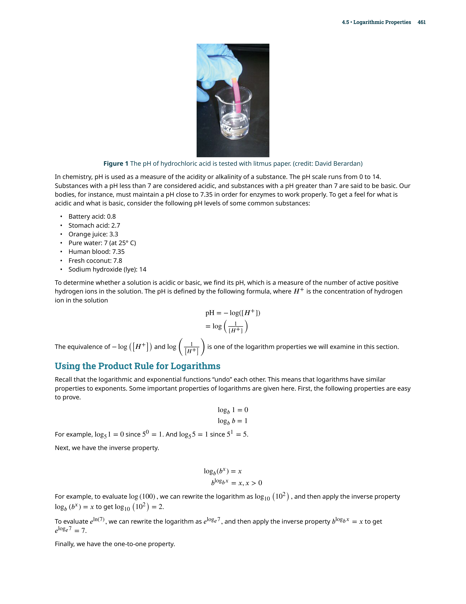
*Figure 1 — pH of hydrochloric acid tested with litmus paper — the real-world motivation for logarithmic scales (page 471).*

---

## 4.6 Exponential and Logarithmic Equations

To solve exponential and logarithmic equations, we rely heavily on the 
fundamental properties of these functions. Their inherent one-to-one 
nature—meaning each output corresponds to exactly one input—allows us to 
algebraically equate exponents or arguments when the bases match. 

> [!definition] Using the One-to-One Property of Exponential Functions to Solve
Exponential Equations
> For any algebraic expressions $S$ and $T$, and any positive real number $b 
\neq 1$, 
> $$b^S = b^T \text{ if and only if } S = T$$

> [!tip] HOW TO: Given an exponential equation with the form $b^S = b^T$, where
$S$ and $T$ are algebraic expressions with an unknown, solve for the unknown.
> 1. Use the rules of exponents to simplify, if necessary, so that the 
resulting equation has the form $b^S = b^T$.
> 2. Use the one-to-one property to set the exponents equal.
> 3. Solve the resulting equation, $S = T$, for the unknown.

**EXAMPLE 1**

* **Problem.** Solve $2^{x-1} = 2^{2x-4}$.
* **Setup.** Both sides of the equation already share a common base of $2$, so 
we can set the exponents equal.
* **Solution.** 
  $$2^{x-1} = 2^{2x-4}$$
  $$x - 1 = 2x - 4 \quad \text{(Apply the one-to-one property of exponents)}$$
  $$2x - x = 4 - 1 \quad \text{(Subtract } x \text{ and add 4 to both sides)}$$
  $$x = 3$$
* **Answer.** $x = 3$
* **Insight.** When bases are identical, we can bypass the exponential form 
entirely and equate their exponents directly to solve for the unknown.

Sometimes the common base for an exponential equation is not explicitly shown. 
In these cases, we simply rewrite the terms in the equation as powers with a 
common base, and solve using the one-to-one property.

> [!tip] HOW TO: Given an exponential equation with unlike bases, use the 
one-to-one property to solve it.
> 1. Rewrite each side in the equation as a power with a common base.
> 2. Use the rules of exponents to simplify, if necessary, so that the 
resulting equation has the form $b^S = b^T$.
> 3. Use the one-to-one property to set the exponents equal.
> 4. Solve the resulting equation, $S = T$, for the unknown.

**EXAMPLE 2**

* **Problem.** Solve $8^{x+2} = 16^{x+1}$.
* **Setup.** The bases $8$ and $16$ can both be rewritten as powers of a common
base, $2$.
* **Solution.** 
  $$8^{x+2} = 16^{x+1}$$
  $$(2^3)^{x+2} = (2^4)^{x+1} \quad \text{(Write 8 and 16 as powers of 2)}$$
  $$2^{3x+6} = 2^{4x+4} \quad \text{(To take a power of a power, multiply 
exponents)}$$
  $$3x + 6 = 4x + 4 \quad \text{(Use the one-to-one property to set the 
exponents equal)}$$
  $$x = 2 \quad \text{(Solve for } x)$$
* **Answer.** $x = 2$
* **Insight.** Finding a common prime base allows us to translate equations 
with different bases into easily solvable linear equations.

**EXAMPLE 3**

* **Problem.** Solve $2^{5x} = \sqrt{2}$.
* **Setup.** Rewrite the square root as a fractional exponent so it shares the 
base of $2$.
* **Solution.** 
  $$2^{5x} = 2^{\frac{1}{2}} \quad \text{(Write the square root of 2 as a power
of 2)}$$
  $$5x = \frac{1}{2} \quad \text{(Use the one-to-one property)}$$
  $$x = \frac{1}{10} \quad \text{(Solve for } x)$$
* **Answer.** $x = \frac{1}{10}$
* **Insight.** Radicals can be expressed as fractional exponents, allowing the 
one-to-one property to be seamlessly applied.

**EXAMPLE 4**

* **Problem.** Solve $3^{x+1} = -2$.
* **Setup.** Analyze the range of exponential functions before attempting 
algebraic manipulation.
* **Solution.** This equation has no solution. There is no real value of $x$ 
that will make the equation a true statement because any power of a positive 
number is positive. 
* **Answer.** No solution.
* **Insight.** A positive base raised to any real power can never yield a 
negative result, making equations of this form inherently unsolvable.

When the terms of an exponential equation cannot be rewritten with a common 
base, we solve by taking the logarithm of each side. 

> [!tip] HOW TO: Given an exponential equation in which a common base cannot be
found, solve for the unknown.
> 1. Apply the logarithm of both sides of the equation.
>    a. If one of the terms in the equation has base 10, use the common 
logarithm.
>    b. If none of the terms in the equation has base 10, use the natural 
logarithm.
> 2. Use the rules of logarithms to solve for the unknown.

**EXAMPLE 5**

* **Problem.** Solve $5^{x+2} = 4^x$.
* **Setup.** Since $5$ and $4$ do not share a common base, take the natural 
logarithm of both sides.
* **Solution.** 
  $$5^{x+2} = 4^x$$
  $$\ln(5^{x+2}) = \ln(4^x) \quad \text{(Take } \ln \text{ of both sides)}$$
  $$(x + 2)\ln 5 = x\ln 4 \quad \text{(Use laws of logs)}$$
  $$x\ln 5 + 2\ln 5 = x\ln 4 \quad \text{(Use the distributive law)}$$
  $$x\ln 5 - x\ln 4 = -2\ln 5 \quad \text{(Get terms containing } x \text{ on 
one side, terms without } x \text{ on the other)}$$
  $$x(\ln 5 - \ln 4) = -2\ln 5 \quad \text{(On the left hand side, factor out 
an } x)$$
  $$x\ln\left(\frac{5}{4}\right) = \ln\left(\frac{1}{25}\right) \quad 
\text{(Use the laws of logs)}$$
  $$x = \frac{\ln\left(\frac{1}{25}\right)}{\ln\left(\frac{5}{4}\right)} \quad 
\text{(Divide by the coefficient of } x)$$
* **Answer.** $x = 
\frac{\ln\left(\frac{1}{25}\right)}{\ln\left(\frac{5}{4}\right)}$
* **Insight.** Taking the natural logarithm of both sides lets us pull variable
exponents down as coefficients using the power rule for logarithms.

Equations containing the base $e$ are common in models representing continuous 
growth or decay. We use the natural logarithm to simplify and solve these.

> [!tip] HOW TO: Given an equation of the form $y = Ae^{kt}$, solve for $t$.
> 1. Divide both sides of the equation by $A$.
> 2. Apply the natural logarithm of both sides of the equation.
> 3. Divide both sides of the equation by $k$.

**EXAMPLE 6**

* **Problem.** Solve $100 = 20e^{2t}$.
* **Setup.** Isolate the exponential expression $e^{2t}$ first.
* **Solution.** 
  $$100 = 20e^{2t}$$
  $$5 = e^{2t} \quad \text{(Divide by the coefficient of the power)}$$
  $$\ln 5 = 2t \quad \text{(Take } \ln \text{ of both sides. Use the fact that 
} \ln(x) \text{ and } e^x \text{ are inverse functions.)}$$
  $$t = \frac{\ln 5}{2} \quad \text{(Divide by the coefficient of } t)$$
* **Answer.** $t = \frac{\ln 5}{2}$
* **Insight.** Isolating the base $e$ allows the natural logarithm to cleanly 
extract the exponent due to their inverse relationship.

**EXAMPLE 7**

* **Problem.** Solve $4e^{2x} + 5 = 12$.
* **Setup.** Combine constants to isolate the base $e$ expression.
* **Solution.** 
  $$4e^{2x} + 5 = 12$$
  $$4e^{2x} = 7 \quad \text{(Combine like terms)}$$
  $$e^{2x} = \frac{7}{4} \quad \text{(Divide by the coefficient of the 
power)}$$
  $$2x = \ln\left(\frac{7}{4}\right) \quad \text{(Take } \ln \text{ of both 
sides)}$$
  $$x = \frac{1}{2}\ln\left(\frac{7}{4}\right) \quad \text{(Solve for } x)$$
* **Answer.** $x = \frac{1}{2}\ln\left(\frac{7}{4}\right)$
* **Insight.** Standard algebraic steps like addition and division must be 
performed first to isolate the exponential component before applying 
logarithms.

> [!definition] Extraneous Solutions
> Sometimes the methods used to solve an equation introduce an extraneous 
solution, which is a solution that is correct algebraically but does not 
satisfy the conditions of the original equation. If solving yields a step where
the argument of a logarithm would be negative, or an exponential output would 
be negative, it must be rejected.

**EXAMPLE 8**

* **Problem.** Solve $e^{2x} - e^x = 56$.
* **Setup.** Recognize the quadratic form ($u^2 - u - 56 = 0$ where $u = e^x$) 
and factor.
* **Solution.** 
  $$e^{2x} - e^x - 56 = 0 \quad \text{(Get one side of the equation equal to 
zero)}$$
  $$(e^x + 7)(e^x - 8) = 0 \quad \text{(Factor by the FOIL method)}$$
  $$e^x + 7 = 0 \text{ or } e^x - 8 = 0 \quad \text{(If a product is zero, then
one factor must be zero)}$$
  $$e^x = -7 \text{ or } e^x = 8 \quad \text{(Isolate the exponentials)}$$
  $$e^x = 8 \quad \text{(Reject the equation in which the power equals a 
negative number)}$$
  $$x = \ln 8 \quad \text{(Solve the equation in which the power equals a 
positive number)}$$
* **Answer.** $x = \ln 8$
* **Insight.** Exponential equations can sometimes disguise quadratic 
structures, requiring factoring and the vigilant rejection of negative 
extraneous solutions.

We can use the definition of a logarithm to solve logarithmic equations when 
the argument is an algebraic expression.

> [!definition] Using the Definition of a Logarithm to Solve Logarithmic 
Equations
> For any algebraic expression $S$ and real numbers $b$ and $c$, where $b > 0$,
$b \neq 1$, 
> $$\log_b(S) = c \text{ if and only if } b^c = S$$

**EXAMPLE 9**

* **Problem.** Solve $2\ln x + 3 = 7$.
* **Setup.** Unwind the equation algebraically to isolate the logarithm, then 
convert it to exponential form.
* **Solution.** 
  $$2\ln x + 3 = 7$$
  $$2\ln x = 4 \quad \text{(Subtract 3)}$$
  $$\ln x = 2 \quad \text{(Divide by 2)}$$
  $$x = e^2 \quad \text{(Rewrite in exponential form)}$$
* **Answer.** $x = e^2$
* **Insight.** Using basic arithmetic to isolate the logarithm is the crucial 
first step before translating the relationship into its exponential 
counterpart.

**EXAMPLE 10**

* **Problem.** Solve $2\ln(6x) = 7$.
* **Setup.** Isolate the natural logarithm, taking care not to alter its 
argument.
* **Solution.** 
  $$2\ln(6x) = 7$$
  $$\ln(6x) = \frac{7}{2} \quad \text{(Divide by 2)}$$
  $$6x = e^{\left(\frac{7}{2}\right)} \quad \text{(Use the definition of } 
\ln)$$
  $$x = \frac{1}{6}e^{\left(\frac{7}{2}\right)} \quad \text{(Divide by 6)}$$
* **Answer.** $x = \frac{1}{6}e^{\left(\frac{7}{2}\right)}$
* **Insight.** The argument of the logarithm remains completely locked and 
protected until the logarithm is removed via exponential conversion.

**EXAMPLE 11**

* **Problem.** Solve $\ln x = 3$.
* **Setup.** Use the definition of the natural logarithm directly.
* **Solution.** 
  $$\ln x = 3$$
  $$x = e^3 \quad \text{(Use the definition of the natural logarithm)}$$
* **Answer.** $x = e^3$ (or approximately $20.0855$)
* **Insight.** Graphical intersections provide strong visual approximations, 
while the definition of the logarithm provides the exact exponential form.

Similarly to exponential functions, we can take advantage of the one-to-one 
nature of logarithmic functions.

> [!definition] Using the One-to-One Property of Logarithms to Solve 
Logarithmic Equations
> For any algebraic expressions $S$ and $T$ and any positive real number $b$, 
where $b \neq 1$,
> $$\log_b S = \log_b T \text{ if and only if } S = T$$
> *(Note: Always check to see if the answer is an extraneous solution where the
argument evaluates to a negative number).*

> [!tip] HOW TO: Given an equation containing logarithms, solve it using the 
one-to-one property.
> 1. Use the rules of logarithms to combine like terms, if necessary, so that 
the resulting equation has the form $\log_b S = \log_b T$.
> 2. Use the one-to-one property to set the arguments equal.
> 3. Solve the resulting equation, $S = T$, for the unknown.

**EXAMPLE 12**

* **Problem.** Solve $\log(3x-2) - \log(2) = \log(x+4)$.
* **Setup.** Use the quotient rule to condense the left side into a single 
logarithm so both sides share the same base logarithm.
* **Solution.** 
  $$\log(3x-2) - \log(2) = \log(x+4)$$
  $$\log\left(\frac{3x-2}{2}\right) = \log(x+4) \quad \text{(Apply the quotient
rule of logarithms)}$$
  $$\frac{3x-2}{2} = x + 4 \quad \text{(Apply the one to one property of a 
logarithm)}$$
  $$3x - 2 = 2x + 8 \quad \text{(Multiply both sides of the equation by 2)}$$
  $$x = 10 \quad \text{(Subtract } 2x \text{ and add 2)}$$
* **Answer.** $x = 10$
* **Insight.** Condensing multiple logarithms into a single logarithm on each 
side enables the immediate equating of their arguments.

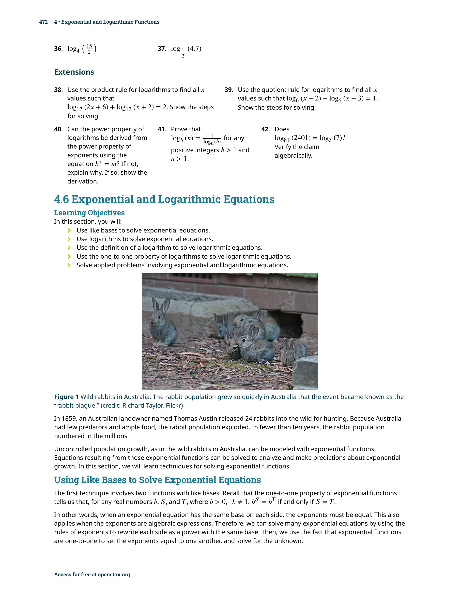
*Figure 1 — Wild rabbits in Australia, an iconic example of unchecked exponential growth (page 482).*

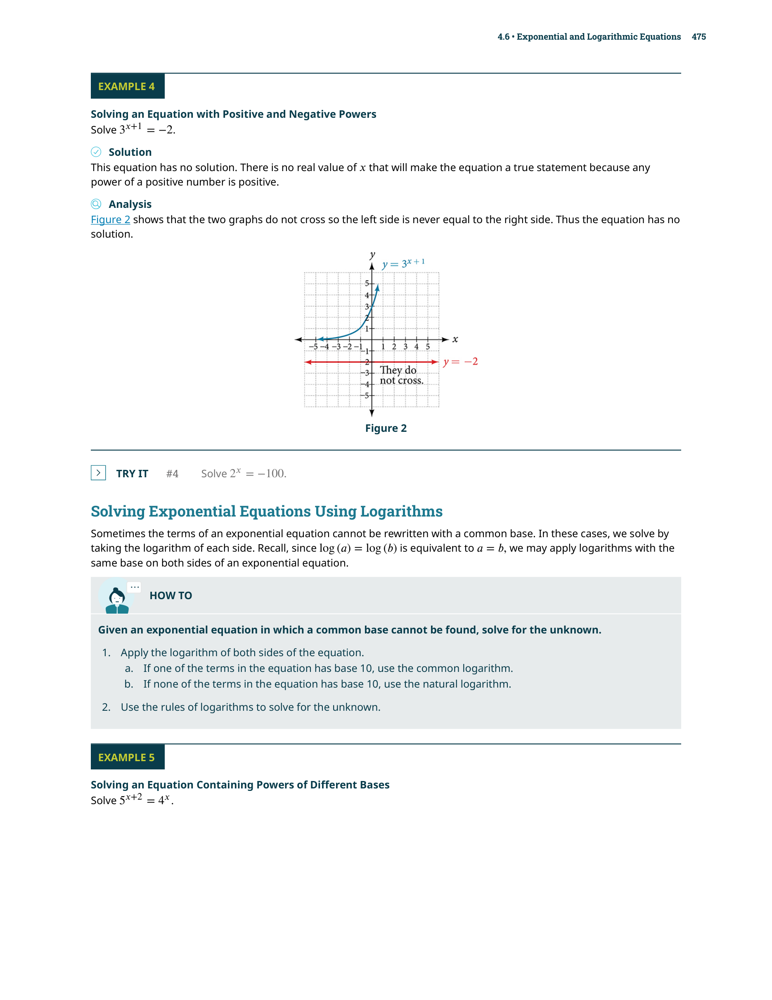
*Figure 2 — Two graphs that never cross — visual confirmation that an equation has no solution (page 485).*

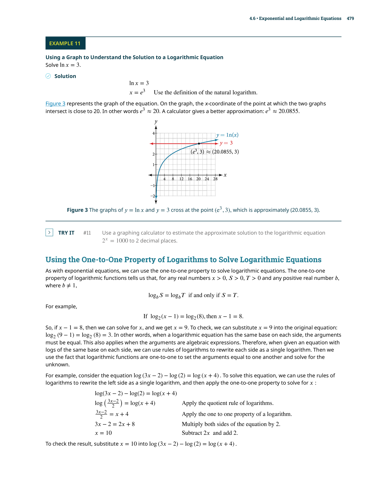
*Figure 3 — Graphical solution: x-coordinate at intersection is the solution (page 489).*

---

## 4.7 Exponential and Logarithmic Models

Mathematical modeling involves choosing a general function with properties that suggest it will approximate a real-world phenomenon. Exponential and logarithmic functions are frequently used to model rapid growth, continuous decay, and bounded expansion.

> [!definition] Exponential Growth and Decay Models
> The general exponential model is represented by the continuous growth or decay function:
> $$y = A_0 e^{kt}$$
> * $A_0$ is the starting amount or initial value at time $t = 0$.
> * $e$ is Euler's constant.
> * $k$ is a constant determining the continuous rate of growth or decay.
> * If $k > 0$, the function models **exponential growth** (e.g., wildlife populations, financial investments).
> * If $k < 0$, the function models **exponential decay** (e.g., radioactive isotopes, decreasing temperatures).

### Example 1

* **Problem.** *(Verbatim problem statement reconstructed from solution context.)* A population of bacteria starts with an initial amount of 100. After one hour, the population doubles to 200. Find the exponential growth model, graph the function, and use it to determine the order of magnitude of the population after 10 hours and 20 hours.
* **Setup.** When an amount grows at a fixed percent per unit time, the growth is exponential. We use the continuous growth model $y = A_0e^{kt}$. We know the initial value $A_0 = 100$. The amount at $t = 1$ hour is $200$.
* **Solution.** First, substitute the initial point and the second point into the formula to solve for the growth rate $k$:
  $$200 = 100e^{k \cdot 1}$$
  Divide both sides by 100:
  $$2 = e^k$$
  Take the natural logarithm of both sides to isolate $k$:
  $$\ln(2) = k$$
  The complete equation is $y = 100e^{(\ln 2)t}$.
  Evaluate the model at $t = 10$ hours:
  $$y = 100e^{(\ln 2)(10)} = 10{,}240$$
  Evaluate the model at $t = 20$ hours:
  $$y = 100e^{(\ln 2)(20)} = 10{,}485{,}760$$
* **Answer.** The equation is $y = 100e^{(\ln 2)t}$. After 10 hours, the population is 10,240 (order of magnitude $10^4$). After 20 hours, the population is 10,485,760 (order of magnitude $10^7$).
* **Insight.** This example demonstrates how to formulate a continuous exponential growth model from doubling behavior and evaluate its incredibly rapid scale over time using orders of magnitude.

When a quantity decays exponentially, we can measure how long it takes to reach half of its original amount.

> [!definition] Half-Life
> **Half-life** is the length of time it takes an exponentially decaying quantity to decrease to half its original amount. The half-life $t$ depends only on the continuous decay rate $k$ and not on the initial quantity $A_0$.
> * To find the half-life given the decay rate: $t = -\frac{\ln(2)}{k}$
> * To find the decay rate given the half-life: $k = -\frac{\ln(2)}{t}$

### Example 2

* **Problem.** The half-life of carbon-14 is 5,730 years. Express the amount of carbon-14 remaining as a function of time, $t$.
* **Setup.** We know the formula for continuous decay is $A(t) = A_0 e^{kt}$. We are given the half-life $t = 5730$. We must use this to solve for the decay rate $k$.
* **Solution.** Substitute the half-life and half of the initial amount into the continuous growth formula:
  $$0.5A_0 = A_0 e^{k \cdot 5730}$$
  Divide both sides by $A_0$:
  $$0.5 = e^{5730k}$$
  Take the natural log of both sides:
  $$\ln(0.5) = 5730k$$
  Divide by the coefficient of $k$:
  $$k = \frac{\ln(0.5)}{5730}$$
  Substitute $k$ back into the continuous growth formula:
  $$A(t) = A_0 e^{\left(\frac{\ln(0.5)}{5730}\right)t}$$
* **Answer.** $A(t) = A_0 e^{\left(\frac{\ln(0.5)}{5730}\right)t}$
* **Insight.** Writing $k$ using the exact logarithmic expression avoids intermediate rounding errors that could drastically skew long-term decay predictions.

> [!definition] Radiocarbon Dating
> Radiocarbon dating determines the age of organic artifacts by comparing the ratio of two isotopes of carbon (carbon-14 to carbon-12). Because the half-life of carbon-14 is 5,730 years, the specific exponential decay model is $A = A_0 e^{-0.000121t}$.
> To find the age of an object ($t$), we rearrange the equation:
> $$t = \frac{\ln\left(\frac{A}{A_0}\right)}{-0.000121}$$

> [!tip] How To: Determine Age Using Carbon-14
> Given the percentage of carbon-14 in an object, determine its age.
> 1. Express the given percentage of carbon-14 as an equivalent decimal, $r$.
> 2. Substitute for $r$ in the equation $t = \frac{\ln(r)}{-0.000121}$ and solve for the age, $t$.

### Example 3

* **Problem.** *(Verbatim problem statement reconstructed from how-to steps.)* An organic artifact contains 20% of its original carbon-14. Determine its age.
* **Setup.** We use the carbon-14 dating formula $t = \frac{\ln(r)}{-0.000121}$. We convert the given percentage of remaining carbon-14 to a decimal, giving $r = 0.20$.
* **Solution.** Use the general form of the carbon-14 dating equation:
  $$t = \frac{\ln(r)}{-0.000121}$$
  Substitute the decimal $0.20$ for $r$:
  $$t = \frac{\ln(0.20)}{-0.000121}$$
  Evaluate using a calculator and round to the nearest year:
  $$t \approx 13{,}301$$
* **Answer.** The artifact is approximately 13,301 years old.
* **Insight.** This demonstrates how to directly apply the specific decay constant for carbon-14 to find the elapsed time (age) purely from the remaining percentage of the isotope.

> [!definition] Doubling Time
> **Doubling time** is the time it takes for a quantity growing exponentially to double in size. Similar to half-life, it depends only on the constant continuous growth rate $k$.
> * To find doubling time: $t = \frac{\ln(2)}{k}$

### Example 4

* **Problem.** According to Moore's Law, the doubling time for the number of transistors that can be put on a computer chip is approximately two years. Give a function that describes this behavior.
* **Setup.** We know the continuous exponential growth formula is $A(t) = A_0e^{kt}$. We are given a doubling time of $t = 2$ years. We can use the doubling time formula, $t = \frac{\ln(2)}{k}$, to solve for the continuous growth rate $k$, and then substitute $k$ back into the original growth model.
* **Solution.** First, substitute the doubling time $t = 2$ into the doubling time formula:
  $$2 = \frac{\ln(2)}{k}$$
  Multiply both sides by $k$:
  $$2k = \ln(2)$$
  Divide by 2 to solve for $k$:
  $$k = \frac{\ln(2)}{2}$$
  Finally, substitute this exact value for $k$ into the continuous growth formula:
  $$A(t) = A_0e^{\frac{\ln(2)}{2}t}$$
* **Answer.** The function is $A(t) = A_0e^{\frac{\ln(2)}{2}t}$, where $t$ is the number of years.
* **Insight.** By maintaining the growth rate $k$ as an exact logarithmic expression ($\frac{\ln(2)}{2}$) rather than evaluating it as a decimal, the model prevents intermediate rounding errors that would otherwise compound massively over decades of rapid exponential growth.

Exponential decay models can also be translated vertically to model situations where a quantity decreases toward a non-zero baseline, such as ambient room temperature.

> [!definition] Newton's Law of Cooling
> The temperature of an object, $T$, in surrounding air with temperature $T_s$ will behave according to the formula:
> $$T(t) = Ae^{kt} + T_s$$
> where
> * $t$ is time
> * $A$ is the difference between the initial temperature of the object and the surroundings
> * $k$ is a constant, the continuous rate of cooling of the object
> * $T_s$ is the ambient temperature (the horizontal asymptote)

> [!tip] How To: Apply Newton's Law of Cooling
> Given a set of conditions, apply Newton's Law of Cooling.
> 1. Set $T_s$ equal to the y-coordinate of the horizontal asymptote (usually the ambient temperature).
> 2. Substitute the given values into the continuous growth formula $T(t) = Ae^{kt} + T_s$ to find the parameters $A$ and $k$.
> 3. Substitute in the desired time to find the temperature, or the desired temperature to find the time.

### Example 5

* **Problem.** A cheesecake is taken out of the oven with an ideal internal temperature of 165°F, and is placed into a 35°F refrigerator. After 10 minutes, the cheesecake has cooled to 150°F. If we must wait until the cheesecake has cooled to 70°F before we eat it, how long will we have to wait?
* **Setup.** Because the surrounding air temperature is 35°F, the horizontal asymptote $T_s = 35$. The initial temperature is $T(0) = 165$. After 10 minutes, the temperature is $T(10) = 150$. The target temperature is $T(t) = 70$. The model is $T(t) = Ae^{kt} + 35$.
* **Solution.** First, substitute the initial data point $(0, 165)$ to solve for $A$:
  $$165 = Ae^{k(0)} + 35$$
  $$165 = A(1) + 35$$
  $$A = 130$$
  Next, substitute the second data point $(10, 150)$ into the updated equation to solve for $k$:
  $$150 = 130e^{k(10)} + 35$$
  Subtract 35 from both sides:
  $$115 = 130e^{10k}$$
  Divide by 130:
  $$\frac{115}{130} = e^{10k}$$
  Take the natural logarithm of both sides:
  $$\ln\left(\frac{115}{130}\right) = 10k$$
  Divide by the coefficient of $k$:
  $$k = \frac{\ln\left(\frac{115}{130}\right)}{10} \approx -0.0123$$
  The complete equation for the cooling cheesecake is $T(t) = 130e^{-0.0123t} + 35$. Now, substitute the target temperature $T(t) = 70$ and solve for $t$:
  $$70 = 130e^{-0.0123t} + 35$$
  Subtract 35 from both sides:
  $$35 = 130e^{-0.0123t}$$
  Divide by 130:
  $$\frac{35}{130} = e^{-0.0123t}$$
  Take the natural logarithm of both sides:
  $$\ln\left(\frac{35}{130}\right) = -0.0123t$$
  Divide by the coefficient of $t$:
  $$t = \frac{\ln\left(\frac{35}{130}\right)}{-0.0123} \approx 106.68$$
* **Answer.** It will take about 107 minutes, or one hour and 47 minutes, for the cheesecake to cool to 70°F.
* **Insight.** This example illustrates the step-by-step algebraic process for modeling cooling objects: identifying the initial temperature gap, solving for the specific environmental cooling rate, and predicting the time needed to reach a target baseline.

In many real-world scenarios, resources limit infinite expansion, causing growth rates to slow as they approach a maximum threshold.

> [!definition] Logistic Growth Model
> The logistic growth model is approximately exponential at first, but it has a reduced rate of growth as the output approaches the model's upper bound, called the **carrying capacity**. For constants $c$, $a$, and $b$, the logistic growth of a population over time $t$ is:
> $$f(t) = \frac{c}{1 + ae^{-bt}}$$
> where
> * $\frac{c}{1 + a}$ is the initial value
> * $c$ is the carrying capacity (limiting value, horizontal asymptote)
> * $b$ is a constant determined by the rate of growth
> The graph starts concave up, reaches a point of maximum growth (an inflection point), and then becomes concave down as it approaches $y = c$.

### Example 6

* **Problem.** An influenza epidemic spreads through a population rapidly, at a rate that depends on two factors: The more people who have the flu, the more rapidly it spreads, and also the more uninfected people there are, the more rapidly it spreads. These two factors make the logistic model a good one to study the spread of communicable diseases. And, clearly, there is a maximum value for the number of people infected: the entire population. For example, at time $t=0$ there is one person in a community of 1,000 people who has the flu. So, in that community, at most 1,000 people can have the flu. Researchers find that for this particular strain of the flu, the logistic growth constant is $b = 0.6030$. Estimate the number of people in this community who will have had this flu after ten days. Predict how many people in this community will have had this flu after a long period of time has passed.
* **Setup.** The carrying capacity $c = 1000$ (the entire community). The initial value at $t=0$ is $f(0) = 1$. The growth constant $b = 0.6030$. We must first solve for the parameter $a$, and then evaluate the model at $t=10$.
* **Solution.** Substitute the given data into the logistic growth model to find $a$:
  $$f(0) = \frac{1000}{1 + ae^{-0.6030(0)}}$$
  $$1 = \frac{1000}{1 + a(1)}$$
  Multiply both sides by $(1+a)$:
  $$1 + a = 1000$$
  Subtract 1 from both sides:
  $$a = 999$$
  The complete logistic model is:
  $$f(t) = \frac{1000}{1 + 999e^{-0.6030t}}$$
  To estimate the number of people infected after ten days, substitute $t=10$:
  $$f(10) = \frac{1000}{1 + 999e^{-0.6030(10)}}$$
  $$f(10) = \frac{1000}{1 + 999e^{-6.030}}$$
  Evaluating this expression yields:
  $$f(10) \approx 293.8$$
  To predict the number of people infected after a long period of time has passed, we evaluate the end behavior of the function as $t \to \infty$. As time increases, the output grows closer to the carrying capacity $c = 1000$.
* **Answer.** After 10 days, approximately 294 people will have had the flu. Over a long period of time, the number of infected people will approach the limiting value (carrying capacity) of 1,000.
* **Insight.** This example demonstrates how logistic regression accurately models resource-limited spread, starting with exponential-like growth before capping at the absolute threshold of an available population.

When given a set of raw data, determining the overall trend visually allows you to select the appropriate mathematical family (exponential, logarithmic, or logistic) to model the situation.

> [!definition] Choosing a Mathematical Model
> Not all data can be described by elementary functions, but plotting data in a scatter plot helps identify the best model by its shape:
> * **Linear:** Points lie approximately on a straight line.
> * **Exponential:** Increases slowly at first, then rapidly without bound (growth); or decreases rapidly and levels off at $y=0$ (decay).
> * **Logarithmic:** Increases rapidly at first, and then growth steadily slows down over time. The curve is concave down.
> * **Logistic:** Starts with exponential growth, hits an inflection point of maximum growth, and levels off at an upper carrying capacity.

### Example 7

* **Problem.** Does a linear, exponential, logarithmic, or logistic model best fit the values listed in Table 1? Find the model, and use a graph to check your choice.
  *(Table 1 Data: (1, 0), (2, 1.386), (3, 2.197), (4, 2.773), (5, 3.219), (6, 3.584), (7, 3.892), (8, 4.159), (9, 4.394))*
* **Setup.** We need to plot the given ordered pairs and observe the concavity and trend of the scatter plot to select a model.
* **Solution.** Plotting the data reveals the points do not lie on a straight line. The data increases but the growth slows as $x$ gets larger, making the curve concave down. This suggests a logarithmic model, $y = a \ln(x) + b$.
  Substitute the first point $(1, 0)$ into the model:
  $$0 = a \ln(1) + b$$
  Because $\ln(1) = 0$, it follows that $0 = b$. Our updated model is $y = a \ln(x)$.
  Substitute the point $(9, 4.394)$ to solve for $a$:
  $$4.394 = a \ln(9)$$
  $$a = \frac{4.394}{\ln(9)} \approx 2$$
  The completed equation is $y = 2 \ln(x)$. Graphing this function over the scatter plot shows it perfectly aligns with the data.
* **Answer.** A logarithmic model best fits the data: $y = 2 \ln(x)$.
* **Insight.** Utilizing coordinates spaced far apart (like the first and last points) reduces round-off error when manually calculating model parameters.

Any exponential base can be rewritten in terms of the natural base $e$, which is preferred in science and mathematics.

> [!tip] Expressing an Exponential Model in Base $e$
> Given a model with the form $y = ab^x$, change it to the continuous form $y = A_0 e^{kx}$:
> 1. Rewrite $y = ab^x$ as $y = a e^{\ln(b^x)}$.
> 2. Use the power rule of logarithms to rewrite the exponent: $y = a e^{x \ln(b)}$.
> 3. Note that $A_0 = a$ and $k = \ln(b)$.

### Example 8

* **Problem.** Change the function $y = 2.5(3.1)^x$ so that this same function is written in the form $y = A_0 e^{kx}$.
* **Setup.** We are given $a = 2.5$ and base $b = 3.1$, and need to utilize the inverse relationship between $e$ and $\ln$ to change the base.
* **Solution.** Insert the exponential and its inverse:
  $$y = 2.5e^{\ln(3.1^x)}$$
  Apply the laws of logs (power rule) to bring the $x$ down:
  $$y = 2.5e^{x \ln 3.1}$$
  Use the commutative law of multiplication to rewrite the exponent:
  $$y = 2.5e^{(\ln 3.1)x}$$
* **Answer.** $y = 2.5e^{(\ln 3.1)x}$
* **Insight.** This example confirms that any standard exponential function with a constant multiplier can be seamlessly translated into an equivalent continuous growth model utilizing base $e$.

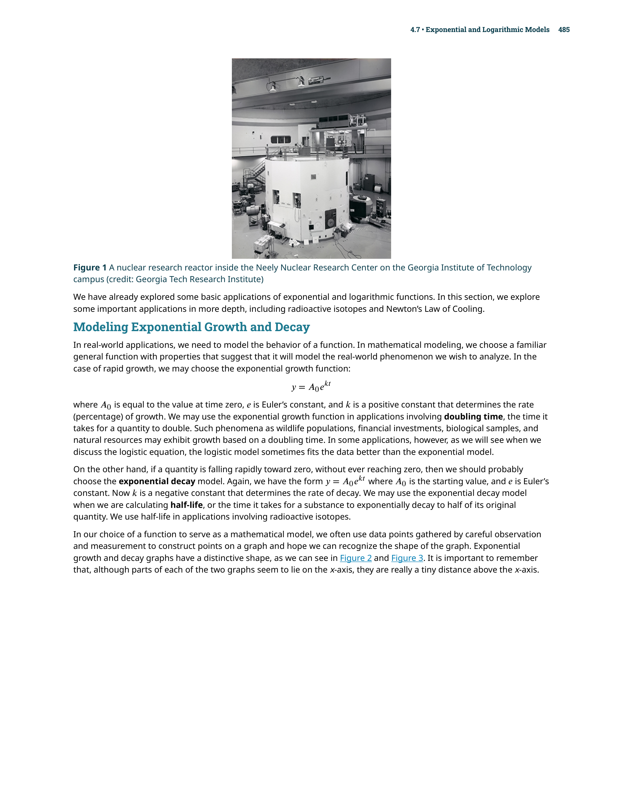
*Figure 1 — Neely Nuclear Research Center reactor at Georgia Tech — context for radioactive-decay modeling (page 495).*

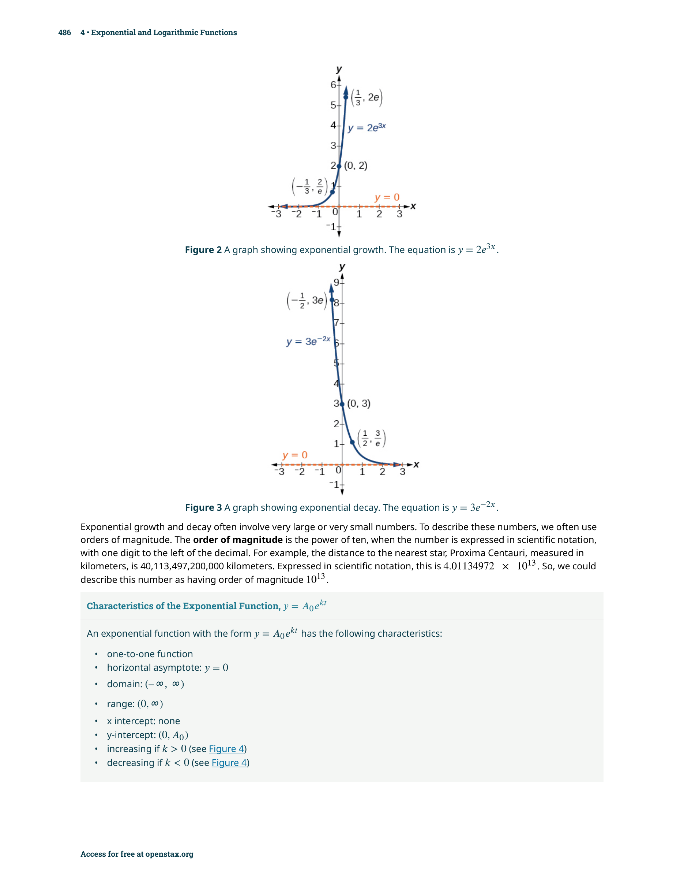
*Figure 2 — Exponential growth model graph (page 496).*

*Figure 3 — Exponential decay model graph (page 496).*

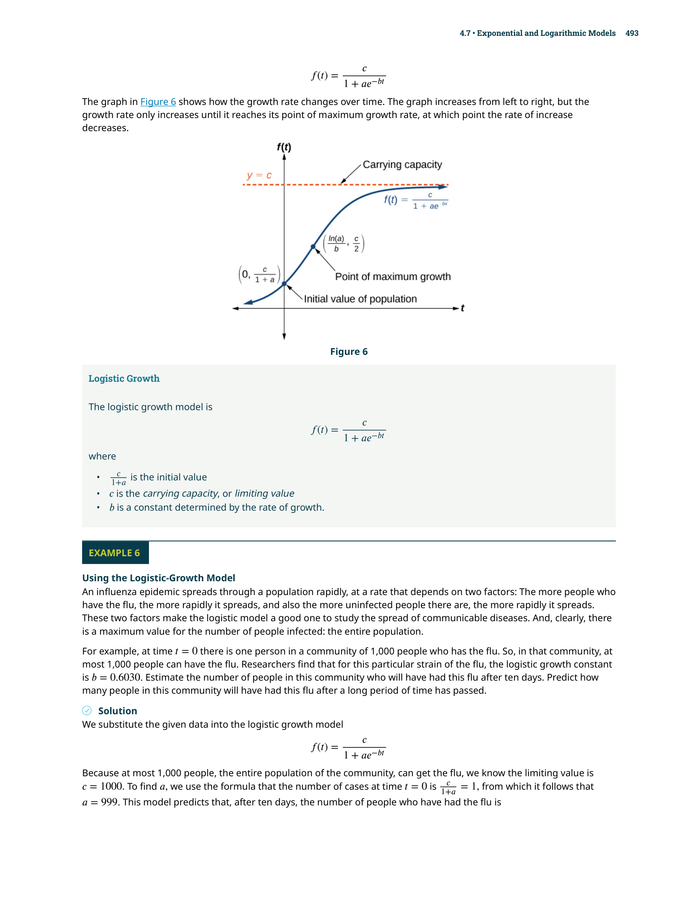
*Figure 6 — Logistic growth model showing the S-shape and approach to carrying capacity (page 503).*

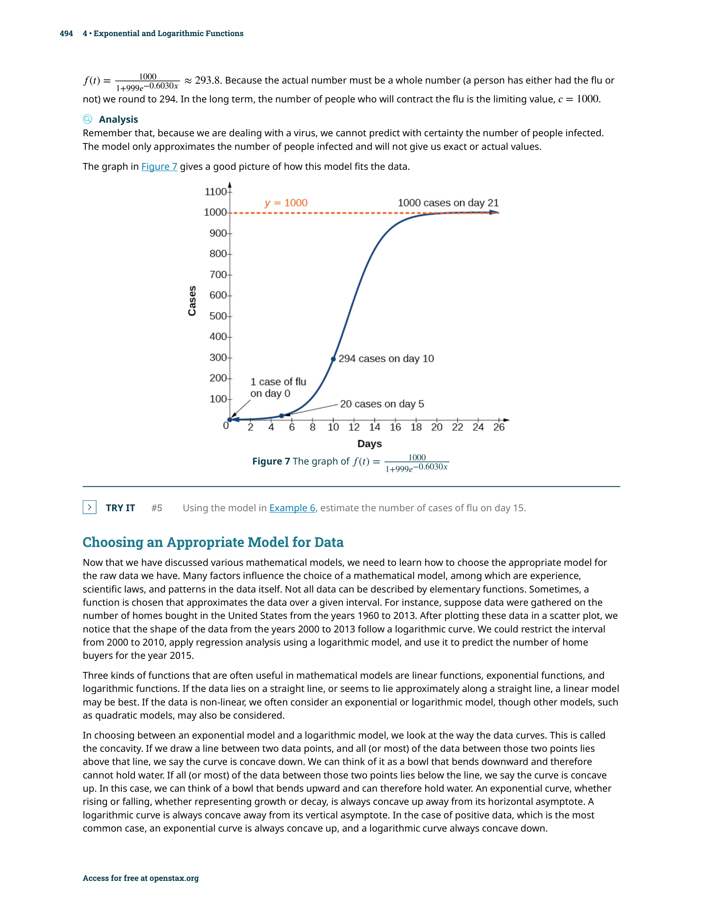
*Figure 7 — Logistic model fit to data (page 504, Example).*

---

## 4.8 Fitting Exponential Models to Data

In this section, we use a modeling technique called regression analysis to find
a curve that models data collected from real-world observations. With 
regression analysis, we don’t expect all the points to lie perfectly on the 
curve; rather, we find a model that *best fits* the data to make predictions 
about future events. Three common types of regression are exponential, 
logarithmic, and logistic.

### Exponential Regression

Situations that can be modeled by exponential functions either increase or 
decrease as time moves forward. Knowing the behavior of exponential growth 
(increasing rapidly without bound) and decay (decreasing rapidly and leveling 
off toward zero) helps us recognize when exponential regression is appropriate.

> [!definition] **Exponential Regression**
> Exponential regression is used to model situations in which growth begins 
slowly and then accelerates rapidly without bound, or where decay begins 
rapidly and then slows down to get closer and closer to zero. We use the 
command "ExpReg" on a graphing utility to fit an exponential function to a set 
of data points. This returns an equation of the form:
> $$y = ab^x$$
> Note that:
> * $b$ must be non-negative.
> * when $b > 1$, we have an exponential growth model.
> * when $0 < b < 1$, we have an exponential decay model.

When performing regressions, your calculator will display a correlation 
coefficient ($r$ or $r^2$). The closer this value is to 1, the better the 
regression equation approximates the data.

> [!tip] **HOW TO: Perform exponential regression using a graphing utility.**
> 1. Use the **STAT** then **EDIT** menu to enter given data.
>    a. Clear any existing data from the lists.
>    b. List the input values in the L1 column.
>    c. List the output values in the L2 column.
> 2. Graph and observe a scatter plot of the data using the **STATPLOT** 
feature.
>    a. Use **ZOOM** to adjust axes to fit the data.
>    b. Verify the data follow an exponential pattern.
> 3. Find the equation that models the data.
>    a. Select “ExpReg” from the **STAT** then **CALC** menu.
>    b. Use the values returned for $a$ and $b$ to record the model, $y = 
ab^x$.
> 4. Graph the model in the same window as the scatterplot to verify it is a 
good fit for the data.

**EXAMPLE 1**

**Problem.** In 2007, a university study was published investigating the crash 
risk of alcohol impaired driving. Data from 2,871 crashes were used to measure 
the association of a person’s blood alcohol level (BAC) with the risk of being 
in an accident. Table 1 shows results from the study. The relative risk is a 
measure of how many times more likely a person is to crash. So, for example, a 
person with a BAC of 0.09 is 3.54 times as likely to crash as a person who has 
not been drinking alcohol.
**Setup.** The dataset maps BAC ($x$) to Relative Risk of Crashing ($y$): $(0, 
1), (0.01, 1.03), (0.03, 1.06), (0.05, 1.38), (0.07, 2.09), (0.09, 3.54), 
(0.11, 6.41), (0.13, 12.6), (0.15, 22.1), (0.17, 39.05), (0.19, 65.32), (0.21, 
99.78)$.
**Solution.** Using the **STAT** then **EDIT** menu on a graphing utility, list
the BAC values in L1 and the relative risk values in L2. Use the **STATPLOT** 
feature to verify that the scatterplot follows an exponential pattern. Use the 
"ExpReg" command from the **STAT** then **CALC** menu to obtain the exponential
model parameters. Convert from scientific notation if necessary, noting that a 
correlation coefficient like $r^2 \approx 0.997$ confirms a strong fit.
**Answer.** The regression model evaluates to $y \approx 0.58304829(2.20720213 
\times 10^{10})^x$.
**Insight.** This example illustrates how exponential regression builds an 
accurate model for real-world risks that compound and accelerate rapidly 
without a clear upper bound.

### Logarithmic Regression

Logarithmic functions increase or decrease rapidly at first, but then steadily 
slow as time moves on. 

> [!definition] **Logarithmic Regression**
> Logarithmic regression is used to model situations where growth or decay 
accelerates rapidly at first and then slows over time. We use the command 
"LnReg" on a graphing utility to fit a logarithmic function to a set of data 
points. This returns an equation of the form:
> $$y = a + b \ln(x)$$
> Note that:
> * all input values, $x$, must be non-negative.
> * when $b > 0$, the model is increasing.
> * when $b < 0$, the model is decreasing.

> [!tip] **HOW TO: Perform logarithmic regression using a graphing utility.**
> 1. Use the **STAT** then **EDIT** menu to enter given data into L1 and L2.
> 2. Graph and observe a scatter plot of the data using **STATPLOT**. Verify 
the data follow a logarithmic pattern.
> 3. Find the equation that models the data. Select “LnReg” from the **STAT** 
then **CALC** menu.
> 4. Use the returned values for $a$ and $b$ to write $y = a + b\ln(x)$ and 
graph the model against the scatterplot.

**EXAMPLE 2**

**Problem.** Due to advances in medicine and higher standards of living, life 
expectancy has been increasing in most developed countries since the beginning 
of the 20th century.
**Setup.** A table tracking decades (Year 1900 to 2010) versus Life Expectancy 
(47.3 years to 78.7 years).
**Solution.** Using the **STAT** then **EDIT** menu, list the years using 
values $1–12$ in L1 and the corresponding life expectancy in L2. Use the 
**STATPLOT** feature to verify that the scatterplot follows a logarithmic 
pattern. Finally, use the "LnReg" command from the **STAT** then **CALC** menu 
to obtain the parameters for the logarithmic model.
**Answer.** The data fits a logarithmic regression model of the form $y = a + b
\ln(x)$, utilizing the specific $a$ and $b$ parameters generated by the 
calculator. 
**Insight.** This demonstrates that logarithmic regression is ideal for 
scenarios like human lifespan, where an initial rapid increase inevitably 
begins to plateau.

### Logistic Regression

One of the most notable differences between simple exponential growth and 
logistic growth is that, at a certain point, a logistic function's growth 
steadily slows and approaches an upper bound or carrying capacity. This often 
models resource-limited situations.

> [!definition] **Logistic Regression**
> Logistic regression is used to model situations where growth accelerates 
rapidly at first and then steadily slows to an upper limit. We use the command 
"Logistic" on a graphing utility to fit a logistic function to a set of data 
points. This returns an equation of the form:
> $$y = \frac{c}{1 + ae^{-bx}}$$
> Note that:
> * The initial value of the model is $\frac{c}{1+a}$.
> * Output values for the model grow closer and closer to $y = c$ (the carrying
capacity) as time increases.

> [!tip] **HOW TO: Perform logistic regression using a graphing utility.**
> 1. Use the **STAT** then **EDIT** menu to enter given data into L1 and L2.
> 2. Graph the scatter plot using **STATPLOT** and verify the data follow a 
logistic pattern (an "S-curve" that changes concavity).
> 3. Select “Logistic” from the **STAT** then **CALC** menu to compute $a$, 
$b$, and $c$.
> 4. Write the formula $y = \frac{c}{1 + ae^{-bx}}$ and graph the curve to 
verify the fit.

**EXAMPLE 3**

**Problem.** Mobile telephone service has increased rapidly in America since 
the mid 1990s. Today, almost all residents have cellular service. Table 5 shows
the percentage of Americans with cellular service between the years 1995 and 
2012. 
**Setup.** The dataset maps time against the percentage of cell service 
adoption, establishing variables to regress against to find the percentage for 
year $18$.
**Solution.** Use the **STAT** then **EDIT** menu to input the years and 
percentages. Running the “Logistic” calculation returns the parameters $a$, 
$b$, and $c$. To find the predicted percentage at $x = 18$, we substitute $18$ 
for $x$ in our formulated logistic equation.
**Answer.** The regression yields $y = \frac{105.7379526}{1 + 
6.88328979e^{-0.2595440013x}}$. Substituting $18$ for $x$ gives $y \approx 
99.3$.
**Insight.** Logistic models are incredibly useful when modeling market 
saturation, as they mathematically account for the upper limit (carrying 
capacity) of a population's adoption rate.

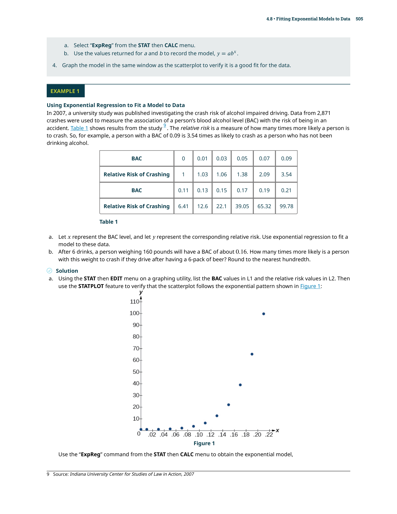
*Figure 1 — Exponential regression on blood-alcohol-content vs. crash-risk data (page 515, Example 1).*

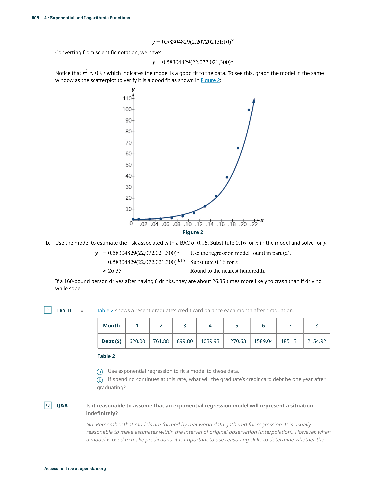
*Figure 2 — Using the exponential regression model to predict risk for a specific BAC (page 516, Example 1).*

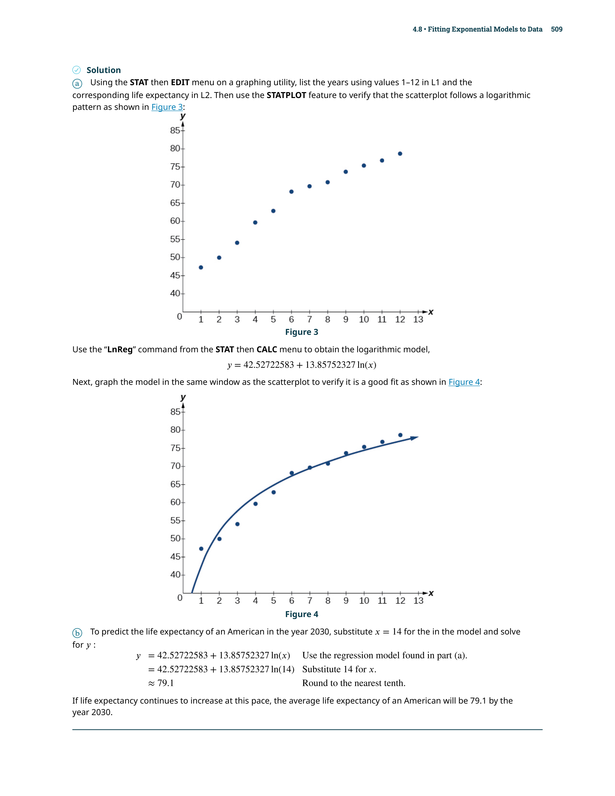
*Figure 3 — Logarithmic regression on US life-expectancy data (page 519, Example 2).*

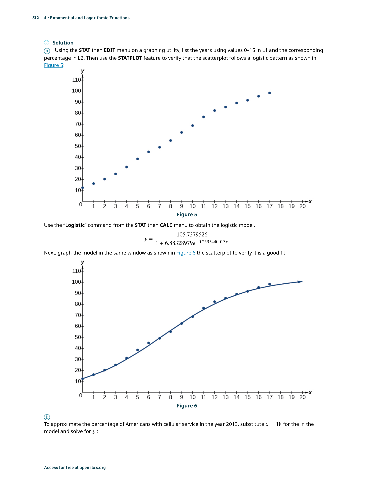
*Figure 5 — Logistic regression on US cell-service adoption data (page 522, Example 3).*

---

## Chapter Review — Key Equations

| Concept | Equation |
|---|---|
| General exponential function | $f(x) = a b^x$ |
| Compound interest (n periods/year) | $A(t) = P\left(1 + \dfrac{r}{n}\right)^{nt}$ |
| Continuous compound interest | $A(t) = P e^{rt}$ |
| Definition of the natural number $e$ | $e = \displaystyle\lim_{n \to \infty} \left(1 + \dfrac{1}{n}\right)^n \approx 2.71828$ |
| Logarithm $\Leftrightarrow$ exponent | $y = \log_b(x) \;\Longleftrightarrow\; b^y = x$ |
| Product rule | $\log_b(MN) = \log_b(M) + \log_b(N)$ |
| Quotient rule | $\log_b(M/N) = \log_b(M) - \log_b(N)$ |
| Power rule | $\log_b(M^n) = n \log_b(M)$ |
| Change of base | $\log_b(M) = \dfrac{\log_c(M)}{\log_c(b)}$ |
| Half-life decay | $N(t) = N_0 e^{-kt}$, $k = \ln(2)/T_{1/2}$ |
| Doubling time growth | $N(t) = N_0 e^{kt}$, $T_{\text{double}} = \ln(2)/k$ |
| Newton's law of cooling | $T(t) = A e^{kt} + T_s$ ($T_s$ = surroundings) |
| Logistic growth | $f(t) = \dfrac{c}{1 + a e^{-bt}}$ ($c$ = carrying capacity) |

---

## Key Takeaways

1. **Exponential and logarithmic functions are inverses.** $y = \log_b(x) \iff b^y = x$. Every problem involving "what exponent gives me this output?" is a log problem; every problem involving "what value is reached after this many growth steps?" is an exponential problem.
2. **Exponential graphs are mirrors of each other.** Growth ($b > 1$) and decay ($0 < b < 1$) share the same y-intercept and horizontal asymptote; one is the reflection of the other across the y-axis. All four transformations — shift, stretch, reflection, compression — apply identically.
3. **Logarithm graphs are exponential graphs reflected across $y = x$.** Domain becomes $(0, \infty)$ and the horizontal asymptote becomes a vertical asymptote at $x = 0$.
4. **The four log rules ARE the exponent rules inside-out.** Multiplication of inputs becomes addition of logs (product rule); division becomes subtraction (quotient rule); exponentiation becomes multiplication (power rule); and change-of-base lets you swap between any two log bases via division.
5. **Solving exp/log equations always reduces to one of two moves.** Either rewrite both sides with a common base and equate exponents (one-to-one property), or take a logarithm of both sides and solve algebraically. Watch for extraneous solutions when log arguments could go negative.
6. **The exponential/logarithmic model toolkit covers most real-world growth processes**: half-life (radioactive decay, drug clearance, carbon dating), doubling time (population, bacteria, viral spread), Newton's cooling (forensic temperature, food cooling), and logistic growth (bounded systems — population with carrying capacity, technology adoption, disease in a closed group).
7. **Regression turns a scatter plot into a model.** Once you've identified whether data follows an exponential, logarithmic, or logistic shape (by checking concavity and behavior at extremes), a calculator regression gives you the parameters and a function ready for prediction.

---

## Related Documents

- **[Logarithm Fundamentals (Main)](<../../Logarithms/Logarithm Fundamentals (Main).md>)** — Companion intuition note built from 3B1B's Lockdown Math ep. 6. Spends more time on the zero-counting intuition, log scales for COVID, and the petri-dish practice problem. This Chapter 4 note is the algebraic / textbook treatment; the Logarithm Fundamentals note is the intuition / "why does this exist" treatment. Cross-reference for the rules in §4.5 and the change-of-base derivation.
- **[Imaginary Interest and Continuous Rotation (Main)](<../../Complex Numbers/Imaginary Interest and Continuous Rotation (Main).md>)** — Where the number $e$ comes from (compound interest in the limit) and what happens when you plug imaginary values into the exponential function. Useful follow-on for §4.1's introduction of $e$ and continuous compounding.
- **[Euler's Formula via exp(x) (Main)](<../../Complex Numbers/Euler's Formula via exp(x) (Main).md>)** — The polynomial-series definition of $\exp(x)$ and what it produces for imaginary inputs ($e^{i\theta} = \cos\theta + i\sin\theta$). Connects the $e$ defined in §4.1 to its deepest mathematical identity.

---

### Source

| Source | Type |
|---|---|
| [OpenStax Precalculus 2e — Chapter 4: Exponential and Logarithmic Functions](https://openstax.org/details/books/precalculus-2e) (pp. 407–534) | Open-license textbook |
| Figures: rendered at 220 DPI from the source PDF via PyMuPDF | Direct from textbook (Path B) |
| Infographic: generated by Google NotebookLM | AI-generated chapter overview |
