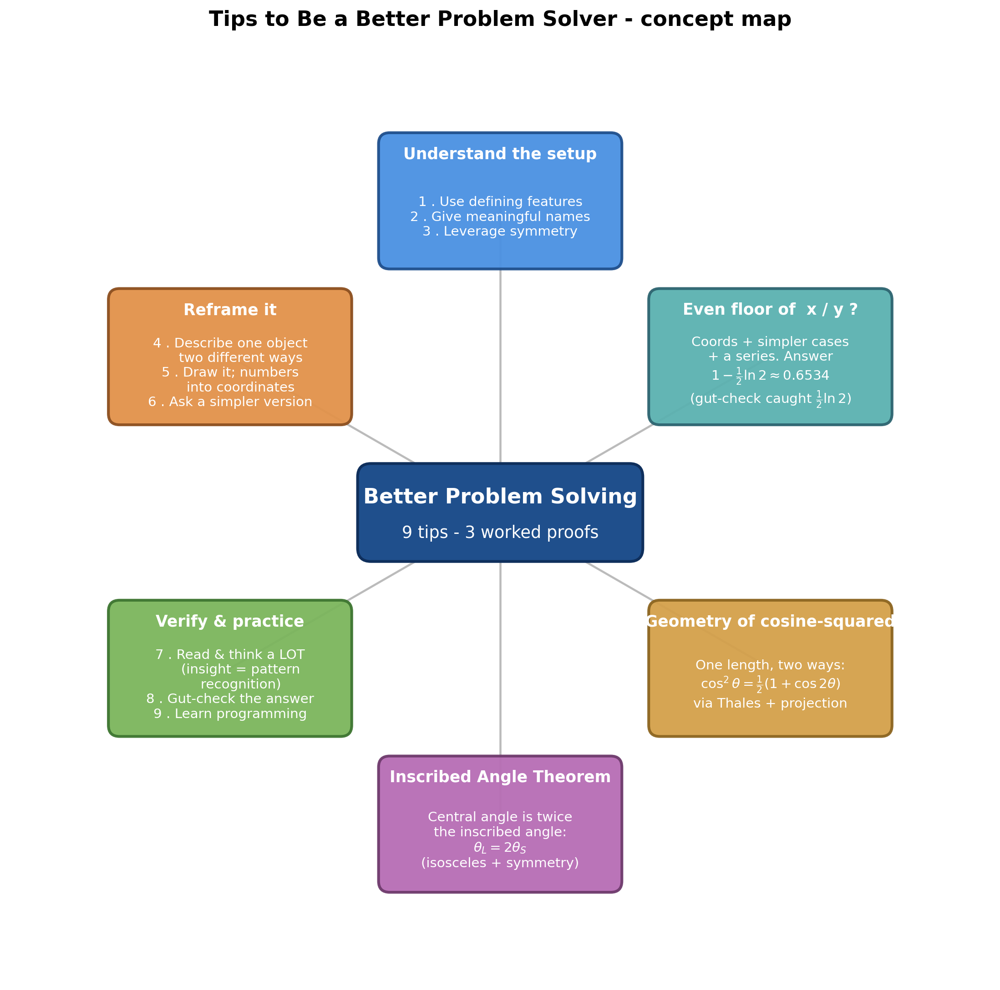
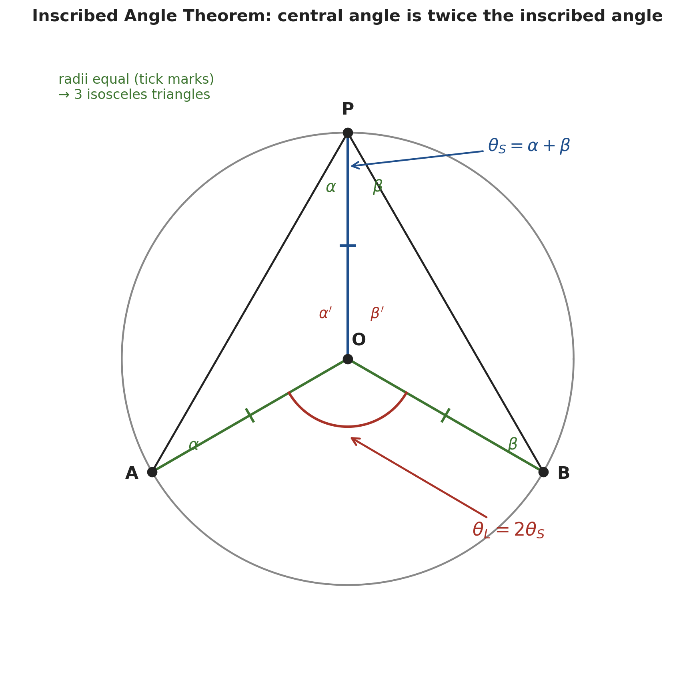
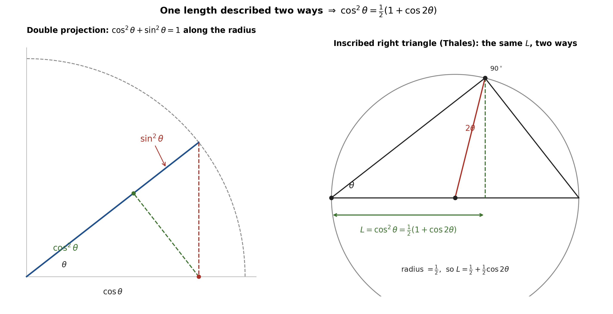
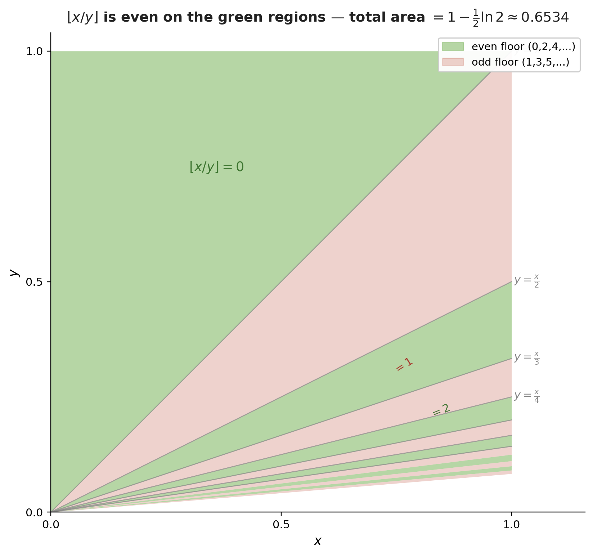
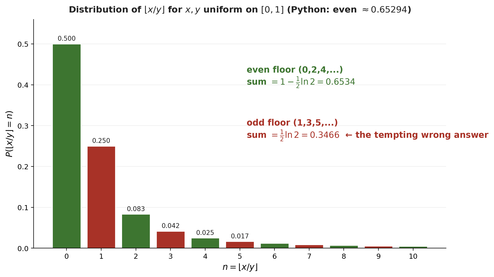

# Tips to Be a Better Problem Solver

_Path C note compiled 2026-06-21 — distilled from 3Blue1Brown's **"Tips to be a better problem solver"** ([Lockdown Math, Ep. 10 — the final live lecture](https://www.youtube.com/watch?v=QvuQH4_05LI), 1:08:19) by Grant Sanderson. Every timestamp is a clickable deep-link into the video._

> [!abstract] The idea in one line
> Problem-solving is *systematic*, not magic. Grant distills **nine reusable tips** and then earns them on three problems — proving the **Inscribed Angle Theorem**, giving a **pure-geometry proof** of $\cos^2\theta=\tfrac12(1+\cos2\theta)$, and computing the probability that $\lfloor x/y\rfloor$ is even (answer: $1-\tfrac12\ln2\approx0.6534$). A deliberate mistake along the way shows why the most underrated tip is *gut-check your answer*.



---

## 1. The Problem-Solver's Toolkit — Nine Tips *(at [[00:37]](https://www.youtube.com/watch?v=QvuQH4_05LI&t=37s))*

> [!tip] The nine tips
> | # | Tip | What it buys you |
> |---|---|---|
> | 1 | **Use the defining features of the setup** | unravel each term's definition and see how they connect |
> | 2 | **Give things (meaningful) names** | a variable you can write down is a variable you can manipulate |
> | 3 | **Leverage symmetry** | a symmetry is a free equation |
> | 4 | **Describe one object two different ways** | equating the two descriptions proves a non-obvious relation |
> | 5 | **Draw a picture** — *have numbers? make them coordinates* | geometry turns "hard to think about" into "an area" |
> | 6 | **Ask a simpler version of the problem** | get a foothold you can actually stand on |
> | 7 | **Read a lot, and think about problems a lot** | "insight" is mostly pattern recognition in disguise |
> | 8 | **Always gut-check your answer** | a second perspective catches the mistakes you *will* make |
> | 9 | **Learn at least a little programming** | forces a second, computational way of defining things |

> [!quote] On what problem-solving even is *(at [[00:00]](https://www.youtube.com/watch?v=QvuQH4_05LI&t=0s))*
> "Approaching puzzles that you've never seen before and still being able to systematically and creatively find some solution to them."

Grant also **promises to make one mistake on purpose** *(at [[03:56]](https://www.youtube.com/watch?v=QvuQH4_05LI&t=236s))* — partly to keep you skeptical of every claim, partly to model what to do when (not if) an error slips in. Keep an eye out; it lands in §4.5.

---

## 2. Worked Problem 1 — The Inscribed Angle Theorem *(at [[04:41]](https://www.youtube.com/watch?v=QvuQH4_05LI&t=281s))*

> [!example] The theorem to prove
> **Problem.** On a circle, an **inscribed angle** $\theta_S$ (vertex $P$ on the circle) and the **central angle** $\theta_L$ (vertex at the center $O$) subtend the *same arc* $AB$. What is the relationship between them, and why?
> **Answer (to be proved).** $\theta_L = 2\theta_S$ — the central angle is always **twice** the inscribed angle.

### 2.1 Tips 1–3 in action *(at [[06:01]](https://www.youtube.com/watch?v=QvuQH4_05LI&t=361s))*

- **Tip 1 — defining features:** a circle's defining feature is that *every point is the same distance from the center*. So the segments $OA$, $OB$, $OP$ are **equal radii** (mark them with tick marks). The masterstroke is *adding the radius $OP$ to the picture*.
- **Tip 2 — names:** the radius $OP$ splits $\theta_S$ into two pieces; call them $\alpha$ and $\beta$ (so $\theta_S=\alpha+\beta$).
- **Tip 3 — symmetry:** each radius-pair forms an **isosceles triangle**, whose base angles are equal.

> [!quote] *(at [[07:08]](https://www.youtube.com/watch?v=QvuQH4_05LI&t=428s))*
> "Quite often when you see people solve hard geometry problems, it comes down to adding something to the picture… it just illuminates everything; you shift your perspective."

### 2.2 The proof *(at [[11:40]](https://www.youtube.com/watch?v=QvuQH4_05LI&t=700s))*

> [!example] Inscribed Angle Theorem — the derivation
> **Setup.** Triangles $OAP$ and $OBP$ are isosceles (two radii each). Their base angles are $\alpha$ (at $A$ and the $A$-side of $P$) and $\beta$ (at $B$ and the $B$-side of $P$); their apex angles at $O$ are $\alpha'$ and $\beta'$. The three central angles fill the full turn.
> **Solution.** Three facts (angles in radians):
> $$\alpha'+\beta'+\theta_L = 2\pi,\qquad 2\alpha+\alpha'=\pi,\qquad 2\beta+\beta'=\pi.$$
> Take the **first minus the other two** to eliminate $\alpha',\beta'$:
> $$\big(\alpha'+\beta'+\theta_L\big)-\big(2\alpha+\alpha'\big)-\big(2\beta+\beta'\big)=2\pi-\pi-\pi,$$
> $$\theta_L-2\alpha-2\beta = 0\ \Longrightarrow\ \theta_L = 2(\alpha+\beta).$$
> Since $\theta_S=\alpha+\beta$:
> **Answer.** $\theta_L = 2\theta_S.$ ✓
> **Insight.** Naming the intermediate angles ($\alpha',\beta'$) was essential *so we could cancel them*. "Realizing an angle and twice that angle in the context of a circle is strangely useful" — a tool we reuse immediately in §3.


*Generated by matplotlib via `_gen_ps_fig1_inscribed.py` — equal radii make three isosceles triangles; a linear combination of their angle-sums gives the central angle as twice the inscribed angle.*

---

## 3. Worked Problem 2 — A Geometric Proof of $\cos^2\theta=\tfrac12(1+\cos2\theta)$ *(at [[15:13]](https://www.youtube.com/watch?v=QvuQH4_05LI&t=913s))*

This identity is *easy* with complex numbers but feels unmotivated. Tip 4 makes it **visible**.

> [!quote] *(at [[14:07]](https://www.youtube.com/watch?v=QvuQH4_05LI&t=847s))*
> "We have two different expressions for the same thing, but it's not at all obvious why these would be related. One involves doubling the angle… the other involves squaring the output."

### 3.1 $\cos^2\theta$ as a *length*, not an area *(at [[17:03]](https://www.youtube.com/watch?v=QvuQH4_05LI&t=1023s))*

The instinct is to draw $\cos^2\theta$ as a literal square (an area). But the right side $\tfrac12(1+\cos2\theta)$ has only a plain cosine — much more naturally a **length**. So (Tip 3, symmetry) Grant builds $\cos^2\theta$ as a length by **projecting twice**:

- A unit radius at angle $\theta$ projects down to the $x$-axis with length $\cos\theta$.
- That horizontal segment, projected *back* onto the radius (the angle is again $\theta$), scales by another $\cos\theta$ — giving a piece of the radius of length $\cos^2\theta$. The leftover piece of the unit radius is $\sin^2\theta$ (a slick proof of $\cos^2\theta+\sin^2\theta=1$).

### 3.2 Thales's theorem *(at [[19:59]](https://www.youtube.com/watch?v=QvuQH4_05LI&t=1199s))*

> [!definition] Thales's theorem
> A triangle inscribed in a circle with one side on a **diameter** has a **right angle** opposite that diameter. (It's the Inscribed Angle Theorem with central angle $180^\circ$: the inscribed angle is half, $90^\circ$.)

### 3.3 One length, two ways → the identity *(at [[24:03]](https://www.youtube.com/watch?v=QvuQH4_05LI&t=1443s))*

> [!example] The geometric proof
> **Setup.** Inscribe the right triangle (hypotenuse $=1=$ diameter, base angle $\theta$) in a circle; drop a perpendicular from the right angle to the diameter, with foot $F$. Let $L$ be the length from the $\theta$-vertex to $F$.
> **Solution — view A (the triangle).** $L$ is exactly the double-projection segment from §3.1, so $L=\cos^2\theta$.
> **Solution — view B (the circle).** The radius is $\tfrac12$. By the Inscribed Angle Theorem the central angle to the right-angle vertex is $2\theta$, so the little triangle (radius $\tfrac12$, angle $2\theta$) contributes a base of $\tfrac12\cos2\theta$. Thus $L=\tfrac12+\tfrac12\cos2\theta$.
> **Answer.** Equate the two views of the same length:
> $$\cos^2\theta=\tfrac12\big(1+\cos2\theta\big).\ ✓$$
> **Insight.** "If you can describe one object two different ways, that's very powerful for showing non-obvious algebraic relations." The Inscribed Angle Theorem from §2 was the hinge — it converts the $\theta$ on one side into the $2\theta$ on the other.


*Generated by matplotlib via `_gen_ps_fig2_cos2.py` — left: the double projection; right: the same segment via Thales and a central angle of $2\theta$.*

---

## 4. Worked Problem 3 — When Does a Ratio Round to an Even Number? *(at [[26:28]](https://www.youtube.com/watch?v=QvuQH4_05LI&t=1588s))*

> [!example] The headline problem
> **Problem.** Pick $x,y$ independently and uniformly from $[0,1]$. What is the probability $p$ that $\lfloor x/y\rfloor$ is **even** (recall $0$ counts as even, so $\lfloor x/y\rfloor\in\{0,2,4,\dots\}$)?
> **Answer (to be earned).** $p=1-\tfrac12\ln2\approx0.6534$ — most of the live audience guessed $p<0.3$; the truth is in the $0.6\le p<0.7$ bucket.

### 4.1 A symmetry foothold *(at [[29:54]](https://www.youtube.com/watch?v=QvuQH4_05LI&t=1794s))*

Uniform $\Rightarrow$ **probability = length/area** (Tip 1). By symmetry (Tip 3), $x/y$ is as likely to exceed $1$ as to be below it, so already $P(\lfloor x/y\rfloor=0)=P(x<y)=\tfrac12$. (This single fact already shows $p\ge\tfrac12$ — remember it for the gut-check.)

### 4.2 Tip 5 — make the numbers into coordinates *(at [[30:39]](https://www.youtube.com/watch?v=QvuQH4_05LI&t=1839s))*

> [!tip] The key move
> Two numbers $x,y$ → one **point** $(x,y)$ in the unit square. "Choose two uniform numbers" = "choose a uniform point in $[0,1]^2$", and now every probability is an **area**.

### 4.3 Tip 6 — ask a simpler version *(at [[32:51]](https://www.youtube.com/watch?v=QvuQH4_05LI&t=1971s))*

Instead of "even" all at once, ask for one value at a time. Each $\lfloor x/y\rfloor=n$ is a wedge bounded by lines through the origin:

> [!example] One value at a time
> **$\lfloor x/y\rfloor=0$:** $0\le x/y<1\Rightarrow x<y$ — the triangle **above** $y=x$. Area $\tfrac12$.
> **$\lfloor x/y\rfloor=2$:** $2\le x/y<3\Rightarrow \tfrac{x}{3}<y\le \tfrac{x}{2}$ — the strip between $y=x/3$ and $y=x/2$. Area $\tfrac12(\tfrac12-\tfrac13)=\tfrac1{12}$.
> **$\lfloor x/y\rfloor=4$:** the sliver between $y=x/5$ and $y=x/4$, area $\tfrac12(\tfrac14-\tfrac15)$.
> **In general** the region $n\le x/y<n+1$ (for $n\ge1$) is a triangle with **height $1$** (it runs the full $x\in[0,1]$) and base $\big(\tfrac1n-\tfrac1{n+1}\big)$ along $x=1$.


*Generated by matplotlib via `_gen_ps_fig3_ratio_regions.py` — $\lfloor x/y\rfloor$ is even on the green regions (the big $y>x$ triangle plus the even slivers); odd on the red strips.*

### 4.4 Summing the regions → the alternating harmonic series *(at [[42:48]](https://www.youtube.com/watch?v=QvuQH4_05LI&t=2568s))*

Add the even areas:
$$p=\tfrac12\Big[\,1+\big(\tfrac12-\tfrac13\big)+\big(\tfrac14-\tfrac15\big)+\big(\tfrac16-\tfrac17\big)+\cdots\Big].$$
The tail is built from the **alternating harmonic series**, which Grant proves equals $\ln2$ by turning a number into a function (a recurring trick — "make it look harder first"):

> [!tip] Why $1-\tfrac12+\tfrac13-\tfrac14+\cdots=\ln2$ *(at [[44:08]](https://www.youtube.com/watch?v=QvuQH4_05LI&t=2648s))*
> Integrate a geometric series term by term:
> $$\sum_{n\ge1}\frac{(-1)^{n+1}}{n}=\int_0^1\big(1-x+x^2-x^3+\cdots\big)\,dx=\int_0^1\frac{dx}{1+x}=\ln(1+x)\Big|_0^1=\ln2.$$

### 4.5 Tip 8 — the gut-check that caught the (intentional) mistake *(at [[51:07]](https://www.youtube.com/watch?v=QvuQH4_05LI&t=3067s))*

> [!warning] The deliberate mistake
> It is *tempting* to read the bracket $\big[1+(\tfrac12-\tfrac13)+(\tfrac14-\tfrac15)+\cdots\big]$ as the alternating harmonic series and write $p=\tfrac12\ln2\approx0.347$. Grant does exactly this — **and then gut-checks it.** The single triangle $\lfloor x/y\rfloor=0$ *alone* has area $0.5$, so $p$ must be at least $0.5$. But $0.347<0.5$. **Contradiction → there is a mistake.**

> [!example] The correction *(at [[53:00]](https://www.youtube.com/watch?v=QvuQH4_05LI&t=3180s))*
> **Fix.** The bracket is *not* $\ln2$. Let $S=(\tfrac12-\tfrac13)+(\tfrac14-\tfrac15)+\cdots$. Then
> $$1-S=1-\tfrac12+\tfrac13-\tfrac14+\cdots=\ln2\ \Longrightarrow\ S=1-\ln2.$$
> So the bracket is $1+S=2-\ln2$, and
> $$p=\tfrac12(2-\ln2)=1-\tfrac12\ln2\approx 0.6534.\ ✓$$
> **Insight.** The wrong answer $\tfrac12\ln2\approx0.347$ wasn't random — it is exactly $P(\lfloor x/y\rfloor\text{ is }\textbf{odd})=1-p$. The tempting error computed the *complement*.

> [!quote] *(at [[52:16]](https://www.youtube.com/watch?v=QvuQH4_05LI&t=3136s))*
> "You're not going to approach perfection by avoiding silly mistakes; the way to do it is to be able to systematically know when you make them."

### 4.6 Tip 9 — verify with programming *(at [[57:30]](https://www.youtube.com/watch?v=QvuQH4_05LI&t=3450s))*

A one-million-sample simulation nails it:

```python
import numpy as np
N = 10**6
ratios = np.random.random(N) / np.random.random(N)
(np.floor(ratios) % 2 == 0).mean()   # -> 0.65294 ...
0.5 * (2 - np.log(2))                 # -> 0.6534264 ...
```

The empirical $0.65294$ matches the analytic $1-\tfrac12\ln2$, and the per-value checks line up too ($P(=0)\approx0.499$, $P(=2)\approx0.0835\approx\tfrac1{12}$).


*Generated by matplotlib via `_gen_ps_fig4_histogram.py` — the green (even) bars total $1-\tfrac12\ln2\approx0.6534$; the red (odd) bars total $\tfrac12\ln2\approx0.3466$, which is precisely the mistake from §4.5.*

---

## 5. The Deepest Tip — and Closing the Series *(at [[47:30]](https://www.youtube.com/watch?v=QvuQH4_05LI&t=2850s))*

> [!quote] Tip 7 — read & think a lot
> "A lot of what looks like insight and ingenuity is really just pattern recognition wearing a little bit of added clothing." *(at [[47:53]](https://www.youtube.com/watch?v=QvuQH4_05LI&t=2873s))* … "The people who show that kind of ingenuity have just exposed themselves to a huge number of patterns — and you too could get there. There's a path, and it takes the form of practice." *(at [[49:09]](https://www.youtube.com/watch?v=QvuQH4_05LI&t=2949s))*

The lecture closes the **Lockdown Math** series with a gallery of student **Desmos art** — graphs built from nothing but equations: giraffes, a Bézier-curve recreation of Van Gogh's *Starry Night*, and a shaded self-portrait *(at [[1:04:21]](https://www.youtube.com/watch?v=QvuQH4_05LI&t=3861s))* — a fitting reminder that fluency with the fundamentals is what makes the creative leaps possible.

---

## Key Takeaways

- **Problem-solving is a skill set, not a gift.** The nine tips give a *repeatable* attack: understand the setup (1–3), reframe it (4–6), then verify & practice (7–9).
- **Adding the right line, and naming what you add, is half of geometry** — the inscribed-radius gives $\theta_L=2\theta_S$ almost for free.
- **"One object, two ways" turns identities into pictures** — $\cos^2\theta=\tfrac12(1+\cos2\theta)$ falls out of reading a single length two ways (Thales + projection).
- **Turn numbers into coordinates** — the $\lfloor x/y\rfloor$ probability becomes an *area* in the unit square, and "even" becomes a stack of triangles summing to $1-\tfrac12\ln2$.
- **Gut-check everything.** The deliberate $\tfrac12\ln2$ blunder was caught not by being careful but by a second perspective ("the top triangle alone is already $0.5$"). The mistake even *meant* something — it was $P(\text{odd})$.
- **Insight is mostly pattern recognition** — earned by reading a lot and a little programming to keep yourself honest.

---

## Related Documents

- **[[Imaginary Interest and Continuous Rotation (Main)|Imaginary Interest and Continuous Rotation]]** — another Lockdown Math lecture; the "$\cos$ is the shadow of an exponential" remark here is exactly that note's spinning-dot picture.
- **[[i to the power i (Main)|i to the power i]]** — Grant proved $\cos^2\theta=\tfrac12(1+\cos2\theta)$ "with complex numbers" elsewhere; this note is the geometric counterpart.
- **[[Chapter 2 (Main)|Introduction to Probability — Conditional Probability]]** — the $\lfloor x/y\rfloor$ problem is geometric probability on the unit square, the same "probability = area" idea used throughout that chapter.
- **[[The Natural Logarithm (Main)|The Natural Logarithm]]** — where $\ln 2$ (and the alternating harmonic series) comes from.

---

### Sources

| Source | Detail | Type |
|---|---|---|
| 3Blue1Brown — "Tips to be a better problem solver" (Lockdown Math, Ep. 10) | [youtube.com/watch?v=QvuQH4_05LI](https://www.youtube.com/watch?v=QvuQH4_05LI) · 1:08:19 · Grant Sanderson | Video lecture |
