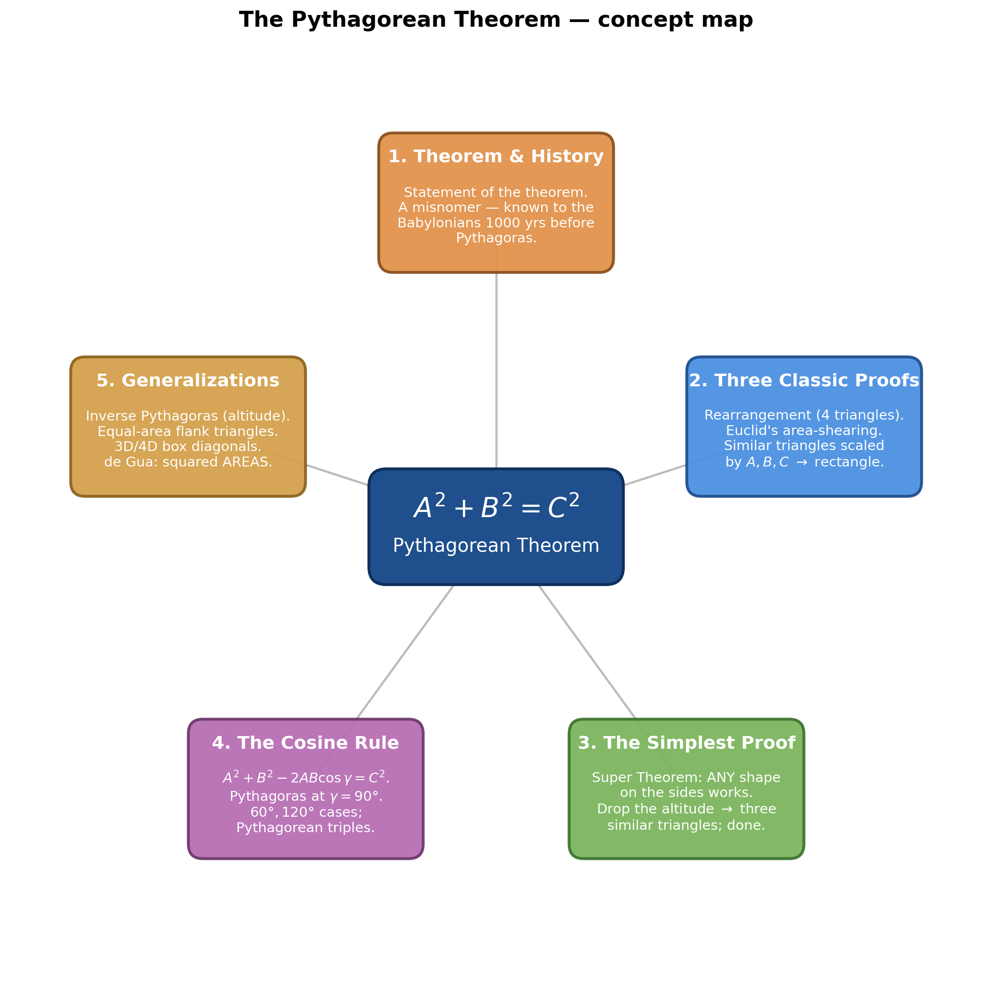
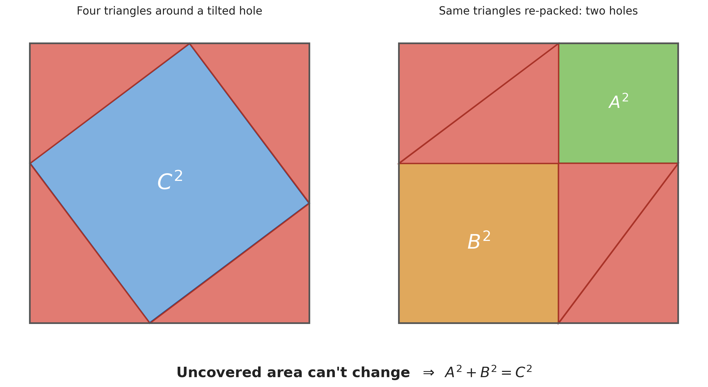
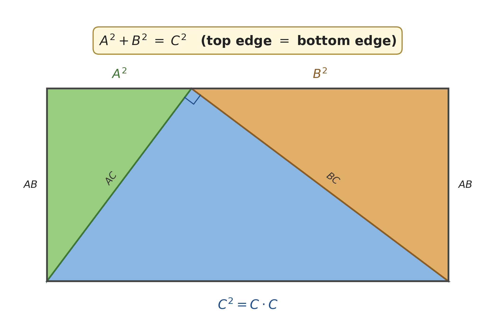
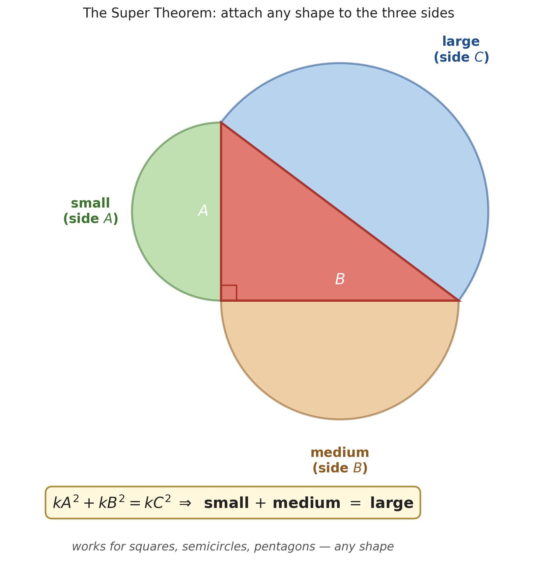
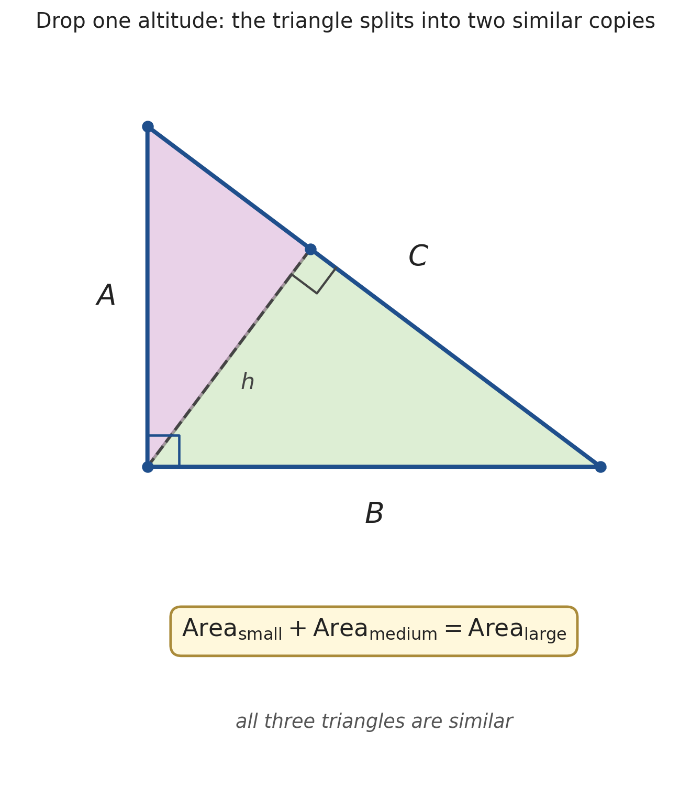

# The Pythagorean Theorem — $A^2 + B^2 = C^2$ and Beyond

*Path C single-source note — extracted from Mathologer's "Pythagorean theorem" via Gemini frame-by-frame analysis (00:00–21:01). Topics regrouped textbook-style; every timestamp is a clickable deep-link.*

| Field | Value |
|---|---|
| **Source** | [Pythagorean theorem](https://www.youtube.com/watch?v=p-0SOWbzUYI) |
| **Speaker** | Burkard Polster (Mathologer) |
| **Length** | 21:01 |
| **Topic** | The theorem, four proofs, the "Super Theorem" generalization, the cosine rule, and a gallery of higher generalizations (incl. de Gua's theorem) |
| **Captured** | 2026-06-02 |

> [!info] The one-sentence story
> Mathologer's "main mission" is to **chase down the simplest possible proof** of $A^2+B^2=C^2$. The journey passes through three classic proofs (rearrangement, Euclid, similar triangles), arrives at a strikingly short proof built on a **"Super Theorem"** (you may attach *any* shape to the triangle's sides, not just squares), and then keeps going — generalizing to non-right triangles (the **cosine rule**) and to higher dimensions (**de Gua's theorem**, where it is *squared areas* that add up).

---

## 1. The Theorem and Its History

### 1.1 The statement *(at [[0:05]](https://www.youtube.com/watch?v=p-0SOWbzUYI&t=5s))*

For a right-angled triangle with legs $A$, $B$ and hypotenuse $C$:

$$A^2 + B^2 = C^2$$

Mathologer calls it *"the theorem of theorems"* and his mission is explicit:

> "My main mission today is to chase down the all-time greatest, simplest, no-brainer proof of Pythagoras's theorem just for you." *(at [[0:25]](https://www.youtube.com/watch?v=p-0SOWbzUYI&t=25s))*

### 1.2 A misnomer — Pythagoras didn't discover it *(at [[0:53]](https://www.youtube.com/watch?v=p-0SOWbzUYI&t=53s))*

> [!note] "Pythagoras's theorem is a misnomer."
> - The fact was **known to the Babylonians at least a thousand years before Pythagoras was born** *(at [[1:03]](https://www.youtube.com/watch?v=p-0SOWbzUYI&t=63s))*.
> - There is **no evidence** Pythagoras produced the first rigorous proof; many historians doubt it.
> - The name stuck because the **Pythagoreans** (his mathematical cult) attributed all of their results to Pythagoras himself *(at [[1:24]](https://www.youtube.com/watch?v=p-0SOWbzUYI&t=84s))*.

---

## 2. Three Classic Proofs

### 2.1 The rearrangement proof *(at [[1:52]](https://www.youtube.com/watch?v=p-0SOWbzUYI&t=112s))*

Take four identical copies of the right triangle and pack them into a large square of side $A+B$ in two different ways. The area *not* covered by the four triangles must be the same in both packings — and that uncovered area is $C^2$ in the first, $A^2+B^2$ in the second.

> [!example] The proof in three rearrangement steps
> **Step 1 — the $C^2$ packing** *(at [[2:14]](https://www.youtube.com/watch?v=p-0SOWbzUYI&t=134s))*. Arrange the four triangles so their right angles sit in the four corners and their hypotenuses face inward. The leftover hole is a tilted square of side $C$, area $\mathbf{C^2}$.
> **Step 2 — shift them** *(at [[2:54]](https://www.youtube.com/watch?v=p-0SOWbzUYI&t=174s))*. Slide the triangles around *inside the same outer square*. Because the four triangles always cover the same total area, **the uncovered area cannot change**.
> **Step 3 — the $A^2+B^2$ packing** *(at [[3:06]](https://www.youtube.com/watch?v=p-0SOWbzUYI&t=186s))*. Re-pack them into two rectangles in opposite corners. Now the holes are two squares — one of side $A$ (area $A^2$) and one of side $B$ (area $B^2$).
>
> **Conclusion.** Same uncovered area before and after $\Rightarrow \boxed{A^2 + B^2 = C^2}$.
> **Insight.** No algebra — just "the leftover area can't change when you only shuffle the same four pieces."

*Generated by matplotlib via `_gen_pyth_fig1_rearrangement.py` — the same four triangles (3-4-5) packed two ways inside a square of side $A{+}B$. Left: the central tilted hole is $C^2$. Right: the two holes are $A^2$ and $B^2$. Equal leftover area $\Rightarrow A^2+B^2=C^2$.*

> [!warning] Looks can be deceiving
> Mathologer stresses this picture is only a *bulletproof* proof once you separately verify "that the two square-looking shapes are really squares." *(at [[3:24]](https://www.youtube.com/watch?v=p-0SOWbzUYI&t=204s))* — *"that's as true in maths as it is in life."*

### 2.2 Euclid's shearing proof *(at [[3:48]](https://www.youtube.com/watch?v=p-0SOWbzUYI&t=228s))*
Ready this : [Euclid’s Proof of the Pythagorean Theorem | Synaptic | Central College](https://central.edu/writing-anthology/2019/01/31/159/)
From Euclid's *Elements* (Prop. XLVII). Build squares on all three sides and drop a vertical line from the right angle through the big square on the hypotenuse, splitting it into a left rectangle and a right rectangle. The proof shows each leg-square equals the rectangle beneath it, using **area-preserving shears**:

1. **Shear the small (leg-$A$) square** into a parallelogram, then shear it again so its base lands on the dividing line — turning it into the **left rectangle** of the hypotenuse square. Shearing never changes area *(at [[4:48]](https://www.youtube.com/watch?v=p-0SOWbzUYI&t=288s))*.
2. **Repeat for the leg-$B$ square** → it becomes the **right rectangle** *(at [[5:06]](https://www.youtube.com/watch?v=p-0SOWbzUYI&t=306s))*.
3. Left rectangle $+$ right rectangle $=$ whole hypotenuse square, so $A^2 + B^2 = C^2$.

> [!tip] The engine: "shifting the triangle does not change the area"
> Both this proof and the rearrangement proof rest on the same idea — *sliding/shearing a shape preserves its area* — which is the recurring theme of the whole video.

### 2.3 The similar-triangles (scaling) proof *(at [[6:13]](https://www.youtube.com/watch?v=p-0SOWbzUYI&t=373s))*

Take three copies of the original triangle and **scale** them by $A$, by $B$, and by $C$. Scaling by $k$ multiplies every side by $k$, so the three copies have sides:

| Copy | Scaled by | Sides become |
|---|---|---|
| Large | $C$ | $AC,\; BC,\; CC=C^2$ |
| Medium | $B$ | $AB,\; BB=B^2,\; BC$ |
| Small | $A$ | $AA=A^2,\; AB,\; AC$ |

The large copy shares side $BC$ with the medium and side $AC$ with the small *(double-arrows at [[6:46]](https://www.youtube.com/watch?v=p-0SOWbzUYI&t=406s))*, so the three slot together into a **rectangle**:

> [!example] Why the rectangle forces $A^2+B^2=C^2$
> **Setup.** The big copy is the bottom; the two smaller copies fill the top.
> **The two long edges.** The rectangle's **bottom edge** is the big copy's hypotenuse $CC = C^2$. The **top edge** is the two small hypotenuses laid end to end: $AA + BB = A^2 + B^2$.
> **Solution.** Opposite sides of a rectangle are equal, so top $=$ bottom:
> $$A^2 + B^2 = C^2.$$
> **Insight.** "Multiply a triangle's dimensions by $k$ and its area scales by $k^2$" is exactly the seed of the **Super Theorem** in §3.

*Generated by matplotlib via `_gen_pyth_fig2_similar_scaling.py` — the original triangle scaled by $C$ (blue), $A$ (green) and $B$ (orange) interlock into one rectangle. Bottom edge $=C^2$; top edge $=A^2+B^2$; matched sides $AC$ and $BC$ shown with arrows.*

---

## 3. The "Simplest" Proof — drop the altitude

This is the video's destination. It needs one idea first.

### 3.1 The Super Theorem: *any* shape works *(at [[8:18]](https://www.youtube.com/watch?v=p-0SOWbzUYI&t=498s))*

> [!definition] The Super Theorem
> Attach three **scaled copies of the same shape** to the three sides of a right triangle (one copy per side, scaled to that side's length). Then **small shape $+$ medium shape $=$ large shape** (in area) — *whatever* the shape is. Squares give ordinary Pythagoras; semicircles, pentagons, even cartoon faces all work too. *(at [[8:29]](https://www.youtube.com/watch?v=p-0SOWbzUYI&t=509s))*

**Why it's true (one line).** Every shape's area is some fixed constant $k$ times the square on the same side (e.g. a semicircle on side $s$ has area $\tfrac{\pi}{8}s^2 = k\,s^2$). So multiply the square identity by that constant:

$$A^2+B^2=C^2 \;\;\xrightarrow{\;\times\,k\;}\;\; \underbrace{kA^2}_{\text{small shape}} + \underbrace{kB^2}_{\text{medium shape}} = \underbrace{kC^2}_{\text{large shape}}.$$

*Generated by matplotlib via `_gen_pyth_fig4_super_theorem.py` — semicircles on the three sides of a right triangle. Because every shape's area is the same constant $k$ times (side)$^2$, the constant cancels and small $+$ medium $=$ large for any shape.*

### 3.2 The reverse-implication trick *(at [[10:15]](https://www.youtube.com/watch?v=p-0SOWbzUYI&t=615s))*

> "If we can prove from scratch that Pythagoras is true for **some special shape**, then this proof implies immediately that Pythagoras is true for **all** other shapes." *(at [[10:15]](https://www.youtube.com/watch?v=p-0SOWbzUYI&t=615s))*

So we get to **pick the most convenient shape** and only prove the theorem for that one.

### 3.3 The proof — the triangle is its own best shape *(at [[10:46]](https://www.youtube.com/watch?v=p-0SOWbzUYI&t=646s))*

Choose the shape to be **a copy of the right triangle itself**. Now the proof is almost nothing:

> [!example] The simplest proof
> **Step 1.** Drop a perpendicular from the right angle to the hypotenuse. It splits the original triangle into **two smaller triangles** *(at [[11:01]](https://www.youtube.com/watch?v=p-0SOWbzUYI&t=661s))*.
> **Step 2.** All three triangles (the two pieces and the original) **share the same angles**, so they are **similar** — i.e. scaled copies of one shape *(at [[11:13]](https://www.youtube.com/watch?v=p-0SOWbzUYI&t=673s))*.
> **Step 3.** The two pieces physically make up the whole, so $\text{Area}(\text{small}) + \text{Area}(\text{medium}) = \text{Area}(\text{large})$ — trivially true.
> **Step 4.** But those three similar triangles are exactly "the shape attached to each side." By the Super Theorem (§3.1), this *one* case forces Pythagoras for **every** shape, including squares.
>
> **Conclusion.** $\boxed{A^2+B^2=C^2}$ — proved by drawing a single line and noticing the pieces add up.

*Generated by matplotlib via `_gen_pyth_fig3_simplest_altitude.py` — the altitude (dashed) from the right angle splits the triangle into two pieces, each similar to the whole. The shape "attached to each side" is just the triangle itself, so small $+$ medium $=$ large is automatic.*

> [!tip] Why this is the punchline
> Every other proof works to show a sum of areas is equal. Here, the splitting makes "small $+$ medium $=$ large" **true by construction** — the only real content is the observation that the three triangles are similar.

### 3.4 The pizza puzzle *(at [[11:48]](https://www.youtube.com/watch?v=p-0SOWbzUYI&t=708s))*

> [!question] Left to the viewer
> A shop sells small, medium and large pizzas, and **price(small) + price(medium) = price(large)**. Using only a pizza knife, which is the better deal — the small+medium combo, or the single large? *(Hint: pizza area scales as diameter$^2$, so this is the Super Theorem with circles. Mathologer leaves the answer as an exercise.)*

---

## 4. Beyond Right Angles: the Cosine Rule

### 4.1 Generalizing the picture to any triangle *(at [[12:11]](https://www.youtube.com/watch?v=p-0SOWbzUYI&t=731s))*

Euclid's rectangles still work for a non-right triangle, but the two leg-squares now *overlap* the hypotenuse square by a correction term. With $\gamma$ the angle opposite side $C$, each correction rectangle has area $AB\cos\gamma$ *(at [[13:11]](https://www.youtube.com/watch?v=p-0SOWbzUYI&t=791s))*.

$$\underbrace{A^2 + B^2}_{\text{two leg squares}} \;-\; \underbrace{2AB\cos\gamma}_{\text{two corrections}} \;=\; C^2$$

This is the **cosine rule** *(at [[13:38]](https://www.youtube.com/watch?v=p-0SOWbzUYI&t=818s))*.

### 4.2 Special cases *(at [[13:49]](https://www.youtube.com/watch?v=p-0SOWbzUYI&t=829s))*

| Angle $\gamma$ | $\cos\gamma$ | Cosine rule becomes |
|---|---|---|
| $90°$ | $0$ | $A^2 + B^2 = C^2$ (Pythagoras) |
| $60°$ | $\tfrac12$ | $A^2 + B^2 - AB = C^2$ |
| $120°$ | $-\tfrac12$ | $A^2 + B^2 + AB = C^2$ |

Pythagoras is just the cosine rule at its "nicest" angle — the correction term vanishes precisely when $\gamma = 90°$.

### 4.3 Pythagorean triples *(at [[14:35]](https://www.youtube.com/watch?v=p-0SOWbzUYI&t=875s))*

Integer solutions of $A^2+B^2=C^2$, e.g. $3^2 + 4^2 = 5^2$.

> [!question] Mathologer's challenge *(at [[14:48]](https://www.youtube.com/watch?v=p-0SOWbzUYI&t=888s))*
> Can you find non-trivial positive-integer triples for the $60°$ and $120°$ equations, $A^2+B^2-AB=C^2$ and $A^2+B^2+AB=C^2$?

---

## 5. A Gallery of Generalizations

> [!note] Why this gallery exists
> Mathologer pushes back on the idea that an ancient theorem is "finished": *"New proofs and fascinating Pythagorean-ish facts are still being discovered"* *(at [[14:58]](https://www.youtube.com/watch?v=p-0SOWbzUYI&t=898s))* — he even mentions a proof he and co-author Marty found that appears to be new. The gallery below builds toward his all-time favorite, de Gua's theorem.

### 5.1 The Inverse Pythagorean Theorem *(at [[15:58]](https://www.youtube.com/watch?v=p-0SOWbzUYI&t=958s))*

Drop the altitude $D$ from the right angle to the hypotenuse. Then the **reciprocals of the squared legs** add up:

$$\frac{1}{A^2} + \frac{1}{B^2} = \frac{1}{D^2}$$

> [!info] Deep dive available
> This exact identity gets its own full proof in the companion note **[The Inverse Pythagorean Theorem](inverse_pythagorean_theorem.md)** (from blackpenredpen). It also shares its central trick — *drop the altitude* — with [Sneaky Proof of the Pythagorean Identity](<../Trigonometric/Sneaky Proof of Pythagorean Identity (Main).md>).

### 5.2 Equal-area triangles around any triangle *(at [[16:10]](https://www.youtube.com/watch?v=p-0SOWbzUYI&t=970s))*

Build squares outward on the three sides of *any* triangle, then connect adjacent outer corners with segments $X, Y, Z$, creating three new "flank" triangles. Two surprises:

- **Each flank triangle has the same area as the original.** *(at [[16:28]](https://www.youtube.com/watch?v=p-0SOWbzUYI&t=988s))*
- The connecting segments satisfy $X^2 + Y^2 + Z^2 = 3(A^2 + B^2 + C^2)$.

> [!note] An infinite iteration
> Mathologer also shows that if you keep building squares on the new flank triangles, neat relations persist (e.g. *"five times the yellow square equals the sum of the two orange squares"*), generating a fractal-like tower of Pythagorean-flavoured identities *(at [[16:53]](https://www.youtube.com/watch?v=p-0SOWbzUYI&t=1013s))*.

### 5.3 Higher dimensions: box diagonals *(at [[17:43]](https://www.youtube.com/watch?v=p-0SOWbzUYI&t=1063s))*

The space diagonal $D$ of a 3-D box with edge lengths $A, B, C$ obeys

$$A^2 + B^2 + C^2 = D^2,$$

and the pattern continues into 4-D ($A^2+B^2+C^2+D^2 = E^2$) and beyond *(at [[18:09]](https://www.youtube.com/watch?v=p-0SOWbzUYI&t=1089s))*.

### 5.4 de Gua's theorem — Pythagoras for *areas* *(at [[18:26]](https://www.youtube.com/watch?v=p-0SOWbzUYI&t=1106s))*

Slice a corner off a rectangular box. The cut-off piece is a tetrahedron with three mutually perpendicular faces of areas $A, B, C$ and a slanted base of area $D$. Then:

$$A^2 + B^2 + C^2 = D^2 \quad\text{— but now } A,B,C,D \text{ are } \textbf{areas, not lengths.}$$

> [!tip] Mathologer's favourite
> > "I find it so surprising that this should work for squared **areas** instead of squared distances. And not only in 3D, but also in all higher dimensions, where what's squared are volumes and hypervolumes." *(at [[19:18]](https://www.youtube.com/watch?v=p-0SOWbzUYI&t=1158s))*
>
> Proving the 3-D case is a favourite homework problem he sets his university students.

---

## Key takeaways

- **The goal was the *simplest* proof**, and it is §3.3: drop one altitude, notice the three triangles are similar, and the pieces add up by construction.
- **The Super Theorem is the key lever** — since every shape's area is a constant times (side)$^2$, you only need to prove Pythagoras for *one* convenient shape, and the triangle itself is the easiest.
- **Pythagoras is a special case of the cosine rule** $A^2+B^2-2AB\cos\gamma=C^2$; the correction term dies exactly at $\gamma=90°$.
- **The theorem is far from "finished"** — reciprocal-leg identities, equal-area flank triangles, box diagonals, and de Gua's area-version all extend it, the last into every dimension.
- **One recurring idea powers almost everything: moving a shape (sliding or shearing) does not change its area.**

---

### Sources

| Source | Section | Type |
|---|---|---|
| [Pythagorean theorem](https://www.youtube.com/watch?v=p-0SOWbzUYI) | 00:00 → 21:01 | YouTube — Mathologer |
| *A Dingo Ate My Math Book* (Polster & Ross, AMS) | mentioned 20:01 | Book |
