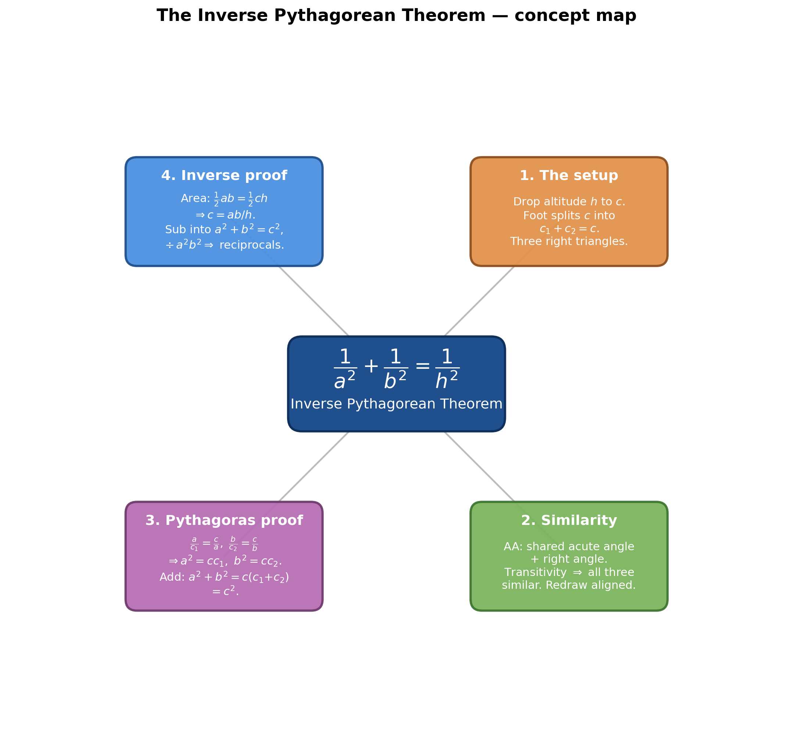
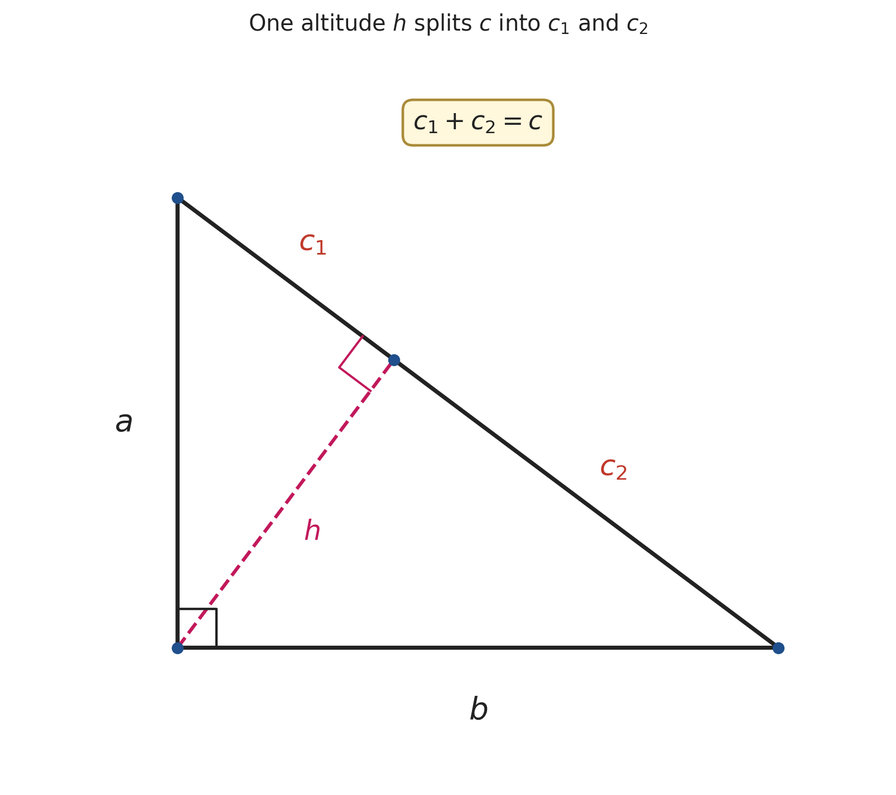
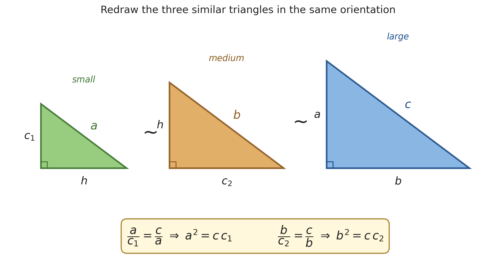

# The Inverse Pythagorean Theorem — $\dfrac{1}{a^2} + \dfrac{1}{b^2} = \dfrac{1}{h^2}$

*Companion document to [The Pythagorean Theorem (Main)](<The Pythagorean Theorem (Main).md>)*

*Path C single-source note — extracted from blackpenredpen's "The Inverse Pythagorean Theorem" via Gemini frame-by-frame analysis (00:00–08:12). Topics regrouped textbook-style; every timestamp is a clickable deep-link.*

| Field | Value |
|---|---|
| **Source** | [The Inverse Pythagorean Theorem](https://www.youtube.com/watch?v=itfXCKpmQPs) |
| **Speaker** | blackpenredpen |
| **Length** | 08:12 |
| **Topic** | One altitude → three similar triangles → a similar-triangles proof of $a^2+b^2=c^2$, then the inverse theorem $\tfrac1{a^2}+\tfrac1{b^2}=\tfrac1{h^2}$ |
| **Captured** | 2026-06-02 |

> [!info] Two theorems from one picture
> Drop the altitude $h$ from the right angle onto the hypotenuse. That single line creates **three similar right triangles**, and from them blackpenredpen gets *two* results: first his favourite proof of ordinary Pythagoras ($a^2+b^2=c^2$), then — using the fact that the triangle's area can be written **two ways** — the **inverse Pythagorean theorem**: the reciprocals of the *squared legs* add up to the reciprocal of the *squared altitude*.

---

## 1. The setup: one altitude, three similar triangles *(at [[0:36]](https://www.youtube.com/watch?v=itfXCKpmQPs&t=36s))*

Start with a right triangle: vertical leg $a$, horizontal leg $b$, hypotenuse $c$, right angle between $a$ and $b$. Drop the **altitude $h$** from the right angle perpendicular onto $c$. It splits the hypotenuse into two pieces — $c_1$ (next to leg $a$) and $c_2$ (next to leg $b$) — so that

$$c_1 + c_2 = c$$

*(at [[0:53]](https://www.youtube.com/watch?v=itfXCKpmQPs&t=53s))*

*Generated by matplotlib via `_gen_ipt_fig1_construction.py` — the altitude $h$ (dashed) from the right angle splits hypotenuse $c$ into $c_1$ (by leg $a$) and $c_2$ (by leg $b$). Right-angle marks at the original vertex and at the foot of the altitude.*

blackpenredpen then **redraws the three triangles separately, all in the same orientation** (right angle at the bottom-left, shorter leg vertical) so corresponding sides line up *(at [[1:01]](https://www.youtube.com/watch?v=itfXCKpmQPs&t=61s))*:

| Triangle | Vertical leg | Horizontal leg | Hypotenuse |
|---|---|---|---|
| **Small** | $c_1$ | $h$ | $a$ |
| **Medium** | $h$ | $c_2$ | $b$ |
| **Large** (original) | $a$ | $b$ | $c$ |

---

## 2. Why the three triangles are similar *(at [[1:52]](https://www.youtube.com/watch?v=itfXCKpmQPs&t=112s))*

> [!note] Angle-Angle, then transitivity
> Each small/medium triangle shares one acute angle with the original (marked with a red arc) **and** has a right angle — two equal angles, so by **AA similarity** the third angle matches too *(at [[1:55]](https://www.youtube.com/watch?v=itfXCKpmQPs&t=115s))*. Writing $\text{small} \sim \text{large}$ and $\text{medium} \sim \text{large}$, the **transitive property** gives all three similar *(at [[2:26]](https://www.youtube.com/watch?v=itfXCKpmQPs&t=146s))*.

*Generated by matplotlib via `_gen_ipt_fig2_three_similar.py` — the small, medium and large triangles redrawn at the same orientation. Reading off matching sides gives the two proportions $\tfrac{a}{c_1}=\tfrac{c}{a}$ and $\tfrac{b}{c_2}=\tfrac{c}{b}$.*

> "And with that being said, we can actually set up proportions to take care of some business." *(at [[2:29]](https://www.youtube.com/watch?v=itfXCKpmQPs&t=149s))*

---

## 3. First payoff: a similar-triangles proof of $a^2+b^2=c^2$ *(at [[2:33]](https://www.youtube.com/watch?v=itfXCKpmQPs&t=153s))*

The trick is to set up the proportions **without involving $h$** — compare each small triangle's hypotenuse-to-leg ratio with the large triangle's.

> [!example] The proof
> **From Small $\sim$ Large** (matching hypotenuse to shorter leg) *(at [[2:53]](https://www.youtube.com/watch?v=itfXCKpmQPs&t=173s))*:
> $$\frac{a}{c_1} = \frac{c}{a} \;\;\xrightarrow{\text{cross-multiply}}\;\; a^2 = c\,c_1 \quad (1)$$
> **From Medium $\sim$ Large** (matching hypotenuse to longer leg) *(at [[3:30]](https://www.youtube.com/watch?v=itfXCKpmQPs&t=210s))*:
> $$\frac{b}{c_2} = \frac{c}{b} \;\;\xrightarrow{\text{cross-multiply}}\;\; b^2 = c\,c_2 \quad (2)$$
> **Add (1) + (2)** *(at [[3:53]](https://www.youtube.com/watch?v=itfXCKpmQPs&t=233s))*:
> $$a^2 + b^2 = c\,c_1 + c\,c_2 = c\,(c_1 + c_2)$$
> **Use $c_1 + c_2 = c$** *(at [[4:25]](https://www.youtube.com/watch?v=itfXCKpmQPs&t=265s))*:
> $$a^2 + b^2 = c \cdot c = \boxed{c^2}$$
>
> **Insight.** Choosing the hypotenuse-to-leg ratios deliberately keeps $h$ out of the algebra, so the leg-segments $c_1, c_2$ are the only extra quantities — and they conveniently sum to $c$. *("Ta-da! This right here is it." — [[4:41]](https://www.youtube.com/watch?v=itfXCKpmQPs&t=281s))*

---

## 4. The main event: the Inverse Pythagorean Theorem *(at [[5:03]](https://www.youtube.com/watch?v=itfXCKpmQPs&t=303s))*

This time blackpenredpen **keeps $h$** and instead eliminates $c$, by computing the triangle's area **two different ways**.

> [!example] Deriving $\dfrac{1}{a^2} + \dfrac{1}{b^2} = \dfrac{1}{h^2}$
> **Area two ways.** Using the legs as base/height, then the hypotenuse with its altitude *(at [[5:28]](https://www.youtube.com/watch?v=itfXCKpmQPs&t=328s)–[[5:51]](https://www.youtube.com/watch?v=itfXCKpmQPs&t=351s))*:
> $$\tfrac{1}{2}ab = \tfrac{1}{2}ch$$
> **Clear the $\tfrac12$ and solve for $c$** *(at [[6:04]](https://www.youtube.com/watch?v=itfXCKpmQPs&t=364s)–[[6:25]](https://www.youtube.com/watch?v=itfXCKpmQPs&t=385s))*:
> $$ab = ch \;\Longrightarrow\; c = \frac{ab}{h}$$
> **Substitute into $a^2+b^2=c^2$** *(at [[6:47]](https://www.youtube.com/watch?v=itfXCKpmQPs&t=407s))*:
> $$a^2 + b^2 = \left(\frac{ab}{h}\right)^2 = \frac{a^2 b^2}{h^2}$$
> **Divide every term by $a^2 b^2$** *(at [[7:18]](https://www.youtube.com/watch?v=itfXCKpmQPs&t=438s))*:
> $$\frac{a^2}{a^2 b^2} + \frac{b^2}{a^2 b^2} = \frac{a^2 b^2}{h^2 a^2 b^2} \;\Longrightarrow\; \frac{1}{b^2} + \frac{1}{a^2} = \frac{1}{h^2}$$
> **Final form** *(at [[8:08]](https://www.youtube.com/watch?v=itfXCKpmQPs&t=488s))*:
> $$\boxed{\;\dfrac{1}{a^2} + \dfrac{1}{b^2} = \dfrac{1}{h^2}\;}\qquad\text{equivalently}\qquad a^{-2} + b^{-2} = h^{-2}$$
>
> **Insight.** The bridge is $c = ab/h$, which comes purely from "area is area." Squaring it converts the *additive* Pythagorean relation into a *reciprocal* one.

> [!tip] Sanity check (independent of the video)
> Since $h = \dfrac{ab}{c}$, we have $\dfrac{1}{h^2} = \dfrac{c^2}{a^2b^2} = \dfrac{a^2+b^2}{a^2b^2} = \dfrac{1}{b^2} + \dfrac{1}{a^2}.$ ✓ The identity holds exactly.

---

## Key takeaways

- **One construction, two theorems.** Dropping the altitude makes three similar triangles; proportions give $a^2+b^2=c^2$, and the area identity gives $\tfrac1{a^2}+\tfrac1{b^2}=\tfrac1{h^2}$.
- **The two proofs are mirror choices.** The Pythagorean proof is set up to *avoid* $h$; the inverse proof deliberately *keeps* $h$ and removes $c$ via $c = ab/h$.
- **"Area is area" is the key bridge.** Equating $\tfrac12 ab$ and $\tfrac12 ch$ is what links the legs, hypotenuse, and altitude.
- **The inverse theorem also appears in [The Pythagorean Theorem (Main)](<The Pythagorean Theorem (Main).md>) §5.1** — Mathologer states it (with the altitude called $D$) as one of his "gallery" facts; here it gets a full proof.

---

## Related Documents

- **[The Pythagorean Theorem (Main)](<The Pythagorean Theorem (Main).md>)** — the hub note; this companion expands its §5.1 (the inverse theorem) with a complete derivation.
- **[Sneaky Proof of the Pythagorean Identity](<../Trigonometric/Sneaky Proof of Pythagorean Identity (Main).md>)** — uses the *same* "drop the altitude → similar sub-triangles" move to prove $\sin^2\theta+\cos^2\theta=1$.
