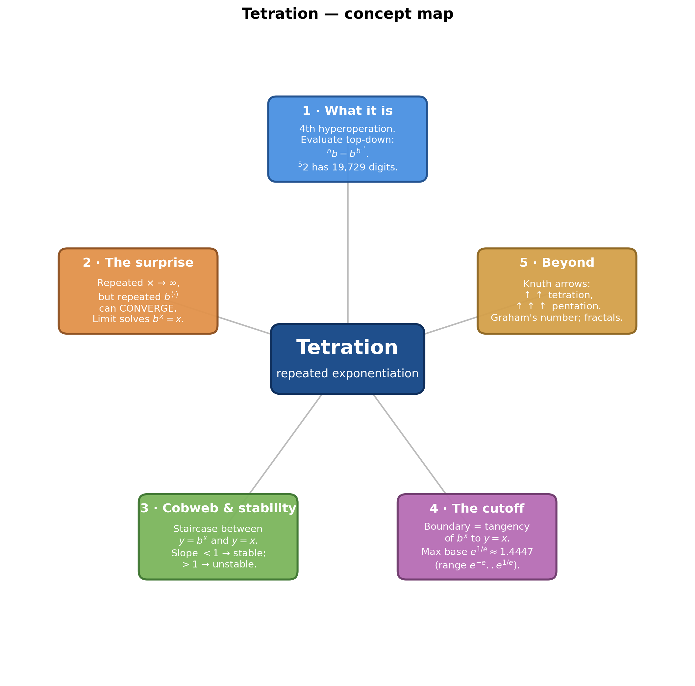
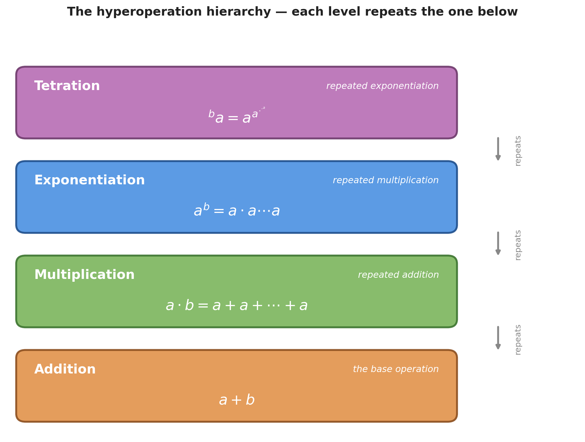
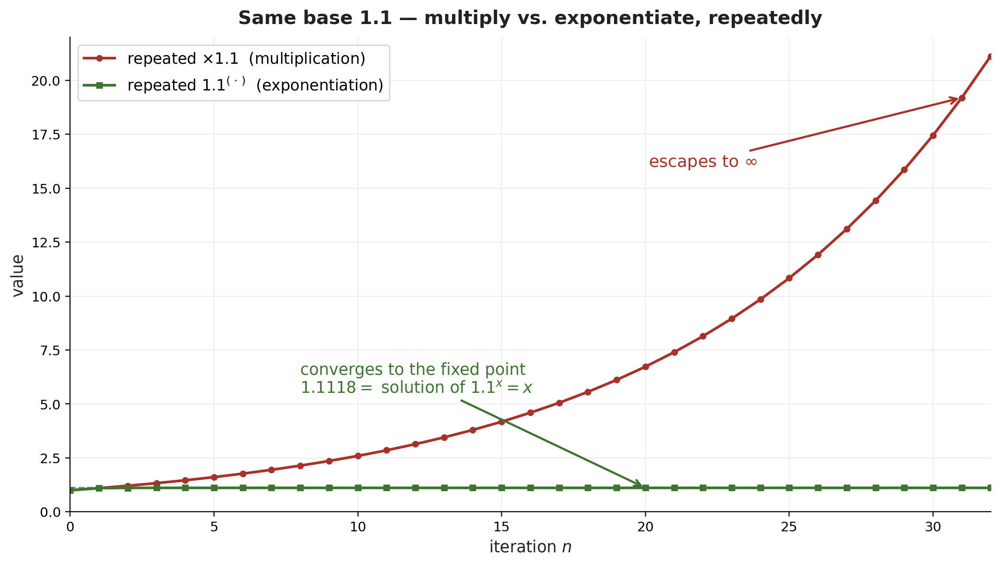
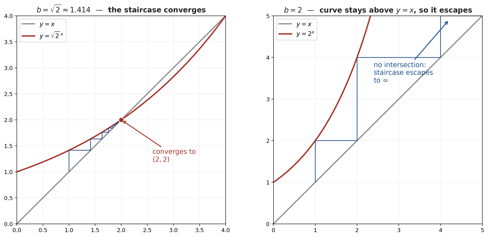
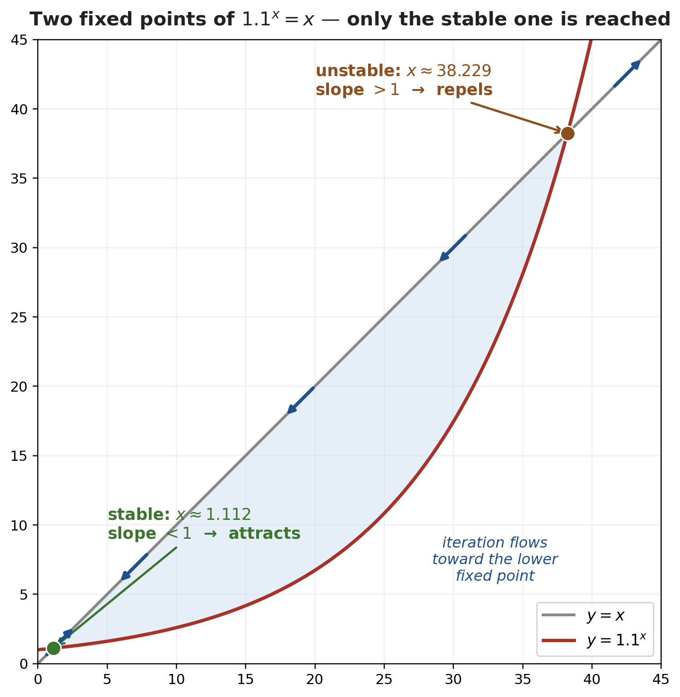
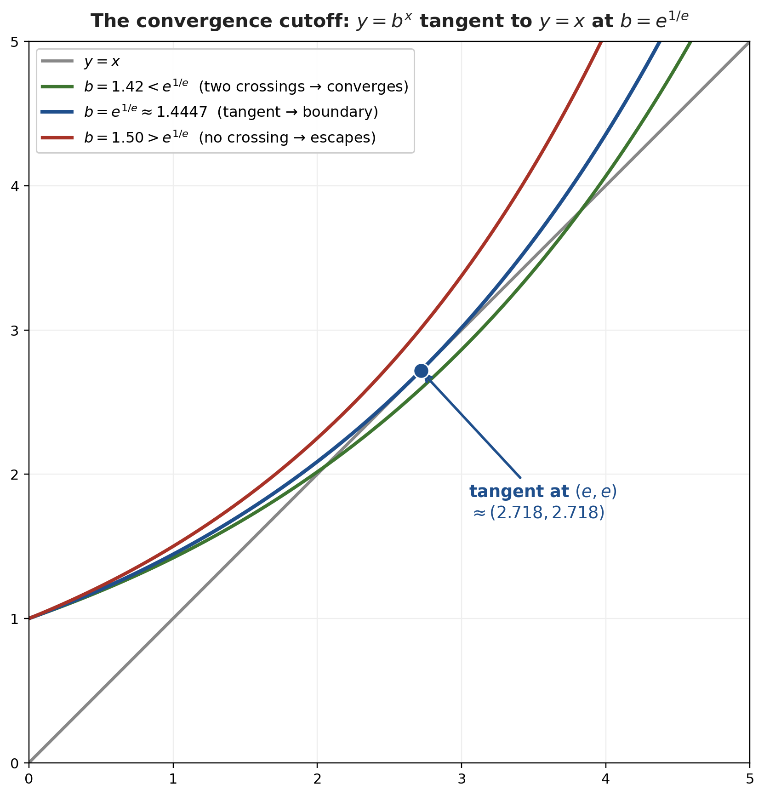

# Tetration — Repeated Exponentiation and the Power-Tower Convergence

*Path C single-source note — extracted from 3Blue1Brown's "Tetration" (Lockdown Math, Grant Sanderson) via Gemini frame-by-frame analysis (00:00–34:52). The video's material is regrouped textbook-style by topic; every timestamp is a clickable deep-link.*

| Field | Value |
|---|---|
| **Source** | [Tetration — 3Blue1Brown / Lockdown Math](https://www.youtube.com/watch?v=elQVZLLiod4) |
| **Length** | 34:52 |
| **Topic** | Tetration (repeated exponentiation): its explosive growth, and exactly which infinite power towers $b^{b^{b^{\cdots}}}$ converge |
| **Captured** | 2026-06-12 |

> [!abstract] The one surprise
> Repeatedly **multiplying** a number bigger than 1 by itself runs off to infinity. You'd expect repeatedly **exponentiating** — a far more violent operation — to explode even faster. It doesn't. The infinite power tower $1.1^{1.1^{1.1^{\cdots}}}$ quietly settles down to $1.11178\ldots$. This note works out *why*, and finds the exact cutoff: the tower $b^{b^{b^{\cdots}}}$ converges precisely up to $b = e^{1/e} \approx 1.4447$.

---

## 1. What is tetration?

### 1.1 The hyperoperation hierarchy *(at [[2:01]](https://www.youtube.com/watch?v=elQVZLLiod4&t=121s))*

Each operation is "repeat the previous one":

| Operation | Definition | |
|---|---|---|
| Addition | $a + b$ | the base case |
| Multiplication | $a \cdot b = \underbrace{a + a + \cdots + a}_{b}$ | repeated addition |
| Exponentiation | $a^b = \underbrace{a \cdot a \cdots a}_{b}$ | repeated multiplication |
| **Tetration** | ${}^{b}a = \underbrace{a^{a^{\cdot^{\cdot^{a}}}}}_{b}$ | repeated exponentiation |

> [!note] Why "tetra" *(at [[2:35]](https://www.youtube.com/watch?v=elQVZLLiod4&t=155s))*
> *"Tetra comes from the Greek for four — it's the fourth stage in this process of repeatedly applying the previous operation."* (Addition is the 1st in the chain, then ×, then ^, then tetration.)

*Generated by matplotlib via `_gen_tet_fig1_hierarchy.py` — each level is "repeat the one below": addition → multiplication → exponentiation → tetration.*

### 1.2 Power towers are ambiguous — so evaluate top-down *(at [[3:39]](https://www.youtube.com/watch?v=elQVZLLiod4&t=219s))*

Exponentiation is **not associative**, so a stack of exponents needs an evaluation rule. The two orders give wildly different answers:

> [!example] $2^{2^{2^2}}$ — bottom-up vs top-down *(at [[4:09]](https://www.youtube.com/watch?v=elQVZLLiod4&t=249s))*
> **Bottom-up** (left-associative): $((2^2)^2)^2 = (4^2)^2 = 16^2 = \mathbf{256}$.
> **Top-down** (right-associative): $2^{(2^{(2^2)})} = 2^{(2^4)} = 2^{16} = \mathbf{65{,}536}$.
> **Tetration uses the top-down order** — start at the top of the tower and work down. *(at [[4:44]](https://www.youtube.com/watch?v=elQVZLLiod4&t=284s))*

### 1.3 The clean iterative definition *(at [[4:55]](https://www.youtube.com/watch?v=elQVZLLiod4&t=295s))*

To kill the ambiguity, define the height-$n$ tower of base $b$ as a recursion:

$$a_0 = 1, \qquad a_n = b^{\,a_{n-1}}.$$

Unfolding $a_n = b^{a_{n-1}} = b^{b^{a_{n-2}}} = \cdots$ rebuilds the right-associative tower of height $n$ automatically.

### 1.4 Tetration grows *obscenely* fast *(at [[7:39]](https://www.youtube.com/watch?v=elQVZLLiod4&t=459s))*

Iterating $a_n = 2^{a_{n-1}}$ in Python: $1 \to 2 \to 4 \to 16 \to 65{,}536 \to$ a number with **19,729 digits** (height 5). Height 6 is $2^{2^{65536}}$ —

> [!quote] On the scale of $^{6}2$ *(at [[8:00]](https://www.youtube.com/watch?v=elQVZLLiod4&t=480s))*
> *"Any way you used matter to encode all the digits… within the radius of the Earth, you would absolutely create a black hole in any attempt to store that kind of information."*

---

## 2. The convergence surprise

### 2.1 The 1.1 puzzle *(at [[8:30]](https://www.youtube.com/watch?v=elQVZLLiod4&t=510s))*

How tall must the tower $1.1^{1.1^{\cdots}}$ be to exceed 10 digits? The answer is the trap: **it never gets that large.**

- Repeated **multiplication** by 1.1 (ordinary exponential growth) marches to infinity — after 50 steps it's already $\approx 117$. *(at [[10:13]](https://www.youtube.com/watch?v=elQVZLLiod4&t=613s))*
- Repeated **exponentiation** $a \mapsto 1.1^a$ *stabilizes* within ~20 steps at $\mathbf{1.1117820110418435}$ — the digits stop changing. *(at [[11:38]](https://www.youtube.com/watch?v=elQVZLLiod4&t=698s))*

> [!quote] The counterintuition *(at [[11:05]](https://www.youtube.com/watch?v=elQVZLLiod4&t=665s))*
> *"It's very weird — repeatedly multiplying grows as much as you want, but doing what feels like a much more powerful operation, repeatedly exponentiating, actually stays confined."*

*Generated by matplotlib via `_gen_tet_fig5_growth.py` — iterating $\times 1.1$ escapes to infinity; iterating $1.1^{(\cdot)}$ converges to the fixed point $\approx 1.1118$.*

### 2.2 The fixed-point equation *(at [[12:08]](https://www.youtube.com/watch?v=elQVZLLiod4&t=728s))*

When the tower stops changing, the limit $x$ satisfies $b^x = x$ — feeding $x$ through the map returns $x$. For $b = 1.1$ this has a solution ($x \approx 1.1118$); for $b = 2$ the equation $2^x = x$ has **no real solution**, which is why the base-2 tower blows up. *(at [[12:18]](https://www.youtube.com/watch?v=elQVZLLiod4&t=738s))*

### 2.3 The self-similarity trick *(at [[13:58]](https://www.youtube.com/watch?v=elQVZLLiod4&t=838s))*

Because the tower is *infinite*, the exponent is a genuine copy of the whole thing:

> [!example] Solve $x^{x^{x^{\cdots}}} = 4$ *(at [[14:06]](https://www.youtube.com/watch?v=elQVZLLiod4&t=846s))*
> **Trick.** The circled exponent $x^{x^{\cdots}}$ *is* the whole tower, which equals 4. Substitute:
> $$x^{\,4} = 4 \;\Longrightarrow\; x^2 = 2 \;\Longrightarrow\; x = \sqrt{2}.$$
> **Answer.** $x = \sqrt{2}$ (since $4^{1/4} = \sqrt2$).
> **Quiz** *(at [[15:08]](https://www.youtube.com/watch?v=elQVZLLiod4&t=908s))*: the same trick on $x^{x^{\cdots}} = 2$ gives $x^2 = 2 \Rightarrow x = \sqrt2$ again.

### 2.4 The paradox — and what the trick misses *(at [[17:15]](https://www.youtube.com/watch?v=elQVZLLiod4&t=1035s))*

The trick says base $\sqrt2$ makes the tower equal **both** 2 and 4 — impossible, since the iteration is deterministic. Testing empirically, $\sqrt2^{\sqrt2^{\cdots}}$ converges to **2**, not 4. *(at [[18:56]](https://www.youtube.com/watch?v=elQVZLLiod4&t=1136s))*

> [!warning] The trick finds *candidates*, not the *answer*
> Substitution assumes convergence and only locates **fixed points** $b^x = x$. The base $\sqrt2$ has two of them — $x=2$ and $x=4$ (check: $\sqrt2^2 = 2$, $\sqrt2^4 = 4$) — but the tower actually lands on one specific value. To know *which*, you need stability (§3).

---

## 3. Cobweb diagrams and the stability of fixed points

### 3.1 The cobweb construction *(at [[20:12]](https://www.youtube.com/watch?v=elQVZLLiod4&t=1212s))*

Desmos example over here [Power tower | Desmos](https://www.desmos.com/calculator/nul32eaaa9)

To iterate $a \mapsto b^a$ graphically: from a point on $y = b^x$, go **horizontally** to $y = x$ (this turns the output into the next input), then **vertically** back to the curve. Repeating draws a "staircase."

- For $b = 2$ the staircase climbs forever — the curve sits entirely above $y = x$, so it **escapes** to infinity.
- For $b = \sqrt2 \approx 1.414$ the staircase gets trapped and spirals into the intersection point $(2, 2)$ — it **converges**. *(at [[22:38]](https://www.youtube.com/watch?v=elQVZLLiod4&t=1358s))*

The intersections of $y = b^x$ and $y = x$ are exactly the fixed points $b^x = x$. *(at [[22:52]](https://www.youtube.com/watch?v=elQVZLLiod4&t=1372s))*

*Generated by matplotlib via `_gen_tet_fig2_cobweb.py` — left: $b = \sqrt2$, the staircase converges to $(2,2)$. Right: $b = 2$, no intersection, the staircase escapes upward.*

### 3.2 Stable vs. unstable fixed points *(at [[24:22]](https://www.youtube.com/watch?v=elQVZLLiod4&t=1462s))*

> [!definition] The slope test
> At a fixed point where $y = b^x$ crosses $y = x$:
> - **slope of $b^x$ $< 1$** → **stable**: the staircase walks *toward* it (converges).
> - **slope of $b^x$ $> 1$** → **unstable**: the staircase walks *away* (diverges), even if you start arbitrarily close.

This resolves the paradox. Both $\sqrt2$ and $1.1$ have **two** fixed points — a lower stable one and a higher unstable one:

| Base $b$               | Stable fixed point (tower's limit) | Unstable fixed point (repels) |
| ---------------------- | ---------------------------------- | ----------------------------- |
| $\sqrt2 \approx 1.414$ | $x = 2$                            | $x = 4$                       |
| $1.1$                  | $x \approx 1.112$                  | $x \approx 38.229$            |

Seeding the iteration at $a_0 = 1$ always falls into the **lower, stable** value — which is why $\sqrt2$'s tower is 2 (not 4), and 1.1's is 1.112 (not 38.229). *(at [[30:45]](https://www.youtube.com/watch?v=elQVZLLiod4&t=1845s))*

*Generated by matplotlib via `_gen_tet_fig3_stability.py` — $y = 1.1^x$ meets $y = x$ twice; the cobweb converges to the lower point (slope $<1$) and is repelled by the upper one (slope $>1$).*

### 3.3 Why the slope decides: zoom in and the step becomes multiplication

§3.2 states the rule — slope $<1$ converges, $>1$ diverges — but *why* is the slope the quantity that matters? **Linear approximation.** Zoom in on the curve $x \mapsto b^x$ near the fixed point $y$ and it is indistinguishable from its tangent line, so one step of the iteration is well-approximated by its linearization:

$$x_{n+1} \approx y + f'(y)\,(x_n - y), \qquad f(x) = b^x.$$

Track the **error** $\varepsilon_n = x_n - y$ rather than the position, and the step collapses to pure multiplication:

$$\varepsilon_{n+1} \approx f'(y)\,\varepsilon_n.$$

Every step simply multiplies the distance-from-target by the slope — and that one fact explains all three regimes at once:

| Slope $f'(y)$ | Error each step | Behaviour |
|---|---|---|
| $\lvert f'(y)\rvert < 1$ | shrinks geometrically | **converges** to $y$ |
| $\lvert f'(y)\rvert > 1$ | grows geometrically | **escapes** to $\infty$ |
| $f'(y) < 0$ | flips sign each step | **oscillates** across $y$ — a widening 2-cycle once $\lvert f'(y)\rvert > 1$ |

> [!example] The pricing-bot intuition
> A bot nudges a price toward a &#36;100 target with the correction rule $x_{n+1} = 100 + s\,(x_n - 100)$, starting &#36;2 too high:
> - **$s = 0.5$** — corrections &#36;1, &#36;0.50, &#36;0.25, …: the gap halves every step, homing in safely.
> - **$s = 2$** — corrections &#36;4, &#36;8, &#36;16, …: the gap doubles, shooting off to infinity.
> - **$s = -2$** — &#36;2 high → &#36;4 low → &#36;8 high → …: the sign flips *and* the swing widens, bouncing apart forever.
>
> **The Golden Rule of stability:** an iteration settles on its target only when the slope there lies strictly between $-1$ and $1$. §4.4 feeds the tower's own slope — which works out to be $\ln y$ — into exactly this rule to pin down both convergence bounds.

> [!tip] Interactive — run the tower machine yourself
> 👉 **[Open: The Tower Machine — cobweb iteration lab](tet_tower_iteration_lab.html)**
> Everything in this section, live: press **Step** to feed $x_{n+1}=(\sqrt2)^{x_n}$ one iteration at a time and watch the §3.1 staircase build; the two fixed points are marked ($2$ stable, slope $\ln 2\approx0.69$; $4$ unstable, slope $\ln 4\approx1.39$); a gap table shows each step multiplying the error by $\approx0.693$ — the §3.3 rule $\varepsilon_{n+1}\approx f'(y)\,\varepsilon_n$ in action. Zoom to 8×–20× until the curve and its tangent become indistinguishable, drag the start anywhere (try starting just above $4$), or flip "iterate the tangent instead" to run the pure linearization.

---

## 4. The maximum base: $e^{1/e}$

### 4.1 The boundary is a tangency *(at [[27:43]](https://www.youtube.com/watch?v=elQVZLLiod4&t=1663s))*

As $b$ rises, the two fixed points slide together; past some critical $b$ the curve $y = b^x$ lifts off the line $y = x$ entirely and **no** fixed point remains (the tower escapes). The cutoff is exactly where $y = b^x$ is **tangent** to $y = x$. *(at [[27:52]](https://www.youtube.com/watch?v=elQVZLLiod4&t=1672s))*

> [!definition] Tangency = two conditions *(at [[28:25]](https://www.youtube.com/watch?v=elQVZLLiod4&t=1705s))*
> - **they touch:** $\;b^x = x$
> - **slopes match:** $\;\dfrac{d}{dx}b^x = \dfrac{d}{dx}x$, i.e. $\;\ln(b)\,b^x = 1.$

### 4.2 The derivative of $b^x$ *(at [[33:08]](https://www.youtube.com/watch?v=elQVZLLiod4&t=1988s))*

Rewrite the base through $e$ and use the chain rule (leaning on "$e^x$ is its own derivative"):

$$b^x = \left(e^{\ln b}\right)^x = e^{\,\ln(b)\,x} \;\Longrightarrow\; \frac{d}{dx}b^x = \ln(b)\,e^{\ln(b)x} = \ln(b)\,b^x.$$

### 4.3 Solving the system *(at [[34:08]](https://www.youtube.com/watch?v=elQVZLLiod4&t=2048s))*

> [!example] Find the critical base
> **System.** $\;b^x = x\;$ and $\;\ln(b)\,b^x = 1$.
> **Step 1 — substitute** $b^x = x$ into the slope equation: $\;\ln(b)\cdot x = 1 \Rightarrow \ln(b) = \dfrac1x$.
> **Step 2 — take $\ln$ of $b^x = x$:** $\;x\ln(b) = \ln(x)$. Substitute $\ln b = 1/x$: $\;x \cdot \dfrac1x = \ln(x) \Rightarrow 1 = \ln(x)$.
> **Step 3 — solve:** $\;x = e$, then $\ln(b) = \dfrac1e \Rightarrow b = e^{1/e}$.
> **Answer.** The tangency sits at $(e, e)$, and the maximum convergent base is $\;b = e^{1/e} \approx 1.4447$.

> [!tip] The full convergence range (Euler, 1783)
> The video derives the **upper** cutoff. The complete classical result is that the infinite tower $b^{b^{b^{\cdots}}}$ converges exactly for
> $$e^{-e} \le b \le e^{1/e}, \qquad \text{i.e. } 0.0659\ldots \le b \le 1.4447\ldots$$
> The upper end ($e^{1/e}$) is the tangency derived above; the lower end ($e^{-e}$) is the corresponding boundary for small bases, where the staircase oscillates instead of climbing. The bottleneck the video shows near $b = 1.45$ — where iterates crawl for ages around $x = e$ before escaping — is the fingerprint of being just past $e^{1/e}$. *(at [[26:22]](https://www.youtube.com/watch?v=elQVZLLiod4&t=1582s))*

*Generated by matplotlib via `_gen_tet_fig4_critical.py` — for $b < e^{1/e}$ the curve $y=b^x$ cuts $y=x$ twice (converges); at $b = e^{1/e}$ it is tangent at $(e,e)$; for $b > e^{1/e}$ it misses entirely (escapes).*

### 4.4 The other boundary: deriving the lower cutoff $e^{-e}$

§4.1–4.3 pinned the **upper** cutoff by tangency. The **lower** cutoff falls out of a single idea that actually fixes *both* ends at once — the **stability criterion** for the map $x \mapsto b^x$.

> [!definition] Two-sided stability — the oscillation failure mode
> §3.2 covered one way to fail: slope $> 1$ at the fixed point, so the staircase walks away and the tower explodes. But there is a *second* failure mode. For the iteration $x_n = b^{\,x_{n-1}}$ to genuinely settle on its fixed point $y$ (where $b^y = y$), the slope there must satisfy the **full** two-sided bound
> $$-1 \le f'(y) \le 1, \qquad f(x) = b^x.$$
> A slope **below $-1$** doesn't explode — it **overshoots**: every step lands on the far side of the target, and farther out, so the iterates lock into a **2-cycle**, bouncing between two values forever instead of converging. That is what breaks convergence at the *low* end of the base range.

**The slope at the fixed point is just $\ln y$.** From §4.2, $f'(x) = \ln(b)\,b^x$, so $f'(y) = \ln(b)\,b^y = \ln(b)\,y$ (using $b^y = y$). Taking $\ln$ of the fixed-point equation $y = b^y$ gives $\ln y = y\ln b$ — the very same quantity. Hence the slope is
$$f'(y) = \ln y,$$
and the whole stability bound collapses into a statement about $y$ alone:
$$-1 \le \ln y \le 1 \quad\Longleftrightarrow\quad \frac1e \le y \le e.$$

> [!example] Both cutoffs from the one inequality
> Invert the fixed-point relation into the **master base equation** — solve $b^y = y$ for the base:
> $$b = y^{1/y}.$$
> Now read off the two ends of $\frac1e \le y \le e$:
> - **Upper end, $y = e$:** $\;b = e^{1/e} \approx 1.4447$ — exactly the tangency cutoff of §4.3, recovered by a different route. ✓
> - **Lower end, $y = \frac1e$:** here $1/y = e$, so the reciprocal's exponent flips:
> $$b = \left(\tfrac1e\right)^{e} = \left(e^{-1}\right)^{e} = e^{-e} \approx 0.0659.$$
>
> So the infinite tower converges precisely for $e^{-e} \le b \le e^{1/e}$: pushed above $e^{1/e}$ the slope passes $+1$ and the tower explodes; dropped below $e^{-e}$ the slope passes $-1$ and it oscillates. This is the derivation behind the range merely *stated* in §4.3.

---

## 5. Beyond tetration

### 5.1 Knuth's up-arrows and pentation *(at [[29:15]](https://www.youtube.com/watch?v=elQVZLLiod4&t=1755s))*

The hierarchy keeps going. **Knuth's up-arrow notation** names each level:

$$a \uparrow b = a^b, \qquad a \uparrow\uparrow b = \underbrace{a^{a^{\cdot^{\cdot^{a}}}}}_{b} \text{ (tetration)}, \qquad a \uparrow\uparrow\uparrow b = \underbrace{a \uparrow\uparrow a \uparrow\uparrow \cdots \uparrow\uparrow a}_{b} \text{ (pentation)}.$$

Pentation is "repeated tetration," already mind-warping for inputs like 2 or 3. *(at [[29:42]](https://www.youtube.com/watch?v=elQVZLLiod4&t=1782s))*

> [!quote] Where this leads *(at [[29:55]](https://www.youtube.com/watch?v=elQVZLLiod4&t=1795s))*
> *"Look up Graham's number — it involves these arrow operations… one of the most mind-blowing moments you'll have in your mathematical life."*

### 5.2 Tetration fractals *(at [[6:10]](https://www.youtube.com/watch?v=elQVZLLiod4&t=370s))*

Extending tetration to the **complex plane** and coloring each base by whether (and how fast) its tower escapes produces an intricate "tetration escape" fractal — recurring as the backdrop throughout the video.

---

## Key Takeaways

- **Tetration is repeated exponentiation**, the 4th hyperoperation, evaluated **top-down**: ${}^{n}b = b^{b^{\cdot^{\cdot^{b}}}}$. Defined cleanly by $a_0 = 1,\ a_n = b^{a_{n-1}}$.
- **It grows beyond comprehension** — $^{5}2$ has 19,729 digits — yet for small bases the *infinite* tower **converges**, which is the real surprise.
- **The limit solves $b^x = x$**, the fixed point of the map $a \mapsto b^a$. The self-similarity trick finds these fixed points but can't say which one the tower reaches.
- **Stability decides it:** a fixed point is reached only if the slope of $b^x$ there is $< 1$. The tower always falls into the lower, stable fixed point (so $\sqrt2$'s tower is 2, not 4).
- **The exact cutoff is $b = e^{1/e} \approx 1.4447$**, found where $y = b^x$ is tangent to $y = x$ (at $(e,e)$). The full convergence range is $e^{-e} \le b \le e^{1/e}$.
- **The hierarchy continues** — pentation and Knuth's up-arrows ($\uparrow\uparrow\uparrow$) lead toward Graham's number; complex tetration draws fractals.

---

## Related Documents

- **[Euler's Formula via exp(x) (Main)](<../Euler 's equation/Euler's Formula via exp(x) (Main).md>)** — the star fact §4 leans on: $e^x$ is its own derivative. That note builds Euler's formula from the series for $\exp$; here the same fact gives the derivative of $b^x = e^{\ln(b)x}$ that pins down the cutoff $e^{1/e}$.
- **[Calculating Pi (Main)](<../Pi/Calculating Pi (Main).md>)** — another "a tiny calculus/algebra insight tames a wild object" story: Newton extends the binomial theorem past its domain to compute $\pi$, just as a single tangency condition here turns a runaway power tower into the exact constant $e^{1/e}$.
- **[The Natural Logarithm (Main)](<../Logarithms/Natural Logarithm/The Natural Logarithm (Main).md>)** — $\ln(b)$ threads through every step of §4 (the slope $\ln(b)\,b^x$, the condition $\ln(b) = 1/x$). Background on the natural log and $e$.
- **[[i to the power i (Main)|i to the power i]]** — the *complex-base* cousin of these power towers: its §9 iterates $i^{i^{i^{\cdots}}}$, which converges (principal branch) to $\approx 0.4383+0.3606i$ but settles into a period-3 chaotic cycle on another branch.

---

### Sources

| Source | Section | Type |
|---|---|---|
| [Tetration — 3Blue1Brown / Lockdown Math](https://www.youtube.com/watch?v=elQVZLLiod4) | 00:00 → 34:52 | YouTube |
