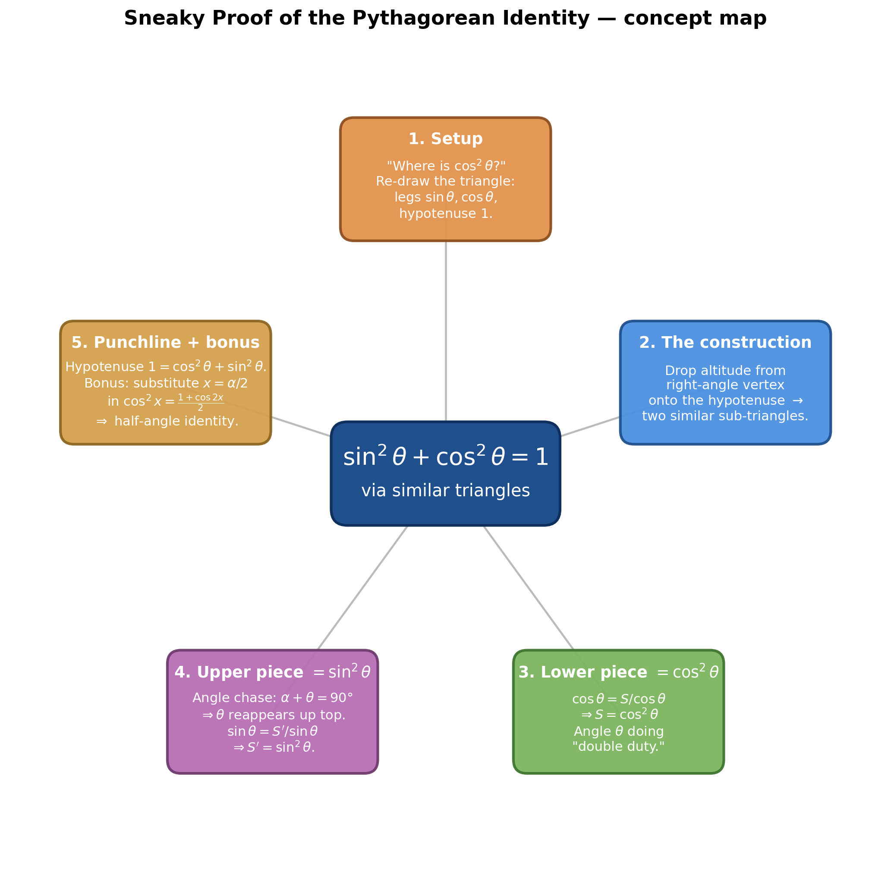
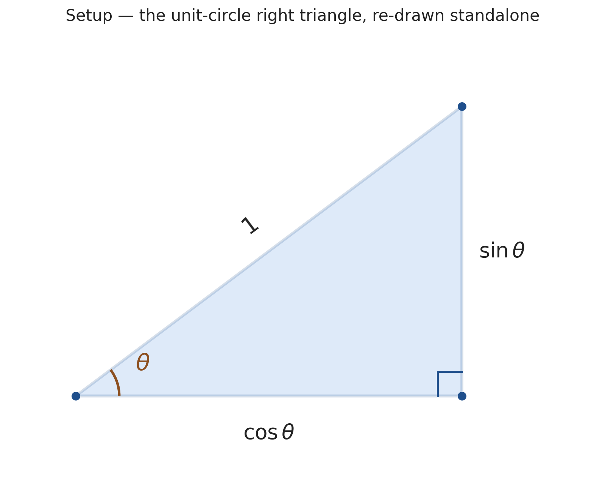
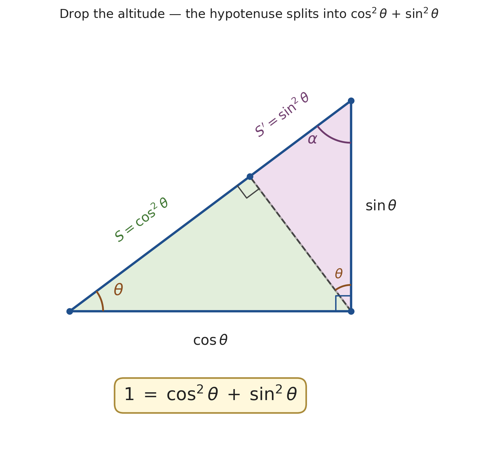
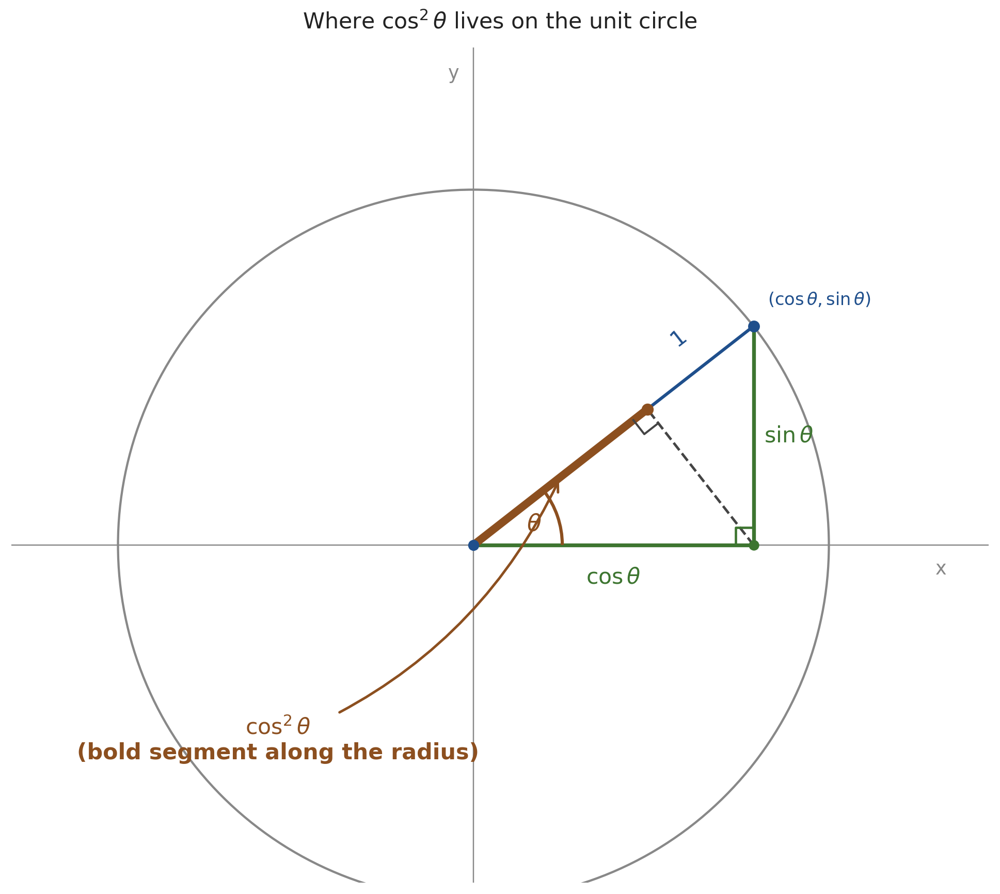

# Sneaky Proof of the Pythagorean Identity — $\sin^2\theta + \cos^2\theta = 1$

*Path C single-source note — extracted from 3Blue1Brown's "Lockdown math ep. 3" via Gemini frame-by-frame analysis (1:05:14–1:12:41). Topics regrouped textbook-style; every timestamp is a clickable deep-link.*

| Field | Value |
|---|---|
| **Source** | [Lockdown math ep. 3](https://www.youtube.com/watch?v=yBw67Fb31Cs) |
| **Speaker** | Grant Sanderson (3Blue1Brown) |
| **Section** | "The Most Exciting Part of the Lecture" — 1:05:14 → 1:12:41 |
| **Topic** | Geometric proof of $\sin^2\theta + \cos^2\theta = 1$ using similar triangles; half-angle identity as bonus |
| **Captured** | 2026-05-13 |

> [!info] One diagram, the whole identity
> Grant Sanderson's "most exciting part of the lecture" is a proof of $\sin^2\theta + \cos^2\theta = 1$ that uses **only the definitions of $\sin$ and $\cos$ as side ratios in a right triangle** — never invoking the Pythagorean theorem or the equation $x^2 + y^2 = 1$ for the unit circle. One construction (drop the altitude from the right-angle vertex to the hypotenuse) splits the hypotenuse of length 1 into two segments whose lengths turn out to be $\cos^2\theta$ and $\sin^2\theta$. Add them: you get 1. That's the entire proof.

---

## 1. The Setup

### 1.1 The motivating questions *(introduced at [[1:05:14]](https://www.youtube.com/watch?v=yBw67Fb31Cs&t=3914s))*

The segment opens with two questions written at the top of Grant's notepad:

> **Where is $\tan\theta$? Where is $\cos^2\theta$?**

A split-screen animation alongside shows a unit circle in the first quadrant (yellow dot on the circumference, red segment of length $\cos\theta$ on the x-axis, and a semi-transparent purple square of side $\cos\theta$ visualizing $\cos^2\theta$). On the right, the graph of $\cos\theta$ is being traced as the angle sweeps.

The question Grant wants the audience to sit with: *where, on a literal geometric picture, can I point to $\cos^2\theta$?*

### 1.2 Re-drawing the triangle, larger and standalone *(at [[1:05:19]](https://www.youtube.com/watch?v=yBw67Fb31Cs&t=3919s))*

Rather than continue on the cluttered unit-circle sketch, Grant builds a fresh, large right triangle:

> "Let me go ahead and draw a much bigger triangle for ourselves." *(at [[1:05:19]](https://www.youtube.com/watch?v=yBw67Fb31Cs&t=3919s))*

Construction (timestamps from the video):
1. **[[1:05:24]](https://www.youtube.com/watch?v=yBw67Fb31Cs&t=3924s)** — Hypotenuse drawn as a diagonal.
2. **[[1:05:29]](https://www.youtube.com/watch?v=yBw67Fb31Cs&t=3929s)** — Vertical leg drawn on the right.
3. **[[1:05:32]](https://www.youtube.com/watch?v=yBw67Fb31Cs&t=3932s)** — Horizontal leg drawn along the bottom, closing the triangle.
4. **[[1:05:38]](https://www.youtube.com/watch?v=yBw67Fb31Cs&t=3938s)** — Right-angle square in the bottom-right.
5. **[[1:05:40]](https://www.youtube.com/watch?v=yBw67Fb31Cs&t=3940s)** — Angle $\theta$ at the bottom-left, marked with a small arc.
6. **[[1:05:53]](https://www.youtube.com/watch?v=yBw67Fb31Cs&t=3953s)** — Vertical leg labeled $\sin\theta$.
7. **[[1:05:57]](https://www.youtube.com/watch?v=yBw67Fb31Cs&t=3957s)** — Horizontal leg labeled $\cos\theta$.

The hypotenuse is unlabeled but implicitly of length $1$ — this is the unit-circle triangle, just enlarged.

*Generated by matplotlib via `_gen_spt_fig1_setup.py` — the unit-circle right triangle as Grant re-draws it: legs $\sin\theta$ (vertical) and $\cos\theta$ (horizontal), hypotenuse 1, angle $\theta$ at the bottom-left.*

> [!tip] The hook
> > "This by the way, I think is the most exciting part of the lecture. So if there was just one thing that you were going to stick around for, I would say that this is the thing that you should... Because it gives a very sneaky proof of the Pythagorean theorem." *(at [[1:05:34]](https://www.youtube.com/watch?v=yBw67Fb31Cs&t=3934s))*

---

## 2. The Sneaky Proof of $\sin^2\theta + \cos^2\theta = 1$

This section is the centerpiece. Grant proves the identity using **only** the definitions $\sin\theta = \text{opp}/\text{hyp}$ and $\cos\theta = \text{adj}/\text{hyp}$ — applied **twice** to a single clever construction.

### 2.1 The key construction: altitude to the hypotenuse *(at [[1:06:25]](https://www.youtube.com/watch?v=yBw67Fb31Cs&t=3985s))*

From the right-angle vertex (where $\sin\theta$ and $\cos\theta$ meet), Grant drops a perpendicular onto the hypotenuse. This splits the original triangle into two smaller right triangles — both similar to the original, since they share angle $\theta$ (lower-left) and have a right angle (the new foot of the perpendicular, marked with a small square).

*Generated by matplotlib via `_gen_spt_fig2_proof.py` — the same triangle with the altitude (dashed) dropped to the hypotenuse, splitting it into two similar sub-triangles. The lower segment of the hypotenuse is labeled $s$ (later $= \cos^2\theta$), the upper segment $s'$ (later $= \sin^2\theta$).*

### 2.2 The shadow-casting intuition *(at [[1:06:04]](https://www.youtube.com/watch?v=yBw67Fb31Cs&t=3964s))*

Grant frames the construction with a vivid mental picture:

> "The example we had earlier was this leaning tower thing where we kind of imagined casting a shadow from a leaning tower onto the ground. This is sort of going to flip it on its head and say, well, this angle theta between them, who's to say who's the tower and who's the ground? What if I wanted to have a light source over here and I wanted to cast a shadow from the ground onto the tower?" *(at [[1:06:13]](https://www.youtube.com/watch?v=yBw67Fb31Cs&t=3973s))*

> "That way my angle theta is going to do double duty for me." *(at [[1:06:30]](https://www.youtube.com/watch?v=yBw67Fb31Cs&t=3990s))*

The angle $\theta$ is going to be reused — applied first to one sub-triangle (giving the cosine-shadow), then to the other (giving the sine-shadow).

### 2.3 Computing the lower segment: $S = \cos^2\theta$ *(at [[1:07:10]](https://www.youtube.com/watch?v=yBw67Fb31Cs&t=4030s))*

Focus on the **lower-left sub-triangle**. Its angle at the bottom-left is still $\theta$. Its hypotenuse is the side previously labeled $\cos\theta$ in the big triangle. Call the **adjacent side** (the segment of the big hypotenuse from the corner to the foot of the altitude) $S$.

> [!example] Worked: solving for the lower segment $S$ *(at [[1:07:10]](https://www.youtube.com/watch?v=yBw67Fb31Cs&t=4030s))*
> **Problem.** In the lower-left sub-triangle, the angle is $\theta$ and the hypotenuse has length $\cos\theta$. What is the length of the segment $S$ adjacent to $\theta$?
> **Setup.** Apply $\cos\theta = \dfrac{\text{adjacent}}{\text{hypotenuse}}$ to the sub-triangle.
> **Solution.**
> 1. Definition: $\cos\theta = \dfrac{S}{\cos\theta}$ *(at [[1:07:17]](https://www.youtube.com/watch?v=yBw67Fb31Cs&t=4037s))*
> 2. Multiply both sides by $\cos\theta$: $\cos\theta \cdot \cos\theta = S$
> 3. Therefore $S = \cos^2\theta$. *(at [[1:07:23]](https://www.youtube.com/watch?v=yBw67Fb31Cs&t=4043s))*
>
> **Answer.** $\boxed{S = \cos^2\theta}$
> **Insight.** The same letter $\theta$ does "double duty" — once as the angle of the original triangle, and once as the angle of a sub-triangle whose hypotenuse is itself $\cos\theta$. Applying the cosine definition to that sub-triangle produces $\cos\theta \cdot \cos\theta = \cos^2\theta$.

Grant boxes the result and re-labels the segment in green pen: $s = \cos^2\theta$ *(at [[1:07:31]](https://www.youtube.com/watch?v=yBw67Fb31Cs&t=4051s))*.

### 2.4 The angle chase: why $\theta$ reappears in the upper sub-triangle *(at [[1:08:17]](https://www.youtube.com/watch?v=yBw67Fb31Cs&t=4097s))*

To repeat the trick on the upper sub-triangle, we first need to know its angles. Call the top angle of the original big triangle $\alpha$.

**Angle sum in the big triangle:**
$$\alpha + \theta + 90° = 180° \quad\Longrightarrow\quad \alpha + \theta = 90°$$

*(written on screen at [[1:08:21]](https://www.youtube.com/watch?v=yBw67Fb31Cs&t=4101s), using $\pi$ for $180°$ and $\pi/2$ for $90°$)*

**Angle sum in the upper-right sub-triangle:** This sub-triangle has angles $\alpha$ (at the top, shared with the big triangle), $90°$ (at the foot of the altitude), and an unknown angle at the bottom. Their sum must also be $180°$, so the unknown angle equals $180° - \alpha - 90° = 90° - \alpha = \theta$.

So **$\theta$ reappears at the top of the upper sub-triangle** — exactly where it needs to for the cosine/sine trick to repeat.

### 2.5 Computing the upper segment: $S' = \sin^2\theta$ *(at [[1:09:05]](https://www.youtube.com/watch?v=yBw67Fb31Cs&t=4145s))*

Now focus on the **upper-right sub-triangle**. Its angle (just established) is $\theta$. Its hypotenuse is the side previously labeled $\sin\theta$ in the big triangle. Call the **opposite** side (the upper segment of the big hypotenuse) $S'$.

> [!example] Worked: solving for the upper segment $S'$ *(at [[1:09:05]](https://www.youtube.com/watch?v=yBw67Fb31Cs&t=4145s))*
> **Problem.** In the upper sub-triangle, the angle is $\theta$ and the hypotenuse has length $\sin\theta$. What is the length of the segment $S'$ opposite $\theta$?
> **Setup.** Apply $\sin\theta = \dfrac{\text{opposite}}{\text{hypotenuse}}$ to the sub-triangle.
> **Solution.**
> 1. Definition: $\sin\theta = \dfrac{S'}{\sin\theta}$ *(at [[1:09:14]](https://www.youtube.com/watch?v=yBw67Fb31Cs&t=4154s))*
> 2. Multiply both sides by $\sin\theta$: $\sin\theta \cdot \sin\theta = S'$
> 3. Therefore $S' = \sin^2\theta$. *(at [[1:09:28]](https://www.youtube.com/watch?v=yBw67Fb31Cs&t=4168s))*
>
> **Answer.** $\boxed{S' = \sin^2\theta}$
> **Insight.** Mirror image of §2.3 — same "double duty" trick, this time with sine. The sub-triangle's hypotenuse is $\sin\theta$, the opposite leg becomes $\sin\theta \cdot \sin\theta = \sin^2\theta$.

### 2.6 The punchline *(at [[1:09:36]](https://www.youtube.com/watch?v=yBw67Fb31Cs&t=4176s))*

The hypotenuse of the original big triangle has length $1$ (by construction — that's how we set it up). The altitude split it into the two segments $S$ and $S'$. So:

$$1 = \underbrace{S}_{\cos^2\theta} + \underbrace{S'}_{\sin^2\theta} \;\Longrightarrow\; \boxed{\cos^2\theta + \sin^2\theta = 1}$$

> "So that's kind of cool. The side length which was by definition one, because we've always been rescaling our triangle such that the hypotenuse is one, can be broken down into one part that's cosine squared, and another part that's sine squared. And the way to break that down is to just draw a single line: the perpendicular projection from our corner point onto the hypotenuse." *(at [[1:09:37]](https://www.youtube.com/watch?v=yBw67Fb31Cs&t=4177s))*

### 2.7 Why this proof is NOT circular *(at [[1:07:36]](https://www.youtube.com/watch?v=yBw67Fb31Cs&t=4056s))*

A natural objection: "Doesn't this implicitly use the Pythagorean theorem somewhere?" Grant heads it off:

> "Let me emphasize. This is **not** using the Pythagorean theorem in any way. This is **not** having the cosine squared arrive because we were assuming that this sits on a circle where $x^2 + y^2 = 1$. We're just using the definition of cosine twice to cast one shadow and then to cast another." *(at [[1:07:37]](https://www.youtube.com/watch?v=yBw67Fb31Cs&t=4057s))*

What the proof *actually* relies on:
- The triangle-angle-sum theorem (angles of a triangle add to $180°$) — used in §2.4 for the angle chase.
- The definitions $\sin\theta = \text{opp}/\text{hyp}$ and $\cos\theta = \text{adj}/\text{hyp}$ in a right triangle.
- The fact that a segment can be split into two parts whose lengths add to the whole.

None of these assume Pythagoras. So the identity $\sin^2\theta + \cos^2\theta = 1$ comes out as a *theorem about right triangles*, not a *consequence of unit-circle algebra*.

---

## 3. Where $\cos^2\theta$ lives on the unit circle

### 3.1 A clean re-drawing *(at [[1:10:01]](https://www.youtube.com/watch?v=yBw67Fb31Cs&t=4201s))*

Grant covers the busy notepad with fresh graph paper and re-draws the construction inside a literal unit circle: $x$- and $y$-axes, unit circle centered at the origin, a point on the circle in the first quadrant, the radius (length 1) drawn to that point, vertical drop to the x-axis (length $\sin\theta$), horizontal leg along the x-axis (length $\cos\theta$), and finally the altitude from the right-angle vertex to the hypotenuse.

The segment of the hypotenuse (the radius) from the origin to the foot of the altitude has length $\cos^2\theta$ — and now it's anchored to the same picture students already use to define sine and cosine.

*Generated by matplotlib via `_gen_spt_fig3_unit_circle.py` — the same construction, this time inside a unit circle. The bold segment on the radius (from the origin to the foot of the altitude) has length $\cos^2\theta$.*

### 3.2 Answering the opening question

The questions that opened the segment were "Where is $\tan\theta$? Where is $\cos^2\theta$?" The proof above gives a concrete answer for $\cos^2\theta$: it's not a separate quantity floating in algebra-land — it's a specific *length* visible on the unit-circle diagram, namely the **projection of the radius onto itself** after a perpendicular split.

---

## 4. From the discovered identity to the half-angle formula

### 4.1 The earlier discovery *(at [[1:11:13]](https://www.youtube.com/watch?v=yBw67Fb31Cs&t=4273s))*

Earlier in the lecture (before this segment), Grant had observed graphically — by squishing curves around in Desmos — that:

$$\cos^2 x = \frac{1 + \cos 2x}{2}$$

> "[This is] a very non-trivial identity." *(at [[1:11:18]](https://www.youtube.com/watch?v=yBw67Fb31Cs&t=4278s))*

> "It was found simply by playing around with graphs at the very beginning." *(at [[1:11:13]](https://www.youtube.com/watch?v=yBw67Fb31Cs&t=4273s))*

### 4.2 Re-expressing via substitution *(at [[1:11:30]](https://www.youtube.com/watch?v=yBw67Fb31Cs&t=4290s))*

In blue pen, Grant relabels the variables. Substitute $x = \alpha/2$:

| Old variable | New variable |
|---|---|
| $x$ | $\alpha/2$ |
| $2x$ | $2 \cdot \alpha/2 = \alpha$ |

Substituting into $\cos^2 x = \frac{1 + \cos 2x}{2}$:

$$\cos^2(\alpha/2) = \frac{1 + \cos\alpha}{2}$$

Take the square root of both sides:

$$\boxed{\cos(\alpha/2) = \sqrt{\frac{1 + \cos\alpha}{2}}}$$

This is the **standard textbook half-angle identity** *(at [[1:11:45]](https://www.youtube.com/watch?v=yBw67Fb31Cs&t=4305s))*.

### 4.3 The "delightful" conclusion *(at [[1:12:21]](https://www.youtube.com/watch?v=yBw67Fb31Cs&t=4341s))*

Grant's pedagogical punchline:

> "I for one, have such trouble memorizing the trig identities, and I always would just sort of re-derive them on the fly. The easiest way to re-derive this specific identity is to practice kind of smushing around graphs in your head when you have the one key insight, which is that squaring cosine gets you a smaller cosine graph." *(at [[1:11:54]](https://www.youtube.com/watch?v=yBw67Fb31Cs&t=4314s))*

> "And I just think **it's delightful that before you even know any trigonometry, simply hopping over to something like Desmos and being a little bit playful... that lands you on a highly non-trivial fact.**" *(at [[1:12:21]](https://www.youtube.com/watch?v=yBw67Fb31Cs&t=4341s))*

> [!tip] The pedagogical thesis
> Two non-trivial truths — the Pythagorean identity and the half-angle formula — both fell out of *play*, not memorization:
> - The Pythagorean identity came from staring at a triangle and asking "where is $\cos^2\theta$?"
> - The half-angle formula came from squishing curves around in Desmos.
>
> In both cases the algebra arrived **after** the picture. Grant's claim: that's the right order to learn trigonometry in.

---

## Key takeaways

- **One construction, two cosine/sine applications, the whole identity.** Drop the altitude from the right-angle vertex of a $\sin\theta$/$\cos\theta$/1 triangle onto the hypotenuse. The two resulting segments are $\cos^2\theta$ and $\sin^2\theta$ — their sum is the hypotenuse, which is 1.
- **The proof is non-circular.** It uses only the right-triangle definitions of $\sin$ and $\cos$, plus the angle-sum theorem — never the Pythagorean theorem or the unit-circle equation $x^2 + y^2 = 1$.
- **"Double duty" of the angle $\theta$.** The angle $\theta$ appears once in the original triangle and (by angle chase) reappears in the upper sub-triangle. That repetition is what makes the same letter $\theta$ apply twice in the derivation.
- **$\cos^2\theta$ is a length you can point to.** On the unit circle, it's the segment from the origin to the foot of the altitude dropped from the radius's endpoint.
- **Half-angle identity = relabeled "playful" discovery.** $\cos(\alpha/2) = \sqrt{(1 + \cos\alpha)/2}$ is just $\cos^2 x = (1+\cos 2x)/2$ with $x = \alpha/2$.

---

### Sources

| Source | Section | Type |
|---|---|---|
| [Lockdown math ep. 3](https://www.youtube.com/watch?v=yBw67Fb31Cs) | 1:05:14 → 1:12:41 | YouTube — 3Blue1Brown |
