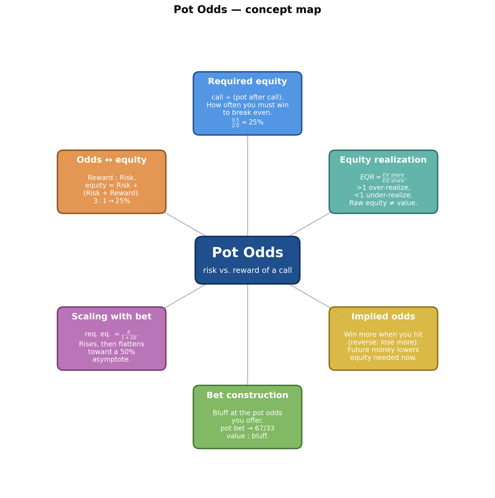
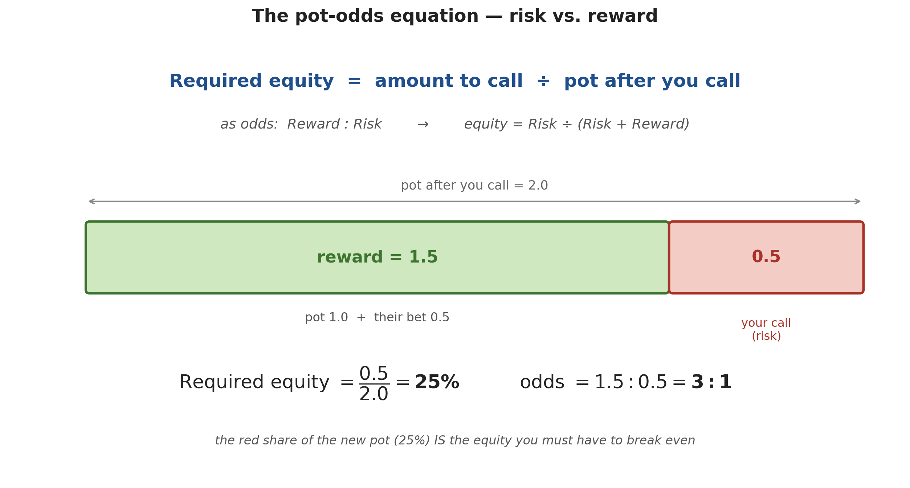
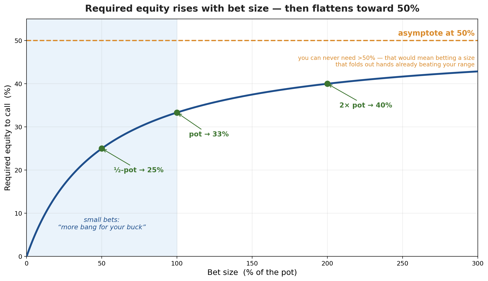
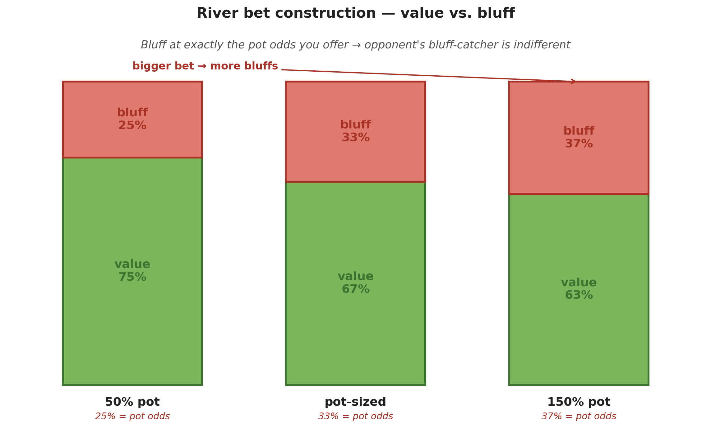
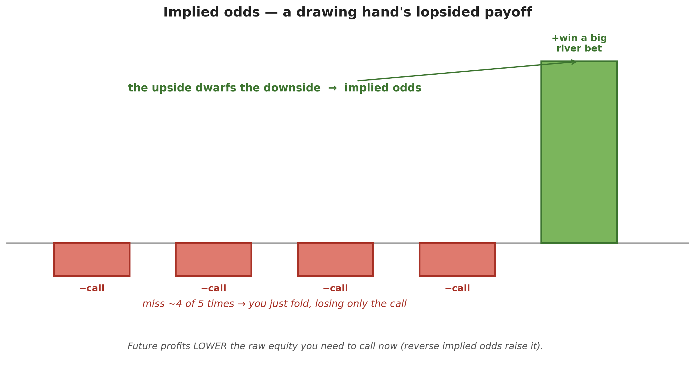
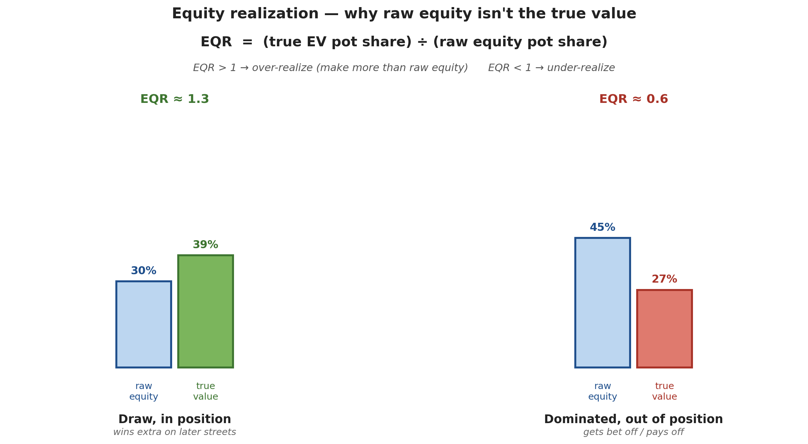

# Pot Odds

*Path C single-source note — extracted from the GTO Wizard video "POT ODDS" (00:00–20:15) via Gemini frame-by-frame analysis. Regrouped textbook-style; every timestamp is a clickable deep-link. The "why it works" section (§10) is added — it derives the formulas the video uses, including the symmetry that the required calling equity and the optimal bluff frequency are the same number.*

| Field | Value |
|---|---|
| **Source** | [POT ODDS](https://www.youtube.com/watch?v=AcLnvm5nTaw) |
| **Length** | 20:15 |
| **Channel** | GTO Wizard |
| **Topic** | Pot odds as applied probability / expected value: the required-equity formula, odds↔% conversion, scaling with bet size, value:bluff construction, implied odds, and equity realization |
| **Captured** | 2026-06-04 |
| **Related** | [[The Course (Main)\|Poker — The Course]] (vault) |

> [!info] The hook
> The video opens by daring you to call **46 × 68**-style math at the table: *"can you tell me how much equity you need to call?"* The single idea underneath everything is a risk/reward ratio — **how often must I win to break even when I put chips in?** The first half builds the exact formula; the second half shows why that formula *alone* is a trap, and what "true equity" really means.

---

## 1. What are pot odds? *(at [[0:24]](https://www.youtube.com/watch?v=AcLnvm5nTaw&t=24s))*

> [!definition] Pot odds
> **Pot odds** = how often you need to win to break even when calling a bet. The call risks chips to win the chips already in the middle, so it is fundamentally a **risk vs. reward** calculation *(at [[0:30]](https://www.youtube.com/watch?v=AcLnvm5nTaw&t=30s))*.
> The goal of a call: *"recover at least as much value as we called, on average"* *(at [[0:37]](https://www.youtube.com/watch?v=AcLnvm5nTaw&t=37s))*.

> [!example] Warm-up quiz — BTN bets 3 into 5.5 *(at [[0:50]](https://www.youtube.com/watch?v=AcLnvm5nTaw&t=50s))*
> **Problem.** On A♠ 8♥ 7♣, the pot is 5.5 and the Button bets 3. What are your pot odds?
> **Solution.** You must win back at least your call (3 chips). The pot *after* you call is $5.5 + 3 + 3 = 11.5$. So $3 / 11.5 \approx 26\%$.
> **Answer.** **26%** — you need to win ≥ 26% of the time to break even.

---

## 2. The pot-odds equation *(at [[1:37]](https://www.youtube.com/watch?v=AcLnvm5nTaw&t=97s))*

> [!tip] The formula
> $$\text{Required Equity} = \frac{\text{amount to call}}{\text{pot after you call}}$$
> **Equity** is just *"how often you'll win"* *(at [[1:43]](https://www.youtube.com/watch?v=AcLnvm5nTaw&t=103s))*. The same thing can be written as **odds** — a $\text{Reward} : \text{Risk}$ ratio — and converted back with $\text{equity} = \dfrac{\text{Risk}}{\text{Risk} + \text{Reward}}$ *(at [[2:47]](https://www.youtube.com/watch?v=AcLnvm5nTaw&t=167s))*.

*Generated by matplotlib via `_gen_po_fig1_required_equity.py` — facing a half-pot bet you call 0.5 into a new pot of 2.0, so the red (risk) share is $0.5/2.0 = 25\%$ = the equity you need; as odds that is $1.5 : 0.5 = 3:1$.*

> [!example] Convert 3 : 1 to equity *(at [[2:21]](https://www.youtube.com/watch?v=AcLnvm5nTaw&t=141s))*
> **Problem.** A half-pot bet gives $\text{Reward} : \text{Risk} = 1.5 : 0.5 = 3:1$. How much equity do you need?
> **Solution.** $\dfrac{1}{1+3} = 25\%$.
> **Answer.** **25%.**

> [!warning] The most common mistake *(at [[2:41]](https://www.youtube.com/watch?v=AcLnvm5nTaw&t=161s))*
> $3:1$ is **not** $1/3 = 33\%$. It is $1 / (1 + 3) = 25\%$ — you divide the risk by the *total* of risk **plus** reward.

> [!note] Reference table — bet size → price *(at [[3:00]](https://www.youtube.com/watch?v=AcLnvm5nTaw&t=180s))*
>
> | Bet size (% pot) | Pot odds | Required equity |
> |---|---|---|
> | 33% | 4.0 : 1 | 19.9% |
> | 50% | 3.0 : 1 | 25.0% |
> | 75% | 2.3 : 1 | 30.0% |
> | 100% (pot) | 2.0 : 1 | 33.3% |
> | 150% | 1.7 : 1 | 37.5% |
> | 200% | 1.5 : 1 | 40.0% |
>
> *"Odds are better for comparing risk-reward; equity is better for calculating how often you need to win."* *(at [[3:04]](https://www.youtube.com/watch?v=AcLnvm5nTaw&t=184s))*

---

## 3. Required equity scales with bet size *(at [[3:27]](https://www.youtube.com/watch?v=AcLnvm5nTaw&t=207s))*

> [!tip] The shape of the curve
> Plotting required equity against bet size gives a curve that rises steeply for small bets, then **flattens toward a 50% asymptote** *(at [[3:53]](https://www.youtube.com/watch?v=AcLnvm5nTaw&t=233s))*. You can never need more than 50%, because a bet that forces a hand *already beating your range* to fold can't exist in equilibrium.

*Generated by matplotlib via `_gen_po_fig2_betsize_curve.py` — required equity $=\frac{b}{1+2b}$ (with $b$ = bet ÷ pot). Marked: ½-pot → 25%, pot → 33%, 2× pot → 40%, asymptote 50%.*

> [!note] Why small bets dominate theory *(at [[4:05]](https://www.youtube.com/watch?v=AcLnvm5nTaw&t=245s))*
> The curve is steepest below a pot-sized bet, so a small bet *"raises the equity your opponent needs to call while donating fewer chips to the pot"* — more pressure per chip risked.

---

## 4. Worked example — facing a raise *(at [[4:30]](https://www.youtube.com/watch?v=AcLnvm5nTaw&t=270s))*

> [!example] BTN bets 3, BB shoves 18 *(at [[4:33]](https://www.youtube.com/watch?v=AcLnvm5nTaw&t=273s))*
> **Problem.** Pot is 5.5. The Button bets 3; the Big Blind shoves to **18 total**. How much equity does the Button need to call?
> **Solution.**
> - Amount to call: BB made it 18, BTN already has 3 in, so BTN calls **15 more**.
> - Pot after the call: $18 + 18 + 5.5 = 41.5$.
> - Required equity: $15 / 41.5 \approx 36\%$.
> **Answer.** **36%** *(at [[4:58]](https://www.youtube.com/watch?v=AcLnvm5nTaw&t=298s))*.

> [!example] Does the hand have it? The 2-4 rule *(at [[5:16]](https://www.youtube.com/watch?v=AcLnvm5nTaw&t=316s))*
> **Setup.** BTN holds K♣Q♣ (nut flush draw) on A♦8♣7♣ vs. top pair.
> **Solution.** A flush draw has **9 outs**. With two cards to come, estimate equity by $\text{outs} \times 4$: $9 \times 4 = 36\%$ *(at [[5:37]](https://www.youtube.com/watch?v=AcLnvm5nTaw&t=337s))*.
> **Answer.** $36\% \ge 36\%$, and any BB bluffs add more — so the Button **calls**. *(Rule of thumb: $\times 4$ with two cards to come, $\times 2$ with one.)*

---

## 5. Bet construction — value vs. bluff *(at [[5:58]](https://www.youtube.com/watch?v=AcLnvm5nTaw&t=358s))*

> [!tip] Bet size sets your bluffing frequency
> On the river with a polarized range, **bluff at exactly the pot odds you're offering** *(at [[6:42]](https://www.youtube.com/watch?v=AcLnvm5nTaw&t=402s))*. A pot-sized bet gives the caller 33% odds, so bluff **one-third** of the time. This makes their bluff-catcher *indifferent* between calling and folding *(at [[6:50]](https://www.youtube.com/watch?v=AcLnvm5nTaw&t=410s))*. **Small bets → fewer bluffs; large bets → more bluffs.**

*Generated by matplotlib via `_gen_po_fig3_value_bluff.py` — value:bluff splits of 75/25 (½-pot), 67/33 (pot), 63/37 (150%). The bluff share always equals the pot odds offered.*

> [!note] Only on the river *(at [[7:10]](https://www.youtube.com/watch?v=AcLnvm5nTaw&t=430s))*
> This exact correspondence holds on the **river**. On the flop and turn you can bluff *more* often, because of **leverage** *(at [[7:23]](https://www.youtube.com/watch?v=AcLnvm5nTaw&t=443s))* — the threat of future bets.

---

## 6. The preflop paradox — "everything calls?!" *(at [[7:30]](https://www.youtube.com/watch?v=AcLnvm5nTaw&t=450s))*

> [!example] BB facing a 2.5bb open *(at [[7:42]](https://www.youtube.com/watch?v=AcLnvm5nTaw&t=462s))*
> **Setup.** Pot is 1.5bb (the blinds). The Button opens to 2.5bb; it folds to the Big Blind.
> **Pot odds.** BB calls 1.5 into a final pot of $1.5 + 2.5 + 1.5 = 5.5$, so required equity $= 1.5/5.5 = 27\%$.
> **The trap.** Against the Button's opening range, *every* hand — even **7♦2♥** (~30% raw equity) — clears the 27% bar *(at [[8:03]](https://www.youtube.com/watch?v=AcLnvm5nTaw&t=483s))*. By raw equity alone, *everything calls.*
> **Reality.** The solver shows 7♦2♥ is a losing call: $EV_{\text{call}} = -0.49$ vs. $EV_{\text{fold}} = 0$ *(at [[8:20]](https://www.youtube.com/watch?v=AcLnvm5nTaw&t=500s))*.

> [!note] Why you don't have to "deny odds" preflop *(at [[8:47]](https://www.youtube.com/watch?v=AcLnvm5nTaw&t=527s))*
> Players once opened to 3.5–4× to deny the BB direct odds. Solvers showed it's unnecessary: *"you don't have to lay the right odds this street, because if they call too wide, you can punish them on later streets."* Raw equity ignores what happens after the flop.

---

## 7. When raw equity lies — implied odds *(at [[8:57]](https://www.youtube.com/watch?v=AcLnvm5nTaw&t=537s))*

> [!warning] The flaw in raw equity *(at [[9:10]](https://www.youtube.com/watch?v=AcLnvm5nTaw&t=550s))*
> *"Raw equity doesn't correctly predict value when future bets can occur."* Equity only measures how often a hand wins **if it's checked down** — it ignores future streets where you get bet off your hand or win extra.

> [!definition] Implied & reverse-implied odds *(at [[10:30]](https://www.youtube.com/watch?v=AcLnvm5nTaw&t=630s))*
> - **Implied odds** — extra money you expect to **win** on later streets when you complete your draw.
> - **Reverse implied odds** — extra money you expect to **lose** when you complete but are still beaten (e.g. make a flush, lose to a bigger one) *(at [[10:38]](https://www.youtube.com/watch?v=AcLnvm5nTaw&t=638s))*.
> Future profits **lower** the raw equity you need to call now *(at [[11:06]](https://www.youtube.com/watch?v=AcLnvm5nTaw&t=666s))*.

*Generated by matplotlib via `_gen_po_fig5_implied_odds.py` — a flush draw misses most of the time (you fold, losing only the call) but the times it hits you win a big river bet. That asymmetry is implied odds.*

---

## 8. Equity realization (EQR) *(at [[11:48]](https://www.youtube.com/watch?v=AcLnvm5nTaw&t=708s))*

> [!definition] Equity realization
> Your **true equity** is the actual pot share you expect to win given all postflop play. **EQR** is the factor linking raw equity to real value *(at [[11:57]](https://www.youtube.com/watch?v=AcLnvm5nTaw&t=717s))*:
> $$\text{Equity} \times \text{EQR} \times \text{Pot} = \text{EV} \qquad\Longrightarrow\qquad \text{EQR} = \frac{\text{EV pot share}}{\text{EQ pot share}}$$
> - $\text{EQR} > 1$ → **over-realize** (the hand makes *more* than its raw equity).
> - $\text{EQR} < 1$ → **under-realize** *(at [[12:27]](https://www.youtube.com/watch?v=AcLnvm5nTaw&t=747s))*.

*Generated by matplotlib via `_gen_po_fig4_eqr.py` — a draw in position over-realizes (raw 30% → true 39%, EQR ≈ 1.3); a dominated hand out of position under-realizes (raw 45% → true 27%, EQR ≈ 0.6).*

> [!note] What over/under-realizes
> Draws, position, and the betting initiative **over**-realize; dominated hands and out-of-position spots **under**-realize. *"This is handy for learning which hands benefit from building a pot and which would prefer to check it down."* *(at [[12:35]](https://www.youtube.com/watch?v=AcLnvm5nTaw&t=755s))*

---

## 9. Putting it together — a solver walk-through *(at [[12:53]](https://www.youtube.com/watch?v=AcLnvm5nTaw&t=773s))*

**Spot.** CO opens 2.3, BTN 3-bets to 7.5, CO calls. Flop **K♠ 9♥ 6♠**, pot 16.5. The Button (3-bettor, in position) over-realizes across most hands; the Cutoff under-realizes — *"due to the Button's overwhelming positional and equity advantage."* *(at [[13:38]](https://www.youtube.com/watch?v=AcLnvm5nTaw&t=818s))*

> [!example] Raw equity ≠ a call *(at [[15:06]](https://www.youtube.com/watch?v=AcLnvm5nTaw&t=906s))*
> Facing a 33% pot bet you need only ~20% equity, yet:
> - **88** has **39%** equity but **folds** — a set often completes the opponent's flush *(at [[15:37]](https://www.youtube.com/watch?v=AcLnvm5nTaw&t=937s))*.
> - **J♣T♣** has only **25%** equity but **always continues** — it draws to the nuts (great implied odds) *(at [[15:55]](https://www.youtube.com/watch?v=AcLnvm5nTaw&t=955s))*.
> The lesson: *"raw equity isn't the appropriate factor; we want the actual value of our hand."* *(at [[16:40]](https://www.youtube.com/watch?v=AcLnvm5nTaw&t=1000s))*

> [!tip] The river is where pot odds become exact *(at [[17:53]](https://www.youtube.com/watch?v=AcLnvm5nTaw&t=1073s))*
> By the river (run-out K♠9♥6♠ → 2♠ → 8♠, Button shoves pot), the Button's range is fully **polarized** and the Cutoff holds **bluff-catchers** sitting at ~**33% equity** *(at [[17:42]](https://www.youtube.com/watch?v=AcLnvm5nTaw&t=1062s))*. Facing a pot bet they need exactly 33%, and the Button bluffs exactly ⅓ — so calls and folds break even. Pot odds are strongest when ranges are polarized and no betting remains *(at [[18:24]](https://www.youtube.com/watch?v=AcLnvm5nTaw&t=1104s))*.

---

## 10. Why it works (the algebra)

The video teaches the *how*; here is the *why*. Write the bet as a fraction $b$ of the pot (so $\text{pot} = 1$).

> [!definition] The required-equity formula
> You call $b$; the pot after your call is $1 + b + b = 1 + 2b$. Hence
> $$\text{Required equity} = \frac{b}{1+2b}.$$
> As $b \to \infty$, this $\to \tfrac12$ — the **50% asymptote**. Plug in $b=1$ (pot bet) → $\tfrac13$; $b=\tfrac12$ → $\tfrac14$.

> [!definition] Odds ↔ equity
> With $\text{Reward} : \text{Risk}$, the break-even equity is $\dfrac{\text{Risk}}{\text{Risk}+\text{Reward}}$ — the share of the final pot your chips represent. (This is why $3:1 \to \tfrac14$, not $\tfrac13$.)

> [!tip] The hidden symmetry — calling price = bluffing frequency
> A polarized bettor's optimal **bluff fraction** of the betting range is *also* $\dfrac{b}{1+2b}$ — identical to the equity the caller needs.
> $$\underbrace{\frac{b}{1+2b}}_{\text{equity to call}} \;=\; \underbrace{\frac{b}{1+2b}}_{\text{optimal bluff freq}}$$
> A pot bet ($b=1$): both equal $\tfrac13$, giving the $67:33$ value:bluff split. The bettor bluffs at exactly the price they offer, which is precisely what makes the opponent's bluff-catcher **indifferent**.

> [!definition] Equity realization, formally
> Since $\text{Equity}\times\text{EQR}\times\text{Pot} = \text{EV}$, we get $\text{EQR} = \dfrac{\text{EV}}{\text{Equity}\times\text{Pot}}$. The pot-odds test "$\text{equity} \ge \frac{b}{1+2b}$" silently assumes $\text{EQR} = 1$ (a check-down). Real spots multiply equity by EQR first — which is why 7♦2♥ (high raw equity, low EQR out of position) is a fold, while a nut draw (lower equity, EQR > 1) is a call. On the river, with no cards to come, bluff-catchers realize exactly their equity, so the raw formula becomes exact.

---

## Key takeaways

- **The formula:** $\text{Required equity} = \dfrac{\text{amount to call}}{\text{pot after you call}} = \dfrac{b}{1+2b}$.
- **Odds vs. %:** $\text{Reward}:\text{Risk}$, convert via $\text{Risk}/(\text{Risk}+\text{Reward})$ — $3:1$ means **25%**, not 33%.
- **Scaling:** bigger bets demand more equity, rising toward a **50%** ceiling; small bets are the most chip-efficient pressure.
- **Bet construction:** bluff at the pot odds you offer (pot bet → ⅓ bluffs) to make bluff-catchers indifferent — the calling price and the bluff frequency are the *same number*.
- **Raw equity lies:** it assumes a check-down. **Implied odds** and **equity realization (EQR)** give a hand's *true* value — which is why "everything calls" preflop is a trap, and why pot odds only become exact on a polarized river.

---

### Sources

| Source | Section | Type |
|---|---|---|
| [POT ODDS — GTO Wizard](https://www.youtube.com/watch?v=AcLnvm5nTaw) | 00:00 → 20:15 | YouTube |
| [[The Course (Main)\|Poker — The Course]] | related poker notes | Vault |
