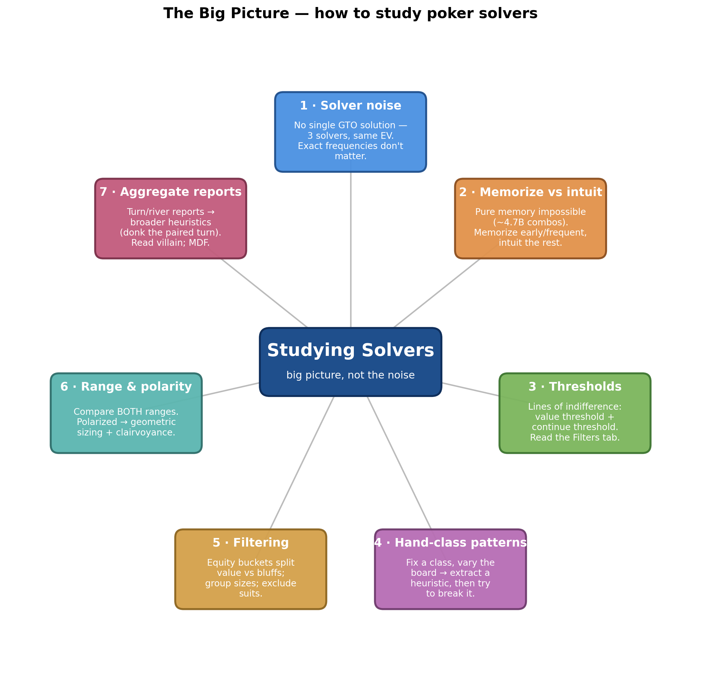
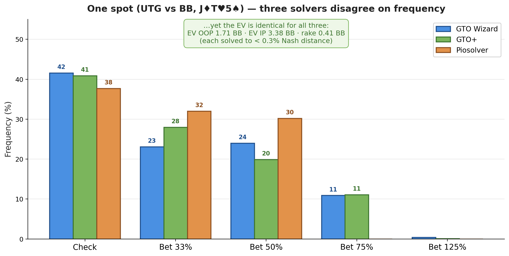
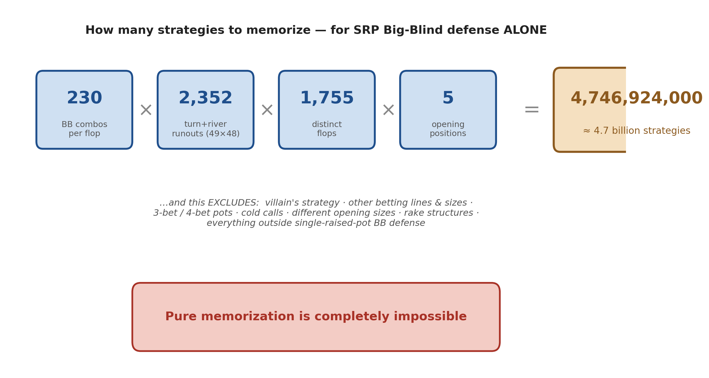
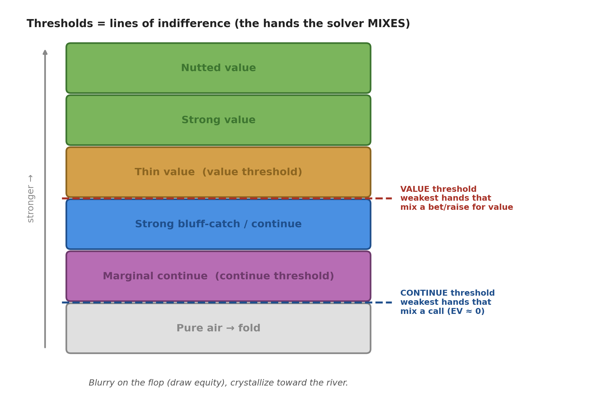
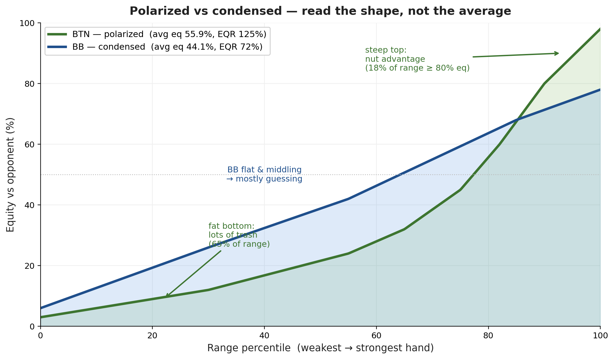
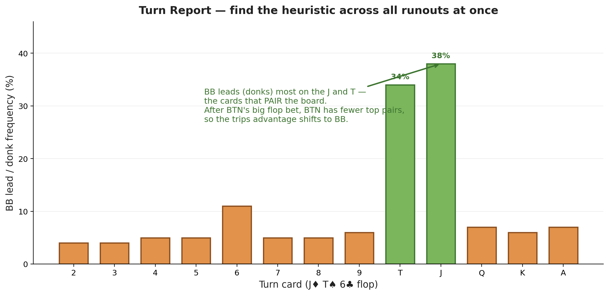

# The Big Picture — How to Study Poker Solvers

*Path C single-source note — extracted from the GTO Wizard video "The Big Picture" via Gemini frame-by-frame analysis (00:00–44:52). The video's material is regrouped textbook-style by topic; every timestamp is a clickable deep-link into the video.*

| Field | Value |
|---|---|
| **Source** | [The Big Picture (GTO Wizard)](https://www.youtube.com/watch?v=Yk4cCUP6bI4) |
| **Length** | 44:52 |
| **Topic** | How to study solvers effectively — chase *overarching strategy and heuristics*, not the exact mixed frequencies ("solver noise") |
| **Captured** | 2026-06-08 |
| **Companions** | [[Equity Fundamentals (Main)\|Equity Fundamentals]] · [[Pot Odds (Main)\|Pot Odds]] (both GTO Wizard) |

> [!abstract] The one idea
> A solver reports *exact* frequencies — "bet 33% pot 23.1% of the time with this combo." Almost none of that is worth memorizing, because **there is no single correct frequency** (different solvers find different strategies with identical EV). What *is* worth studying is the **shape**: where the thresholds are, how ranges are built, how polarity sets bet sizing, and how your opponent must respond. This note walks the seven lenses the video uses to "see the forest through the trees."

---

## 1. The Big Picture: why solver "noise" doesn't matter

### 1.1 The thesis *(at [[0:37]](https://www.youtube.com/watch?v=Yk4cCUP6bI4&t=37s))*

> [!tip] Focus on the forest, not the trees
> Stop asking *"why does this exact suit take this exact action?"* Instead look for:
> - the **strategy pair** (how both ranges interact),
> - the **thresholds** (where value/continue lines fall),
> - **ranges instead of hands**,
> - **villain's response**, and the **exploits** it exposes.
>
> *"We should be looking for broader heuristics — focus on the overarching strategy rather than zoning in on inconsequential noise."* *(at [[0:37]](https://www.youtube.com/watch?v=Yk4cCUP6bI4&t=37s))*

### 1.2 The experiment — one spot, three solvers *(at [[1:25]](https://www.youtube.com/watch?v=Yk4cCUP6bI4&t=85s))*

The same flop is solved by **GTO Wizard, GTO+, and Piosolver**. Because solvers approximate equilibrium by different routes, they land on **different "local maxima"** — three visibly different betting strategies that nonetheless share the **same EV and the same (near-zero) exploitability**.

> [!example] UTG vs BB on J♦ T♥ 5♠ *(at [[3:03]](https://www.youtube.com/watch?v=Yk4cCUP6bI4&t=183s))*
> **Setup.** UTG opens 2.5×, BB calls. Single-raised pot, 5.5 BB, flop **J♦ T♥ 5♠**. Each solution is solved to **< 0.3% Nash distance**.
>
> **The frequencies disagree:**
>
> | Action | GTO Wizard | GTO+ | Piosolver |
> |---|---|---|---|
> | Check | 41.6% | 40.9% | 37.7% |
> | Bet 33% | 23.1% | 28.0% | 32.0% |
> | Bet 50% | 24.0% | 19.9% | 30.2% |
> | Bet 75% | 10.9% | 11.1% | **0.0%** |
> | Bet 125% | 0.4% | 0.1% | 0.0% |
>
> **The value is identical:** EV OOP **1.71 BB**, EV IP **3.38 BB**, rake **0.41 BB** — for all three.
>
> **Answer.** Three different strategies, one EV. **AQo** *(at [[4:49]](https://www.youtube.com/watch?v=Yk4cCUP6bI4&t=289s))* mixes one way in Pio and a totally different way in GTO+ — both correct.
> **Insight.** *"What AQo does here in a vacuum does not matter without the context of its broader strategy."* *(at [[5:21]](https://www.youtube.com/watch?v=Yk4cCUP6bI4&t=321s))*

> [!note] The exploitability math *(at [[2:20]](https://www.youtube.com/watch?v=Yk4cCUP6bI4&t=140s))*
> Against a solution at 0.3% Nash distance, the best possible counter-strategy gains at most $5.5 \times 0.003 = 0.0165$ BB — essentially nothing. So chasing the "perfect" frequency buys you ~$\tfrac{1}{60}$ of a big blind.

*Generated by matplotlib via `_gen_bp_fig1_three_solvers.py` — the action frequencies differ markedly across solvers while EV (OOP/IP/rake) is identical; visual proof that exact frequencies are noise.*

---

## 2. Memorization vs. Intuition

### 2.1 The tradeoff *(at [[5:56]](https://www.youtube.com/watch?v=Yk4cCUP6bI4&t=356s))*

Study sits on a spectrum from **simplicity** (memorization) to **complexity** (intuition):

| | **Memorization** (simple sims) | **Intuition** (complex sims) |
|---|---|---|
| **Pros** | Easier to implement; fewer mistakes; great for multitabling/autopilot; "every strategy is close anyway" | Flexible, stronger exploits; knows how to respond to *any* size; builds theory; less artificial distortion |
| **Cons** | Artificial distortion; rigid; teaches no underlying principles; poor exploits | Impossible to fully memorize; more early blunders; slower payoff; more time lost on noise |

> [!tip] The cleanest line in the video *(at [[7:16]](https://www.youtube.com/watch?v=Yk4cCUP6bI4&t=436s))*
> *"A simple strategy implemented well will invariably outperform a complex strategy implemented poorly."*

> [!note] Artificial distortion *(at [[8:21]](https://www.youtube.com/watch?v=Yk4cCUP6bI4&t=501s))*
> If a simplified sim forbids (say) donk-betting, the solver *exploits its own toy game* — e.g. the IP player checks back more to compensate. You've solved a different game than the one you play.

### 2.2 Pure memorization is impossible *(at [[10:12]](https://www.youtube.com/watch?v=Yk4cCUP6bI4&t=612s))*

> [!example] How many strategies to memorize, just for BB defense? *(at [[10:26]](https://www.youtube.com/watch?v=Yk4cCUP6bI4&t=626s))*
> **Setup.** Count the strategies in *only* single-raised-pot Big-Blind defense:
> - **230** BB combos per flop (tightest formation)
> - $49 \times 48 = 2352$ turn+river runouts per flop
> - **1755** strategically distinct flops
> - **5** opening positions (UTG–SB) vs BB
>
> **Calculation.**
> $$230 \times 2352 \times 1755 \times 5 = 4{,}746{,}924{,}000$$
>
> **Answer.** ~**4.7 billion** things to memorize — and that *excludes* villain's strategy, other lines/sizes, 3-bet/4-bet pots, cold calls, and rake. **"Pure memorization is completely impossible."** *(at [[11:13]](https://www.youtube.com/watch?v=Yk4cCUP6bI4&t=673s))*

*Generated by matplotlib via `_gen_bp_fig2_memorization.py` — the 230 × 2352 × 1755 × 5 ≈ 4.7 billion breakdown for SRP BB defense alone, with the long list of excluded scenarios.*

### 2.3 The hybrid answer *(at [[11:28]](https://www.youtube.com/watch?v=Yk4cCUP6bI4&t=688s))*

> [!tip] Memorize the frequent and early; intuit the rest
> - **Memorize:** exact preflop strategies, flop c-bet heuristics, common betting lines (these recur constantly, especially at stable cash-game stacks).
> - **Intuit:** "further-away" streets (turn/river runouts branch exponentially), patterns, value/continue thresholds, and the opponent's response — your "brain solver."
>
> *"Anyone that says it needs to be one or the other … hasn't considered the tradeoffs. You do need both."* *(at [[12:40]](https://www.youtube.com/watch?v=Yk4cCUP6bI4&t=760s))*

---

## 3. Thresholds: the lines of indifference

### 3.1 What a threshold is *(at [[14:01]](https://www.youtube.com/watch?v=Yk4cCUP6bI4&t=841s))*

> [!definition] Value & continue thresholds
> A **threshold** is a *line of indifference* in your range — the hands the solver **mixes** (so their EV equals the alternative).
> - **Continue threshold** = the **weakest** hands that still mix calls (vs folds). A mixed continue has the same EV as folding (≈ **0**). It marks the **bottom of your range** — sculpt everything upward from there.
> - **Value threshold** = the **weakest** hands that mix a bet/raise *for value*. It tells you what you're representing, which dictates later-street sizing and how many bluffs to add.

> [!tip] The fastest way to improve *(at [[14:43]](https://www.youtube.com/watch?v=Yk4cCUP6bI4&t=883s))*
> *"One of the shortest and easiest ways to improve your poker is simply studying thresholds."* Every time you open a sim, ask: **(1)** which value hands bet/raise here? **(2)** which hands continue vs this size on this board?

*Generated by matplotlib via `_gen_bp_fig3_thresholds.py` — a hand-class spectrum with the value threshold (top) and continue threshold (middle) marked as lines of indifference.*

### 3.2 Reading a threshold in the filters tab *(at [[16:29]](https://www.youtube.com/watch?v=Yk4cCUP6bI4&t=989s))*

> [!tip] Don't read the matrix — read the Filters tab
> *"I use the filters tab constantly when I study. I don't think there's a better tab to be using."* *(at [[16:59]](https://www.youtube.com/watch?v=Yk4cCUP6bI4&t=1019s))* Your eyes go straight to the category bars to find where blue (fold) first appears — that's the threshold.

> [!example] BTN vs BB on Q♠ 9♣ 4♠ — why bottom pair calls but underpairs fold *(at [[17:36]](https://www.youtube.com/watch?v=Yk4cCUP6bI4&t=1056s))*
> **Setup.** 500NL, BTN bets **75% pot (6.9 into 9.2)**, BB to respond. Made-hand continue threshold is **third pair**.
> **Question.** Why does BB always continue a bare **4** (bottom pair) but fold **55–88**?
> **Solution.** **Outs to outdraw value: 5 vs 2.** A 4 has 5 outs to two-pair/trips; an underpair has only 2 outs to a set. Since the bettor's value is mostly top-pair/overpair (sets are just **2.6%** of the betting range), the hand that can *outdraw* that value is worth more than the higher-ranked underpair.
> **Answer.** Continue with the hand that out-draws value, not the nominally "stronger" one.
> **Insight.** Absolute strength < equity *realization* + ability to outdraw the value range.

> [!note] When two hands are interchangeable *(at [[19:35]](https://www.youtube.com/watch?v=Yk4cCUP6bI4&t=1175s))*
> **Q9s (81.6% eq)** vs **Q4s (82.8% eq)** are so close that a human could check/call all Q9s and raise all Q4s and capture the **same EV** — exactly the kind of simplification that's safe to make.

### 3.3 Thresholds crystallize toward the river *(at [[15:55]](https://www.youtube.com/watch?v=Yk4cCUP6bI4&t=955s))*

On the flop, thresholds are **blurry** — the solver mixes calls across many classes because weak made hands carry draw equity. As draw equity dies on later streets, the lines of indifference **sharpen**. So expect crisp thresholds on the river, fuzzy ones on the flop.

---

## 4. Hand-class patterns across boards

### 4.1 The method *(at [[21:53]](https://www.youtube.com/watch?v=Yk4cCUP6bI4&t=1313s))*

> [!tip] Fix the hand class, vary the board
> *"Focus on one hand class and change the boards to extract betting patterns. Look for heuristics — then try to break them."* Comparing the same class across textures surfaces a rule and, crucially, its limits.

> [!example] The vulnerable-underpair semi-bluff pattern *(at [[22:13]](https://www.youtube.com/watch?v=Yk4cCUP6bI4&t=1333s))*
> **Setup.** UTG vs BB, isolating "third pair" underpairs (pairs below the top card). Test across **K♦Q♣2♠**, **A♦Q♣2♠**, **J♦T♣2♠**.
> **Pattern.** The *more vulnerable* (lower) pocket pairs **bet more often** — into a big-bet line they lack equity vs the calling range, so they make the best semi-bluffs (least value to deny, fewest folds blocked).
> **Break it — J♦J♣4♠** *(at [[24:03]](https://www.youtube.com/watch?v=Yk4cCUP6bI4&t=1443s))*. Here the solver bets **very wide with a small size (Bet 1.8 = 51%)** instead of overbetting. With such a wide betting range, marginal value goes straight in — so the underpair-semibluff heuristic dissolves (TT and 55 bet at nearly the same rate).
> **Insight.** A heuristic is only as good as the bet-size regime it lives in. Overbet lines → underpairs semi-bluff; wide small-bet lines → they don't.

---

## 5. Filtering tools — separate value from bluffs

> [!tip] Three filters that collapse a messy strategy *(at [[24:49]](https://www.youtube.com/watch?v=Yk4cCUP6bI4&t=1489s))*
> - **Equity-bucket filters** — isolate **Best/Good** (value) vs **Weak/Trash** (bluffs).
> - **Group similar bet sizes** — e.g. collapse 8 sizes into "Overbet vs Check."
> - **Exclude suits** — hide obvious flush draws to see the rest of the bluff structure.

> [!example] BTN turn on J♦ T♥ 6♣ 2♦ — "overbet or check" *(at [[25:42]](https://www.youtube.com/watch?v=Yk4cCUP6bI4&t=1542s))*
> **Setup.** BTN bet 75% flop, called; turn 2♦. Eight raw actions collapse to **Overbet 52.6% / Check 47.4%**.
> **Filter to value (Best+Good):** the bottom of the overbet value range is **top pair with a kicker above the jack (AJ, KJ, QJ)**. *(at [[25:51]](https://www.youtube.com/watch?v=Yk4cCUP6bI4&t=1551s))*
> **Filter to bluffs (Weak+Trash), exclude diamonds:** the rest are **overcard gutshots and draws** — the bluffs need a real draw once obvious flush draws are removed.
> **Insight.** *"I'm memorizing these patterns"* — value floor + bluff type — *not* the per-combo frequencies.

---

## 6. Comparing ranges & polarity

### 6.1 Always compare *both* ranges *(at [[27:26]](https://www.youtube.com/watch?v=Yk4cCUP6bI4&t=1646s))*

> [!tip] The universal move for "why does this hand…?" *(at [[30:27]](https://www.youtube.com/watch?v=Yk4cCUP6bI4&t=1827s))*
> *"If you're asking anything to do with blockers, or why does this hand prefer this while that hand prefers that, you need to be looking at **both ranges** — particularly villain's response."*

### 6.2 Polarity → geometric sizing *(at [[28:56]](https://www.youtube.com/watch?v=Yk4cCUP6bI4&t=1736s))*

> [!example] BB vs BTN on J♦ T♣ 6♠ 7♣ — read the shape *(at [[27:58]](https://www.youtube.com/watch?v=Yk4cCUP6bI4&t=1678s))*
> **Range comparison (turn):**
>
> | Metric | BB | BTN |
> |---|---|---|
> | Equity | 44.1% | **55.9%** |
> | EQR | 72.4% | **125.1%** |
> | Best hands (80%+ eq) | 4.8% | **18%** |
> | Trash (0–33%) | 54.5% | 64.9% |
> | Overpairs | 0.0% | **14.3%** |
> | Top pair | 15.5% | 28.0% |
>
> **Shape.** BTN is **polarized** — lots of nutted hands *and* lots of trash, few middling. BB is **condensed** — flat, middling-heavy.
> **Consequence.** *"When they're polarized … the strategy is going to be close to **geometric**"* — bet an equal fraction of the pot each street so stacks go in by the river. *(at [[29:15]](https://www.youtube.com/watch?v=Yk4cCUP6bI4&t=1755s))*
> **Why BTN has the overpairs:** BB would have **3-bet** them preflop, so they're absent from BB's flat range; BB in turn has more sets (BTN has no JJ/TT here).
> **Insight.** *"The polarized player is more or less clairvoyant"* — when they overbet, they know if they're ahead; most of BB's range is guessing. *(at [[29:47]](https://www.youtube.com/watch?v=Yk4cCUP6bI4&t=1787s))*

*Generated by matplotlib via `_gen_bp_fig4_polarity_eqgraph.py` — BTN's polarized equity curve (steep top, fat trash tail) vs BB's flat condensed curve; equities 55.9% vs 44.1%, EQR 125% vs 72%.*

---

## 7. Aggregate reports → broader heuristics

### 7.1 Turn Reports: donk-betting when the turn pairs the top card *(at [[32:36]](https://www.youtube.com/watch?v=Yk4cCUP6bI4&t=1956s))*

Rather than studying one runout, the **Reports → Turns** view shows strategy across *all* turn cards at once — perfect for finding heuristics.

> [!example] BTN vs BB on J♦ T♠ 6♣ — why BB donks the J and T *(at [[31:53]](https://www.youtube.com/watch?v=Yk4cCUP6bI4&t=1913s))*
> **Setup.** BTN bets 75% flop, BB calls. After a *large* flop bet, BTN's range is polarized — **fewer** top pairs; BB's condensed calling range has **more**:
> - Top pair: **BTN 12.5%** vs **BB 24.3%** · Second pair: **BTN 10.8%** vs **BB 20.3%**
>
> **Result.** When the turn pairs the top/second card (a **J** or **T**), the **trips advantage shifts to BB** → BB starts **donk-leading** those exact cards (the report's red bars spike on J and T).
> **Confirmed by EV** *(at [[34:52]](https://www.youtube.com/watch?v=Yk4cCUP6bI4&t=2092s))*: BTN's EV is **lowest on the J and T turns (≈ 6.65)** and highest on a blank (**2 ≈ 7.29**). If checked to on a J, BTN checks back **67.9%**.
> **Exploit** *(at [[35:05]](https://www.youtube.com/watch?v=Yk4cCUP6bI4&t=2105s))*: if BTN over-aggresses on J/T turns, BB should *range-check* and spring **check-raises** on them.

*Generated by matplotlib via `_gen_bp_fig5_turn_reports.py` — BB's donk/lead frequency by turn rank, spiking on the J and T (the cards that pair the board and hand BB the trips advantage).*

### 7.2 Read the opponent's response — is it "human"? *(at [[36:33]](https://www.youtube.com/watch?v=Yk4cCUP6bI4&t=2193s))*

> [!tip] Thresholds are exploit-finders *(at [[37:20]](https://www.youtube.com/watch?v=Yk4cCUP6bI4&t=2240s))*
> Don't get lost in the middle of the grid — train your eyes on the **edges** of the continuing range (worst hand that calls, best hand that folds). Then ask: *will a human actually play that way?*

> [!example] BB defending a 175% turn overbet on J♦ T♦ 6♠ 2♥ *(at [[37:43]](https://www.youtube.com/watch?v=Yk4cCUP6bI4&t=2263s))*
> **Thresholds the solver draws:**
> - **KJ+** always continues; **QJ** is right on the edge (near pure fold).
> - **QT** is indifferent *only* with an overcard to the jack; otherwise second pair folds.
> - A bare **6** folds unless it's a flush draw; **bare nut flush draw** is indifferent; weak FDs (**K5♦, K4♦, K3♦**) fold; FD + extra equity (**Q8♦, K9♦**) raises.
>
> **Exploit** *(at [[39:44]](https://www.youtube.com/watch?v=Yk4cCUP6bI4&t=2384s))*: *"Do you think villain is ever folding QJ? Finding calls with QT? No to both."* Humans **over-call** weak top pairs and **over-fold** second pairs vs huge sizes.

### 7.3 River bluff-catchers — frequency, not combos *(at [[40:26]](https://www.youtube.com/watch?v=Yk4cCUP6bI4&t=2426s))*

> [!example] BB vs a 112% all-in on J♠ T♥ 6♠ 2♣ A♠ *(at [[41:08]](https://www.youtube.com/watch?v=Yk4cCUP6bI4&t=2468s))*
> **Setup.** UTG shoves all-in (112% pot, 61.7 into 60). BB overall: **Call 42.4% / Fold 57.6%**.
> **The trap of combos.** Facing a 112% shove you need just over **33%** equity (precisely $\tfrac{1.12}{1+2\times1.12}\approx 34.6\%$). Both **64s** and **A7s** sit at **34.7% equity, EV 0.01** — identical indifferent bluff-catchers, even though a human would snap-fold 64s and call A7s.
> **The noise.** The solver mixes these by *blockers* (65s calls 18.8%, J7s calls 12.5%) — balancing that humans won't punish.
> **Answer.** *"Finding this exact frequency is not important … focus on the overall calling strategy that won't be exploited by over-bluffs or value."* Hit your **overall call % (≈ MDF)**; pure-call some indifferent hands, pure-fold others.

> [!quote] The closing line *(at [[44:32]](https://www.youtube.com/watch?v=Yk4cCUP6bI4&t=2672s))*
> *"Don't worry so much about the inconsequential mixed frequencies with one hand. Focus on the overall strategy."*

---

## Key Takeaways

- **There is no single GTO solution.** Three solvers produce three different strategies at identical EV — so the exact mixed frequency of any one combo is **noise** worth ~$\tfrac{1}{60}$ BB.
- **Pure memorization is mathematically impossible** (~4.7 billion strategies for SRP BB defense alone). Use a **hybrid**: memorize frequent/early spots, intuit later streets and exploits.
- **Thresholds are the highest-leverage study target.** Find the **continue threshold** (bottom of your range) and **value threshold** (what you rep) from the Filters tab; they're blurry on the flop and crystallize by the river.
- **Bet sizing flows from shape, not raw equity.** Polarized ranges → geometric sizing & "clairvoyance"; vulnerable underpairs semi-bluff in overbet lines (but not in wide small-bet lines).
- **Always compare both ranges and read villain's response** — it's the only way to understand blockers and to spot where humans deviate (over-calling weak top pair, over-folding second pair).
- **Aggregate reports reveal heuristics** a single runout hides (e.g. donk-leading turns that pair the board).
- **On the river, chase overall calling frequency (MDF), not per-combo mixes.** 64s and A7s are the same bluff-catcher; balance by frequency, simplify the combos.

---

### Sources

| Source | Section | Type |
|---|---|---|
| [The Big Picture (GTO Wizard)](https://www.youtube.com/watch?v=Yk4cCUP6bI4) | 00:00 → 44:52 | YouTube |
| [[Equity Fundamentals (Main)\|Equity Fundamentals]] | equity buckets, polarity, range advantage | Vault |
| [[Pot Odds (Main)\|Pot Odds]] | required equity, MDF | Vault |
